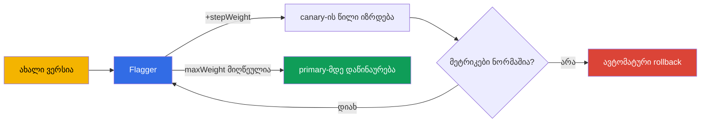

[Русская версия](ru.md) · [Eng version](en.md) · [Versión en español](es.md) · [Version française](fr.md) · [Deutsche Version](de.md) · [繁體中文版](tw.md) · [日本語版](jp.md)

# თავი 25. პროგრესული მიწოდება Flagger-ით

> **იწყება ნაწილი 2** - რეალურ გარემოში ექსპლუატაციის საუკეთესო პრაქტიკები. აქ განხილულია
> თემები, რომლებიც გამოცდაში არ გვხვდება (ან თითქმის არ გვხვდება), მაგრამ production-ში
> აუცილებელია. პირველი მათგანი პროგრესული მიწოდებაა. მე-6 თავში canary ხელით გავაკეთეთ,
> VirtualService-ში წონების შეცვლით. ეს მუშაობს, მაგრამ პროცესის სამართავად ადამიანი სჭირდება.
> Flagger მთელ პროცესს მეტრიკების ანალიზითა და ავტომატური rollback-ით ავტომატიზებს.

## 25.1. ხელით მართვადი canary-ის პრობლემა

გაიხსენეთ მე-6 თავის canary: ცვლით წონებს 90/10-ზე, შემდეგ 70/30-ზე, აკვირდებით
დეშბორდებს და წყვეტთ, განაგრძოთ თუ rollback შეასრულოთ. ნაკლოვანებები აშკარაა:

- **ადამიანია საჭირო.** ვიღაც უნდა იჯდეს, ხელით ცვლიდეს წონებს და მეტრიკებს აკვირდებოდეს.
- **ნელია და ღამით ხდება.** განახლებებს ხშირად არასასიამოვნო დროს, ზედამხედველობის ქვეშ
  ავრცელებენ.
- **ადამიანური ფაქტორი.** შეცდომების ან დაყოვნების ზრდა ადვილად შეიძლება გამოგრჩეთ და
  ცუდი ვერსია გაავრცელოთ.

პროგრესული მიწოდება (progressive delivery) ხელით შრომას გამორიცხავს: სისტემა ტრაფიკს
თავად გადაიტანს ეტაპობრივად, ყოველ ნაბიჯზე შეამოწმებს მეტრიკებს და ან განაგრძობს, ან
rollback-ს შეასრულებს - ადამიანის ჩარევის გარეშე.

## 25.2. რა არის Flagger

**Flagger** პროგრესული მიწოდების ოპერატორია, რომელიც Istio-ს (და სხვა mesh-ების) თავზე
მუშაობს. თქვენ `Canary` რესურსით აღწერთ, როგორ უნდა წარიმართოს განახლება, Flagger კი თავად:

- ამჩნევს Deployment-ის ახალ ვერსიას;
- VirtualService/DestinationRule-ში წონების შეცვლით ტრაფიკს ეტაპობრივად გადაიტანს მასზე;
- ყოველ ნაბიჯზე აანალიზებს მეტრიკებს (წარმატების მაჩვენებელს, დაყოვნებას);
- კარგი მეტრიკებისას ზრდის წილს, ცუდისას კი rollback-ს ასრულებს;
- მიზნის მიღწევისას ახალ ვერსიას ძირითადამდე „აწინაურებს“ (promote).



მთავარი იდეა: განახლების **წესებს** ერთხელ განსაზღვრავთ, შემდეგ კი ყოველი რელიზი მათ
ავტომატურად და უსაფრთხოდ მიჰყვება.

## 25.3. როგორ მუშაობს Flagger Istio-სთან

Flagger საკუთარ მარშრუტიზაციას არ იგონებს - ის Istio-ს იმ რესურსებს იყენებს, რომლებიც
მე-5 და მე-6 თავებში განვიხილეთ. როდესაც `podinfo` Deployment-ისთვის `Canary`-ს ქმნით,
Flagger მის გარშემო მთელ საჭირო ინფრასტრუქტურას ქმნის:

- Deployment-ის ასლს `podinfo-primary` (სტაბილური ვერსია, რომელზეც ამჟამად მიდის ტრაფიკი);
- სერვისებს `podinfo`, `podinfo-canary`, `podinfo-primary`;
- `DestinationRule`-სა და `VirtualService`-ს, რომლებშიც ის წონებს მართავს.

შემდეგ, საწყისი Deployment-ის ყოველი განახლებისას, Flagger ამ VirtualService-ში წონებს
თავად ცვლის - ანუ ზუსტად იმას აკეთებს, რასაც მე-6 თავში ხელით აკეთებდით, ოღონდ
ავტომატურად და მეტრიკების შემოწმებით.

## 25.4. Flagger-ის დაყენება

Flagger Istio-ს შემადგენლობაში არ შედის - ის ცალკე, ჩვეულებრივ Helm-ის მეშვეობით ყენდება.
მას ორი რამ სჭირდება: მითითება, რომ mesh არის Istio, და Prometheus-ის მისამართი (მე-17
თავის მეტრიკები ანალიზის საფუძველია).

```bash
helm repo add flagger https://flagger.app
helm repo update

helm install flagger flagger/flagger \
  -n istio-system \
  --set meshProvider=istio \
  --set metricsServer=http://prometheus.istio-system:9090
```

- **`meshProvider=istio`** - Flagger წონებს Istio-ს VirtualService/
  DestinationRule-ის მეშვეობით მართავს.
- **`metricsServer`** - საიდან აიღოს ანალიზისთვის მეტრიკები (თქვენი Prometheus).

შემოწმებებისა და დატვირთვის გენერირებისთვის (`Canary`-ის webhooks) აპლიკაციის namespace-ში
load-tester-იც ყენდება:

```bash
helm install flagger-loadtester flagger/loadtester -n test
```

წინაპირობები: დაყენებული Istio (თავები 2–3) და გამართული Prometheus (თავი 17). მეტრიკების
გარეშე Flagger განახლებას ვერ გააანალიზებს.

## 25.5. რესურსი Canary

განახლების მთელი კონფიგურაცია ერთ რესურსში აღიწერება. განვიხილოთ მთავარი ველები:

```yaml
apiVersion: flagger.app/v1beta1
kind: Canary
metadata:
  name: podinfo
  namespace: test
spec:
  targetRef:
    apiVersion: apps/v1
    kind: Deployment
    name: podinfo            # რომელ დეპლოიმენტს ვახორციელებთ
  service:
    port: 9898
  analysis:
    interval: 30s            # რამდენად ხშირად შემოწმდეს
    threshold: 5             # რამდენი ჩავარდნა ზედიზედ დაბრუნებამდე
    maxWeight: 50            # რომელ წილამდე ავიყვანოთ canary
    stepWeight: 10           # წონის გაზრდის ნაბიჯი
    metrics:
    - name: request-success-rate
      thresholdRange:
        min: 99              # წარმატებულობა არანაკლებ 99%
      interval: 1m
    - name: request-duration
      thresholdRange:
        max: 500             # დაყოვნება არაუმეტეს 500 მწმ
      interval: 1m
    webhooks:
    - name: load-test
      url: http://flagger-loadtester.test/   # დატვირთვის გენერაცია შესამოწმებლად
```

- **`targetRef`** - რომელი Deployment უნდა განახლდეს.
- **`analysis.interval` / `stepWeight` / `maxWeight`** - განახლების რიტმი და ნაბიჯები
  (ყოველ 30 წამში ტრაფიკის 10%-ის დამატება, მაქსიმუმ 50%-მდე, შემდეგ promote).
- **`threshold`** - rollback-მდე დაშვებული ზედიზედ წარუმატებელი შემოწმებების რაოდენობა.
- **`metrics`** - რა ჩაითვალოს წარმატებად: მოთხოვნების წარმატების მაჩვენებელი და დაყოვნება
  (აიღება Istio-ს მეტრიკებიდან, თავი 17). სწორედ ეს არის „კარგი/ცუდის“ ავტომატური კრიტერიუმი.
- **`webhooks`** - გარე შემოწმებები: დატვირთვის გენერირება, acceptance-ტესტები. ტრაფიკის
  გარეშე მეტრიკები არ დაგროვდება, ამიტომ load-test ჩვეულებრივ აუცილებელია.

## 25.6. როგორ მიმდინარეობს განახლება: promote და rollback

როდესაც `podinfo` Deployment-ში image-ს აახლებთ, Flagger ციკლს იწყებს:

1. ტრაფიკის `stepWeight` პროცენტს ახალ ვერსიაზე მიმართავს (მაგალითად, 10%-ს).
2. ელოდება `interval`-ს და ამოწმებს მეტრიკებს (წარმატებას, დაყოვნებას).
3. თუ მეტრიკები ზღვრებშია, წონას კიდევ ერთი ნაბიჯით ზრდის (20%, 30%, ...).
4. თუ მეტრიკები ზედიზედ `threshold`-ჯერ ცუდია, ასრულებს **rollback-ს**: მთელ ტრაფიკს
   primary-ზე აბრუნებს, canary კი უქმდება.
5. კარგი მეტრიკებით `maxWeight`-ის მიღწევისას სრულდება **promote**: ახალი ვერსია primary-ში
   კოპირდება და ძირითადი ხდება, მთელი ტრაფიკი კი მასზე გადადის.

ეს ყველაფერი ადამიანის მონაწილეობის გარეშე ხდება. Canary-ის ლოგებში პროგრესი ჩანს:
`Advance podinfo.test canary weight 20/40/50`, ბოლოს კი `Promotion completed!` - ან rollback,
თუ რამე არასწორად წარიმართა.

შედეგად, ცუდი ვერსია ყველა მომხმარებლამდე ვერ მიაღწევს - ობიექტური მეტრიკების საფუძველზე
ის ტრაფიკის მცირე წილზევე ავტომატურად გამოირიცხება.

## 25.7. განახლების სხვა სტრატეგიები

25.5 განყოფილების წონიანი canary მხოლოდ ერთი სტრატეგიაა. იმავე `Canary` რესურსით (და Istio-ს
იმავე ინფრასტრუქტურით) Flagger კიდევ სამ სტრატეგიას უჭერს მხარს; იცვლება მხოლოდ `analysis`
ბლოკი.

**Blue/Green** - წონა ეტაპობრივად არ იზრდება: ახალი ვერსია ჯერ „გვერდზე“ გადის N
შემოწმებას და მხოლოდ ამის შემდეგ გადადის მთელი ტრაფიკი მასზე. განისაზღვრება `iterations`-ით,
`stepWeight`-ის გარეშე:

```yaml
  analysis:
    interval: 30s
    threshold: 5
    iterations: 10          # 10 წარმატებული შემოწმება ზედიზედ - და გადავრთავთ 100%-ს ერთბაშად
    metrics:
    - name: request-success-rate
      thresholdRange: {min: 99}
      interval: 1m
```

**A/B-ტესტირება** - ტრაფიკი იყოფა არა წონის, არამედ მოთხოვნის ნიშნის მიხედვით: header-ით
ან cookie-ით. ეს სასარგებლოა, როდესაც ახალი ვერსია კონკრეტულ სეგმენტს უნდა აჩვენოთ
(ბეტა-მომხმარებლებს, შიდა თანამშრომლებს). მარშრუტიზაცია `match`-ის მეშვეობით ხდება - იგივე
სინტაქსით, რაც `VirtualService`-შია (თავები 6 და 15):

```yaml
  analysis:
    interval: 30s
    threshold: 5
    iterations: 10
    match:                  # canary-ზე მიდის მხოლოდ ამ სათაურის მქონე მოთხოვნები
    - headers:
        x-canary:
          exact: "insider"
    metrics:
    - name: request-success-rate
      thresholdRange: {min: 99}
      interval: 1m
```

**Traffic mirroring (shadowing)** - მოთხოვნების ასლი canary-ზე სარკისებურად გადაიგზავნება,
მაგრამ canary-ის პასუხი მომხმარებელს **არ უბრუნდება** (თავი 11). ამ გზით ახალი ვერსია რეალურ
ტრაფიკზე მოწმდება, მომხმარებლებისთვის ყოველგვარი რისკის გარეშე:

```yaml
  analysis:
    interval: 30s
    threshold: 5
    iterations: 10
    mirror: true            # ვამრავლებთ ტრაფიკს canary-ზე, პასუხს ვაგდებთ
    metrics:
    - name: request-success-rate
      thresholdRange: {min: 99}
      interval: 1m
```

სტრატეგიის არჩევა რისკსა და ამოცანაზეა დამოკიდებული: canary უნივერსალური ნაგულისხმევი
არჩევანია; Blue/Green გამოიყენება, როდესაც დატვირთვის ქვეშ ორი ვერსიის ერთდროულად შენარჩუნება
არ შეიძლება; A/B - მიზნობრივი შემოწმებისთვის; mirroring - მომხმარებლებზე გავლენის გარეშე
„საბრძოლო“ შემოწმებისთვის.

## 25.8. მორგებული მეტრიკები: MetricTemplate

ჩაშენებული `request-success-rate` და `request-duration` ყოველთვის საკმარისი არ არის: ზოგჯერ
წარმატების კრიტერიუმი ბიზნეს-მეტრიკაა (კონვერსია, კონკრეტული endpoint-ის შეცდომების წილი) ან
გარე სისტემის მეტრიკა. ამისთვის არსებობს ცალკე CRD `MetricTemplate`: მასში აღწერთ
პროვაიდერსა და ნებისმიერ query-ს, რომელიც რიცხვს აბრუნებს, შემდეგ კი `Canary`-დან ამ
შაბლონს მიმართავთ.

```yaml
apiVersion: flagger.app/v1beta1
kind: MetricTemplate
metadata:
  name: not-found-percentage
  namespace: test
spec:
  provider:
    type: prometheus
    address: http://prometheus.istio-system:9090
  query: |                                   # 404-ის წილი canary-ს მოთხოვნების საერთო რაოდენობაში
    100 - sum(
        rate(istio_requests_total{
          destination_workload="podinfo",
          response_code!="404"
        }[{{ interval }}])
    )
    /
    sum(
        rate(istio_requests_total{
          destination_workload="podinfo"
        }[{{ interval }}])
    ) * 100
```

ახლა ეს შაბლონი `Canary`-ში ჩაშენებული მეტრიკების მსგავსად, `templateRef`-ის მეშვეობით
ერთდება:

```yaml
  analysis:
    metrics:
    - name: "404s percentage"
      templateRef:
        name: not-found-percentage          # მითითება ზემოთ მოცემულ MetricTemplate-ზე
        namespace: test
      thresholdRange:
        max: 5                               # არაუმეტეს 5% 404 პასუხისა
      interval: 1m
```

პროვაიდერი შეიძლება მხოლოდ Prometheus არ იყოს: Flagger, სხვებთან ერთად, CloudWatch-ს,
Datadog-სა და New Relic-საც უჭერს მხარს - ანუ rollback-ის კრიტერიუმი AWS-ის მეტრიკებზეც
შეიძლება ააგოთ (იხილეთ შემდეგი განყოფილებები). `{{ interval }}` შაბლონსა და სხვა ცვლადებს
Flagger ანალიზის ყოველ ნაბიჯზე თავად ჩასვამს.

## 25.9. ჰუკები (webhooks): შემოწმებები და ხელით სამართავი gate-ები

25.5 განყოფილებაში ერთი webhook - დატვირთვის გენერატორი - ვნახეთ. სინამდვილეში Flagger
ჰუკებს განახლების სხვადასხვა ფაზაში იძახებს და ეს კონტროლის მძლავრი ინსტრუმენტია. ძირითადი
ტიპებია:

- **`confirm-rollout`** - gate განახლების დაწყებამდე: სანამ ჰუკი 200-ს არ დააბრუნებს,
  განახლება არ დაიწყება (მაგალითად, ველოდებით დადასტურებას ან რელიზის ფანჯარას).
- **`pre-rollout`** - ახალი ვერსიის acceptance-ტესტები ტრაფიკის გაზრდამდე; წარუმატებლობა
  განახლებას შეწყვეტს.
- **`rollout`** - დატვირთვის გენერირება ანალიზის დროს (სწორედ ის load-test).
- **`confirm-promotion`** - ხელით სამართავი gate promote-მდე: მოსახერხებელია, როდესაც
  საბოლოო გადართვა ადამიანმა უნდა დაადასტუროს.
- **`post-rollout`** - მოქმედებები წარმატებული promote-ის შემდეგ (გასუფთავება, შეტყობინებები).
- **`rollback`** - rollback-ისას გამოიძახება.
- **`event`** - Flagger განახლების ყველა მოვლენას აქ აგზავნის (გარე სისტემებისთვის/alert-ებისთვის).

მაგალითი: acceptance-ტესტი ტრაფიკის ჩართვამდე და ხელით სამართავი gate promote-ისთვის.

```yaml
  analysis:
    webhooks:
    - name: acceptance-test
      type: pre-rollout                       # ტესტი ტრაფიკის ზრდამდე
      url: http://flagger-loadtester.test/
      timeout: 30s
      metadata:
        type: bash
        cmd: "curl -sd 'test' http://podinfo-canary.test:9898/token | grep token"
    - name: load-test
      type: rollout                           # დატვირთვა ანალიზის დროს
      url: http://flagger-loadtester.test/
      metadata:
        cmd: "hey -z 1m -q 10 -c 2 http://podinfo-canary.test:9898/"
    - name: manual-gate
      type: confirm-promotion                 # ადამიანი ადასტურებს პრომოუტს
      url: http://flagger-loadtester.test/gate/halt
```

ხელით სამართავი gate `confirm-promotion` განახლებას `maxWeight`-ზე აჩერებს, სანამ გაგრძელების
ნებართვას არ მიიღებს (load-tester-ის API-ით: `gate/open`). ასე ერწყმის ავტომატური ანალიზი
ადამიანის კონტროლს: მანქანა მეტრიკებს ამოწმებს, ხოლო საბოლოო სიტყვა ადამიანს ეკუთვნის, თუ
რელიზი ამას მოითხოვს.

## 25.10. მაგალითი: ეტაპობრივი დანერგვა და კონტროლი

განვიხილოთ კონკრეტული მაგალითი: გვაქვს ჩვეულებრივი `podinfo` Deployment და გვინდა, რომ მისი
რელიზები Flagger-ის მეშვეობით განხორციელდეს. მთელ პროცესს ნაბიჯ-ნაბიჯ გავივლით.

### საწყისი კონფიგურაცია

**ნაბიჯი 1. წინაპირობები.** Istio დაყენებულია (თავები 2–3), Prometheus მუშაობს (თავი 17),
Flagger და load-tester დაყენებულია (განყოფილება 25.4), namespace კი ინექციისთვის მონიშნულია:

```bash
kubectl create namespace test
kubectl label namespace test istio-injection=enabled
```

**ნაბიჯი 2. ვათავსებთ აპლიკაციას.** ჩვეულებრივი Deployment და Service - არაფერი განსაკუთრებული:

```bash
kubectl apply -n test -f podinfo-deployment.yaml   # Deployment + Service :9898
kubectl get pods -n test          # კონტროლი: pod-ები 2/2 (sidecar ადგილზეა)
```

**ნაბიჯი 3. ვქმნით Canary რესურსს** (25.5 განყოფილებიდან) და ინიციალიზაციას ველოდებით:

```bash
kubectl apply -n test -f podinfo-canary.yaml
kubectl -n test get canary podinfo -w
```

**კონტროლი ამ ნაბიჯზე.** დაელოდეთ `Initialized` სტატუსს. დარწმუნდით, რომ Flagger-მა მთელი
საჭირო ინფრასტრუქტურა შექმნა:

```bash
kubectl -n test get canary podinfo     # STATUS: Initialized
kubectl -n test get deploy             # გამოჩნდა podinfo-primary
kubectl -n test get svc                # podinfo, podinfo-canary, podinfo-primary
kubectl -n test get vs,dr              # VirtualService და DestinationRule შეიქმნა
```

თუ პროცესი `Initialized`-მდე გაიჭედა, იხილეთ Flagger-ის ლოგები:
`kubectl logs -n istio-system deploy/flagger`.

### ყოველდღიური გამოყენება

შემდეგ ყველაფერი მარტივია: **თქვენ მხოლოდ Deployment-ის image-ს აახლებთ, დანარჩენს კი
Flagger აკეთებს.**

**ნაბიჯი 4. ვიწყებთ რელიზს** - ვცვლით image-ის ვერსიას:

```bash
kubectl -n test set image deployment/podinfo podinfod=stefanprodan/podinfo:6.1.0
```

**ნაბიჯი 5. ვაკვირდებით განახლებას.** Flagger თავად იწყებს ტრაფიკის გადაადგილებასა და
მეტრიკების შემოწმებას:

```bash
kubectl -n test get canary podinfo -w
```

**კონტროლი პროცესის დროს.** სტატუსი გაივლის `Progressing`-ს და ბოლოს გახდება `Succeeded`
(ან rollback-ისას `Failed`). დეტალები მოვლენებში ჩანს:

```bash
kubectl -n test describe canary podinfo
# ... Advance podinfo.test canary weight 10
# ... Advance podinfo.test canary weight 20
# ... Promotion completed!
```

**ნაბიჯი 6. რა ჩანს პრობლემის დროს.** თუ ახალმა ვერსიამ მეტრიკები გააუარესა, Flagger
ტრაფიკს თავად დააბრუნებს, სტატუსი `Failed` გახდება, მოვლენებში კი მიზეზი გამოჩნდება
(მაგალითად, დაყოვნების ზღვრის გადაჭარბება). მომხმარებლები თითქმის არ დაზარალდებიან - ცუდმა
ვერსიამ ტრაფიკის მხოლოდ მცირე წილის მიღება მოასწრო.

### როგორ ვაკონტროლოთ ყოველდღიურად

- **Canary-ის სტატუსი** - მთავარი ინდიკატორია: `kubectl get canary -A` აჩვენებს ყველა
  განახლებასა და მათ მდგომარეობას (`Progressing`/`Succeeded`/`Failed`).
- **Flagger-ის დეშბორდი Grafana-ში** - ვიზუალურად აჩვენებს განახლების მიმდინარეობასა და
  მეტრიკებს.
- **Alert-ები `Failed`-ზე** - მოაწყვეთ შეტყობინებები (Flagger-ს Slack/webhook-ში გაგზავნა
  შეუძლია), რათა გუნდმა rollback-ების შესახებ დაუყოვნებლივ შეიტყოს.
- **მოვლენები და ლოგები** - `describe canary` და Flagger-ის ლოგები იმის გასარკვევად, თუ რატომ
  წარიმართა განახლება არასწორად.

არსი ისაა, რომ საწყისი კონფიგურაციის შემდეგ ყოველდღიური რელიზი image-ის განახლებამდე
დაიყვანება - უსაფრთხოების მთელ კონტროლს Flagger იღებს საკუთარ თავზე, თქვენ კი მხოლოდ
სტატუსს უნდა ადევნოთ თვალი და alert-ებზე მოახდინოთ რეაგირება.

### Prometheus-ის alert-ების მაგალითი

იმისთვის, რომ „რაღაც არასწორად წავიდა“ ავტომატურად და არა ხელით გაიგოთ, მოაწყვეთ alert-ები
Istio-ს მეტრიკებზე (თავი 17). ისინი `PrometheusRule`-ის სახით ფორმდება (Prometheus
Operator-ისთვის). ქვემოთ სამი საბაზისო წესია.

```yaml
apiVersion: monitoring.coreos.com/v1
kind: PrometheusRule
metadata:
  name: istio-app-alerts
  namespace: monitoring
spec:
  groups:
  - name: istio.rules
    rules:
    # 1. მაღალი 5xx შეცდომების წილი (> 5% 5 წუთში)
    - alert: HighErrorRate
      expr: |
        sum(rate(istio_requests_total{destination_workload="podinfo", response_code=~"5.."}[5m]))
        / sum(rate(istio_requests_total{destination_workload="podinfo"}[5m])) > 0.05
      for: 2m
      labels: {severity: critical}
      annotations:
        summary: "ბევრი 5xx podinfo-სთან (>5%)"

    # 2. მაღალი დაყოვნება p99 (> 500 მწმ)
    - alert: HighLatencyP99
      expr: |
        histogram_quantile(0.99,
          sum(rate(istio_request_duration_milliseconds_bucket{destination_workload="podinfo"}[5m])) by (le)
        ) > 500
      for: 5m
      labels: {severity: warning}
      annotations:
        summary: "podinfo-ს p99 დაყოვნება 500 მწმ-ზე მაღალია"

    # 3. Flagger-მა დააბრუნა გაშვება
    - alert: CanaryFailed
      expr: flagger_canary_status{name="podinfo"} == 2
      for: 1m
      labels: {severity: critical}
      annotations:
        summary: "Flagger-მა დააბრუნა podinfo-ს canary გაშვება"
```

განვიხილოთ:

- **HighErrorRate** - `istio_requests_total` მეტრიკით ითვლის სერვისის მოთხოვნების საერთო
  რაოდენობაში `5xx` პასუხების წილს. 5 წუთში 5%-იანი ზღვარი იგივე სიგნალია, რომლითაც თავად
  Flagger-იც ხელმძღვანელობს.
- **HighLatencyP99** - `istio_request_duration_milliseconds_bucket` ჰისტოგრამიდან დაყოვნების
  99-ე პერცენტილს იღებს. p99-ის ზრდა ხშირად პრობლემის პირველი ნიშანია.
- **CanaryFailed** - თავად Flagger-ის მეტრიკას აკვირდება: მნიშვნელობა `2` განახლების
  წარუმატებლობას ნიშნავს (სტატუსის მნიშვნელობების ზუსტი შესაბამისობა Flagger-ის
  დოკუმენტაციაში გადაამოწმეთ - ვერსიებს შორის შეიძლება განსხვავდებოდეს).

ეს alert-ები Canary-ის სტატუსს ავსებს: Flagger ცუდ ვერსიას თავად დააბრუნებს, Prometheus კი
გუნდს შეატყობინებს, რომ rollback მოხდა და მიუთითებს მიზეზს (შეცდომები ან დაყოვნება).

## 25.11. Flagger EKS/AWS-ზე

Flagger-ის ანალიზის საფუძველი მეტრიკებია (თავი 17), EKS-ზე კი მათი წყარო ხშირად არა
in-cluster Prometheus, არამედ AWS-ის მართვადი სერვისებია. განვიხილოთ მთავარი საკითხები.

**მეტრიკები Amazon Managed Prometheus-იდან (AMP).** დამოუკიდებელი Prometheus-ის ნაცვლად,
Istio-ს მეტრიკები შეგიძლიათ AMP-ში ჩაწეროთ და Flagger-იც იქიდან მოამარაგოთ. ჩვეულებრივი
`metricsServer`-ისგან განსხვავებით, AMP-ის მოთხოვნებს SigV4 ხელმოწერა სჭირდება (წვდომა IAM-ის
მეშვეობით). ჩვეულებრივ Flagger-სა და AMP-ს შორის proxy-sidecar-ს ათავსებენ (მაგალითად,
`aws-sigv4-proxy`), რომელიც მოთხოვნებს IRSA-ს მეშვეობით აწერს ხელს, Flagger კი მას ჩვეულებრივ
Prometheus-ად მიმართავს:

```yaml
# MetricTemplate, რომელიც მიუთითებს SigV4-proxy-ზე AMP-ის წინ
apiVersion: flagger.app/v1beta1
kind: MetricTemplate
metadata:
  name: success-rate-amp
  namespace: test
spec:
  provider:
    type: prometheus
    address: http://localhost:8005            # sigv4-proxy -> AMP workspace
  query: |
    100 - sum(
        rate(istio_requests_total{
          destination_workload="podinfo",
          response_code=~"5.."
        }[{{ interval }}])
    )
    /
    sum(rate(istio_requests_total{destination_workload="podinfo"}[{{ interval }}])) * 100
```

სქემა „canary + rollback AMP-ის მეტრიკებზე + Flagger“ აღწერილია
[AWS-ის ოფიციალურ ბლოგში](https://aws.amazon.com/blogs/opensource/performing-canary-deployments-and-metrics-driven-rollback-with-amazon-managed-service-for-prometheus-and-flagger).

**Rollback-ის შეტყობინებები Slack/SNS-ში.** Flagger-ს მოვლენების გაგზავნა `event`-webhook-ის
ან ჩაშენებული alert-ების მეშვეობით შეუძლია. AWS-ზე rollback-ების SNS-ში გადაგზავნაა
მოსახერხებელი (შემდეგ კი - Chatbot/Slack-ში, ელფოსტაზე, PagerDuty-ში), რათა გუნდმა `Failed`-ის
შესახებ დაუყოვნებლივ შეიტყოს.

**Gateway API-ის პროვაიდერი.** თუ კლასიკური Gateway/VirtualService-ის ნაცვლად Gateway API-ს
იყენებთ (თავი 11), Flagger-ს წონების მისი მეშვეობით მართვაც შეუძლია -
`meshProvider=gatewayapi`. ეს სასარგებლოა EKS-ზე Gateway API-ის განმახორციელებელ
ingress-controller-ებთან. ანალიზისა და rollback-ის ლოგიკა უცვლელი რჩება.

## 25.12. საუკეთესო პრაქტიკები production-ისთვის

- **სწორი მეტრიკები და ზღვრები ყველაფრის საფუძველია.** Flagger იმდენად კარგია, რამდენადაც
  ზუსტია კრიტერიუმები. დაიწყეთ მოთხოვნების წარმატების მაჩვენებლითა და დაყოვნებით (p99),
  საჭიროებისას კი დაამატეთ მორგებული მეტრიკები (მათ შორის ბიზნეს-მეტრიკები, თავი 18).
- **ზღვრები რეალური baseline-იდან აიღეთ.** ზღვრებს შემთხვევით ნუ განსაზღვრავთ. აიღეთ
  სერვისის მეტრიკების ნორმალური მნიშვნელობები და ზღვრები მარაგით დააყენეთ, წინააღმდეგ
  შემთხვევაში ცრუ rollback-ებს მიიღებთ.
- **აუცილებლად დააგენერირეთ დატვირთვა.** ტრაფიკის გარეშე მეტრიკები არ დაგროვდება და ანალიზი
  არ იმუშავებს. მოაწყვეთ load-test webhook ან დაეყრდენით რეალურ ტრაფიკს.
- **კონსერვატიული ნაბიჯები კრიტიკული სერვისებისთვის.** მცირე `stepWeight` და გონივრული
  `interval` მეტრიკებს დაგროვების საშუალებას აძლევს. ზედმეტად სწრაფი განახლება პრობლემის
  აღმოჩენას ვერ მოასწრებს.
- **Acceptance-ტესტები webhooks-ის მეშვეობით.** ტრაფიკის გაზრდამდე გაუშვით ახალი ვერსიის
  acceptance-ტესტები - ასე აღმოაჩენთ ფუნქციურ რეგრესიებს, რომლებიც წარმატების მეტრიკებში
  არ ჩანს.
- **Alert-ები rollback-ებზე.** ავტომატური rollback იმის სიგნალია, რომ ვერსია ცუდია. მოაწყვეთ
  შეტყობინებები, რათა გუნდმა ამის შესახებ დაუყოვნებლივ შეიტყოს.
- **თავად პროცესი staging-ში გამოცადეთ.** სანამ Flagger-ს production-ს ანდობთ, დარწმუნდით,
  რომ განახლება, promote და rollback გამართულად მუშაობს.

## 25.13. თავის შეჯამება

- პროგრესული მიწოდება canary-ს ავტომატიზებს: სისტემა თავად გადაადგილებს ტრაფიკს, ამოწმებს
  მეტრიკებს და ხელით შრომის გარეშე ასრულებს rollback-ს.
- **Flagger** Istio-ს თავზე მომუშავე ოპერატორია; `Canary` რესურსის წესების მიხედვით
  VirtualService/DestinationRule-ში წონებს მართავს. ის ცალკე ყენდება Helm-ის მეშვეობით,
  `meshProvider=istio`-თა და Prometheus-ის მისამართით; დატვირთვისთვის გამოიყენება load-tester.
- Flagger საჭირო ინფრასტრუქტურას ქმნის (primary Deployment, სერვისები, DR, VS) და ყოველი
  განახლებისას წონებს ავტომატურად ცვლის.
- `Canary`-ში განისაზღვრება რიტმი (`interval`, `stepWeight`, `maxWeight`), კრიტერიუმები
  (`metrics` + `thresholdRange`), შეცდომების დაშვება (`threshold`) და შემოწმებები (`webhooks`).
- იმავე რესურსით სხვა სტრატეგიებიც ხორციელდება: **Blue/Green** (`iterations` -
  `stepWeight`-ის გარეშე), **A/B** (`match` header-ების/cookie-ების მიხედვით), **mirroring**
  (`mirror: true`).
- საკუთარი კრიტერიუმები `MetricTemplate`-ის მეშვეობით განისაზღვრება - ნებისმიერი query
  Prometheus-ისთვის, CloudWatch-ისთვის, Datadog-ისთვის და სხვ. (მათ შორის ბიზნეს-მეტრიკები);
  `Canary`-ში `templateRef`-ით ერთდება.
- **Webhooks** სხვადასხვა ფაზაში გამოიძახება: `confirm-rollout`/`confirm-promotion` (ხელით
  სამართავი gate-ები), `pre-rollout` (acceptance-ტესტები), `rollout` (დატვირთვა), `rollback`,
  `event`.
- კარგი ვერსია ეტაპობრივად დაწინაურდება primary-მდე, ცუდი კი ტრაფიკის მცირე წილზევე
  ავტომატურად დაბრუნდება.
- EKS/AWS-ზე მეტრიკებს ხშირად **Amazon Managed Prometheus**-იდან იღებენ (მოთხოვნები
  SigV4-proxy/IRSA-ს მეშვეობით), rollback-ებს **SNS/Slack**-ში აგზავნიან; Gateway API-ისას
  გამოიყენება `meshProvider=gatewayapi`.
- საწყისი კონფიგურაციის შემდეგ (Deployment → Canary → `Initialized` საჭირო
  ინფრასტრუქტურით) ყოველდღიური რელიზი image-ის განახლებას ნიშნავს; კონტროლი Canary-ის
  სტატუსით (`Progressing`/`Succeeded`/`Failed`), Grafana-ს დეშბორდითა და rollback-ის
  alert-ებით ხორციელდება.
- საუკეთესო პრაქტიკები: ზუსტი მეტრიკები და baseline-იდან აღებული ზღვრები, დატვირთვის
  გენერირება, კონსერვატიული ნაბიჯები, acceptance-ტესტები, rollback-ის alert-ები და პროცესის
  staging-ში გამოცდა.

## 25.14. თვითშემოწმების კითხვები

1. ხელით მართვადი canary-ის რომელ ნაკლოვანებებს აგვარებს პროგრესული მიწოდება?
2. რას აკეთებს Flagger და როგორ არის ის დაკავშირებული Istio-ს რესურსებთან?
3. რაზეა პასუხისმგებელი `stepWeight`, `maxWeight`, `interval` და `threshold` `Canary`-ში?
4. რატომ სჭირდება Flagger-ს სამუშაოდ აუცილებლად ტრაფიკი (დატვირთვა)?
5. რატომ უნდა ავიღოთ მეტრიკების ზღვრები რეალური baseline-იდან და არა შემთხვევით?
6. რით განსხვავდება canary, Blue/Green, A/B და mirroring სტრატეგიები და როდის რომელი უნდა
   ავირჩიოთ?
7. რისთვისაა საჭირო `MetricTemplate` და როგორ დავუკავშიროთ საკუთარი მეტრიკა `Canary`-ს?
8. რისთვის გამოიყენება `confirm-promotion` და `pre-rollout` ჰუკები?
9. როგორ არის მოწყობილი Flagger-ის ანალიზი EKS-ზე Amazon Managed Prometheus-ით და რით
   განსხვავდება ის in-cluster Prometheus-ისგან?
10. აღწერეთ გზა ჩვეულებრივი Deployment-იდან Flagger-ის მეშვეობით ავტომატურ რელიზებამდე.
    როგორ გავაკონტროლოთ საწყისი კონფიგურაცია და როგორ - ყოველდღიური განახლებები?

## პრაქტიკა

ივარჯიშეთ Flagger-ით ავტომატურ canary-ზე: ვერსიის განახლება, მეტრიკების ანალიზი, ავტომატური
promote და ავტომატური rollback:

🧪 ლაბორატორია 25: [tasks/ica/labs/25](../../labs/25/README_GE.MD)

---
[სარჩევი](../README_GE.md) · [თავი 24](../24/ge.md) · [თავი 26](../26/ge.md)