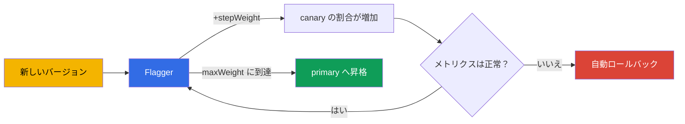

[Русская версия](ru.md) · [Eng version](en.md) · [Versión en español](es.md) · [Version française](fr.md) · [Deutsche Version](de.md) · [ქართული ვერსია](ge.md) · [繁體中文版](tw.md)

# 第25章. Flagger によるプログレッシブデリバリー

> **第2部の開始です** - 実運用のためのベストプラクティスを扱います。ここでは試験には
> ない（またはほとんど出ない）ものの、本番環境で必要になるテーマを取り上げます。最初は
> プログレッシブデリバリーです。第6章では、VirtualService の重みを変更して手動で canary を
> 実施しました。これは機能しますが、操作する人が必要です。Flagger はメトリクス分析と
> 自動ロールバックにより、プロセス全体を自動化します。

## 25.1. 手動 canary の問題

第6章の canary を思い出してください。90/10、次に 70/30 と重みを変え、ダッシュボードを確認し、
次へ進むかロールバックするかを判断します。欠点は明らかです。

- **人が必要です。** 誰かが手動で重みを変え、メトリクスを監視し続けなければなりません。
- **遅く、夜間にもなります。** デプロイは都合の悪い時間に、監視付きで実施されることがよくあります。
- **人的ミス。** エラーやレイテンシの増加を見落とし、悪いバージョンをリリースしてしまいがちです。

プログレッシブデリバリー（progressive delivery）は手作業をなくします。システム自体が
段階的にトラフィックを切り替え、各ステップでメトリクスを確認して、続行または
ロールバックを判断します - 人は不要です。

## 25.2. Flagger とは

**Flagger** は、Istio（および他のメッシュ）の上で動作するプログレッシブデリバリー用
オペレーターです。デプロイの進め方を `Canary` リソースで記述すると、Flagger が次を自動で行います。

- デプロイメントの新しいバージョンを検出する。
- VirtualService/DestinationRule の重みを変更して、段階的にそこへトラフィックを移す。
- 各ステップでメトリクス（成功率、レイテンシ）を分析する。
- メトリクスが良ければ割合を増やし、悪ければロールバックする。
- 目標に達すると、新しいバージョンをメインに「昇格」（promote）する。



重要な考え方は、一度だけデプロイの**ルール**を設定すれば、以降のすべてのリリースが
そのルールに従って自動かつ安全に進むことです。

## 25.3. Flagger と Istio の連携方法

Flagger は独自のルーティングを発明しません。第5章と第6章で取り上げた Istio リソースを
利用します。デプロイメント `podinfo` 用の `Canary` を作成すると、Flagger はその周囲に
必要な仕組み一式を展開します。

- `podinfo-primary` デプロイメントのコピー（現在トラフィックが向かう安定版）。
- `podinfo`、`podinfo-canary`、`podinfo-primary` サービス。
- 重みを管理する `DestinationRule` と `VirtualService`。

その後、元のデプロイメントが更新されるたびに、Flagger はこの VirtualService の重みを自動で
変更します。つまり、第6章で手作業で行ったことを、メトリクス検証付きで自動的に実行します。

## 25.4. Flagger のインストール

Flagger は Istio には含まれておらず、通常は Helm で別途インストールします。必要なのは二点です。
mesh が Istio であることを指定し、Prometheus のアドレスを渡します（第17章のメトリクスが
分析の基盤です）。

```bash
helm repo add flagger https://flagger.app
helm repo update

helm install flagger flagger/flagger \
  -n istio-system \
  --set meshProvider=istio \
  --set metricsServer=http://prometheus.istio-system:9090
```

- **`meshProvider=istio`** - Flagger は Istio の VirtualService/
  DestinationRule を通じて重みを管理します。
- **`metricsServer`** - 分析用メトリクスを取得する場所（あなたの Prometheus）。

検証と負荷生成（`Canary` の webhooks）には、アプリケーションの namespace に
load-tester もインストールします。

```bash
helm install flagger-loadtester flagger/loadtester -n test
```

前提条件は、インストール済みの Istio（第2～3章）と稼働中の Prometheus（第17章）です。メトリクスが
なければ、Flagger はデプロイを分析できません。

## 25.5. Canary リソース

デプロイの設定はすべて単一のリソースに記述します。主要なフィールドを見ていきましょう。

```yaml
apiVersion: flagger.app/v1beta1
kind: Canary
metadata:
  name: podinfo
  namespace: test
spec:
  targetRef:
    apiVersion: apps/v1
    kind: Deployment
    name: podinfo            # どの Deployment をロールアウトするか
  service:
    port: 9898
  analysis:
    interval: 30s            # 確認する頻度
    threshold: 5             # ロールバックまでの連続失敗回数
    maxWeight: 50            # canary を増やす上限の割合
    stepWeight: 10           # 重みの増加ステップ
    metrics:
    - name: request-success-rate
      thresholdRange:
        min: 99              # 成功率が 99% を下回らないこと
      interval: 1m
    - name: request-duration
      thresholdRange:
        max: 500             # 遅延が 500 ミリ秒を超えないこと
      interval: 1m
    webhooks:
    - name: load-test
      url: http://flagger-loadtester.test/   # 検証用の負荷生成
```

- **`targetRef`** - デプロイ対象のデプロイメント。
- **`analysis.interval` / `stepWeight` / `maxWeight`** - デプロイのペースと段階（30秒ごとに
  トラフィックを10%追加し、最大50%まで到達後に昇格）。
- **`threshold`** - 自動ロールバックまでに許容される連続した失敗検証の回数。
- **`metrics`** - 成功の定義: リクエスト成功率とレイテンシ（Istio のメトリクス、第17章から
  取得）。これが自動的な「良い／悪い」の基準になります。
- **`webhooks`** - 外部チェック: 負荷生成、受け入れテスト。トラフィックがなければ
  メトリクスが蓄積されないため、通常は load-test が必須です。

## 25.6. デプロイの進行: 昇格とロールバック

デプロイメント `podinfo` のイメージを更新すると、Flagger は次のサイクルを開始します。

1. 新しいバージョンへトラフィックの `stepWeight` パーセント（たとえば10%）を送ります。
2. `interval` 待機して、メトリクス（成功率、レイテンシ）を検証します。
3. メトリクスが閾値内であれば、さらに1ステップ分重みを増やします（20%、30%、...）。
4. メトリクスが `threshold` 回連続で悪ければ、**ロールバック**します。すべてのトラフィックを
   primary に戻し、canary は破棄されます。
5. 良好なメトリクスで `maxWeight` に達すると、**昇格**します。新バージョンが primary に
   コピーされてメインとなり、トラフィックは完全にそこへ向かいます。

これらすべてに人は関与しません。Canary のログには進捗として `Advance podinfo.test canary
weight 20/40/50`、最後には `Promotion completed!` が表示されます。何か問題が起きれば
ロールバックされます。

つまり、悪いバージョンが全ユーザーへ届くことはありません。客観的なメトリクスにより、少量の
トラフィックの段階で自動的に除外されます。

## 25.7. その他のデプロイ戦略

25.5節の重み付き canary は戦略の一つにすぎません。同じ `Canary` リソース（および同じ Istio の
仕組み）で、Flagger はさらに3つの戦略を扱えます。変更するのは `analysis` ブロックだけです。

**Blue/Green** - 段階的な重み付けはありません。新バージョンは最初に「脇で」N 回のチェックを通過し、
その後に初めてトラフィックが完全に切り替わります。`stepWeight` を指定せず、`iterations` で設定します。

```yaml
  analysis:
    interval: 30s
    threshold: 5
    iterations: 10          # 連続 10 回成功で 100% に一気に切り替える
    metrics:
    - name: request-success-rate
      thresholdRange: {min: 99}
      interval: 1m
```

**A/B テスト** - トラフィックを重みではなく、ヘッダーや cookie というリクエスト属性で分割します。
新バージョンを特定のセグメント（ベータユーザー、社内スタッフ）に表示する必要がある場合に便利です。
ルーティングには `match` を使用します。これは `VirtualService`（第6章および第15章）と同じ構文です。

```yaml
  analysis:
    interval: 30s
    threshold: 5
    iterations: 10
    match:                  # このヘッダーを持つリクエストのみ canary へ
    - headers:
        x-canary:
          exact: "insider"
    metrics:
    - name: request-success-rate
      thresholdRange: {min: 99}
      interval: 1m
```

**Traffic mirroring (shadowing)** - リクエストのコピーを canary にミラーリングしますが、canary の応答は
ユーザーへ**返しません**（第11章）。これによりユーザーへのリスクをまったく伴わず、実トラフィックで
新バージョンを検証できます。

```yaml
  analysis:
    interval: 30s
    threshold: 5
    iterations: 10
    mirror: true            # トラフィックを canary に複製し、応答は破棄する
    metrics:
    - name: request-success-rate
      thresholdRange: {min: 99}
      interval: 1m
```

戦略の選択はリスクと目的に依存します。canary は汎用的なデフォルト、Blue/Green は同時に2つの
バージョンへ負荷をかけられない場合、A/B はターゲットを絞った検証、mirroring はユーザーに
影響しない「本番」検証に適しています。

## 25.8. カスタムメトリクス: MetricTemplate

組み込みの `request-success-rate` と `request-duration` だけでは不十分な場合があります。成功基準が
ビジネスメトリクス（コンバージョン率、特定エンドポイントのエラー率）や外部システムのメトリクスで
あることもあります。そのために専用の CRD `MetricTemplate` があります。プロバイダーと数値を返す
任意のクエリをここで記述し、後から `Canary` からテンプレートを参照します。

```yaml
apiVersion: flagger.app/v1beta1
kind: MetricTemplate
metadata:
  name: not-found-percentage
  namespace: test
spec:
  provider:
    type: prometheus
    address: http://prometheus.istio-system:9090
  query: |                                   # canary への全リクエストに占める 404 の割合
    100 - sum(
        rate(istio_requests_total{
          destination_workload="podinfo",
          response_code!="404"
        }[{{ interval }}])
    )
    /
    sum(
        rate(istio_requests_total{
          destination_workload="podinfo"
        }[{{ interval }}])
    ) * 100
```

このテンプレートは、`templateRef` を介して組み込みメトリクスと同様に `Canary` で利用できます。

```yaml
  analysis:
    metrics:
    - name: "404s percentage"
      templateRef:
        name: not-found-percentage          # 上記の MetricTemplate への参照
        namespace: test
      thresholdRange:
        max: 5                               # 404 応答は 5% 以下
      interval: 1m
```

プロバイダーは Prometheus に限りません。Flagger は CloudWatch、Datadog、New Relic などもサポートします。
つまり、AWS のメトリクスを含め、任意のメトリクスをロールバック基準にできます（次の節を参照）。
`{{ interval }}` などの Flagger 変数は、各分析ステップで自動的に展開されます。

## 25.9. フック（webhooks）: チェックと手動ゲート

25.5節では負荷生成用の webhook を一つ見ました。実際には Flagger はデプロイの異なるフェーズで
フックを呼び出し、これは強力な制御手段です。主なタイプは次のとおりです。

- **`confirm-rollout`** - デプロイ開始**前**のゲート。フックが 200 を返すまでデプロイは
  始まりません（たとえば承認またはリリースウィンドウを待つ）。
- **`pre-rollout`** - トラフィックを増やす**前**の新バージョンの受け入れテスト。失敗すると
  デプロイは停止します。
- **`rollout`** - 分析中の負荷生成（先ほどの load-test）。
- **`confirm-promotion`** - 昇格**前**の手動ゲート。最終切り替えを人が確認すべき場合に便利です。
- **`post-rollout`** - 昇格成功後のアクション（クリーンアップ、通知）。
- **`rollback`** - ロールバック時に呼び出されます。
- **`event`** - Flagger はすべてのデプロイイベントをここへ送信します（外部システム／アラート用）。

例: トラフィック前の受け入れテストと、昇格時の手動ゲートです。

```yaml
  analysis:
    webhooks:
    - name: acceptance-test
      type: pre-rollout                       # トラフィックを増やす前のテスト
      url: http://flagger-loadtester.test/
      timeout: 30s
      metadata:
        type: bash
        cmd: "curl -sd 'test' http://podinfo-canary.test:9898/token | grep token"
    - name: load-test
      type: rollout                           # 分析中の負荷
      url: http://flagger-loadtester.test/
      metadata:
        cmd: "hey -z 1m -q 10 -c 2 http://podinfo-canary.test:9898/"
    - name: manual-gate
      type: confirm-promotion                 # 人がプロモートを承認する
      url: http://flagger-loadtester.test/gate/halt
```

手動ゲート `confirm-promotion` は、先へ進む許可が出るまで（load-tester の API: `gate/open` 経由）、
デプロイを `maxWeight` で保持します。このように自動分析と人間による制御を組み合わせられます。
機械がメトリクスを検証し、リリースで必要なら最終決定は人が下します。

## 25.10. 例: 段階的な導入と制御

具体例で見ていきましょう。通常の `podinfo` デプロイメントがあり、そのリリースを Flagger 経由で
行いたいとします。手順を最初から進めます。

### 初期設定

**ステップ1. 前提条件。** Istio がインストール済み（第2～3章）、Prometheus が稼働中（第17章）、
Flagger と load-tester が導入済み（25.4節）、namespace はインジェクション用にラベル付けされています。

```bash
kubectl create namespace test
kubectl label namespace test istio-injection=enabled
```

**ステップ2. アプリケーションを展開します。** 通常の Deployment と Service であり、特別なことはありません。

```bash
kubectl apply -n test -f podinfo-deployment.yaml   # Deployment + Service :9898
kubectl get pods -n test          # 確認: Pod が 2/2 (sidecar が存在)
```

**ステップ3. Canary リソースを作成**（25.5節のもの）し、初期化を待ちます。

```bash
kubectl apply -n test -f podinfo-canary.yaml
kubectl -n test get canary podinfo -w
```

**このステップでの確認。** ステータスが `Initialized` になるまで待ちます。Flagger が必要な仕組み
一式を作成したことを確認してください。

```bash
kubectl -n test get canary podinfo     # STATUS: Initialized
kubectl -n test get deploy             # podinfo-primary が現れた
kubectl -n test get svc                # podinfo, podinfo-canary, podinfo-primary
kubectl -n test get vs,dr              # VirtualService と DestinationRule が作成された
```

`Initialized` で止まらない場合は、Flagger のログを確認します。
`kubectl logs -n istio-system deploy/flagger`。

### 日常的な利用

ここからは簡単です。**デプロイメントのイメージを更新するだけで、残りは Flagger がすべて行います。**

**ステップ4. リリースを開始します** - イメージのバージョンを変更します。

```bash
kubectl -n test set image deployment/podinfo podinfod=stefanprodan/podinfo:6.1.0
```

**ステップ5. デプロイを監視します。** Flagger はトラフィックの移動とメトリクスの確認を自動的に開始します。

```bash
kubectl -n test get canary podinfo -w
```

**進行中の確認。** ステータスは `Progressing` を経て、最後に `Succeeded` になります（ロールバック時は
`Failed`）。詳細はイベントで確認できます。

```bash
kubectl -n test describe canary podinfo
# ... Advance podinfo.test canary weight 10
# ... Advance podinfo.test canary weight 20
# ... Promotion completed!
```

**ステップ6. 問題発生時に見えるもの。** 新バージョンがメトリクスを悪化させた場合、Flagger は自動的に
トラフィックをロールバックします。ステータスは `Failed` になり、イベントには原因（たとえばレイテンシの
超過）が表示されます。この間、悪いバージョンが受け取るトラフィックはごく一部だけなので、ユーザーへの
影響はほとんどありません。

### 日常的な制御方法

- **Canary ステータス** - 最も重要な指標です。`kubectl get canary -A` はすべてのデプロイと
  その状態（`Progressing`/`Succeeded`/`Failed`）を表示します。
- **Grafana の Flagger ダッシュボード** - デプロイの進行とメトリクスを視覚的に表示します。
- **`Failed` のアラート** - ロールバックをチームがすぐ把握できるよう、通知を設定します（Flagger は
  Slack/webhook へ送信できます）。
- **イベントとログ** - 何が原因でデプロイが失敗したかを調べるには、`describe canary` と Flagger のログを使います。

要点は、初期設定後の日常的なリリースはイメージ更新だけになることです。安全性の制御全体は Flagger が
引き受け、あなたはステータスを監視してアラートに対応するだけです。

### Prometheus アラートの例

何か問題が起きたことを手動ではなく自動で「把握」するため、第17章の Istio メトリクスに対する
アラートを設定します。Prometheus Operator 用には `PrometheusRule` として記述します。
以下に基本的な3つのルールを示します。

```yaml
apiVersion: monitoring.coreos.com/v1
kind: PrometheusRule
metadata:
  name: istio-app-alerts
  namespace: monitoring
spec:
  groups:
  - name: istio.rules
    rules:
    # 1. 高い 5xx エラー率 (> 5%、5 分間)
    - alert: HighErrorRate
      expr: |
        sum(rate(istio_requests_total{destination_workload="podinfo", response_code=~"5.."}[5m]))
        / sum(rate(istio_requests_total{destination_workload="podinfo"}[5m])) > 0.05
      for: 2m
      labels: {severity: critical}
      annotations:
        summary: "podinfo の 5xx が多い (>5%)"

    # 2. 高い p99 遅延 (> 500 ミリ秒)
    - alert: HighLatencyP99
      expr: |
        histogram_quantile(0.99,
          sum(rate(istio_request_duration_milliseconds_bucket{destination_workload="podinfo"}[5m])) by (le)
        ) > 500
      for: 5m
      labels: {severity: warning}
      annotations:
        summary: "podinfo の p99 遅延が 500 ミリ秒を超えている"

    # 3. Flagger がロールアウトをロールバックした
    - alert: CanaryFailed
      expr: flagger_canary_status{name="podinfo"} == 2
      for: 1m
      labels: {severity: critical}
      annotations:
        summary: "Flagger が podinfo の canary ロールアウトをロールバックした"
```

確認しましょう。

- **HighErrorRate** - `istio_requests_total` メトリクスを使い、サービスへのリクエスト総数に対する
  `5xx` 応答の割合を計算します。5分間で5%という閾値は、Flagger 自身も基準とするシグナルです。
- **HighLatencyP99** - `istio_request_duration_milliseconds_bucket` ヒストグラムから
  レイテンシの99パーセンタイルを取得します。p99 の増加は多くの場合、問題の最初の兆候です。
- **CanaryFailed** - Flagger 自体のメトリクスを監視します。値 `2` はデプロイの失敗を意味します
  （ステータス値の正確な対応は Flagger のドキュメントで確認してください。バージョン間で異なる場合があります）。

これらのアラートは Canary ステータスを補完します。Flagger は悪いバージョンを自動でロールバックし、
Prometheus はロールバックが発生したことと原因（エラーまたはレイテンシ）をチームに通知します。

## 25.11. EKS/AWS 上の Flagger

Flagger の分析基盤はメトリクス（第17章）であり、EKS ではそのソースが in-cluster Prometheus ではなく
AWS のマネージドサービスであることがよくあります。重要な点を見ていきましょう。

**Amazon Managed Prometheus (AMP) のメトリクス。** 独自に Prometheus を運用する代わりに、Istio の
メトリクスを AMP に書き込み、同じ場所から Flagger に提供できます。通常の `metricsServer` との違いは、
AMP へのリクエストには SigV4 署名（IAM によるアクセス）が必要なことです。通常、Flagger と AMP の間に
プロキシサイドカー（たとえば `aws-sigv4-proxy`）を置き、これが IRSA を通じてリクエストへ署名します。
Flagger は通常の Prometheus と同様に、このプロキシへアクセスします。

```yaml
# AMP の前段の SigV4 プロキシを指す MetricTemplate
apiVersion: flagger.app/v1beta1
kind: MetricTemplate
metadata:
  name: success-rate-amp
  namespace: test
spec:
  provider:
    type: prometheus
    address: http://localhost:8005            # sigv4-proxy -> AMP workspace
  query: |
    100 - sum(
        rate(istio_requests_total{
          destination_workload="podinfo",
          response_code=~"5.."
        }[{{ interval }}])
    )
    /
    sum(rate(istio_requests_total{destination_workload="podinfo"}[{{ interval }}])) * 100
```

「canary + AMP メトリクスによる rollback + Flagger」の構成は、
[AWS 公式ブログ](https://aws.amazon.com/blogs/opensource/performing-canary-deployments-and-metrics-driven-rollback-with-amazon-managed-service-for-prometheus-and-flagger)で説明されています。

**Slack/SNS へのロールバック通知。** Flagger は `event` webhook または組み込みアラートを通じて
イベントを送信できます。AWS ではロールバックを SNS（さらに Chatbot/Slack、メール、PagerDuty へ）に
送ると便利で、チームは `Failed` をすぐに把握できます。

**Gateway API プロバイダー。** 従来の Gateway/VirtualService ではなく Gateway API（第11章）を
使用する場合、Flagger は `meshProvider=gatewayapi` でこれを通じても重みを管理できます。Gateway API を
実装する ingress コントローラーを持つ EKS で役立ちます。分析とロールバックのロジックは同じです。

## 25.12. 本番環境のベストプラクティス

- **適切なメトリクスと閾値がすべての基盤です。** Flagger の有効性は基準の正確さに等しいものです。
  まずリクエスト成功率とレイテンシ（p99）から始め、必要に応じてカスタムメトリクス（第18章の
  ビジネスメトリクスを含む）を追加してください。
- **閾値は実際の baseline から設定します。** 推測で閾値を決めないでください。サービスの正常な
  メトリクス値を取得し、余裕を持たせて閾値を設定しなければ、誤ったロールバックが起こります。
- **必ず負荷を生成します。** トラフィックがなければメトリクスは蓄積されず、分析は機能しません。
  load-test webhook を設定するか、実トラフィックに依存してください。
- **重要なサービスには保守的なステップを使います。** 小さな `stepWeight` と妥当な `interval` により、
  メトリクスを蓄積できます。速すぎるデプロイでは問題を検出できません。
- **webhooks による受け入れテスト。** トラフィックを増やす前に新バージョンの acceptance テストを
  実行してください。これにより、成功率メトリクスでは見えない機能回帰を捕捉できます。
- **ロールバックのアラート。** 自動ロールバックはバージョンに問題があるというシグナルです。
  チームが即座に把握できるよう通知を設定してください。
- **staging でプロセス自体をテストします。** Flagger を本番で信頼する前に、デプロイ、昇格、
  ロールバックが機能することを確認してください。

## 25.13. 章のまとめ

- プログレッシブデリバリーは canary を自動化します。システム自体がトラフィックを移動し、
  メトリクスを検証して、手作業なしにロールバックします。
- **Flagger** は Istio 上のオペレーターであり、`Canary` リソースのルールに基づいて
  VirtualService/DestinationRule の重みを管理します。`meshProvider=istio` と Prometheus の
  アドレスを指定して Helm で別途インストールし、負荷用には load-tester を使用します。
- Flagger は仕組み一式（primary デプロイメント、サービス、DR、VS）を展開し、各更新時に
  自動で重みを移動します。
- `Canary` では、ペース（`interval`、`stepWeight`、`maxWeight`）、基準
  （`metrics` + `thresholdRange`）、エラー許容数（`threshold`）、チェック（`webhooks`）を設定します。
- 同じリソースで他の戦略も実現します: **Blue/Green**（`stepWeight` なしの `iterations`）、
  **A/B**（ヘッダー／cookie による `match`）、**mirroring**（`mirror: true`）。
- 独自の基準は `MetricTemplate` で設定します。これは Prometheus、CloudWatch、Datadog などへの
  任意のクエリ（ビジネスメトリクスを含む）であり、`templateRef` を介して `Canary` に接続します。
- **Webhooks** は各フェーズで呼び出されます: `confirm-rollout`/`confirm-promotion`（手動ゲート）、
  `pre-rollout`（受け入れテスト）、`rollout`（負荷）、`rollback`、`event`。
- 良いバージョンは段階的に primary へ昇格され、悪いバージョンは少量のトラフィック段階で
  自動的にロールバックされます。
- EKS/AWS ではメトリクスに **Amazon Managed Prometheus** を使うことが多く（SigV4 プロキシ/IRSA 経由の
  リクエスト）、ロールバックは **SNS/Slack** へ送信します。Gateway API では `meshProvider=gatewayapi` を使います。
- 初期設定（デプロイメント -> Canary -> 仕組み一式を伴う `Initialized`）後、日常的なリリースは
  イメージ更新だけです。Canary のステータス（`Progressing`/`Succeeded`/`Failed`）、Grafana ダッシュボード、
  ロールバックアラートで制御します。
- ベストプラクティス: 正確なメトリクスと baseline に基づく閾値、負荷生成、保守的なステップ、
  受け入れテスト、ロールバックアラート、staging での事前検証。

## 25.14. 自己確認問題

1. プログレッシブデリバリーは手動 canary のどの欠点を解決しますか？
2. Flagger は何を行い、Istio リソースとどのように関連していますか？
3. `Canary` における `stepWeight`、`maxWeight`、`interval`、`threshold` はそれぞれ何を担いますか？
4. Flagger の動作にトラフィック（負荷）が必須なのはなぜですか？
5. メトリクスの閾値を推測ではなく実際の baseline から取るべきなのはなぜですか？
6. canary、Blue/Green、A/B、mirroring の戦略はどう異なり、どの場合にどれを選びますか？
7. `MetricTemplate` は何のためにあり、独自のメトリクスを `Canary` にどう接続しますか？
8. `confirm-promotion` と `pre-rollout` のフックにはどのような用途がありますか？
9. Amazon Managed Prometheus を使う EKS で Flagger の分析はどのように構成され、
   in-cluster Prometheus と何が異なりますか？
10. 通常のデプロイメントから Flagger 経由の自動リリースまでの流れを説明してください。
    初期設定と日常的なデプロイをどのように制御しますか？

## 演習

Flagger による自動 canary を実践しましょう: バージョン更新、メトリクス分析、
自動昇格、自動ロールバックです。

🧪 ラボ 25: [tasks/ica/labs/25](../../labs/25/README_JP.MD)

---
[目次](../README_JP.md) · [第24章](../24/jp.md) · [第26章](../26/jp.md)
