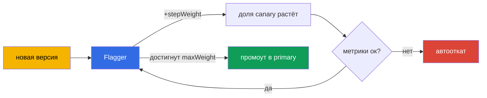

[Eng version](en.md)

# Глава 25. Прогрессивная доставка с Flagger

> **Начинается Часть 2** - best practices для реальной эксплуатации. Здесь темы, которых
> нет (или почти нет) в экзамене, но которые нужны в проде. Первая - прогрессивная
> доставка. В главе 6 мы делали canary вручную, меняя веса в VirtualService. Это
> работает, но требует человека у руля. Flagger автоматизирует весь процесс с анализом
> метрик и автооткатом.

## 25.1. Проблема ручного canary

Вспомните canary из главы 6: вы меняете веса 90/10, потом 70/30, смотрите на дашборды,
решаете, двигаться дальше или откатываться. Минусы очевидны:

- **Нужен человек.** Кто-то должен сидеть и вручную менять веса, следить за метриками.
- **Медленно и по ночам.** Выкаты часто делают в неудобное время, под присмотром.
- **Человеческий фактор.** Легко проглядеть рост ошибок или задержки и выкатить плохую
  версию.

Прогрессивная доставка (progressive delivery) убирает ручной труд: система сама
постепенно переводит трафик, на каждом шаге проверяет метрики и либо продолжает, либо
откатывается - без человека.

## 25.2. Что такое Flagger

**Flagger** - это оператор для прогрессивной доставки, который работает поверх Istio (и
других мешей). Вы описываете, как должен идти выкат, ресурсом `Canary`, а Flagger сам:

- замечает новую версию деплоймента;
- постепенно перекладывает на неё трафик, меняя веса в VirtualService/DestinationRule;
- на каждом шаге анализирует метрики (успешность, задержки);
- при хороших метриках увеличивает долю, при плохих - откатывает;
- по достижении цели «повышает» новую версию до основной (promote).



Ключевая идея: вы задаёте **правила** выката один раз, а дальше каждый релиз идёт по ним
автоматически и безопасно.

## 25.3. Как Flagger работает с Istio

Flagger не изобретает свою маршрутизацию - он использует ресурсы Istio, которые мы
разбирали в главах 5 и 6. Когда вы создаёте `Canary` для деплоймента `podinfo`, Flagger
разворачивает вокруг него всю обвязку:

- копию деплоймента `podinfo-primary` (стабильная версия, куда сейчас идёт трафик);
- сервисы `podinfo`, `podinfo-canary`, `podinfo-primary`;
- `DestinationRule` и `VirtualService`, которыми он управляет весами.

Дальше при каждом обновлении исходного деплоймента Flagger сам двигает веса в этом
VirtualService - то есть делает ровно то, что вы делали руками в главе 6, только
автоматически и с проверкой метрик.

## 25.4. Установка Flagger

Flagger не входит в Istio - его ставят отдельно, обычно через Helm. Ему нужны две вещи:
указать, что mesh это Istio, и дать адрес Prometheus (метрики из главы 17 - основа
анализа).

```bash
helm repo add flagger https://flagger.app
helm repo update

helm install flagger flagger/flagger \
  -n istio-system \
  --set meshProvider=istio \
  --set metricsServer=http://prometheus.istio-system:9090
```

- **`meshProvider=istio`** - Flagger будет управлять весами через VirtualService/
  DestinationRule Istio.
- **`metricsServer`** - откуда брать метрики для анализа (ваш Prometheus).

Для проверок и генерации нагрузки (webhooks из `Canary`) ставят ещё и load-tester в
namespace приложения:

```bash
helm install flagger-loadtester flagger/loadtester -n test
```

Предпосылки: установленный Istio (главы 2-3) и работающий Prometheus (глава 17). Без
метрик Flagger не сможет анализировать выкат.

## 25.5. Ресурс Canary

Вся настройка выката описывается в одном ресурсе. Разберём ключевые поля:

```yaml
apiVersion: flagger.app/v1beta1
kind: Canary
metadata:
  name: podinfo
  namespace: test
spec:
  targetRef:
    apiVersion: apps/v1
    kind: Deployment
    name: podinfo            # какой деплоймент выкатываем
  service:
    port: 9898
  analysis:
    interval: 30s            # как часто проверять
    threshold: 5             # сколько провалов подряд до отката
    maxWeight: 50            # до какой доли доводить canary
    stepWeight: 10           # шаг увеличения веса
    metrics:
    - name: request-success-rate
      thresholdRange:
        min: 99              # успешность не ниже 99%
      interval: 1m
    - name: request-duration
      thresholdRange:
        max: 500             # задержка не выше 500 мс
      interval: 1m
    webhooks:
    - name: load-test
      url: http://flagger-loadtester.test/   # генерация нагрузки для проверки
```

- **`targetRef`** - какой деплоймент выкатываем.
- **`analysis.interval` / `stepWeight` / `maxWeight`** - ритм и шаги выката (каждые 30с
  добавлять 10% трафика, максимум до 50%, потом промоут).
- **`threshold`** - сколько неудачных проверок подряд допустимо до автоотката.
- **`metrics`** - что считать успехом: успешность запросов и задержка (берутся из
  метрик Istio, глава 17). Это и есть автоматический критерий «хорошо/плохо».
- **`webhooks`** - внешние проверки: генерация нагрузки, приёмочные тесты. Без трафика
  метрики не наберутся, поэтому load-test обычно обязателен.

## 25.6. Как идёт выкат: промоут и откат

Когда вы обновляете образ в деплойменте `podinfo`, Flagger запускает цикл:

1. Направляет на новую версию `stepWeight` процентов трафика (например, 10%).
2. Ждёт `interval` и проверяет метрики (успешность, задержка).
3. Если метрики в пределах порогов - увеличивает вес ещё на шаг (20%, 30%, ...).
4. Если метрики плохи `threshold` раз подряд - **откатывает**: возвращает весь трафик на
   primary, canary отбрасывается.
5. По достижении `maxWeight` с хорошими метриками - **промоут**: новая версия
   копируется в primary и становится основной, трафик полностью на ней.

Всё это без участия человека. В логах Canary видно прогресс: `Advance podinfo.test canary
weight 20/40/50` и в конце `Promotion completed!` - или откат, если что-то пошло не так.

Итог: плохая версия не доедет до всех пользователей - её отсекут автоматически на малой
доле трафика по объективным метрикам.

## 25.7. Другие стратегии выката

Взвешенный canary из раздела 25.5 - лишь одна из стратегий. Тем же ресурсом `Canary` (и той
же обвязкой Istio) Flagger умеет ещё три, меняется только блок `analysis`.

**Blue/Green** - никакого постепенного веса: новая версия сначала проходит N проверок «в
сторонке», и только потом трафик переключается на неё целиком. Задаётся через `iterations`
без `stepWeight`:

```yaml
  analysis:
    interval: 30s
    threshold: 5
    iterations: 10          # 10 успешных проверок подряд - и переключаем 100% разом
    metrics:
    - name: request-success-rate
      thresholdRange: {min: 99}
      interval: 1m
```

**A/B-тестирование** - трафик делят не по весу, а по признаку запроса: заголовку или куке.
Полезно, когда новую версию надо показать конкретному сегменту (бета-пользователи,
внутренние сотрудники). Маршрутизация через `match` - тот же синтаксис, что в
`VirtualService` (главы 6 и 15):

```yaml
  analysis:
    interval: 30s
    threshold: 5
    iterations: 10
    match:                  # только запросы с этим заголовком идут на canary
    - headers:
        x-canary:
          exact: "insider"
    metrics:
    - name: request-success-rate
      thresholdRange: {min: 99}
      interval: 1m
```

**Traffic mirroring (shadowing)** - copy запросов зеркалится на canary, но ответ canary
пользователю **не отдаётся** (глава 11). Так новую версию проверяют на реальном трафике
вообще без риска для пользователей:

```yaml
  analysis:
    interval: 30s
    threshold: 5
    iterations: 10
    mirror: true            # дублируем трафик на canary, ответ отбрасываем
    metrics:
    - name: request-success-rate
      thresholdRange: {min: 99}
      interval: 1m
```

Выбор стратегии зависит от риска и задачи: canary - универсальный дефолт, Blue/Green - когда
нельзя держать две версии под нагрузкой одновременно, A/B - для таргетированной проверки,
mirroring - для «боевой» проверки без влияния на пользователей.

## 25.8. Кастомные метрики: MetricTemplate

Встроенных `request-success-rate` и `request-duration` хватает не всегда: иногда критерий
успеха - это бизнес-метрика (конверсия, доля ошибок конкретного эндпоинта) или метрика из
внешней системы. Для этого есть отдельный CRD `MetricTemplate`: в нём вы описываете
провайдера и произвольный запрос, возвращающий число, а потом ссылаетесь на шаблон из
`Canary`.

```yaml
apiVersion: flagger.app/v1beta1
kind: MetricTemplate
metadata:
  name: not-found-percentage
  namespace: test
spec:
  provider:
    type: prometheus
    address: http://prometheus.istio-system:9090
  query: |                                   # доля 404 в общем числе запросов к canary
    100 - sum(
        rate(istio_requests_total{
          destination_workload="podinfo",
          response_code!="404"
        }[{{ interval }}])
    )
    /
    sum(
        rate(istio_requests_total{
          destination_workload="podinfo"
        }[{{ interval }}])
    ) * 100
```

Теперь этот шаблон подключается в `Canary` наравне со встроенными метриками через
`templateRef`:

```yaml
  analysis:
    metrics:
    - name: "404s percentage"
      templateRef:
        name: not-found-percentage          # ссылка на MetricTemplate выше
        namespace: test
      thresholdRange:
        max: 5                               # не более 5% ответов 404
      interval: 1m
```

Провайдером может быть не только Prometheus: Flagger поддерживает в том числе CloudWatch,
Datadog, New Relic и другие - то есть критерий отката можно строить хоть на метриках AWS
(см. следующие разделы). Шаблоны `{{ interval }}` и другие переменные Flagger подставляет
сам на каждом шаге анализа.

## 25.9. Хуки (webhooks): проверки и ручные гейты

В разделе 25.5 мы видели один webhook - генератор нагрузки. На самом деле Flagger вызывает
хуки на разных фазах выката, и это мощный инструмент контроля. Основные типы:

- **`confirm-rollout`** - гейт **перед** стартом выката: пока хук не вернёт 200, выкат не
  начнётся (например, ждём одобрения или окна релиза).
- **`pre-rollout`** - приёмочные тесты новой версии **до** наращивания трафика; провал
  прекращает выкат.
- **`rollout`** - генерация нагрузки во время анализа (тот самый load-test).
- **`confirm-promotion`** - ручной гейт **перед** промоутом: удобно, когда финальное
  переключение должен подтвердить человек.
- **`post-rollout`** - действия после успешного промоута (очистка, нотификации).
- **`rollback`** - вызывается при откате.
- **`event`** - Flagger шлёт сюда все события выката (для внешних систем/алертов).

Пример: приёмочный тест перед трафиком плюс ручной гейт на промоут.

```yaml
  analysis:
    webhooks:
    - name: acceptance-test
      type: pre-rollout                       # тест ДО наращивания трафика
      url: http://flagger-loadtester.test/
      timeout: 30s
      metadata:
        type: bash
        cmd: "curl -sd 'test' http://podinfo-canary.test:9898/token | grep token"
    - name: load-test
      type: rollout                           # нагрузка во время анализа
      url: http://flagger-loadtester.test/
      metadata:
        cmd: "hey -z 1m -q 10 -c 2 http://podinfo-canary.test:9898/"
    - name: manual-gate
      type: confirm-promotion                 # человек подтверждает промоут
      url: http://flagger-loadtester.test/gate/halt
```

Ручной гейт `confirm-promotion` держит выкат на `maxWeight`, пока по нему не разрешат
двигаться дальше (через API load-tester'а: `gate/open`). Так автоматический анализ и
человеческий контроль сочетаются: машина проверяет метрики, а финальное слово - за
человеком, если релиз того требует.

## 25.10. Пример: пошаговое внедрение и контроль

Разберём на конкретном примере: у нас есть обычный деплоймент `podinfo`, и мы хотим,
чтобы его релизы шли через Flagger. Пройдём весь путь по шагам.

### Первоначальная настройка

**Шаг 1. Предпосылки.** Istio установлен (главы 2-3), Prometheus работает (глава 17),
Flagger и load-tester поставлены (раздел 25.4), namespace размечен для инъекции:

```bash
kubectl create namespace test
kubectl label namespace test istio-injection=enabled
```

**Шаг 2. Разворачиваем приложение.** Обычный Deployment и Service - ничего особенного:

```bash
kubectl apply -n test -f podinfo-deployment.yaml   # Deployment + Service :9898
kubectl get pods -n test          # контроль: поды 2/2 (sidecar на месте)
```

**Шаг 3. Создаём ресурс Canary** (из раздела 25.5) и ждём инициализацию:

```bash
kubectl apply -n test -f podinfo-canary.yaml
kubectl -n test get canary podinfo -w
```

**Контроль на этом шаге.** Дождитесь статуса `Initialized`. Убедитесь, что Flagger создал
всю обвязку:

```bash
kubectl -n test get canary podinfo     # STATUS: Initialized
kubectl -n test get deploy             # появился podinfo-primary
kubectl -n test get svc                # podinfo, podinfo-canary, podinfo-primary
kubectl -n test get vs,dr              # VirtualService и DestinationRule созданы
```

Если застряло не на `Initialized` - смотрите логи Flagger:
`kubectl logs -n istio-system deploy/flagger`.

### Ежедневное использование

Дальше жизнь простая: **вы просто обновляете образ деплоймента, а Flagger делает всё
остальное.**

**Шаг 4. Запускаем релиз** - меняем версию образа:

```bash
kubectl -n test set image deployment/podinfo podinfod=stefanprodan/podinfo:6.1.0
```

**Шаг 5. Наблюдаем за выкатом.** Flagger сам начинает двигать трафик и проверять метрики:

```bash
kubectl -n test get canary podinfo -w
```

**Контроль в процессе.** Статус проходит `Progressing` и в конце `Succeeded` (или
`Failed` при откате). Детали видно в событиях:

```bash
kubectl -n test describe canary podinfo
# ... Advance podinfo.test canary weight 10
# ... Advance podinfo.test canary weight 20
# ... Promotion completed!
```

**Шаг 6. Что видно при проблеме.** Если новая версия ухудшила метрики, Flagger сам
откатит трафик, статус станет `Failed`, а в событиях будет причина (например, превышена
задержка). Пользователи при этом почти не пострадают - плохая версия успела получить лишь
малую долю трафика.

### Как контролировать в повседневности

- **Статус Canary** - главный индикатор: `kubectl get canary -A` показывает все выкаты и
  их состояние (`Progressing`/`Succeeded`/`Failed`).
- **Дашборд Flagger в Grafana** - визуально показывает ход выката и метрики.
- **Алерты на `Failed`** - настройте уведомления (Flagger умеет слать в Slack/webhook),
  чтобы команда сразу знала об откатах.
- **События и логи** - `describe canary` и логи Flagger для разбора, почему выкат пошёл
  не так.

Смысл в том, что после первоначальной настройки ежедневный релиз сводится к обновлению
образа - весь контроль безопасности берёт на себя Flagger, а вам остаётся следить за
статусом и реагировать на алерты.

### Пример алертов Prometheus

Чтобы «понимать, что что-то пошло не так» не вручную, а автоматически, настройте
алерты на метрики Istio (глава 17). Оформляются они как `PrometheusRule` (для Prometheus
Operator). Вот три базовых правила.

```yaml
apiVersion: monitoring.coreos.com/v1
kind: PrometheusRule
metadata:
  name: istio-app-alerts
  namespace: monitoring
spec:
  groups:
  - name: istio.rules
    rules:
    # 1. Высокая доля ошибок 5xx (> 5% за 5 минут)
    - alert: HighErrorRate
      expr: |
        sum(rate(istio_requests_total{destination_workload="podinfo", response_code=~"5.."}[5m]))
        / sum(rate(istio_requests_total{destination_workload="podinfo"}[5m])) > 0.05
      for: 2m
      labels: {severity: critical}
      annotations:
        summary: "Много 5xx у podinfo (>5%)"

    # 2. Высокая задержка p99 (> 500 мс)
    - alert: HighLatencyP99
      expr: |
        histogram_quantile(0.99,
          sum(rate(istio_request_duration_milliseconds_bucket{destination_workload="podinfo"}[5m])) by (le)
        ) > 500
      for: 5m
      labels: {severity: warning}
      annotations:
        summary: "p99 задержки podinfo выше 500 мс"

    # 3. Flagger откатил выкат
    - alert: CanaryFailed
      expr: flagger_canary_status{name="podinfo"} == 2
      for: 1m
      labels: {severity: critical}
      annotations:
        summary: "Flagger откатил канареечный выкат podinfo"
```

Разберём:

- **HighErrorRate** - считает долю ответов `5xx` от общего числа запросов к сервису по
  метрике `istio_requests_total`. Порог 5% за 5 минут - это тот же сигнал, по которому
  ориентируется и сам Flagger.
- **HighLatencyP99** - берёт 99-й перцентиль задержки из гистограммы
  `istio_request_duration_milliseconds_bucket`. Рост p99 часто первый признак проблем.
- **CanaryFailed** - следит за метрикой самого Flagger: значение `2` означает провал
  выката (точное соответствие значений статуса сверьте в документации Flagger - оно может
  отличаться между версиями).

Эти алерты дополняют статус Canary: Flagger сам откатит плохую версию, а Prometheus
уведомит команду, что откат произошёл и почему (ошибки или задержка).

## 25.11. Flagger на EKS/AWS

Основа анализа Flagger - метрики (глава 17), и на EKS их источник часто не in-cluster
Prometheus, а управляемые сервисы AWS. Ключевые моменты.

**Метрики из Amazon Managed Prometheus (AMP).** Вместо самостоятельного Prometheus метрики
Istio можно писать в AMP и оттуда же кормить Flagger. Отличие от обычного `metricsServer` -
запросы к AMP надо подписывать SigV4 (доступ по IAM). Обычно между Flagger и AMP ставят
прокси-сайдкар (например, `aws-sigv4-proxy`), который подписывает запросы через IRSA, а
Flagger ходит на него как на обычный Prometheus:

```yaml
# MetricTemplate, указывающий на SigV4-прокси перед AMP
apiVersion: flagger.app/v1beta1
kind: MetricTemplate
metadata:
  name: success-rate-amp
  namespace: test
spec:
  provider:
    type: prometheus
    address: http://localhost:8005            # sigv4-proxy -> AMP workspace
  query: |
    100 - sum(
        rate(istio_requests_total{
          destination_workload="podinfo",
          response_code=~"5.."
        }[{{ interval }}])
    )
    /
    sum(rate(istio_requests_total{destination_workload="podinfo"}[{{ interval }}])) * 100
```

Схема «canary + rollback на метриках AMP + Flagger» описана в
[официальном блоге AWS](https://aws.amazon.com/blogs/opensource/performing-canary-deployments-and-metrics-driven-rollback-with-amazon-managed-service-for-prometheus-and-flagger).

**Нотификации об откатах в Slack/SNS.** Flagger умеет слать события через `event`-webhook
или встроенные алерты. На AWS откаты удобно заворачивать в SNS (а дальше - в Chatbot/Slack,
почту, PagerDuty), чтобы команда узнавала о `Failed` сразу.

**Провайдер Gateway API.** Если вместо классических Gateway/VirtualService вы используете
Gateway API (глава 11), Flagger умеет управлять весами и через него -
`meshProvider=gatewayapi`. Полезно на EKS с ingress-контроллерами, реализующими Gateway
API. Логика анализа и отката при этом та же.

## 25.12. Best practices для прода

- **Правильные метрики и пороги - основа всего.** Flagger хорош ровно настолько,
  насколько точны критерии. Начните с успешности запросов и задержки (p99), при
  необходимости добавьте кастомные метрики (в том числе бизнес-метрики, глава 18).
- **Пороги - из реального baseline.** Не ставьте пороги наугад. Возьмите нормальные
  значения метрик сервиса и задайте пороги с запасом, иначе получите ложные откаты.
- **Обязательно генерируйте нагрузку.** Без трафика метрики не наберутся, и анализ не
  сработает. Настройте webhook load-test или полагайтесь на реальный трафик.
- **Консервативные шаги для критичных сервисов.** Маленький `stepWeight` и разумный
  `interval` дают метрикам накопиться. Слишком быстрый выкат не успеет поймать проблему.
- **Приёмочные тесты через webhooks.** Перед наращиванием трафика прогоняйте
  acceptance-тесты новой версии - это ловит функциональные регрессии, которых не видно в
  метриках успешности.
- **Алерты на откаты.** Автооткат - это сигнал, что версия плохая. Настройте уведомления,
  чтобы команда узнавала о них сразу.
- **Тестируйте сам процесс в staging.** Убедитесь, что выкат, промоут и откат работают,
  прежде чем доверять Flagger прод.

## 25.13. Итоги главы

- Прогрессивная доставка автоматизирует canary: система сама двигает трафик, проверяет
  метрики и откатывается, без ручного труда.
- **Flagger** - оператор поверх Istio; управляет весами в VirtualService/DestinationRule
  по правилам из ресурса `Canary`. Ставится отдельно через Helm с `meshProvider=istio` и
  адресом Prometheus; для нагрузки - load-tester.
- Flagger разворачивает обвязку (primary-деплоймент, сервисы, DR, VS) и на каждом
  обновлении двигает веса автоматически.
- В `Canary` задают ритм (`interval`, `stepWeight`, `maxWeight`), критерии
  (`metrics` + `thresholdRange`), допуск ошибок (`threshold`) и проверки (`webhooks`).
- Тем же ресурсом делаются и другие стратегии: **Blue/Green** (`iterations` без
  `stepWeight`), **A/B** (`match` по заголовкам/кукам), **mirroring** (`mirror: true`).
- Свои критерии задают через `MetricTemplate` - произвольный запрос к Prometheus,
  CloudWatch, Datadog и др. (в т.ч. бизнес-метрики), подключается в `Canary` по `templateRef`.
- **Webhooks** вызываются на разных фазах: `confirm-rollout`/`confirm-promotion` (ручные
  гейты), `pre-rollout` (приёмочные тесты), `rollout` (нагрузка), `rollback`, `event`.
- Хорошая версия постепенно промоутится в primary, плохая - автоматически откатывается на
  малой доле трафика.
- На EKS/AWS метрики часто берут из **Amazon Managed Prometheus** (запросы через
  SigV4-прокси/IRSA), откаты шлют в **SNS/Slack**; при Gateway API - `meshProvider=gatewayapi`.
- После первичной настройки (деплоймент -> Canary -> `Initialized` с обвязкой) ежедневный
  релиз = обновить образ; контроль ведут по статусу Canary
  (`Progressing`/`Succeeded`/`Failed`), дашборду Grafana и алертам на откаты.
- Best practices: точные метрики и пороги из baseline, генерация нагрузки, консервативные
  шаги, приёмочные тесты, алерты на откаты, обкатка в staging.

## 25.14. Вопросы для самопроверки

1. Какие минусы ручного canary решает прогрессивная доставка?
2. Что делает Flagger и как он связан с ресурсами Istio?
3. За что отвечают `stepWeight`, `maxWeight`, `interval` и `threshold` в `Canary`?
4. Почему для работы Flagger обязательно нужен трафик (нагрузка)?
5. Почему пороги метрик стоит брать из реального baseline, а не наугад?
6. Чем отличаются стратегии canary, Blue/Green, A/B и mirroring и когда какую выбрать?
7. Зачем нужен `MetricTemplate` и как подключить свою метрику в `Canary`?
8. Для чего служат хуки `confirm-promotion` и `pre-rollout`?
9. Как устроен анализ Flagger на EKS с Amazon Managed Prometheus и чем он отличается от
   in-cluster Prometheus?
10. Опишите путь от обычного деплоймента до автоматических релизов через Flagger. Как
    контролировать первичную настройку и как - ежедневные выкаты?

## Практика

Отработайте автоматический canary с Flagger: обновление версии, анализ метрик,
автопромоут и автооткат:

🧪 Лаба 25: [tasks/ica/labs/25](../../labs/25/README_RU.MD)

---
[Оглавление](../README.md) · [Глава 24](../24/ru.md) · [Глава 26](../26/ru.md)
