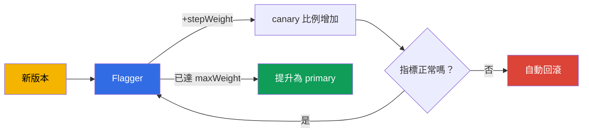

[Русская версия](ru.md) · [Eng version](en.md) · [Versión en español](es.md) · [Version française](fr.md) · [Deutsche Version](de.md) · [ქართული ვერსია](ge.md) · [日本語版](jp.md)

# 第 25 章。使用 Flagger 進行漸進式交付

> **第 2 部分開始**--適用於實際運維的最佳實務。這裡的主題不在（或幾乎不在）考試範圍內，卻是生產環境所需的能力。第一個主題是漸進式交付。在第 6 章中，我們透過變更 VirtualService 的權重來手動執行 canary。這可行，但需要有人掌舵。Flagger 透過指標分析與自動回滾來自動化整個流程。

## 25.1. 手動 canary 的問題

回想第 6 章的 canary：您將權重變更為 90/10，接著是 70/30，查看儀表板，再決定是繼續還是回滾。缺點顯而易見：

- **需要人工。** 必須有人手動變更權重並監控指標。
- **緩慢且常在深夜。** 發布經常在不方便的時間進行，還需要全程監督。
- **人為因素。** 很容易漏看錯誤率或延遲的升高，因而發布有問題的版本。

漸進式交付（progressive delivery）消除了手工作業：系統自行逐步轉移流量、在每一步檢查指標，然後繼續或回滾--無需人工介入。

## 25.2. 什麼是 Flagger

**Flagger** 是一個用於漸進式交付的 operator，運行於 Istio（以及其他 mesh）之上。您使用 `Canary` 資源描述發布應如何進行，而 Flagger 會自行：

- 偵測 deployment 的新版本；
- 透過變更 VirtualService/DestinationRule 中的權重，逐步將流量轉給它；
- 在每個步驟分析指標（成功率、延遲）；
- 指標良好時增加比例，指標不佳時回滾；
- 達成目標後將新版本「提升」為主要版本（promote）。



核心理念是：您只需設定一次發布的**規則**，之後每次發行都會依照它們自動且安全地進行。

## 25.3. Flagger 如何與 Istio 配合

Flagger 不會另創自己的路由機制--它使用我們在第 5 與第 6 章介紹過的 Istio 資源。當您為 `podinfo` deployment 建立 `Canary` 時，Flagger 會在其周圍部署整套配套：

- `podinfo-primary` deployment 的副本（目前承接流量的穩定版本）；
- `podinfo`、`podinfo-canary`、`podinfo-primary` Service；
- 由它管理權重的 `DestinationRule` 與 `VirtualService`。

之後每次更新原始 deployment 時，Flagger 都會自行調整此 VirtualService 的權重--也就是執行您在第 6 章手動完成的工作，只是改為自動執行並檢查指標。

## 25.4. 安裝 Flagger

Flagger 並不包含在 Istio 中--必須另外安裝，通常透過 Helm。它需要兩項資訊：指定 mesh 是 Istio，並提供 Prometheus 的位址（第 17 章的指標是分析的基礎）。

```bash
helm repo add flagger https://flagger.app
helm repo update

helm install flagger flagger/flagger \
  -n istio-system \
  --set meshProvider=istio \
  --set metricsServer=http://prometheus.istio-system:9090
```

- **`meshProvider=istio`**--Flagger 會透過 Istio 的 VirtualService/DestinationRule 管理權重。
- **`metricsServer`**--分析所用指標的來源（您的 Prometheus）。

若要進行檢查與產生負載（來自 `Canary` 的 webhooks），還應在應用程式 namespace 安裝 load-tester：

```bash
helm install flagger-loadtester flagger/loadtester -n test
```

先決條件是已安裝 Istio（第 2–3 章）以及正常運作的 Prometheus（第 17 章）。沒有指標，Flagger 無法分析發布。

## 25.5. Canary 資源

所有發布設定都在單一資源中描述。讓我們看看關鍵欄位：

```yaml
apiVersion: flagger.app/v1beta1
kind: Canary
metadata:
  name: podinfo
  namespace: test
spec:
  targetRef:
    apiVersion: apps/v1
    kind: Deployment
    name: podinfo            # 要發布哪個 deployment
  service:
    port: 9898
  analysis:
    interval: 30s            # 檢查頻率
    threshold: 5             # 連續多少次失敗即回退
    maxWeight: 50            # canary 提升到多少比例
    stepWeight: 10           # 權重遞增的步幅
    metrics:
    - name: request-success-rate
      thresholdRange:
        min: 99              # 成功率不低於 99%
      interval: 1m
    - name: request-duration
      thresholdRange:
        max: 500             # 延遲不超過 500 毫秒
      interval: 1m
    webhooks:
    - name: load-test
      url: http://flagger-loadtester.test/   # 產生負載以進行檢查
```

- **`targetRef`**--要發布哪個 deployment。
- **`analysis.interval` / `stepWeight` / `maxWeight`**--發布的節奏與步進（每 30 秒增加 10% 流量，最高至 50%，接著 promote）。
- **`threshold`**--自動回滾前，允許連續失敗檢查的次數。
- **`metrics`**--何謂成功：請求成功率與延遲（取自 Istio 指標，見第 17 章）。這就是自動化的「良好／不佳」判準。
- **`webhooks`**--外部檢查：產生負載、驗收測試。沒有流量便無法累積指標，因此通常必須有 load-test。

## 25.6. 發布如何進行：promote 與回滾

當您更新 `podinfo` deployment 中的映像時，Flagger 會啟動以下週期：

1. 將 `stepWeight` 百分比的流量（例如 10%）導向新版本。
2. 等待 `interval` 並檢查指標（成功率、延遲）。
3. 若指標在閾值範圍內，則再將權重增加一個步進（20%、30%、……）。
4. 若指標連續 `threshold` 次不佳，便會**回滾**：將所有流量送回 primary，並捨棄 canary。
5. 以良好指標達到 `maxWeight` 後，便會**promote**：新版本會複製到 primary 並成為主要版本，所有流量皆轉至該版本。

這一切都無需人工參與。Canary 日誌中可看見進度：`Advance podinfo.test canary
weight 20/40/50`，最後是 `Promotion completed!`--若出現問題則是回滾。

結果是：不良版本不會觸及所有使用者--系統會依據客觀指標，在少量流量階段自動將它攔下。

## 25.7. 其他發布策略

第 25.5 節的加權 canary 僅是其中一種策略。透過同一個 `Canary` 資源（及相同的 Istio 配套），Flagger 還支援三種策略；只需變更 `analysis` 區塊。

**Blue/Green**--沒有漸進權重：新版本先在「一旁」通過 N 次檢查，之後才將全部流量一次切換給它。透過不含 `stepWeight` 的 `iterations` 設定：

```yaml
  analysis:
    interval: 30s
    threshold: 5
    iterations: 10          # 連續 10 次檢查成功 - 便一次切換 100%
    metrics:
    - name: request-success-rate
      thresholdRange: {min: 99}
      interval: 1m
```

**A/B 測試**--流量並非按權重劃分，而是按照請求特徵：標頭或 cookie。當新版本應展示給特定區隔（beta 使用者、內部員工）時很有用。透過 `match` 路由--語法與 `VirtualService` 相同（第 6 與第 15 章）：

```yaml
  analysis:
    interval: 30s
    threshold: 5
    iterations: 10
    match:                  # 只有帶此標頭的請求前往 canary
    - headers:
        x-canary:
          exact: "insider"
    metrics:
    - name: request-success-rate
      thresholdRange: {min: 99}
      interval: 1m
```

**流量鏡像（shadowing）**--請求副本會鏡像至 canary，但 canary 的回應**不會回傳給**使用者（第 11 章）。因此可以在真實流量上測試新版本，完全不對使用者造成風險：

```yaml
  analysis:
    interval: 30s
    threshold: 5
    iterations: 10
    mirror: true            # 將流量複製到 canary，回應會被捨棄
    metrics:
    - name: request-success-rate
      thresholdRange: {min: 99}
      interval: 1m
```

策略選擇取決於風險與目標：canary 是通用的預設選擇，Blue/Green 適用於無法同時讓兩個版本承受負載時，A/B 用於定向驗證，mirroring 用於不影響使用者的「實戰」驗證。

## 25.8. 自訂指標：MetricTemplate

內建的 `request-success-rate` 與 `request-duration` 並非總是足夠：有時成功標準是業務指標（轉換率、特定 endpoint 的錯誤比例）或外部系統的指標。為此有獨立的 `MetricTemplate` CRD：您在其中描述 provider 和會回傳數值的任意查詢，然後在 `Canary` 中引用此 template。

```yaml
apiVersion: flagger.app/v1beta1
kind: MetricTemplate
metadata:
  name: not-found-percentage
  namespace: test
spec:
  provider:
    type: prometheus
    address: http://prometheus.istio-system:9090
  query: |                                   # 404 佔 canary 總請求數的比例
    100 - sum(
        rate(istio_requests_total{
          destination_workload="podinfo",
          response_code!="404"
        }[{{ interval }}])
    )
    /
    sum(
        rate(istio_requests_total{
          destination_workload="podinfo"
        }[{{ interval }}])
    ) * 100
```

現在可透過 `templateRef` 在 `Canary` 中將此 template 與內建指標一樣連接：

```yaml
  analysis:
    metrics:
    - name: "404s percentage"
      templateRef:
        name: not-found-percentage          # 參照上方的 MetricTemplate
        namespace: test
      thresholdRange:
        max: 5                               # 404 回應不超過 5%
      interval: 1m
```

provider 不僅可以是 Prometheus：Flagger 也支援 CloudWatch、Datadog、New Relic 等--也就是說，回滾標準甚至能以 AWS 指標為基礎（見後續章節）。Flagger 會在每個分析步驟自行代入 `{{ interval }}` template 及其他變數。

## 25.9. Hooks（webhooks）：檢查與人工閘門

在第 25.5 節中，我們看過一個 webhook--負載產生器。實際上 Flagger 會在發布的不同階段呼叫 hooks，這是強大的控制工具。主要類型如下：

- **`confirm-rollout`**--發布開始**前**的閘門：在 hook 回傳 200 前，發布不會開始（例如等待核准或發布時段）。
- **`pre-rollout`**--增加流量**前**新版本的驗收測試；失敗會停止發布。
- **`rollout`**--分析期間產生負載（也就是 load-test）。
- **`confirm-promotion`**--promote **前**的人工閘門：適合由人員確認最終切換的情況。
- **`post-rollout`**--成功 promote 後的動作（清理、通知）。
- **`rollback`**--在回滾時呼叫。
- **`event`**--Flagger 將所有發布事件傳送至此處（供外部系統／告警使用）。

範例：流量之前進行驗收測試，加上 promote 的人工閘門。

```yaml
  analysis:
    webhooks:
    - name: acceptance-test
      type: pre-rollout                       # 在提升流量之前的測試
      url: http://flagger-loadtester.test/
      timeout: 30s
      metadata:
        type: bash
        cmd: "curl -sd 'test' http://podinfo-canary.test:9898/token | grep token"
    - name: load-test
      type: rollout                           # 分析期間的負載
      url: http://flagger-loadtester.test/
      metadata:
        cmd: "hey -z 1m -q 10 -c 2 http://podinfo-canary.test:9898/"
    - name: manual-gate
      type: confirm-promotion                 # 由人工確認 promote
      url: http://flagger-loadtester.test/gate/halt
```

人工閘門 `confirm-promotion` 會將發布維持在 `maxWeight`，直到允許其繼續（透過 load-tester 的 API：`gate/open`）。如此一來，自動化分析與人工控制便可結合：機器檢查指標，若發行需要，最終決定權仍在人員手中。

## 25.10. 範例：逐步導入與控制

讓我們看一個具體範例：已有一個普通的 `podinfo` deployment，希望其發行能透過 Flagger 進行。我們將逐步完成整個流程。

### 初始設定

**步驟 1：先決條件。** 已安裝 Istio（第 2–3 章）、Prometheus 正常運行（第 17 章）、Flagger 和 load-tester 已安裝（第 25.4 節），並且 namespace 已加上 injection 標籤：

```bash
kubectl create namespace test
kubectl label namespace test istio-injection=enabled
```

**步驟 2：部署應用程式。** 標準的 Deployment 和 Service--沒有特別之處：

```bash
kubectl apply -n test -f podinfo-deployment.yaml   # Deployment + Service :9898
kubectl get pods -n test          # 檢查：pod 2/2（sidecar 已就位）
```

**步驟 3：建立 Canary 資源**（見第 25.5 節）並等待初始化：

```bash
kubectl apply -n test -f podinfo-canary.yaml
kubectl -n test get canary podinfo -w
```

**此步驟的檢查。** 等待狀態變成 `Initialized`。確認 Flagger 已建立完整配套：

```bash
kubectl -n test get canary podinfo     # STATUS: Initialized
kubectl -n test get deploy             # 出現了 podinfo-primary
kubectl -n test get svc                # podinfo, podinfo-canary, podinfo-primary
kubectl -n test get vs,dr              # VirtualService 與 DestinationRule 已建立
```

如果未能進入 `Initialized`，請查看 Flagger 日誌：
`kubectl logs -n istio-system deploy/flagger`。

### 日常使用

接下來很簡單：**您只需更新 deployment 的映像，Flagger 會處理其餘所有事情。**

**步驟 4：開始發行**--變更映像版本：

```bash
kubectl -n test set image deployment/podinfo podinfod=stefanprodan/podinfo:6.1.0
```

**步驟 5：觀察發布。** Flagger 自行開始轉移流量並檢查指標：

```bash
kubectl -n test get canary podinfo -w
```

**進行中的檢查。** 狀態會經過 `Progressing`，最終成為 `Succeeded`（回滾時則為 `Failed`）。可在事件中查看詳細資訊：

```bash
kubectl -n test describe canary podinfo
# ... Advance podinfo.test canary weight 10
# ... Advance podinfo.test canary weight 20
# ... Promotion completed!
```

**步驟 6：出現問題時可見的情況。** 如果新版本使指標惡化，Flagger 會自行回滾流量，狀態將成為 `Failed`，事件中會包含原因（例如延遲超出閾值）。此時使用者幾乎不會受到影響--不良版本只來得及取得少量流量。

### 如何進行日常控制

- **Canary 狀態**--最重要的指標：`kubectl get canary -A` 會顯示所有發布及其狀態（`Progressing`/`Succeeded`/`Failed`）。
- **Grafana 中的 Flagger 儀表板**--以視覺方式呈現發布進度與指標。
- **針對 `Failed` 的告警**--設定通知（Flagger 可傳送至 Slack/webhook），讓團隊立即知道回滾事件。
- **事件與日誌**--使用 `describe canary` 和 Flagger 日誌來查明發布為何出錯。

重點在於，完成初始設定後，每日發行只需更新映像--所有安全控制均由 Flagger 承擔，而您只需監控狀態並對告警作出反應。

### Prometheus 告警範例

若要自動而非手動「理解發生了問題」，請設定 Istio 指標的告警（第 17 章）。它們以 `PrometheusRule` 形式編寫（供 Prometheus Operator 使用）。以下是三條基本規則。

```yaml
apiVersion: monitoring.coreos.com/v1
kind: PrometheusRule
metadata:
  name: istio-app-alerts
  namespace: monitoring
spec:
  groups:
  - name: istio.rules
    rules:
    # 1. 5xx 錯誤比例偏高（5 分鐘內 > 5%）
    - alert: HighErrorRate
      expr: |
        sum(rate(istio_requests_total{destination_workload="podinfo", response_code=~"5.."}[5m]))
        / sum(rate(istio_requests_total{destination_workload="podinfo"}[5m])) > 0.05
      for: 2m
      labels: {severity: critical}
      annotations:
        summary: "podinfo 的 5xx 過多（>5%）"

    # 2. p99 延遲偏高（> 500 毫秒）
    - alert: HighLatencyP99
      expr: |
        histogram_quantile(0.99,
          sum(rate(istio_request_duration_milliseconds_bucket{destination_workload="podinfo"}[5m])) by (le)
        ) > 500
      for: 5m
      labels: {severity: warning}
      annotations:
        summary: "podinfo 的 p99 延遲高於 500 毫秒"

    # 3. Flagger 已回退發布
    - alert: CanaryFailed
      expr: flagger_canary_status{name="podinfo"} == 2
      for: 1m
      labels: {severity: critical}
      annotations:
        summary: "Flagger 已回退 podinfo 的 canary 發布"
```

說明如下：

- **HighErrorRate**--根據 `istio_requests_total` 指標，計算服務所有請求中 `5xx` 回應的比例。5 分鐘內 5% 的閾值，也是 Flagger 本身所依據的訊號。
- **HighLatencyP99**--從 `istio_request_duration_milliseconds_bucket` 直方圖取得第 99 百分位延遲。p99 的升高通常是問題的第一個徵兆。
- **CanaryFailed**--監控 Flagger 自身的指標：數值 `2` 表示發布失敗（請在 Flagger 文件中確認狀態值的精確對應關係--不同版本可能有所不同）。

這些告警補足 Canary 狀態：Flagger 會自行回滾不良版本，而 Prometheus 會通知團隊已發生回滾及其原因（錯誤或延遲）。

## 25.11. EKS/AWS 上的 Flagger

Flagger 分析的基礎是指標（第 17 章），在 EKS 上其來源通常不是 in-cluster Prometheus，而是受管 AWS 服務。以下是重點。

**來自 Amazon Managed Prometheus（AMP）的指標。** 您可以將 Istio 指標寫入 AMP，並由此提供給 Flagger，而非自行運行 Prometheus。與一般 `metricsServer` 的差別在於，對 AMP 的請求必須以 SigV4 簽章（使用 IAM 存取）。通常在 Flagger 和 AMP 之間放置 proxy sidecar（例如 `aws-sigv4-proxy`），由其透過 IRSA 簽署請求，而 Flagger 像使用普通 Prometheus 一樣連線至該 proxy：

```yaml
# 指向 AMP 前方 SigV4 proxy 的 MetricTemplate
apiVersion: flagger.app/v1beta1
kind: MetricTemplate
metadata:
  name: success-rate-amp
  namespace: test
spec:
  provider:
    type: prometheus
    address: http://localhost:8005            # sigv4-proxy -> AMP workspace
  query: |
    100 - sum(
        rate(istio_requests_total{
          destination_workload="podinfo",
          response_code=~"5.."
        }[{{ interval }}])
    )
    /
    sum(rate(istio_requests_total{destination_workload="podinfo"}[{{ interval }}])) * 100
```

[官方 AWS 部落格](https://aws.amazon.com/blogs/opensource/performing-canary-deployments-and-metrics-driven-rollback-with-amazon-managed-service-for-prometheus-and-flagger)介紹了「canary + 以 AMP 指標回滾 + Flagger」的架構。

**將回滾通知至 Slack/SNS。** Flagger 可透過 `event` webhook 或內建告警傳送事件。在 AWS 上，適合將回滾交給 SNS（後續再傳至 Chatbot/Slack、電子郵件、PagerDuty），讓團隊立即得知 `Failed`。

**Gateway API provider。** 若您使用 Gateway API（第 11 章）而非傳統 Gateway/VirtualService，Flagger 也能透過它管理權重--`meshProvider=gatewayapi`。這在使用實作 Gateway API 的 ingress controller 的 EKS 上很實用。分析與回滾邏輯則維持相同。

## 25.12. 生產環境最佳實務

- **正確的指標與閾值是一切的基礎。** Flagger 的效果完全取決於標準是否精確。先從請求成功率與延遲（p99）開始，必要時加入自訂指標（包括業務指標，見第 18 章）。
- **閾值應來自真實 baseline。** 不要憑猜測設定閾值。採用服務指標的正常值並保留餘量，否則會遇到誤回滾。
- **務必產生負載。** 沒有流量就無法累積指標，分析不會生效。設定 load-test webhook，或依賴真實流量。
- **對關鍵服務採用保守步進。** 較小的 `stepWeight` 與合理的 `interval` 可讓指標充分累積。過快的發布來不及發現問題。
- **透過 webhooks 執行驗收測試。** 在增加流量前，對新版本執行 acceptance 測試--這可捕捉成功率指標中看不出的功能回歸。
- **回滾告警。** 自動回滾是版本不佳的訊號。設定通知，讓團隊立即得知。
- **在 staging 測試流程本身。** 在信任 Flagger 用於生產環境前，確定發布、promote 與回滾均能正常運作。

## 25.13. 本章總結

- 漸進式交付將 canary 自動化：系統自行轉移流量、檢查指標並回滾，不需要手工作業。
- **Flagger** 是運行於 Istio 之上的 operator；它依 `Canary` 資源的規則管理 VirtualService/DestinationRule 中的權重。透過 Helm 獨立安裝，並設定 `meshProvider=istio` 與 Prometheus 位址；負載則使用 load-tester。
- Flagger 會部署配套（primary deployment、Service、DR、VS），並在每次更新時自動調整權重。
- 在 `Canary` 中設定節奏（`interval`、`stepWeight`、`maxWeight`）、標準（`metrics` + `thresholdRange`）、錯誤容許度（`threshold`）與檢查（`webhooks`）。
- 同一資源也可實作其他策略：**Blue/Green**（沒有 `stepWeight` 的 `iterations`）、**A/B**（標頭／cookie 的 `match`）、**mirroring**（`mirror: true`）。
- 自訂標準透過 `MetricTemplate` 設定--對 Prometheus、CloudWatch、Datadog 等的任意查詢（包括業務指標），再藉由 `templateRef` 連接至 `Canary`。
- **Webhooks** 於不同階段呼叫：`confirm-rollout`/`confirm-promotion`（人工閘門）、`pre-rollout`（驗收測試）、`rollout`（負載）、`rollback`、`event`。
- 良好版本會逐步 promote 為 primary；不良版本則在少量流量階段自動回滾。
- 在 EKS/AWS 上，指標通常來自 **Amazon Managed Prometheus**（請求透過 SigV4 proxy/IRSA）；回滾傳送至 **SNS/Slack**；使用 Gateway API 時則設定 `meshProvider=gatewayapi`。
- 初次設定後（deployment -> Canary -> 建立配套的 `Initialized`），每日發行 = 更新映像；控制方式為 Canary 狀態（`Progressing`/`Succeeded`/`Failed`）、Grafana 儀表板及回滾告警。
- 最佳實務：精確的指標與來自 baseline 的閾值、產生負載、保守的步進、驗收測試、回滾告警，以及在 staging 演練。

## 25.14. 自我檢查問題

1. 漸進式交付解決了手動 canary 的哪些缺點？
2. Flagger 的作用是什麼，它與 Istio 資源有何關聯？
3. `Canary` 中的 `stepWeight`、`maxWeight`、`interval` 與 `threshold` 各自負責什麼？
4. 為何 Flagger 運作時必須有流量（負載）？
5. 為何指標閾值應取自真實 baseline，而非任意猜測？
6. canary、Blue/Green、A/B 與 mirroring 策略有何差異，各應在何時選用？
7. `MetricTemplate` 的用途為何，如何在 `Canary` 中連接自訂指標？
8. `confirm-promotion` 與 `pre-rollout` hooks 的用途為何？
9. 在 EKS 上搭配 Amazon Managed Prometheus 時，Flagger 的分析如何運作，與 in-cluster Prometheus 有何不同？
10. 請描述從普通 deployment 到透過 Flagger 自動發行的流程。如何控制初始設定，以及如何控制日常發布？

## 實作練習

實作使用 Flagger 的自動 canary：版本更新、指標分析、自動 promote 與自動回滾：

🧪 實驗 25：[tasks/ica/labs/25](../../labs/25/README_TW.MD)

---
[目錄](../README_TW.md) · [第 24 章](../24/tw.md) · [第 26 章](../26/tw.md)
