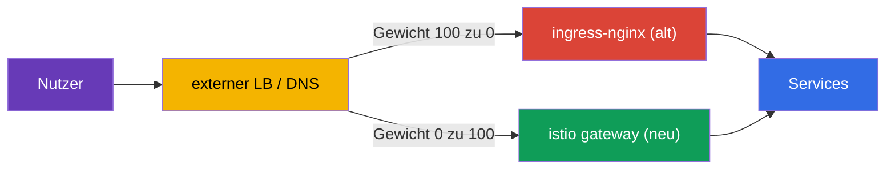
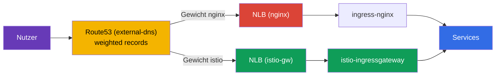
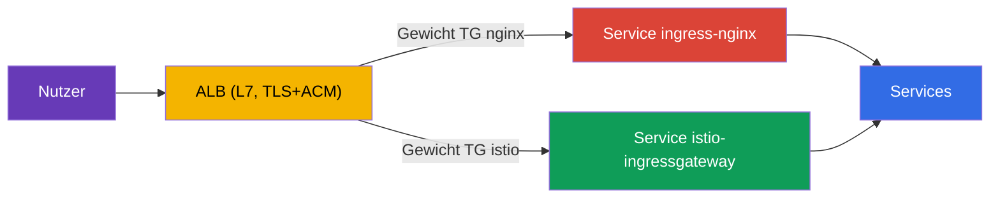

[RU version](ru.md) · [Eng version](en.md) · [Versión en español](es.md) · [Version française](fr.md)

# Kapitel 26. Migration der Produktion ohne Downtime: ingress-nginx zu Istio

> **Was kommt als Nächstes.** Eine der häufigsten realen Aufgaben bei der Einführung von
> Istio ist es, den eingehenden Traffic von einem bestehenden Ingress-Controller
> (üblicherweise ingress-nginx) auf ein Istio Gateway umzustellen. Und das im laufenden
> Produktivbetrieb, wo die Nutzer nicht beeinträchtigt werden dürfen. In diesem Kapitel
> betrachten wir die Methodik einer solchen Migration: Parallelbetrieb, Paritätsprüfung,
> Umschaltung per Gewichten, Rollback und ein Plan für hunderte Services.

## 26.1. Aufgabe und Ausgangslage

Die Bedingungen sind praxisnah:

- der Service läuft 24/7, die Nutzer dürfen **nicht** ausfallen (Zero Downtime);
- die Migration wird im **Fenster minimaler Last** durchgeführt;
- es gibt **viele** Services (hunderte) - nicht in einem Durchgang migrierbar, wir gehen in
  **Wellen** vor;
- bei jedem Schritt ist ein **schnelles Rollback** nötig.

Die Hauptschwierigkeit liegt nicht darin, das Istio-Äquivalent der nginx-Regeln zu
schreiben (das ist gerade einfach, Kapitel 5 und 11), sondern darin, **sicher und
umkehrbar** umzuschalten.

## 26.2. Das Hauptprinzip: zwei Ingress parallel

Die Kernidee von Zero Downtime: **wir löschen nginx nicht, solange die Migration nicht
abgeschlossen ist**. ingress-nginx und istio-ingressgateway arbeiten **gleichzeitig**, und
der öffentliche Traffic wird auf der Ebene des **externen Load Balancers / DNS**
umgeschaltet - schrittweise und umkehrbar.



Solange der alte Pfad lebt, ist das Rollback trivial: das Gewicht zurück auf nginx setzen.
Die Regel des gesamten Kapitels: **zuerst bauen und validieren wir den neuen Pfad, dann
schalten wir um, und erst ganz am Ende löschen wir den alten.**

## 26.3. Schrittweiser Plan für einen Service

Für jeden Host/Service ist der Prozess derselbe:

1. **Das Äquivalent in Istio bauen.** `Gateway` + `VirtualService` - eine exakte Kopie der
   nginx-Regeln: Hosts, Pfade, Header, Timeouts, Rewrite.
2. **Paritätsprüfung vor dem Umschalten.** Das Istio-Gateway läuft bereits parallel; wir
   schicken Test-Traffic hinein und vergleichen das Verhalten mit nginx für jede Regel. Die
   Nutzer gehen weiterhin über nginx.
3. **(optional) Mirroring.** Über `VirtualService.mirror` (Kapitel 6) kopieren wir einen
   Teil des Produktions-Traffics in den neuen Pfad - Validierung unter echter Last ohne
   Auswirkung auf die Nutzer.
4. **Umschalten im Fenster niedriger Last.** Am externen LB ändern wir das Gewicht sanft:
   `nginx 100 / istio 0` → `90/10` → `50/50` → `0/100`. Zwischen den Schritten schauen wir
   auf die Metriken.
5. **Einwirkzeit (Soak).** Wir halten 100 % auf Istio für einige Stunden/Tage, beobachten
   Fehler und Latenz. Die nginx-Konfiguration **rühren wir nicht an** - sie ist die heiße
   Reserve.
6. **Außerbetriebnahme von nginx** für diesen Service - erst nach erfolgreicher
   Einwirkzeit.

Zum Beispiel wird ein Header-Canary, das in nginx einen separaten Ingress mit Annotationen
erforderte, in Istio zu einem einzigen `match`-Block nach Header (Kapitel 6) - aber es muss
mit derselben Vorsicht übertragen werden.

### Beispiel: Ingress → Gateway + VirtualService

Betrachten wir Schritt 1 an einer konkreten Regel. Angenommen, in nginx gibt es einen
typischen `Ingress`: Host `shop.example.com`, Pfad `/api` mit Präfix-Abschneidung,
Redirect auf HTTPS, Lese-Timeout:

```yaml
apiVersion: networking.k8s.io/v1
kind: Ingress
metadata:
  name: shop
  namespace: shop
  annotations:
    nginx.ingress.kubernetes.io/rewrite-target: /$2
    nginx.ingress.kubernetes.io/ssl-redirect: "true"
    nginx.ingress.kubernetes.io/proxy-read-timeout: "30"
spec:
  ingressClassName: nginx
  tls:
  - hosts: [shop.example.com]
    secretName: shop-tls                 # Secret im Namespace der Anwendung
  rules:
  - host: shop.example.com
    http:
      paths:
      - path: /api(/|$)(.*)
        pathType: ImplementationSpecific
        backend:
          service:
            name: api
            port: {number: 8080}
```

Das exakte Istio-Äquivalent sind zwei Ressourcen: `Gateway` (was wir am Ingress abhören)
und `VirtualService` (wohin und wie wir routen):

```yaml
apiVersion: networking.istio.io/v1
kind: Gateway
metadata:
  name: shop-gw
  namespace: shop
spec:
  selector:
    istio: ingressgateway                # an welches ingress-gateway wir uns binden
  servers:
  - port: {number: 443, name: https, protocol: HTTPS}
    hosts: ["shop.example.com"]
    tls:
      mode: SIMPLE
      credentialName: shop-tls           # ACHTUNG: Secret wird im Namespace des Gateways gesucht
  - port: {number: 80, name: http, protocol: HTTP}
    hosts: ["shop.example.com"]
    tls:
      httpsRedirect: true                # = ssl-redirect: "true"
---
apiVersion: networking.istio.io/v1
kind: VirtualService
metadata:
  name: shop
  namespace: shop
spec:
  hosts: ["shop.example.com"]
  gateways: ["shop-gw"]
  http:
  - match:
    - uri:
        prefix: /api/                    # = path /api(/|$)(.*)
    rewrite:
      uri: /                             # = rewrite-target: /$2 (Präfix abschneiden)
    route:
    - destination:
        host: api.shop.svc.cluster.local
        port: {number: 8080}
    timeout: 30s                         # = proxy-read-timeout: "30"
```

Ein nicht offensichtlicher, aber bei der Migration wichtiger Punkt - **wo das TLS-Secret
liegt**. In nginx wird `secretName` aus dem Namespace der Anwendung (`shop`) genommen. In
Istio wird `credentialName` standardmäßig im **Namespace des ingress-gateway selbst**
gesucht (üblicherweise `istio-system`). Das ist eine häufige Ursache für „das Zertifikat
wurde nicht übernommen" nach der Übertragung: das Secret muss entweder in den Namespace des
Gateways dupliziert oder das Secret aus dem Namespace der `Gateway`-Ressource mit
entsprechender Einstellung verwendet werden. Prüfen Sie das vor dem Umschalten.

## 26.4. Paritätsprüfung vor dem Umschalten

Das ist das Herz einer sicheren Migration: den neuen Pfad vollständig zu validieren,
**während alle Nutzer noch auf nginx sind**. Was wir prüfen:

- **Gesundheit der Istio-Konfiguration:** `istioctl analyze`, `istioctl proxy-status`
  (alle `SYNCED`), Routen am Ingress Gateway sichtbar (`istioctl proxy-config routes`).
- **Direkter Zugriff auf das istio-gateway unter Umgehung des öffentlichen LB.** Wir
  schicken Anfragen direkt an das istio-ingressgateway mit dem nötigen `Host` (in der
  Produktion über `curl --resolve`), ohne den öffentlichen DNS zu ändern. Die Nutzer sind
  nicht betroffen.
- **Paritätsmatrix nginx gegen istio.** Wir jagen denselben Satz von Anfragen durch beide
  Ingress und vergleichen: Statuscode, welcher Service geantwortet hat, Header, Redirects.
  Jede Abweichung ist ein **Stopp-Faktor**: wir reparieren den VirtualService und
  wiederholen.
- **Lastdurchlauf.** `fortio`/`k6` direkt ins istio-gateway, wir vergleichen p95/p99 und
  Fehler mit nginx.

In der Praxis wird der direkte Zugriff auf das istio-gateway unter Umgehung des
öffentlichen DNS über `curl --resolve` gemacht - es setzt den nötigen `Host` ein, löst ihn
aber auf die IP des neuen Load Balancers auf, ohne Route53 anzurühren:

```bash
# NLB istio-gateway (öffentlicher DNS zeigt noch auf nginx)
ISTIO_LB=$(kubectl -n istio-system get svc istio-ingressgateway \
  -o jsonpath='{.status.loadBalancer.ingress[0].hostname}')

# ein und dieselbe Anfrage — direkt in den neuen Pfad
curl -sk --resolve shop.example.com:443:$(dig +short $ISTIO_LB | head -1) \
  https://shop.example.com/api/health -o /dev/null -w "istio: %{http_code}\n"
```

Die einfachste Paritätsmatrix - eine Liste von Pfaden durch beide Ingress jagen und die
Codes vergleichen:

```bash
NGINX_IP=$(dig +short nginx-nlb.example.com | head -1)
ISTIO_IP=$(dig +short $ISTIO_LB | head -1)
for p in / /api/health /api/v1/items /login /static/logo.png; do
  n=$(curl -sk --resolve shop.example.com:443:$NGINX_IP https://shop.example.com$p -o /dev/null -w '%{http_code}')
  i=$(curl -sk --resolve shop.example.com:443:$ISTIO_IP https://shop.example.com$p -o /dev/null -w '%{http_code}')
  [ "$n" = "$i" ] && s=OK || s=DIFF
  printf '%-20s nginx=%s istio=%s %s\n' "$p" "$n" "$i" "$s"
done
```

Jedes `DIFF` ist ein Stopp-Faktor: wir reparieren den `VirtualService` und wiederholen. Wir
schalten den Traffic am LB **erst um, wenn alles grün ist**.

## 26.5. Womit den Traffic umschalten: LB-Gewichte, nicht DNS

Der Umschaltmechanismus beeinflusst direkt die Geschwindigkeit des Rollbacks.

| Mechanismus | Vorteile | Nachteile fürs Rollback |
|----------|-------|-------------------|
| Gewichte am externen LB (ALB/NLB) | sofort, ohne Cache; Rollback in Sekunden | LB mit Gewichtung nötig |
| Gewichtetes DNS (z. B. Route53) | einfach | Cache/TTL - Rollback nicht sofort |
| Pro-Host-Umschaltung | Risikoisolierung pro Host | mehr Schritte |

Empfehlung für 24/7: mit **Gewichten am Load Balancer** umschalten - das Rollback dauert
dann Sekunden. Wenn nur DNS verfügbar ist, senken Sie im Voraus (einen Tag vorher) den TTL
auf 30-60 Sekunden, sonst „hängt" das Rollback wegen DNS-Caching bei den Clients.

## 26.6. Beispiel: EKS, NLB, Route53, external-dns

Betrachten wir die Migration auf einem konkreten und sehr typischen Stack:

- **EKS**-Cluster;
- **ingress-nginx** über Helm installiert, sein Service hat den Typ `LoadBalancer` und
  erstellt einen **NLB**;
- DNS - **Route53**, die Einträge erstellt **external-dns** automatisch aus
  Ingress/Service.

So sieht es jetzt aus: external-dns sieht nginx und erstellt in Route53 den Eintrag
`shop.example.com` → NLB nginx. Die Nutzer gehen über diesen NLB.



**Schritt 1. istio-ingressgateway mit eigenem NLB hochfahren.** Den Service des
Istio-Gateways machen wir vom Typ LoadBalancer mit NLB-Annotationen des AWS Load Balancer
Controllers:

```yaml
# Service istio-ingressgateway (Ausschnitt)
metadata:
  annotations:
    service.beta.kubernetes.io/aws-load-balancer-type: "external"
    service.beta.kubernetes.io/aws-load-balancer-nlb-target-type: "ip"
    service.beta.kubernetes.io/aws-load-balancer-scheme: "internet-facing"
spec:
  type: LoadBalancer
```

Wir bekommen einen zweiten, separaten **NLB istio**, der parallel zu nginx arbeitet. Die
Nutzer betrifft das noch nicht - Route53 zeigt weiterhin auf nginx.

**Schritt 2. Gateway + VirtualService bauen und die Parität prüfen** (Abschnitt 26.4).
Test-Traffic schicken wir direkt an den DNS-Namen des NLB istio über `curl --resolve`, ohne
Route53 anzurühren.

**Schritt 3. Umschaltung über gewichtete Route53-Einträge.** Hier eine Besonderheit des
Stacks: da die Einträge von external-dns verwaltet werden, schalten wir nicht von Hand in
der Konsole um, sondern über **weighted-Einträge von external-dns**. An den Quell-Services
setzen wir Gewichts-Annotationen:

```yaml
# an istio-gw und an nginx - gleicher hostname, unterschiedliche set-identifier und Gewicht
external-dns.alpha.kubernetes.io/hostname: shop.example.com
external-dns.alpha.kubernetes.io/set-identifier: istio    # bei nginx: nginx
external-dns.alpha.kubernetes.io/aws-weight: "0"          # wir ändern 0 -> 100
```

external-dns erstellt in Route53 zwei weighted-Einträge auf einen Host, die auf
verschiedene NLB zeigen. Durch Änderung der Gewichte (`nginx 100/istio 0` → `50/50` →
`0/100`) leiten wir den Traffic sanft um.

**Wichtige Feinheiten genau dieses Stacks:**

- **Das ist eine DNS-Umschaltung, keine Gewichte am LB.** Das bedeutet, das Rollback ist
  **nicht sofort** - Cache und TTL der Resolver wirken. Wie in Abschnitt 26.5: senken Sie
  im Voraus (einen Tag vorher) den TTL des Eintrags auf 30-60 Sekunden. Ein sofortiges
  Rollback wie mit einem gemeinsamen LB gibt es hier nicht - planen Sie das ein.
- **external-dns darf nicht „gegen Sie kämpfen".** Vergewissern Sie sich, dass es auf
  weighted-Einträge konfiguriert ist (`set-identifier` + `aws-weight`) und die Zone über
  eine TXT-Registry besitzt, sonst kann es Ihre Gewichte überschreiben.
- **Wo TLS terminiert wird - eine bewusste Entscheidung.** Es gibt zwei praktikable
  Varianten:
  - **Am NLB (TLS-Listener + Zertifikat aus ACM).** Eine häufige Produktions-Variante: TLS
    wird am Load Balancer beendet, ACM verlängert die Zertifikate selbst, die
    Verschlüsselung wird vom Cluster genommen. Nachteil - Istio sieht kein SNI/TLS, und die
    Edge-Möglichkeiten aus Kapitel 9 (MUTUAL, Routing nach SNI, mTLS am Eingang) bleiben
    außen vor. NLB → istio-gateway läuft als Plaintext oder wird erneut verschlüsselt.
  - **Am istio-gateway (NLB im TCP-Passthrough-Modus).** Istio verwaltet Zertifikate und
    SNI selbst, alle Edge-Möglichkeiten aus Kapitel 9 stehen zur Verfügung, aber die
    Zertifikate verwalten Sie im Cluster.
  Die Wahl: Sie brauchen einfaches Offload und ACM-Auto-Verlängerung - terminieren Sie am
  NLB; Sie brauchen die Edge-Features von Istio (mTLS/SNI/feines TLS-Routing) -
  Passthrough bis zum istio-gateway. Prüfen Sie auch den Health-Check und bei Bedarf das
  Proxy Protocol.
- **Echte Client-IP.** Der NLB kann die Source-IP erhalten (target-type `ip`), das ist
  wichtig, wenn Sie per-IP Rate Limiting verwenden (Kapitel 20) - sonst sieht Istio die
  Adresse des NLB.

**Schritt 4. Einwirkzeit und Außerbetriebnahme.** Wir haben 100 % auf istio gehalten, die
Metriken beobachtet - und erst dann entfernen wir nginx (zuerst seinen weighted-Eintrag,
dann das Chart selbst).

### Variante mit ALB statt NLB

Hier muss man sofort eine häufige Verwechslung ausräumen.

**ingress-nginx selbst kann keinen „ALB erstellen".** Der nginx-Controller wird über einen
gewöhnlichen Kubernetes `Service` vom Typ `LoadBalancer` veröffentlicht, und ein solcher
Service erstellt auf AWS einen **NLB** (oder den veralteten Classic ELB), aber **keinen
ALB**. Die Load-Balancer-Klasse des nginx-Service auf ALB umzustellen ist nicht möglich -
das sind grundlegend verschiedene Mechanismen.

**Ein ALB auf EKS wird separat erstellt** - ihn provisioniert der **AWS Load Balancer
Controller**, und nicht aus einem Service, sondern aus der Ressource `Ingress`
(`ingressClassName: alb`) oder aus einem `TargetGroupBinding`. Das heißt, ein ALB ist ein
eigenständiger L7-Front, der **vor** den Ingress-Controller gestellt wird, und kein „Modus"
von nginx selbst. Deshalb wird in solchen Schemata der ALB üblicherweise im Voraus erstellt
(oder vom selben Controller aus einem separaten Ingress) und nginx als Backend daran
angebunden.

Daher ist die typische Architektur „ALB + nginx" ein **Zwei-Schichten-Modell**:

- der **ALB** (L7, TLS + ACM) nimmt externen Traffic an und terminiert HTTPS;
- dahinter eine Target-Gruppe, die an den Service ingress-nginx gebunden ist (üblicherweise
  `NodePort`/`ClusterIP` + `TargetGroupBinding`), und nginx macht bereits das detaillierte
  Routing nach Pfaden/Hosts.

**Wie man bei einem solchen Schema migriert.** Da der ALB ein separater Front ist, wird die
Umschaltung **an ihm** gemacht, zwischen zwei Target-Gruppen: eine an den Service
ingress-nginx gebunden, die zweite - an den Service istio-ingressgateway. Die Gewichte
werden entweder über weighted-actions im ALB-`Ingress`
(`alb.ingress.kubernetes.io/actions.*`) oder über `TargetGroupBinding` gesetzt. Durch
Änderung der Gewichte der Target-Gruppen leiten wir den Traffic `nginx → istio` **direkt am
ALB** um.



Der Hauptvorteil: die Umschaltung per Gewichten der Target-Gruppen erfolgt **am ALB
selbst**, nicht über DNS, deshalb ist das **Rollback sofort** - ohne das TTL-Problem, von
dem für NLB+Route53 die Rede war. Das ist genau das Ideal „mit Gewichten am LB umschalten"
aus Abschnitt 26.5.

**Was bei der Installation von Istio unter ALB zu beachten ist.** Das istio-ingressgateway
muss das Ziel des ALB werden und keinen eigenen öffentlichen Load Balancer hochfahren:

- sein Service wird als `NodePort` oder `ClusterIP` gemacht (kein eigener NLB nötig - als
  Front dient der ALB) und über `TargetGroupBinding` oder ALB-`Ingress` an eine
  Target-Gruppe gebunden;
- der Health-Check des ALB wird auf den Bereitschafts-Port/-Pfad des Gateways eingestellt;
- da der ALB TLS bereits terminiert hat, läuft der Traffic bis zum istio-gateway über HTTP
  (oder Re-Encrypt) - das Gateway wird auf den Empfang von HTTP vom ALB eingestellt, nicht
  auf sein eigenes TLS.

**Vorbehalte:**

- **TLS wird immer am ALB terminiert** (er ist L7, sonst würde er nicht nach HTTP routen).
  Das bedeutet, die Edge-Möglichkeiten von Istio aus Kapitel 9 (SNI-Routing, MUTUAL, mTLS
  am Eingang) sind prinzipiell nicht verfügbar. Werden sie benötigt - nehmen Sie einen NLB
  im Passthrough-Modus.
- **Echte Client-IP - in `X-Forwarded-For`.** Der ALB erhält die Source-IP auf L3 nicht.
  Für per-IP Rate Limiting (Kapitel 20) konfigurieren Sie `numTrustedProxies`, damit Istio
  die IP aus XFF holt.
- **external-dns erstellt einen Eintrag** auf den ALB - die Gewichtung erfolgt auf der
  Ebene der Target-Gruppen des ALB, nicht per DNS.

Fazit des Vergleichs für die Migration: **NLB** ist einfacher und erlaubt Passthrough
(wenn die Edge-Features von Istio benötigt werden), aber die Umschaltung läuft über DNS mit
langsamem Rollback. **ALB** ist eine separate L7-Schicht vor dem Ingress, aufwendiger im
Aufbau und terminiert TLS immer, gibt dafür aber eine sofortige und umkehrbare Umschaltung
per Gewichten der Target-Gruppen - was für Zero Downtime sehr wertvoll ist.

### ALB oder NLB vor Istio: vollständiger Vergleich

Diese Wahl ist nicht nur bei der Migration wichtig, sondern generell bei der Installation
von Istio auf EKS (Kapitel 27). Fassen wir Vor- und Nachteile beider Load Balancer vor dem
istio-ingressgateway zusammen.

| Kriterium | NLB (L4) | ALB (L7) |
|----------|----------|----------|
| Ebene | L4 (TCP/UDP/TLS) | L7 (HTTP/HTTPS/gRPC) |
| TLS | Passthrough **oder** Terminierung (TLS-Listener + ACM) | terminiert immer (ACM) |
| Edge-Features von Istio (SNI, MUTUAL, mTLS am Eingang) | verfügbar (im Passthrough-Modus) | nicht verfügbar (ALB öffnet HTTPS) |
| Wo das Routing ist | vollständig in Istio (Single Source of Truth) | teils am ALB (host/path), Duplizierung mit Istio |
| Nicht-HTTP-Traffic (TCP, beliebig) | ja | nein, nur HTTP/HTTPS/gRPC |
| Echte Client-IP | erhält Source-IP (target-type `ip`) | in `X-Forwarded-For` |
| Gewichtung auf LB-Ebene | nein (Umschaltung über DNS) | ja (weighted Target-Gruppen), sofortiges Rollback |
| Integration mit AWS WAF / Cognito | nein | ja |
| Latenz / Performance | geringere Latenz, höherer Throughput | etwas mehr Overhead (L7-Verarbeitung) |
| Womit gesteuert | Annotationen am `Service` | `Ingress`/`TargetGroupBinding` (AWS LB Controller) |

**Nehmen Sie NLB, wenn:**

- Sie die Edge-Möglichkeiten von Istio brauchen: mTLS am Eingang, `MUTUAL`, Routing nach
  SNI, durchgängige Verschlüsselung bis zum Gateway (Passthrough);
- über den Ingress **Nicht-HTTP**-Traffic läuft (TCP, gRPC mit durchgängigem mTLS,
  benutzerdefinierte Protokolle);
- Sie möchten, dass **das gesamte** Routing und TLS in Istio liegen - eine Single Source of
  Truth, ohne Duplizierung der Regeln am ALB;
- minimale Latenz und hoher Throughput wichtig sind.

**Nehmen Sie ALB, wenn:**

- Sie TLS auf ACM auslagern möchten und die Edge-Features von Istio nicht brauchen;
- Sie die Integration mit **AWS WAF**, Cognito, Authentifizierung auf ALB-Ebene brauchen;
- Sie gewichtete Umschaltung und Canary **auf Load-Balancer-Ebene** möchten (sofortiges
  Rollback bei Migrationen);
- die Organisation bereits auf ALB und AWS LB Controller standardisiert ist.

**Praktische Orientierung.** Für „reines" Istio nimmt man häufiger **NLB**: er belässt das
gesamte L7 (Routing, TLS, Edge-Policies) innerhalb des Mesh, wodurch alle Möglichkeiten von
Istio verfügbar sind und die Regeln an einem Ort leben. **ALB** wählt man, wenn die
Organisation an sein Ökosystem gebunden ist (WAF, ACM, Cognito) oder wenn gewichtetes
Traffic-Switching auf LB-Ebene benötigt wird. Der Kompromiss ist einfach: ALB nimmt einen
Teil der Arbeit ab (TLS, WAF, Gewichte), entzieht Istio aber einen Teil der L7-Kontrolle.

## 26.7. Rollback-Plan

Das Rollback sollte Sekunden bis Minuten dauern, weil der alte Pfad nicht demontiert ist:

1. Am externen LB das Gewicht zurück auf nginx setzen (`istio 0 / nginx 100`).
2. Anhand der Metriken sicherstellen, dass 5xx und Latenz wieder normal sind.
3. Es muss nichts wiederhergestellt werden - der `Ingress` nginx war die ganze Zeit
   unangetastet.
4. Die Ursache analysieren (meist eine Regel-Abweichung), den `VirtualService` korrigieren,
   erneut den Paritätstest durchlaufen und die Umschaltung wiederholen.

Gerade weil der alte Pfad lebt, bleibt die Migration bei jedem Schritt risikoarm.

## 26.8. Migration von 100+ Services in Wellen

Alles auf einmal zu migrieren ist nicht möglich - Vertrauen wird in Wellen aufgebaut:

- **Welle 0 (Pilot):** 2-3 unkritische Services mit niedrigem Traffic. Umschalten, einige
  Tage beobachten. Runbook, Dashboards und Rollback-Prozedur einfahren.
- **Wellen 1..N (Hauptmasse):** in Batches von 5-10 Services, jeder Batch - erst nach
  stabiler Einwirkzeit des vorherigen. Der Prozess ist wiederholbar (Templates für
  Gateway/VirtualService).
- **Letzte Welle:** die kritischsten und höchstbelasteten Services - zuletzt, mit maximalem
  Monitoring und einprobiertem Rollback.

Zwischen den Wellen werden die Metriken festgehalten (Fehler, p95/p99, Vorfälle). Jede
Regression ist ein Stopp-Faktor für die nächste Welle.

## 26.9. Risiken und wie man sie beseitigt

| Risiko | Mitigation |
|------|-----------|
| Regel-Abweichung (Pfad/Header/Regex) | Paritätstest jeder Regel vor dem Umschalten |
| Unterschiedliche Pfad-Semantik (`pathType`, Rewrite) | explizit auf `uri.exact/prefix` + `rewrite.uri` mappen, testen |
| Unterschiedliche Timeouts/Limits nginx vs Istio | explizite `timeout`/`retries` im VirtualService setzen |
| Sticky Sessions / Affinity | `DestinationRule` `consistentHash` (nach Cookie/Header) |
| mTLS/Injektion bricht den Traffic zwischen Services | während der Migration `PeerAuthentication: PERMISSIVE` halten |
| WebSocket / gRPC / große Header | explizit testen; korrekte Port-Namen (Kapitel 10, 23) |
| DNS-Cache beim Rollback | mit LB-Gewichten umschalten; niedriger TTL im Voraus |
| Keine Observability im Moment des Cutovers | Dashboards und Alerts (5xx, p99) **vor** dem Umschalten bereit |

## 26.10. Autokonvertierung: ingress2gateway

Die Regeln von Hand umzuschreiben ist nicht zwingend. Das Werkzeug **ingress2gateway**
(Projekt kubernetes-sigs) liest die bestehenden `Ingress` samt der Provider-Annotationen
und generiert Gateway-API-Ressourcen:

```bash
ingress2gateway print --providers ingress-nginx -A
```

Wichtige Vorbehalte:

- es gibt **Gateway API** (`Gateway`/`HTTPRoute`) aus, keine nativen Istio-
  `Gateway`/`VirtualService`. Istio implementiert die Gateway API (Kapitel 11), deshalb
  wenden Sie das Generierte mit `gatewayClassName: istio` an;
- **nicht alles konvertiert 1:1**: spezifische nginx-Annotationen (Rewrite,
  canary-by-header, auth-url, benutzerdefinierte Timeouts) können teilweise oder gar nicht
  übertragen werden - die Ausgabe ist ein **Entwurf**;
- deshalb sind **Review und Paritätstest** vor dem Umschalten Pflicht.

Praktischer Ablauf: `ingress2gateway print ... > gwapi.yaml` → Review und Korrektur →
`kubectl apply` parallel zu nginx → Paritätsprüfung → Umschaltung der Gewichte am LB.

### Spickzettel: Annotationen ingress-nginx → Istio

Gerade an den Annotationen „stolpert" die Autokonvertierung am häufigsten - viele
nginx-Möglichkeiten werden in Istio durch andere Ressourcen umgesetzt. Orientierung an den
häufigsten:

| Annotation ingress-nginx | Äquivalent in Istio |
|-------------------------|--------------------|
| `rewrite-target` | `VirtualService` → `http.rewrite.uri` |
| `ssl-redirect` / `force-ssl-redirect` | `Gateway` → Server `tls.httpsRedirect: true` |
| `canary` + `canary-by-header` / `canary-weight` | `VirtualService` → `http.match.headers` oder gewichtete `route` (Kapitel 6) |
| `proxy-read-timeout` / `proxy-send-timeout` | `VirtualService` → `http.timeout` |
| `proxy-next-upstream*` / Retries | `VirtualService` → `http.retries` |
| `limit-rps` / `limit-connections` | local Rate Limit über `EnvoyFilter` (Kapitel 20) |
| `auth-url` / `auth-signin` (externe Authentifizierung) | `AuthorizationPolicy` `CUSTOM` + ext_authz (Kapitel 15) |
| `whitelist-source-range` | `AuthorizationPolicy` `ipBlocks`/`remoteIpBlocks` (Kapitel 14) |
| `affinity: cookie` (Sticky Sessions) | `DestinationRule` → `consistentHash` nach Cookie/Header |
| `backend-protocol: GRPC`/`HTTPS` | Port-Name des Service (`grpc-`, Kapitel 10) / `DestinationRule` `tls` |
| `configuration-snippet` / `server-snippet` | `EnvoyFilter` (Kapitel 21) - von Hand übertragen |

Die Regel ist einfach: je „exotischer" eine Annotation (Snippets, benutzerdefinierte
Autorisierung, Limits), desto geringer die Chance, dass sie automatisch konvertiert wird -
solche Regeln überträgt man von Hand und prüft die Parität separat.

## 26.11. Zusammenfassung des Kapitels

- Eine Zero-Downtime-Migration baut auf dem **Parallelbetrieb** von nginx und Istio auf:
  der alte Pfad wird nicht bis zum Schluss gelöscht.
- Der Prozess für einen Service: Äquivalent bauen → Paritätsprüfung vor dem Umschalten →
  (optional) Mirroring → Gewichte sanft umschalten → Einwirkzeit → Außerbetriebnahme von
  nginx.
- Die Paritätsprüfung (analyze, proxy-status, direkte Anfragen ins istio-gateway, Vergleich
  mit nginx, Last) - ist vor dem Umschalten der Nutzer Pflicht.
- Besser mit **Gewichten am LB** umschalten (sofortiges Rollback), nicht per DNS
  (Cache/TTL); bei DNS - im Voraus niedriger TTL.
- Rollback - Rückgabe des Gewichts an nginx in Sekunden, weil der alte Pfad lebt.
- 100+ Services migrieren **in Wellen**: Pilot → Batches → die kritischen zuletzt.
- Eine nginx-`Ingress`-Regel wird in das Paar `Gateway` + `VirtualService` übertragen
  (Host, `match` nach Pfad, `rewrite`, `timeout`, TLS über `credentialName`); eine häufige
  Falle - das TLS-Secret wird im Namespace des ingress-gateway gesucht, nicht der Anwendung.
- Viele nginx-Annotationen bilden sich auf andere Istio-Ressourcen ab (rewrite/timeout →
  VirtualService, auth-url → ext_authz, limit-rps → Rate Limit, snippet → EnvoyFilter) -
  siehe Spickzettel.
- `ingress2gateway` beschleunigt die Übertragung, liefert aber einen Entwurf (Gateway
  API) - Review und Parität sind Pflicht.
- Auf dem Stack EKS + NLB + Route53 + external-dns läuft die Umschaltung über
  weighted-Einträge von Route53 (external-dns), nicht über LB-Gewichte - deshalb ist das
  Rollback nicht sofort: senken Sie im Voraus den TTL. TLS kann am NLB terminiert werden
  (TLS-Listener + ACM, einfaches Offload) oder am istio-gateway (Passthrough, wenn die
  Edge-Features von Istio benötigt werden). Ein NLB mit target-type `ip` erhält die echte
  IP.
- Mit **ALB** wird die Umschaltung per Gewichten der Target-Gruppen direkt am Load Balancer
  gemacht - das Rollback ist sofort (ohne DNS-TTL). Aber der ALB terminiert TLS immer (die
  Edge-Features von Istio sind nicht verfügbar), und die echte IP wird aus
  `X-Forwarded-For` genommen (`numTrustedProxies` nötig).

## 26.12. Fragen zur Selbstüberprüfung

1. Warum darf nginx nicht bis zum Abschluss der Migration gelöscht werden?
2. Was ist eine Paritätsprüfung und warum macht man sie vor dem Umschalten der Nutzer?
3. Warum schaltet man für 24/7 mit LB-Gewichten um und nicht per DNS?
4. Wie sieht das Rollback aus und warum dauert es Sekunden?
5. Warum in Wellen migrieren und in welcher Reihenfolge die Services nehmen?
6. Wie wird eine nginx-`Ingress`-Regel (Host, Pfad, Rewrite, Timeout, TLS) in `Gateway` +
   `VirtualService` übertragen und wo muss dabei das TLS-Secret liegen?
7. Wie prüft man die Parität des neuen Pfads direkt im istio-gateway, ohne den öffentlichen
   DNS anzurühren?
8. In welche Istio-Ressourcen gehen die nginx-Annotationen `rewrite-target`, `auth-url`,
   `limit-rps` und `configuration-snippet` über?
9. Was macht `ingress2gateway` und warum kann man seine Ausgabe nicht ohne Prüfung
   anwenden?
10. Auf dem Stack EKS + NLB + Route53 + external-dns: wie schaltet man den Traffic um,
    warum ist das Rollback nicht sofort und wo wird TLS terminiert?
11. Wodurch unterscheidet sich die Migration mit ALB von der mit NLB? Warum ist mit ALB das
    Rollback sofort, die Edge-Features von Istio aber nicht verfügbar?
12. Wann wählt man vor Istio NLB und wann ALB? Nennen Sie die wichtigsten Vor- und
    Nachteile von beiden.

## Praxis

Üben Sie die Pilotwelle einer realen Migration von ingress-nginx zu Istio Gateway: bauen
Sie das Äquivalent der Regeln, prüfen Sie die Parität, betrachten Sie die Umschaltung per
Gewichten und das Rollback:

🧪 Lab 31: [tasks/ica/labs/31](../../labs/31/README_DE.MD)

---
[Inhaltsverzeichnis](../README_DE.md) · [Kapitel 25](../25/de.md) · [Kapitel 27](../27/de.md)
