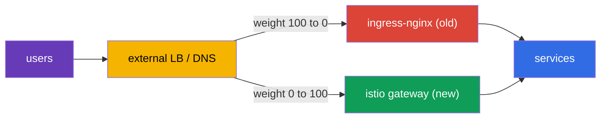
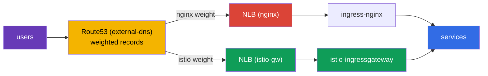
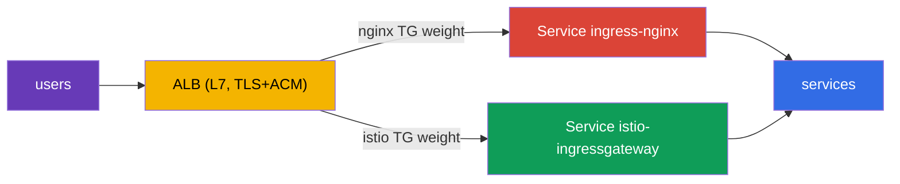

[RU version](ru.md) · [Versión en español](es.md)

# Chapter 26. Zero-downtime production migration: ingress-nginx to Istio

> **What's next.** One of the most common real-world tasks when adopting Istio is moving incoming
> traffic from an existing ingress controller (usually ingress-nginx) to an Istio Gateway. And doing
> it on a live production system, where users must not be affected. In this chapter we cover the
> methodology of such a migration: running in parallel, parity checking, switching by weights,
> rollback, and a plan for a hundred services.

## 26.1. The task and the givens

The conditions are close to real combat:

- the service runs 24/7, users **must not** be dropped (zero downtime);
- the migration is done in a **minimal-load window**;
- there are **many** services (hundreds) - not migrated in one pass, we go in **waves**;
- at every step a **fast rollback** is needed.

The main difficulty is not writing the Istio equivalent of the nginx rules (that part is actually
easy, chapters 5 and 11), but switching over **safely and reversibly**.

## 26.2. The main principle: two ingresses in parallel

The key idea of zero-downtime: **we do not delete nginx until the migration is complete**.
ingress-nginx and istio-ingressgateway run **simultaneously**, and public traffic is switched at the
level of the **external load balancer / DNS** - gradually and reversibly.



While the old path is alive, rollback is trivial: return the weight back to nginx. The rule of the
whole chapter: **first we build and validate the new path, then we switch, and only at the very end
do we delete the old one.**

## 26.3. A step-by-step plan for one service

For each host/service the process is the same:

1. **Build the equivalent in Istio.** `Gateway` + `VirtualService` - an exact copy of the nginx
   rules: hosts, paths, headers, timeouts, rewrites.
2. **Parity check before the switch.** The Istio gateway is already running in parallel; we send it
   test traffic and compare the behavior with nginx for every rule. Users still go through nginx.
3. **(optional) Mirroring.** Via `VirtualService.mirror` (chapter 6) we copy part of the live
   traffic to the new path - validation under real load with no impact on users.
4. **The switch in a low-load window.** On the external LB we smoothly change the weight:
   `nginx 100 / istio 0` → `90/10` → `50/50` → `0/100`. Between steps we watch the metrics.
5. **Soak.** We keep 100% on Istio for several hours/days, watching errors and latency. We do **not
   touch** the nginx config - it is a hot reserve.
6. **Decommission nginx** for this service - only after a successful soak.

For example, a header canary that in nginx required a separate Ingress with annotations becomes, in
Istio, a single `match` block on a header (chapter 6) - but it must be moved with the same care.

### Example: Ingress → Gateway + VirtualService

Let us walk step 1 on a concrete rule. Suppose nginx has a typical `Ingress`: host
`shop.example.com`, the path `/api` with prefix stripping, an HTTPS redirect, a read timeout:

```yaml
apiVersion: networking.k8s.io/v1
kind: Ingress
metadata:
  name: shop
  namespace: shop
  annotations:
    nginx.ingress.kubernetes.io/rewrite-target: /$2
    nginx.ingress.kubernetes.io/ssl-redirect: "true"
    nginx.ingress.kubernetes.io/proxy-read-timeout: "30"
spec:
  ingressClassName: nginx
  tls:
  - hosts: [shop.example.com]
    secretName: shop-tls                 # the secret is in the application namespace
  rules:
  - host: shop.example.com
    http:
      paths:
      - path: /api(/|$)(.*)
        pathType: ImplementationSpecific
        backend:
          service:
            name: api
            port: {number: 8080}
```

The exact Istio equivalent is two resources: a `Gateway` (what we listen for at the ingress) and a
`VirtualService` (where and how we route):

```yaml
apiVersion: networking.istio.io/v1
kind: Gateway
metadata:
  name: shop-gw
  namespace: shop
spec:
  selector:
    istio: ingressgateway                # which ingress gateway we attach to
  servers:
  - port: {number: 443, name: https, protocol: HTTPS}
    hosts: ["shop.example.com"]
    tls:
      mode: SIMPLE
      credentialName: shop-tls           # NOTE: the secret is looked up in the gateway's namespace
  - port: {number: 80, name: http, protocol: HTTP}
    hosts: ["shop.example.com"]
    tls:
      httpsRedirect: true                # = ssl-redirect: "true"
---
apiVersion: networking.istio.io/v1
kind: VirtualService
metadata:
  name: shop
  namespace: shop
spec:
  hosts: ["shop.example.com"]
  gateways: ["shop-gw"]
  http:
  - match:
    - uri:
        prefix: /api/                    # = path /api(/|$)(.*)
    rewrite:
      uri: /                             # = rewrite-target: /$2 (strip the prefix)
    route:
    - destination:
        host: api.shop.svc.cluster.local
        port: {number: 8080}
    timeout: 30s                         # = proxy-read-timeout: "30"
```

One non-obvious but important nuance during migration is **where the TLS secret lives**. In nginx
`secretName` is taken from the application namespace (`shop`). In Istio `credentialName` is by
default looked up in the **namespace of the ingress gateway itself** (usually `istio-system`). This
is a common cause of "the certificate was not picked up" after the move: the secret must either be
duplicated into the gateway's namespace, or the secret from the `Gateway` resource's namespace used
with the appropriate setting. Check this before the switch.

## 26.4. Parity check before the switch

This is the heart of a safe migration: fully validate the new path **while all users are still on
nginx**. What we check:

- **The health of the Istio configuration:** `istioctl analyze`, `istioctl proxy-status` (all
  `SYNCED`), the routes visible on the ingress gateway (`istioctl proxy-config routes`).
- **Direct requests to the istio-gateway bypassing the public LB.** We send requests straight to
  istio-ingressgateway with the right `Host` (in production via `curl --resolve`), without changing
  the public DNS. Users are not affected.
- **A parity matrix, nginx vs istio.** We run the same set of requests against both ingresses and
  compare: status code, which service responded, headers, redirects. Any discrepancy is a
  **showstopper**: we fix the VirtualService and repeat.
- **A load run.** `fortio`/`k6` straight at the istio-gateway, comparing p95/p99 and errors with
  nginx.

In practice, a direct request to the istio-gateway bypassing the public DNS is done with
`curl --resolve` - it sets the right `Host`, but resolves it to the IP of the new load balancer,
without touching Route53:

```bash
# the istio-gateway NLB (the public DNS still points at nginx)
ISTIO_LB=$(kubectl -n istio-system get svc istio-ingressgateway \
  -o jsonpath='{.status.loadBalancer.ingress[0].hostname}')

# the same request - straight into the new path
curl -sk --resolve shop.example.com:443:$(dig +short $ISTIO_LB | head -1) \
  https://shop.example.com/api/health -o /dev/null -w "istio: %{http_code}\n"
```

The simplest parity matrix is to run a list of paths through both ingresses and compare the codes:

```bash
NGINX_IP=$(dig +short nginx-nlb.example.com | head -1)
ISTIO_IP=$(dig +short $ISTIO_LB | head -1)
for p in / /api/health /api/v1/items /login /static/logo.png; do
  n=$(curl -sk --resolve shop.example.com:443:$NGINX_IP https://shop.example.com$p -o /dev/null -w '%{http_code}')
  i=$(curl -sk --resolve shop.example.com:443:$ISTIO_IP https://shop.example.com$p -o /dev/null -w '%{http_code}')
  [ "$n" = "$i" ] && s=OK || s=DIFF
  printf '%-20s nginx=%s istio=%s %s\n' "$p" "$n" "$i" "$s"
done
```

Any `DIFF` is a showstopper: fix the `VirtualService` and repeat. We switch traffic on the LB **only
when everything is green**.

## 26.5. What to switch traffic with: LB weights, not DNS

The switching mechanism directly affects how fast rollback is.

| Mechanism | Pros | Cons for rollback |
|-----------|------|-------------------|
| Weights on the external LB (ALB/NLB) | instant, no cache; rollback in seconds | requires an LB with weighting |
| Weighted DNS (for example Route53) | simple | cache/TTL - rollback is not instant |
| Per-host switching | risk isolation per host | more steps |

The recommendation for 24/7: switch **by weights on the load balancer** - rollback then takes
seconds. If only DNS is available, lower the TTL to 30-60 seconds in advance (a day ahead),
otherwise rollback will "stick" because of DNS caching on the clients.

## 26.6. Example: EKS, NLB, Route53, external-dns

Let us go through the migration on a concrete and very typical stack:

- an **EKS** cluster;
- **ingress-nginx** installed via Helm, its Service is of type `LoadBalancer` and creates an
  **NLB**;
- DNS is **Route53**, records are created by **external-dns** automatically from the Ingress/Service.

How it looks now: external-dns sees nginx and creates a Route53 record `shop.example.com` → the
nginx NLB. Users go through that NLB.



**Step 1. Bring up istio-ingressgateway with its own NLB.** We make the Istio gateway's Service of
type LoadBalancer with the AWS Load Balancer Controller's NLB annotations:

```yaml
# the istio-ingressgateway Service (a fragment)
metadata:
  annotations:
    service.beta.kubernetes.io/aws-load-balancer-type: "external"
    service.beta.kubernetes.io/aws-load-balancer-nlb-target-type: "ip"
    service.beta.kubernetes.io/aws-load-balancer-scheme: "internet-facing"
spec:
  type: LoadBalancer
```

We get a second, separate **istio NLB**, running in parallel with nginx. This does not concern users
yet - Route53 still points at nginx.

**Step 2. Build the Gateway + VirtualService and check parity** (section 26.4). We send test traffic
straight to the DNS name of the istio NLB via `curl --resolve`, without touching Route53.

**Step 3. The switch via weighted Route53 records.** Here is the stack's specificity: since the
records are managed by external-dns, we switch not by hand in the console but with **external-dns
weighted records**. On the source services we set weight annotations:

```yaml
# on istio-gw and on nginx - the same hostname, different set-identifiers and weights
external-dns.alpha.kubernetes.io/hostname: shop.example.com
external-dns.alpha.kubernetes.io/set-identifier: istio    # on nginx: nginx
external-dns.alpha.kubernetes.io/aws-weight: "0"          # change 0 -> 100
```

external-dns will create two weighted records in Route53 for one host, pointing at the different
NLBs. By changing the weights (`nginx 100/istio 0` → `50/50` → `0/100`), we smoothly move the
traffic.

**Important nuances of this exact stack:**

- **This is DNS switching, not LB weights.** That means rollback is **not instant** - the resolvers'
  cache and TTL are in play. As in section 26.5: lower the record's TTL to 30-60 seconds in advance
  (a day ahead). There will be no instant rollback like with a shared LB here - factor that into the
  plan.
- **external-dns must not "fight" you.** Make sure it is configured for weighted records
  (`set-identifier` + `aws-weight`) and owns the zone via a TXT registry, otherwise it may overwrite
  your weights.
- **Where to terminate TLS - a conscious choice.** There are two working options:
  - **On the NLB (a TLS listener + a certificate from ACM).** A common production option: TLS is
    terminated on the load balancer, ACM renews the certificates itself, encryption is taken off the
    cluster. The downside - Istio does not see the SNI/TLS, and the edge capabilities from chapter 9
    (MUTUAL, SNI-based routing, mTLS at the entry) are left out. NLB → istio-gateway goes as
    plaintext or is re-encrypted.
  - **On the istio-gateway (an NLB in TCP passthrough mode).** Istio itself manages the certificates
    and SNI, all the edge capabilities of chapter 9 are available, but you manage the certificates
    in the cluster.
  The choice: you need a simple offload and ACM auto-renewal - terminate on the NLB; you need Istio's
  edge features (mTLS/SNI/fine TLS-based routing) - passthrough to the istio-gateway. Also check the
  health check and, if needed, the proxy protocol.
- **The client's real IP.** The NLB can preserve the source IP (target-type `ip`); this matters if
  you use per-IP rate limiting (chapter 20) - otherwise Istio will see the NLB's address.

**Step 4. Soak and decommission.** We held 100% on istio, watched the metrics - and only then remove
nginx (first its weighted record, then the chart itself).

### The variant with an ALB instead of an NLB

Here we need to clear up a common confusion right away.

**ingress-nginx itself cannot "create an ALB".** The nginx controller is exposed through an ordinary
Kubernetes `Service` of type `LoadBalancer`, and such a Service on AWS creates an **NLB** (or the
legacy Classic ELB), but **not an ALB**. You cannot switch the nginx Service's load balancer class
to ALB - these are fundamentally different mechanisms.

**An ALB on EKS is created separately** - it is provisioned by the **AWS Load Balancer Controller**,
and not from a Service but from an `Ingress` resource (`ingressClassName: alb`) or a
`TargetGroupBinding`. That is, an ALB is a standalone L7 front placed **in front of** the ingress
controller, not a "mode" of nginx itself. So in such schemes the ALB is usually created in advance
(or by the same controller from a separate Ingress) and nginx is attached to it as a backend.

Hence the typical "ALB + nginx" architecture is **two layers**:

- the **ALB** (L7, TLS + ACM) accepts external traffic and terminates HTTPS;
- behind it a target group bound to the ingress-nginx Service (usually `NodePort`/`ClusterIP` +
  `TargetGroupBinding`), and nginx does the detailed path/host routing.

**How to migrate with such a scheme.** Since the ALB is a separate front, the switch is done **on
it**, between two target groups: one bound to the ingress-nginx Service, the second - to the
istio-ingressgateway Service. The weights are set either with weighted actions in the ALB `Ingress`
(`alb.ingress.kubernetes.io/actions.*`) or via `TargetGroupBinding`. By changing the target groups'
weights, we move the traffic `nginx → istio` **right on the ALB**.



The main plus: switching by target-group weights happens **on the ALB itself**, not through DNS, so
**rollback is instant** - without the TTL problem discussed for NLB+Route53. This is exactly the
"switch by weights on the LB" ideal from section 26.5.

**What to account for when installing Istio behind an ALB.** istio-ingressgateway must become a
target of the ALB, not bring up its own public load balancer:

- its Service is made `NodePort` or `ClusterIP` (its own NLB is not needed - the ALB is the front)
  and bound to a target group via `TargetGroupBinding` or the ALB `Ingress`;
- the ALB's health check is configured to the gateway's readiness port/path;
- since the ALB already terminated TLS, traffic to the istio-gateway goes over HTTP (or is
  re-encrypted) - the gateway is configured to accept HTTP from the ALB, not its own TLS.

**Caveats:**

- **TLS is always terminated on the ALB** (it is L7, otherwise it could not route by HTTP). So
  Istio's edge capabilities from chapter 9 (SNI-based routing, MUTUAL, mTLS at the entry) are simply
  unavailable. If you need them - use an NLB in passthrough mode.
- **The client's real IP is in `X-Forwarded-For`.** The ALB does not preserve the source IP at L3.
  For per-IP rate limiting (chapter 20) set `numTrustedProxies` so Istio extracts the IP from XFF.
- **external-dns creates one record** for the ALB - the weighting is done at the level of the ALB's
  target groups, not DNS.

The bottom line of the comparison for migration: the **NLB** is simpler and allows passthrough (if
you need Istio's edge features), but switching goes through DNS with a not-fast rollback. The
**ALB** is a separate L7 layer in front of the ingress, more complex in structure and always
terminates TLS, but gives instant and reversible switching by target-group weights - which is very
valuable for zero-downtime.

### ALB or NLB in front of Istio: a full comparison

This choice matters not only during migration but also for installing Istio on EKS in general
(chapter 27). Let us sum up the pros and cons of both load balancers in front of istio-ingressgateway.

| Criterion | NLB (L4) | ALB (L7) |
|-----------|----------|----------|
| Layer | L4 (TCP/UDP/TLS) | L7 (HTTP/HTTPS/gRPC) |
| TLS | passthrough **or** termination (a TLS listener + ACM) | always terminates (ACM) |
| Istio edge features (SNI, MUTUAL, mTLS at entry) | available (in passthrough mode) | unavailable (the ALB opens up HTTPS) |
| Where the routing is | all in Istio (a single source of truth) | part on the ALB (host/path), duplicated with Istio |
| Non-HTTP traffic (TCP, arbitrary) | yes | no, only HTTP/HTTPS/gRPC |
| The client's real IP | preserves the source IP (target-type `ip`) | in `X-Forwarded-For` |
| Weighting at the LB level | no (switching via DNS) | yes (weighted target groups), instant rollback |
| Integration with AWS WAF / Cognito | no | yes |
| Latency / performance | lower latency, higher throughput | a bit more overhead (L7 processing) |
| Managed by | annotations on the `Service` | `Ingress`/`TargetGroupBinding` (AWS LB Controller) |

**Take an NLB when:**

- you need Istio's edge capabilities: mTLS at the entry, `MUTUAL`, SNI-based routing, end-to-end
  encryption to the gateway (passthrough);
- **non-HTTP** traffic goes through the ingress (TCP, gRPC with end-to-end mTLS, custom protocols);
- you want **all** routing and TLS to be in Istio - a single source of truth, without duplicating
  rules on the ALB;
- minimal latency and high throughput matter.

**Take an ALB when:**

- you want to offload TLS to ACM and Istio's edge features are not needed;
- you need integration with **AWS WAF**, Cognito, authentication at the ALB level;
- you want weighted switching and canary **at the load balancer level** (instant rollback during
  migrations);
- the organization is already standardized on ALB and the AWS LB Controller.

**A practical guideline.** For "pure" Istio an **NLB** is more often chosen: it leaves all of L7
(routing, TLS, edge policies) inside the mesh, which means all of Istio's capabilities are available
and the rules live in one place. An **ALB** is chosen when the organization is tied to its ecosystem
(WAF, ACM, Cognito) or when weighted traffic switching at the LB level is needed. The trade-off is
simple: the ALB takes on part of the work (TLS, WAF, weights), but takes away part of the L7 control
from Istio.

## 26.7. The rollback plan

Rollback should take seconds to minutes, because the old path has not been dismantled:

1. On the external LB return the weight back to nginx (`istio 0 / nginx 100`).
2. Confirm via metrics that 5xx and latency have returned to normal.
3. Nothing needs to be restored - the nginx `Ingress` was untouched all this time.
4. Investigate the cause (usually a rule mismatch), fix the `VirtualService`, pass the parity test
   again and repeat the switch.

Precisely because the old path is alive, the migration stays low-risk at every step.

## 26.8. Migrating 100+ services in waves

You cannot migrate everything at once - confidence is built up in waves:

- **Wave 0 (pilot):** 2-3 non-critical services with low traffic. Switch them, watch for several
  days. Break in the runbook, the dashboards and the rollback procedure.
- **Waves 1..N (the bulk):** batches of 5-10 services, each batch - only after a stable soak of the
  previous one. The process is repeatable (Gateway/VirtualService templates).
- **The final wave:** the most critical and highly loaded services - last, with maximum monitoring
  and a rehearsed rollback.

Between waves the metrics are recorded (errors, p95/p99, incidents). Any regression is a showstopper
for the next wave.

## 26.9. Risks and how to remove them

| Risk | Mitigation |
|------|------------|
| A rule mismatch (path/header/regex) | a parity test of every rule before the switch |
| A difference in path semantics (`pathType`, rewrite) | map explicitly to `uri.exact/prefix` + `rewrite.uri`, test |
| Different timeouts/limits nginx vs Istio | set explicit `timeout`/`retries` in the VirtualService |
| Sticky sessions / affinity | `DestinationRule` `consistentHash` (by cookie/header) |
| mTLS/injection breaks traffic between services | during the migration keep `PeerAuthentication: PERMISSIVE` |
| WebSocket / gRPC / large headers | test explicitly; correct port names (chapters 10, 23) |
| DNS cache on rollback | switch by LB weights; a low TTL in advance |
| No observability at the moment of cutover | dashboards and alerts (5xx, p99) ready **before** the switch |

## 26.10. Auto-conversion: ingress2gateway

Rewriting the rules by hand is not mandatory. The **ingress2gateway** tool (a kubernetes-sigs
project) reads the existing `Ingress` resources together with the provider's annotations and
generates Gateway API resources:

```bash
ingress2gateway print --providers ingress-nginx -A
```

Important caveats:

- it emits **Gateway API** (`Gateway`/`HTTPRoute`), not native Istio `Gateway`/`VirtualService`.
  Istio implements the Gateway API (chapter 11), so apply the generated output with
  `gatewayClassName: istio`;
- **not everything converts 1:1**: specific nginx annotations (rewrite, canary-by-header, auth-url,
  custom timeouts) may transfer partially or not at all - the output is a **draft**;
- therefore a **review and a parity test** before the switch are mandatory.

The practical flow: `ingress2gateway print ... > gwapi.yaml` → review and edit → `kubectl apply` in
parallel with nginx → parity check → switch the weights on the LB.

### Cheat sheet: ingress-nginx annotations → Istio

It is precisely the annotations that auto-conversion most often "stumbles" on - many nginx
capabilities are implemented in Istio by other resources. A guide to the most common ones:

| ingress-nginx annotation | Istio equivalent |
|--------------------------|------------------|
| `rewrite-target` | `VirtualService` → `http.rewrite.uri` |
| `ssl-redirect` / `force-ssl-redirect` | `Gateway` → server `tls.httpsRedirect: true` |
| `canary` + `canary-by-header` / `canary-weight` | `VirtualService` → `http.match.headers` or weighted `route` (chapter 6) |
| `proxy-read-timeout` / `proxy-send-timeout` | `VirtualService` → `http.timeout` |
| `proxy-next-upstream*` / retries | `VirtualService` → `http.retries` |
| `limit-rps` / `limit-connections` | local rate limit via `EnvoyFilter` (chapter 20) |
| `auth-url` / `auth-signin` (external authentication) | `AuthorizationPolicy` `CUSTOM` + ext_authz (chapter 15) |
| `whitelist-source-range` | `AuthorizationPolicy` `ipBlocks`/`remoteIpBlocks` (chapter 14) |
| `affinity: cookie` (sticky sessions) | `DestinationRule` → `consistentHash` by cookie/header |
| `backend-protocol: GRPC`/`HTTPS` | Service port name (`grpc-`, chapter 10) / `DestinationRule` `tls` |
| `configuration-snippet` / `server-snippet` | `EnvoyFilter` (chapter 21) - transfer by hand |

The rule is simple: the more "exotic" the annotation (snippets, custom authorization, limits), the
smaller the chance it converts automatically - such rules are transferred by hand and checked with a
separate parity test.

## 26.11. Chapter summary

- A zero-downtime migration is built on **running nginx and Istio in parallel**: the old path is not
  deleted until the end.
- The process for a service: build the equivalent → parity check before the switch → (optionally)
  mirroring → smoothly switch the weights → soak → decommission nginx.
- The parity check (analyze, proxy-status, direct requests to the istio-gateway, comparison with
  nginx, load) is mandatory before switching users.
- It is better to switch **by weights on the LB** (instant rollback), not DNS (cache/TTL); with DNS
  - a low TTL in advance.
- Rollback is returning the weight to nginx in seconds, because the old path is alive.
- 100+ services are migrated **in waves**: pilot → batches → the critical ones last.
- A nginx `Ingress` rule is transferred into a `Gateway` + `VirtualService` pair (host, path
  `match`, `rewrite`, `timeout`, TLS via `credentialName`); a common trap - the TLS secret is looked
  up in the ingress gateway's namespace, not the application's.
- Many nginx annotations map to other Istio resources (rewrite/timeout → VirtualService, auth-url →
  ext_authz, limit-rps → rate limit, snippet → EnvoyFilter) - see the cheat sheet.
- `ingress2gateway` speeds up the transfer but gives a draft (Gateway API) - a review and parity are
  mandatory.
- On the EKS + NLB + Route53 + external-dns stack the switch goes by weighted Route53 records
  (external-dns), not LB weights - so rollback is not instant: lower the TTL in advance. TLS can be
  terminated on the NLB (a TLS listener + ACM, a simple offload) or on the istio-gateway
  (passthrough, if you need Istio's edge features). An NLB with target-type `ip` preserves the real
  IP.
- With an **ALB** the switch is done by target-group weights right on the load balancer - rollback
  is instant (no DNS TTL). But the ALB always terminates TLS (Istio's edge features are unavailable),
  and the real IP is taken from `X-Forwarded-For` (`numTrustedProxies` is needed).

## 26.12. Self-check questions

1. Why must nginx not be deleted until the end of the migration?
2. What is a parity check and why is it done before switching users?
3. Why, for 24/7, do you switch by weights on the LB and not through DNS?
4. What does a rollback look like and why does it take seconds?
5. Why migrate in waves and in what order do you take the services?
6. How is a nginx `Ingress` rule (host, path, rewrite, timeout, TLS) transferred into a `Gateway` +
   `VirtualService`, and where must the TLS secret live in that case?
7. How do you check the parity of the new path directly on the istio-gateway without touching the
   public DNS?
8. Into which Istio resources do the nginx annotations `rewrite-target`, `auth-url`, `limit-rps` and
   `configuration-snippet` go?
9. What does `ingress2gateway` do and why can its output not be applied without a check?
10. On the EKS + NLB + Route53 + external-dns stack: how do you switch traffic, why is rollback not
    instant, and where is TLS terminated?
11. How does migration with an ALB differ from an NLB? Why is rollback with an ALB instant, while
    Istio's edge features are unavailable?
12. When do you choose an NLB in front of Istio and when an ALB? Name the key pros and cons of each.

## Practice

Practice a pilot wave of a real ingress-nginx to Istio Gateway migration: build the equivalent of
the rules, check parity, work through switching by weights and rollback:

🧪 Lab 31: [tasks/ica/labs/31](../../labs/31/README.MD)

---
[Contents](../README.md) · [Chapter 25](../25/en.md) · [Chapter 27](../27/en.md)
