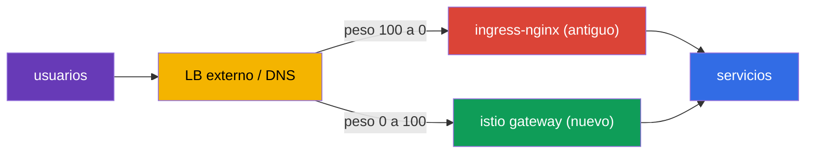
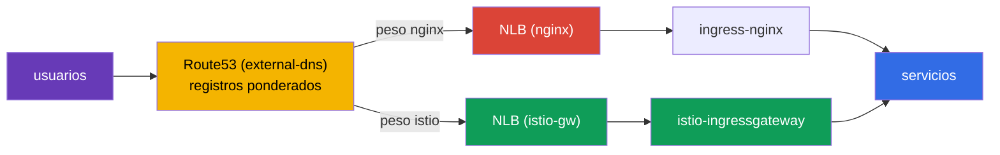
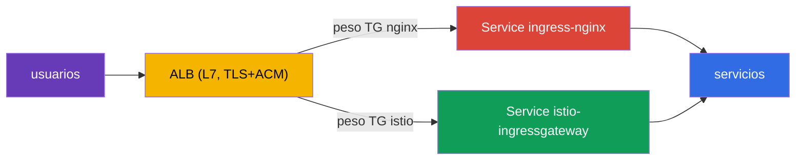

[RU version](ru.md) · [Eng version](en.md)

# Capítulo 26. Migración en producción sin downtime: de ingress-nginx a Istio

> **Qué sigue.** Una de las tareas reales más habituales al adoptar Istio es mover el tráfico
> entrante desde un controlador de ingress existente (normalmente ingress-nginx) a un Istio Gateway.
> Y hacerlo sobre un sistema de producción en vivo, donde los usuarios no deben verse afectados. En
> este capítulo cubrimos la metodología de una migración así: correr en paralelo, la verificación de
> paridad, el cambio por pesos, el rollback y un plan para un centenar de servicios.

## 26.1. La tarea y las condiciones dadas

Las condiciones se parecen a un combate real:

- el servicio corre 24/7, los usuarios **no deben** caerse (zero downtime);
- la migración se hace en una **ventana de carga mínima**;
- hay **muchos** servicios (cientos) - no se migran de una sola pasada, vamos en **oleadas**;
- en cada paso hace falta un **rollback rápido**.

La principal dificultad no es escribir el equivalente en Istio de las reglas de nginx (esa parte en
realidad es fácil, capítulos 5 y 11), sino cambiar **de forma segura y reversible**.

## 26.2. El principio principal: dos ingresses en paralelo

La idea clave del zero-downtime: **no borramos nginx hasta que la migración esté completa**.
ingress-nginx y istio-ingressgateway corren **simultáneamente**, y el tráfico público se cambia al
nivel del **balanceador de carga externo / DNS** - de forma gradual y reversible.



Mientras el camino antiguo esté vivo, el rollback es trivial: devuelve el peso a nginx. La regla de
todo el capítulo: **primero construimos y validamos el nuevo camino, luego cambiamos, y solo al
final del todo borramos el antiguo.**

## 26.3. Un plan paso a paso para un servicio

Para cada host/servicio el proceso es el mismo:

1. **Construir el equivalente en Istio.** `Gateway` + `VirtualService` - una copia exacta de las
   reglas de nginx: hosts, paths, cabeceras, timeouts, rewrites.
2. **Verificación de paridad antes del cambio.** El gateway de Istio ya corre en paralelo; le
   enviamos tráfico de prueba y comparamos el comportamiento con nginx para cada regla. Los usuarios
   siguen pasando por nginx.
3. **(opcional) Mirroring.** Vía `VirtualService.mirror` (capítulo 6) copiamos parte del tráfico
   vivo al nuevo camino - validación bajo carga real sin impacto en los usuarios.
4. **El cambio en una ventana de baja carga.** En el LB externo cambiamos suavemente el peso:
   `nginx 100 / istio 0` → `90/10` → `50/50` → `0/100`. Entre pasos observamos las métricas.
5. **Soak.** Mantenemos el 100% en Istio durante varias horas/días, observando errores y latencia.
   **No tocamos** la configuración de nginx - es una reserva en caliente.
6. **Retirar nginx** para este servicio - solo tras un soak exitoso.

Por ejemplo, un canary por cabecera que en nginx requería un Ingress aparte con anotaciones se
convierte, en Istio, en un único bloque `match` sobre una cabecera (capítulo 6) - pero hay que
moverlo con el mismo cuidado.

### Ejemplo: Ingress → Gateway + VirtualService

Recorramos el paso 1 sobre una regla concreta. Supongamos que nginx tiene un `Ingress` típico: host
`shop.example.com`, el path `/api` con eliminación del prefijo, un redirect a HTTPS, un read timeout:

```yaml
apiVersion: networking.k8s.io/v1
kind: Ingress
metadata:
  name: shop
  namespace: shop
  annotations:
    nginx.ingress.kubernetes.io/rewrite-target: /$2
    nginx.ingress.kubernetes.io/ssl-redirect: "true"
    nginx.ingress.kubernetes.io/proxy-read-timeout: "30"
spec:
  ingressClassName: nginx
  tls:
  - hosts: [shop.example.com]
    secretName: shop-tls                 # el secret está en el namespace de la aplicación
  rules:
  - host: shop.example.com
    http:
      paths:
      - path: /api(/|$)(.*)
        pathType: ImplementationSpecific
        backend:
          service:
            name: api
            port: {number: 8080}
```

El equivalente exacto en Istio son dos recursos: un `Gateway` (qué escuchamos en el ingress) y un
`VirtualService` (a dónde y cómo enrutamos):

```yaml
apiVersion: networking.istio.io/v1
kind: Gateway
metadata:
  name: shop-gw
  namespace: shop
spec:
  selector:
    istio: ingressgateway                # a qué ingress gateway nos enganchamos
  servers:
  - port: {number: 443, name: https, protocol: HTTPS}
    hosts: ["shop.example.com"]
    tls:
      mode: SIMPLE
      credentialName: shop-tls           # OJO: el secret se busca en el namespace del gateway
  - port: {number: 80, name: http, protocol: HTTP}
    hosts: ["shop.example.com"]
    tls:
      httpsRedirect: true                # = ssl-redirect: "true"
---
apiVersion: networking.istio.io/v1
kind: VirtualService
metadata:
  name: shop
  namespace: shop
spec:
  hosts: ["shop.example.com"]
  gateways: ["shop-gw"]
  http:
  - match:
    - uri:
        prefix: /api/                    # = path /api(/|$)(.*)
    rewrite:
      uri: /                             # = rewrite-target: /$2 (elimina el prefijo)
    route:
    - destination:
        host: api.shop.svc.cluster.local
        port: {number: 8080}
    timeout: 30s                         # = proxy-read-timeout: "30"
```

Un matiz no obvio pero importante durante la migración es **dónde vive el secret de TLS**. En nginx
`secretName` se toma del namespace de la aplicación (`shop`). En Istio `credentialName` se busca por
defecto en el **namespace del propio ingress gateway** (normalmente `istio-system`). Esta es una
causa habitual de "el certificado no se recogió" tras el traslado: el secret debe o bien duplicarse
en el namespace del gateway, o bien usar el secret del namespace del recurso `Gateway` con el ajuste
apropiado. Comprueba esto antes del cambio.

## 26.4. Verificación de paridad antes del cambio

Este es el corazón de una migración segura: validar por completo el nuevo camino **mientras todos
los usuarios siguen en nginx**. Qué comprobamos:

- **La salud de la configuración de Istio:** `istioctl analyze`, `istioctl proxy-status` (todo
  `SYNCED`), las rutas visibles en el ingress gateway (`istioctl proxy-config routes`).
- **Peticiones directas al istio-gateway saltándose el LB público.** Enviamos peticiones directas a
  istio-ingressgateway con el `Host` correcto (en producción vía `curl --resolve`), sin cambiar el
  DNS público. Los usuarios no se ven afectados.
- **Una matriz de paridad, nginx vs istio.** Lanzamos el mismo conjunto de peticiones contra ambos
  ingresses y comparamos: código de estado, qué servicio respondió, cabeceras, redirects. Cualquier
  discrepancia es un **showstopper**: corregimos el VirtualService y repetimos.
- **Una prueba de carga.** `fortio`/`k6` directo contra el istio-gateway, comparando p95/p99 y
  errores con nginx.

En la práctica, una petición directa al istio-gateway saltándose el DNS público se hace con
`curl --resolve` - establece el `Host` correcto, pero lo resuelve a la IP del nuevo balanceador de
carga, sin tocar Route53:

```bash
# el NLB del istio-gateway (el DNS público todavía apunta a nginx)
ISTIO_LB=$(kubectl -n istio-system get svc istio-ingressgateway \
  -o jsonpath='{.status.loadBalancer.ingress[0].hostname}')

# la misma petición - directa al nuevo camino
curl -sk --resolve shop.example.com:443:$(dig +short $ISTIO_LB | head -1) \
  https://shop.example.com/api/health -o /dev/null -w "istio: %{http_code}\n"
```

La matriz de paridad más simple es lanzar una lista de paths a través de ambos ingresses y comparar
los códigos:

```bash
NGINX_IP=$(dig +short nginx-nlb.example.com | head -1)
ISTIO_IP=$(dig +short $ISTIO_LB | head -1)
for p in / /api/health /api/v1/items /login /static/logo.png; do
  n=$(curl -sk --resolve shop.example.com:443:$NGINX_IP https://shop.example.com$p -o /dev/null -w '%{http_code}')
  i=$(curl -sk --resolve shop.example.com:443:$ISTIO_IP https://shop.example.com$p -o /dev/null -w '%{http_code}')
  [ "$n" = "$i" ] && s=OK || s=DIFF
  printf '%-20s nginx=%s istio=%s %s\n' "$p" "$n" "$i" "$s"
done
```

Cualquier `DIFF` es un showstopper: corrige el `VirtualService` y repite. Cambiamos el tráfico en el
LB **solo cuando todo está en verde**.

## 26.5. Con qué cambiar el tráfico: pesos en el LB, no DNS

El mecanismo de cambio afecta directamente a lo rápido que es el rollback.

| Mecanismo | Pros | Contras para el rollback |
|-----------|------|--------------------------|
| Pesos en el LB externo (ALB/NLB) | instantáneo, sin caché; rollback en segundos | requiere un LB con ponderación |
| DNS ponderado (por ejemplo Route53) | simple | caché/TTL - el rollback no es instantáneo |
| Cambio por host | aislamiento del riesgo por host | más pasos |

La recomendación para 24/7: cambiar **por pesos en el balanceador de carga** - el rollback entonces
lleva segundos. Si solo hay DNS disponible, baja el TTL a 30-60 segundos con antelación (un día
antes), de lo contrario el rollback se "atascará" por el cacheo de DNS en los clientes.

## 26.6. Ejemplo: EKS, NLB, Route53, external-dns

Recorramos la migración sobre un stack concreto y muy típico:

- un clúster **EKS**;
- **ingress-nginx** instalado vía Helm, su Service es de tipo `LoadBalancer` y crea un **NLB**;
- el DNS es **Route53**, los registros los crea **external-dns** automáticamente desde el
  Ingress/Service.

Cómo se ve ahora: external-dns ve nginx y crea un registro en Route53 `shop.example.com` → el NLB de
nginx. Los usuarios pasan por ese NLB.



**Paso 1. Levantar istio-ingressgateway con su propio NLB.** Hacemos el Service del gateway de Istio
de tipo LoadBalancer con las anotaciones de NLB del AWS Load Balancer Controller:

```yaml
# el Service istio-ingressgateway (un fragmento)
metadata:
  annotations:
    service.beta.kubernetes.io/aws-load-balancer-type: "external"
    service.beta.kubernetes.io/aws-load-balancer-nlb-target-type: "ip"
    service.beta.kubernetes.io/aws-load-balancer-scheme: "internet-facing"
spec:
  type: LoadBalancer
```

Obtenemos un segundo **NLB de istio** separado, corriendo en paralelo con nginx. Esto todavía no
afecta a los usuarios - Route53 sigue apuntando a nginx.

**Paso 2. Construir el Gateway + VirtualService y comprobar la paridad** (sección 26.4). Enviamos
tráfico de prueba directamente al nombre DNS del NLB de istio vía `curl --resolve`, sin tocar
Route53.

**Paso 3. El cambio vía registros ponderados de Route53.** Aquí está la particularidad del stack:
como los registros los gestiona external-dns, cambiamos no a mano en la consola sino con **registros
ponderados de external-dns**. En los servicios de origen ponemos anotaciones de peso:

```yaml
# en istio-gw y en nginx - el mismo hostname, distintos set-identifiers y pesos
external-dns.alpha.kubernetes.io/hostname: shop.example.com
external-dns.alpha.kubernetes.io/set-identifier: istio    # en nginx: nginx
external-dns.alpha.kubernetes.io/aws-weight: "0"          # cambia 0 -> 100
```

external-dns creará dos registros ponderados en Route53 para un mismo host, apuntando a los distintos
NLBs. Cambiando los pesos (`nginx 100/istio 0` → `50/50` → `0/100`), movemos el tráfico suavemente.

**Matices importantes de este stack en concreto:**

- **Esto es cambio por DNS, no pesos en el LB.** Eso significa que el rollback **no es instantáneo** -
  la caché y el TTL de los resolvers entran en juego. Como en la sección 26.5: baja el TTL del
  registro a 30-60 segundos con antelación (un día antes). Aquí no habrá rollback instantáneo como
  con un LB compartido - tenlo en cuenta en el plan.
- **external-dns no debe "pelearse" contigo.** Asegúrate de que esté configurado para registros
  ponderados (`set-identifier` + `aws-weight`) y sea dueño de la zona vía un registro TXT, de lo
  contrario podría sobrescribir tus pesos.
- **Dónde terminar TLS - una elección consciente.** Hay dos opciones que funcionan:
  - **En el NLB (un listener TLS + un certificado de ACM).** Una opción de producción habitual: TLS
    se termina en el balanceador de carga, ACM renueva los certificados por sí mismo, el cifrado se
    saca del clúster. La desventaja - Istio no ve el SNI/TLS, y las capacidades de borde del capítulo
    9 (MUTUAL, enrutamiento basado en SNI, mTLS en la entrada) quedan fuera. NLB → istio-gateway va
    como plaintext o se re-cifra.
  - **En el istio-gateway (un NLB en modo TCP passthrough).** Istio mismo gestiona los certificados y
    el SNI, todas las capacidades de borde del capítulo 9 están disponibles, pero gestionas los
    certificados en el clúster.
  La elección: necesitas un offload simple y auto-renovación de ACM - termina en el NLB; necesitas
  las funciones de borde de Istio (mTLS/SNI/enrutamiento fino basado en TLS) - passthrough hacia el
  istio-gateway. Comprueba también el health check y, si hace falta, el proxy protocol.
- **La IP real del cliente.** El NLB puede preservar la IP de origen (target-type `ip`); esto importa
  si usas rate limiting por IP (capítulo 20) - de lo contrario Istio verá la dirección del NLB.

**Paso 4. Soak y retirada.** Mantuvimos el 100% en istio, observamos las métricas - y solo entonces
quitamos nginx (primero su registro ponderado, luego el chart en sí).

### La variante con un ALB en vez de un NLB

Aquí hay que aclarar de entrada una confusión habitual.

**ingress-nginx por sí mismo no puede "crear un ALB".** El controlador de nginx se expone a través de
un `Service` de Kubernetes ordinario de tipo `LoadBalancer`, y un Service así en AWS crea un **NLB**
(o el Classic ELB heredado), pero **no un ALB**. No puedes cambiar la clase de balanceador de carga
del Service de nginx a ALB - son mecanismos fundamentalmente distintos.

**Un ALB en EKS se crea por separado** - lo provisiona el **AWS Load Balancer Controller**, y no
desde un Service sino desde un recurso `Ingress` (`ingressClassName: alb`) o un `TargetGroupBinding`.
Es decir, un ALB es un frente L7 independiente colocado **delante del** controlador de ingress, no un
"modo" del propio nginx. Así que en estos esquemas el ALB suele crearse de antemano (o por el mismo
controlador desde un Ingress aparte) y nginx se le engancha como backend.

De ahí que la arquitectura típica "ALB + nginx" sea de **dos capas**:

- el **ALB** (L7, TLS + ACM) acepta el tráfico externo y termina HTTPS;
- detrás de él un target group ligado al Service de ingress-nginx (normalmente `NodePort`/`ClusterIP`
  + `TargetGroupBinding`), y nginx hace el enrutamiento detallado por path/host.

**Cómo migrar con este esquema.** Como el ALB es un frente separado, el cambio se hace **en él**,
entre dos target groups: uno ligado al Service de ingress-nginx, el segundo - al Service de
istio-ingressgateway. Los pesos se ponen o bien con weighted actions en el `Ingress` del ALB
(`alb.ingress.kubernetes.io/actions.*`) o vía `TargetGroupBinding`. Cambiando los pesos de los target
groups, movemos el tráfico `nginx → istio` **directamente en el ALB**.



La principal ventaja: el cambio por pesos de target-group ocurre **en el propio ALB**, no a través de
DNS, así que el **rollback es instantáneo** - sin el problema del TTL discutido para NLB+Route53.
Esto es exactamente el ideal de "cambiar por pesos en el LB" de la sección 26.5.

**Qué tener en cuenta al instalar Istio detrás de un ALB.** istio-ingressgateway debe convertirse en
un target del ALB, no levantar su propio balanceador de carga público:

- su Service se hace `NodePort` o `ClusterIP` (no hace falta su propio NLB - el ALB es el frente) y
  se liga a un target group vía `TargetGroupBinding` o el `Ingress` del ALB;
- el health check del ALB se configura al puerto/path de readiness del gateway;
- como el ALB ya terminó TLS, el tráfico al istio-gateway va por HTTP (o se re-cifra) - el gateway se
  configura para aceptar HTTP del ALB, no su propio TLS.

**Advertencias:**

- **TLS siempre se termina en el ALB** (es L7, de lo contrario no podría enrutar por HTTP). Así que
  las capacidades de borde de Istio del capítulo 9 (enrutamiento basado en SNI, MUTUAL, mTLS en la
  entrada) simplemente no están disponibles. Si las necesitas - usa un NLB en modo passthrough.
- **La IP real del cliente está en `X-Forwarded-For`.** El ALB no preserva la IP de origen en L3.
  Para rate limiting por IP (capítulo 20) configura `numTrustedProxies` para que Istio extraiga la IP
  de XFF.
- **external-dns crea un registro** para el ALB - la ponderación se hace al nivel de los target
  groups del ALB, no del DNS.

La conclusión de la comparación para la migración: el **NLB** es más simple y permite passthrough (si
necesitas las funciones de borde de Istio), pero el cambio va por DNS con un rollback no rápido. El
**ALB** es una capa L7 separada delante del ingress, más compleja en estructura y siempre termina
TLS, pero da un cambio instantáneo y reversible por pesos de target-group - lo cual es muy valioso
para zero-downtime.

### ALB o NLB delante de Istio: una comparación completa

Esta elección importa no solo durante la migración sino también para instalar Istio en EKS en general
(capítulo 27). Resumamos los pros y contras de ambos balanceadores de carga delante de
istio-ingressgateway.

| Criterio | NLB (L4) | ALB (L7) |
|----------|----------|----------|
| Capa | L4 (TCP/UDP/TLS) | L7 (HTTP/HTTPS/gRPC) |
| TLS | passthrough **o** terminación (un listener TLS + ACM) | siempre termina (ACM) |
| Funciones de borde de Istio (SNI, MUTUAL, mTLS en la entrada) | disponibles (en modo passthrough) | no disponibles (el ALB abre HTTPS) |
| Dónde está el enrutamiento | todo en Istio (una única fuente de verdad) | parte en el ALB (host/path), duplicado con Istio |
| Tráfico no-HTTP (TCP, arbitrario) | sí | no, solo HTTP/HTTPS/gRPC |
| La IP real del cliente | preserva la IP de origen (target-type `ip`) | en `X-Forwarded-For` |
| Ponderación a nivel del LB | no (cambio vía DNS) | sí (target groups ponderados), rollback instantáneo |
| Integración con AWS WAF / Cognito | no | sí |
| Latencia / rendimiento | menor latencia, mayor throughput | algo más de overhead (procesamiento L7) |
| Gestionado por | anotaciones en el `Service` | `Ingress`/`TargetGroupBinding` (AWS LB Controller) |

**Toma un NLB cuando:**

- necesitas las capacidades de borde de Istio: mTLS en la entrada, `MUTUAL`, enrutamiento basado en
  SNI, cifrado de extremo a extremo hasta el gateway (passthrough);
- pasa tráfico **no-HTTP** por el ingress (TCP, gRPC con mTLS de extremo a extremo, protocolos
  personalizados);
- quieres que **todo** el enrutamiento y el TLS estén en Istio - una única fuente de verdad, sin
  duplicar reglas en el ALB;
- importan la latencia mínima y el alto throughput.

**Toma un ALB cuando:**

- quieres descargar TLS a ACM y las funciones de borde de Istio no son necesarias;
- necesitas integración con **AWS WAF**, Cognito, autenticación al nivel del ALB;
- quieres cambio ponderado y canary **al nivel del balanceador de carga** (rollback instantáneo
  durante las migraciones);
- la organización ya está estandarizada en ALB y el AWS LB Controller.

**Una guía práctica.** Para Istio "puro" se elige más a menudo un **NLB**: deja todo el L7
(enrutamiento, TLS, políticas de borde) dentro de la malla, lo que significa que todas las
capacidades de Istio están disponibles y las reglas viven en un solo sitio. Un **ALB** se elige
cuando la organización está atada a su ecosistema (WAF, ACM, Cognito) o cuando hace falta cambio
ponderado del tráfico al nivel del LB. El trade-off es simple: el ALB asume parte del trabajo (TLS,
WAF, pesos), pero le quita a Istio parte del control de L7.

## 26.7. El plan de rollback

El rollback debería llevar de segundos a minutos, porque el camino antiguo no se ha desmantelado:

1. En el LB externo devuelve el peso a nginx (`istio 0 / nginx 100`).
2. Confirma vía métricas que los 5xx y la latencia han vuelto a la normalidad.
3. No hay nada que restaurar - el `Ingress` de nginx quedó intacto todo este tiempo.
4. Investiga la causa (normalmente una discrepancia de reglas), corrige el `VirtualService`, pasa el
   test de paridad de nuevo y repite el cambio.

Precisamente porque el camino antiguo está vivo, la migración se mantiene de bajo riesgo en cada
paso.

## 26.8. Migrar más de 100 servicios en oleadas

No puedes migrar todo de una vez - la confianza se construye en oleadas:

- **Oleada 0 (piloto):** 2-3 servicios no críticos con poco tráfico. Los cambias, observas durante
  varios días. Rodas el runbook, los dashboards y el procedimiento de rollback.
- **Oleadas 1..N (el grueso):** lotes de 5-10 servicios, cada lote - solo tras un soak estable del
  anterior. El proceso es repetible (plantillas de Gateway/VirtualService).
- **La oleada final:** los servicios más críticos y de mayor carga - al final, con el máximo de
  monitorización y un rollback ensayado.

Entre oleadas se registran las métricas (errores, p95/p99, incidentes). Cualquier regresión es un
showstopper para la siguiente oleada.

## 26.9. Riesgos y cómo eliminarlos

| Riesgo | Mitigación |
|--------|------------|
| Una discrepancia de reglas (path/header/regex) | un test de paridad de cada regla antes del cambio |
| Una diferencia en la semántica de paths (`pathType`, rewrite) | mapea explícitamente a `uri.exact/prefix` + `rewrite.uri`, prueba |
| Timeouts/límites distintos nginx vs Istio | pon `timeout`/`retries` explícitos en el VirtualService |
| Sticky sessions / affinity | `DestinationRule` `consistentHash` (por cookie/cabecera) |
| mTLS/inyección rompen el tráfico entre servicios | durante la migración mantén `PeerAuthentication: PERMISSIVE` |
| WebSocket / gRPC / cabeceras grandes | prueba explícitamente; nombres de puerto correctos (capítulos 10, 23) |
| Caché de DNS en el rollback | cambia por pesos del LB; un TTL bajo con antelación |
| Sin observabilidad en el momento del cutover | dashboards y alertas (5xx, p99) listos **antes** del cambio |

## 26.10. Auto-conversión: ingress2gateway

Reescribir las reglas a mano no es obligatorio. La herramienta **ingress2gateway** (un proyecto de
kubernetes-sigs) lee los recursos `Ingress` existentes junto con las anotaciones del proveedor y
genera recursos de la Gateway API:

```bash
ingress2gateway print --providers ingress-nginx -A
```

Advertencias importantes:

- emite **Gateway API** (`Gateway`/`HTTPRoute`), no `Gateway`/`VirtualService` nativos de Istio.
  Istio implementa la Gateway API (capítulo 11), así que aplica la salida generada con
  `gatewayClassName: istio`;
- **no todo se convierte 1:1**: anotaciones específicas de nginx (rewrite, canary-by-header,
  auth-url, timeouts personalizados) pueden transferirse parcialmente o nada en absoluto - la salida
  es un **borrador**;
- por tanto una **revisión y un test de paridad** antes del cambio son obligatorios.

El flujo práctico: `ingress2gateway print ... > gwapi.yaml` → revisa y edita → `kubectl apply` en
paralelo con nginx → verificación de paridad → cambia los pesos en el LB.

### Chuleta: anotaciones de ingress-nginx → Istio

Es precisamente en las anotaciones donde la auto-conversión más a menudo "tropieza" - muchas
capacidades de nginx se implementan en Istio con otros recursos. Una guía de las más comunes:

| Anotación de ingress-nginx | Equivalente en Istio |
|----------------------------|----------------------|
| `rewrite-target` | `VirtualService` → `http.rewrite.uri` |
| `ssl-redirect` / `force-ssl-redirect` | `Gateway` → server `tls.httpsRedirect: true` |
| `canary` + `canary-by-header` / `canary-weight` | `VirtualService` → `http.match.headers` o `route` ponderado (capítulo 6) |
| `proxy-read-timeout` / `proxy-send-timeout` | `VirtualService` → `http.timeout` |
| `proxy-next-upstream*` / retries | `VirtualService` → `http.retries` |
| `limit-rps` / `limit-connections` | local rate limit vía `EnvoyFilter` (capítulo 20) |
| `auth-url` / `auth-signin` (autenticación externa) | `AuthorizationPolicy` `CUSTOM` + ext_authz (capítulo 15) |
| `whitelist-source-range` | `AuthorizationPolicy` `ipBlocks`/`remoteIpBlocks` (capítulo 14) |
| `affinity: cookie` (sticky sessions) | `DestinationRule` → `consistentHash` por cookie/cabecera |
| `backend-protocol: GRPC`/`HTTPS` | nombre del puerto del Service (`grpc-`, capítulo 10) / `DestinationRule` `tls` |
| `configuration-snippet` / `server-snippet` | `EnvoyFilter` (capítulo 21) - transferir a mano |

La regla es simple: cuanto más "exótica" es la anotación (snippets, autorización personalizada,
límites), menor es la probabilidad de que se convierta automáticamente - esas reglas se transfieren a
mano y se comprueban con un test de paridad aparte.

## 26.11. Resumen del capítulo

- Una migración sin downtime se construye sobre **correr nginx e Istio en paralelo**: el camino
  antiguo no se borra hasta el final.
- El proceso para un servicio: construir el equivalente → verificación de paridad antes del cambio →
  (opcionalmente) mirroring → cambiar los pesos suavemente → soak → retirar nginx.
- La verificación de paridad (analyze, proxy-status, peticiones directas al istio-gateway,
  comparación con nginx, carga) es obligatoria antes de cambiar a los usuarios.
- Es mejor cambiar **por pesos en el LB** (rollback instantáneo), no DNS (caché/TTL); con DNS - un
  TTL bajo con antelación.
- El rollback es devolver el peso a nginx en segundos, porque el camino antiguo está vivo.
- Más de 100 servicios se migran **en oleadas**: piloto → lotes → los críticos al final.
- Una regla de `Ingress` de nginx se transfiere a un par `Gateway` + `VirtualService` (host, `match`
  de path, `rewrite`, `timeout`, TLS vía `credentialName`); una trampa habitual - el secret de TLS se
  busca en el namespace del ingress gateway, no en el de la aplicación.
- Muchas anotaciones de nginx se mapean a otros recursos de Istio (rewrite/timeout → VirtualService,
  auth-url → ext_authz, limit-rps → rate limit, snippet → EnvoyFilter) - ver la chuleta.
- `ingress2gateway` acelera la transferencia pero da un borrador (Gateway API) - una revisión y
  paridad son obligatorias.
- En el stack EKS + NLB + Route53 + external-dns el cambio va por registros ponderados de Route53
  (external-dns), no pesos del LB - así que el rollback no es instantáneo: baja el TTL con antelación.
  TLS puede terminarse en el NLB (un listener TLS + ACM, un offload simple) o en el istio-gateway
  (passthrough, si necesitas las funciones de borde de Istio). Un NLB con target-type `ip` preserva
  la IP real.
- Con un **ALB** el cambio se hace por pesos de target-group directamente en el balanceador de carga
  - el rollback es instantáneo (sin TTL de DNS). Pero el ALB siempre termina TLS (las funciones de
  borde de Istio no están disponibles), y la IP real se toma de `X-Forwarded-For` (hace falta
  `numTrustedProxies`).

## 26.12. Preguntas de autoevaluación

1. ¿Por qué no se debe borrar nginx hasta el final de la migración?
2. ¿Qué es una verificación de paridad y por qué se hace antes de cambiar a los usuarios?
3. ¿Por qué, para 24/7, se cambia por pesos en el LB y no a través de DNS?
4. ¿Cómo se ve un rollback y por qué lleva segundos?
5. ¿Por qué migrar en oleadas y en qué orden tomas los servicios?
6. ¿Cómo se transfiere una regla de `Ingress` de nginx (host, path, rewrite, timeout, TLS) a un
   `Gateway` + `VirtualService`, y dónde debe vivir el secret de TLS en ese caso?
7. ¿Cómo compruebas la paridad del nuevo camino directamente en el istio-gateway sin tocar el DNS
   público?
8. ¿A qué recursos de Istio van las anotaciones de nginx `rewrite-target`, `auth-url`, `limit-rps` y
   `configuration-snippet`?
9. ¿Qué hace `ingress2gateway` y por qué su salida no puede aplicarse sin una comprobación?
10. En el stack EKS + NLB + Route53 + external-dns: ¿cómo cambias el tráfico, por qué el rollback no
    es instantáneo y dónde se termina TLS?
11. ¿En qué se diferencia la migración con un ALB de la de un NLB? ¿Por qué el rollback con un ALB es
    instantáneo, mientras que las funciones de borde de Istio no están disponibles?
12. ¿Cuándo eliges un NLB delante de Istio y cuándo un ALB? Nombra los pros y contras clave de cada
    uno.

## Práctica

Practica una oleada piloto de una migración real de ingress-nginx a Istio Gateway: construye el
equivalente de las reglas, comprueba la paridad, trabaja el cambio por pesos y el rollback:

🧪 Laboratorio 31: [tasks/ica/labs/31](../../labs/31/README_ES.MD)

---
[Índice](../README_ES.md) · [Capítulo 25](../25/es.md) · [Capítulo 27](../27/es.md)
