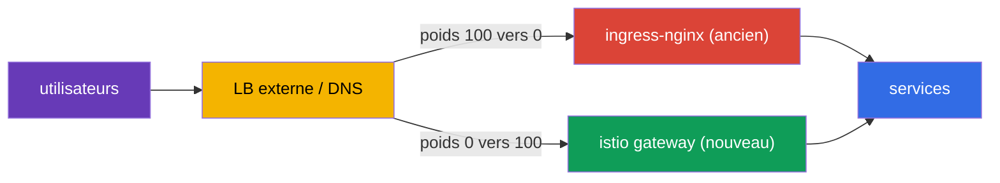
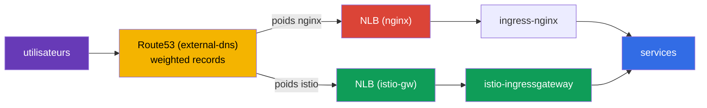
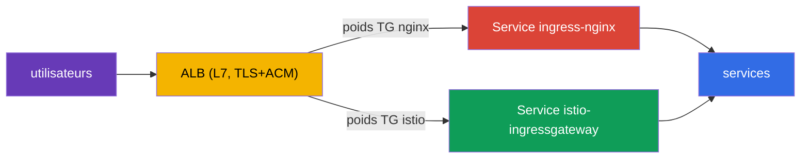

[RU version](ru.md) · [Eng version](en.md) · [Versión en español](es.md) · [Deutsche Version](de.md)

# Chapitre 26. Migration de production sans interruption : d'ingress-nginx vers Istio

> **La suite.** L'une des tâches réelles les plus fréquentes lors de l'adoption d'Istio est de
> faire migrer le trafic entrant depuis un contrôleur d'ingress existant (généralement
> ingress-nginx) vers une Istio Gateway. Et de le faire sur de la prod vivante, où les
> utilisateurs ne doivent pas être affectés. Dans ce chapitre, nous verrons la méthodologie
> d'une telle migration : fonctionnement en parallèle, vérification de parité, bascule par
> poids, rollback et plan pour une centaine de services.

## 26.1. La tâche et le contexte

Les conditions sont proches du réel :

- le service tourne 24/7, les utilisateurs **ne doivent pas** tomber (zero downtime) ;
- la migration se fait dans une **fenêtre de charge minimale** ;
- les services sont **nombreux** (des centaines) - impossible de tout migrer d'un coup, on
  procède par **vagues** ;
- à chaque étape, il faut un **rollback rapide**.

La principale difficulté n'est pas d'écrire l'équivalent Istio des règles nginx (ça, c'est
justement simple, chapitres 5 et 11), mais de basculer **en toute sécurité et de façon
réversible**.

## 26.2. Principe fondamental : deux ingress en parallèle

L'idée clé du zero-downtime : **on ne supprime pas nginx tant que la migration n'est pas
terminée**. ingress-nginx et istio-ingressgateway fonctionnent **simultanément**, et le trafic
public bascule au niveau du **répartiteur de charge externe / DNS** - progressivement et de
façon réversible.



Tant que l'ancien chemin est vivant, le rollback est trivial : remettre le poids sur nginx. La
règle de tout le chapitre : **d'abord on construit et on valide le nouveau chemin, ensuite on
bascule, et ce n'est qu'à la toute fin qu'on supprime l'ancien.**

## 26.3. Plan pas à pas pour un service

Pour chaque hôte/service, le processus est identique :

1. **Construire l'équivalent dans Istio.** `Gateway` + `VirtualService` - une copie exacte des
   règles nginx : hôtes, chemins, en-têtes, timeouts, rewrite.
2. **Vérification de parité avant la bascule.** L'Istio-gateway fonctionne déjà en parallèle ;
   on lui envoie du trafic de test et on compare le comportement avec nginx pour chaque règle.
   Les utilisateurs passent encore par nginx.
3. **(optionnel) Mirroring.** Via `VirtualService.mirror` (chapitre 6), on copie une partie du
   trafic réel vers le nouveau chemin - validation sous charge réelle sans impact sur les
   utilisateurs.
4. **Bascule dans une fenêtre de faible charge.** Sur le LB externe, on change le poids en
   douceur : `nginx 100 / istio 0` → `90/10` → `50/50` → `0/100`. Entre les étapes, on regarde
   les métriques.
5. **Période d'observation (soak).** On maintient 100 % sur Istio pendant plusieurs
   heures/jours, on surveille les erreurs et la latence. On **ne touche pas** à la config
   nginx - c'est une réserve à chaud.
6. **Décommissionnement de nginx** pour ce service - seulement après une période d'observation
   réussie.

Par exemple, un header-canary qui, dans nginx, nécessitait un Ingress séparé avec des
annotations, devient dans Istio un seul bloc `match` par en-tête (chapitre 6) - mais il faut le
migrer avec la même prudence.

### Exemple : Ingress → Gateway + VirtualService

Analysons l'étape 1 sur une règle concrète. Supposons que dans nginx il y ait un `Ingress`
typique : hôte `shop.example.com`, chemin `/api` avec suppression du préfixe, redirection vers
HTTPS, timeout de lecture :

```yaml
apiVersion: networking.k8s.io/v1
kind: Ingress
metadata:
  name: shop
  namespace: shop
  annotations:
    nginx.ingress.kubernetes.io/rewrite-target: /$2
    nginx.ingress.kubernetes.io/ssl-redirect: "true"
    nginx.ingress.kubernetes.io/proxy-read-timeout: "30"
spec:
  ingressClassName: nginx
  tls:
  - hosts: [shop.example.com]
    secretName: shop-tls                 # secret dans le namespace de l'application
  rules:
  - host: shop.example.com
    http:
      paths:
      - path: /api(/|$)(.*)
        pathType: ImplementationSpecific
        backend:
          service:
            name: api
            port: {number: 8080}
```

L'équivalent Istio exact, ce sont deux ressources : le `Gateway` (ce qu'on écoute sur
l'ingress) et le `VirtualService` (où et comment on route) :

```yaml
apiVersion: networking.istio.io/v1
kind: Gateway
metadata:
  name: shop-gw
  namespace: shop
spec:
  selector:
    istio: ingressgateway                # à quel ingress-gateway on se rattache
  servers:
  - port: {number: 443, name: https, protocol: HTTPS}
    hosts: ["shop.example.com"]
    tls:
      mode: SIMPLE
      credentialName: shop-tls           # ATTENTION : le secret est cherché dans le namespace du gateway
  - port: {number: 80, name: http, protocol: HTTP}
    hosts: ["shop.example.com"]
    tls:
      httpsRedirect: true                # = ssl-redirect: "true"
---
apiVersion: networking.istio.io/v1
kind: VirtualService
metadata:
  name: shop
  namespace: shop
spec:
  hosts: ["shop.example.com"]
  gateways: ["shop-gw"]
  http:
  - match:
    - uri:
        prefix: /api/                    # = path /api(/|$)(.*)
    rewrite:
      uri: /                             # = rewrite-target: /$2 (on retire le préfixe)
    route:
    - destination:
        host: api.shop.svc.cluster.local
        port: {number: 8080}
    timeout: 30s                         # = proxy-read-timeout: "30"
```

Une subtilité peu évidente mais importante lors de la migration - **où se trouve le secret
TLS**. Dans nginx, `secretName` est pris dans le namespace de l'application (`shop`). Dans
Istio, `credentialName` est par défaut cherché dans le **namespace de l'ingress-gateway
lui-même** (généralement `istio-system`). C'est une cause fréquente de « certificat non pris en
compte » après la migration : il faut soit dupliquer le secret dans le namespace du gateway,
soit utiliser le secret du namespace de la ressource `Gateway` avec la configuration
correspondante. Vérifiez-le avant la bascule.

## 26.4. Vérification de parité avant la bascule

C'est le cœur d'une migration sûre : valider entièrement le nouveau chemin **pendant que tous
les utilisateurs sont encore sur nginx**. Ce qu'on vérifie :

- **La santé de la configuration Istio :** `istioctl analyze`, `istioctl proxy-status` (tous
  `SYNCED`), les routes visibles sur l'ingress gateway (`istioctl proxy-config routes`).
- **Accès direct à l'istio-gateway en contournant le LB public.** On envoie des requêtes
  directement vers istio-ingressgateway avec le bon `Host` (en prod via `curl --resolve`), sans
  changer le DNS public. Les utilisateurs ne sont pas affectés.
- **Matrice de parité nginx contre istio.** On envoie le même jeu de requêtes aux deux ingress
  et on compare : code de statut, quel service a répondu, en-têtes, redirections. Toute
  divergence est un **facteur bloquant** : on corrige le VirtualService et on recommence.
- **Passage en charge.** `fortio`/`k6` directement sur l'istio-gateway, on compare p95/p99 et
  les erreurs avec nginx.

En pratique, l'accès direct à l'istio-gateway en contournant le DNS public se fait via
`curl --resolve` - il substitue le bon `Host`, mais le résout vers l'IP du nouveau répartiteur
de charge, sans toucher à Route53 :

```bash
# NLB de l'istio-gateway (le DNS public pointe encore vers nginx)
ISTIO_LB=$(kubectl -n istio-system get svc istio-ingressgateway \
  -o jsonpath='{.status.loadBalancer.ingress[0].hostname}')

# la même requête — directement vers le nouveau chemin
curl -sk --resolve shop.example.com:443:$(dig +short $ISTIO_LB | head -1) \
  https://shop.example.com/api/health -o /dev/null -w "istio: %{http_code}\n"
```

La matrice de parité la plus simple - faire passer une liste de chemins par les deux ingress et
comparer les codes :

```bash
NGINX_IP=$(dig +short nginx-nlb.example.com | head -1)
ISTIO_IP=$(dig +short $ISTIO_LB | head -1)
for p in / /api/health /api/v1/items /login /static/logo.png; do
  n=$(curl -sk --resolve shop.example.com:443:$NGINX_IP https://shop.example.com$p -o /dev/null -w '%{http_code}')
  i=$(curl -sk --resolve shop.example.com:443:$ISTIO_IP https://shop.example.com$p -o /dev/null -w '%{http_code}')
  [ "$n" = "$i" ] && s=OK || s=DIFF
  printf '%-20s nginx=%s istio=%s %s\n' "$p" "$n" "$i" "$s"
done
```

Tout `DIFF` est un facteur bloquant : on corrige le `VirtualService` et on recommence. On ne
bascule le trafic sur le LB **que lorsque tout est au vert**.

## 26.5. Avec quoi basculer le trafic : les poids du LB, pas le DNS

Le mécanisme de bascule influe directement sur la vitesse du rollback.

| Mécanisme | Avantages | Inconvénients pour le rollback |
|----------|-------|-------------------|
| Poids sur le LB externe (ALB/NLB) | instantané, sans cache ; rollback en secondes | il faut un LB avec pondération |
| DNS pondéré (par exemple Route53) | simple | cache/TTL - le rollback n'est pas instantané |
| Bascule par hôte | isolation du risque par hôte | plus d'étapes |

Recommandation pour du 24/7 : basculer **par poids sur le répartiteur de charge** - le rollback
ne prend alors que quelques secondes. Si seul le DNS est disponible, abaissez à l'avance (un
jour avant) le TTL à 30-60 secondes, sinon le rollback « collera » à cause de la mise en cache
DNS chez les clients.

## 26.6. Exemple : EKS, NLB, Route53, external-dns

Analysons la migration sur une stack concrète et très typique :

- cluster **EKS** ;
- **ingress-nginx** installé via Helm, son Service est de type `LoadBalancer` et crée un
  **NLB** ;
- DNS - **Route53**, les enregistrements sont créés par **external-dns** automatiquement à
  partir des Ingress/Service.

À quoi ça ressemble actuellement : external-dns voit nginx et crée dans Route53 un
enregistrement `shop.example.com` → NLB nginx. Les utilisateurs passent par ce NLB.



**Étape 1. Monter istio-ingressgateway avec son propre NLB.** On fait le Service du gateway
Istio de type LoadBalancer avec les annotations NLB de l'AWS Load Balancer Controller :

```yaml
# Service istio-ingressgateway (fragment)
metadata:
  annotations:
    service.beta.kubernetes.io/aws-load-balancer-type: "external"
    service.beta.kubernetes.io/aws-load-balancer-nlb-target-type: "ip"
    service.beta.kubernetes.io/aws-load-balancer-scheme: "internet-facing"
spec:
  type: LoadBalancer
```

On obtient un second **NLB istio**, distinct, fonctionnant en parallèle de nginx. Ça ne
concerne pas encore les utilisateurs - Route53 pointe toujours vers nginx.

**Étape 2. Construire Gateway + VirtualService et vérifier la parité** (section 26.4). On
envoie le trafic de test directement vers le nom DNS du NLB istio via `curl --resolve`, sans
toucher à Route53.

**Étape 3. Bascule via les enregistrements pondérés Route53.** Ici, une particularité de la
stack : puisque c'est external-dns qui gère les enregistrements, on bascule non pas à la main
dans la console, mais via les **enregistrements pondérés d'external-dns**. Sur les services
sources, on définit des annotations de poids :

```yaml
# sur istio-gw et sur nginx - même hostname, set-identifier et poids différents
external-dns.alpha.kubernetes.io/hostname: shop.example.com
external-dns.alpha.kubernetes.io/set-identifier: istio    # chez nginx : nginx
external-dns.alpha.kubernetes.io/aws-weight: "0"          # on change 0 -> 100
```

external-dns créera dans Route53 deux enregistrements pondérés sur un même hôte, pointant vers
des NLB différents. En changeant les poids (`nginx 100/istio 0` → `50/50` → `0/100`), on
bascule le trafic en douceur.

**Points importants propres à cette stack :**

- **C'est une bascule DNS, pas des poids sur le LB.** Cela signifie que le rollback **n'est pas
  instantané** - le cache et le TTL des résolveurs jouent. Comme dans la section 26.5 : abaissez
  à l'avance (un jour avant) le TTL de l'enregistrement à 30-60 secondes. Il n'y aura pas ici de
  rollback instantané comme avec un LB commun - prévoyez-le dans le plan.
- **external-dns ne doit pas « se battre » avec vous.** Assurez-vous qu'il est configuré pour
  les enregistrements pondérés (`set-identifier` + `aws-weight`) et qu'il possède la zone via un
  TXT-registry, sinon il pourrait écraser vos poids.
- **Où terminer le TLS - un choix assumé.** Il y a deux variantes qui marchent :
  - **Sur le NLB (listener TLS + certificat depuis ACM).** Variante prod fréquente : le TLS se
    termine sur le répartiteur de charge, ACM renouvelle lui-même les certificats, le
    chiffrement est déchargé du cluster. Inconvénient - Istio ne voit pas le SNI/TLS, et les
    possibilités edge du chapitre 9 (MUTUAL, routage par SNI, mTLS en entrée) restent hors jeu.
    NLB → istio-gateway se fait en clair ou est rechiffré.
  - **Sur l'istio-gateway (NLB en mode TCP-passthrough).** Istio gère lui-même les certificats
    et le SNI, toutes les possibilités edge du chapitre 9 sont disponibles, mais vous gérez les
    certificats dans le cluster.
  Le choix : besoin d'un offload simple et du renouvellement auto par ACM - terminez sur le NLB ;
  besoin des fonctionnalités edge d'Istio (mTLS/SNI/routage fin par TLS) - passthrough jusqu'à
  l'istio-gateway. Vérifiez aussi le health-check et, au besoin, le proxy protocol.
- **IP réelle du client.** Le NLB sait préserver la source IP (target-type `ip`), c'est
  important si vous utilisez du rate limiting par IP (chapitre 20) - sinon Istio verra l'adresse
  du NLB.

**Étape 4. Observation et décommissionnement.** On a maintenu 100 % sur istio, observé les
métriques - et ce n'est qu'ensuite qu'on retire nginx (d'abord son enregistrement pondéré, puis
le chart lui-même).

### Variante avec ALB au lieu de NLB

Il faut ici lever d'emblée une confusion fréquente.

**ingress-nginx lui-même ne peut pas « créer un ALB ».** Le contrôleur nginx est publié via un
`Service` Kubernetes ordinaire de type `LoadBalancer`, et un tel Service sur AWS crée un **NLB**
(ou un Classic ELB obsolète), mais **pas un ALB**. On ne peut pas basculer la classe de
répartiteur du Service nginx vers un ALB - ce sont des mécanismes fondamentalement différents.

**Un ALB sur EKS se crée séparément** - c'est l'**AWS Load Balancer Controller** qui le
provisionne, et non à partir d'un Service, mais d'une ressource `Ingress`
(`ingressClassName: alb`) ou d'un `TargetGroupBinding`. Autrement dit, l'ALB est un front L7
autonome, qu'on place **devant** le contrôleur d'ingress, et non un « mode » de nginx lui-même.
C'est pourquoi, dans de tels schémas, on crée généralement l'ALB à l'avance (ou avec le même
contrôleur à partir d'un Ingress séparé) et on y raccorde nginx comme backend.

De là, l'architecture typique « ALB + nginx » comporte **deux couches** :

- l'**ALB** (L7, TLS + ACM) reçoit le trafic externe et termine le HTTPS ;
- derrière lui, un target group lié au Service ingress-nginx (généralement
  `NodePort`/`ClusterIP` + `TargetGroupBinding`), et nginx fait ensuite le routage détaillé par
  chemins/hôtes.

**Comment migrer dans un tel schéma.** Puisque l'ALB est un front distinct, la bascule se fait
**sur lui**, entre deux target groups : l'un lié au Service ingress-nginx, l'autre au Service
istio-ingressgateway. Les poids se définissent soit par des weighted-actions dans l'ALB
`Ingress` (`alb.ingress.kubernetes.io/actions.*`), soit via `TargetGroupBinding`. En changeant
les poids des target groups, on bascule le trafic `nginx → istio` **directement sur l'ALB**.



Le principal avantage : la bascule par poids de target groups se fait **sur l'ALB lui-même**, et
non via le DNS, donc le **rollback est instantané** - sans le problème de TTL évoqué pour
NLB+Route53. C'est l'idéal même du « on bascule par poids sur le LB » de la section 26.5.

**Ce qu'il faut prendre en compte lors de l'installation d'Istio sous ALB.**
istio-ingressgateway doit devenir la cible de l'ALB, et non monter son propre répartiteur de
charge public :

- son Service se fait en `NodePort` ou `ClusterIP` (pas besoin de son propre NLB - c'est l'ALB
  qui sert de front) et se lie au target group via `TargetGroupBinding` ou l'ALB `Ingress` ;
- le health-check de l'ALB se configure sur le port/chemin de readiness du gateway ;
- puisque l'ALB a déjà terminé le TLS, le trafic vers l'istio-gateway passe en HTTP (ou est
  re-chiffré) - on configure le gateway pour recevoir du HTTP depuis l'ALB, et non son propre
  TLS.

**Réserves :**

- **Le TLS est toujours terminé sur l'ALB** (il est L7, sinon il ne router­ait pas par HTTP).
  Donc les possibilités edge d'Istio du chapitre 9 (routage SNI, MUTUAL, mTLS en entrée) sont
  indisponibles par principe. Si vous en avez besoin, prenez un NLB en mode passthrough.
- **L'IP réelle du client - dans `X-Forwarded-For`.** L'ALB ne préserve pas la source IP au
  niveau L3. Pour le rate limiting par IP (chapitre 20), configurez `numTrustedProxies`, pour
  qu'Istio récupère l'IP depuis le XFF.
- **external-dns crée un seul enregistrement** sur l'ALB - la pondération se fait au niveau des
  target groups de l'ALB, et non du DNS.

Bilan de la comparaison pour la migration : le **NLB** est plus simple et permet le passthrough
(si vous avez besoin des fonctionnalités edge d'Istio), mais la bascule se fait via le DNS avec
un rollback lent. L'**ALB** est une couche L7 distincte devant l'ingress, plus complexe à mettre
en place et termine toujours le TLS, mais offre une bascule instantanée et réversible par poids
de target groups - ce qui, pour du zero-downtime, est très précieux.

### ALB ou NLB devant Istio : comparaison complète

Ce choix est important non seulement lors de la migration, mais aussi de manière générale lors
de l'installation d'Istio sur EKS (chapitre 27). Résumons les avantages et inconvénients des
deux répartiteurs de charge devant istio-ingressgateway.

| Critère | NLB (L4) | ALB (L7) |
|----------|----------|----------|
| Niveau | L4 (TCP/UDP/TLS) | L7 (HTTP/HTTPS/gRPC) |
| TLS | passthrough **ou** terminaison (listener TLS + ACM) | termine toujours (ACM) |
| Fonctionnalités edge Istio (SNI, MUTUAL, mTLS en entrée) | disponibles (en mode passthrough) | indisponibles (l'ALB ouvre le HTTPS) |
| Où se fait le routage | tout dans Istio (source de vérité unique) | une partie sur l'ALB (host/path), duplication avec Istio |
| Trafic non-HTTP (TCP, quelconque) | oui | non, seulement HTTP/HTTPS/gRPC |
| IP réelle du client | préserve la source IP (target-type `ip`) | dans `X-Forwarded-For` |
| Pondération au niveau du LB | non (bascule via DNS) | oui (target groups pondérés), rollback instantané |
| Intégration avec AWS WAF / Cognito | non | oui |
| Latence / performance | latence plus faible, throughput plus élevé | un peu plus d'overhead (traitement L7) |
| Géré par | annotations sur le `Service` | `Ingress`/`TargetGroupBinding` (AWS LB Controller) |

**Prenez un NLB quand :**

- vous avez besoin des possibilités edge d'Istio : mTLS en entrée, `MUTUAL`, routage par SNI,
  chiffrement de bout en bout jusqu'au gateway (passthrough) ;
- du trafic **non-HTTP** passe par l'ingress (TCP, gRPC avec mTLS de bout en bout, protocoles
  personnalisés) ;
- vous voulez que **tout** le routage et le TLS soient dans Istio - source de vérité unique,
  sans duplication des règles sur l'ALB ;
- la latence minimale et un throughput élevé comptent.

**Prenez un ALB quand :**

- vous voulez décharger le TLS sur ACM et n'avez pas besoin des fonctionnalités edge d'Istio ;
- vous avez besoin de l'intégration avec **AWS WAF**, Cognito, l'authentification au niveau de
  l'ALB ;
- vous voulez une bascule pondérée et du canary **au niveau du répartiteur de charge** (rollback
  instantané lors des migrations) ;
- l'organisation est déjà standardisée sur l'ALB et l'AWS LB Controller.

**Repère pratique.** Pour de l'Istio « pur », on prend plus souvent un **NLB** : il laisse tout
le L7 (routage, TLS, politiques edge) à l'intérieur du maillage, ce qui rend toutes les
possibilités d'Istio disponibles et concentre les règles au même endroit. On choisit l'**ALB**
quand l'organisation est liée à son écosystème (WAF, ACM, Cognito) ou quand on a besoin d'un
switch de trafic pondéré au niveau du LB. Le compromis est simple : l'ALB retire une partie du
travail (TLS, WAF, poids), mais enlève à Istio une partie du contrôle L7.

## 26.7. Plan de rollback

Le rollback doit prendre des secondes/minutes, parce que l'ancien chemin n'est pas démonté :

1. Sur le LB externe, remettre le poids sur nginx (`istio 0 / nginx 100`).
2. Vérifier sur les métriques que les 5xx et la latence sont revenus à la normale.
3. Rien à restaurer - l'`Ingress` nginx est resté intact tout ce temps.
4. Analyser la cause (généralement une discordance de règle), corriger le `VirtualService`,
   repasser le test de parité et refaire la bascule.

C'est précisément parce que l'ancien chemin est vivant que la migration reste à faible risque à
chaque étape.

## 26.8. Migration de 100+ services par vagues

Impossible de tout migrer d'un coup - on accumule la confiance par vagues :

- **Vague 0 (pilote) :** 2-3 services non critiques à faible trafic. On bascule, on observe
  plusieurs jours. On rode le runbook, les tableaux de bord et la procédure de rollback.
- **Vagues 1..N (le gros du volume) :** par lots de 5-10 services, chaque lot - seulement après
  une période d'observation stable du précédent. Le processus est reproductible (templates
  Gateway/VirtualService).
- **Vague finale :** les services les plus critiques et les plus chargés - en dernier, avec un
  monitoring maximal et un rollback répété.

Entre les vagues, on relève les métriques (erreurs, p95/p99, incidents). Toute régression est un
facteur bloquant pour la vague suivante.

## 26.9. Risques et comment les lever

| Risque | Mitigation |
|------|-----------|
| Discordance de règles (chemin/en-tête/regex) | test de parité de chaque règle avant la bascule |
| Différence de sémantique des chemins (`pathType`, rewrite) | mapper explicitement en `uri.exact/prefix` + `rewrite.uri`, tester |
| Timeouts/limites différents nginx vs Istio | définir explicitement `timeout`/`retries` dans le VirtualService |
| Sticky sessions / affinity | `DestinationRule` `consistentHash` (par cookie/en-tête) |
| mTLS/injection casse le trafic entre services | pendant la migration, garder `PeerAuthentication: PERMISSIVE` |
| WebSocket / gRPC / gros en-têtes | tester explicitement ; noms de ports corrects (chapitres 10, 23) |
| Cache DNS lors du rollback | basculer par poids du LB ; TTL bas à l'avance |
| Pas d'observabilité au moment du cutover | tableaux de bord et alertes (5xx, p99) prêts **avant** la bascule |

## 26.10. Conversion automatique : ingress2gateway

Réécrire les règles à la main n'est pas obligatoire. L'outil **ingress2gateway** (projet
kubernetes-sigs) lit les `Ingress` existants avec les annotations du provider et génère des
ressources Gateway API :

```bash
ingress2gateway print --providers ingress-nginx -A
```

Réserves importantes :

- il produit du **Gateway API** (`Gateway`/`HTTPRoute`), et non les `Gateway`/`VirtualService`
  natifs d'Istio. Istio implémente Gateway API (chapitre 11), donc appliquez le résultat généré
  avec `gatewayClassName: istio` ;
- **tout ne se convertit pas à l'identique** : les annotations nginx spécifiques (rewrite,
  canary-by-header, auth-url, timeouts personnalisés) peuvent être transférées partiellement ou
  pas du tout - le résultat est un **brouillon** ;
- c'est pourquoi la **revue et le test de parité** sont obligatoires avant la bascule.

Flux pratique : `ingress2gateway print ... > gwapi.yaml` → revue et correction → `kubectl apply`
en parallèle de nginx → vérification de parité → bascule des poids sur le LB.

### Aide-mémoire : annotations ingress-nginx → Istio

C'est justement sur les annotations que la conversion automatique « trébuche » le plus souvent -
beaucoup de possibilités de nginx se réalisent dans Istio via d'autres ressources. Repère pour
les plus fréquentes :

| Annotation ingress-nginx | Équivalent dans Istio |
|-------------------------|--------------------|
| `rewrite-target` | `VirtualService` → `http.rewrite.uri` |
| `ssl-redirect` / `force-ssl-redirect` | `Gateway` → serveur `tls.httpsRedirect: true` |
| `canary` + `canary-by-header` / `canary-weight` | `VirtualService` → `http.match.headers` ou `route` pondérés (chapitre 6) |
| `proxy-read-timeout` / `proxy-send-timeout` | `VirtualService` → `http.timeout` |
| `proxy-next-upstream*` / retries | `VirtualService` → `http.retries` |
| `limit-rps` / `limit-connections` | local rate limit via `EnvoyFilter` (chapitre 20) |
| `auth-url` / `auth-signin` (authentification externe) | `AuthorizationPolicy` `CUSTOM` + ext_authz (chapitre 15) |
| `whitelist-source-range` | `AuthorizationPolicy` `ipBlocks`/`remoteIpBlocks` (chapitre 14) |
| `affinity: cookie` (sticky sessions) | `DestinationRule` → `consistentHash` par cookie/en-tête |
| `backend-protocol: GRPC`/`HTTPS` | nom de port du Service (`grpc-`, chapitre 10) / `DestinationRule` `tls` |
| `configuration-snippet` / `server-snippet` | `EnvoyFilter` (chapitre 21) - à migrer manuellement |

La règle est simple : plus une annotation est « exotique » (snippets, autorisation
personnalisée, limites), moins elle a de chances de se convertir automatiquement - ces règles se
migrent à la main et se vérifient par parité séparément.

## 26.11. Résumé du chapitre

- La migration zero-downtime repose sur le **fonctionnement en parallèle** de nginx et Istio :
  l'ancien chemin n'est pas supprimé jusqu'à la fin.
- Le processus pour un service : construire l'équivalent → vérification de parité avant la
  bascule → (optionnel) mirroring → basculer les poids en douceur → observation →
  décommissionnement de nginx.
- La vérification de parité (analyze, proxy-status, requêtes directes vers l'istio-gateway,
  comparaison avec nginx, charge) est obligatoire avant de basculer les utilisateurs.
- Il vaut mieux basculer **par poids sur le LB** (rollback instantané), et non par DNS
  (cache/TTL) ; avec du DNS - TTL bas à l'avance.
- Le rollback - remettre le poids sur nginx en quelques secondes, parce que l'ancien chemin est
  vivant.
- Les 100+ services migrent **par vagues** : pilote → lots → critiques en dernier.
- Une règle nginx-`Ingress` se transpose en un couple `Gateway` + `VirtualService` (hôte,
  `match` par chemin, `rewrite`, `timeout`, TLS via `credentialName`) ; piège fréquent - le
  secret TLS est cherché dans le namespace de l'ingress-gateway, et non de l'application.
- Beaucoup d'annotations nginx se traduisent en d'autres ressources Istio (rewrite/timeout →
  VirtualService, auth-url → ext_authz, limit-rps → rate limit, snippet → EnvoyFilter) - voir
  l'aide-mémoire.
- `ingress2gateway` accélère la migration, mais donne un brouillon (Gateway API) - la revue et
  la parité sont obligatoires.
- Sur la stack EKS + NLB + Route53 + external-dns, la bascule se fait via les enregistrements
  pondérés de Route53 (external-dns), et non par poids du LB - c'est pourquoi le rollback n'est
  pas instantané : abaissez le TTL à l'avance. Le TLS peut être terminé sur le NLB (listener TLS
  + ACM, offload simple) ou sur l'istio-gateway (passthrough, si vous avez besoin des
  fonctionnalités edge d'Istio). Un NLB avec target-type `ip` préserve l'IP réelle.
- Avec l'**ALB**, la bascule se fait par poids de target groups directement sur le répartiteur
  de charge - rollback instantané (sans TTL DNS). Mais l'ALB termine toujours le TLS (les
  fonctionnalités edge d'Istio sont indisponibles), et l'IP réelle est prise dans
  `X-Forwarded-For` (il faut `numTrustedProxies`).

## 26.12. Questions d'auto-évaluation

1. Pourquoi nginx ne doit-il pas être supprimé avant la fin de la migration ?
2. Qu'est-ce que la vérification de parité et pourquoi la fait-on avant de basculer les
   utilisateurs ?
3. Pourquoi, pour du 24/7, bascule-t-on par poids sur le LB et non via le DNS ?
4. À quoi ressemble le rollback et pourquoi prend-il quelques secondes ?
5. Pourquoi migrer par vagues et dans quel ordre prendre les services ?
6. Comment une règle nginx-`Ingress` (hôte, chemin, rewrite, timeout, TLS) se transpose-t-elle
   en `Gateway` + `VirtualService` et où doit alors se trouver le secret TLS ?
7. Comment vérifier la parité du nouveau chemin directement sur l'istio-gateway, sans toucher au
   DNS public ?
8. En quelles ressources Istio se traduisent les annotations nginx `rewrite-target`, `auth-url`,
   `limit-rps` et `configuration-snippet` ?
9. Que fait `ingress2gateway` et pourquoi son résultat ne peut-il pas être appliqué sans
   vérification ?
10. Sur la stack EKS + NLB + Route53 + external-dns : comment bascule-t-on le trafic, pourquoi
    le rollback n'est-il pas instantané et où le TLS est-il terminé ?
11. En quoi la migration avec un ALB diffère-t-elle du NLB ? Pourquoi, avec l'ALB, le rollback
    est-il instantané et les fonctionnalités edge d'Istio indisponibles ?
12. Quand choisit-on un NLB devant Istio, et quand un ALB ? Citez les principaux avantages et
    inconvénients de chacun.

## Pratique

Entraînez-vous sur la vague pilote d'une vraie migration d'ingress-nginx vers Istio Gateway :
construisez l'équivalent des règles, vérifiez la parité, étudiez la bascule par poids et le
rollback :

🧪 Lab 31 : [tasks/ica/labs/31](../../labs/31/README_FR.MD)

---
[Table des matières](../README_FR.md) · [Chapitre 25](../25/fr.md) · [Chapitre 27](../27/fr.md)
