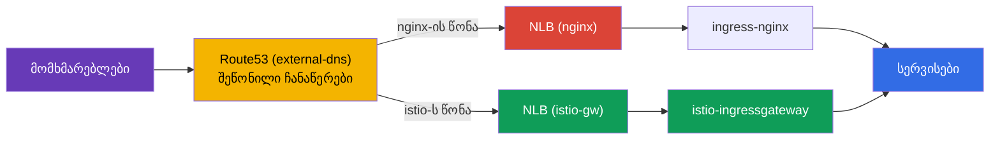
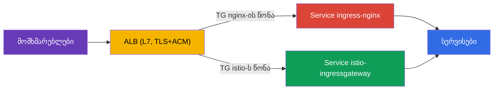

[Русская версия](ru.md) · [Eng version](en.md) · [Versión en español](es.md) · [Version française](fr.md) · [Deutsche Version](de.md) · [繁體中文版](tw.md) · [日本語版](jp.md)

# თავი 26. production-ის მიგრაცია downtime-ის გარეშე: ingress-nginx-იდან Istio-ზე

> **რა იქნება შემდეგ.** Istio-ს დანერგვისას ერთ-ერთი ყველაზე ხშირი რეალური ამოცანაა
> შემომავალი ტრაფიკის გადატანა არსებული ingress-კონტროლერიდან (ჩვეულებრივ ingress-nginx)
> Istio Gateway-ზე. თანაც ეს უნდა გაკეთდეს მოქმედ production-ში, მომხმარებლებზე ზემოქმედების
> გარეშე. ამ თავში განვიხილავთ ასეთი მიგრაციის მეთოდოლოგიას: პარალელურ მუშაობას,
> პარიტეტის შემოწმებას, წონებით გადართვას, უკან დაბრუნებასა და ასი სერვისის გეგმას.

## 26.1. ამოცანა და საწყისი პირობები

პირობები რეალურ გარემოსთან მიახლოებულია:

- სერვისი მუშაობს 24/7, მომხმარებლების **გათიშვა არ შეიძლება** (zero downtime);
- მიგრაცია ტარდება **მინიმალური დატვირთვის ფანჯარაში**;
- სერვისი **ბევრია** (ასეულობით) - ერთი ცდით ყველას ვერ გადავიტანთ, ამიტომ მივდივართ
  **ტალღებად**;
- ყოველ ნაბიჯზე საჭიროა **სწრაფი უკან დაბრუნება**.

მთავარი სირთულე nginx-ის წესების Istio-ეკვივალენტის დაწერა კი არ არის (ეს საკმაოდ
მარტივია, თავები 5 და 11), არამედ **უსაფრთხოდ და შექცევადად** გადართვა.

## 26.2. მთავარი პრინციპი: ორი ingress პარალელურად

zero-downtime-ის საკვანძო იდეაა: **nginx-ს არ ვშლით, სანამ მიგრაცია არ დასრულდება**.
ingress-nginx და istio-ingressgateway **ერთდროულად** მუშაობენ, ხოლო საჯარო ტრაფიკი
**გარე დამაბალანსებლის / DNS-ის** დონეზე - თანდათანობით და შექცევადად - გადაირთვება.


სანამ ძველი გზა ცოცხალია, უკან დაბრუნება მარტივია: წონა ისევ nginx-ზე გადავიტანოთ.
მთელი თავის წესი ასეთია: **ჯერ ვქმნით და ვამოწმებთ ახალ გზას, შემდეგ ვრთავთ მასზე და
მხოლოდ სულ ბოლოს ვშლით ძველს.**

## 26.3. ერთი სერვისის ნაბიჯ-ნაბიჯ გეგმა

თითოეული ჰოსტის/სერვისის პროცესი ერთნაირია:

1. **Istio-ში ეკვივალენტის შექმნა.** `Gateway` + `VirtualService` - nginx-ის წესების
   ზუსტი ასლი: ჰოსტები, გზები, სათაურები, timeout-ები, rewrite.
2. **პარიტეტის შემოწმება გადართვამდე.** Istio-gateway უკვე პარალელურად მუშაობს; მასში
   ვუშვებთ სატესტო ტრაფიკს და თითოეული წესის ქცევას nginx-ს ვადარებთ. მომხმარებლები ჯერ
   ისევ nginx-ის გავლით შედიან.
3. **(არასავალდებულო) სარკისებრი ასახვა.** `VirtualService.mirror`-ის მეშვეობით (თავი 6)
   საბრძოლო ტრაფიკის ნაწილს ახალ გზაზე ვაკოპირებთ - რეალური დატვირთვით ვამოწმებთ ისე,
   რომ მომხმარებლებზე გავლენა არ მოვახდინოთ.
4. **გადართვა დაბალი დატვირთვის ფანჯარაში.** გარე LB-ზე წონას თანდათან ვცვლით:
   `nginx 100 / istio 0` → `90/10` → `50/50` → `0/100`. ნაბიჯებს შორის მეტრიკებს
   ვაკვირდებით.
5. **დაყოვნება (soak).** ტრაფიკის 100%-ს Istio-ზე რამდენიმე საათის/დღის განმავლობაში
   ვტოვებთ და შეცდომებსა და დაყოვნებას ვაკვირდებით. nginx-ის კონფიგურაციას **არ ვეხებით** -
   ის ცხელი რეზერვია.
6. **nginx-ის ექსპლუატაციიდან ამოღება** ამ სერვისისთვის - მხოლოდ წარმატებული დაყოვნების
   შემდეგ.

მაგალითად, header-canary, რომელსაც nginx-ში ანოტაციებით ცალკე Ingress სჭირდებოდა,
Istio-ში სათაურის მიხედვით ერთ `match` ბლოკად იქცევა (თავი 6), თუმცა მისი გადატანაც იმავე
სიფრთხილითაა საჭირო.

### მაგალითი: Ingress → Gateway + VirtualService

პირველი ნაბიჯი კონკრეტული წესის მაგალითზე განვიხილოთ. ვთქვათ, nginx-ში გვაქვს ტიპური
`Ingress`: ჰოსტი `shop.example.com`, გზა `/api` პრეფიქსის მოჭრით, HTTPS-ზე გადამისამართება
და წაკითხვის timeout:

```yaml
apiVersion: networking.k8s.io/v1
kind: Ingress
metadata:
  name: shop
  namespace: shop
  annotations:
    nginx.ingress.kubernetes.io/rewrite-target: /$2
    nginx.ingress.kubernetes.io/ssl-redirect: "true"
    nginx.ingress.kubernetes.io/proxy-read-timeout: "30"
spec:
  ingressClassName: nginx
  tls:
  - hosts: [shop.example.com]
    secretName: shop-tls                 # სეკრეტი აპლიკაციის namespace-ში
  rules:
  - host: shop.example.com
    http:
      paths:
      - path: /api(/|$)(.*)
        pathType: ImplementationSpecific
        backend:
          service:
            name: api
            port: {number: 8080}
```

Istio-ს ზუსტი ეკვივალენტი ორი რესურსია: `Gateway` (რას ვუსმენთ ingress-ზე) და
`VirtualService` (სად და როგორ ვამარშრუტებთ):

```yaml
apiVersion: networking.istio.io/v1
kind: Gateway
metadata:
  name: shop-gw
  namespace: shop
spec:
  selector:
    istio: ingressgateway                # რომელ ingress-gateway-ს ვებმებით
  servers:
  - port: {number: 443, name: https, protocol: HTTPS}
    hosts: ["shop.example.com"]
    tls:
      mode: SIMPLE
      credentialName: shop-tls           # ყურადღება: სეკრეტი იძებნება gateway-ის namespace-ში
  - port: {number: 80, name: http, protocol: HTTP}
    hosts: ["shop.example.com"]
    tls:
      httpsRedirect: true                # = ssl-redirect: "true"
---
apiVersion: networking.istio.io/v1
kind: VirtualService
metadata:
  name: shop
  namespace: shop
spec:
  hosts: ["shop.example.com"]
  gateways: ["shop-gw"]
  http:
  - match:
    - uri:
        prefix: /api/                    # = path /api(/|$)(.*)
    rewrite:
      uri: /                             # = rewrite-target: /$2 (ვჭრით პრეფიქსს)
    route:
    - destination:
        host: api.shop.svc.cluster.local
        port: {number: 8080}
    timeout: 30s                         # = proxy-read-timeout: "30"
```

მიგრაციისას ერთი ნაკლებად აშკარა, მაგრამ მნიშვნელოვანი ნიუანსია - **სად ინახება
TLS-secret**. nginx-ში `secretName` აპლიკაციის namespace-იდან (`shop`) აიღება. Istio-ში
`credentialName` ნაგულისხმევად **თავად ingress-gateway-ის namespace-ში** (ჩვეულებრივ
`istio-system`) იძებნება. ეს გადატანის შემდეგ პრობლემის - „სერტიფიკატი არ ჩაიტვირთა“ -
ხშირი მიზეზია: secret ან gateway-ის namespace-ში უნდა დააკოპიროთ, ან შესაბამისი
კონფიგურაციით `Gateway` რესურსის namespace-ის secret გამოიყენოთ. ეს გადართვამდე
შეამოწმეთ.

## 26.4. პარიტეტის შემოწმება გადართვამდე

ეს უსაფრთხო მიგრაციის გულია: ახალი გზა სრულად უნდა შემოწმდეს **მანამ, სანამ ყველა
მომხმარებელი ჯერ კიდევ nginx-ზეა**. რას ვამოწმებთ:

- **Istio-ს კონფიგურაციის სიჯანსაღე:** `istioctl analyze`, `istioctl proxy-status`
  (ყველა `SYNCED`), მარშრუტები ჩანს ingress gateway-ზე (`istioctl proxy-config routes`).
- **პირდაპირი მიმართვა istio-gateway-სთან, საჯარო LB-ის გვერდის ავლით.** მოთხოვნებს
  პირდაპირ istio-ingressgateway-ში საჭირო `Host`-ით ვაგზავნით (production-ში
  `curl --resolve`-ის მეშვეობით), საჯარო DNS-ის შეცვლის გარეშე. მომხმარებლებს ეს არ
  ეხებათ.
- **nginx-ისა და istio-ს პარიტეტის მატრიცა.** მოთხოვნების ერთსა და იმავე ნაკრებს ორივე
  ingress-ში ვუშვებთ და ვადარებთ: სტატუსის კოდს, რომელი სერვისი გამოეხმაურა, სათაურებს,
  გადამისამართებებს. ნებისმიერი განსხვავება **შეჩერების ფაქტორია**: ვასწორებთ
  VirtualService-ს და ხელახლა ვამოწმებთ.
- **დატვირთვის ტესტი.** `fortio`/`k6` პირდაპირ istio-gateway-ში; p95/p99-სა და შეცდომებს
  nginx-ს ვადარებთ.

პრაქტიკაში istio-gateway-სთან საჯარო DNS-ის გვერდის ავლით პირდაპირი მიმართვისთვის
`curl --resolve` გამოიყენება - ის საჭირო `Host`-ს სვამს, თუმცა მის რეზოლვინგს ახალი
დამაბალანსებლის IP-ზე აკეთებს ისე, რომ Route53-ს არ ეხება:

```bash
# NLB istio-gateway (საჯარო DNS ჯერ კიდევ nginx-ზე მიუთითებს)
ISTIO_LB=$(kubectl -n istio-system get svc istio-ingressgateway \
  -o jsonpath='{.status.loadBalancer.ingress[0].hostname}')

# ერთი და იგივე მოთხოვნა - ახალ გზაზე პირდაპირ
curl -sk --resolve shop.example.com:443:$(dig +short $ISTIO_LB | head -1) \
  https://shop.example.com/api/health -o /dev/null -w "istio: %{http_code}\n"
```

პარიტეტის უმარტივესი მატრიცაა გზების სიის ორივე ingress-ში გატარება და კოდების შედარება:

```bash
NGINX_IP=$(dig +short nginx-nlb.example.com | head -1)
ISTIO_IP=$(dig +short $ISTIO_LB | head -1)
for p in / /api/health /api/v1/items /login /static/logo.png; do
  n=$(curl -sk --resolve shop.example.com:443:$NGINX_IP https://shop.example.com$p -o /dev/null -w '%{http_code}')
  i=$(curl -sk --resolve shop.example.com:443:$ISTIO_IP https://shop.example.com$p -o /dev/null -w '%{http_code}')
  [ "$n" = "$i" ] && s=OK || s=DIFF
  printf '%-20s nginx=%s istio=%s %s\n' "$p" "$n" "$i" "$s"
done
```

ნებისმიერი `DIFF` შეჩერების ფაქტორია: ვასწორებთ `VirtualService`-ს და ვიმეორებთ.
ტრაფიკს LB-ზე **მხოლოდ მაშინ ვრთავთ, როცა ყველაფერი მწვანეა**.

## 26.5. რით გადავრთოთ ტრაფიკი: LB-ის წონებით და არა DNS-ით

გადართვის მექანიზმი პირდაპირ მოქმედებს უკან დაბრუნების სიჩქარეზე.

| მექანიზმი | უპირატესობები | ნაკლოვანებები უკან დაბრუნებისთვის |
|----------|-------|-------------------|
| წონები გარე LB-ზე (ALB/NLB) | მყისიერად, cache-ის გარეშე; უკან დაბრუნება წამებში | საჭიროა შეწონვის მქონე LB |
| შეწონილი DNS (მაგალითად Route53) | მარტივია | cache/TTL - უკან დაბრუნება მყისიერი არ არის |
| თითოეული ჰოსტის ცალკე გადართვა | რისკის იზოლაცია ჰოსტის მიხედვით | მეტი ნაბიჯი |

რეკომენდაცია 24/7 გარემოსთვის: გადართეთ **დამაბალანსებლის წონებით** - მაშინ უკან
დაბრუნებას წამები სჭირდება. თუ მხოლოდ DNS არის ხელმისაწვდომი, წინასწარ (ერთი დღით ადრე)
შეამცირეთ TTL 30-60 წამამდე, წინააღმდეგ შემთხვევაში უკან დაბრუნება კლიენტების DNS-cache-ის
გამო „გაიჭედება“.

## 26.6. მაგალითი: EKS, NLB, Route53, external-dns

მიგრაცია კონკრეტულ და მეტად ტიპურ სტეკზე განვიხილოთ:

- კლასტერი **EKS**;
- **ingress-nginx** დაყენებულია Helm-ის მეშვეობით, მისი Service არის `LoadBalancer`
  ტიპის და ქმნის **NLB**-ს;
- DNS არის **Route53**, ჩანაწერებს კი Ingress/Service-იდან ავტომატურად ქმნის
  **external-dns**.

ამჟამად სურათი ასეთია: external-dns ხედავს nginx-ს და Route53-ში ქმნის ჩანაწერს
`shop.example.com` → NLB nginx. მომხმარებლები ამ NLB-ის გავლით შედიან.



**ნაბიჯი 1. istio-ingressgateway-ის საკუთარი NLB-ით გაშვება.** Istio-ს gateway-ის
სერვისს AWS Load Balancer Controller-ის NLB-ანოტაციებით LoadBalancer ტიპს ვაძლევთ:

```yaml
# Service istio-ingressgateway (ფრაგმენტი)
metadata:
  annotations:
    service.beta.kubernetes.io/aws-load-balancer-type: "external"
    service.beta.kubernetes.io/aws-load-balancer-nlb-target-type: "ip"
    service.beta.kubernetes.io/aws-load-balancer-scheme: "internet-facing"
spec:
  type: LoadBalancer
```

ვიღებთ მეორე, ცალკე **NLB istio**-ს, რომელიც nginx-ის პარალელურად მუშაობს. მომხმარებლებს
ეს ჯერ არ ეხებათ - Route53 კვლავ nginx-ზე მიუთითებს.

**ნაბიჯი 2. Gateway + VirtualService-ის შექმნა და პარიტეტის შემოწმება** (განყოფილება
26.4). სატესტო ტრაფიკს `curl --resolve`-ის მეშვეობით პირდაპირ NLB istio-ს DNS-სახელზე
ვუშვებთ, Route53-ის შეუცვლელად.

**ნაბიჯი 3. გადართვა Route53-ის შეწონილი ჩანაწერებით.** ამ სტეკს ერთი თავისებურება აქვს:
რადგან ჩანაწერებს external-dns მართავს, კონსოლიდან ხელით კი არ ვერთვებით, არამედ
**external-dns-ის weighted-ჩანაწერებით**. წყარო სერვისებზე წონის ანოტაციებს ვაყენებთ:

```yaml
# istio-gw-ზე და nginx-ზე - ერთნაირი hostname, სხვადასხვა set-identifier და წონა
external-dns.alpha.kubernetes.io/hostname: shop.example.com
external-dns.alpha.kubernetes.io/set-identifier: istio    # nginx-ზე: nginx
external-dns.alpha.kubernetes.io/aws-weight: "0"          # ვცვლით 0 -> 100
```

external-dns Route53-ში ერთ ჰოსტზე ორ weighted-ჩანაწერს შექმნის, რომლებიც სხვადასხვა
NLB-ზე მიუთითებს. წონების შეცვლით (`nginx 100/istio 0` → `50/50` → `0/100`) ტრაფიკს
თანდათან გადავიტანთ.

**სწორედ ამ სტეკისთვის მნიშვნელოვანი ნიუანსები:**

- **ეს DNS-გადართვაა და არა LB-ის წონები.** შესაბამისად, უკან დაბრუნება **მყისიერი არ
  არის** - resolver-ების cache და TTL მოქმედებს. როგორც 26.5 განყოფილებაშია ნათქვამი,
  წინასწარ (ერთი დღით ადრე) ჩანაწერის TTL 30-60 წამამდე შეამცირეთ. საერთო LB-ის მსგავსი
  მყისიერი უკან დაბრუნება აქ არ იქნება - ეს გეგმაში გაითვალისწინეთ.
- **external-dns თქვენთან არ უნდა „იბრძოდეს“.** დარწმუნდით, რომ ის weighted-ჩანაწერებზეა
  გამართული (`set-identifier` + `aws-weight`) და ზონას TXT-registry-ის მეშვეობით ფლობს,
  თორემ შეიძლება თქვენი წონები გადაწეროს.
- **სად დასრულდეს TLS - გააზრებული არჩევანია.** ორი მუშა ვარიანტი არსებობს:
  - **NLB-ზე (TLS-listener + ACM-ის სერტიფიკატი).** ხშირი production-ვარიანტი: TLS
    დამაბალანსებელზე სრულდება, ACM სერტიფიკატებს თავად აახლებს, ხოლო დაშიფვრის მოხსნა
    კლასტერის გარეთ ხდება. მინუსი - Istio ვერ ხედავს SNI/TLS-ს და მე-9 თავის
    edge-შესაძლებლობები (MUTUAL, SNI-ის მიხედვით მარშრუტიზაცია, შემომავალი mTLS) მიღმა
    რჩება. NLB → istio-gateway ტრაფიკი plaintext-ით მიდის ან ხელახლა იშიფრება.
  - **istio-gateway-ზე (NLB TCP-passthrough რეჟიმში).** Istio თავად მართავს
    სერტიფიკატებსა და SNI-ს; მე-9 თავის ყველა edge-შესაძლებლობა ხელმისაწვდომია, თუმცა
    სერტიფიკატებს კლასტერში თქვენ მართავთ.
  არჩევანი: თუ მარტივი offload და ACM-ის ავტომატური განახლება გჭირდებათ - TLS NLB-ზე
  დაასრულეთ; თუ Istio-ს edge-ფუნქციები (mTLS/SNI/TLS-ის მიხედვით დეტალური
  მარშრუტიზაცია) გჭირდებათ - გამოიყენეთ passthrough istio-gateway-მდე. ასევე შეამოწმეთ
  health-check და, საჭიროების შემთხვევაში, proxy protocol.
- **კლიენტის რეალური IP.** NLB-ს source IP-ის შენარჩუნება შეუძლია (target-type `ip`),
  რაც მნიშვნელოვანია, თუ per-IP rate limiting-ს იყენებთ (თავი 20) - სხვაგვარად Istio
  NLB-ის მისამართს დაინახავს.

**ნაბიჯი 4. დაყოვნება და ექსპლუატაციიდან ამოღება.** istio-ზე 100% ტრაფიკი გარკვეული ხნით
დავტოვეთ, მეტრიკებს დავაკვირდით - და მხოლოდ ამის შემდეგ ვშლით nginx-ს (ჯერ მის
weighted-ჩანაწერს, შემდეგ თავად chart-ს).

### ვარიანტი NLB-ის ნაცვლად ALB-ით

აქ თავიდანვე უნდა გავფანტოთ გავრცელებული დაბნეულობა.

**თავად ingress-nginx-ს „ALB-ის შექმნა“ არ შეუძლია.** nginx-კონტროლერი ქვეყნდება
ჩვეულებრივი Kubernetes `Service`-ით, რომლის ტიპია `LoadBalancer`, ხოლო ასეთი Service
AWS-ზე ქმნის **NLB**-ს (ან მოძველებულ Classic ELB-ს), მაგრამ **არა ALB-ს**. nginx-ის
Service-ის დამაბალანსებლის კლასის ALB-ზე გადართვა შეუძლებელია - ეს პრინციპულად
განსხვავებული მექანიზმებია.

**ALB EKS-ზე ცალკე იქმნება** - მას **AWS Load Balancer Controller** აპროვიზიონირებს და
არა Service-იდან, არამედ `Ingress` რესურსიდან (`ingressClassName: alb`) ან
`TargetGroupBinding`-იდან. ანუ ALB დამოუკიდებელი L7-front-ია, რომელსაც
ingress-კონტროლერის **წინ** აყენებენ და არა თავად nginx-ის „რეჟიმი“. ამიტომ ასეთ სქემებში
ALB-ს, როგორც წესი, წინასწარ ქმნიან (ან იმავე კონტროლერით ცალკე Ingress-იდან) და nginx-ს
მას backend-ის სახით უერთებენ.

აქედან გამომდინარე, ტიპური არქიტექტურა „ALB + nginx“ **ორი ფენაა**:

- **ALB** (L7, TLS + ACM) იღებს გარე ტრაფიკს და HTTPS-ს ასრულებს;
- მის უკან არის target-ჯგუფი, რომელიც ingress-nginx-ის Service-ს უკავშირდება (ჩვეულებრივ
  `NodePort`/`ClusterIP` + `TargetGroupBinding`), ხოლო nginx უკვე გზებისა და ჰოსტების
  დეტალურ მარშრუტიზაციას ახორციელებს.

**როგორ გადავიტანოთ ასეთი სქემა.** რადგან ALB ცალკე front-ია, გადართვა **მასზე**, ორ
 target-ჯგუფს შორის ხდება: ერთი ingress-nginx-ის Service-ს უკავშირდება, მეორე კი
istio-ingressgateway-ის Service-ს. წონები განისაზღვრება ან ALB `Ingress`-ის
weighted-actions-ში (`alb.ingress.kubernetes.io/actions.*`), ან `TargetGroupBinding`-ის
მეშვეობით. target-ჯგუფების წონების შეცვლით ტრაფიკს `nginx → istio` **უშუალოდ ALB-ზე**
ვიტანთ.



მთავარი უპირატესობა: target-ჯგუფების წონებით გადართვა **თავად ALB-ზე** ხდება და არა
DNS-ის მეშვეობით, ამიტომ **უკან დაბრუნება მყისიერია** - NLB+Route53-ისთვის განხილული TTL-ის
პრობლემის გარეშე. ეს სწორედ 26.5 განყოფილების იდეალური ვარიანტია: „LB-ის წონებით
გადართვა“.

**რა უნდა გავითვალისწინოთ Istio-ს ALB-ის უკან დაყენებისას.** istio-ingressgateway ALB-ის
სამიზნე უნდა გახდეს და საკუთარი საჯარო დამაბალანსებელი არ უნდა შექმნას:

- მის Service-ს `NodePort` ან `ClusterIP` ტიპს აძლევენ (საკუთარი NLB საჭირო არ არის -
  front-ად ALB მუშაობს) და target-ჯგუფს `TargetGroupBinding`-ის ან ALB `Ingress`-ის
  მეშვეობით უკავშირებენ;
- ALB-ის health-check gateway-ის მზადყოფნის პორტზე/გზაზე იმართება;
- რადგან ALB-მ TLS უკვე დაასრულა, istio-gateway-მდე ტრაფიკი HTTP-ით მიდის (ან ხელახლა
  იშიფრება) - gateway უნდა გაიმართოს ALB-იდან HTTP-ის მიღებაზე და არა საკუთარ TLS-ზე.

**შეზღუდვები:**

- **TLS ყოველთვის ALB-ზე სრულდება** (ის L7-ია, სხვაგვარად HTTP-ის მიხედვით მარშრუტიზაციას
  ვერ შეძლებდა). შესაბამისად, მე-9 თავის Istio edge-შესაძლებლობები (SNI-მარშრუტიზაცია,
  MUTUAL, შემომავალი mTLS) პრინციპულად მიუწვდომელია. თუ ისინი გჭირდებათ - გამოიყენეთ NLB
  passthrough რეჟიმში.
- **კლიენტის რეალური IP `X-Forwarded-For`-შია.** ALB source IP-ს L3-ზე არ ინარჩუნებს.
  per-IP rate limiting-ისთვის (თავი 20) გამართეთ `numTrustedProxies`, რათა Istio-მ IP
  XFF-იდან ამოიღოს.
- **external-dns ერთ ჩანაწერს ქმნის** ALB-ზე - შეწონვა ALB-ის target-ჯგუფების დონეზე
  ხდება და არა DNS-ში.

მიგრაციის შედარების შედეგი: **NLB** უფრო მარტივია და passthrough-ის საშუალებას იძლევა
(თუ Istio-ს edge-ფუნქციებია საჭირო), თუმცა გადართვა DNS-ის მეშვეობით ხდება და უკან
დაბრუნება ნელია. **ALB** ცალკე L7-ფენაა ingress-ის წინ, მოწყობით უფრო რთულია და TLS-ს
ყოველთვის თავად ასრულებს, სამაგიეროდ target-ჯგუფების წონებით მყისიერ და შექცევად
გადართვას იძლევა - რაც zero-downtime-ისთვის ძალიან ღირებულია.

### ALB თუ NLB Istio-ს წინ: სრული შედარება

ეს არჩევანი მნიშვნელოვანია არა მხოლოდ მიგრაციისას, არამედ ზოგადად EKS-ზე Istio-ს
დაყენებისასაც (თავი 27). შევაჯამოთ istio-ingressgateway-ის წინ ორივე დამაბალანსებლის
უპირატესობები და ნაკლოვანებები.

| კრიტერიუმი | NLB (L4) | ALB (L7) |
|----------|----------|----------|
| დონე | L4 (TCP/UDP/TLS) | L7 (HTTP/HTTPS/gRPC) |
| TLS | passthrough **ან** დასრულება (TLS-listener + ACM) | ყოველთვის ასრულებს (ACM) |
| Istio-ს edge-ფუნქციები (SNI, MUTUAL, შემომავალი mTLS) | ხელმისაწვდომია (passthrough რეჟიმში) | მიუწვდომელია (ALB HTTPS-ს ხსნის) |
| სად ხდება მარშრუტიზაცია | მთლიანად Istio-ში (სიმართლის ერთიანი წყარო) | ნაწილი ALB-ზე (host/path), Istio-სთან დუბლირება |
| არა-HTTP ტრაფიკი (TCP, ნებისმიერი) | დიახ | არა, მხოლოდ HTTP/HTTPS/gRPC |
| კლიენტის რეალური IP | ინარჩუნებს source IP-ს (target-type `ip`) | `X-Forwarded-For`-ში |
| შეწონვა LB-ის დონეზე | არა (გადართვა DNS-ით) | დიახ (weighted target-ჯგუფები), მყისიერი უკან დაბრუნება |
| ინტეგრაცია AWS WAF / Cognito-სთან | არა | დიახ |
| დაყოვნება / წარმადობა | ნაკლები დაყოვნება, მაღალი throughput | ოდნავ მეტი overhead (L7-დამუშავება) |
| რით იმართება | `Service`-ის ანოტაციებით | `Ingress`/`TargetGroupBinding` (AWS LB Controller) |

**აირჩიეთ NLB, როცა:**

- საჭიროა Istio-ს edge-შესაძლებლობები: შემომავალი mTLS, `MUTUAL`, SNI-ის მიხედვით
  მარშრუტიზაცია, გამჭოლი დაშიფვრა gateway-მდე (passthrough);
- ingress-ის გავლით **არა-HTTP** ტრაფიკი გადის (TCP, gRPC გამჭოლი mTLS-ით, მორგებული
  პროტოკოლები);
- გსურთ, რომ **მთელი** მარშრუტიზაცია და TLS Istio-ში იყოს - სიმართლის ერთიანი წყარო,
  ALB-ზე წესების დუბლირების გარეშე;
- მნიშვნელოვანია მინიმალური დაყოვნება და მაღალი throughput.

**აირჩიეთ ALB, როცა:**

- გსურთ TLS offload ACM-ზე და Istio-ს edge-ფუნქციები საჭირო არ არის;
- საჭიროა ინტეგრაცია **AWS WAF**-თან, Cognito-სთან და ავთენტიფიკაცია ALB-ის დონეზე;
- გსურთ შეწონილი გადართვა და canary **დამაბალანსებლის დონეზე** (მიგრაციებისას მყისიერი
  უკან დაბრუნება);
- ორგანიზაციაში ALB და AWS LB Controller უკვე სტანდარტადაა მიღებული.

**პრაქტიკული ორიენტირი.** „სუფთა“ Istio-სთვის უფრო ხშირად **NLB**-ს ირჩევენ: ის მთელ
L7-ს (მარშრუტიზაციას, TLS-ს, edge-პოლიტიკებს) mesh-ის შიგნით ტოვებს, ამიტომ Istio-ს ყველა
შესაძლებლობა ხელმისაწვდომია და წესები ერთ ადგილას ინახება. **ALB**-ს მაშინ ირჩევენ,
როცა ორგანიზაცია მის ეკოსისტემაზეა დამოკიდებული (WAF, ACM, Cognito), ან LB-ის დონეზე
ტრაფიკის შეწონილი გადართვა სჭირდება. კომპრომისი მარტივია: ALB სამუშაოს ნაწილს (TLS,
WAF, წონები) ხსნის, თუმცა Istio-ს L7-კონტროლის ნაწილს ართმევს.

## 26.7. უკან დაბრუნების გეგმა

უკან დაბრუნებას წამები ან წუთები უნდა დასჭირდეს, რადგან ძველი გზა ჯერ არ დაშლილა:

1. გარე LB-ზე წონა ისევ nginx-ს დავუბრუნოთ (`istio 0 / nginx 100`).
2. მეტრიკებით დავრწმუნდეთ, რომ 5xx და დაყოვნება ნორმას დაუბრუნდა.
3. არაფრის აღდგენა არ გვჭირდება - nginx-ის `Ingress` მთელი ამ დროის განმავლობაში
   ხელუხლებელი იყო.
4. მიზეზი გავაანალიზოთ (ჩვეულებრივ წესების შეუსაბამობა), `VirtualService` შევასწოროთ,
   პარიტეტის ტესტი თავიდან გავიაროთ და გადართვა გავიმეოროთ.

სწორედ ძველი გზის ცოცხლად დატოვების გამო რჩება მიგრაცია ყოველ ნაბიჯზე დაბალი რისკის
მქონე.

## 26.8. 100+ სერვისის მიგრაცია ტალღებად

ყველაფრის ერთდროულად გადატანა არ შეიძლება - თავდაჯერებულობას ტალღებად ვაგროვებთ:

- **ტალღა 0 (პილოტი):** დაბალი ტრაფიკის მქონე 2-3 არაკრიტიკული სერვისი. გადავრთავთ და
  რამდენიმე დღე ვაკვირდებით. runbook-ს, dashboard-ებსა და უკან დაბრუნების პროცედურას
  პრაქტიკაში ვამოწმებთ.
- **ტალღები 1..N (ძირითადი მასა):** 5-10 სერვისიან batch-ებად; თითოეული batch მხოლოდ
  წინა batch-ის სტაბილური დაყოვნების შემდეგ. პროცესი განმეორებადია
  (Gateway/VirtualService-ის შაბლონები).
- **საბოლოო ტალღა:** ყველაზე კრიტიკული და მაღალდატვირთული სერვისები - სულ ბოლოს,
  მაქსიმალური მონიტორინგითა და წინასწარ გავარჯიშებული უკან დაბრუნებით.

ტალღებს შორის აფიქსირებენ მეტრიკებს (შეცდომები, p95/p99, ინციდენტები). ნებისმიერი
რეგრესია შემდეგი ტალღის **შეჩერების ფაქტორია**.

## 26.9. რისკები და მათი შემცირება

| რისკი | შემცირების გზა |
|------|-----------|
| წესების შეუსაბამობა (გზა/სათაური/regex) | თითოეული წესის პარიტეტის ტესტი გადართვამდე |
| გზების სემანტიკის განსხვავება (`pathType`, rewrite) | ცხადად ასახვა `uri.exact/prefix` + `rewrite.uri`-ში და ტესტირება |
| განსხვავებული timeout-ები/ლიმიტები nginx-სა და Istio-ში | `VirtualService`-ში ცხადი `timeout`/`retries`-ის დაყენება |
| Sticky sessions / affinity | `DestinationRule` `consistentHash` (cookie/სათაურის მიხედვით) |
| mTLS/ინექცია სერვისებს შორის ტრაფიკს არღვევს | მიგრაციისას `PeerAuthentication: PERMISSIVE`-ის შენარჩუნება |
| WebSocket / gRPC / დიდი სათაურები | ცხადად ტესტირება; პორტების სწორი სახელები (თავები 10, 23) |
| უკან დაბრუნებისას DNS-cache | LB-ის წონებით გადართვა; წინასწარ დაბალი TTL |
| cutover-ის მომენტში დაკვირვებადობა არ არის | dashboard-ები და alert-ები (5xx, p99) მზადაა **გადართვამდე** |

## 26.10. ავტომატური კონვერტაცია: ingress2gateway

წესების ხელით გადაწერა აუცილებელი არ არის. ინსტრუმენტი **ingress2gateway**
(kubernetes-sigs-ის პროექტი) პროვაიდერის ანოტაციებთან ერთად არსებულ `Ingress`-ებს
კითხულობს და Gateway API-ის რესურსებს აგენერირებს:

```bash
ingress2gateway print --providers ingress-nginx -A
```

მნიშვნელოვანი შენიშვნები:

- ის გამოსცემს **Gateway API**-ს (`Gateway`/`HTTPRoute`) და არა Istio-ს ნატიურ
  `Gateway`/`VirtualService`-ს. Istio ახორციელებს Gateway API-ს (თავი 11), ამიტომ
  დაგენერირებული მასალა `gatewayClassName: istio`-თი გამოიყენეთ;
- **ყველაფერი 1:1 არ გარდაიქმნება**: nginx-ის სპეციფიკური ანოტაციები (rewrite,
  canary-by-header, auth-url, მორგებული timeout-ები) შეიძლება ნაწილობრივ ან საერთოდ არ
  გადავიდეს - შედეგი **შავი მონახაზია**;
- ამიტომ გადართვამდე **review და პარიტეტის ტესტი** სავალდებულოა.

პრაქტიკული flow: `ingress2gateway print ... > gwapi.yaml` → review და შესწორება →
`kubectl apply` nginx-ის პარალელურად → პარიტეტის შემოწმება → LB-ზე წონების გადართვა.

### მოკლე ცნობარი: ingress-nginx-ის ანოტაციები → Istio

ავტომატური კონვერტაცია ყველაზე ხშირად სწორედ ანოტაციებზე „ფერხდება“ - nginx-ის ბევრი
შესაძლებლობა Istio-ში სხვა რესურსებით ხორციელდება. ყველაზე გავრცელებულთა შესაბამისობა:

| ingress-nginx-ის ანოტაცია | Istio-ს ეკვივალენტი |
|-------------------------|--------------------|
| `rewrite-target` | `VirtualService` → `http.rewrite.uri` |
| `ssl-redirect` / `force-ssl-redirect` | `Gateway` → სერვერი `tls.httpsRedirect: true` |
| `canary` + `canary-by-header` / `canary-weight` | `VirtualService` → `http.match.headers` ან შეწონილი `route` (თავი 6) |
| `proxy-read-timeout` / `proxy-send-timeout` | `VirtualService` → `http.timeout` |
| `proxy-next-upstream*` / retry-ები | `VirtualService` → `http.retries` |
| `limit-rps` / `limit-connections` | local rate limit `EnvoyFilter`-ის მეშვეობით (თავი 20) |
| `auth-url` / `auth-signin` (გარე ავთენტიფიკაცია) | `AuthorizationPolicy` `CUSTOM` + ext_authz (თავი 15) |
| `whitelist-source-range` | `AuthorizationPolicy` `ipBlocks`/`remoteIpBlocks` (თავი 14) |
| `affinity: cookie` (sticky sessions) | `DestinationRule` → `consistentHash` cookie/სათაურის მიხედვით |
| `backend-protocol: GRPC`/`HTTPS` | Service-ის პორტის სახელი (`grpc-`, თავი 10) / `DestinationRule` `tls` |
| `configuration-snippet` / `server-snippet` | `EnvoyFilter` (თავი 21) - ხელით გადასატანი |

წესი მარტივია: რაც უფრო „ეგზოტიკურია“ ანოტაცია (snippet-ები, მორგებული ავტორიზაცია,
ლიმიტები), მით ნაკლებია მისი ავტომატური კონვერტაციის შანსი - ასეთი წესები ხელით გადააქვთ
და პარიტეტს ცალკე ამოწმებენ.

## 26.11. თავის შეჯამება

- Zero-downtime მიგრაცია nginx-ისა და Istio-ს **პარალელურ მუშაობაზე** აგებულია: ძველ
  გზას დასრულებამდე არ შლიან.
- სერვისის პროცესი: ეკვივალენტის შექმნა → პარიტეტის შემოწმება გადართვამდე →
  (არასავალდებულო) სარკისებრი ასახვა → წონების თანდათან გადართვა → დაყოვნება → nginx-ის
  ექსპლუატაციიდან ამოღება.
- პარიტეტის შემოწმება (analyze, proxy-status, პირდაპირი მოთხოვნები istio-gateway-ში,
  nginx-თან შედარება, დატვირთვა) მომხმარებლების გადართვამდე სავალდებულოა.
- სასურველია გადართვა **LB-ის წონებით** (მყისიერი უკან დაბრუნება) და არა DNS-ით
  (cache/TTL); DNS-ის შემთხვევაში დაბალი TTL წინასწარ დააყენეთ.
- უკან დაბრუნება nginx-ზე წონის წამებში დაბრუნებაა, რადგან ძველი გზა ცოცხალია.
- 100+ სერვისი **ტალღებად** გადააქვთ: პილოტი → batch-ები → კრიტიკული სერვისები ბოლოს.
- nginx-ის `Ingress` წესი `Gateway` + `VirtualService` წყვილად გარდაიქმნება (ჰოსტი,
  გზის `match`, `rewrite`, `timeout`, TLS `credentialName`-ით); ხშირი ხაფანგია, რომ
  TLS-secret ingress-gateway-ის namespace-ში იძებნება და არა აპლიკაციის namespace-ში.
- nginx-ის ბევრი ანოტაცია Istio-ს სხვა რესურსებს შეესაბამება (rewrite/timeout →
  VirtualService, auth-url → ext_authz, limit-rps → rate limit, snippet → EnvoyFilter) -
  იხილეთ მოკლე ცნობარი.
- `ingress2gateway` გადატანას აჩქარებს, მაგრამ მხოლოდ შავ მონახაზს (Gateway API) იძლევა -
  review და პარიტეტის შემოწმება სავალდებულოა.
- EKS + NLB + Route53 + external-dns სტეკზე გადართვა Route53-ის weighted-ჩანაწერებით
  (external-dns) ხდება და არა LB-ის წონებით - ამიტომ უკან დაბრუნება მყისიერი არ არის:
  TTL წინასწარ შეამცირეთ. TLS შეიძლება NLB-ზე (TLS-listener + ACM, მარტივი offload) ან
  istio-gateway-ზე დასრულდეს (passthrough, თუ Istio-ს edge-ფუნქციებია საჭირო). NLB
  target-type `ip`-ით რეალურ IP-ს ინარჩუნებს.
- **ALB**-ის შემთხვევაში გადართვა target-ჯგუფების წონებით უშუალოდ დამაბალანსებელზე
  ხდება - უკან დაბრუნება მყისიერია (DNS-TTL-ის გარეშე). თუმცა ALB TLS-ს ყოველთვის
  ასრულებს (Istio-ს edge-ფუნქციები მიუწვდომელია), ხოლო რეალური IP
  `X-Forwarded-For`-იდან აიღება (საჭიროა `numTrustedProxies`).

## 26.12. თვითშემოწმების კითხვები

1. რატომ არ შეიძლება nginx-ის წაშლა მიგრაციის დასრულებამდე?
2. რა არის პარიტეტის შემოწმება და რატომ ტარდება ის მომხმარებლების გადართვამდე?
3. რატომ ხდება 24/7 გარემოში გადართვა LB-ის წონებით და არა DNS-ის მეშვეობით?
4. როგორ გამოიყურება უკან დაბრუნება და რატომ სჭირდება მას წამები?
5. რატომ უნდა ჩატარდეს მიგრაცია ტალღებად და რა თანმიმდევრობით უნდა ავიღოთ სერვისები?
6. როგორ გარდაიქმნება nginx-ის `Ingress` წესი (ჰოსტი, გზა, rewrite, timeout, TLS)
   `Gateway` + `VirtualService`-ად და სად უნდა ინახებოდეს ამ დროს TLS-secret?
7. როგორ შევამოწმოთ ახალი გზის პარიტეტი პირდაპირ istio-gateway-ში, საჯარო DNS-ის
   შეუცვლელად?
8. Istio-ს რომელ რესურსებში გადადის nginx-ის ანოტაციები `rewrite-target`, `auth-url`,
   `limit-rps` და `configuration-snippet`?
9. რას აკეთებს `ingress2gateway` და რატომ არ შეიძლება მისი შედეგის შეუმოწმებლად გამოყენება?
10. EKS + NLB + Route53 + external-dns სტეკზე: როგორ რთავენ ტრაფიკს, რატომ არ არის უკან
    დაბრუნება მყისიერი და სად სრულდება TLS?
11. რით განსხვავდება ALB-ით მიგრაცია NLB-ისგან? რატომ არის ALB-ის შემთხვევაში უკან
    დაბრუნება მყისიერი, Istio-ს edge-ფუნქციები კი მიუწვდომელი?
12. როდის ირჩევენ Istio-ს წინ NLB-ს და როდის ALB-ს? დაასახელეთ თითოეულის ძირითადი
    უპირატესობები და ნაკლოვანებები.

## პრაქტიკა

ingress-nginx-იდან Istio Gateway-ზე რეალური მიგრაციის საპილოტე ტალღა გაიარეთ: შექმენით
წესების ეკვივალენტი, შეამოწმეთ პარიტეტი, განიხილეთ წონებით გადართვა და უკან დაბრუნება:

🧪 ლაბორატორია 31: [tasks/ica/labs/31](../../labs/31/README_GE.MD)

---
[სარჩევი](../README_GE.md) · [თავი 25](../25/ge.md) · [თავი 27](../27/ge.md)
