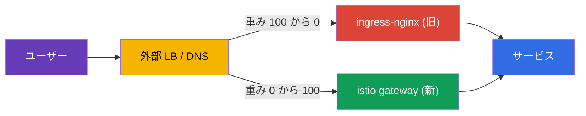
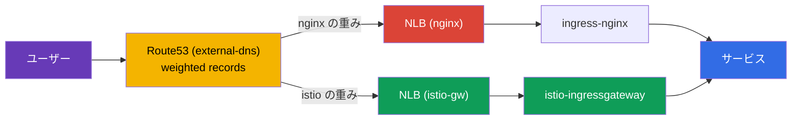
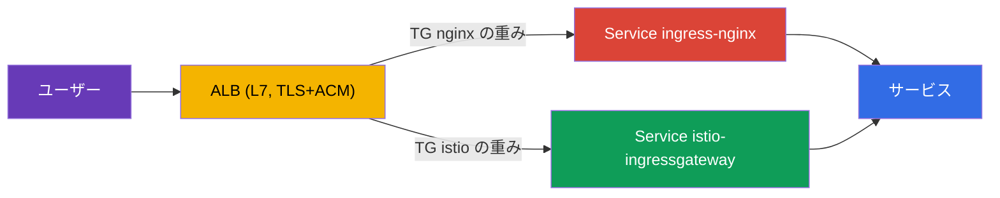

[Русская версия](ru.md) · [Eng version](en.md) · [Versión en español](es.md) · [Version française](fr.md) · [Deutsche Version](de.md) · [ქართული ვერსია](ge.md) · [繁體中文版](tw.md)

# 第26章：ダウンタイムなしの本番移行：ingress-nginx から Istio へ

> **次に進む前に。** Istio 導入時に最もよくある実際の課題の一つは、既存の
> ingress コントローラー（通常は ingress-nginx）から Istio Gateway へ受信トラフィックを
> 移行することです。そして、ユーザーに影響を与えられない稼働中の本番環境で行います。この
> 章では、そのような移行の方法論を扱います：並行稼働、パリティ検証、重みによる切り替え、
> ロールバック、そして数百サービス向けの計画です。

## 26.1. 課題と前提条件

条件は実運用に近いものです：

- サービスは 24/7 で稼働し、ユーザーを**停止させることはできません**（zero downtime）。
- 移行は**負荷が最も低い時間帯**に実施します。
- サービスが**多数**（数百）あり、一度に移行できないため、**ウェーブ**で進めます。
- 各ステップで**迅速なロールバック**が必要です。

主な難しさは nginx のルールと同等の Istio 設定を書くことではありません（それ自体は
簡単で、第5章と第11章を参照）。**安全かつ可逆的に**切り替えることです。

## 26.2. 基本原則：2つの ingress を並行稼働させる

zero-downtime の鍵となる考え方は、**移行が完了するまで nginx を削除しないこと**です。
ingress-nginx と istio-ingressgateway を**同時に**稼働させ、パブリックトラフィックは
**外部ロードバランサー / DNS** レベルで段階的かつ可逆的に切り替えます。



旧経路が生きている限り、ロールバックは簡単です：重みを nginx に戻すだけです。この章全体の
ルールは次のとおりです：**まず新しい経路を構築して検証し、その後に切り替え、最後にのみ旧経路を
削除します。**

## 26.3. 1サービスの段階的計画

各ホスト／サービスのプロセスは同じです：

1. **Istio に同等の設定を構築する。** `Gateway` + `VirtualService` は nginx ルールの正確な
   コピーです：ホスト、パス、ヘッダー、タイムアウト、rewrite。
2. **切り替え前のパリティ検証。** Istio-gateway はすでに並行して稼働しています。テスト
   トラフィックを送り、各ルールの挙動を nginx と照合します。ユーザーはまだ nginx を経由
   しています。
3. **（任意）ミラーリング。** `VirtualService.mirror`（第6章）により、本番トラフィックの
   一部を新経路へコピーします。ユーザーに影響を与えず、実負荷で検証できます。
4. **低負荷時間帯に切り替える。** 外部 LB で重みを滑らかに変更します：
   `nginx 100 / istio 0` → `90/10` → `50/50` → `0/100`。各段階の間でメトリクスを確認します。
5. **安定稼働確認（soak）。** 100% を Istio に数時間／数日保持し、エラーとレイテンシーを
   監視します。nginx 設定には**触れません**。これはホットスタンバイです。
6. このサービスの nginx を**廃止**するのは、安定稼働確認が成功してからです。

たとえば nginx でアノテーション付きの別 Ingress を必要とした header-canary は、Istio では
ヘッダーに基づく一つの `match` ブロックになります（第6章）。ただし、同じ慎重さで移行する
必要があります。

### 例：Ingress → Gateway + VirtualService

具体的なルールでステップ1を見てみましょう。nginx に典型的な `Ingress` があるとします：ホスト
`shop.example.com`、プレフィックスを除去するパス `/api`、HTTPS へのリダイレクト、読み取り
タイムアウトです：

```yaml
apiVersion: networking.k8s.io/v1
kind: Ingress
metadata:
  name: shop
  namespace: shop
  annotations:
    nginx.ingress.kubernetes.io/rewrite-target: /$2
    nginx.ingress.kubernetes.io/ssl-redirect: "true"
    nginx.ingress.kubernetes.io/proxy-read-timeout: "30"
spec:
  ingressClassName: nginx
  tls:
  - hosts: [shop.example.com]
    secretName: shop-tls                 # アプリケーションの namespace 内の Secret
  rules:
  - host: shop.example.com
    http:
      paths:
      - path: /api(/|$)(.*)
        pathType: ImplementationSpecific
        backend:
          service:
            name: api
            port: {number: 8080}
```

正確な Istio 相当設定は二つのリソースです：`Gateway`（ingress で何を待ち受けるか）と
`VirtualService`（どこへ、どのようにルーティングするか）です：

```yaml
apiVersion: networking.istio.io/v1
kind: Gateway
metadata:
  name: shop-gw
  namespace: shop
spec:
  selector:
    istio: ingressgateway                # どの ingress-gateway に紐付けるか
  servers:
  - port: {number: 443, name: https, protocol: HTTPS}
    hosts: ["shop.example.com"]
    tls:
      mode: SIMPLE
      credentialName: shop-tls           # 注意: Secret は gateway の namespace で検索される
  - port: {number: 80, name: http, protocol: HTTP}
    hosts: ["shop.example.com"]
    tls:
      httpsRedirect: true                # = ssl-redirect: "true"
---
apiVersion: networking.istio.io/v1
kind: VirtualService
metadata:
  name: shop
  namespace: shop
spec:
  hosts: ["shop.example.com"]
  gateways: ["shop-gw"]
  http:
  - match:
    - uri:
        prefix: /api/                    # = path /api(/|$)(.*)
    rewrite:
      uri: /                             # = rewrite-target: /$2 (プレフィックスを除去)
    route:
    - destination:
        host: api.shop.svc.cluster.local
        port: {number: 8080}
    timeout: 30s                         # = proxy-read-timeout: "30"
```

移行時に見落としがちですが重要なニュアンスは、**TLS Secret の配置場所**です。nginx では
`secretName` はアプリケーションの namespace（`shop`）から取得されます。Istio では
`credentialName` はデフォルトで**ingress-gateway 自身の namespace**（通常は `istio-system`）
から検索されます。移行後に「証明書が読み込まれない」よくある原因です。Secret を gateway の
namespace に複製するか、適切な設定で `Gateway` リソースの namespace の Secret を使用する
必要があります。切り替え前に確認してください。

## 26.4. 切り替え前のパリティ検証

ここが安全な移行の核心です：**すべてのユーザーがまだ nginx を利用している間に**、新経路を
完全に検証します。確認すること：

- **Istio 設定の健全性：** `istioctl analyze`、`istioctl proxy-status`（すべて
  `SYNCED`）、ingress gateway からルートが見えること（`istioctl proxy-config routes`）。
- **パブリック LB を迂回して istio-gateway に直接アクセス。** パブリック DNS を変更せず、
  必要な `Host` を指定して istio-ingressgateway へ直接リクエストを送ります（本番では
  `curl --resolve` を使用）。ユーザーには影響しません。
- **nginx と istio のパリティマトリクス。** 同じリクエストセットを両方の ingress に送り、
  ステータスコード、どのサービスが応答したか、ヘッダー、リダイレクトを比較します。差異は
  すべて**停止要因**です：VirtualService を修正して再実行します。
- **負荷テスト。** `fortio`/`k6` を istio-gateway に直接実行し、p95/p99 とエラーを nginx と
  照合します。

実際には、パブリック DNS を迂回した istio-gateway への直接アクセスは `curl --resolve` で
行います。これは適切な `Host` を設定しつつ、新しいロードバランサーの IP に解決するため、
Route53 には触れません：

```bash
# NLB istio-gateway (公開 DNS はまだ nginx を指している)
ISTIO_LB=$(kubectl -n istio-system get svc istio-ingressgateway \
  -o jsonpath='{.status.loadBalancer.ingress[0].hostname}')

# 同じリクエストを - 新しいパスへ直接
curl -sk --resolve shop.example.com:443:$(dig +short $ISTIO_LB | head -1) \
  https://shop.example.com/api/health -o /dev/null -w "istio: %{http_code}\n"
```

最も単純なパリティマトリクスは、パスのリストを両方の ingress に通してコードを比較することです：

```bash
NGINX_IP=$(dig +short nginx-nlb.example.com | head -1)
ISTIO_IP=$(dig +short $ISTIO_LB | head -1)
for p in / /api/health /api/v1/items /login /static/logo.png; do
  n=$(curl -sk --resolve shop.example.com:443:$NGINX_IP https://shop.example.com$p -o /dev/null -w '%{http_code}')
  i=$(curl -sk --resolve shop.example.com:443:$ISTIO_IP https://shop.example.com$p -o /dev/null -w '%{http_code}')
  [ "$n" = "$i" ] && s=OK || s=DIFF
  printf '%-20s nginx=%s istio=%s %s\n' "$p" "$n" "$i" "$s"
done
```

いずれかの `DIFF` は停止要因です：`VirtualService` を修正して再実行します。LB でトラフィックを
切り替えるのは、**すべてが正常になってから**です。

## 26.5. トラフィックの切り替え方法：DNS ではなく LB の重み

切り替えメカニズムはロールバック速度に直接影響します。

| メカニズム | 利点 | ロールバック時の欠点 |
|----------|-------|-------------------|
| 外部 LB（ALB/NLB）の重み | 即時、キャッシュなし；数秒でロールバック | 重み付け可能な LB が必要 |
| 重み付け DNS（例：Route53） | シンプル | キャッシュ/TTL のためロールバックは即時でない |
| ホスト単位の切り替え | ホストごとにリスクを分離 | 手順が増える |

24/7 向けの推奨は、**ロードバランサーで重みを切り替える**ことです。そうすればロールバックは
数秒で完了します。DNS しか利用できない場合は、事前（1日前）に TTL を 30～60 秒へ下げて
ください。そうしないとクライアント側の DNS キャッシュによりロールバックが「張り付く」ことが
あります。

## 26.6. 例：EKS、NLB、Route53、external-dns

具体的かつ非常に典型的なスタックで移行を見てみましょう：

- クラスターは **EKS**。
- **ingress-nginx** は Helm でインストールされ、その Service は `LoadBalancer` タイプで
  **NLB** を作成します。
- DNS は **Route53**、レコードは Ingress/Service から **external-dns** が自動作成します。

現在の状態は次のとおりです：external-dns が nginx を検出し、Route53 に
`shop.example.com` → nginx NLB のレコードを作成します。ユーザーはこの NLB 経由でアクセスします。



**ステップ1。独自の NLB を持つ istio-ingressgateway を立ち上げる。** Istio gateway の Service を
AWS Load Balancer Controller の NLB アノテーション付き LoadBalancer タイプにします：

```yaml
# Service istio-ingressgateway (抜粋)
metadata:
  annotations:
    service.beta.kubernetes.io/aws-load-balancer-type: "external"
    service.beta.kubernetes.io/aws-load-balancer-nlb-target-type: "ip"
    service.beta.kubernetes.io/aws-load-balancer-scheme: "internet-facing"
spec:
  type: LoadBalancer
```

nginx と並行稼働する、2つ目の独立した**Istio NLB**を取得します。ユーザーにはまだ影響しません。
Route53 は引き続き nginx を指しています。

**ステップ2。Gateway + VirtualService を構築してパリティを検証する**（26.4節）。テストトラフィックは
Route53 に触れず、`curl --resolve` を通じて Istio NLB の DNS 名へ直接送ります。

**ステップ3。Route53 の重み付けレコードで切り替える。** このスタックの特徴は、レコードを
external-dns が管理しているため、コンソールから手動で切り替えるのではなく、external-dns の
**重み付けレコード**を使うことです。ソースとなるサービスに重みのアノテーションを設定します：

```yaml
# istio-gw と nginx で - 同じ hostname、異なる set-identifier と重み
external-dns.alpha.kubernetes.io/hostname: shop.example.com
external-dns.alpha.kubernetes.io/set-identifier: istio    # nginx では: nginx
external-dns.alpha.kubernetes.io/aws-weight: "0"          # 0 -> 100 に変更
```

external-dns は Route53 に、異なる NLB を指す同一ホスト向けの2つの重み付けレコードを作成します。
重み（`nginx 100/istio 0` → `50/50` → `0/100`）を変更して、トラフィックを滑らかに移行します。

**このスタック固有の重要なニュアンス：**

- **これは LB の重みではなく DNS 切り替えです。** したがってロールバックは**即時ではありません**。
  リゾルバーのキャッシュと TTL が効きます。26.5節のとおり、事前（1日前）にレコードの TTL を
  30～60 秒へ下げてください。共有 LB の場合のような即時ロールバックはできないため、計画に
  織り込んでください。
- **external-dns が競合してはなりません。** 重み付けレコード（`set-identifier` + `aws-weight`）
  向けに設定され、TXT-registry 経由でゾーンを所有していることを確認してください。そうしないと
  重みが上書きされることがあります。
- **TLS をどこで終端するかは意識的に選択します。** 実用的な選択肢は2つあります：
  - **NLB 上（TLS リスナー + ACM 証明書）。** よくある本番構成です：TLS はロードバランサーで
    終端され、ACM が証明書を自動更新し、暗号化処理がクラスターから外れます。欠点は Istio から
    SNI/TLS が見えず、第9章の edge 機能（MUTUAL、SNI によるルーティング、入口の mTLS）が
    利用できないことです。NLB → istio-gateway は plaintext、または再暗号化で接続します。
  - **istio-gateway 上（TCP-passthrough モードの NLB）。** Istio 自身が証明書と SNI を管理し、
    第9章のすべての edge 機能を利用できますが、証明書はクラスター内で管理します。
  選び方：シンプルな offload と ACM 自動更新が必要なら NLB で終端し、Istio の edge 機能
  （mTLS/SNI/TLS による詳細なルーティング）が必要なら istio-gateway まで passthrough します。
  health-check と、必要に応じて proxy protocol も確認してください。
- **実クライアント IP。** NLB は source IP を保持できます（target-type `ip`）。per-IP rate limiting
  （第20章）を使用する場合に重要です。保持されないと Istio には NLB のアドレスが見えます。

**ステップ4。安定稼働確認と廃止。** 100% を Istio にしてメトリクスを監視し、その後にのみ nginx を
削除します（まず重み付けレコード、次にチャート）。

### NLB ではなく ALB を使う場合

ここで、よくある混同をすぐに解消しましょう。

**ingress-nginx 自体は「ALB を作成」できません。** nginx コントローラーは通常の Kubernetes
`Service` タイプ `LoadBalancer` を通じて公開され、このような Service は AWS では **NLB**
（または旧式の Classic ELB）を作成しますが、**ALB ではありません**。nginx Service の
ロードバランサークラスを ALB に切り替えることはできません。仕組みが根本的に異なります。

**EKS の ALB は別途作成されます**。これは AWS Load Balancer Controller がプロビジョニングし、
Service ではなく `Ingress` リソース（`ingressClassName: alb`）または `TargetGroupBinding` から
作成します。つまり ALB は ingress コントローラーの「モード」ではなく、その**前段**に配置する
独立した L7 フロントです。そのため、このような構成では通常、ALB を事前に作成し（または同じ
コントローラーが別の Ingress から作成し）、nginx をバックエンドとして接続します。

したがって典型的な「ALB + nginx」アーキテクチャは**2層**です：

- **ALB**（L7、TLS + ACM）が外部トラフィックを受け、HTTPS を終端します。
- その背後に ingress-nginx の Service に紐付く target group（通常は `NodePort`/`ClusterIP` +
  `TargetGroupBinding`）があり、nginx がパス／ホストごとの詳細なルーティングを実行します。

**この構成での移行方法。** ALB は独立したフロントなので、切り替えは**ALB 上**で、2つの target
 group 間に対して行います：一方は ingress-nginx の Service、もう一方は istio-ingressgateway の
Service に紐付きます。重みは ALB `Ingress` の weighted-actions
（`alb.ingress.kubernetes.io/actions.*`）または `TargetGroupBinding` に設定します。target group の
重みを変えることで、**ALB 上で直接**トラフィックを `nginx → istio` に移行します。



主な利点は、target group の重みを使う切り替えが DNS ではなく**ALB 自身で**行われることです。
そのため NLB+Route53 で問題となる TTL なしに、**ロールバックは即時**です。これは26.5節の
「LB で重みを切り替える」という理想形です。

**ALB 配下で Istio を導入する際の考慮点。** istio-ingressgateway は自らパブリックロード
バランサーを作成するのではなく、ALB のターゲットになる必要があります：

- その Service は `NodePort` または `ClusterIP` にします（ALB がフロントのため独自 NLB は不要）
  。そして `TargetGroupBinding` または ALB `Ingress` を通して target group に紐付けます。
- ALB の health-check は gateway の readiness ポート／パスに設定します。
- ALB がすでに TLS を終端しているため、istio-gateway までのトラフィックは HTTP（または再暗号化）
  です。gateway は独自の TLS ではなく、ALB からの HTTP を受け入れるよう設定します。

**注意事項：**

- **TLS は常に ALB で終端されます**（ALB は L7 であり、そうでなければ HTTP でルーティング
  できません）。したがって第9章の Istio edge 機能（SNI ルーティング、MUTUAL、入口の mTLS）は
  原理的に利用できません。必要なら passthrough モードの NLB を選んでください。
- **実クライアント IP は `X-Forwarded-For` にあります。** ALB は L3 の source IP を保持しません。
  per-IP rate limiting（第20章）では、Istio が XFF から IP を取り出せるよう `numTrustedProxies`
  を設定してください。
- **external-dns は ALB に対する一つのレコードを作成します。** 重み付けは DNS ではなく ALB の
  target group レベルで行われます。

移行における比較の結論：**NLB** はシンプルで passthrough を可能にします（Istio の edge 機能が
必要な場合）が、切り替えは DNS 経由でロールバックは速くありません。**ALB** は ingress 前段の
独立した L7 層で、構成はより複雑かつ常に TLS を終端しますが、target group の重みにより即時かつ
可逆的な切り替えを実現します。これは zero-downtime において非常に価値があります。

### Istio 前段の ALB と NLB：完全比較

この選択は移行時だけでなく、EKS 上に Istio を導入する際にも重要です（第27章）。
istio-ingressgateway 前段に置く両ロードバランサーの利点と欠点をまとめます。

| 基準 | NLB (L4) | ALB (L7) |
|----------|----------|----------|
| レイヤー | L4 (TCP/UDP/TLS) | L7 (HTTP/HTTPS/gRPC) |
| TLS | passthrough **または**終端（TLS リスナー + ACM） | 常に終端（ACM） |
| Istio edge 機能（SNI、MUTUAL、入口の mTLS） | 利用可能（passthrough モード） | 利用不可（ALB が HTTPS を復号） |
| ルーティングの場所 | すべて Istio（単一の信頼できる情報源） | 一部は ALB（host/path）、Istio と重複 |
| 非 HTTP トラフィック（TCP、任意） | 可 | 不可、HTTP/HTTPS/gRPC のみ |
| 実クライアント IP | source IP を保持（target-type `ip`） | `X-Forwarded-For` 内 |
| LB レベルの重み付け | 不可（DNS 経由で切り替え） | 可（weighted target group）、即時ロールバック |
| AWS WAF / Cognito 統合 | 不可 | 可 |
| レイテンシー / パフォーマンス | 低レイテンシー、高スループット | やや大きい overhead（L7 処理） |
| 管理方法 | `Service` のアノテーション | `Ingress`/`TargetGroupBinding`（AWS LB Controller） |

**次の場合は NLB を選びます：**

- 入口の mTLS、`MUTUAL`、SNI によるルーティング、gateway までのエンドツーエンド暗号化
  （passthrough）など、Istio の edge 機能が必要。
- ingress を通じて**非 HTTP**トラフィック（TCP、エンドツーエンド mTLS の gRPC、カスタム
  プロトコル）が流れる。
- すべてのルーティングと TLS を Istio に置き、ルールを ALB に重複させない単一の信頼できる
  情報源にしたい。
- 最小のレイテンシーと高いスループットが重要。

**次の場合は ALB を選びます：**

- ACM で TLS を offload したく、Istio の edge 機能が不要。
- **AWS WAF**、Cognito、ALB レベルの認証との統合が必要。
- ロードバランサー**レベルで**の重み付け切り替えと canary が必要（移行時の即時ロールバック）。
- 組織がすでに ALB と AWS LB Controller を標準化している。

**実務上の目安。** 「純粋な」Istio では多くの場合 **NLB** を選びます。L7（ルーティング、TLS、
edge ポリシー）のすべてを mesh 内に残すため、Istio の全機能が使え、ルールも一箇所に集約されます。
組織がそのエコシステム（WAF、ACM、Cognito）に依存している場合、または LB レベルで重み付け
トラフィック切り替えが必要な場合に **ALB** を選択します。妥協点は単純です：ALB は一部の作業
（TLS、WAF、重み）を引き受けますが、Istio から L7 制御の一部を取り上げます。

## 26.7. ロールバック計画

旧経路が撤去されていないため、ロールバックは数秒から数分で完了する必要があります：

1. 外部 LB で重みを nginx に戻す（`istio 0 / nginx 100`）。
2. メトリクスで 5xx とレイテンシーが正常に戻ったことを確認する。
3. 復元するものはありません。nginx の `Ingress` はこの間ずっと変更されていません。
4. 原因（通常はルールの不一致）を分析し、`VirtualService` を修正して、再びパリティテストを
   実施してから切り替えを繰り返す。

旧経路が生きているからこそ、移行は各段階で低リスクのままです。

## 26.8. 100以上のサービスをウェーブで移行する

すべてを一度に移行することはできません。確信はウェーブで積み上げます：

- **ウェーブ0（パイロット）：** 低トラフィックの非クリティカルなサービス2～3個。切り替え後、
  数日間観察します。runbook、ダッシュボード、ロールバック手順を検証します。
- **ウェーブ1..N（主な対象）：** 5～10サービスずつのバッチで実施し、各バッチは前のバッチが
  安定稼働確認を完了してからのみ開始します。プロセスは再現可能です（Gateway/VirtualService の
  テンプレート）。
- **最終ウェーブ：** 最もクリティカルで高負荷のサービスを最後に、最大限の監視と十分に
  リハーサルしたロールバックで実施します。

ウェーブ間ではメトリクス（エラー、p95/p99、インシデント）を記録します。いかなる劣化も次の
ウェーブの停止要因です。

## 26.9. リスクと軽減策

| リスク | 軽減策 |
|------|-----------|
| ルールの不一致（パス／ヘッダー／regex） | 切り替え前に各ルールをパリティテスト |
| パスセマンティクスの差異（`pathType`、rewrite） | `uri.exact/prefix` + `rewrite.uri` に明示的にマッピングし、テスト |
| nginx と Istio で異なるタイムアウト／制限 | VirtualService に明示的な `timeout`/`retries` を設定 |
| Sticky sessions / affinity | cookie／ヘッダーに基づく `DestinationRule` `consistentHash` |
| mTLS／injection がサービス間トラフィックを壊す | 移行中は `PeerAuthentication: PERMISSIVE` を維持 |
| WebSocket / gRPC / 大きなヘッダー | 明示的にテスト；正しい Service ポート名（第10、23章） |
| ロールバック時の DNS キャッシュ | LB の重みで切り替え；事前に TTL を低く設定 |
| cutover 時に可観測性がない | 切り替え**前に**ダッシュボードとアラート（5xx、p99）を準備 |

## 26.10. 自動変換：ingress2gateway

ルールを手作業で書き換える必要はありません。**ingress2gateway** ツール（kubernetes-sigs
プロジェクト）は、プロバイダーのアノテーションを含む既存の `Ingress` を読み取り、Gateway API
リソースを生成します：

```bash
ingress2gateway print --providers ingress-nginx -A
```

重要な注意点：

- 出力はネイティブ Istio の `Gateway`/`VirtualService` ではなく、**Gateway API**
  （`Gateway`/`HTTPRoute`）です。Istio は Gateway API を実装しているため（第11章）、
  `gatewayClassName: istio` を指定して生成物を適用してください。
- **すべてが 1:1 で変換されるわけではありません**：nginx 固有のアノテーション（rewrite、
  canary-by-header、auth-url、カスタムタイムアウト）は部分的にしか、またはまったく移行
  されないことがあります。出力は**下書き**です。
- したがって、切り替え前の**レビューとパリティテスト**が必須です。

実用的なフロー：`ingress2gateway print ... > gwapi.yaml` → レビューと修正 → nginx と並行して
`kubectl apply` → パリティ検証 → LB の重みを切り替え。

### チートシート：ingress-nginx のアノテーション → Istio

自動変換で最もつまずきやすいのはアノテーションです。nginx の多くの機能は Istio では別の
リソースで実装されます。最も一般的な対応関係は次のとおりです：

| ingress-nginx アノテーション | Istio での相当設定 |
|-------------------------|--------------------|
| `rewrite-target` | `VirtualService` → `http.rewrite.uri` |
| `ssl-redirect` / `force-ssl-redirect` | `Gateway` → サーバー `tls.httpsRedirect: true` |
| `canary` + `canary-by-header` / `canary-weight` | `VirtualService` → `http.match.headers` または重み付き `route`（第6章） |
| `proxy-read-timeout` / `proxy-send-timeout` | `VirtualService` → `http.timeout` |
| `proxy-next-upstream*` / リトライ | `VirtualService` → `http.retries` |
| `limit-rps` / `limit-connections` | `EnvoyFilter` による local rate limit（第20章） |
| `auth-url` / `auth-signin`（外部認証） | `AuthorizationPolicy` `CUSTOM` + ext_authz（第15章） |
| `whitelist-source-range` | `AuthorizationPolicy` `ipBlocks`/`remoteIpBlocks`（第14章） |
| `affinity: cookie`（sticky sessions） | cookie／ヘッダーに基づく `DestinationRule` → `consistentHash` |
| `backend-protocol: GRPC`/`HTTPS` | Service ポート名（`grpc-`、第10章）／`DestinationRule` `tls` |
| `configuration-snippet` / `server-snippet` | `EnvoyFilter`（第21章）- 手動で移行 |

ルールは単純です：アノテーションが「特殊」になるほど（snippet、カスタム認可、制限）、自動変換
される可能性は低くなります。そのようなルールは手作業で移行し、個別にパリティを確認します。

## 26.11. この章のまとめ

- Zero-downtime 移行は nginx と Istio の**並行稼働**に基づきます：旧経路は最後まで削除しません。
- サービスごとのプロセス：同等設定を構築 → 切り替え前にパリティ検証 → （任意で）ミラーリング
  → 重みを滑らかに切り替え → 安定稼働確認 → nginx を廃止。
- パリティ検証（analyze、proxy-status、istio-gateway への直接リクエスト、nginx との比較、
  負荷テスト）は、ユーザーを切り替える前に必須です。
- DNS（キャッシュ/TTL）ではなく、**LB の重み**（即時ロールバック）で切り替えるのが最適です。
  DNS の場合は、事前に TTL を下げます。
- 旧経路が生きているため、ロールバックは数秒で nginx に重みを戻すだけです。
- 100以上のサービスは**ウェーブ**で移行します：パイロット → バッチ → 最後にクリティカルなもの。
- nginx の `Ingress` ルールは `Gateway` + `VirtualService` の組（ホスト、パスの `match`、
  `rewrite`、`timeout`、`credentialName` による TLS）に移行されます。よくある罠は TLS Secret が
  アプリケーションではなく ingress-gateway の namespace で検索されることです。
- 多くの nginx アノテーションは別の Istio リソースに対応します（rewrite/timeout → VirtualService、
  auth-url → ext_authz、limit-rps → rate limit、snippet → EnvoyFilter）。チートシートを参照してください。
- `ingress2gateway` は移行を速めますが、下書き（Gateway API）を出力するだけです。レビューと
  パリティ検証が必須です。
- EKS + NLB + Route53 + external-dns スタックでは、切り替えは LB の重みではなく Route53 の
  weighted レコード（external-dns）で行われます。そのためロールバックは即時ではありません：
  事前に TTL を下げてください。TLS は NLB（TLS リスナー + ACM、シンプルな offload）または
  istio-gateway（edge 機能が必要な場合の passthrough）で終端できます。target-type `ip` の NLB は
  実クライアント IP を保持します。
- **ALB** では、切り替えはロードバランサー上で target group の重みにより行われ、ロールバックは
  即時です（DNS TTL なし）。ただし ALB は常に TLS を終端するため（Istio edge 機能は利用不可）、
  実クライアント IP は `X-Forwarded-For` から取得します（`numTrustedProxies` が必要）。

## 26.12. 自己確認の質問

1. 移行の完了まで nginx を削除してはならないのはなぜですか？
2. パリティ検証とは何ですか。またユーザーの切り替え前に実施するのはなぜですか？
3. 24/7 では DNS ではなく LB の重みで切り替えるのはなぜですか？
4. ロールバックはどのようなもので、なぜ数秒で完了しますか？
5. なぜウェーブで移行し、サービスはどの順番で選ぶべきですか？
6. nginx の `Ingress` ルール（ホスト、パス、rewrite、タイムアウト、TLS）はどのように
   `Gateway` + `VirtualService` へ移行され、このとき TLS Secret はどこに置くべきですか？
7. パブリック DNS に触れず、istio-gateway へ直接新経路のパリティを確認するにはどうしますか？
8. nginx の `rewrite-target`、`auth-url`、`limit-rps`、`configuration-snippet` アノテーションは
   どの Istio リソースに移行しますか？
9. `ingress2gateway` は何をし、その出力を検証なしに適用できないのはなぜですか？
10. EKS + NLB + Route53 + external-dns スタックでは、トラフィックをどう切り替え、なぜ
    ロールバックは即時でなく、TLS はどこで終端しますか？
11. ALB での移行は NLB とどう異なりますか？ALB ではなぜロールバックが即時で、Istio の
    edge 機能が利用できないのはなぜですか？
12. Istio 前段にはいつ NLB を、いつ ALB を選びますか？それぞれの主な利点と欠点を挙げてください。

## 演習

ingress-nginx から Istio Gateway への実際の移行でパイロットウェーブを練習します：同等の
ルールを構築し、パリティを検証し、重みでの切り替えとロールバックを確認してください：

🧪 ラボ31：[tasks/ica/labs/31](../../labs/31/README_JP.MD)

---
[目次](../README_JP.md) · [第25章](../25/jp.md) · [第27章](../27/jp.md)
