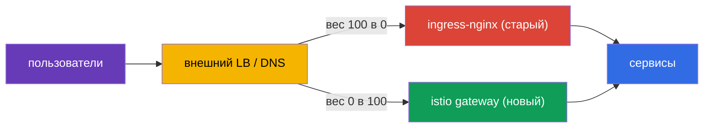
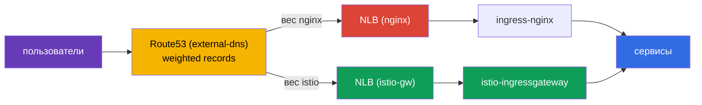
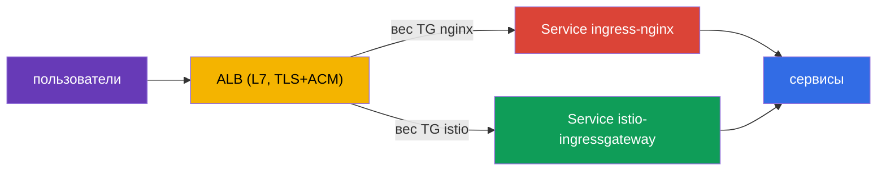

# Глава 26. Миграция продакшена без даунтайма: ingress-nginx на Istio

> **Что дальше.** Одна из самых частых реальных задач при внедрении Istio - перенести
> входящий трафик с существующего ingress-контроллера (обычно ingress-nginx) на Istio
> Gateway. И сделать это на живом проде, где пользователей нельзя затрагивать. В этой
> главе разберём методологию такой миграции: параллельная работа, паритет-проверка,
> переключение весами, откат и план для сотни сервисов.

## 26.1. Задача и вводные

Условия приближены к боевым:

- сервис работает 24/7, пользователей **нельзя** ронять (zero downtime);
- миграцию проводят в **окно минимальной нагрузки**;
- сервисов **много** (сотни) - за один проход не мигрировать, идём **волнами**;
- на каждом шаге нужен **быстрый откат**.

Главная сложность не в том, чтобы написать Istio-эквивалент правил nginx (это как раз
просто, главы 5 и 11), а в том, чтобы переключиться **безопасно и обратимо**.

## 26.2. Главный принцип: два ingress параллельно

Ключевая идея zero-downtime: **не удаляем nginx, пока миграция не завершена**.
ingress-nginx и istio-ingressgateway работают **одновременно**, а публичный трафик
переключается на уровне **внешнего балансировщика / DNS** - постепенно и обратимо.



Пока старый путь жив, откат тривиален: вернуть вес обратно на nginx. Правило всей главы:
**сначала строим и валидируем новый путь, потом переключаем, и только в самом конце
удаляем старый.**

## 26.3. Пошаговый план для одного сервиса

Для каждого хоста/сервиса процесс одинаковый:

1. **Построить эквивалент в Istio.** `Gateway` + `VirtualService` - точная копия правил
   nginx: хосты, пути, заголовки, таймауты, rewrite.
2. **Паритет-проверка до переключения.** Istio-gateway уже работает параллельно; шлём в
   него тестовый трафик и сверяем поведение с nginx по каждому правилу. Пользователи всё
   ещё идут через nginx.
3. **(опционально) Зеркалирование.** Через `VirtualService.mirror` (глава 6) копируем
   часть боевого трафика в новый путь - валидация под реальной нагрузкой без влияния на
   пользователей.
4. **Переключение в окно низкой нагрузки.** На внешнем LB плавно меняем вес:
   `nginx 100 / istio 0` → `90/10` → `50/50` → `0/100`. Между шагами смотрим метрики.
5. **Выдержка (soak).** Держим 100% на Istio несколько часов/дней, наблюдаем ошибки и
   латентность. Конфиг nginx **не трогаем** - он горячий резерв.
6. **Декомиссия nginx** для этого сервиса - только после успешной выдержки.

Например, header-canary, который в nginx требовал отдельный Ingress с аннотациями, в
Istio становится одним блоком `match` по заголовку (глава 6) - но переносить его нужно с
той же осторожностью.

## 26.4. Паритет-проверка до переключения

Это сердце безопасной миграции: полностью провалидировать новый путь, **пока все
пользователи ещё на nginx**. Что проверяем:

- **Здоровье конфигурации Istio:** `istioctl analyze`, `istioctl proxy-status` (все
  `SYNCED`), маршруты видны на ingress gateway (`istioctl proxy-config routes`).
- **Прямое обращение в istio-gateway в обход публичного LB.** Шлём запросы напрямую в
  istio-ingressgateway с нужным `Host` (в проде через `curl --resolve`), не меняя
  публичный DNS. Пользователи не затронуты.
- **Паритет-матрица nginx против istio.** Один и тот же набор запросов гоним в оба
  ingress и сравниваем: статус-код, какой сервис ответил, заголовки, редиректы. Любое
  расхождение - **стоп-фактор**: чиним VirtualService и повторяем.
- **Нагрузочный прогон.** `fortio`/`k6` прямо в istio-gateway, сверяем p95/p99 и ошибки с
  nginx.

Переключаем трафик на LB **только когда всё зелёное**.

## 26.5. Чем переключать трафик: веса LB, а не DNS

Механизм переключения напрямую влияет на скорость отката.

| Механизм | Плюсы | Минусы для отката |
|----------|-------|-------------------|
| Веса на внешнем LB (ALB/NLB) | мгновенно, без кэша; откат за секунды | нужен LB со взвешиванием |
| Взвешенный DNS (например Route53) | просто | кэш/TTL - откат не мгновенный |
| Пер-хостовое переключение | изоляция риска по хосту | больше шагов |

Рекомендация для 24/7: переключать **весами на балансировщике** - откат тогда занимает
секунды. Если доступен только DNS, заранее (за сутки) снизьте TTL до 30-60 секунд, иначе
откат будет «залипать» из-за кэширования DNS у клиентов.

## 26.6. Пример: EKS, NLB, Route53, external-dns

Разберём миграцию на конкретном и очень типичном стеке:

- кластер **EKS**;
- **ingress-nginx** установлен через Helm, его Service имеет тип `LoadBalancer` и
  создаёт **NLB**;
- DNS - **Route53**, записи создаёт **external-dns** автоматически из Ingress/Service.

Как это выглядит сейчас: external-dns видит nginx и создаёт в Route53 запись
`shop.example.com` → NLB nginx. Пользователи идут через этот NLB.



**Шаг 1. Поднять istio-ingressgateway со своим NLB.** Сервис шлюза Istio делаем типа
LoadBalancer с NLB-аннотациями AWS Load Balancer Controller:

```yaml
# Service istio-ingressgateway (фрагмент)
metadata:
  annotations:
    service.beta.kubernetes.io/aws-load-balancer-type: "external"
    service.beta.kubernetes.io/aws-load-balancer-nlb-target-type: "ip"
    service.beta.kubernetes.io/aws-load-balancer-scheme: "internet-facing"
spec:
  type: LoadBalancer
```

Получаем второй, отдельный **NLB istio**, работающий параллельно с nginx. Пользователей
это пока не касается - Route53 всё ещё указывает на nginx.

**Шаг 2. Построить Gateway + VirtualService и проверить паритет** (раздел 26.4). Тестовый
трафик шлём напрямую на DNS-имя NLB istio через `curl --resolve`, не трогая Route53.

**Шаг 3. Переключение через взвешенные записи Route53.** Здесь особенность стека: раз
записями управляет external-dns, переключаемся не руками в консоли, а **weighted-записями
external-dns**. На сервисах-источниках задаём аннотации веса:

```yaml
# на istio-gw и на nginx - одинаковый hostname, разные set-identifier и вес
external-dns.alpha.kubernetes.io/hostname: shop.example.com
external-dns.alpha.kubernetes.io/set-identifier: istio    # у nginx: nginx
external-dns.alpha.kubernetes.io/aws-weight: "0"          # меняем 0 -> 100
```

external-dns создаст в Route53 две weighted-записи на один хост, указывающие на разные
NLB. Меняя веса (`nginx 100/istio 0` → `50/50` → `0/100`), плавно переводим трафик.

**Важные нюансы именно этого стека:**

- **Это DNS-переключение, а не веса на LB.** Значит, откат **не мгновенный** - работает
  кэш и TTL резолверов. Как в разделе 26.5: заранее (за сутки) снизьте TTL записи до
  30-60 секунд. Мгновенного отката, как с общим LB, здесь не будет - закладывайте это в
  план.
- **external-dns не должен «воевать» с вами.** Убедитесь, что он настроен на
  weighted-записи (`set-identifier` + `aws-weight`) и владеет зоной через TXT-registry,
  иначе он может перезаписать ваши веса.
- **Где терминировать TLS - осознанный выбор.** Есть два рабочих варианта:
  - **На NLB (TLS-листенер + сертификат из ACM).** Частый прод-вариант: TLS завершается
    на балансировщике, ACM сам продлевает сертификаты, шифрование снимается с кластера.
    Минус - Istio не видит SNI/TLS, и edge-возможности из главы 9 (MUTUAL, маршрутизация
    по SNI, mTLS на входе) остаются за бортом. NLB → istio-gateway идёт как plaintext или
    повторно шифруется.
  - **На istio-gateway (NLB в режиме TCP-passthrough).** Istio сам управляет
    сертификатами и SNI, доступны все edge-возможности главы 9, но сертификатами вы
    управляете в кластере.
  Выбор: нужен простой offload и ACM-автопродление - терминируйте на NLB; нужны
  edge-фичи Istio (mTLS/SNI/тонкая маршрутизация по TLS) - passthrough до istio-gateway.
  Также проверьте health-check и при необходимости proxy protocol.
- **Реальный IP клиента.** NLB умеет сохранять source IP (target-type `ip`), это важно,
  если используете per-IP rate limiting (глава 20) - иначе Istio увидит адрес NLB.

**Шаг 4. Выдержка и декомиссия.** Подержали 100% на istio, понаблюдали метрики - и
только потом убираем nginx (сначала его weighted-запись, затем сам чарт).

### Вариант с ALB вместо NLB

Здесь нужно сразу снять частую путаницу.

**Сам ingress-nginx не может «создать ALB».** Контроллер nginx публикуется через обычный
Kubernetes `Service` типа `LoadBalancer`, а такой Service на AWS создаёт **NLB** (или
устаревший Classic ELB), но **не ALB**. Переключить класс балансировщика у Service nginx
на ALB нельзя - это принципиально разные механизмы.

**ALB на EKS создаётся отдельно** - его провижнит **AWS Load Balancer Controller**, и не
из Service, а из ресурса `Ingress` (`ingressClassName: alb`) или из `TargetGroupBinding`.
То есть ALB это самостоятельный L7-фронт, который ставят **перед** ingress-контроллером,
а не «режим» самого nginx. Поэтому в таких схемах ALB обычно создают заранее (или тем же
контроллером из отдельного Ingress) и подключают nginx к нему как бэкенд.

Отсюда типовая архитектура «ALB + nginx» - это **два слоя**:

- **ALB** (L7, TLS + ACM) принимает внешний трафик и терминирует HTTPS;
- за ним target-группа, привязанная к Service ingress-nginx (обычно `NodePort`/`ClusterIP`
  + `TargetGroupBinding`), а nginx делает уже детальную маршрутизацию по путям/хостам.

**Как мигрировать при такой схеме.** Раз ALB - отдельный front, переключение делают
**на нём**, между двумя target-группами: одна привязана к Service ingress-nginx, вторая -
к Service istio-ingressgateway. Веса задаются либо weighted-actions в ALB `Ingress`
(`alb.ingress.kubernetes.io/actions.*`), либо через `TargetGroupBinding`. Меняя веса
target-групп, переводим трафик `nginx → istio` **прямо на ALB**.



Главный плюс: переключение весами target-групп происходит **на самом ALB**, а не через
DNS, поэтому **откат мгновенный** - без проблемы TTL, о которой шла речь для NLB+Route53.
Это тот самый идеал «переключаем весами на LB» из раздела 26.5.

**Что учесть при установке Istio под ALB.** istio-ingressgateway должен стать целью ALB,
а не поднимать свой публичный балансировщик:

- его Service делают `NodePort` или `ClusterIP` (свой NLB не нужен - фронтом служит ALB) и
  привязывают к target-группе через `TargetGroupBinding` или ALB `Ingress`;
- health-check ALB настраивают на порт/путь готовности gateway;
- поскольку ALB уже терминировал TLS, до istio-gateway трафик идёт по HTTP (или
  ре-энкрипт) - gateway настраивают на приём HTTP от ALB, а не на свой TLS.

**Оговорки:**

- **TLS всегда терминируется на ALB** (он L7, иначе не маршрутизировал бы по HTTP).
  Значит, edge-возможности Istio из главы 9 (SNI-маршрутизация, MUTUAL, mTLS на входе)
  недоступны в принципе. Нужны они - берите NLB в режиме passthrough.
- **Реальный IP клиента - в `X-Forwarded-For`.** ALB не сохраняет source IP на L3.
  Для per-IP rate limiting (глава 20) настройте `numTrustedProxies`, чтобы Istio доставал
  IP из XFF.
- **external-dns создаёт одну запись** на ALB - взвешивание идёт на уровне target-групп
  ALB, а не DNS.

Итог сравнения для миграции: **NLB** проще и позволяет passthrough (если нужны edge-фичи
Istio), но переключение идёт через DNS с небыстрым откатом. **ALB** это отдельный L7-слой
перед ingress, сложнее в устройстве и всегда терминирует TLS, зато даёт мгновенное и
обратимое переключение весами target-групп - что для zero-downtime очень ценно.

### ALB или NLB перед Istio: полное сравнение

Этот выбор важен не только при миграции, но и вообще при установке Istio на EKS (глава
27). Сведём плюсы и минусы обоих балансировщиков перед istio-ingressgateway.

| Критерий | NLB (L4) | ALB (L7) |
|----------|----------|----------|
| Уровень | L4 (TCP/UDP/TLS) | L7 (HTTP/HTTPS/gRPC) |
| TLS | passthrough **или** терминация (TLS-листенер + ACM) | всегда терминирует (ACM) |
| Edge-фичи Istio (SNI, MUTUAL, mTLS на входе) | доступны (в режиме passthrough) | недоступны (ALB вскрывает HTTPS) |
| Где маршрутизация | вся в Istio (единый источник правды) | часть на ALB (host/path), дублирование с Istio |
| Не-HTTP трафик (TCP, произвольный) | да | нет, только HTTP/HTTPS/gRPC |
| Реальный IP клиента | сохраняет source IP (target-type `ip`) | в `X-Forwarded-For` |
| Взвешивание на уровне LB | нет (переключение через DNS) | да (weighted target-группы), мгновенный откат |
| Интеграция с AWS WAF / Cognito | нет | да |
| Задержка / производительность | ниже задержка, выше throughput | чуть больше overhead (L7-обработка) |
| Чем управляется | аннотации на `Service` | `Ingress`/`TargetGroupBinding` (AWS LB Controller) |

**Берите NLB, когда:**

- нужны edge-возможности Istio: mTLS на входе, `MUTUAL`, маршрутизация по SNI, сквозное
  шифрование до gateway (passthrough);
- через ingress ходит **не-HTTP** трафик (TCP, gRPC со сквозным mTLS, кастомные протоколы);
- хотите, чтобы **вся** маршрутизация и TLS были в Istio - единый источник правды, без
  дублирования правил на ALB;
- важны минимальная задержка и высокий throughput.

**Берите ALB, когда:**

- хотите offload TLS на ACM и edge-фичи Istio не нужны;
- нужна интеграция с **AWS WAF**, Cognito, аутентификацией на уровне ALB;
- хотите взвешенное переключение и canary **на уровне балансировщика** (мгновенный откат
  при миграциях);
- организация уже стандартизована на ALB и AWS LB Controller.

**Практический ориентир.** Для «чистого» Istio чаще берут **NLB**: он оставляет весь L7
(маршрутизацию, TLS, edge-политики) внутри mesh, а значит доступны все возможности Istio
и правила живут в одном месте. **ALB** выбирают, когда организация завязана на его
экосистему (WAF, ACM, Cognito) или когда нужен взвешенный трафик-свитчинг на уровне LB.
Компромисс простой: ALB снимает часть работы (TLS, WAF, веса), но забирает у Istio часть
L7-контроля.

## 26.7. План отката

Откат должен занимать секунды-минуты, потому что старый путь не демонтирован:

1. На внешнем LB вернуть вес обратно на nginx (`istio 0 / nginx 100`).
2. Убедиться по метрикам, что 5xx и латентность вернулись в норму.
3. Ничего восстанавливать не нужно - `Ingress` nginx всё это время был нетронут.
4. Разобрать причину (обычно несовпадение правила), поправить `VirtualService`, снова
   пройти паритет-тест и повторить переключение.

Именно потому, что старый путь жив, миграция остаётся низкорисковой на каждом шаге.

## 26.8. Миграция 100+ сервисов волнами

Мигрировать всё сразу нельзя - уверенность копят волнами:

- **Волна 0 (пилот):** 2-3 некритичных сервиса с низким трафиком. Переключаем, наблюдаем
  несколько дней. Обкатываем runbook, дашборды и процедуру отката.
- **Волны 1..N (основная масса):** батчами по 5-10 сервисов, каждый батч - только после
  стабильной выдержки предыдущего. Процесс повторяемый (шаблоны Gateway/VirtualService).
- **Финальная волна:** самые критичные и высоконагруженные сервисы - последними, с
  максимальным мониторингом и отрепетированным откатом.

Между волнами фиксируют метрики (ошибки, p95/p99, инциденты). Любой регресс - стоп-фактор
для следующей волны.

## 26.9. Риски и как их снять

| Риск | Митигация |
|------|-----------|
| Несовпадение правил (путь/заголовок/regex) | паритет-тест каждого правила до переключения |
| Разница семантики путей (`pathType`, rewrite) | явно маппить в `uri.exact/prefix` + `rewrite.uri`, тестировать |
| Разные таймауты/лимиты nginx vs Istio | выставить явные `timeout`/`retries` в VirtualService |
| Sticky sessions / affinity | `DestinationRule` `consistentHash` (по cookie/заголовку) |
| mTLS/инъекция ломает трафик между сервисами | на время миграции держать `PeerAuthentication: PERMISSIVE` |
| WebSocket / gRPC / большие заголовки | тестировать явно; правильные имена портов (главы 10, 23) |
| Кэш DNS при откате | переключать весами LB; низкий TTL заранее |
| Нет наблюдаемости в момент cutover | дашборды и алерты (5xx, p99) готовы **до** переключения |

## 26.10. Автоконвертация: ingress2gateway

Переписывать правила руками необязательно. Инструмент **ingress2gateway**
(проект kubernetes-sigs) читает существующие `Ingress` вместе с аннотациями провайдера
и генерирует ресурсы Gateway API:

```bash
ingress2gateway print --providers ingress-nginx -A
```

Важные оговорки:

- он выдаёт **Gateway API** (`Gateway`/`HTTPRoute`), а не нативные Istio
  `Gateway`/`VirtualService`. Istio реализует Gateway API (глава 11), поэтому применяйте
  сгенерированное с `gatewayClassName: istio`;
- **не всё конвертируется 1:1**: специфичные аннотации nginx (rewrite, canary-by-header,
  auth-url, кастомные таймауты) могут перенестись частично или никак - вывод это
  **черновик**;
- поэтому обязательны **ревью и паритет-тест** перед переключением.

Практический флоу: `ingress2gateway print ... > gwapi.yaml` → ревью и правка → `kubectl
apply` параллельно с nginx → паритет-проверка → переключение весов на LB.

## 26.11. Итоги главы

- Zero-downtime миграция строится на **параллельной работе** nginx и Istio: старый путь
  не удаляют до конца.
- Процесс для сервиса: построить эквивалент → паритет-проверка до переключения →
  (опционально) зеркалирование → плавно переключить веса → выдержка → декомиссия nginx.
- Паритет-проверка (analyze, proxy-status, прямые запросы в istio-gateway, сравнение с
  nginx, нагрузка) - обязательна до переключения пользователей.
- Переключать лучше **весами на LB** (мгновенный откат), а не DNS (кэш/TTL); при DNS -
  заранее низкий TTL.
- Откат - возврат веса на nginx за секунды, потому что старый путь жив.
- 100+ сервисов мигрируют **волнами**: пилот → батчи → критичные последними.
- `ingress2gateway` ускоряет перенос, но даёт черновик - обязательны ревью и паритет.
- На стеке EKS + NLB + Route53 + external-dns переключение идёт weighted-записями Route53
  (external-dns), а не весами LB - поэтому откат не мгновенный: заранее снижайте TTL.
  TLS можно терминировать на NLB (TLS-листенер + ACM, простой offload) или на
  istio-gateway (passthrough, если нужны edge-фичи Istio). NLB с target-type `ip`
  сохраняет реальный IP.
- С **ALB** переключение делается весами target-групп прямо на балансировщике - откат
  мгновенный (без DNS-TTL). Но ALB всегда терминирует TLS (edge-фичи Istio недоступны), а
  реальный IP берётся из `X-Forwarded-For` (нужен `numTrustedProxies`).

## 26.12. Вопросы для самопроверки

1. Почему nginx нельзя удалять до конца миграции?
2. Что такое паритет-проверка и почему её делают до переключения пользователей?
3. Почему для 24/7 переключают весами на LB, а не через DNS?
4. Как выглядит откат и почему он занимает секунды?
5. Зачем мигрировать волнами и в каком порядке брать сервисы?
6. Что делает `ingress2gateway` и почему его вывод нельзя применять без проверки?
7. На стеке EKS + NLB + Route53 + external-dns: как переключают трафик, почему откат не
   мгновенный и где терминируется TLS?
8. Чем миграция с ALB отличается от NLB? Почему с ALB откат мгновенный, а edge-фичи Istio
   недоступны?
9. Когда перед Istio выбирают NLB, а когда ALB? Назовите ключевые плюсы и минусы каждого.

## Практика

Отработайте пилотную волну реальной миграции ingress-nginx на Istio Gateway: постройте
эквивалент правил, проверьте паритет, разберите переключение весами и откат:

🧪 Лаба 31: [tasks/ica/labs/31](../../labs/31/README_RU.MD)

---
[Оглавление](../README.md) · [Глава 25](../25/ru.md) · [Глава 27](../27/ru.md)
