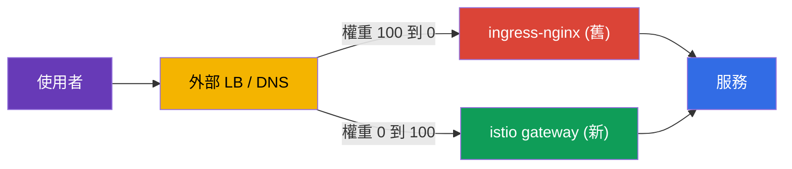
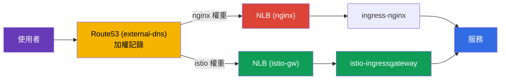
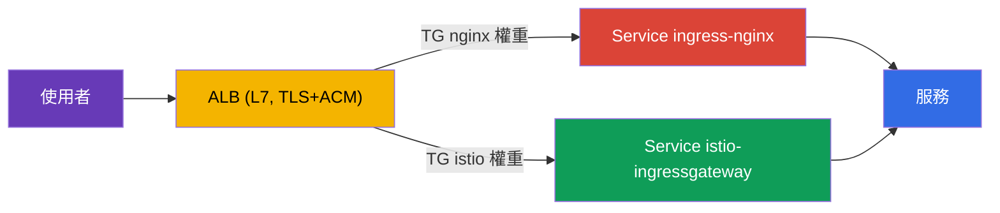

[Русская версия](ru.md) · [Eng version](en.md) · [Versión en español](es.md) · [Version française](fr.md) · [Deutsche Version](de.md) · [ქართული ვერსია](ge.md) · [日本語版](jp.md)

# 第 26 章。在零停機時間下遷移生產環境：從 ingress-nginx 到 Istio

> **接下來做什麼。** 導入 Istio 時，最常見的實際任務之一，是將傳入流量從現有的
> ingress 控制器（通常為 ingress-nginx）遷移至 Istio Gateway。而且是在無法影響使用者的
> 正在運行的生產環境中完成。本章將說明這類遷移的方法論：平行運作、
> 同等性驗證、按權重切換、回滾，以及面向數百個服務的計畫。

## 26.1. 任務與前提

條件接近實戰：

- 服務 24/7 運行，**不能**讓使用者中斷（zero downtime）；
- 遷移在**低負載時段**進行；
- 服務**很多**（數百個）--無法一次完成遷移，需採取**分波**進行；
- 每一步都需要**快速回滾**。

主要難題並不是為 nginx 規則撰寫 Istio 等價物（這其實很簡單，見第 5 與第 11 章），而是要能**安全且可逆**地切換。

## 26.2. 核心原則：兩個 ingress 平行運行

零停機時間的關鍵概念是：**在遷移完成前不要移除 nginx**。
ingress-nginx 與 istio-ingressgateway **同時**運作，公網流量則在**外部負載平衡器 / DNS**
層級逐步且可逆地切換。



只要舊路徑仍在，回滾就很簡單：將權重切回 nginx。本章的規則是：
**先建立並驗證新路徑，再切換，最後才移除舊路徑。**

## 26.3. 單一服務的逐步計畫

每個主機／服務的流程相同：

1. **在 Istio 中建立等價物。** `Gateway` + `VirtualService`--精確複製 nginx 的規則：
   主機、路徑、標頭、逾時、rewrite。
2. **切換前進行同等性驗證。** Istio-gateway 已平行運行；向它傳送測試流量，並針對每條規則
   與 nginx 比較行為。使用者仍然經由 nginx 存取。
3. **（可選）鏡像。** 透過 `VirtualService.mirror`（第 6 章）將部分生產流量複製到新路徑--
   在不影響使用者的情況下，以真實負載驗證。
4. **在低負載時段切換。** 在外部 LB 平滑調整權重：
   `nginx 100 / istio 0` → `90/10` → `50/50` → `0/100`。每個步驟之間查看指標。
5. **觀察期（soak）。** 將 100% 流量保留在 Istio 數小時／數天，觀察錯誤與
   延遲。**不要動** nginx 設定--它是熱備援。
6. 此服務的 **nginx 退役**--僅在觀察期成功後進行。

例如，在 nginx 中需要使用註解建立獨立 Ingress 的 header-canary，在
Istio 中會成為一個根據標頭的 `match` 區塊（第 6 章）--但遷移時仍應採取同樣謹慎的態度。

### 範例：Ingress → Gateway + VirtualService

以具體規則說明步驟 1。假設 nginx 中有典型的 `Ingress`：主機
`shop.example.com`、會裁切前綴的 `/api` 路徑、重新導向至 HTTPS，以及讀取逾時：

```yaml
apiVersion: networking.k8s.io/v1
kind: Ingress
metadata:
  name: shop
  namespace: shop
  annotations:
    nginx.ingress.kubernetes.io/rewrite-target: /$2
    nginx.ingress.kubernetes.io/ssl-redirect: "true"
    nginx.ingress.kubernetes.io/proxy-read-timeout: "30"
spec:
  ingressClassName: nginx
  tls:
  - hosts: [shop.example.com]
    secretName: shop-tls                 # 應用程式 namespace 中的 secret
  rules:
  - host: shop.example.com
    http:
      paths:
      - path: /api(/|$)(.*)
        pathType: ImplementationSpecific
        backend:
          service:
            name: api
            port: {number: 8080}
```

精確的 Istio 等價物包含兩個資源：`Gateway`（ingress 要監聽什麼）與
`VirtualService`（路由到哪裡及如何路由）：

```yaml
apiVersion: networking.istio.io/v1
kind: Gateway
metadata:
  name: shop-gw
  namespace: shop
spec:
  selector:
    istio: ingressgateway                # 繫結至哪個 ingress gateway
  servers:
  - port: {number: 443, name: https, protocol: HTTPS}
    hosts: ["shop.example.com"]
    tls:
      mode: SIMPLE
      credentialName: shop-tls           # 注意：secret 會在 gateway 的 namespace 中尋找
  - port: {number: 80, name: http, protocol: HTTP}
    hosts: ["shop.example.com"]
    tls:
      httpsRedirect: true                # = ssl-redirect: "true"
---
apiVersion: networking.istio.io/v1
kind: VirtualService
metadata:
  name: shop
  namespace: shop
spec:
  hosts: ["shop.example.com"]
  gateways: ["shop-gw"]
  http:
  - match:
    - uri:
        prefix: /api/                    # = path /api(/|$)(.*)
    rewrite:
      uri: /                             # = rewrite-target: /$2（移除前綴）
    route:
    - destination:
        host: api.shop.svc.cluster.local
        port: {number: 8080}
    timeout: 30s                         # = proxy-read-timeout: "30"
```

遷移時有一個不明顯但重要的細節：**TLS Secret 位於何處**。在 nginx 中，
`secretName` 取自應用程式的 namespace（`shop`）。在 Istio 中，`credentialName` 預設會在
**ingress-gateway 本身的 namespace**（通常是 `istio-system`）中查找。這是遷移後「憑證未載入」
的常見原因：必須將 Secret 複製到 gateway 的 namespace，或使用 `Gateway` 資源 namespace 中的
Secret 並採用對應設定。請在切換前確認此事。

## 26.4. 切換前的同等性驗證

這是安全遷移的核心：**在所有使用者仍經由 nginx 時**，完整驗證新路徑。檢查項目：

- **Istio 設定的健康狀態：** `istioctl analyze`、`istioctl proxy-status`（全部為
  `SYNCED`），ingress gateway 上可見路由（`istioctl proxy-config routes`）。
- **直接連線至 istio-gateway，繞過公網 LB。** 使用正確的 `Host` 直接向
  istio-ingressgateway 傳送請求（生產環境中使用 `curl --resolve`），不變更公網 DNS。
  使用者不受影響。
- **nginx 與 istio 的同等性矩陣。** 對兩個 ingress 執行相同請求集並比較：狀態碼、
  哪個服務回應、標頭、重新導向。任何差異都是**阻斷因素**：修正 VirtualService 後重試。
- **負載測試。** 將 `fortio`/`k6` 直接執行至 istio-gateway，並將 p95/p99 與錯誤率和
  nginx 進行比較。

在實務中，可透過 `curl --resolve` 直接連線至 istio-gateway 而繞過公網 DNS--
它代入正確的 `Host`，但將其解析為新負載平衡器的 IP，而不變更 Route53：

```bash
# NLB istio-gateway（公用 DNS 仍指向 nginx）
ISTIO_LB=$(kubectl -n istio-system get svc istio-ingressgateway \
  -o jsonpath='{.status.loadBalancer.ingress[0].hostname}')

# 同一個請求 - 直接走新路徑
curl -sk --resolve shop.example.com:443:$(dig +short $ISTIO_LB | head -1) \
  https://shop.example.com/api/health -o /dev/null -w "istio: %{http_code}\n"
```

最簡單的同等性矩陣是讓兩個 ingress 皆處理一組路徑並比較代碼：

```bash
NGINX_IP=$(dig +short nginx-nlb.example.com | head -1)
ISTIO_IP=$(dig +short $ISTIO_LB | head -1)
for p in / /api/health /api/v1/items /login /static/logo.png; do
  n=$(curl -sk --resolve shop.example.com:443:$NGINX_IP https://shop.example.com$p -o /dev/null -w '%{http_code}')
  i=$(curl -sk --resolve shop.example.com:443:$ISTIO_IP https://shop.example.com$p -o /dev/null -w '%{http_code}')
  [ "$n" = "$i" ] && s=OK || s=DIFF
  printf '%-20s nginx=%s istio=%s %s\n' "$p" "$n" "$i" "$s"
done
```

任何 `DIFF` 都是阻斷因素：修正 `VirtualService` 後重試。僅在**一切正常**時，才在 LB 上切換流量。

## 26.5. 使用什麼來切換流量：LB 權重，而非 DNS

切換機制會直接影響回滾速度。

| 機制 | 優點 | 對回滾的缺點 |
|----------|-------|-------------------|
| 外部 LB（ALB/NLB）的權重 | 即時、無快取；數秒內回滾 | 需要支援加權的 LB |
| 加權 DNS（例如 Route53） | 簡單 | 快取／TTL--回滾並非即時 |
| 每主機切換 | 按主機隔離風險 | 步驟更多 |

對於 24/7 的建議：透過**負載平衡器的權重**切換--如此回滾只需數秒。若只有 DNS 可用，請預先（一天前）
將 TTL 降至 30–60 秒，否則回滾會因客戶端 DNS 快取而「卡住」。

## 26.6. 範例：EKS、NLB、Route53、external-dns

以下以一個非常典型的堆疊說明遷移：

- **EKS** 叢集；
- 透過 Helm 安裝 **ingress-nginx**，其 Service 類型為 `LoadBalancer`，並建立 **NLB**；
- DNS 為 **Route53**，記錄由 **external-dns** 從 Ingress/Service 自動建立。

目前的運作方式：external-dns 偵測到 nginx，並在 Route53 建立
`shop.example.com` → NLB nginx 的記錄。使用者經由此 NLB 存取。



**步驟 1. 為 istio-ingressgateway 建立自己的 NLB。** 將 Istio gateway 的 Service 設為
LoadBalancer 類型並使用 AWS Load Balancer Controller 的 NLB 註解：

```yaml
# Service istio-ingressgateway（片段）
metadata:
  annotations:
    service.beta.kubernetes.io/aws-load-balancer-type: "external"
    service.beta.kubernetes.io/aws-load-balancer-nlb-target-type: "ip"
    service.beta.kubernetes.io/aws-load-balancer-scheme: "internet-facing"
spec:
  type: LoadBalancer
```

這會取得第二個獨立的 **NLB istio**，與 nginx 平行運作。目前這不影響使用者--Route53 仍指向 nginx。

**步驟 2. 建立 Gateway + VirtualService 並驗證同等性**（第 26.4 節）。透過 `curl --resolve`
直接將測試流量傳送到 NLB istio 的 DNS 名稱，不變更 Route53。

**步驟 3. 透過 Route53 加權記錄進行切換。** 此堆疊的特殊之處在於，既然記錄由 external-dns
管理，就不要在主控台手動切換，而是使用 external-dns 的**加權記錄**。在來源服務上設定權重註解：

```yaml
# istio-gw 與 nginx - 相同 hostname，不同的 set-identifier 與權重
external-dns.alpha.kubernetes.io/hostname: shop.example.com
external-dns.alpha.kubernetes.io/set-identifier: istio    # nginx 為：nginx
external-dns.alpha.kubernetes.io/aws-weight: "0"          # 由 0 改為 100
```

external-dns 會在 Route53 中為同一主機建立兩筆加權記錄，分別指向不同的 NLB。變更權重
（`nginx 100/istio 0` → `50/50` → `0/100`）即可平順地遷移流量。

**此堆疊特有的重要細節：**

- **這是 DNS 切換，不是 LB 權重。** 因此回滾**不是即時的**--會受到 resolver 快取與 TTL 的影響。
  如第 26.5 節所述：預先（一天前）將記錄 TTL 降至 30–60 秒。這裡不會有像共用 LB 般的即時
  回滾--請將此納入計畫。
- **external-dns 不應與您「對抗」。** 確認它已設定為處理加權記錄（`set-identifier` + `aws-weight`），
  並經由 TXT-registry 擁有此 zone，否則它可能覆寫您的權重。
- **在哪裡終止 TLS 必須是有意識的選擇。** 有兩種可行選項：
  - **在 NLB（TLS listener + ACM）。** 常見的生產選項：TLS 在負載平衡器終止，ACM 自動續期憑證，
    並將加密工作移出叢集。缺點是 Istio 看不到 SNI/TLS，第 9 章的 edge 功能（MUTUAL、依 SNI
    路由、入口 mTLS）無法使用。NLB → istio-gateway 為明文或再次加密。
  - **在 istio-gateway（NLB 採 TCP-passthrough 模式）。** Istio 自行管理憑證和 SNI，第 9 章所有
    edge 功能皆可用，但須在叢集中管理憑證。
  選擇方式：需要簡易 offload 與 ACM 自動續期時，在 NLB 終止；需要 Istio edge 功能
  （mTLS/SNI/細粒度 TLS 路由）時，passthrough 至 istio-gateway。
  也請檢查 health-check，必要時檢查 proxy protocol。
- **真實的用戶端 IP。** NLB 可以保留 source IP（target-type `ip`），若使用每 IP rate limiting
  （第 20 章）這很重要--否則 Istio 會看到 NLB 的位址。

**步驟 4. 觀察期與退役。** 將 100% 流量保留在 istio、觀察指標--之後才移除 nginx（先移除其
weighted 記錄，再移除 chart）。

### 使用 ALB 而非 NLB 的方案

這裡必須先釐清一個常見混淆。

**ingress-nginx 本身無法「建立 ALB」。** nginx 控制器是透過一般 Kubernetes `Service` 類型
`LoadBalancer` 發佈，而此類 Service 在 AWS 上會建立 **NLB**（或已過時的 Classic ELB），但**不是 ALB**。
無法將 nginx Service 的負載平衡器類別切換為 ALB--兩者是根本不同的機制。

**EKS 上的 ALB 是獨立建立的**--由 **AWS Load Balancer Controller** 供應，且不是由 Service，
而是由 `Ingress` 資源（`ingressClassName: alb`）或 `TargetGroupBinding` 供應。也就是說，ALB 是置於
入口控制器**之前**的獨立 L7 前端，而不是 nginx 本身的「模式」。因此，在這類架構中，通常預先建立
ALB（或讓同一控制器從獨立 Ingress 建立），再將 nginx 作為後端連接至它。

因此，典型的「ALB + nginx」架構有**兩層**：

- **ALB**（L7，TLS + ACM）接收外部流量並終止 HTTPS；
- 其後是連接至 ingress-nginx Service 的 target group（通常為 `NodePort`/`ClusterIP`
  + `TargetGroupBinding`），然後 nginx 執行更細緻的路徑／主機路由。

**這類架構如何遷移。** 既然 ALB 是獨立前端，切換就在**它上面**的兩個 target group 之間進行：
一個連接至 ingress-nginx Service，另一個連接至 istio-ingressgateway Service。權重透過 ALB `Ingress`
中的 weighted-actions（`alb.ingress.kubernetes.io/actions.*`），或透過 `TargetGroupBinding` 設定。變更
target group 權重，即可在 **ALB 上直接**將流量 `nginx → istio` 遷移。



主要優點是：target group 權重切換發生在 **ALB 本身**，而非透過 DNS，因此**回滾即時**--沒有
NLB+Route53 的 TTL 問題。這正是第 26.5 節「透過 LB 權重切換」的理想情況。

**在 ALB 後安裝 Istio 時要注意的事項。** istio-ingressgateway 應成為 ALB 的目標，
而非建立自己的公網負載平衡器：

- 將其 Service 設為 `NodePort` 或 `ClusterIP`（不需要自己的 NLB--ALB 即為前端），並透過
  `TargetGroupBinding` 或 ALB `Ingress` 連接至 target group；
- 將 ALB health-check 設定為 gateway 的 readiness 連接埠／路徑；
- 由於 ALB 已終止 TLS，到 istio-gateway 的流量是 HTTP（或重新加密）--設定 gateway 接受來自
  ALB 的 HTTP，而不是自有 TLS。

**注意事項：**

- **TLS 一律在 ALB 終止**（它是 L7，否則無法依 HTTP 路由）。
  這表示第 9 章的 Istio edge 功能（SNI 路由、MUTUAL、入口 mTLS）原則上無法使用。
  若需要它們，請使用 passthrough 模式的 NLB。
- **真實用戶端 IP 位於 `X-Forwarded-For`。** ALB 不在 L3 保留 source IP。
  若要進行每 IP rate limiting（第 20 章），設定 `numTrustedProxies`，以便 Istio 從 XFF 取得 IP。
- **external-dns 建立一筆指向 ALB 的記錄**--加權發生在 ALB target group 層級，而不是 DNS。

遷移比較的結論：**NLB** 較簡單且允許 passthrough（若需要 Istio edge 功能），但切換是透過 DNS，
回滾較慢。**ALB** 是入口前的獨立 L7 層，架構較複雜且一律終止 TLS，但可透過 target group 權重提供
即時且可逆的切換--這對 zero-downtime 非常有價值。

### Istio 前使用 ALB 或 NLB：完整比較

此選擇不僅在遷移時重要，也關係到在 EKS 安裝 Istio 時的一般決策（第 27 章）。以下匯總
istio-ingressgateway 前兩種負載平衡器的優缺點。

| 準則 | NLB (L4) | ALB (L7) |
|----------|----------|----------|
| 層級 | L4 (TCP/UDP/TLS) | L7 (HTTP/HTTPS/gRPC) |
| TLS | passthrough **或**終止（TLS listener + ACM） | 一律終止（ACM） |
| Istio edge 功能（SNI、MUTUAL、入口 mTLS） | 可用（passthrough 模式） | 不可用（ALB 解密 HTTPS） |
| 路由位置 | 全部在 Istio 中（單一事實來源） | 部分在 ALB（host/path），與 Istio 重複 |
| 非 HTTP 流量（TCP、任意流量） | 可以 | 不行，僅 HTTP/HTTPS/gRPC |
| 真實用戶端 IP | 保留 source IP（target-type `ip`） | 位於 `X-Forwarded-For` |
| LB 層級加權 | 無（透過 DNS 切換） | 有（加權 target group），即時回滾 |
| 與 AWS WAF / Cognito 整合 | 無 | 有 |
| 延遲／效能 | 延遲較低、throughput 較高 | overhead 略高（L7 處理） |
| 管理方式 | `Service` 註解 | `Ingress`/`TargetGroupBinding`（AWS LB Controller） |

**下列情況選擇 NLB：**

- 需要 Istio edge 功能：入口 mTLS、`MUTUAL`、依 SNI 路由、到 gateway 的端到端
  加密（passthrough）；
- 有**非 HTTP**流量經由 ingress（TCP、端到端 mTLS 的 gRPC、自訂協定）；
- 希望**所有**路由與 TLS 都在 Istio 中--單一事實來源，而不在 ALB 重複規則；
- 重視最低延遲與高 throughput。

**下列情況選擇 ALB：**

- 希望將 TLS offload 至 ACM，且不需要 Istio edge 功能；
- 需要與 **AWS WAF**、Cognito、ALB 層級的驗證整合；
- 想要在**負載平衡器層級**進行加權切換與 canary（遷移時即時回滾）；
- 組織已標準化使用 ALB 與 AWS LB Controller。

**實務指南。** 對「純」Istio 而言，通常選擇 **NLB**：它將所有 L7（路由、TLS、edge policy）
保留在 mesh 內，因此可使用所有 Istio 功能，且規則集中於一處。當組織依賴其生態系統
（WAF、ACM、Cognito），或需要 LB 層級的加權流量切換時，才選擇 **ALB**。權衡很簡單：ALB 接手部分工作
（TLS、WAF、權重），但也從 Istio 拿走部分 L7 控制權。

## 26.7. 回滾計畫

回滾應只需數秒至數分鐘，因為舊路徑尚未拆除：

1. 在外部 LB 將權重切回 nginx（`istio 0 / nginx 100`）。
2. 透過指標確認 5xx 與延遲已恢復正常。
3. 不需要恢復任何東西--nginx `Ingress` 全程未被修改。
4. 分析原因（通常是規則不相符），修正 `VirtualService`，再次進行同等性測試後重複切換。

正因為舊路徑仍然存在，遷移在每一步都維持低風險。

## 26.8. 以波次遷移 100+ 個服務

無法一次遷移全部--信心要以波次累積：

- **第 0 波（試點）：** 2–3 個低流量、非關鍵服務。切換後觀察數天。
  演練 runbook、儀表板與回滾程序。
- **第 1..N 波（主體）：** 每批 5–10 個服務，只有在前一批穩定完成觀察期後才進行下一批。
  流程可重複（Gateway/VirtualService 範本）。
- **最終波：** 最關鍵、負載最高的服務最後處理，採取最嚴密監控及已演練的回滾。

在各波次之間記錄指標（錯誤、p95/p99、事件）。任何退化都是下一波的阻斷因素。

## 26.9. 風險與緩解方式

| 風險 | 緩解方式 |
|------|-----------|
| 規則不相符（路徑／標頭／regex） | 切換前對每條規則進行同等性測試 |
| 路徑語義不同（`pathType`、rewrite） | 明確對映為 `uri.exact/prefix` + `rewrite.uri`，並測試 |
| nginx 與 Istio 的逾時／限制不同 | 在 VirtualService 明確設定 `timeout`/`retries` |
| Sticky sessions / affinity | `DestinationRule` `consistentHash`（依 cookie／標頭） |
| mTLS/injection 破壞服務間流量 | 遷移期間保留 `PeerAuthentication: PERMISSIVE` |
| WebSocket / gRPC / 大型標頭 | 明確測試；正確的 Service 連接埠名稱（第 10、23 章） |
| 回滾時 DNS 快取 | 使用 LB 權重切換；預先降低 TTL |
| cutover 當下沒有可觀測性 | 在切換**前**準備好儀表板與警示（5xx、p99） |

## 26.10. 自動轉換：ingress2gateway

不必手動重寫規則。工具 **ingress2gateway**
（kubernetes-sigs 專案）會讀取現有的 `Ingress` 及 provider 註解，並產生 Gateway API 資源：

```bash
ingress2gateway print --providers ingress-nginx -A
```

重要注意事項：

- 它輸出的是 **Gateway API**（`Gateway`/`HTTPRoute`），而非原生 Istio
  `Gateway`/`VirtualService`。Istio 實作了 Gateway API（第 11 章），因此請套用產生的設定並指定
  `gatewayClassName: istio`；
- **並非所有內容都能 1:1 轉換**：特定 nginx 註解（rewrite、canary-by-header、
  auth-url、自訂逾時）可能部分或完全無法遷移--其輸出是**草稿**；
- 因此切換前必須進行**審查與同等性測試**。

實務流程：`ingress2gateway print ... > gwapi.yaml` → 審查與修正 → 與 nginx 平行執行 `kubectl
apply` → 同等性驗證 → 在 LB 切換權重。

### 速查表：ingress-nginx 註解 → Istio

自動轉換最常在註解上「卡住」--許多 nginx 功能在 Istio 中由不同資源實作。以下是最常見項目的參考：

| ingress-nginx 註解 | Istio 等價物 |
|-------------------------|--------------------|
| `rewrite-target` | `VirtualService` → `http.rewrite.uri` |
| `ssl-redirect` / `force-ssl-redirect` | `Gateway` → server `tls.httpsRedirect: true` |
| `canary` + `canary-by-header` / `canary-weight` | `VirtualService` → `http.match.headers` 或加權 `route`（第 6 章） |
| `proxy-read-timeout` / `proxy-send-timeout` | `VirtualService` → `http.timeout` |
| `proxy-next-upstream*` / retries | `VirtualService` → `http.retries` |
| `limit-rps` / `limit-connections` | 透過 `EnvoyFilter` 的 local rate limit（第 20 章） |
| `auth-url` / `auth-signin`（外部驗證） | `AuthorizationPolicy` `CUSTOM` + ext_authz（第 15 章） |
| `whitelist-source-range` | `AuthorizationPolicy` `ipBlocks`/`remoteIpBlocks`（第 14 章） |
| `affinity: cookie`（sticky sessions） | `DestinationRule` → 依 cookie／標頭的 `consistentHash` |
| `backend-protocol: GRPC`/`HTTPS` | Service 連接埠名稱（`grpc-`，第 10 章）/ `DestinationRule` `tls` |
| `configuration-snippet` / `server-snippet` | `EnvoyFilter`（第 21 章）--手動遷移 |

規則很簡單：註解越「特殊」（snippet、自訂驗證、限制），自動轉換的可能性越低--這些規則應手動遷移並另外驗證同等性。

## 26.11. 本章總結

- 零停機遷移建立在 nginx 與 Istio **平行運行**的基礎上：在最後之前不移除舊路徑。
- 單一服務的流程：建立等價物 → 切換前同等性驗證 → （可選）鏡像 → 平順切換權重 → 觀察期 → nginx 退役。
- 同等性驗證（analyze、proxy-status、直接請求 istio-gateway、與 nginx 比較、負載測試）--在切換使用者前必不可少。
- 最好透過 **LB 權重**（即時回滾）而非 DNS（快取／TTL）切換；若使用 DNS，請預先降低 TTL。
- 回滾是數秒內將權重切回 nginx，因為舊路徑仍在。
- 100+ 個服務應**分波**遷移：試點 → 批次 → 關鍵服務最後處理。
- nginx-`Ingress` 規則會遷移為一組 `Gateway` + `VirtualService`（主機、路徑 `match`、
  `rewrite`、`timeout`、透過 `credentialName` 的 TLS）；常見陷阱是 TLS Secret 在 ingress-gateway 的
  namespace 中查找，而非應用程式 namespace。
- 許多 nginx 註解對應至其他 Istio 資源（rewrite/timeout → VirtualService、
  auth-url → ext_authz、limit-rps → rate limit、snippet → EnvoyFilter）--請參閱速查表。
- `ingress2gateway` 可加速遷移，但它提供的是草稿（Gateway API）--必須審查並進行同等性驗證。
- 在 EKS + NLB + Route53 + external-dns 堆疊上，流量是由 Route53 的 weighted 記錄
  （external-dns）切換，而非 LB 權重--因此回滾不是即時的：請預先降低 TTL。
  TLS 可在 NLB 終止（TLS listener + ACM，簡易 offload），或在 istio-gateway 終止
  （passthrough，若需要 Istio edge 功能）。採用 target-type `ip` 的 NLB 可保留真實 IP。
- 使用 **ALB** 時，切換透過負載平衡器本身的 target group 權重進行--回滾即時（無 DNS-TTL）。
  但 ALB 一律終止 TLS（Istio edge 功能不可用），真實 IP 取自 `X-Forwarded-For`（需要 `numTrustedProxies`）。

## 26.12. 自我檢查問題

1. 為什麼在遷移完全結束前不能移除 nginx？
2. 什麼是同等性驗證，為什麼要在切換使用者前進行？
3. 為什麼 24/7 系統使用 LB 權重而非 DNS 切換？
4. 回滾的樣子是什麼，以及為什麼只需要數秒？
5. 為什麼要分波遷移，以及服務應按什麼順序處理？
6. nginx-`Ingress` 規則（主機、路徑、rewrite、逾時、TLS）如何遷移至
   `Gateway` + `VirtualService`，TLS Secret 又應位於何處？
7. 如何直接在 istio-gateway 驗證新路徑的同等性，而不變更公網 DNS？
8. nginx 註解 `rewrite-target`、`auth-url`、`limit-rps` 與 `configuration-snippet`
   分別轉換為哪些 Istio 資源？
9. `ingress2gateway` 做什麼，為什麼它的輸出不能未經檢查就直接套用？
10. 在 EKS + NLB + Route53 + external-dns 堆疊上：如何切換流量、為什麼回滾並非即時，以及 TLS 在何處終止？
11. 使用 ALB 的遷移與 NLB 有何不同？為什麼 ALB 的回滾即時，而 Istio edge 功能不可用？
12. 何時在 Istio 前選擇 NLB，何時選擇 ALB？請列出各自的主要優缺點。

## 實作練習

演練 ingress-nginx 至 Istio Gateway 真實遷移的試點波：建立規則等價物、驗證同等性、
分析權重切換與回滾：

🧪 Lab 31：[tasks/ica/labs/31](../../labs/31/README_TW.MD)

---
[目錄](../README_TW.md) · [第 25 章](../25/tw.md) · [第 27 章](../27/tw.md)