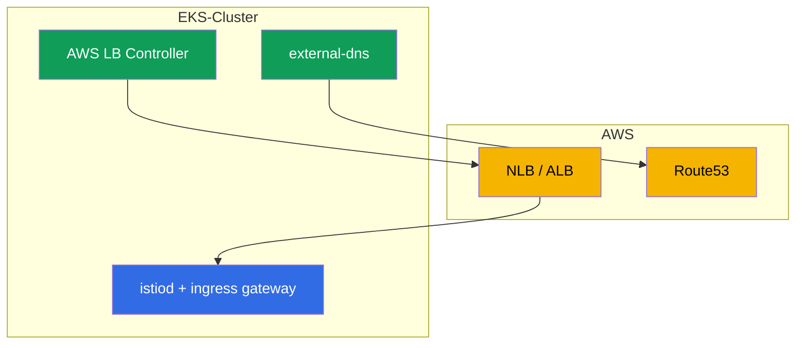

[RU version](ru.md) · [Eng version](en.md) · [Versión en español](es.md) · [Version française](fr.md)

# Kapitel 27. Istio auf EKS: Produktionsinstallation

> **Was kommt als Nächstes.** Bisher war die Installation von Istio (Kapitel 2-3) „im
> luftleeren Raum". Jetzt schauen wir uns die reale Produktion in der Cloud an - Amazon
> EKS. Hier lebt Istio nicht für sich allein, sondern im Verbund mit AWS-Services: Load
> Balancern, DNS, Zertifikaten, IAM. In diesem Kapitel tragen wir zusammen, was bei der
> Installation von Istio auf EKS zu beachten ist und wie man sie produktionsreif macht.

## 27.1. Was das Besondere an EKS ist

Istio selbst wird auf EKS mit denselben istioctl oder Helm installiert (Kapitel 2-3). Die
Unterschiede - in der Umgebung darum herum:

- **AWS Load Balancer.** Das Ingress Gateway wird über NLB oder ALB veröffentlicht
  (Kapitel 26).
- **DNS und Zertifikate.** Route53 + external-dns für die Einträge, ACM oder cert-manager
  für die Zertifikate.
- **IAM.** Komponenten, die die AWS API ansprechen, brauchen Rechte über IRSA.
- **VPC-CNI-Netzwerk.** Pods haben echte IPs aus dem VPC - das beeinflusst die Injektion
  und das CNI.
- **Multizonalität.** Nodes in mehreren AZ - Control Plane und Gateways müssen verteilt
  werden.



## 27.2. Voraussetzungen

Vor der Installation von Istio auf EKS sind üblicherweise schon vorhanden oder werden
installiert:

- **AWS Load Balancer Controller** - provisioniert NLB/ALB aus Service/Ingress. Ohne ihn
  bekommt das Ingress Gateway keinen normalen AWS Load Balancer.
- **external-dns** - erstellt Einträge in Route53 aus Cluster-Ressourcen (Kapitel 26).
- **cert-manager** (optional) - für Zertifikate (Ingress-TLS und/oder istio-csr,
  Kapitel 16).
- **Prometheus/Grafana** - eigener Stack oder managed (AMP/AMG), für Metriken (Kapitel 17).

Jeder dieser Controller, der die AWS API anspricht, braucht IAM-Rechte - über IRSA
(Abschnitt 27.5).

## 27.3. Installation von Istio auf EKS

Die Installation ist Standard (istioctl oder Helm mit Revisionen, Kapitel 2-3), aber mit
Blick auf die Produktion:

- **Profil `default`, nicht `demo`.** demo aktiviert überflüssige Komponenten und
  ausführliche Logs - für das Lernen, nicht für die Produktion.
- **Revisionen von Anfang an.** Installieren Sie mit Revisionen (Kapitel 3), damit
  zukünftige Updates per Canary ohne Downtime laufen.
- **Eigene CA im Voraus.** Wie in Kapitel 16 besprochen, sollte die PKI gleich zu Beginn
  angelegt werden (cert-manager + istio-csr), um später kein laufendes Mesh migrieren zu
  müssen.
- **Ressourcen und HA der Komponenten** legen Sie explizit über IstioOperator/Helm-Values
  fest (Abschnitt 27.6).

Fassen wir diese Entscheidungen in einem produktionsorientierten `IstioOperator` zusammen.
Er umfasst das Profil `default`, eine Revision, `istio-cni` (27.6), mehrere Replicas mit
HPA und PDB für istiod und Gateway (27.7) sowie NLB-Annotationen am Service des Gateways
(Kapitel 26):

```yaml
apiVersion: install.istio.io/v1alpha1
kind: IstioOperator
metadata:
  name: istio-prod
spec:
  profile: default                 # nicht demo
  revision: 1-24-0                 # Revisionen -> Canary-Updates ohne Downtime (Kapitel 3)
  components:
    cni:
      enabled: true                # istio-cni: NET_ADMIN von den Pods entfernen (27.6)
    pilot:
      k8s:
        replicaCount: 3
        resources:
          requests: {cpu: "500m", memory: 2Gi}
        hpaSpec:                   # Autoscaling von istiod unter Last
          minReplicas: 3
          maxReplicas: 6
        podDisruptionBudget:
          minAvailable: 1          # Node-Updates nehmen nicht alle Replicas auf einmal weg
    ingressGateways:
    - name: istio-ingressgateway
      enabled: true
      k8s:
        replicaCount: 3
        resources:
          requests: {cpu: "1", memory: 1Gi}
        hpaSpec:
          minReplicas: 3
          maxReplicas: 10
        podDisruptionBudget:
          minAvailable: 2
        serviceAnnotations:        # Veröffentlichung über NLB (AWS LB Controller, Kapitel 26)
          service.beta.kubernetes.io/aws-load-balancer-type: external
          service.beta.kubernetes.io/aws-load-balancer-nlb-target-type: ip
          service.beta.kubernetes.io/aws-load-balancer-scheme: internet-facing
```

Das ist der Ausgangspunkt: die konkreten Zahlen für Replicas und Ressourcen wählt man je
nach Cluster-Größe und Last. Die Verteilung über AZ wird separat hinzugefügt (Abschnitt
27.7).

## 27.4. Ingress Gateway und Load Balancer

Wie das Ingress Gateway veröffentlicht wird - eine Schlüsselentscheidung, und wir haben sie
in Kapitel 26 ausführlich behandelt:

- **NLB** (Service vom Typ LoadBalancer mit NLB-Annotationen) - wenn die Edge-Features von
  Istio (mTLS/SNI/MUTUAL) nötig sind, Nicht-HTTP-Traffic, das gesamte L7 innerhalb des
  Mesh.
- **ALB** (separater L7-Front über AWS LB Controller) - wenn TLS-Offload auf ACM,
  Integration mit WAF, Gewichtung auf LB-Ebene nötig ist.

Merken Sie sich hier einfach das Fazit aus Kapitel 26: für „reines" Istio nimmt man
häufiger NLB, ALB - wenn man an sein Ökosystem gebunden ist. Das Ingress Gateway selbst
wird in der Produktion in mehreren Replicas ausgerollt und über AZ verteilt (Abschnitt
27.7).

## 27.5. IRSA: AWS-Rechte für Komponenten

**IRSA** (IAM Roles for Service Accounts) - ein EKS-Mechanismus, der Pods eine IAM-Rolle
über ihren ServiceAccount zuweist, ohne Schlüssel zu speichern. Auf EKS ist das die
Standardmethode, um einer Komponente Zugriff auf die AWS API zu geben.

Wichtig: **istiod selbst und Envoy brauchen in der Regel kein IRSA** - sie sprechen die AWS
API nicht an. IRSA brauchen die umgebenden Controller:

- **AWS Load Balancer Controller** - NLB, ALB, Target-Gruppen erstellen/ändern.
- **external-dns** - Einträge in Route53 schreiben.
- **cert-manager** - für die DNS-01-Challenge in Route53 (wenn er öffentliche Zertifikate
  ausstellt).

Einzelne Istio-Integrationen können IRSA erfordern - zum Beispiel, wenn die CA-Schlüssel in
AWS KMS gespeichert werden. Aber bei der Basisinstallation werden die Rechte gerade von den
unterstützenden Controllern benötigt, nicht von Istio.

**Alternative zu IRSA - EKS Pod Identity.** IRSA arbeitet über einen OIDC-Provider, den man
auf Cluster-Ebene konfigurieren und ihm vertrauen muss. Der neuere Mechanismus **EKS Pod
Identity** macht dasselbe einfacher: es wird ein Agent installiert (EKS Pod Identity Agent),
und die Verbindung „ServiceAccount → IAM-Rolle" wird über eine Association in der EKS API
festgelegt, ohne OIDC-Trust-Gefummel pro Cluster und ohne Rollen-Annotationen am
ServiceAccount. Für neue Cluster ist Pod Identity meist bequemer; IRSA bleibt gültig und
weit verbreitet, besonders dort, wo es bereits eingerichtet ist. Funktional taugt für
unsere Controller (LB Controller, external-dns, cert-manager) jeder der beiden - wählen Sie
nach dem, was in Ihrer Infrastruktur üblich ist.

In der Praxis ist IRSA eine IAM-Rolle plus eine Annotation am `ServiceAccount` des
Controllers. Zum Beispiel für external-dns:

```yaml
apiVersion: v1
kind: ServiceAccount
metadata:
  name: external-dns
  namespace: kube-system
  annotations:
    # Rolle mit Policy auf route53:ChangeResourceRecordSets in der nötigen Zone
    eks.amazonaws.com/role-arn: arn:aws:iam::111122223333:role/external-dns
```

Ein Pod mit diesem SA erhält die temporären Credentials der Rolle automatisch (über
Projected-Token und STS) - ohne Schlüssel im Manifest. Dasselbe gilt für AWS LB Controller
und cert-manager, jedem - seine eigene Rolle mit der minimal notwendigen Policy.

Mit **EKS Pod Identity** ist die Annotation am SA nicht nötig - die Verbindung wird über
eine Association durch die EKS API festgelegt:

```bash
aws eks create-pod-identity-association \
  --cluster-name prod \
  --namespace kube-system \
  --service-account external-dns \
  --role-arn arn:aws:iam::111122223333:role/external-dns
```

### Control Plane auf Fargate

istiod ist ein gewöhnliches **stateless** Deployment, deshalb kann man es über ein
Fargate-Profil auf **Fargate** auslagern. Vorteile: keine Verwaltung von Nodes für die
Control Plane, Isolierung von den Workload-Nodes, exakte Größe pro Pod.

Wichtig: es geht um **istiod**, nicht um die Add-ons. Prometheus, Grafana, Jaeger, Kiali
sind schlechte Kandidaten für Fargate: sie sind ressourcenhungrig und vor allem
**stateful** (Prometheus hält die TSDB auf einem PVC). Fargate unterstützt keine EBS-Volumes
(nur EFS), und eine Prometheus-TSDB über EFS zu jagen ist eine schlechte Idee. Deshalb hält
man die Add-ons auf EC2 oder, noch besser, verwendet managed Services (Amazon Managed
Prometheus/Grafana). Auf Fargate lohnt es sich, gerade das stateless istiod auszulagern.

Aber auch mit istiod gibt es Vorbehalte, wegen derer man auf Fargate **nur die Control
Plane** auslagert, nicht die Data Plane:

- **Auf Fargate funktionieren keine DaemonSets.** Das bedeutet, `istio-cni` und `ztunnel`
  (ambient) kommen auf Fargate-Pods nicht hoch. Deshalb hält man Workloads mit Sidecars
  (erst recht ambient) auf **EC2-Nodes**, nicht auf Fargate.
- **Kaltstart und Skalierung.** Ein Fargate-Pod kommt langsamer hoch als ein gewöhnlicher,
  was die Skalierungsgeschwindigkeit von istiod bei einem Ansturm beeinflusst.
- **Netzwerk- und Ressourcenbeschränkungen** von Fargate (feste Ressourcenprofile, eigene
  Netzwerk-Eigenheiten) müssen berücksichtigt werden.

Der typische Kompromiss: **stateless istiod - auf Fargate** (keine Node-Verwaltung,
Isolierung), **Add-ons (Prometheus usw.) - auf EC2 oder managed** (sie brauchen PVC/EBS),
**Workloads mit Data Plane - auf EC2** (brauchen node-level Möglichkeiten). Wenn der gesamte
Cluster auf Fargate läuft - muss man sich mit den Beschränkungen bei istio-cni/ambient und
Storage abfinden.

## 27.6. Netzwerk, CNI und Ressourcen

- **VPC CNI.** Auf EKS bekommen Pods echte IPs aus dem VPC. Die Sidecar-Injektion und
  iptables (Kapitel 4) arbeiten damit, aber standardmäßig braucht der Init-Container in
  jedem Pod erhöhte Rechte (NET_ADMIN).
- **istio-cni.** Um nicht jedem Pod NET_ADMIN zu geben, aktiviert man in der Produktion das
  Plugin **istio-cni**: es konfiguriert iptables auf Node-Ebene (als Chained-Plugin über
  dem VPC CNI), und die Anwendungs-Pods brauchen keinen privilegierten Init-Container mehr.
  Auf EKS ist das eine empfohlene Sicherheitspraxis.
- **Ressourcen.** Legen Sie requests/limits für istiod und Sidecar explizit fest (Kapitel
  4). Bei einem großen Cluster vergessen Sie nicht die Scope-Optimierung (Kapitel 19),
  sonst fressen istiod und die Proxys viel Speicher.

## 27.7. HA und Zuverlässigkeit

Die Produktion erfordert, dass weder istiod noch das Ingress Gateway ein Single Point of
Failure sind:

- **Mehrere Replicas von istiod** + HPA nach Last. istiod hält die Konfiguration der Data
  Plane im Speicher, und seine Nichtverfügbarkeit stört das Aktualisieren der Konfiguration
  (obwohl laufende Proxys weiter mit der zuletzt erhaltenen arbeiten).
- **PodDisruptionBudget** für istiod und Gateways, damit Node-Updates nicht alle Replicas
  auf einmal wegnehmen.
- **Verteilung über Zonen (AZ).** Verteilen Sie die Replicas von istiod und Ingress Gateway
  über verschiedene AZ (topologySpreadConstraints), damit ein Zonenausfall nicht das Mesh
  umwirft.
- **Cross-Zone am Load Balancer - mit Blick auf die Kosten, und unterschiedlich bei NLB und
  ALB.** Cross-Zone Load Balancing gleicht den Traffic über die Gateways in allen Zonen
  aus, aber die Kosten des zonenübergreifenden Traffics werden bei den beiden LB-Typen
  unterschiedlich berechnet:
  - **NLB:** Cross-Zone ist **standardmäßig ausgeschaltet**, und bei Aktivierung
    **tarifiert AWS den zonenübergreifenden Traffic** - 0,01 $/GB in jede Richtung (sowohl
    Client→NLB als auch NLB→Target über AZ). Hier ist der Trade-off Gleichmäßigkeit gegen
    Traffic-Rechnung real.
  - **ALB:** Cross-Zone ist **immer eingeschaltet**, und der zonenübergreifende Traffic
    LB↔Targets **innerhalb eines VPC wird nicht** gesondert tarifiert (AWS legt diese
    Kosten nicht auf den Kunden um).
  Wichtiger Vorbehalt: das betrifft den Traffic des Load Balancers selbst innerhalb des VPC.
  Zonenübergreifender Traffic **innerhalb des Mesh** (Pod↔Pod zwischen AZ) wird in jedem
  Fall tarifiert - verwenden Sie deshalb Locality-aware Load Balancing (Kapitel 7), damit
  Anfragen möglichst in ihrer eigenen Zone bleiben. Gestalten Sie generell so, dass es
  weniger zonenübergreifenden Traffic gibt: halten Sie interagierende Services in einer
  Zone, wo das gerechtfertigt ist.
- **Ausreichende Ressourcen (requests/limits) für das Ingress Gateway** unter echter Last -
  es ist der Eingangspunkt des gesamten Traffics, hier darf man nicht sparen.

Die Verteilung über AZ wird über `topologySpreadConstraints` nach dem Label
`topology.kubernetes.io/zone` festgelegt. Im `IstioOperator` mischt man sie über
`k8s.overlays` in das Deployment des Gateways (und istiod) ein:

```yaml
    ingressGateways:
    - name: istio-ingressgateway
      k8s:
        overlays:
        - kind: Deployment
          name: istio-ingressgateway
          patches:
          - path: spec.template.spec.topologySpreadConstraints
            value:
            - maxSkew: 1
              topologyKey: topology.kubernetes.io/zone   # gleichmäßig über die Zonen
              whenUnsatisfiable: DoNotSchedule
              labelSelector:
                matchLabels:
                  istio: ingressgateway
```

`maxSkew: 1` lässt den Scheduler die Replicas nicht in einer AZ sammeln, deshalb reißt ein
Zonenausfall nicht das ganze Gateway mit. Denselben Kniff wendet man auf istiod an
(`components.pilot`).

## 27.8. Produktions-Checkliste

Bevor Sie Istio auf EKS in die Produktion bringen, gleichen Sie ab:

- [ ] Profil `default`, Installation mit Revisionen (Bereitschaft für Canary-Updates).
- [ ] Eigene CA gleich angelegt (cert-manager + istio-csr), Rotation der Wurzel bedacht.
- [ ] AWS LB Controller und external-dns installiert, IRSA konfiguriert.
- [ ] Load Balancer (NLB/ALB) je nach Anforderungen gewählt und konfiguriert (Kapitel 26).
- [ ] istio-cni aktiviert (weniger Rechte bei den Pods).
- [ ] HA: mehrere Replicas von istiod und Gateways, PDB, Verteilung über AZ, Cross-Zone am
  LB.
- [ ] Observability: Prometheus/Grafana/Tracing, Alerts auf die goldenen Signale und istiod
  (Kapitel 17-18).
- [ ] Scope optimiert für die Cluster-Größe (Kapitel 19).
- [ ] mTLS: Migrationsplan PERMISSIVE → STRICT (Kapitel 13).
- [ ] Update (Canary) und Rollback einprobiert.

## 27.9. Zusammenfassung des Kapitels

- Auf EKS wird Istio standardmäßig installiert, lebt aber im Verbund mit AWS: Load
  Balancer, Route53, Zertifikate, IAM, VPC CNI, Multizonalität.
- Voraussetzungen: AWS LB Controller, external-dns, bei Bedarf cert-manager und Prometheus;
  sie brauchen Zugriff auf AWS über **IRSA**.
- istiod selbst braucht in der Regel kein IRSA - die Rechte werden von den umgebenden
  Controllern benötigt. Statt IRSA kann man das einfachere **EKS Pod Identity** verwenden.
- Auf **Fargate** lohnt es sich, nur das stateless istiod auszulagern; die Add-ons
  (Prometheus usw.) taugen dorthin nicht (brauchen PVC/EBS, viele Ressourcen), und die Data
  Plane (Sidecars, ambient) funktioniert auf Fargate nicht - dort gibt es keine DaemonSets
  (istio-cni, ztunnel).
- Das Ingress Gateway wird über NLB oder ALB veröffentlicht, je nach Wahl aus Kapitel 26.
- In der Produktion aktiviert man **istio-cni** (weniger Rechte bei den Pods unter VPC CNI).
- HA: mehrere Replicas von istiod und Gateways, PDB, Verteilung über AZ
  (`topologySpreadConstraints`). Cross-Zone am **NLB** ist kostenpflichtig
  (zonenübergreifender Traffic wird tarifiert), am **ALB** ist Cross-Zone immer eingeschaltet
  und der zonenübergreifende Traffic LB↔Targets innerhalb des VPC wird nicht tarifiert.
- Die Produktionskonfiguration lässt sich bequem in einem `IstioOperator` zusammenfassen
  (Profil, Revision, istio-cni, Replicas/HPA/PDB, LB-Annotationen); IRSA - das ist eine
  IAM-Rolle + Annotation am `ServiceAccount` (oder eine Association über EKS Pod Identity).
- Die Installation mit Revisionen und eigener CA legt man gleich an, um schmerzhafte
  Migrationen zu vermeiden.

## 27.10. Fragen zur Selbstüberprüfung

1. Was unterscheidet die Installation von Istio auf EKS von einem „vanilla" Cluster?
2. Wozu braucht man AWS Load Balancer Controller und external-dns?
3. Braucht istiod selbst IRSA? Wer braucht es und wozu? Wodurch ist EKS Pod Identity
   bequemer als IRSA?
4. Was ist istio-cni und warum aktiviert man es auf EKS?
5. Welche Maßnahmen sichern die HA von Control Plane und Ingress Gateway? Wie legt man die
   Verteilung über AZ fest?
6. Wodurch unterscheidet sich die Tarifierung des Cross-Zone-Traffics bei NLB und ALB?
7. Wie sieht ein Produktions-`IstioOperator` aus: welche Schlüsselfelder aktiviert man für
   die Produktion?
8. Wie gibt man einer Komponente AWS-Rechte über IRSA und wodurch unterscheidet sich das
   von EKS Pod Identity?
9. Was würden Sie nach der Produktions-Checkliste vor dem Start prüfen?
10. Kann man istiod auf Fargate auslagern? Warum belässt man die Data Plane dabei auf EC2?

## Praxis

Ein eigenes Lab zur Installation von Istio auf EKS ist **geplant** und soll abdecken:
Bereitstellung von EKS, AWS LB Controller und external-dns mit IRSA, Installation von Istio
mit Revisionen, Veröffentlichung des Ingress Gateways über NLB/ALB, istio-cni und die
Prüfung der HA.

🧪 Lab: **TODO (EKS)**.

---
[Inhaltsverzeichnis](../README_DE.md) · [Kapitel 26](../26/de.md) · [Kapitel 28](../28/de.md)
