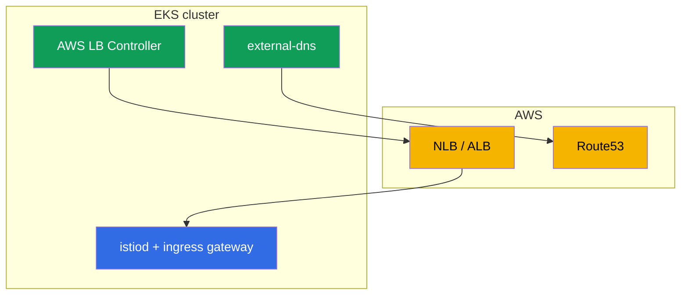

[RU version](ru.md) · [Versión en español](es.md) · [Version française](fr.md) · [Deutsche Version](de.md)

# Chapter 27. Istio on EKS: production install

> **What's next.** So far the installation of Istio (chapters 2-3) has been "in a vacuum". Now let
> us look at real production in the cloud - Amazon EKS. Here Istio does not live on its own but in
> tandem with AWS services: load balancers, DNS, certificates, IAM. In this chapter we gather what
> needs to be accounted for when installing Istio on EKS and how to make it production-ready.

## 27.1. What is special about EKS

Istio itself is installed on EKS with the same istioctl or Helm (chapters 2-3). The differences are
in the environment around it:

- **AWS load balancers.** The ingress gateway is exposed via an NLB or ALB (chapter 26).
- **DNS and certificates.** Route53 + external-dns for records, ACM or cert-manager for
  certificates.
- **IAM.** Components that call the AWS API need permissions via IRSA.
- **VPC CNI networking.** Pods have real IPs from the VPC - this affects injection and the CNI.
- **Multi-AZ.** Nodes in several AZs - the control plane and gateways need to be spread out.



## 27.2. Prerequisites

Before installing Istio on EKS the following are usually already there or installed:

- **AWS Load Balancer Controller** - provisions NLBs/ALBs from a Service/Ingress. Without it the
  ingress gateway will not get a proper AWS load balancer.
- **external-dns** - creates records in Route53 from cluster resources (chapter 26).
- **cert-manager** (optional) - for certificates (ingress TLS and/or istio-csr, chapter 16).
- **Prometheus/Grafana** - your own stack or managed (AMP/AMG), for metrics (chapter 17).

Each of these controllers that calls the AWS API needs IAM permissions - via IRSA (section 27.5).

## 27.3. Installing Istio on EKS

The installation is standard (istioctl or Helm with revisions, chapters 2-3), but with production in
mind:

- **The `default` profile, not `demo`.** demo enables extra components and verbose logs - for
  learning, not for production.
- **Revisions from the start.** Install with revisions (chapter 3) so that future upgrades go
  through canary without downtime.
- **A custom CA in advance.** As discussed in chapter 16, it is better to lay down the PKI right
  away (cert-manager + istio-csr) so as not to migrate a live mesh later.
- **Component resources and HA** - set explicitly via IstioOperator/Helm values (section 27.6).

Let us assemble these decisions into a single production-oriented `IstioOperator`. It enables the
`default` profile, a revision, `istio-cni` (27.6), several replicas with an HPA and a PDB for istiod
and the gateway (27.7), and the NLB annotations on the gateway's service (chapter 26):

```yaml
apiVersion: install.istio.io/v1alpha1
kind: IstioOperator
metadata:
  name: istio-prod
spec:
  profile: default                 # not demo
  revision: 1-24-0                 # revisions -> canary upgrades without downtime (chapter 3)
  components:
    cni:
      enabled: true                # istio-cni: remove NET_ADMIN from pods (27.6)
    pilot:
      k8s:
        replicaCount: 3
        resources:
          requests: {cpu: "500m", memory: 2Gi}
        hpaSpec:                   # autoscale istiod under load
          minReplicas: 3
          maxReplicas: 6
        podDisruptionBudget:
          minAvailable: 1          # node upgrades do not take out all replicas at once
    ingressGateways:
    - name: istio-ingressgateway
      enabled: true
      k8s:
        replicaCount: 3
        resources:
          requests: {cpu: "1", memory: 1Gi}
        hpaSpec:
          minReplicas: 3
          maxReplicas: 10
        podDisruptionBudget:
          minAvailable: 2
        serviceAnnotations:        # exposure via an NLB (AWS LB Controller, chapter 26)
          service.beta.kubernetes.io/aws-load-balancer-type: external
          service.beta.kubernetes.io/aws-load-balancer-nlb-target-type: ip
          service.beta.kubernetes.io/aws-load-balancer-scheme: internet-facing
```

This is a starting point: the concrete replica counts and resources are tuned to the cluster's size
and load. AZ spreading is added separately (section 27.7).

## 27.4. The ingress gateway and the load balancer

How to expose the ingress gateway is a key decision, and we covered it in detail in chapter 26:

- **NLB** (a Service of type LoadBalancer with NLB annotations) - if you need Istio's edge features
  (mTLS/SNI/MUTUAL), non-HTTP traffic, all of L7 inside the mesh.
- **ALB** (a separate L7 front via the AWS LB Controller) - if you need TLS offload to ACM, WAF
  integration, weighting at the LB level.

Here just remember the conclusion of chapter 26: for "pure" Istio an NLB is more often chosen, an
ALB - when you are tied to its ecosystem. The ingress gateway itself is deployed in several replicas
in production and spread across AZs (section 27.7).

## 27.5. IRSA: AWS permissions for the components

**IRSA** (IAM Roles for Service Accounts) is an EKS mechanism that grants pods an IAM role via their
ServiceAccount, without storing keys. On EKS this is the standard way to give a component access to
the AWS API.

Important: **istiod and Envoy themselves usually do not need IRSA** - they do not call the AWS API.
IRSA is needed by the surrounding controllers:

- **AWS Load Balancer Controller** - to create/change NLBs, ALBs, target groups.
- **external-dns** - to write records into Route53.
- **cert-manager** - for the DNS-01 challenge in Route53 (if it issues public certificates).

Individual Istio integrations may require IRSA - for example, if the CA keys are stored in AWS KMS.
But in a base installation the permissions are needed precisely by the supporting controllers, not
by Istio.

**The alternative to IRSA is EKS Pod Identity.** IRSA works through an OIDC provider that needs to be
configured and trusted at the cluster level. The newer **EKS Pod Identity** mechanism does the same
thing more simply: an agent is installed (the EKS Pod Identity Agent), and the "ServiceAccount → IAM
role" link is set via an association in the EKS API, without fiddling with OIDC trust for each
cluster and without a role annotation on the ServiceAccount. For new clusters Pod Identity is usually
more convenient; IRSA remains valid and widely used, especially where it is already set up.
Functionally, for our controllers (LB Controller, external-dns, cert-manager) either of the two
works - choose by what is customary in your infrastructure.

In practice IRSA is an IAM role plus an annotation on the controller's `ServiceAccount`. For example,
for external-dns:

```yaml
apiVersion: v1
kind: ServiceAccount
metadata:
  name: external-dns
  namespace: kube-system
  annotations:
    # a role with a policy for route53:ChangeResourceRecordSets in the right zone
    eks.amazonaws.com/role-arn: arn:aws:iam::111122223333:role/external-dns
```

A pod with this SA gets the role's temporary credentials automatically (via a projected token and
STS) - with no keys in the manifest. The same for the AWS LB Controller and cert-manager, each with
its own role with the minimum necessary policy.

With **EKS Pod Identity** the annotation on the SA is not needed - the link is set with an
association via the EKS API:

```bash
aws eks create-pod-identity-association \
  --cluster-name prod \
  --namespace kube-system \
  --service-account external-dns \
  --role-arn arn:aws:iam::111122223333:role/external-dns
```

### The control plane on Fargate

istiod is an ordinary **stateless** Deployment, so it can be moved onto **Fargate** via a Fargate
profile. The upsides: no need to manage nodes for the control plane, isolation from the workload
nodes, an exact size per pod.

Important: this is about **istiod**, not the addons. Prometheus, Grafana, Jaeger, Kiali are poor
candidates for Fargate: they are resource-hungry and, most importantly, **stateful** (Prometheus
stores its TSDB on a PVC). Fargate does not support EBS volumes (only EFS), and running Prometheus's
TSDB over EFS is a bad idea. So the addons are kept on EC2 or, better still, use managed services
(Amazon Managed Prometheus/Grafana). On Fargate it makes sense to move precisely the stateless
istiod.

But even with istiod there are caveats, which is why only the **control plane** is moved to Fargate,
not the data plane:

- **DaemonSets do not work on Fargate.** That means `istio-cni` and `ztunnel` (ambient) will not
  come up on Fargate pods. So workloads with sidecars (let alone ambient) are kept on **EC2 nodes**,
  not on Fargate.
- **Cold start and scaling.** A Fargate pod comes up more slowly than usual, which affects how fast
  istiod scales for a spike.
- **Fargate's network and resource limits** (fixed resource profiles, its own networking specifics)
  need to be accounted for.

The typical compromise: **stateless istiod - on Fargate** (no node management, isolation), **the
addons (Prometheus, etc.) - on EC2 or managed** (they need PVC/EBS), **workloads with the data plane
- on EC2** (they need node-level capabilities). If the whole cluster is on Fargate, you will have to
live with the istio-cni/ambient and storage limitations.

## 27.6. Networking, the CNI and resources

- **VPC CNI.** On EKS pods get real IPs from the VPC. Sidecar injection and iptables (chapter 4)
  work with this, but by default the init container requires elevated privileges (NET_ADMIN) in
  every pod.
- **istio-cni.** So as not to give every pod NET_ADMIN, in production the **istio-cni** plugin is
  enabled: it configures iptables at the node level (as a chained plugin on top of the VPC CNI), and
  application pods no longer need a privileged init container. On EKS this is the recommended
  security practice.
- **Resources.** Set requests/limits for istiod and the sidecar explicitly (chapter 4). On a large
  cluster do not forget scope optimization (chapter 19), otherwise istiod and the proxies will eat a
  lot of memory.

## 27.7. HA and reliability

Production requires that neither istiod nor the ingress gateway be a single point of failure:

- **Several istiod replicas** + an HPA by load. istiod holds the data plane configuration in memory,
  and its unavailability prevents updating the config (although the running proxies keep working on
  the last one received).
- **A PodDisruptionBudget** for istiod and the gateways, so that node upgrades do not take out all
  replicas at once.
- **Spreading across zones (AZ).** Distribute the istiod and ingress gateway replicas across
  different AZs (topologySpreadConstraints), so that the loss of a zone does not bring down the mesh.
- **Cross-zone at the load balancer - with an eye on cost, and different for NLB and ALB.**
  Cross-zone load balancing evens out the traffic across the gateways in all zones, but the cost of
  inter-AZ traffic is counted differently for the two LB types:
  - **NLB:** cross-zone is **disabled by default**, and when enabled AWS **charges for inter-AZ
    traffic** - $0.01/GB in each direction (both client→NLB and NLB→target across an AZ). Here the
    "evenness vs the traffic bill" trade-off is real.
  - **ALB:** cross-zone is **always enabled**, and inter-AZ traffic LB↔targets **within a single VPC
    is not charged** separately (AWS does not pass this cost on to the customer).
  An important caveat: this is about the load balancer's own traffic within the VPC. Inter-AZ traffic
  **inside the mesh** (pod↔pod across AZs) is charged in any case - so use locality-aware balancing
  (chapter 7) so that requests stay in their own zone where possible. In general, design so that
  there is less inter-AZ traffic: keep interacting services in one zone where it is justified.
- **Enough resources (requests/limits) for the ingress gateway** for the real load - it is the entry
  point for all traffic, you cannot skimp on it.

AZ spreading is set with `topologySpreadConstraints` by the `topology.kubernetes.io/zone` label. In
the `IstioOperator` they are mixed in via `k8s.overlays` to the gateway's Deployment (and istiod's):

```yaml
    ingressGateways:
    - name: istio-ingressgateway
      k8s:
        overlays:
        - kind: Deployment
          name: istio-ingressgateway
          patches:
          - path: spec.template.spec.topologySpreadConstraints
            value:
            - maxSkew: 1
              topologyKey: topology.kubernetes.io/zone   # evenly across zones
              whenUnsatisfiable: DoNotSchedule
              labelSelector:
                matchLabels:
                  istio: ingressgateway
```

`maxSkew: 1` keeps the scheduler from collecting the replicas in one AZ, so the loss of a zone does
not take out the whole gateway. The same technique is applied to istiod (`components.pilot`).

## 27.8. Production checklist

Before taking Istio on EKS to production, double-check:

- [ ] The `default` profile, installation with revisions (readiness for canary upgrades).
- [ ] A custom CA laid down from the start (cert-manager + istio-csr), root rotation thought through.
- [ ] AWS LB Controller and external-dns installed, IRSA configured.
- [ ] A load balancer chosen and configured (NLB/ALB) for the requirements (chapter 26).
- [ ] istio-cni enabled (fewer privileges for pods).
- [ ] HA: several istiod and gateway replicas, PDB, spreading across AZs, cross-zone on the LB.
- [ ] Observability: Prometheus/Grafana/tracing, alerts on the golden signals and istiod (chapters
  17-18).
- [ ] Scope optimized for the cluster's size (chapter 19).
- [ ] mTLS: a PERMISSIVE → STRICT migration plan (chapter 13).
- [ ] Upgrade (canary) and rollback rehearsed.

## 27.9. Chapter summary

- On EKS Istio is installed in the standard way, but lives in tandem with AWS: load balancers,
  Route53, certificates, IAM, VPC CNI, multi-AZ.
- Prerequisites: AWS LB Controller, external-dns, and if needed cert-manager and Prometheus; they
  need access to AWS via **IRSA**.
- istiod itself usually does not need IRSA - the permissions are required by the surrounding
  controllers. Instead of IRSA you can use the simpler **EKS Pod Identity**.
- On **Fargate** it makes sense to move only the stateless istiod; the addons (Prometheus, etc.) are
  not suitable there (they need PVC/EBS, a lot of resources), and the data plane (sidecars, ambient)
  does not work on Fargate - there are no DaemonSets there (istio-cni, ztunnel).
- The ingress gateway is exposed via an NLB or ALB per the choice from chapter 26.
- In production **istio-cni** is enabled (fewer privileges for pods with the VPC CNI).
- HA: several istiod and gateway replicas, PDB, spreading across AZs (`topologySpreadConstraints`).
  Cross-zone on an **NLB** is paid (inter-AZ traffic is charged), on an **ALB** cross-zone is always
  enabled and inter-AZ traffic LB↔targets within the VPC is not charged.
- The production configuration is conveniently assembled into a single `IstioOperator` (profile,
  revision, istio-cni, replicas/HPA/PDB, LB annotations); IRSA is an IAM role + an annotation on the
  `ServiceAccount` (or an association via EKS Pod Identity).
- Installation with revisions and a custom CA are laid down from the start to avoid painful
  migrations.

## 27.10. Self-check questions

1. What in installing Istio on EKS differs from a "vanilla" cluster?
2. Why are the AWS Load Balancer Controller and external-dns needed?
3. Does istiod itself need IRSA? Who needs it and why? How is EKS Pod Identity more convenient than
   IRSA?
4. What is istio-cni and why is it enabled on EKS?
5. What measures ensure HA of the control plane and the ingress gateway? How do you set AZ spreading?
6. How does the charging for cross-zone traffic differ between an NLB and an ALB?
7. What does a production `IstioOperator` look like: which key fields do you enable for production?
8. How do you give a component AWS permissions via IRSA and how does this differ from EKS Pod
   Identity?
9. What would you check against the production checklist before launch?
10. Can you move istiod onto Fargate? Why is the data plane kept on EC2 in that case?

## Practice

A separate lab on installing Istio on EKS is **planned** and should cover: deploying EKS, the AWS LB
Controller and external-dns with IRSA, installing Istio with revisions, exposing the ingress gateway
via an NLB/ALB, istio-cni and an HA check.

🧪 Lab: **TODO (EKS)**.

---
[Contents](../README.md) · [Chapter 26](../26/en.md) · [Chapter 28](../28/en.md)
