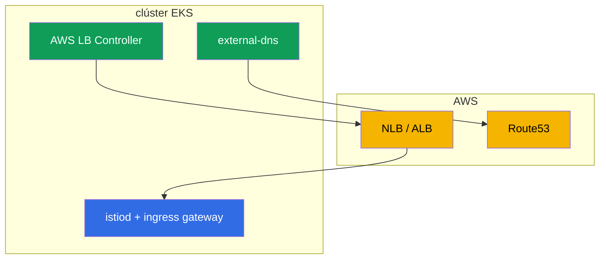

[RU version](ru.md) · [Eng version](en.md)

# Capítulo 27. Istio en EKS: instalación en producción

> **Qué sigue.** Hasta ahora la instalación de Istio (capítulos 2-3) ha sido "en el vacío". Ahora
> miremos la producción real en la nube - Amazon EKS. Aquí Istio no vive por su cuenta sino en tándem
> con los servicios de AWS: balanceadores de carga, DNS, certificados, IAM. En este capítulo
> reunimos lo que hay que tener en cuenta al instalar Istio en EKS y cómo hacerlo production-ready.

## 27.1. Qué tiene de especial EKS

Istio en sí se instala en EKS con el mismo istioctl o Helm (capítulos 2-3). Las diferencias están en
el entorno alrededor:

- **Balanceadores de carga de AWS.** El ingress gateway se expone vía un NLB o ALB (capítulo 26).
- **DNS y certificados.** Route53 + external-dns para los registros, ACM o cert-manager para los
  certificados.
- **IAM.** Los componentes que llaman a la API de AWS necesitan permisos vía IRSA.
- **Red VPC CNI.** Los pods tienen IPs reales de la VPC - esto afecta a la inyección y al CNI.
- **Multi-AZ.** Nodos en varias AZ - el control plane y los gateways hay que repartirlos.



## 27.2. Prerrequisitos

Antes de instalar Istio en EKS lo siguiente suele estar ya presente o instalado:

- **AWS Load Balancer Controller** - provisiona NLBs/ALBs desde un Service/Ingress. Sin él el ingress
  gateway no obtendrá un balanceador de carga de AWS adecuado.
- **external-dns** - crea registros en Route53 desde recursos del clúster (capítulo 26).
- **cert-manager** (opcional) - para certificados (TLS de ingress y/o istio-csr, capítulo 16).
- **Prometheus/Grafana** - tu propio stack o gestionado (AMP/AMG), para métricas (capítulo 17).

Cada uno de estos controladores que llama a la API de AWS necesita permisos IAM - vía IRSA (sección
27.5).

## 27.3. Instalar Istio en EKS

La instalación es estándar (istioctl o Helm con revisiones, capítulos 2-3), pero pensando en
producción:

- **El perfil `default`, no `demo`.** demo habilita componentes extra y logs verbosos - para
  aprender, no para producción.
- **Revisiones desde el principio.** Instala con revisiones (capítulo 3) para que las futuras
  actualizaciones vayan vía canary sin downtime.
- **Una CA personalizada de antemano.** Como se discutió en el capítulo 16, es mejor sentar la PKI de
  entrada (cert-manager + istio-csr) para no migrar una malla en vivo más tarde.
- **Recursos de los componentes y HA** - establécelos explícitamente vía IstioOperator/valores de
  Helm (sección 27.6).

Reunamos estas decisiones en un único `IstioOperator` orientado a producción. Habilita el perfil
`default`, una revisión, `istio-cni` (27.6), varias réplicas con un HPA y un PDB para istiod y el
gateway (27.7), y las anotaciones de NLB en el service del gateway (capítulo 26):

```yaml
apiVersion: install.istio.io/v1alpha1
kind: IstioOperator
metadata:
  name: istio-prod
spec:
  profile: default                 # no demo
  revision: 1-24-0                 # revisiones -> actualizaciones canary sin downtime (capítulo 3)
  components:
    cni:
      enabled: true                # istio-cni: quitar NET_ADMIN de los pods (27.6)
    pilot:
      k8s:
        replicaCount: 3
        resources:
          requests: {cpu: "500m", memory: 2Gi}
        hpaSpec:                   # autoescalar istiod bajo carga
          minReplicas: 3
          maxReplicas: 6
        podDisruptionBudget:
          minAvailable: 1          # las actualizaciones de nodo no tumban todas las réplicas a la vez
    ingressGateways:
    - name: istio-ingressgateway
      enabled: true
      k8s:
        replicaCount: 3
        resources:
          requests: {cpu: "1", memory: 1Gi}
        hpaSpec:
          minReplicas: 3
          maxReplicas: 10
        podDisruptionBudget:
          minAvailable: 2
        serviceAnnotations:        # exposición vía un NLB (AWS LB Controller, capítulo 26)
          service.beta.kubernetes.io/aws-load-balancer-type: external
          service.beta.kubernetes.io/aws-load-balancer-nlb-target-type: ip
          service.beta.kubernetes.io/aws-load-balancer-scheme: internet-facing
```

Este es un punto de partida: los conteos concretos de réplicas y los recursos se ajustan al tamaño y
la carga del clúster. El reparto por AZ se añade por separado (sección 27.7).

## 27.4. El ingress gateway y el balanceador de carga

Cómo exponer el ingress gateway es una decisión clave, y la cubrimos en detalle en el capítulo 26:

- **NLB** (un Service de tipo LoadBalancer con anotaciones de NLB) - si necesitas las funciones de
  borde de Istio (mTLS/SNI/MUTUAL), tráfico no-HTTP, todo el L7 dentro de la malla.
- **ALB** (un frente L7 separado vía el AWS LB Controller) - si necesitas offload de TLS a ACM,
  integración con WAF, ponderación al nivel del LB.

Aquí recuerda solo la conclusión del capítulo 26: para Istio "puro" se elige más a menudo un NLB, un
ALB - cuando estás atado a su ecosistema. El propio ingress gateway se despliega en varias réplicas
en producción y se reparte por AZ (sección 27.7).

## 27.5. IRSA: permisos de AWS para los componentes

**IRSA** (IAM Roles for Service Accounts) es un mecanismo de EKS que otorga a los pods un rol IAM vía
su ServiceAccount, sin almacenar claves. En EKS esta es la forma estándar de dar a un componente
acceso a la API de AWS.

Importante: **istiod y Envoy en sí normalmente no necesitan IRSA** - no llaman a la API de AWS. IRSA
lo necesitan los controladores del entorno:

- **AWS Load Balancer Controller** - para crear/cambiar NLBs, ALBs, target groups.
- **external-dns** - para escribir registros en Route53.
- **cert-manager** - para el reto DNS-01 en Route53 (si emite certificados públicos).

Integraciones individuales de Istio pueden requerir IRSA - por ejemplo, si las claves de la CA se
almacenan en AWS KMS. Pero en una instalación base los permisos los necesitan precisamente los
controladores de apoyo, no Istio.

**La alternativa a IRSA es EKS Pod Identity.** IRSA funciona a través de un proveedor OIDC que hay que
configurar y confiar a nivel de clúster. El mecanismo más nuevo **EKS Pod Identity** hace lo mismo de
forma más simple: se instala un agente (el EKS Pod Identity Agent), y el vínculo "ServiceAccount →
rol IAM" se establece vía una association en la API de EKS, sin trastear con la confianza OIDC para
cada clúster y sin una anotación de rol en el ServiceAccount. Para clústeres nuevos Pod Identity
suele ser más cómodo; IRSA sigue siendo válido y muy usado, especialmente donde ya está montado.
Funcionalmente, para nuestros controladores (LB Controller, external-dns, cert-manager) cualquiera de
los dos funciona - elige según lo que sea habitual en tu infraestructura.

En la práctica IRSA es un rol IAM más una anotación en el `ServiceAccount` del controlador. Por
ejemplo, para external-dns:

```yaml
apiVersion: v1
kind: ServiceAccount
metadata:
  name: external-dns
  namespace: kube-system
  annotations:
    # un rol con una política para route53:ChangeResourceRecordSets en la zona correcta
    eks.amazonaws.com/role-arn: arn:aws:iam::111122223333:role/external-dns
```

Un pod con este SA obtiene las credenciales temporales del rol automáticamente (vía un token
proyectado y STS) - sin claves en el manifiesto. Lo mismo para el AWS LB Controller y cert-manager,
cada uno con su propio rol con la política mínima necesaria.

Con **EKS Pod Identity** la anotación en el SA no es necesaria - el vínculo se establece con una
association vía la API de EKS:

```bash
aws eks create-pod-identity-association \
  --cluster-name prod \
  --namespace kube-system \
  --service-account external-dns \
  --role-arn arn:aws:iam::111122223333:role/external-dns
```

### El control plane en Fargate

istiod es un Deployment **stateless** ordinario, así que puede moverse a **Fargate** vía un perfil de
Fargate. Las ventajas: no hace falta gestionar nodos para el control plane, aislamiento de los nodos
de workload, un tamaño exacto por pod.

Importante: esto es sobre **istiod**, no sobre los addons. Prometheus, Grafana, Jaeger, Kiali son
malos candidatos para Fargate: son hambrientos de recursos y, lo más importante, **stateful**
(Prometheus almacena su TSDB en un PVC). Fargate no soporta volúmenes EBS (solo EFS), y correr la
TSDB de Prometheus sobre EFS es una mala idea. Así que los addons se mantienen en EC2 o, mejor aún,
se usan servicios gestionados (Amazon Managed Prometheus/Grafana). En Fargate tiene sentido mover
precisamente el istiod stateless.

Pero incluso con istiod hay advertencias, por eso solo el **control plane** se mueve a Fargate, no el
data plane:

- **Los DaemonSets no funcionan en Fargate.** Eso significa que `istio-cni` y `ztunnel` (ambient) no
  levantarán en pods de Fargate. Así que los workloads con sidecars (más aún ambient) se mantienen en
  **nodos EC2**, no en Fargate.
- **Arranque en frío y escalado.** Un pod de Fargate levanta más lento de lo normal, lo que afecta a
  la rapidez con que istiod escala ante un pico.
- **La red y los límites de recursos de Fargate** (perfiles de recursos fijos, sus propias
  particularidades de red) hay que tenerlos en cuenta.

El compromiso típico: **istiod stateless - en Fargate** (sin gestión de nodos, aislamiento), **los
addons (Prometheus, etc.) - en EC2 o gestionados** (necesitan PVC/EBS), **los workloads con el data
plane - en EC2** (necesitan capacidades a nivel de nodo). Si todo el clúster está en Fargate, tendrás
que vivir con las limitaciones de istio-cni/ambient y de almacenamiento.

## 27.6. Red, el CNI y recursos

- **VPC CNI.** En EKS los pods obtienen IPs reales de la VPC. La inyección de sidecar y las iptables
  (capítulo 4) funcionan con esto, pero por defecto el init container requiere privilegios elevados
  (NET_ADMIN) en cada pod.
- **istio-cni.** Para no dar a cada pod NET_ADMIN, en producción se habilita el plugin **istio-cni**:
  configura las iptables al nivel del nodo (como un plugin encadenado sobre el VPC CNI), y los pods
  de aplicación ya no necesitan un init container privilegiado. En EKS esta es la práctica de
  seguridad recomendada.
- **Recursos.** Establece requests/limits para istiod y el sidecar explícitamente (capítulo 4). En un
  clúster grande no olvides la optimización del scope (capítulo 19), de lo contrario istiod y los
  proxies comerán mucha memoria.

## 27.7. HA y fiabilidad

La producción requiere que ni istiod ni el ingress gateway sean un punto único de fallo:

- **Varias réplicas de istiod** + un HPA por carga. istiod mantiene la configuración del data plane
  en memoria, y su indisponibilidad impide actualizar la config (aunque los proxies en marcha siguen
  trabajando con la última recibida).
- **Un PodDisruptionBudget** para istiod y los gateways, para que las actualizaciones de nodo no
  tumben todas las réplicas a la vez.
- **Reparto entre zonas (AZ).** Distribuye las réplicas de istiod y del ingress gateway por distintas
  AZ (topologySpreadConstraints), para que la pérdida de una zona no derribe la malla.
- **Cross-zone en el balanceador de carga - con un ojo en el coste, y distinto para NLB y ALB.** El
  cross-zone load balancing iguala el tráfico entre los gateways en todas las zonas, pero el coste
  del tráfico inter-AZ se cuenta de forma distinta para los dos tipos de LB:
  - **NLB:** el cross-zone está **deshabilitado por defecto**, y al habilitarlo AWS **cobra por el
    tráfico inter-AZ** - $0.01/GB en cada dirección (tanto cliente→NLB como NLB→target a través de
    una AZ). Aquí el trade-off "uniformidad vs la factura de tráfico" es real.
  - **ALB:** el cross-zone está **siempre habilitado**, y el tráfico inter-AZ LB↔targets **dentro de
    una sola VPC no se cobra** por separado (AWS no le pasa este coste al cliente).
  Una advertencia importante: esto es sobre el propio tráfico del balanceador de carga dentro de la
  VPC. El tráfico inter-AZ **dentro de la malla** (pod↔pod a través de AZ) se cobra en cualquier caso
  - así que usa balanceo consciente de la localidad (capítulo 7) para que las peticiones se queden en
  su propia zona donde sea posible. En general, diseña para que haya menos tráfico inter-AZ: mantén
  los servicios que interactúan en una zona donde esté justificado.
- **Recursos suficientes (requests/limits) para el ingress gateway** para la carga real - es el punto
  de entrada de todo el tráfico, no puedes escatimar en él.

El reparto por AZ se establece con `topologySpreadConstraints` por la etiqueta
`topology.kubernetes.io/zone`. En el `IstioOperator` se mezclan vía `k8s.overlays` al Deployment del
gateway (y al de istiod):

```yaml
    ingressGateways:
    - name: istio-ingressgateway
      k8s:
        overlays:
        - kind: Deployment
          name: istio-ingressgateway
          patches:
          - path: spec.template.spec.topologySpreadConstraints
            value:
            - maxSkew: 1
              topologyKey: topology.kubernetes.io/zone   # de forma uniforme entre zonas
              whenUnsatisfiable: DoNotSchedule
              labelSelector:
                matchLabels:
                  istio: ingressgateway
```

`maxSkew: 1` evita que el scheduler acumule las réplicas en una AZ, de modo que la pérdida de una
zona no tumbe todo el gateway. La misma técnica se aplica a istiod (`components.pilot`).

## 27.8. Checklist de producción

Antes de llevar Istio en EKS a producción, comprueba dos veces:

- [ ] El perfil `default`, instalación con revisiones (preparación para actualizaciones canary).
- [ ] Una CA personalizada sentada desde el principio (cert-manager + istio-csr), rotación de raíz
  pensada.
- [ ] AWS LB Controller y external-dns instalados, IRSA configurado.
- [ ] Un balanceador de carga elegido y configurado (NLB/ALB) para los requisitos (capítulo 26).
- [ ] istio-cni habilitado (menos privilegios para los pods).
- [ ] HA: varias réplicas de istiod y gateway, PDB, reparto entre AZ, cross-zone en el LB.
- [ ] Observabilidad: Prometheus/Grafana/tracing, alertas sobre las golden signals e istiod
  (capítulos 17-18).
- [ ] Scope optimizado para el tamaño del clúster (capítulo 19).
- [ ] mTLS: un plan de migración PERMISSIVE → STRICT (capítulo 13).
- [ ] Actualización (canary) y rollback ensayados.

## 27.9. Resumen del capítulo

- En EKS Istio se instala de la forma estándar, pero vive en tándem con AWS: balanceadores de carga,
  Route53, certificados, IAM, VPC CNI, multi-AZ.
- Prerrequisitos: AWS LB Controller, external-dns, y si hace falta cert-manager y Prometheus;
  necesitan acceso a AWS vía **IRSA**.
- istiod en sí normalmente no necesita IRSA - los permisos los requieren los controladores del
  entorno. En vez de IRSA puedes usar el más simple **EKS Pod Identity**.
- En **Fargate** tiene sentido mover solo el istiod stateless; los addons (Prometheus, etc.) no son
  adecuados ahí (necesitan PVC/EBS, muchos recursos), y el data plane (sidecars, ambient) no funciona
  en Fargate - no hay DaemonSets allí (istio-cni, ztunnel).
- El ingress gateway se expone vía un NLB o ALB según la elección del capítulo 26.
- En producción se habilita **istio-cni** (menos privilegios para los pods con el VPC CNI).
- HA: varias réplicas de istiod y gateway, PDB, reparto entre AZ (`topologySpreadConstraints`). El
  cross-zone en un **NLB** es de pago (el tráfico inter-AZ se cobra), en un **ALB** el cross-zone
  está siempre habilitado y el tráfico inter-AZ LB↔targets dentro de la VPC no se cobra.
- La configuración de producción se reúne cómodamente en un único `IstioOperator` (perfil, revisión,
  istio-cni, réplicas/HPA/PDB, anotaciones de LB); IRSA es un rol IAM + una anotación en el
  `ServiceAccount` (o una association vía EKS Pod Identity).
- La instalación con revisiones y una CA personalizada se sientan desde el principio para evitar
  migraciones dolorosas.

## 27.10. Preguntas de autoevaluación

1. ¿Qué difiere en la instalación de Istio en EKS respecto a un clúster "vanilla"?
2. ¿Por qué son necesarios el AWS Load Balancer Controller y external-dns?
3. ¿Necesita istiod en sí IRSA? ¿Quién lo necesita y por qué? ¿En qué es EKS Pod Identity más cómodo
   que IRSA?
4. ¿Qué es istio-cni y por qué se habilita en EKS?
5. ¿Qué medidas garantizan la HA del control plane y del ingress gateway? ¿Cómo se establece el
   reparto por AZ?
6. ¿En qué se diferencia el cobro del tráfico cross-zone entre un NLB y un ALB?
7. ¿Cómo se ve un `IstioOperator` de producción: qué campos clave habilitas para producción?
8. ¿Cómo das a un componente permisos de AWS vía IRSA y en qué se diferencia esto de EKS Pod
   Identity?
9. ¿Qué comprobarías contra el checklist de producción antes del lanzamiento?
10. ¿Puedes mover istiod a Fargate? ¿Por qué el data plane se mantiene en EC2 en ese caso?

## Práctica

Un laboratorio aparte sobre instalar Istio en EKS está **planificado** y debería cubrir: desplegar
EKS, el AWS LB Controller y external-dns con IRSA, instalar Istio con revisiones, exponer el ingress
gateway vía un NLB/ALB, istio-cni y una comprobación de HA.

🧪 Laboratorio: **TODO (EKS)**.

---
[Índice](../README_ES.md) · [Capítulo 26](../26/es.md) · [Capítulo 28](../28/es.md)
