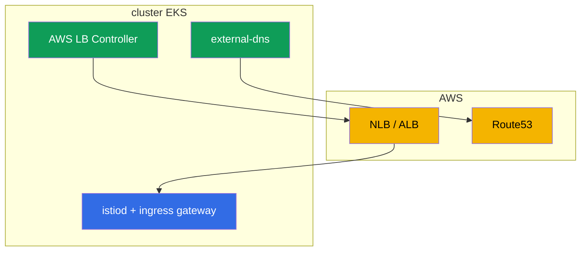

[RU version](ru.md) · [Eng version](en.md) · [Versión en español](es.md) · [Deutsche Version](de.md)

# Chapitre 27. Istio sur EKS : installation de production

> **La suite.** Jusqu'ici, l'installation d'Istio (chapitres 2-3) se faisait « dans le vide ».
> Maintenant, regardons de la vraie prod dans le cloud - Amazon EKS. Ici, Istio ne vit pas tout
> seul, mais en tandem avec les services AWS : répartiteurs de charge, DNS, certificats, IAM.
> Dans ce chapitre, nous rassemblons ce qu'il faut prendre en compte lors de l'installation
> d'Istio sur EKS et comment la rendre prête pour la production.

## 27.1. Ce qui est particulier sur EKS

Istio en lui-même s'installe sur EKS avec les mêmes istioctl ou Helm (chapitres 2-3). Les
différences sont dans l'environnement autour de lui :

- **Répartiteurs de charge AWS.** L'ingress gateway est publié via un NLB ou un ALB
  (chapitre 26).
- **DNS et certificats.** Route53 + external-dns pour les enregistrements, ACM ou cert-manager
  pour les certificats.
- **IAM.** Les composants qui appellent l'API AWS ont besoin de droits via IRSA.
- **Réseau VPC CNI.** Les pods ont des IP réelles du VPC - cela influe sur l'injection et le
  CNI.
- **Multi-zonalité.** Les nœuds dans plusieurs AZ - il faut répartir le control plane et les
  gateways.



## 27.2. Prérequis

Avant d'installer Istio sur EKS, on a généralement déjà, ou on installe :

- **AWS Load Balancer Controller** - provisionne les NLB/ALB à partir des Service/Ingress. Sans
  lui, l'ingress gateway n'obtiendra pas de répartiteur de charge AWS normal.
- **external-dns** - crée les enregistrements dans Route53 à partir des ressources du cluster
  (chapitre 26).
- **cert-manager** (optionnel) - pour les certificats (ingress TLS et/ou istio-csr,
  chapitre 16).
- **Prometheus/Grafana** - stack propre ou managée (AMP/AMG), pour les métriques (chapitre 17).

Chacun de ces contrôleurs qui appelle l'API AWS a besoin de droits IAM - via IRSA
(section 27.5).

## 27.3. Installation d'Istio sur EKS

L'installation est standard (istioctl ou Helm avec révisions, chapitres 2-3), mais avec une
visée production :

- **Profil `default`, pas `demo`.** demo active des composants superflus et des logs détaillés -
  c'est pour l'apprentissage, pas pour la prod.
- **Révisions dès le départ.** Installez avec des révisions (chapitre 3), pour que les futures
  mises à jour passent en canary sans interruption.
- **CA personnalisé à l'avance.** Comme discuté au chapitre 16, il vaut mieux poser la PKI dès
  le début (cert-manager + istio-csr), pour ne pas avoir à migrer un maillage vivant ensuite.
- **Ressources et HA des composants** à définir explicitement via IstioOperator/Helm-values
  (section 27.6).

Rassemblons ces décisions dans un seul `IstioOperator` orienté prod. Il active le profil
`default`, une révision, `istio-cni` (27.6), plusieurs répliques avec HPA et PDB pour istiod et
le gateway (27.7) et les annotations NLB sur le Service du gateway (chapitre 26) :

```yaml
apiVersion: install.istio.io/v1alpha1
kind: IstioOperator
metadata:
  name: istio-prod
spec:
  profile: default                 # pas demo
  revision: 1-24-0                 # révisions -> mises à jour canary sans interruption (chapitre 3)
  components:
    cni:
      enabled: true                # istio-cni : retirer NET_ADMIN aux pods (27.6)
    pilot:
      k8s:
        replicaCount: 3
        resources:
          requests: {cpu: "500m", memory: 2Gi}
        hpaSpec:                   # autoscale d'istiod sous charge
          minReplicas: 3
          maxReplicas: 6
        podDisruptionBudget:
          minAvailable: 1          # les mises à jour de nœuds ne sortent pas toutes les répliques d'un coup
    ingressGateways:
    - name: istio-ingressgateway
      enabled: true
      k8s:
        replicaCount: 3
        resources:
          requests: {cpu: "1", memory: 1Gi}
        hpaSpec:
          minReplicas: 3
          maxReplicas: 10
        podDisruptionBudget:
          minAvailable: 2
        serviceAnnotations:        # publication via NLB (AWS LB Controller, chapitre 26)
          service.beta.kubernetes.io/aws-load-balancer-type: external
          service.beta.kubernetes.io/aws-load-balancer-nlb-target-type: ip
          service.beta.kubernetes.io/aws-load-balancer-scheme: internet-facing
```

C'est un point de départ : les nombres concrets de répliques et de ressources se choisissent
selon la taille du cluster et la charge. La répartition par AZ s'ajoute séparément
(section 27.7).

## 27.4. Ingress gateway et répartiteur de charge

La façon de publier l'ingress gateway est une décision clé, et nous l'avons analysée en détail
au chapitre 26 :

- **NLB** (Service de type LoadBalancer avec annotations NLB) - si vous avez besoin des
  fonctionnalités edge d'Istio (mTLS/SNI/MUTUAL), de trafic non-HTTP, de tout le L7 à
  l'intérieur du maillage.
- **ALB** (front L7 distinct via AWS LB Controller) - si vous avez besoin d'un offload TLS sur
  ACM, d'une intégration avec WAF, d'une pondération au niveau du LB.

Retenez simplement la conclusion du chapitre 26 : pour de l'Istio « pur », on prend plus souvent
un NLB, l'ALB - quand on est lié à son écosystème. L'ingress gateway lui-même se déploie en prod
en plusieurs répliques et se répartit par AZ (section 27.7).

## 27.5. IRSA : droits AWS pour les composants

**IRSA** (IAM Roles for Service Accounts) est un mécanisme d'EKS qui attribue aux pods un rôle
IAM via leur ServiceAccount, sans stockage de clés. Sur EKS, c'est la façon standard de donner à
un composant l'accès à l'API AWS.

Important : **istiod et Envoy eux-mêmes n'ont généralement pas besoin d'IRSA** - ils n'appellent
pas l'API AWS. IRSA est nécessaire aux contrôleurs environnants :

- **AWS Load Balancer Controller** - créer/modifier les NLB, ALB, target groups.
- **external-dns** - écrire les enregistrements dans Route53.
- **cert-manager** - pour le challenge DNS-01 dans Route53 (s'il émet des certificats publics).

Certaines intégrations Istio spécifiques peuvent exiger IRSA - par exemple, si les clés du CA
sont stockées dans AWS KMS. Mais dans une installation de base, les droits sont nécessaires
justement aux contrôleurs de support, et non à Istio.

**Une alternative à IRSA - EKS Pod Identity.** IRSA fonctionne via un provider OIDC, qu'il faut
configurer et faire approuver au niveau du cluster. Un mécanisme plus récent, **EKS Pod
Identity**, fait la même chose plus simplement : on installe un agent (EKS Pod Identity Agent),
et le lien « ServiceAccount → rôle IAM » se définit via une association dans l'API EKS, sans se
battre avec le trust OIDC sur chaque cluster et sans annotation de rôle sur le ServiceAccount.
Pour les nouveaux clusters, Pod Identity est généralement plus pratique ; IRSA reste valable et
largement utilisé, surtout là où il est déjà configuré. Fonctionnellement, pour nos contrôleurs
(LB Controller, external-dns, cert-manager), l'un ou l'autre des deux convient - choisissez selon
ce qui est en usage dans votre infrastructure.

En pratique, IRSA c'est un rôle IAM plus une annotation sur le `ServiceAccount` du contrôleur.
Par exemple, pour external-dns :

```yaml
apiVersion: v1
kind: ServiceAccount
metadata:
  name: external-dns
  namespace: kube-system
  annotations:
    # rôle avec une politique sur route53:ChangeResourceRecordSets dans la zone voulue
    eks.amazonaws.com/role-arn: arn:aws:iam::111122223333:role/external-dns
```

Le pod avec ce SA obtiendra automatiquement les credentials temporaires du rôle (via un token
projeté et STS) - sans clés dans le manifeste. Idem pour l'AWS LB Controller et cert-manager,
chacun - son propre rôle avec la politique minimale nécessaire.

Avec **EKS Pod Identity**, l'annotation sur le SA n'est pas nécessaire - le lien se définit par
une association via l'API EKS :

```bash
aws eks create-pod-identity-association \
  --cluster-name prod \
  --namespace kube-system \
  --service-account external-dns \
  --role-arn arn:aws:iam::111122223333:role/external-dns
```

### Control plane sur Fargate

istiod est un Deployment **stateless** ordinaire, on peut donc le déporter sur **Fargate** via
un profil Fargate. Avantages : pas besoin de gérer des nœuds pour le control plane, isolation
des nœuds de workloads, taille exacte du pod. 

Important : c'est à propos d'**istiod**, et non des add-ons. Prometheus, Grafana, Jaeger, Kiali
sont de mauvais candidats pour Fargate : ils sont gourmands et, surtout, **stateful**
(Prometheus stocke sa TSDB sur un PVC). Fargate ne prend pas en charge les volumes EBS
(seulement EFS), et faire tourner la TSDB de Prometheus sur EFS est une mauvaise idée. C'est
pourquoi on garde les add-ons sur EC2 ou, mieux encore, on utilise des services managés (Amazon
Managed Prometheus/Grafana). Sur Fargate, il est pertinent de déporter justement l'istiod
stateless.

Mais même avec istiod il y a des réserves, à cause desquelles on ne déporte sur Fargate **que le
control plane**, et non le data plane :

- **Les DaemonSet ne fonctionnent pas sur Fargate.** Donc `istio-cni` et `ztunnel` (ambient) ne
  monteront pas sur des pods Fargate. C'est pourquoi on garde les workloads avec sidecars (a
  fortiori ambient) sur des **nœuds EC2**, et non sur Fargate.
- **Démarrage à froid et scaling.** Un pod Fargate met plus de temps qu'un pod ordinaire à
  monter, ce qui influe sur la vitesse de scaling d'istiod lors d'un pic.
- **Contraintes réseau et de ressources** de Fargate (profils de ressources fixes,
  particularités réseau propres) à prendre en compte.

Compromis typique : **istiod stateless - sur Fargate** (pas de gestion de nœuds, isolation), les
**add-ons (Prometheus, etc.) - sur EC2 ou managés** (ils ont besoin de PVC/EBS), les
**workloads avec data plane - sur EC2** (ils ont besoin de capacités au niveau du nœud). Si tout
le cluster est sur Fargate - il faudra composer avec les limitations liées à istio-cni/ambient et
au stockage.

## 27.6. Réseau, CNI et ressources

- **VPC CNI.** Sur EKS, les pods obtiennent des IP réelles du VPC. L'injection du sidecar et
  iptables (chapitre 4) fonctionnent avec ça, mais par défaut l'init-container exige des
  privilèges élevés (NET_ADMIN) dans chaque pod.
- **istio-cni.** Pour ne pas donner NET_ADMIN à chaque pod, on active en prod le plugin
  **istio-cni** : il configure iptables au niveau du nœud (en tant que plugin chaîné au-dessus du
  VPC CNI), et les pods applicatifs n'exigent plus d'init-container privilégié. Sur EKS, c'est
  une pratique recommandée pour la sécurité.
- **Ressources.** Définissez explicitement les requests/limits pour istiod et le sidecar
  (chapitre 4). Sur un grand cluster, n'oubliez pas l'optimisation du scope (chapitre 19), sinon
  istiod et les proxys consommeront beaucoup de mémoire.

## 27.7. HA et fiabilité

La production exige que ni istiod, ni l'ingress gateway ne soient un point de défaillance unique :

- **Plusieurs répliques d'istiod** + HPA selon la charge. istiod garde la configuration du data
  plane en mémoire, et son indisponibilité empêche de mettre à jour la config (même si les proxys
  en cours de fonctionnement continuent de tourner sur la dernière config reçue).
- **PodDisruptionBudget** pour istiod et les gateways, pour que les mises à jour de nœuds ne
  sortent pas toutes les répliques d'un coup.
- **Répartition par zones (AZ).** Répartissez les répliques d'istiod et de l'ingress gateway sur
  différentes AZ (topologySpreadConstraints), pour qu'une chute de zone ne fasse pas tomber le
  maillage.
- **Cross-zone du répartiteur de charge - à considérer au regard du coût, et différemment pour
  NLB et ALB.** Le cross-zone load balancing équilibre le trafic entre les gateways de toutes les
  zones, mais le coût du trafic inter-zone est calculé différemment pour les deux types de LB :
  - **NLB :** cross-zone **désactivé par défaut**, et à l'activation AWS **facture le trafic
    inter-zone** - 0,01 $/Go dans chaque sens (à la fois client→NLB et NLB→cible à travers les
    AZ). Ici, le compromis uniformité contre facture de trafic est réel.
  - **ALB :** cross-zone **toujours activé**, et le trafic inter-zone LB↔cibles **au sein d'un
    même VPC n'est pas facturé** séparément (AWS ne répercute pas ce coût sur le client).
  Réserve importante : c'est à propos du trafic du répartiteur de charge lui-même au sein du VPC.
  Le trafic inter-zone **à l'intérieur du maillage** (pod↔pod entre AZ) est facturé dans tous les
  cas - utilisez donc une répartition de charge locality-aware (chapitre 7) pour que les requêtes
  restent autant que possible dans leur zone. De manière générale, concevez de façon à minimiser
  le trafic inter-zone : gardez les services qui interagissent dans une même zone, là où c'est
  justifié.
- **Assez de ressources (requests/limits) pour l'ingress gateway** sous charge réelle - c'est le
  point d'entrée de tout le trafic, on ne peut pas lésiner dessus.

La répartition par AZ se définit par des `topologySpreadConstraints` sur le label
`topology.kubernetes.io/zone`. Dans l'`IstioOperator`, on les injecte via `k8s.overlays` sur le
déploiement du gateway (et d'istiod) :

```yaml
    ingressGateways:
    - name: istio-ingressgateway
      k8s:
        overlays:
        - kind: Deployment
          name: istio-ingressgateway
          patches:
          - path: spec.template.spec.topologySpreadConstraints
            value:
            - maxSkew: 1
              topologyKey: topology.kubernetes.io/zone   # uniformément par zones
              whenUnsatisfiable: DoNotSchedule
              labelSelector:
                matchLabels:
                  istio: ingressgateway
```

`maxSkew: 1` empêche le planificateur de regrouper les répliques dans une seule AZ, donc une
chute de zone n'emporte pas tout le gateway. On applique le même procédé à istiod
(`components.pilot`).

## 27.8. Checklist production

Avant de mettre Istio sur EKS en prod, vérifiez :

- [ ] Profil `default`, installation avec révisions (prêt pour les mises à jour canary).
- [ ] CA personnalisé posé dès le début (cert-manager + istio-csr), rotation de la racine
  réfléchie.
- [ ] AWS LB Controller et external-dns installés, IRSA configuré.
- [ ] Répartiteur de charge choisi et configuré (NLB/ALB) selon les besoins (chapitre 26).
- [ ] istio-cni activé (moins de privilèges pour les pods).
- [ ] HA : plusieurs répliques d'istiod et de gateways, PDB, répartition par AZ, cross-zone sur
  le LB.
- [ ] Observabilité : Prometheus/Grafana/tracing, alertes sur les signaux d'or et istiod
  (chapitres 17-18).
- [ ] Scope optimisé selon la taille du cluster (chapitre 19).
- [ ] mTLS : plan de migration PERMISSIVE → STRICT (chapitre 13).
- [ ] Mise à jour (canary) et rollback répétés.

## 27.9. Résumé du chapitre

- Sur EKS, Istio s'installe de manière standard, mais vit en tandem avec AWS : répartiteurs de
  charge, Route53, certificats, IAM, VPC CNI, multi-zonalité.
- Prérequis : AWS LB Controller, external-dns, au besoin cert-manager et Prometheus ; ils ont
  besoin d'un accès à AWS via **IRSA**.
- istiod lui-même n'a généralement pas besoin d'IRSA - les droits sont requis pour les
  contrôleurs environnants. À la place d'IRSA, on peut utiliser le plus simple **EKS Pod
  Identity**.
- Sur **Fargate**, il est pertinent de ne déporter que l'istiod stateless ; les add-ons
  (Prometheus, etc.) n'y conviennent pas (besoin de PVC/EBS, beaucoup de ressources), et le data
  plane (sidecars, ambient) ne fonctionne pas sur Fargate - il n'y a pas de DaemonSet (istio-cni,
  ztunnel).
- L'ingress gateway se publie via un NLB ou un ALB, selon le choix du chapitre 26.
- En prod, on active **istio-cni** (moins de privilèges pour les pods avec VPC CNI).
- HA : plusieurs répliques d'istiod et de gateways, PDB, répartition par AZ
  (`topologySpreadConstraints`). Le cross-zone du **NLB** est payant (le trafic inter-zone est
  facturé), celui de l'**ALB** est toujours activé et le trafic inter-zone LB↔cibles au sein du
  VPC n'est pas facturé.
- La configuration prod se rassemble commodément dans un seul `IstioOperator` (profil, révision,
  istio-cni, répliques/HPA/PDB, annotations LB) ; IRSA - c'est un rôle IAM + une annotation sur
  le `ServiceAccount` (ou une association via EKS Pod Identity).
- L'installation avec révisions et CA personnalisé se pose dès le début, pour éviter des
  migrations douloureuses.

## 27.10. Questions d'auto-évaluation

1. Qu'est-ce qui, dans l'installation d'Istio sur EKS, diffère d'un cluster « vanilla » ?
2. À quoi servent l'AWS Load Balancer Controller et external-dns ?
3. istiod lui-même a-t-il besoin d'IRSA ? Qui en a besoin et pourquoi ? En quoi EKS Pod Identity
   est-il plus pratique qu'IRSA ?
4. Qu'est-ce qu'istio-cni et pourquoi l'active-t-on sur EKS ?
5. Quelles mesures assurent la HA du control plane et de l'ingress gateway ? Comment définir la
   répartition par AZ ?
6. En quoi diffère la facturation du trafic cross-zone du NLB et de l'ALB ?
7. À quoi ressemble un `IstioOperator` prod : quels champs clés active-t-on pour la prod ?
8. Comment donne-t-on à un composant des droits AWS via IRSA et en quoi cela diffère-t-il d'EKS
   Pod Identity ?
9. Que vérifieriez-vous sur la checklist production avant le lancement ?
10. Peut-on déporter istiod sur Fargate ? Pourquoi laisse-t-on alors le data plane sur EC2 ?

## Pratique

Un lab dédié sur l'installation d'Istio sur EKS est **prévu** et devrait couvrir : le
déploiement d'EKS, de l'AWS LB Controller et d'external-dns avec IRSA, l'installation d'Istio
avec révisions, la publication de l'ingress gateway via NLB/ALB, istio-cni et la vérification de
la HA.

🧪 Lab : **TODO (EKS)**.

---
[Table des matières](../README_FR.md) · [Chapitre 26](../26/fr.md) · [Chapitre 28](../28/fr.md)
