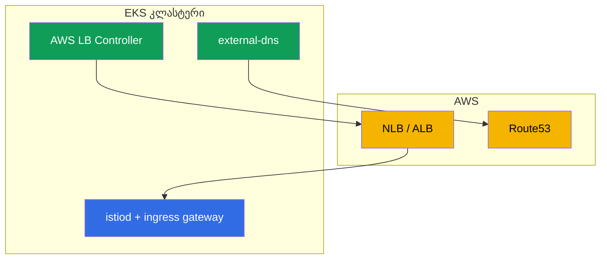

[Русская версия](ru.md) · [Eng version](en.md) · [Versión en español](es.md) · [Version française](fr.md) · [Deutsche Version](de.md) · [繁體中文版](tw.md) · [日本語版](jp.md)

# თავი 27. Istio EKS-ზე: პროდაქშენ-ინსტალაცია

> **რა არის შემდეგ.** აქამდე Istio-ს ინსტალაცია (თავები 2-3) „ვაკუუმში“ ხდებოდა. ახლა
> განვიხილოთ რეალური პროდაქშენი ღრუბელში - Amazon EKS. აქ Istio დამოუკიდებლად კი არ
> მუშაობს, არამედ AWS-ის სერვისებთან ერთად: დატვირთვის დამბალანსებლებთან, DNS-თან, სერტიფიკატებთან, IAM-თან. ამ
> თავში შევაჯამებთ, რა უნდა გავითვალისწინოთ Istio-ს EKS-ზე ინსტალაციისას და როგორ გავხადოთ ის
> პროდაქშენისთვის მზად.

## 27.1. რა არის განსაკუთრებული EKS-ში

თავად Istio EKS-ზე იმავე istioctl-ით ან Helm-ით ინსტალირდება (თავები 2-3). განსხვავება მის
გარშემო არსებულ გარემოშია:

- **AWS-ის დატვირთვის დამბალანსებლები.** Ingress gateway ქვეყნდება NLB-ის ან ALB-ის მეშვეობით (თავი 26).
- **DNS და სერტიფიკატები.** Route53 + external-dns ჩანაწერებისთვის, ACM ან cert-manager
  სერტიფიკატებისთვის.
- **IAM.** კომპონენტებს, რომლებიც AWS API-ს მიმართავენ, IRSA-ს მეშვეობით უფლებები სჭირდებათ.
- **VPC CNI ქსელი.** Pod-ებს VPC-იდან რეალური IP-ები აქვთ - ეს ინექციასა და CNI-ზე ახდენს გავლენას.
- **მრავალზონიანობა.** Node-ები რამდენიმე AZ-შია - control plane და gateway-ები ცალ-ცალკე უნდა განთავსდეს.



## 27.2. წინაპირობები

Istio-ს EKS-ზე ინსტალაციამდე, ჩვეულებრივ, უკვე არსებობს ან ინსტალირდება:

- **AWS Load Balancer Controller** - ქმნის NLB/ALB-ს Service/Ingress-იდან. მის გარეშე
  ingress gateway ვერ მიიღებს სრულფასოვან AWS-ის დატვირთვის დამბალანსებელს.
- **external-dns** - კლასტერის რესურსებიდან Route53-ში ჩანაწერებს ქმნის (თავი 26).
- **cert-manager** (არასავალდებულო) - სერტიფიკატებისთვის (ingress TLS და/ან istio-csr,
  თავი 16).
- **Prometheus/Grafana** - საკუთარი ან managed სტეკი (AMP/AMG), მეტრიკებისთვის (თავი 17).

თითოეულ ამ კონტროლერს, რომელიც AWS API-ს მიმართავს, IAM-ის უფლებები სჭირდება - IRSA-ს
მეშვეობით (განყოფილება 27.5).

## 27.3. Istio-ს ინსტალაცია EKS-ზე

ინსტალაცია სტანდარტულია (istioctl ან Helm რევიზიებით, თავები 2-3), თუმცა პროდაქშენზე ორიენტირებული:

- **პროფილი `default` და არა `demo`.** demo ზედმეტ კომპონენტებსა და დეტალურ ლოგებს რთავს -
  სწავლებისთვის და არა პროდაქშენისთვის.
- **რევიზიები თავიდანვე.** დააინსტალირეთ რევიზიებით (თავი 3), რათა მომავალში განახლებები
  canary-ს მეშვეობით, შეფერხების გარეშე განხორციელდეს.
- **მორგებული CA წინასწარ.** როგორც მე-16 თავში განვიხილეთ, PKI უმჯობესია თავიდანვე
  დაიგეგმოს (cert-manager + istio-csr), რათა მოგვიანებით მოქმედი mesh-ის მიგრაცია არ გახდეს საჭირო.
- **კომპონენტების რესურსები და HA** აშკარად განსაზღვრეთ IstioOperator/Helm-values-ის მეშვეობით (განყოფილება
  27.6).

ეს გადაწყვეტილებები გავაერთიანოთ ერთ პროდაქშენზე ორიენტირებულ `IstioOperator`-ში. ის მოიცავს
`default` პროფილს, რევიზიას, `istio-cni`-ს (27.6), რამდენიმე რეპლიკას HPA-ითა და PDB-ით istiod-ისა და gateway-სთვის
(27.7), ასევე NLB ანოტაციებს gateway-ს სერვისზე (თავი 26):

```yaml
apiVersion: install.istio.io/v1alpha1
kind: IstioOperator
metadata:
  name: istio-prod
spec:
  profile: default                 # არა demo
  revision: 1-24-0                 # რევიზიები -> canary-განახლებები დაუნთაიმის გარეშე (თავი 3)
  components:
    cni:
      enabled: true                # istio-cni: pod-ებს NET_ADMIN-ის მოცილება (27.6)
    pilot:
      k8s:
        replicaCount: 3
        resources:
          requests: {cpu: "500m", memory: 2Gi}
        hpaSpec:                   # istiod-ის ავტოსკეილი დატვირთვის მიხედვით
          minReplicas: 3
          maxReplicas: 6
        podDisruptionBudget:
          minAvailable: 1          # node-ების განახლება ერთდროულად ყველა replica-ს არ ხსნის
    ingressGateways:
    - name: istio-ingressgateway
      enabled: true
      k8s:
        replicaCount: 3
        resources:
          requests: {cpu: "1", memory: 1Gi}
        hpaSpec:
          minReplicas: 3
          maxReplicas: 10
        podDisruptionBudget:
          minAvailable: 2
        serviceAnnotations:        # პუბლიკაცია NLB-ის მეშვეობით (AWS LB Controller, თავი 26)
          service.beta.kubernetes.io/aws-load-balancer-type: external
          service.beta.kubernetes.io/aws-load-balancer-nlb-target-type: ip
          service.beta.kubernetes.io/aws-load-balancer-scheme: internet-facing
```

ეს საწყისი წერტილია: რეპლიკებისა და რესურსების კონკრეტული რაოდენობა კლასტერის ზომისა და
დატვირთვის მიხედვით შეირჩევა. AZ-ებს შორის განაწილება ცალკე ემატება (განყოფილება 27.7).

## 27.4. Ingress gateway და დატვირთვის დამბალანსებელი

როგორ გამოქვეყნდეს ingress gateway - საკვანძო გადაწყვეტილებაა და ის დეტალურად განვიხილეთ 26-ე თავში:

- **NLB** (LoadBalancer ტიპის Service NLB ანოტაციებით) - თუ საჭიროა Istio-ს edge-ფუნქციები
  (mTLS/SNI/MUTUAL), არა-HTTP ტრაფიკი და მთელი L7 mesh-ის შიგნით.
- **ALB** (ცალკე L7 ფრონტი AWS LB Controller-ის მეშვეობით) - თუ საჭიროა TLS offload ACM-ზე,
  WAF-თან ინტეგრაცია და LB-ის დონეზე წონების მინიჭება.

აქ უბრალოდ გახსოვდეთ 26-ე თავის დასკვნა: „სუფთა“ Istio-სთვის უფრო ხშირად NLB-ს ირჩევენ, ALB-ს კი მაშინ,
როდესაც მის ეკოსისტემაზე არიან დამოკიდებული. თავად ingress gateway პროდაქშენში რამდენიმე
რეპლიკით იშლება და AZ-ებს შორის ნაწილდება (განყოფილება 27.7).

## 27.5. IRSA: AWS-ის უფლებები კომპონენტებისთვის

**IRSA** (IAM Roles for Service Accounts) - EKS-ის მექანიზმია, რომელიც Pod-ებს IAM როლს
მათი ServiceAccount-ის მეშვეობით, გასაღებების შენახვის გარეშე ანიჭებს. EKS-ზე ეს
კომპონენტისთვის AWS API-ზე წვდომის მინიჭების სტანდარტული გზაა.

მნიშვნელოვანია: **თავად istiod-სა და Envoy-ს IRSA, ჩვეულებრივ, არ სჭირდებათ** - ისინი AWS API-ს არ
მიმართავენ. IRSA გარშემო არსებულ კონტროლერებს სჭირდებათ:

- **AWS Load Balancer Controller** - NLB, ALB და target group-ების შექმნა/შეცვლა.
- **external-dns** - Route53-ში ჩანაწერების ჩაწერა.
- **cert-manager** - Route53-ში DNS-01 challenge-ისთვის (თუ საჯარო
  სერტიფიკატებს გასცემს).

Istio-ს ცალკეულ ინტეგრაციებს შეიძლება IRSA დასჭირდეთ - მაგალითად, თუ CA გასაღებები AWS
KMS-ში ინახება. თუმცა საბაზისო ინსტალაციაში უფლებები სწორედ დამხმარე კონტროლერებს სჭირდებათ და არა Istio-ს.

**IRSA-ს ალტერნატივაა EKS Pod Identity.** IRSA მუშაობს OIDC პროვაიდერის მეშვეობით,
რომელიც კლასტერის დონეზე უნდა გამართოთ და სანდოდ გამოაცხადოთ. უფრო ახალი მექანიზმი - **EKS Pod Identity** -
იმავეს უფრო მარტივად აკეთებს: ინსტალირდება აგენტი (EKS Pod Identity Agent), ხოლო კავშირი „ServiceAccount
→ IAM როლი“ EKS API-ში association-ის მეშვეობით განისაზღვრება, ყოველ კლასტერზე OIDC trust-ის
გამართვისა და ServiceAccount-ზე როლის ანოტაციების გარეშე. ახალი კლასტერებისთვის Pod Identity, ჩვეულებრივ,
უფრო მოსახერხებელია; IRSA კვლავ მოქმედი და ფართოდ გამოყენებული ვარიანტია, განსაკუთრებით იქ, სადაც ის უკვე გამართულია.
ფუნქციურად ჩვენი კონტროლერებისთვის (LB Controller, external-dns, cert-manager) ორივე გამოდგება -
აირჩიეთ ის, რაც თქვენს ინფრასტრუქტურაშია მიღებული.

პრაქტიკაში IRSA არის IAM როლი და ანოტაცია კონტროლერის `ServiceAccount`-ზე. მაგალითად,
external-dns-ისთვის:

```yaml
apiVersion: v1
kind: ServiceAccount
metadata:
  name: external-dns
  namespace: kube-system
  annotations:
    # როლი route53:ChangeResourceRecordSets პოლიტიკით საჭირო ზონაში
    eks.amazonaws.com/role-arn: arn:aws:iam::111122223333:role/external-dns
```

ამ SA-ით Pod ავტომატურად მიიღებს როლის დროებით credentials-ს (projected token-ისა და STS-ის მეშვეობით) -
მანიფესტში გასაღებების გარეშე. იგივე ეხება AWS LB Controller-სა და cert-manager-ს; თითოეულს უნდა ჰქონდეს საკუთარი
როლი მინიმალურად აუცილებელი policy-ით.

**EKS Pod Identity**-ის შემთხვევაში SA-ზე ანოტაცია საჭირო არ არის - კავშირი EKS API-ის მეშვეობით association-ით განისაზღვრება:

```bash
aws eks create-pod-identity-association \
  --cluster-name prod \
  --namespace kube-system \
  --service-account external-dns \
  --role-arn arn:aws:iam::111122223333:role/external-dns
```

### Control plane Fargate-ზე

istiod ჩვეულებრივი **stateless** Deployment-ია, ამიტომ მისი **Fargate**-ზე გატანა
Fargate პროფილის მეშვეობით შეიძლება. უპირატესობები: control plane-ისთვის Node-ების მართვა საჭირო არ არის,
workload Node-ებისგან იზოლირებულია და Pod-ის ზომა ზუსტად განისაზღვრება.

მნიშვნელოვანია: საუბარია **istiod**-ზე და არა addon-ებზე. Prometheus, Grafana, Jaeger, Kiali - Fargate-ისთვის ცუდი
კანდიდატებია: ისინი ბევრ რესურსს მოიხმარენ და, რაც მთავარია, **stateful** არიან (Prometheus TSDB-ს
PVC-ზე ინახავს). Fargate-ს EBS volume-ების მხარდაჭერა არ აქვს (მხოლოდ EFS), ხოლო Prometheus-ის TSDB-ის EFS-ზე
გაშვება ცუდი იდეაა. ამიტომ addon-ებს EC2-ზე ათავსებენ ან, კიდევ უკეთესი, managed სერვისებს
(Amazon Managed Prometheus/Grafana) იყენებენ. Fargate-ზე სწორედ stateless istiod-ის გატანაა მიზანშეწონილი.

თუმცა istiod-საც აქვს შეზღუდვები, რომელთა გამოც Fargate-ზე **მხოლოდ control plane** გადააქვთ და
არა data plane:

- **Fargate-ზე DaemonSet არ მუშაობს.** ეს ნიშნავს, რომ `istio-cni` და `ztunnel` (ambient)
  Fargate Pod-ებზე არ გაეშვება. ამიტომ workload-ებს sidecar-ებით (მით უმეტეს ambient-ს)
  **EC2 Node-ებზე** ათავსებენ და არა Fargate-ზე.
- **ცივი გაშვება და მასშტაბირება.** Fargate Pod-ის გაშვებას ჩვეულებრივზე მეტი დრო სჭირდება, რაც
  დატვირთვის მკვეთრი ზრდისას istiod-ის მასშტაბირების სიჩქარეზე მოქმედებს.
- გასათვალისწინებელია Fargate-ის **ქსელური და რესურსული შეზღუდვები** (რესურსების ფიქსირებული
  პროფილები და ქსელის თავისებურებები).

ტიპური კომპრომისია: **stateless istiod - Fargate-ზე** (Node-ების მართვა საჭირო არ არის,
იზოლაცია), **addon-ები (Prometheus და ა.შ.) - EC2-ზე ან managed გარემოში** (მათ PVC/EBS სჭირდებათ),
**workload-ები data plane-ით - EC2-ზე** (საჭიროა Node-ის დონის შესაძლებლობები). თუ მთელი კლასტერი
Fargate-ზეა, istio-cni/ambient-ისა და storage-ის შეზღუდვებთან შეგუება მოგიწევთ.

## 27.6. ქსელი, CNI და რესურსები

- **VPC CNI.** EKS-ზე Pod-ები VPC-იდან რეალურ IP-ებს იღებენ. Sidecar-ის ინექცია და iptables
  (თავი 4) ამასთან მუშაობს, თუმცა ნაგულისხმევად init container-ს თითოეულ Pod-ში
  მომატებული პრივილეგიები (NET_ADMIN) სჭირდება.
- **istio-cni.** იმისათვის, რომ თითოეულ Pod-ს NET_ADMIN არ მივცეთ, პროდაქშენში რთავენ
  **istio-cni** plugin-ს: ის iptables-ს Node-ის დონეზე მართავს (როგორც chained plugin VPC
  CNI-ის ზედა ფენაში) და აპლიკაციების Pod-ებს პრივილეგირებული init container აღარ სჭირდებათ. EKS-ზე
  ეს უსაფრთხოების რეკომენდებული პრაქტიკაა.
- **რესურსები.** istiod-ისა და sidecar-ისთვის requests/limits აშკარად განსაზღვრეთ (თავი 4). დიდ
  კლასტერში scope-ის ოპტიმიზაცია არ დაგავიწყდეთ (თავი 19), წინააღმდეგ შემთხვევაში istiod და proxy-ები
  ბევრ მეხსიერებას მოიხმარენ.

## 27.7. HA და საიმედოობა

პროდაქშენი მოითხოვს, რომ არც istiod და არც ingress gateway არ იყოს მარცხის ერთადერთი წერტილი:

- **istiod-ის რამდენიმე რეპლიკა** + HPA დატვირთვის მიხედვით. istiod data plane-ის კონფიგურაციას
  მეხსიერებაში ინახავს და მისი მიუწვდომლობა კონფიგურაციის განახლებას ხელს უშლის (თუმცა მოქმედი proxy-ები
  ბოლო მიღებული კონფიგურაციით აგრძელებენ მუშაობას).
- **PodDisruptionBudget** istiod-ისა და gateway-ებისთვის, რათა Node-ების განახლებამ ყველა
  რეპლიკა ერთდროულად არ გათიშოს.
- **ზონებს (AZ) შორის განაწილება.** istiod-ისა და ingress gateway-ის რეპლიკები სხვადასხვა
  AZ-ში გაანაწილეთ (topologySpreadConstraints), რათა ერთი ზონის გათიშვამ mesh არ გათიშოს.
- **Cross-zone დატვირთვის დამბალანსებელზე - ღირებულების გათვალისწინებით და NLB-ისა და ALB-ისთვის განსხვავებულად.**
  Cross-zone load balancing ტრაფიკს ყველა ზონაში არსებულ gateway-ებს შორის თანაბრად ანაწილებს, თუმცა
  ზონათაშორისი ტრაფიკის ღირებულება ამ ორი ტიპის LB-სთვის განსხვავებულად ითვლება:
  - **NLB:** cross-zone **ნაგულისხმევად გამორთულია**, ხოლო ჩართვისას AWS **ზონათაშორის
    ტრაფიკს საფასურს აკისრებს** - $0.01/GB თითოეული მიმართულებით (როგორც client→NLB, ისე NLB→target
    AZ-ის გავლით). აქ თანაბარ განაწილებასა და ტრაფიკის ხარჯს შორის რეალური კომპრომისია.
  - **ALB:** cross-zone **ყოველთვის ჩართულია**, ხოლო LB↔target-ების ზონათაშორისი ტრაფიკი **ერთი
    VPC-ის ფარგლებში ცალკე არ იბეგრება** (AWS ამ ხარჯს კლიენტს არ აკისრებს).
  მნიშვნელოვანი შენიშვნა: ეს VPC-ის ფარგლებში თავად დატვირთვის დამბალანსებლის ტრაფიკს ეხება. ზონათაშორისი ტრაფიკი
  **mesh-ის შიგნით** (Pod↔Pod AZ-ებს შორის) ნებისმიერ შემთხვევაში ფასიანია - ამიტომ გამოიყენეთ
  locality-aware დაბალანსება (თავი 7), რათა მოთხოვნები შეძლებისდაგვარად საკუთარ ზონაში დარჩეს.
  ზოგადად, სისტემა ისე დააპროექტეთ, რომ ზონათაშორისი ტრაფიკი ნაკლები იყოს: ერთმანეთთან
  დაკავშირებული სერვისები ერთ ზონაში განათავსეთ, სადაც ეს გამართლებულია.
- რეალური დატვირთვისთვის **ingress gateway-ს საკმარისი რესურსები (requests/limits)** გამოუყავით -
  ეს მთელი ტრაფიკის შესასვლელი წერტილია და მასზე რესურსების დაზოგვა არ შეიძლება.

AZ-ებს შორის განაწილება `topologySpreadConstraints`-ით, `topology.kubernetes.io/zone` label-ის მიხედვით განისაზღვრება.
`IstioOperator`-ში მათ gateway-ის Deployment-ს (და istiod-ს) `k8s.overlays`-ის მეშვეობით ამატებენ:

```yaml
    ingressGateways:
    - name: istio-ingressgateway
      k8s:
        overlays:
        - kind: Deployment
          name: istio-ingressgateway
          patches:
          - path: spec.template.spec.topologySpreadConstraints
            value:
            - maxSkew: 1
              topologyKey: topology.kubernetes.io/zone   # თანაბრად ზონების მიხედვით
              whenUnsatisfiable: DoNotSchedule
              labelSelector:
                matchLabels:
                  istio: ingressgateway
```

`maxSkew: 1` scheduler-ს რეპლიკების ერთ AZ-ში თავმოყრის საშუალებას არ აძლევს, ამიტომ ერთი ზონის
გათიშვა მთელ gateway-ს არ თიშავს. იგივე მიდგომა გამოიყენება istiod-ისთვის (`components.pilot`).

## 27.8. პროდაქშენის საკონტროლო სია

Istio-ს EKS-ზე პროდაქშენში გაშვებამდე შეამოწმეთ:

- [ ] `default` პროფილი, ინსტალაცია რევიზიებით (canary განახლებებისთვის მზადყოფნა).
- [ ] მორგებული CA თავიდანვე გათვალისწინებულია (cert-manager + istio-csr), დაგეგმილია root-ის როტაცია.
- [ ] AWS LB Controller და external-dns ინსტალირებულია, IRSA გამართულია.
- [ ] მოთხოვნების შესაბამისად არჩეული და გამართულია დატვირთვის დამბალანსებელი (NLB/ALB) (თავი 26).
- [ ] istio-cni ჩართულია (Pod-ებს ნაკლები პრივილეგია აქვთ).
- [ ] HA: istiod-ისა და gateway-ების რამდენიმე რეპლიკა, PDB, AZ-ებს შორის განაწილება, cross-zone LB-ზე.
- [ ] Observability: Prometheus/Grafana/tracing, alert-ები golden signal-ებსა და istiod-ზე
  (თავები 17-18).
- [ ] Scope კლასტერის ზომის შესაბამისად ოპტიმიზებულია (თავი 19).
- [ ] mTLS: PERMISSIVE → STRICT მიგრაციის გეგმა (თავი 13).
- [ ] განახლება (canary) და rollback გამოცდილია.

## 27.9. თავის შეჯამება

- EKS-ზე Istio სტანდარტულად ინსტალირდება, თუმცა AWS-თან კავშირში მუშაობს: დატვირთვის დამბალანსებლები, Route53,
  სერტიფიკატები, IAM, VPC CNI და მრავალზონიანობა.
- წინაპირობები: AWS LB Controller, external-dns და, საჭიროების შემთხვევაში, cert-manager და
  Prometheus; მათ AWS-ზე წვდომა **IRSA**-ს მეშვეობით სჭირდებათ.
- თავად istiod-ს IRSA, ჩვეულებრივ, არ სჭირდება - უფლებები გარშემო არსებულ კონტროლერებს სჭირდებათ. IRSA-ს ნაცვლად
  უფრო მარტივი **EKS Pod Identity** შეიძლება გამოიყენოთ.
- **Fargate**-ზე მხოლოდ stateless istiod-ის გატანაა მიზანშეწონილი; addon-ები (Prometheus და ა.შ.)
  იქ არ გამოდგება (სჭირდებათ PVC/EBS და ბევრი რესურსი), ხოლო data plane (sidecar-ები, ambient)
  Fargate-ზე არ მუშაობს - იქ DaemonSet არ არის (istio-cni, ztunnel).
- Ingress gateway NLB-ის ან ALB-ის მეშვეობით ქვეყნდება, 26-ე თავში აღწერილი არჩევანის შესაბამისად.
- პროდაქშენში რთავენ **istio-cni**-ს (VPC CNI-ის გამოყენებისას Pod-ებს ნაკლები პრივილეგია სჭირდებათ).
- HA: istiod-ისა და gateway-ების რამდენიმე რეპლიკა, PDB, AZ-ებს შორის განაწილება (`topologySpreadConstraints`).
  Cross-zone **NLB**-ისთვის ფასიანია (ზონათაშორისი ტრაფიკი იბეგრება), **ALB**-ისთვის კი cross-zone
  ყოველთვის ჩართულია და LB↔target-ების ზონათაშორისი ტრაფიკი VPC-ის ფარგლებში არ იბეგრება.
- პროდაქშენის კონფიგურაცია მოსახერხებელია ერთ `IstioOperator`-ში გაერთიანდეს (პროფილი, რევიზია, istio-cni,
  რეპლიკები/HPA/PDB, LB ანოტაციები); IRSA არის IAM როლი + ანოტაცია `ServiceAccount`-ზე
  (ან association EKS Pod Identity-ის მეშვეობით).
- ინსტალაცია რევიზიებითა და მორგებული CA-ით თავიდანვე იგეგმება, რათა მტკივნეული
  მიგრაციები თავიდან ავიცილოთ.

## 27.10. თვითშემოწმების კითხვები

1. რით განსხვავდება Istio-ს EKS-ზე ინსტალაცია „ვანილურ“ კლასტერზე ინსტალაციისგან?
2. რისთვის არის საჭირო AWS Load Balancer Controller და external-dns?
3. სჭირდება თუ არა თავად istiod-ს IRSA? ვის და რისთვის სჭირდება ის? რით არის EKS Pod Identity IRSA-ზე მოსახერხებელი?
4. რა არის istio-cni და რატომ რთავენ მას EKS-ზე?
5. რა ზომები უზრუნველყოფს control plane-ისა და ingress gateway-ის HA-ს? როგორ განისაზღვრება AZ-ებს შორის განაწილება?
6. რით განსხვავდება NLB-ისა და ALB-ის cross-zone ტრაფიკის ტარიფიკაცია?
7. როგორ გამოიყურება პროდაქშენის `IstioOperator`: რომელ ძირითად ველებს რთავენ პროდაქშენისთვის?
8. როგორ ანიჭებენ კომპონენტს AWS-ის უფლებებს IRSA-ს მეშვეობით და რით განსხვავდება ეს EKS Pod Identity-ისგან?
9. რას შეამოწმებდით პროდაქშენის საკონტროლო სიაში გაშვებამდე?
10. შეიძლება თუ არა istiod-ის Fargate-ზე გატანა? რატომ ტოვებენ ამ დროს data plane-ს EC2-ზე?

## პრაქტიკა

Istio-ს EKS-ზე ინსტალაციის ცალკე ლაბორატორიული სამუშაო **დაგეგმილია** და უნდა მოიცავდეს: EKS-ის,
AWS LB Controller-ისა და external-dns-ის გაშლას IRSA-ით, Istio-ს ინსტალაციას რევიზიებით, ingress
gateway-ის გამოქვეყნებას NLB/ALB-ის მეშვეობით, istio-cni-ს და HA-ს შემოწმებას.

🧪 ლაბორატორია: **TODO (EKS)**.

---
[სარჩევი](../README_GE.md) · [თავი 26](../26/ge.md) · [თავი 28](../28/ge.md)
