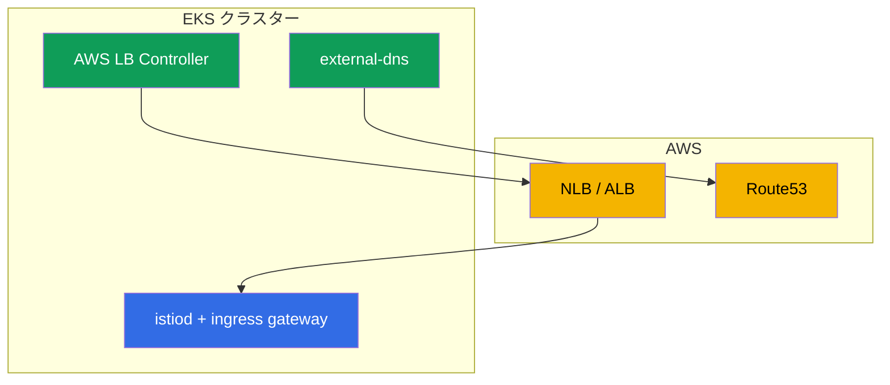

[Русская версия](ru.md) · [Eng version](en.md) · [Versión en español](es.md) · [Version française](fr.md) · [Deutsche Version](de.md) · [ქართული ვერსია](ge.md) · [繁體中文版](tw.md)

# 第27章. EKS 上の Istio: 本番環境へのインストール

> **次に進む前に。** これまで Istio のインストール（第2〜3章）は「真空状態」で扱ってきました。ここからは、実際のクラウド本番環境である Amazon EKS を見ていきます。ここで Istio は単独で動くのではなく、ロードバランサー、DNS、証明書、IAM といった AWS サービスと連携します。本章では、EKS に Istio をインストールする際に考慮すべき点と、本番運用に対応させる方法を整理します。

## 27.1. EKS の特別な点

EKS 上の Istio 自体は、同じ istioctl または Helm（第2〜3章）でインストールします。違いは、それを取り巻く環境にあります。

- **AWS ロードバランサー。** Ingress gateway は NLB または ALB 経由で公開されます（第26章）。
- **DNS と証明書。** レコードには Route53 + external-dns、証明書には ACM または cert-manager を使用します。
- **IAM。** AWS API にアクセスするコンポーネントには、IRSA による権限が必要です。
- **VPC CNI ネットワーク。** Pod には VPC の実 IP が割り当てられます。これはインジェクションと CNI に影響します。
- **マルチ AZ。** ノードは複数の AZ にまたがるため、control plane と gateway を分散させる必要があります。



## 27.2. 前提条件

EKS に Istio をインストールする前に、通常は以下がすでに存在するか、これからインストールされます。

- **AWS Load Balancer Controller** - Service/Ingress から NLB/ALB をプロビジョニングします。これがなければ ingress gateway は適切な AWS ロードバランサーを取得できません。
- **external-dns** - クラスターリソースから Route53 にレコードを作成します（第26章）。
- **cert-manager**（任意）- 証明書用（ingress TLS および/または istio-csr、第16章）。
- **Prometheus/Grafana** - メトリクス用の独自スタックまたはマネージドサービス（AMP/AMG）（第17章）。

AWS API にアクセスするこれらの各コントローラーには、IRSA 経由の IAM 権限が必要です（27.5節）。

## 27.3. EKS への Istio のインストール

インストールは標準的なものです（istioctl またはリビジョンを伴う Helm、第2〜3章）。ただし、本番環境を意識します。

- **`demo` ではなく `default` プロファイル。** demo は学習向けに余分なコンポーネントと詳細なログを有効にします。本番用ではありません。
- **最初からリビジョンを使用。** 将来のアップデートをダウンタイムなしで canary 経由にできるよう、リビジョン付きでインストールします（第3章）。
- **カスタム CA を事前に用意。** 第16章で説明したように、稼働中の mesh を後から移行しないで済むよう、PKI（cert-manager + istio-csr）を最初から組み込むのがよいでしょう。
- **コンポーネントのリソースと HA** は、IstioOperator/Helm-values（27.6節）で明示的に設定します。

これらの判断を、本番志向の `IstioOperator` にまとめます。これは `default` プロファイル、リビジョン、`istio-cni`（27.6節）、istiod と gateway の複数レプリカおよび HPA/PDB（27.7節）、gateway サービスの NLB アノテーション（第26章）を含みます。

```yaml
apiVersion: install.istio.io/v1alpha1
kind: IstioOperator
metadata:
  name: istio-prod
spec:
  profile: default                 # demo ではない
  revision: 1-24-0                 # リビジョン -> ダウンタイムなしの canary 更新 (第3章)
  components:
    cni:
      enabled: true                # istio-cni: Pod から NET_ADMIN を外す (27.6)
    pilot:
      k8s:
        replicaCount: 3
        resources:
          requests: {cpu: "500m", memory: 2Gi}
        hpaSpec:                   # 負荷に応じた istiod の自動スケール
          minReplicas: 3
          maxReplicas: 6
        podDisruptionBudget:
          minAvailable: 1          # ノード更新で全レプリカが一度に落ちないようにする
    ingressGateways:
    - name: istio-ingressgateway
      enabled: true
      k8s:
        replicaCount: 3
        resources:
          requests: {cpu: "1", memory: 1Gi}
        hpaSpec:
          minReplicas: 3
          maxReplicas: 10
        podDisruptionBudget:
          minAvailable: 2
        serviceAnnotations:        # NLB 経由の公開 (AWS LB Controller、第26章)
          service.beta.kubernetes.io/aws-load-balancer-type: external
          service.beta.kubernetes.io/aws-load-balancer-nlb-target-type: ip
          service.beta.kubernetes.io/aws-load-balancer-scheme: internet-facing
```

これは出発点です。具体的なレプリカ数とリソースは、クラスター規模と負荷に応じて選定します。AZ への分散は別途追加します（27.7節）。

## 27.4. Ingress gateway とロードバランサー

Ingress gateway の公開方法は重要な判断であり、第26章で詳しく扱いました。

- **NLB**（NLB アノテーションを持つ LoadBalancer 型 Service）- Istio のエッジ機能（mTLS/SNI/MUTUAL）、非 HTTP トラフィック、L7 をすべて mesh 内で処理する必要がある場合。
- **ALB**（AWS LB Controller を介した個別の L7 フロントエンド）- ACM での TLS オフロード、WAF との統合、LB レベルでの重み付けが必要な場合。

ここでは、第26章の結論を覚えておけば十分です。「純粋な」Istio では NLB を選ぶことが多く、ALB はそのエコシステムに依存する場合に使います。本番では ingress gateway 自体を複数レプリカでデプロイし、AZ に分散させます（27.7節）。

## 27.5. IRSA: コンポーネントの AWS 権限

**IRSA**（IAM Roles for Service Accounts）は、キーを保存せずに ServiceAccount 経由で Pod に IAM ロールを付与する EKS の仕組みです。EKS では、コンポーネントに AWS API へのアクセスを与える標準的な方法です。

重要なのは、**istiod と Envoy 自体には通常 IRSA は不要**だということです。これらは AWS API にアクセスしません。IRSA が必要なのは周辺のコントローラーです。

- **AWS Load Balancer Controller** - NLB、ALB、target group の作成・変更。
- **external-dns** - Route53 へのレコード書き込み。
- **cert-manager** - Route53 での DNS-01 challenge 用（公開証明書を発行する場合）。

個別の Istio 統合では IRSA が必要になる場合があります。たとえば CA キーを AWS KMS に保存する場合です。ただし、基本的なインストールで権限が必要なのは Istio ではなく、支援するコントローラーです。

**IRSA の代替手段は EKS Pod Identity です。** IRSA は OIDC プロバイダーを介して動作します。OIDC プロバイダーは設定し、クラスター単位で信頼する必要があります。より新しい仕組みである **EKS Pod Identity** は同じことをより簡単に実現します。エージェント（EKS Pod Identity Agent）をインストールし、「ServiceAccount → IAM ロール」の関連付けを EKS API の association として定義します。クラスターごとの OIDC trust の設定や、ServiceAccount へのロールアノテーションは不要です。新しいクラスターでは通常 Pod Identity のほうが便利です。IRSA も引き続き有効かつ広く使われており、特にすでに設定済みの環境で利用されます。機能面では、対象のコントローラー（LB Controller、external-dns、cert-manager）にはどちらでも使用できます。インフラで採用されている方式を選んでください。

実際には、IRSA は IAM ロールとコントローラーの `ServiceAccount` に付けるアノテーションで構成されます。たとえば external-dns では次のようになります。

```yaml
apiVersion: v1
kind: ServiceAccount
metadata:
  name: external-dns
  namespace: kube-system
  annotations:
    # 必要なゾーンでの route53:ChangeResourceRecordSets ポリシーを持つロール
    eks.amazonaws.com/role-arn: arn:aws:iam::111122223333:role/external-dns
```

この SA を持つ Pod は、マニフェスト内のキーなしに、ロールの一時的な認証情報を自動的に取得します（projected token と STS 経由）。AWS LB Controller と cert-manager も同様であり、それぞれに最小限必要なポリシーを持つ独自のロールを付与します。

**EKS Pod Identity** では SA へのアノテーションは不要です。関連付けは EKS API 経由で定義します。

```bash
aws eks create-pod-identity-association \
  --cluster-name prod \
  --namespace kube-system \
  --service-account external-dns \
  --role-arn arn:aws:iam::111122223333:role/external-dns
```

### Fargate 上の control plane

istiod は通常の **stateless** Deployment なので、Fargate profile を通じて **Fargate** に配置できます。利点は、control plane 用ノードの管理が不要になること、workload node から隔離されること、Pod 単位で正確なサイズ指定ができることです。

重要なのは、これはアドオンではなく **istiod** に関する話だという点です。Prometheus、Grafana、Jaeger、Kiali は Fargate の適切な候補ではありません。これらはリソース消費が大きく、さらに重要なことに **stateful** です（Prometheus は PVC に TSDB を保存します）。Fargate は EBS volume をサポートせず（EFS のみ）、Prometheus の TSDB を EFS 上で動かすのは良い考えではありません。そのため、アドオンは EC2 上に置くか、さらに良い方法として managed service（Amazon Managed Prometheus/Grafana）を利用します。Fargate には stateless な istiod を配置するのが適しています。

ただし istiod にも注意点があり、そのため Fargate に配置するのは **control plane のみ**で、data plane ではありません。

- **Fargate では DaemonSet が動作しません。** つまり、`istio-cni` と `ztunnel`（ambient）は Fargate Pod では起動しません。そのため、sidecar を持つ workload（ましてや ambient）は、Fargate ではなく **EC2 node** 上に置きます。
- **コールドスタートとスケーリング。** Fargate Pod は通常の Pod より起動に時間がかかるため、負荷急増時の istiod のスケーリング速度に影響します。
- **ネットワークおよびリソース制約。** Fargate の固定リソースプロファイルやネットワーク固有の制約を考慮する必要があります。

典型的な妥協案は、**stateless istiod は Fargate**（ノード管理不要、隔離）、**アドオン（Prometheus など）は EC2 または managed service**（PVC/EBS が必要）、**data plane を持つ workload は EC2**（node level の機能が必要）です。クラスター全体を Fargate にする場合は、istio-cni/ambient とストレージに関する制約を受け入れる必要があります。

## 27.6. ネットワーク、CNI、リソース

- **VPC CNI。** EKS では Pod に VPC の実 IP が割り当てられます。sidecar のインジェクションと iptables（第4章）はこれと連携しますが、デフォルトでは init container が各 Pod で昇格した権限（NET_ADMIN）を必要とします。
- **istio-cni。** 各 Pod に NET_ADMIN を与えないために、本番では **istio-cni** プラグインを有効にします。これは VPC CNI の上位に chained plugin として node level で iptables を設定するため、アプリケーション Pod には特権付き init container が不要になります。EKS では推奨されるセキュリティプラクティスです。
- **リソース。** istiod と sidecar の requests/limits を明示的に設定してください（第4章）。大規模クラスターでは、scope の最適化（第19章）を忘れないでください。そうしないと istiod と proxy が大量のメモリを消費します。

## 27.7. HA と信頼性

本番環境では、istiod も ingress gateway も単一障害点にならないことが求められます。

- **複数の istiod レプリカ** + 負荷に基づく HPA。istiod は data plane の設定をメモリに保持します。利用不能になると設定更新を妨げますが、稼働中の proxy は最後に受信した設定で動作を継続します。
- **istiod と gateway の PodDisruptionBudget**。node の更新で全レプリカが一度に失われることを防ぎます。
- **ゾーン（AZ）への分散。** istiod と ingress gateway のレプリカを別々の AZ（topologySpreadConstraints）に分散し、ゾーン障害で mesh が停止しないようにします。
- **ロードバランサーの Cross-zone はコストを考慮し、NLB と ALB の違いを理解して使用します。** Cross-zone load balancing は全ゾーンの gateway にトラフィックを均等化しますが、2 種類の LB ではゾーン間トラフィックの料金計算が異なります。
  - **NLB:** cross-zone は**デフォルトで無効**です。有効化すると AWS は**ゾーン間トラフィックを課金**します。各方向で $0.01/GB（client→NLB と、AZ をまたぐ NLB→target の両方）です。均等性とトラフィック料金のトレードオフは実際に存在します。
  - **ALB:** cross-zone は**常に有効**で、同一 VPC 内の LB↔target のゾーン間トラフィックは**別途課金されません**（AWS はこのコストを顧客に転嫁しません）。
  重要な注意点として、これは VPC 内のロードバランサー自体のトラフィックについてです。**mesh 内部**のゾーン間トラフィック（AZ をまたぐ Pod↔Pod）は、いずれにせよ課金されます。そのため、可能な限りリクエストを同じゾーンに留めるよう、locality-aware な load balancing（第7章）を使用してください。全般として、ゾーン間トラフィックを減らす設計にしてください。正当な場合には、相互に通信するサービスを同じゾーンに配置します。
- **実際の負荷に対応できる ingress gateway の十分なリソース（requests/limits）。** これはすべてのトラフィックの入口であり、ここで節約してはいけません。

AZ への分散は、ラベル `topology.kubernetes.io/zone` に対する `topologySpreadConstraints` で指定します。`IstioOperator` では、gateway（および istiod）の deployment に `k8s.overlays` 経由でこれらをマージします。

```yaml
    ingressGateways:
    - name: istio-ingressgateway
      k8s:
        overlays:
        - kind: Deployment
          name: istio-ingressgateway
          patches:
          - path: spec.template.spec.topologySpreadConstraints
            value:
            - maxSkew: 1
              topologyKey: topology.kubernetes.io/zone   # ゾーンに均等に配置
              whenUnsatisfiable: DoNotSchedule
              labelSelector:
                matchLabels:
                  istio: ingressgateway
```

`maxSkew: 1` により scheduler はレプリカを 1 つの AZ に集められないため、ゾーン障害で gateway 全体が失われることはありません。同じ手法を istiod（`components.pilot`）にも適用します。

## 27.8. 本番チェックリスト

EKS 上の Istio を本番導入する前に、以下を確認してください。

- [ ] `default` プロファイル、リビジョン付きインストール（canary update への準備）。
- [ ] カスタム CA を最初から導入（cert-manager + istio-csr）し、root rotation を計画済み。
- [ ] AWS LB Controller と external-dns をインストールし、IRSA を設定済み。
- [ ] 要件に応じてロードバランサー（NLB/ALB）を選択・設定済み（第26章）。
- [ ] istio-cni を有効化済み（Pod の権限を低減）。
- [ ] HA: 複数の istiod および gateway レプリカ、PDB、AZ 分散、LB の cross-zone。
- [ ] Observability: Prometheus/Grafana/tracing、golden signal と istiod に対する alert（第17〜18章）。
- [ ] クラスター規模に合わせて scope を最適化済み（第19章）。
- [ ] mTLS: PERMISSIVE → STRICT の移行計画（第13章）。
- [ ] update（canary）と rollback をリハーサル済み。

## 27.9. 章のまとめ

- EKS 上の Istio は標準的にインストールしますが、ロードバランサー、Route53、証明書、IAM、VPC CNI、マルチゾーンという AWS と連携して動作します。
- 前提条件は AWS LB Controller、external-dns、必要に応じて cert-manager と Prometheus です。これらには **IRSA** を通じた AWS へのアクセスが必要です。
- istiod 自体には通常 IRSA は不要で、権限が必要なのは周辺コントローラーです。IRSA の代わりに、より簡単な **EKS Pod Identity** を使用できます。
- **Fargate** に置く価値があるのは stateless な istiod だけです。アドオン（Prometheus など）は PVC/EBS と多くのリソースが必要なため適しません。また Fargate では DaemonSet（istio-cni、ztunnel）がないため、data plane（sidecar、ambient）は動作しません。
- Ingress gateway は第26章の選択に従って NLB または ALB 経由で公開します。
- 本番では **istio-cni** を有効にします（VPC CNI で Pod の権限を低減）。
- HA: 複数の istiod および gateway レプリカ、PDB、AZ 分散（`topologySpreadConstraints`）。**NLB** の cross-zone は有料（ゾーン間トラフィックに課金）です。**ALB** の cross-zone は常に有効で、VPC 内の LB↔target のゾーン間トラフィックは課金されません。
- 本番設定は、`IstioOperator`（プロファイル、リビジョン、istio-cni、レプリカ/HPA/PDB、LB アノテーション）1 つにまとめると便利です。IRSA は IAM ロール + `ServiceAccount` のアノテーション（または EKS Pod Identity 経由の association）です。
- 稼働後の痛みを伴う移行を避けるため、リビジョン付きインストールとカスタム CA を最初から導入します。

## 27.10. 理解度チェック

1. EKS 上の Istio インストールは、「素の」クラスターと何が異なりますか？
2. AWS Load Balancer Controller と external-dns はなぜ必要ですか？
3. istiod 自体に IRSA は必要ですか？ 誰に、なぜ必要ですか？ EKS Pod Identity は IRSA より何が便利ですか？
4. istio-cni とは何で、なぜ EKS で有効にするのですか？
5. control plane と ingress gateway の HA は、どのような対策で実現しますか？ AZ への分散はどう設定しますか？
6. NLB と ALB の cross-zone トラフィックの課金はどう異なりますか？
7. 本番用の `IstioOperator` はどのようなものですか？ 本番向けにはどの主要フィールドを含めますか？
8. コンポーネントに IRSA 経由で AWS 権限を与えるにはどうしますか？ EKS Pod Identity とは何が異なりますか？
9. 本番開始前に、本番チェックリストのどの項目を確認しますか？
10. istiod を Fargate に配置できますか？ その場合、なぜ data plane は EC2 に残すのですか？

## 演習

Istio を EKS にインストールする独立したラボは**計画中**です。EKS のデプロイ、IRSA を用いた AWS LB Controller と external-dns、リビジョン付き Istio インストール、NLB/ALB 経由での ingress gateway 公開、istio-cni、HA の検証を対象とする予定です。

🧪 ラボ: **TODO (EKS)**。

---
[目次](../README_JP.md) · [第26章](../26/jp.md) · [第28章](../28/jp.md)
