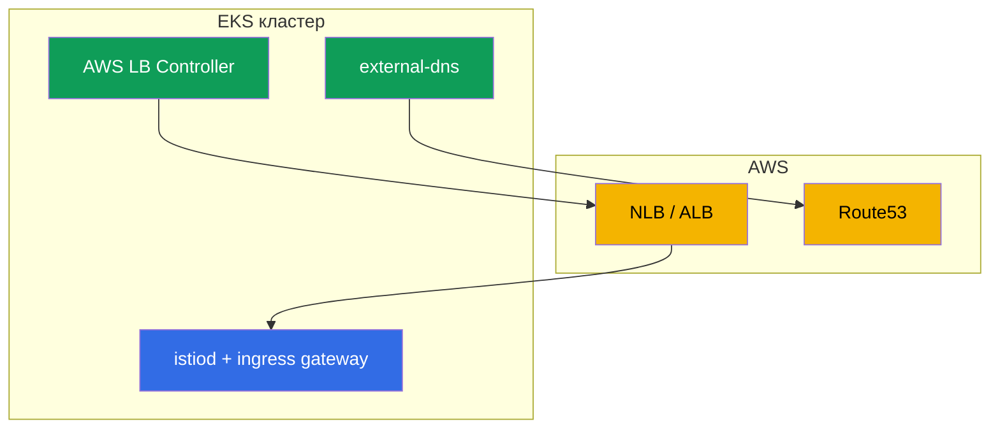

[Eng version](en.md) · [Versión en español](es.md) · [Version française](fr.md) · [Deutsche Version](de.md)

# Глава 27. Istio на EKS: продакшн-установка

> **Что дальше.** До сих пор установка Istio (главы 2-3) была «в вакууме». Теперь
> посмотрим на реальный продакшн в облаке - Amazon EKS. Здесь Istio живёт не сам по
> себе, а в связке с сервисами AWS: балансировщиками, DNS, сертификатами, IAM. В этой
> главе соберём, что нужно учесть при установке Istio на EKS и как сделать её
> продакшн-готовой.

## 27.1. Что особенного в EKS

Сам Istio на EKS ставится теми же istioctl или Helm (главы 2-3). Отличия - в окружении
вокруг него:

- **Балансировщики AWS.** Ingress gateway публикуется через NLB или ALB (глава 26).
- **DNS и сертификаты.** Route53 + external-dns для записей, ACM или cert-manager для
  сертификатов.
- **IAM.** Компонентам, которые ходят в AWS API, нужны права через IRSA.
- **Сеть VPC CNI.** У подов реальные IP из VPC - это влияет на инъекцию и CNI.
- **Мультизональность.** Ноды в нескольких AZ - control plane и шлюзы надо разносить.



## 27.2. Предпосылки

Перед установкой Istio на EKS обычно уже есть или ставятся:

- **AWS Load Balancer Controller** - провижнит NLB/ALB из Service/Ingress. Без него
  ingress gateway не получит нормальный балансировщик AWS.
- **external-dns** - создаёт записи в Route53 из ресурсов кластера (глава 26).
- **cert-manager** (опционально) - для сертификатов (ingress TLS и/или istio-csr,
  глава 16).
- **Prometheus/Grafana** - свой стек или managed (AMP/AMG), для метрик (глава 17).

Каждому из этих контроллеров, который ходит в AWS API, нужны IAM-права - через IRSA
(раздел 27.5).

## 27.3. Установка Istio на EKS

Установка стандартная (istioctl или Helm с ревизиями, главы 2-3), но с прицелом на прод:

- **Профиль `default`, не `demo`.** demo включает лишние компоненты и подробные логи -
  для обучения, не для прода.
- **Ревизии сразу.** Ставьте с ревизиями (глава 3), чтобы будущие обновления шли через
  canary без даунтайма.
- **Кастомный CA заранее.** Как обсуждали в главе 16, PKI лучше заложить сразу
  (cert-manager + istio-csr), чтобы потом не мигрировать живой mesh.
- **Ресурсы и HA компонентов** задавайте явно через IstioOperator/Helm-values (раздел
  27.6).

Соберём эти решения в один прод-ориентированный `IstioOperator`. Он включает профиль
`default`, ревизию, `istio-cni` (27.6), несколько реплик с HPA и PDB для istiod и шлюза
(27.7) и NLB-аннотации на сервисе шлюза (глава 26):

```yaml
apiVersion: install.istio.io/v1alpha1
kind: IstioOperator
metadata:
  name: istio-prod
spec:
  profile: default                 # не demo
  revision: 1-24-0                 # ревизии -> canary-обновления без даунтайма (глава 3)
  components:
    cni:
      enabled: true                # istio-cni: убрать NET_ADMIN у подов (27.6)
    pilot:
      k8s:
        replicaCount: 3
        resources:
          requests: {cpu: "500m", memory: 2Gi}
        hpaSpec:                   # автоскейл istiod под нагрузку
          minReplicas: 3
          maxReplicas: 6
        podDisruptionBudget:
          minAvailable: 1          # обновления нод не выносят все реплики разом
    ingressGateways:
    - name: istio-ingressgateway
      enabled: true
      k8s:
        replicaCount: 3
        resources:
          requests: {cpu: "1", memory: 1Gi}
        hpaSpec:
          minReplicas: 3
          maxReplicas: 10
        podDisruptionBudget:
          minAvailable: 2
        serviceAnnotations:        # публикация через NLB (AWS LB Controller, глава 26)
          service.beta.kubernetes.io/aws-load-balancer-type: external
          service.beta.kubernetes.io/aws-load-balancer-nlb-target-type: ip
          service.beta.kubernetes.io/aws-load-balancer-scheme: internet-facing
```

Это отправная точка: конкретные числа реплик и ресурсов подбирают под размер кластера и
нагрузку. Разнесение по AZ добавляется отдельно (раздел 27.7).

## 27.4. Ingress gateway и балансировщик

Как publish ingress gateway - ключевое решение, и мы подробно разобрали его в главе 26:

- **NLB** (Service типа LoadBalancer с NLB-аннотациями) - если нужны edge-фичи Istio
  (mTLS/SNI/MUTUAL), не-HTTP трафик, весь L7 внутри mesh.
- **ALB** (отдельный L7-фронт через AWS LB Controller) - если нужен offload TLS на ACM,
  интеграция с WAF, взвешивание на уровне LB.

Здесь просто помните вывод главы 26: для «чистого» Istio чаще берут NLB, ALB - когда
завязаны на его экосистему. Сам ingress gateway в проде разворачивают в нескольких
репликах и разносят по AZ (раздел 27.7).

## 27.5. IRSA: права AWS для компонентов

**IRSA** (IAM Roles for Service Accounts) - механизм EKS, который выдаёт подам IAM-роль
через их ServiceAccount, без хранения ключей. На EKS это стандартный способ дать
компоненту доступ к AWS API.

Важно: **самому istiod и Envoy обычно IRSA не нужен** - они не ходят в AWS API. IRSA
нужен окружающим контроллерам:

- **AWS Load Balancer Controller** - создавать/менять NLB, ALB, target-группы.
- **external-dns** - писать записи в Route53.
- **cert-manager** - для DNS-01 challenge в Route53 (если выпускает публичные
  сертификаты).

Отдельные интеграции Istio могут требовать IRSA - например, если CA-ключи хранятся в AWS
KMS. Но в базовой установке права нужны именно поддерживающим контроллерам, а не Istio.

**Альтернатива IRSA - EKS Pod Identity.** IRSA работает через OIDC-провайдера, которого
нужно настраивать и доверять на уровне кластера. Более новый механизм **EKS Pod Identity**
делает то же самое проще: ставится агент (EKS Pod Identity Agent), а связь «ServiceAccount
→ IAM-роль» задаётся через association в EKS API, без возни с OIDC-трастом на каждый
кластер и без аннотаций роли на ServiceAccount. Для новых кластеров Pod Identity обычно
удобнее; IRSA остаётся валидным и широко используемым, особенно там, где он уже настроен.
Функционально для наших контроллеров (LB Controller, external-dns, cert-manager) годится
любой из двух - выбирайте по тому, что принято в вашей инфраструктуре.

На практике IRSA - это IAM-роль плюс аннотация на `ServiceAccount` контроллера. Например,
для external-dns:

```yaml
apiVersion: v1
kind: ServiceAccount
metadata:
  name: external-dns
  namespace: kube-system
  annotations:
    # роль с политикой на route53:ChangeResourceRecordSets в нужной зоне
    eks.amazonaws.com/role-arn: arn:aws:iam::111122223333:role/external-dns
```

Под с этим SA получит временные креды роли автоматически (через projected-токен и STS) -
без ключей в манифесте. То же самое для AWS LB Controller и cert-manager, каждому - своя
роль с минимально необходимой политикой.

С **EKS Pod Identity** аннотация на SA не нужна - связь задаётся ассоциацией через EKS API:

```bash
aws eks create-pod-identity-association \
  --cluster-name prod \
  --namespace kube-system \
  --service-account external-dns \
  --role-arn arn:aws:iam::111122223333:role/external-dns
```

### Control plane на Fargate

istiod это обычный **stateless** Deployment, поэтому его можно вынести на **Fargate**
через Fargate-профиль. Плюсы: не нужно управлять нодами под control plane, изоляция от
ворклоад-нод, точный размер под пода.

Важно: это про **istiod**, а не про аддоны. Prometheus, Grafana, Jaeger, Kiali - плохие
кандидаты на Fargate: они прожорливы и, главное, **stateful** (Prometheus хранит TSDB на
PVC). Fargate не поддерживает EBS-тома (только EFS), а гонять TSDB Prometheus по EFS -
плохая идея. Поэтому аддоны держат на EC2 или, ещё лучше, используют managed-сервисы
(Amazon Managed Prometheus/Grafana). На Fargate имеет смысл выносить именно stateless
istiod.

Но и с istiod есть оговорки, из-за которых на Fargate выносят **только control plane**, а
не data plane:

- **На Fargate не работают DaemonSet.** Значит, `istio-cni` и `ztunnel` (ambient) на
  Fargate-подах не поднимутся. Поэтому ворклоады с сайдкарами (тем более ambient) держат
  на **EC2-нодах**, а не на Fargate.
- **Холодный старт и масштабирование.** Fargate-под поднимается дольше обычного, что
  влияет на скорость масштабирования istiod под всплеск.
- **Сетевые и ресурсные ограничения** Fargate (фиксированные профили ресурсов, свои
  особенности сети) нужно учитывать.

Типичный компромисс: **stateless istiod - на Fargate** (нет управления нодами,
изоляция), **аддоны (Prometheus и т.п.) - на EC2 или managed** (им нужны PVC/EBS),
**ворклоады с data plane - на EC2** (нужны node-level возможности). Если весь кластер на
Fargate - придётся мириться с ограничениями по istio-cni/ambient и стораджу.

## 27.6. Сеть, CNI и ресурсы

- **VPC CNI.** На EKS поды получают реальные IP из VPC. Инъекция sidecar и iptables
  (глава 4) с этим работают, но по умолчанию init-контейнер требует повышенных привилегий
  (NET_ADMIN) в каждом поде.
- **istio-cni.** Чтобы не давать каждому поду NET_ADMIN, в проде включают плагин
  **istio-cni**: он настраивает iptables на уровне ноды (как chained-плагин поверх VPC
  CNI), и поды приложений больше не требуют привилегированного init-контейнера. На EKS
  это рекомендуемая практика по безопасности.
- **Ресурсы.** Задавайте requests/limits для istiod и sidecar явно (глава 4). На большом
  кластере не забудьте про оптимизацию scope (глава 19), иначе istiod и прокси будут есть
  много памяти.

## 27.7. HA и надёжность

Продакшн требует, чтобы ни istiod, ни ingress gateway не были единой точкой отказа:

- **Несколько реплик istiod** + HPA по нагрузке. istiod держит конфигурацию data plane
  в памяти, и его недоступность мешает обновлять конфиг (хотя работающие прокси
  продолжают работать на последней полученной).
- **PodDisruptionBudget** для istiod и шлюзов, чтобы обновления нод не выносили все
  реплики разом.
- **Разнесение по зонам (AZ).** Реплики istiod и ingress gateway распределяйте по разным
  AZ (topologySpreadConstraints), чтобы падение зоны не уронило mesh.
- **Cross-zone у балансировщика - с оглядкой на стоимость, и по-разному у NLB и ALB.**
  Cross-zone load balancing выравнивает трафик по шлюзам во всех зонах, но стоимость
  межзонного трафика у двух типов LB считается по-разному:
  - **NLB:** cross-zone **выключен по умолчанию**, и при включении AWS **тарифицирует
    межзонный трафик** - $0.01/GB в каждом направлении (и клиент→NLB, и NLB→таргет через
    AZ). Здесь трейдофф равномерность против счёта за трафик реален.
  - **ALB:** cross-zone **включён всегда**, и межзонный трафик LB↔таргеты **в пределах
    одного VPC не тарифицируется** отдельно (AWS не перекладывает эту стоимость на клиента).
  Важная оговорка: это про трафик самого балансировщика в пределах VPC. Межзональный трафик
  **внутри mesh** (под↔под между AZ) тарифицируется в любом случае - поэтому используйте
  locality-aware балансировку (глава 7), чтобы запросы по возможности оставались в своей
  зоне. В целом проектируйте так, чтобы межзонного трафика было меньше: держите
  взаимодействующие сервисы в одной зоне, где это оправдано.
- **Достаточно ресурсов (requests/limits) для ingress gateway** под реальную нагрузку -
  это точка входа всего трафика, экономить на нём нельзя.

Разнесение по AZ задаётся `topologySpreadConstraints` по метке `topology.kubernetes.io/zone`.
В `IstioOperator` их подмешивают через `k8s.overlays` к деплойменту шлюза (и istiod):

```yaml
    ingressGateways:
    - name: istio-ingressgateway
      k8s:
        overlays:
        - kind: Deployment
          name: istio-ingressgateway
          patches:
          - path: spec.template.spec.topologySpreadConstraints
            value:
            - maxSkew: 1
              topologyKey: topology.kubernetes.io/zone   # равномерно по зонам
              whenUnsatisfiable: DoNotSchedule
              labelSelector:
                matchLabels:
                  istio: ingressgateway
```

`maxSkew: 1` не даёт планировщику собрать реплики в одной AZ, поэтому падение зоны не
уносит весь шлюз. Тот же приём применяют к istiod (`components.pilot`).

## 27.8. Продакшн-чеклист

Перед выводом Istio на EKS в прод сверьтесь:

- [ ] Профиль `default`, установка с ревизиями (готовность к canary-обновлениям).
- [ ] Кастомный CA заложен сразу (cert-manager + istio-csr), продумана ротация корня.
- [ ] AWS LB Controller и external-dns установлены, IRSA настроен.
- [ ] Выбран и настроен балансировщик (NLB/ALB) под требования (глава 26).
- [ ] istio-cni включён (меньше привилегий у подов).
- [ ] HA: несколько реплик istiod и шлюзов, PDB, разнесение по AZ, cross-zone на LB.
- [ ] Observability: Prometheus/Grafana/трейсинг, алерты на золотые сигналы и istiod
  (главы 17-18).
- [ ] Scope оптимизирован под размер кластера (глава 19).
- [ ] mTLS: план миграции PERMISSIVE → STRICT (глава 13).
- [ ] Отрепетированы обновление (canary) и откат.

## 27.9. Итоги главы

- На EKS Istio ставится стандартно, но живёт в связке с AWS: балансировщики, Route53,
  сертификаты, IAM, VPC CNI, мультизональность.
- Предпосылки: AWS LB Controller, external-dns, при необходимости cert-manager и
  Prometheus; им нужен доступ к AWS через **IRSA**.
- Самому istiod IRSA обычно не нужен - права требуются окружающим контроллерам. Вместо
  IRSA можно использовать более простой **EKS Pod Identity**.
- На **Fargate** имеет смысл выносить только stateless istiod; аддоны (Prometheus и т.п.)
  туда не годятся (нужны PVC/EBS, много ресурсов), а data plane (сайдкары, ambient) на
  Fargate не работает - там нет DaemonSet (istio-cni, ztunnel).
- Ingress gateway публикуют через NLB или ALB по выбору из главы 26.
- В проде включают **istio-cni** (меньше привилегий у подов при VPC CNI).
- HA: несколько реплик istiod и шлюзов, PDB, разнесение по AZ (`topologySpreadConstraints`).
  Cross-zone у **NLB** платный (межзонный трафик тарифицируется), у **ALB** cross-zone
  всегда включён и межзонный трафик LB↔таргеты в пределах VPC не тарифицируется.
- Прод-конфигурацию удобно собрать в один `IstioOperator` (профиль, ревизия, istio-cni,
  реплики/HPA/PDB, аннотации LB); IRSA - это IAM-роль + аннотация на `ServiceAccount`
  (или ассоциация через EKS Pod Identity).
- Установку с ревизиями и кастомным CA закладывают сразу, чтобы избежать болезненных
  миграций.

## 27.10. Вопросы для самопроверки

1. Что в установке Istio на EKS отличается от «ванильного» кластера?
2. Зачем нужны AWS Load Balancer Controller и external-dns?
3. Нужен ли IRSA самому istiod? Кому он нужен и зачем? Чем EKS Pod Identity удобнее IRSA?
4. Что такое istio-cni и почему его включают на EKS?
5. Какие меры обеспечивают HA control plane и ingress gateway? Как задать разнесение по AZ?
6. Чем отличается тарификация cross-zone трафика у NLB и ALB?
7. Как выглядит прод-`IstioOperator`: какие ключевые поля включают для прода?
8. Как компоненту дают права AWS через IRSA и чем это отличается от EKS Pod Identity?
9. Что бы вы проверили по продакшн-чеклисту перед запуском?
10. Можно ли вынести istiod на Fargate? Почему data plane при этом оставляют на EC2?

## Практика

Отдельная лаба по установке Istio на EKS **планируется** и должна покрыть: развёртывание
EKS, AWS LB Controller и external-dns с IRSA, установку Istio с ревизиями, публикацию
ingress gateway через NLB/ALB, istio-cni и проверку HA.

🧪 Лаба: **TODO (EKS)**.

---
[Оглавление](../README.md) · [Глава 26](../26/ru.md) · [Глава 28](../28/ru.md)
