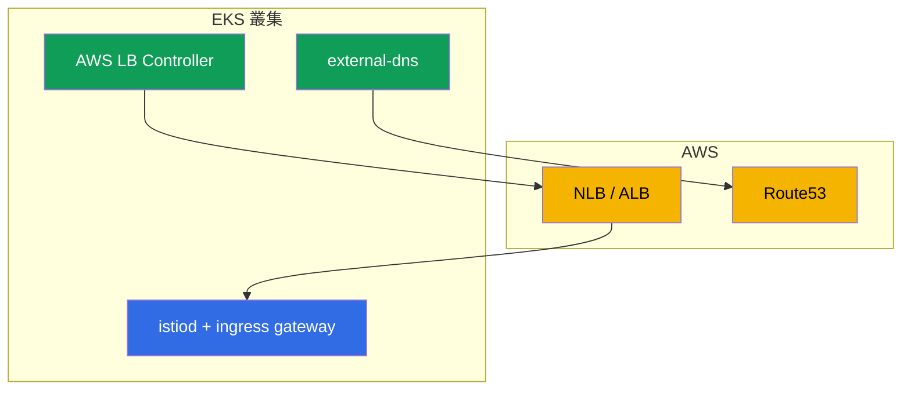

[Русская версия](ru.md) · [Eng version](en.md) · [Versión en español](es.md) · [Version française](fr.md) · [Deutsche Version](de.md) · [ქართული ვერსია](ge.md) · [日本語版](jp.md)

# 第 27 章。EKS 上的 Istio：正式環境安裝

> **接下來。** 到目前為止，Istio 的安裝（第 2-3 章）都處於「真空」中。現在我們來看看雲端中的實際正式環境--Amazon EKS。在這裡，Istio 並非獨立運作，而是與 AWS 服務結合：負載平衡器、DNS、憑證、IAM。本章將整理在 EKS 上安裝 Istio 時需要考量的事項，以及如何使其達到正式環境就緒狀態。

## 27.1. EKS 的特殊之處

Istio 本身在 EKS 上仍使用相同的 istioctl 或 Helm 安裝（第 2-3 章）。差異在於其周遭環境：

- **AWS 負載平衡器。** Ingress gateway 透過 NLB 或 ALB 發布（第 26 章）。
- **DNS 與憑證。** Route53 + external-dns 用於記錄，ACM 或 cert-manager 用於憑證。
- **IAM。** 呼叫 AWS API 的元件需要透過 IRSA 取得權限。
- **VPC CNI 網路。** Pod 取得來自 VPC 的真實 IP--這會影響注入和 CNI。
- **多可用區。** 節點位於多個 AZ--control plane 與 gateway 必須分散部署。



## 27.2. 前置條件

在 EKS 上安裝 Istio 前，通常已存在或需要安裝：

- **AWS Load Balancer Controller**--從 Service/Ingress 佈建 NLB/ALB。沒有它，ingress gateway 將無法取得正常的 AWS 負載平衡器。
- **external-dns**--從叢集資源在 Route53 中建立記錄（第 26 章）。
- **cert-manager**（選用）--用於憑證（ingress TLS 及／或 istio-csr，第 16 章）。
- **Prometheus/Grafana**--自建堆疊或受管服務（AMP/AMG），用於指標（第 17 章）。

這些每個呼叫 AWS API 的控制器都需要 IAM 權限--透過 IRSA（第 27.5 節）。

## 27.3. 在 EKS 上安裝 Istio

安裝是標準的（istioctl 或含版本修訂的 Helm，第 2-3 章），但需以正式環境為目標：

- **使用 `default` 設定檔，而非 `demo`。** demo 包含多餘元件與詳細日誌--適用於學習，不適用於正式環境。
- **立即採用版本修訂。** 使用版本修訂安裝（第 3 章），讓未來的升級能透過 canary 進行且不中斷服務。
- **及早使用自訂 CA。** 如第 16 章所討論，最好從一開始就規劃 PKI（cert-manager + istio-csr），以免之後遷移正在運作的 mesh。
- **明確設定元件資源與 HA。** 透過 IstioOperator/Helm values 明確設定（第 27.6 節）。

讓我們將這些決策整合為一個面向正式環境的 `IstioOperator`。它包含 `default` 設定檔、版本修訂、`istio-cni`（27.6）、istiod 與 gateway 的多個副本、HPA 與 PDB（27.7），以及 gateway 服務上的 NLB 註解（第 26 章）：

```yaml
apiVersion: install.istio.io/v1alpha1
kind: IstioOperator
metadata:
  name: istio-prod
spec:
  profile: default                 # 非 demo
  revision: 1-24-0                 # 修訂版 -> 無停機的 canary 升級（第 3 章）
  components:
    cni:
      enabled: true                # istio-cni：移除 pod 的 NET_ADMIN（27.6）
    pilot:
      k8s:
        replicaCount: 3
        resources:
          requests: {cpu: "500m", memory: 2Gi}
        hpaSpec:                   # 依負載自動擴縮 istiod
          minReplicas: 3
          maxReplicas: 6
        podDisruptionBudget:
          minAvailable: 1          # 節點升級不會一次移除所有複本
    ingressGateways:
    - name: istio-ingressgateway
      enabled: true
      k8s:
        replicaCount: 3
        resources:
          requests: {cpu: "1", memory: 1Gi}
        hpaSpec:
          minReplicas: 3
          maxReplicas: 10
        podDisruptionBudget:
          minAvailable: 2
        serviceAnnotations:        # 透過 NLB 發布（AWS LB Controller，第 26 章）
          service.beta.kubernetes.io/aws-load-balancer-type: external
          service.beta.kubernetes.io/aws-load-balancer-nlb-target-type: ip
          service.beta.kubernetes.io/aws-load-balancer-scheme: internet-facing
```

這是起點：具體的副本數與資源需依叢集規模和負載調整。AZ 分散配置會另外加入（第 27.7 節）。

## 27.4. Ingress gateway 與負載平衡器

如何發布 ingress gateway 是關鍵決策，我們已在第 26 章詳細討論：

- **NLB**（含 NLB 註解的 LoadBalancer 類型 Service）--若需要 Istio 邊緣功能（mTLS/SNI/MUTUAL）、非 HTTP 流量，且所有 L7 都位於 mesh 內。
- **ALB**（透過 AWS LB Controller 的獨立 L7 前端）--若需要在 ACM 卸載 TLS、整合 WAF、在 LB 層級加權。

在此只要記住第 26 章的結論：對「純粹」的 Istio，通常選擇 NLB；若依賴其生態系統，則使用 ALB。正式環境中的 ingress gateway 本身會部署多個副本並分散至 AZ（第 27.7 節）。

## 27.5. IRSA：元件的 AWS 權限

**IRSA**（IAM Roles for Service Accounts）是 EKS 機制，透過 Pod 的 ServiceAccount 向其授予 IAM 角色，而無需儲存金鑰。在 EKS 上，這是讓元件存取 AWS API 的標準方式。

重要的是：**istiod 與 Envoy 本身通常不需要 IRSA**--它們不會呼叫 AWS API。IRSA 是周邊控制器所需：

- **AWS Load Balancer Controller**--建立／修改 NLB、ALB、target group。
- **external-dns**--寫入 Route53 記錄。
- **cert-manager**--用於 Route53 的 DNS-01 challenge（如果簽發公開憑證）。

個別的 Istio 整合可能需要 IRSA--例如 CA 金鑰儲存在 AWS KMS 時。但在基本安裝中，權限是支援控制器所需，而不是 Istio 所需。

**IRSA 的替代方案是 EKS Pod Identity。** IRSA 透過 OIDC provider 運作，必須在叢集層級設定並建立信任。較新的 **EKS Pod Identity** 機制以更簡單的方式完成相同工作：安裝 agent（EKS Pod Identity Agent），並透過 EKS API 中的 association 設定「ServiceAccount → IAM 角色」關聯，無需為每個叢集處理 OIDC trust，也無需在 ServiceAccount 上加上角色註解。對新叢集而言，Pod Identity 通常更方便；IRSA 仍然有效且被廣泛使用，尤其是在已完成其設定的環境。對我們的控制器（LB Controller、external-dns、cert-manager）來說，兩者在功能上都適用--請根據您基礎設施中的既有慣例選擇。

實務上，IRSA 是 IAM 角色加上控制器 `ServiceAccount` 的註解。例如，external-dns：

```yaml
apiVersion: v1
kind: ServiceAccount
metadata:
  name: external-dns
  namespace: kube-system
  annotations:
    # 具備所需 zone 上 route53:ChangeResourceRecordSets 政策的角色
    eks.amazonaws.com/role-arn: arn:aws:iam::111122223333:role/external-dns
```

使用該 SA 的 Pod 將自動取得角色的臨時憑證（透過 projected token 與 STS）--不需要在 manifest 中放置金鑰。AWS LB Controller 與 cert-manager 也是相同方式，每個都使用自己的角色及最小必要權限原則。

使用 **EKS Pod Identity** 時，SA 不需要註解--關聯透過 EKS API 的 association 設定：

```bash
aws eks create-pod-identity-association \
  --cluster-name prod \
  --namespace kube-system \
  --service-account external-dns \
  --role-arn arn:aws:iam::111122223333:role/external-dns
```

### 在 Fargate 上執行 control plane

istiod 是一般的 **stateless** Deployment，因此可透過 Fargate profile 將其部署至 **Fargate**。優點：無需管理 control plane 的節點、與工作負載節點隔離，並能精確依 Pod 調整大小。

重要的是：這是指 **istiod**，不是附加元件。Prometheus、Grafana、Jaeger、Kiali 都不適合 Fargate：它們資源消耗大，而且最重要的是都是 **stateful**（Prometheus 將 TSDB 儲存在 PVC）。Fargate 不支援 EBS volume（僅支援 EFS），而讓 Prometheus TSDB 使用 EFS 並不是好主意。因此，附加元件應保留在 EC2 上，或更好的是使用受管服務（Amazon Managed Prometheus/Grafana）。只有 stateless 的 istiod 適合部署到 Fargate。

但 istiod 也有一些注意事項，因此在 Fargate 上部署**僅限 control plane**，而非 data plane：

- **Fargate 上無法運作 DaemonSet。** 這表示 `istio-cni` 與 `ztunnel`（ambient）無法在 Fargate Pod 上啟動。因此，具有 sidecar 的工作負載（更不用說 ambient）應保留在 **EC2 節點**上，而非 Fargate。
- **冷啟動與擴展。** Fargate Pod 比一般 Pod 啟動更久，這會影響 istiod 在流量突增時的擴展速度。
- **網路與資源限制。** 必須考量 Fargate 的限制（固定的資源設定檔及其網路特性）。

典型的折衷方式是：**stateless istiod 部署在 Fargate**（無需管理節點、具隔離性）、**附加元件（Prometheus 等）部署在 EC2 或使用受管服務**（它們需要 PVC/EBS）、**具有 data plane 的工作負載部署在 EC2**（需要 node-level 功能）。若整個叢集都在 Fargate 上，則必須接受 istio-cni/ambient 和儲存方面的限制。

## 27.6. 網路、CNI 與資源

- **VPC CNI。** 在 EKS 上，Pod 會取得來自 VPC 的真實 IP。sidecar 注入與 iptables（第 4 章）可與其配合運作，但預設的 init container 在每個 Pod 中都需要提升的權限（NET_ADMIN）。
- **istio-cni。** 為避免向每個 Pod 授予 NET_ADMIN，正式環境會啟用 **istio-cni** 外掛：它在節點層級設定 iptables（作為 VPC CNI 之上的 chained plugin），而應用程式 Pod 不再需要具權限的 init container。在 EKS 上，這是建議的安全實務。
- **資源。** 明確設定 istiod 與 sidecar 的 requests/limits（第 4 章）。在大型叢集中，別忘了 scope 最佳化（第 19 章），否則 istiod 與 proxy 會消耗大量記憶體。

## 27.7. HA 與可靠性

正式環境需要確保 istiod 和 ingress gateway 都不是單一故障點：

- **多個 istiod 副本** + 依負載使用 HPA。istiod 將 data plane 設定保留在記憶體中，其無法使用會阻礙設定更新（雖然執行中的 proxy 會繼續使用最後接收的設定）。
- 為 istiod 與 gateway 設定 **PodDisruptionBudget**，以免節點更新一次移除所有副本。
- **跨可用區（AZ）分散。** 將 istiod 與 ingress gateway 副本分布至不同 AZ（topologySpreadConstraints），確保一個可用區故障不會使 mesh 停擺。
- **負載平衡器的 cross-zone--注意成本，且 NLB 與 ALB 的情況不同。** Cross-zone load balancing 會在所有可用區的 gateway 間平衡流量，但兩種 LB 對跨區流量的計費方式不同：
  - **NLB：** cross-zone **預設關閉**，啟用時 AWS **會對跨區流量計費**--每個方向 $0.01/GB（client→NLB 與跨 AZ 的 NLB→target）。此處均勻性與流量帳單之間存在實際取捨。
  - **ALB：** cross-zone **一律啟用**，且同一 VPC 內的 LB↔target 跨區流量**不會被單獨計費**（AWS 不會將該成本轉嫁給客戶）。
  重要提醒：這是指 VPC 內負載平衡器本身的流量。**mesh 內部**的跨區流量（Pod↔Pod 跨 AZ）無論如何都會計費--因此請使用 locality-aware 負載平衡（第 7 章），盡可能讓請求留在自己的可用區。總體而言，設計時應減少跨區流量：在合理情況下，讓相互通訊的服務位於同一可用區。
- 為 ingress gateway 提供符合實際負載的**足夠資源（requests/limits）**--它是所有流量的入口點，不能在此節省資源。

透過標籤 `topology.kubernetes.io/zone` 設定 `topologySpreadConstraints` 以實現跨 AZ 分散。在 `IstioOperator` 中，透過 `k8s.overlays` 將其混入 gateway（及 istiod）的 Deployment：

```yaml
    ingressGateways:
    - name: istio-ingressgateway
      k8s:
        overlays:
        - kind: Deployment
          name: istio-ingressgateway
          patches:
          - path: spec.template.spec.topologySpreadConstraints
            value:
            - maxSkew: 1
              topologyKey: topology.kubernetes.io/zone   # 平均分散於各可用區
              whenUnsatisfiable: DoNotSchedule
              labelSelector:
                matchLabels:
                  istio: ingressgateway
```

`maxSkew: 1` 可防止 scheduler 將副本集中在一個 AZ，因此單一可用區故障不會帶走整個 gateway。同樣的做法也適用於 istiod（`components.pilot`）。

## 27.8. 正式環境檢查清單

在將 Istio 於 EKS 導入正式環境之前，請確認：

- [ ] 使用 `default` 設定檔，以版本修訂安裝（為 canary 升級做好準備）。
- [ ] 從一開始就規劃自訂 CA（cert-manager + istio-csr），並已考量根憑證輪替。
- [ ] 已安裝 AWS LB Controller 與 external-dns，並已設定 IRSA。
- [ ] 已根據需求選擇並設定負載平衡器（NLB/ALB）（第 26 章）。
- [ ] 已啟用 istio-cni（Pod 所需權限更少）。
- [ ] HA：多個 istiod 與 gateway 副本、PDB、跨 AZ 分散、LB 的 cross-zone。
- [ ] Observability：Prometheus/Grafana/tracing、針對黃金訊號和 istiod 的 alerts（第 17-18 章）。
- [ ] 已依叢集規模最佳化 scope（第 19 章）。
- [ ] mTLS：PERMISSIVE → STRICT 的遷移計畫（第 13 章）。
- [ ] 已演練升級（canary）與回復。

## 27.9. 本章總結

- 在 EKS 上，Istio 採用標準安裝方式，但與 AWS 整合運作：負載平衡器、Route53、憑證、IAM、VPC CNI、多可用區。
- 前置條件：AWS LB Controller、external-dns，以及必要時的 cert-manager 和 Prometheus；它們需要透過 **IRSA** 存取 AWS。
- istiod 本身通常不需要 IRSA--權限是周邊控制器所需。可使用更簡單的 **EKS Pod Identity** 取代 IRSA。
- **Fargate** 僅適合部署 stateless istiod；附加元件（Prometheus 等）不適合（需要 PVC/EBS、資源消耗高），而 data plane（sidecar、ambient）無法在 Fargate 上運作--那裡沒有 DaemonSet（istio-cni、ztunnel）。
- 依第 26 章的選擇，透過 NLB 或 ALB 發布 ingress gateway。
- 正式環境會啟用 **istio-cni**（在 VPC CNI 下讓 Pod 所需權限更少）。
- HA：多個 istiod 與 gateway 副本、PDB、跨 AZ 分散（`topologySpreadConstraints`）。**NLB** 的 cross-zone 需付費（跨區流量會計費）；**ALB** 的 cross-zone 一律啟用，且 VPC 內的 LB↔target 跨區流量不會計費。
- 可將正式環境設定整合為單一 `IstioOperator`（設定檔、版本修訂、istio-cni、副本/HPA/PDB、LB 註解）；IRSA 是 IAM 角色加上 `ServiceAccount` 註解（或透過 EKS Pod Identity 的 association）。
- 應從一開始就規劃含版本修訂的安裝與自訂 CA，以避免痛苦的遷移。

## 27.10. 自我檢查問題

1. 在 EKS 上安裝 Istio 與「原生」叢集有何不同？
2. 為何需要 AWS Load Balancer Controller 與 external-dns？
3. istiod 本身需要 IRSA 嗎？誰需要它以及原因為何？EKS Pod Identity 比 IRSA 方便在哪裡？
4. 什麼是 istio-cni，為什麼在 EKS 上啟用它？
5. 哪些措施可確保 control plane 與 ingress gateway 的 HA？如何設定跨 AZ 分散？
6. NLB 與 ALB 的 cross-zone 流量計費有何不同？
7. 正式環境的 `IstioOperator` 長什麼樣子：其中應包含哪些關鍵欄位？
8. 如何透過 IRSA 向元件授予 AWS 權限，這與 EKS Pod Identity 有何不同？
9. 在啟動前，您會依正式環境檢查清單確認什麼？
10. 可以將 istiod 部署至 Fargate 嗎？為什麼 data plane 仍部署在 EC2 上？

## 實作

關於在 EKS 上安裝 Istio 的獨立實驗室**規劃中**，應涵蓋：EKS 部署、使用 IRSA 的 AWS LB Controller 與 external-dns、使用版本修訂安裝 Istio、透過 NLB/ALB 發布 ingress gateway、istio-cni 與 HA 驗證。

🧪 實驗室：**TODO（EKS）**。

---
[目錄](../README_TW.md) · [第 26 章](../26/tw.md) · [第 28 章](../28/tw.md)
