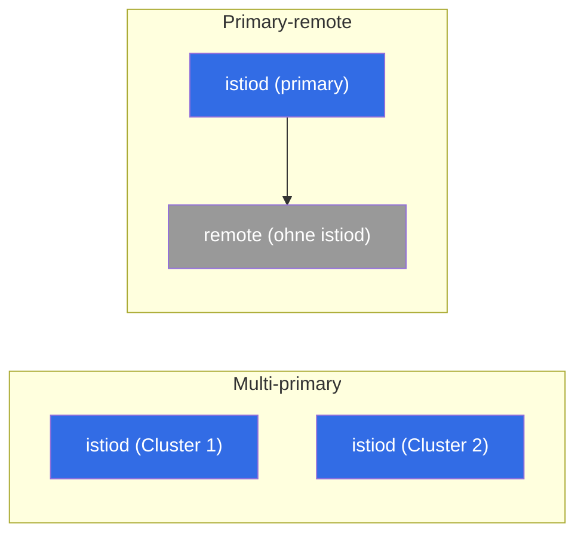

[RU version](ru.md) · [Eng version](en.md) · [Versión en español](es.md) · [Version française](fr.md)

# Kapitel 28. Multi-Cluster-Mesh

> **Was kommt als Nächstes.** Bisher hatten wir einen einzigen Cluster. Aber in der
> Produktion braucht man oft mehrere: für Ausfallsicherheit, Geografie, Isolierung oder
> Kapazität. Istio kann mehrere Cluster zu einem **einheitlichen Mesh** zusammenfassen -
> Services aus verschiedenen Clustern sehen einander und kommunizieren per mTLS, als wären
> sie nebeneinander. In diesem Kapitel betrachten wir, wie das aufgebaut ist und welche
> Modelle es gibt.

## 28.1. Wozu Multi-Cluster

Ein einzelner Cluster ist ein Single Point of Failure und eine Grenze bei Skalierung/
Geografie. Mehrere Cluster in einem Mesh geben:

- **Ausfallsicherheit.** Fällt ein Cluster oder eine Zone aus - der Traffic geht in einen
  anderen Cluster.
- **Geografie.** Cluster näher an den Nutzern in verschiedenen Regionen.
- **Isolierung.** Trennung nach Teams, Umgebungen, Sicherheitsanforderungen.
- **Kapazität.** Umgehung der Limits eines einzelnen Clusters.

Die Kernidee: Services in verschiedenen Clustern sollen einander sehen und einander
vertrauen, wie innerhalb eines Mesh. Dafür sind drei Dinge nötig: gemeinsamer Trust,
Service-Discovery zwischen den Clustern und Netzwerk-Konnektivität.

## 28.2. Gemeinsamer Trust - das Fundament

Die erste und zwingende Bedingung: alle Cluster müssen **einer gemeinsamen Wurzel
vertrauen**. mTLS zwischen den Services (Kapitel 13) funktioniert nur, wenn ihre
Zertifikate aus einer gemeinsamen Root-CA ausgestellt sind. Hat jeder Cluster sein eigenes
selbstsigniertes istiod - gibt es keinen gemeinsamen Trust, und der Cross-Cluster-Traffic
kommt nicht zustande.

Deshalb ist Multi-Cluster **ohne eine gemeinsame eigene CA nicht möglich** (Kapitel 16).
Daher auch der Rat aus Kapitel 16: wenn es auch nur die geringste Wahrscheinlichkeit für
Multi-Cluster gibt, legen Sie die gemeinsame CA gleich an - sonst muss man laufende Cluster
auf eine gemeinsame Wurzel migrieren.

## 28.3. Deployment-Modelle: primary-remote und multi-primary

Danach, wo die Control Plane lebt, unterscheidet man zwei Modelle.

- **Primary-remote.** Ein Cluster (primary) hält istiod, und die übrigen (remote)
  verwenden ihn als externe Control Plane. Ressourcenschonender, aber primary wird kritisch:
  seine Nichtverfügbarkeit betrifft die remote-Cluster.
- **Multi-primary.** Jeder Cluster hat **sein eigenes** istiod, und sie tauschen
  Informationen über die Services aus. Zuverlässiger (kein einzelner Management-Punkt),
  aber aufwendiger in der Konfiguration. Das ist die bevorzugte Variante für eine
  ausfallsichere Produktion.



Das Modell und die Zugehörigkeit zum gemeinsamen Mesh werden bei der Installation
festgelegt - über `global` in `IstioOperator`/Helm. Die Schlüsselfelder: eine einheitliche
`meshID` für alle Cluster, ein eindeutiger Name des Clusters und der Name seines Netzwerks:

```yaml
apiVersion: install.istio.io/v1alpha1
kind: IstioOperator
metadata:
  name: istio-cluster1
spec:
  values:
    global:
      meshID: mesh1                # EIN Mesh für alle Cluster
      multiCluster:
        clusterName: cluster1      # eindeutiger Name dieses Clusters
      network: network1            # Name des Netzwerks dieses Clusters (siehe 28.4)
```

Im benachbarten Cluster dieselbe `meshID`, aber `clusterName: cluster2` und, falls das
Netzwerk ein anderes ist, `network: network2`. Der Trust beruht auf der gemeinsamen
Root-CA (28.2) und derselben `trustDomain` - ohne das kommt Cross-Cluster-mTLS nicht
zustande.

> **Ambient und Multi-Cluster.** Alles in diesem Kapitel ist für den Sidecar-Modus
> beschrieben. Multi-Cluster für ambient (Kapitel 22) reift zum Zeitpunkt von Istio ~1.24
> noch und hat Einschränkungen, deshalb nimmt man für eine ausfallsichere
> Produktions-Multi-Cluster-Umgebung derzeit gerade Sidecars.

## 28.4. Ein Netzwerk oder mehrere: east-west gateway

Die zweite Dimension - die Netzwerk-Konnektivität zwischen den Clustern.

- **Ein Netzwerk (single network).** Pods verschiedener Cluster können einander direkt per
  IP erreichen (gemeinsames VPC/flaches Netzwerk). Einfacher: der Cross-Cluster-Traffic
  geht direkt.
- **Mehrere Netzwerke (multi-network).** Cluster in verschiedenen Netzwerken, Pods sehen
  einander nicht direkt. Dann geht der Cross-Cluster-Traffic über ein **east-west
  gateway** - ein spezielles Ingress-Gateway für **mesh-internen** Traffic zwischen den
  Clustern (im Gegensatz zum gewöhnlichen north-south Ingress für externe Nutzer).


Das east-west gateway routet den verschlüsselten Traffic zwischen den Clustern nach SNI,
ohne ihn zu entschlüsseln (das durchgängige mTLS zwischen den Services bleibt erhalten).

In der Praxis ist die Einrichtung für multi-network folgendermaßen. Zuerst markiert man das
Netzwerk des Clusters, damit istiod weiß, welche Endpunkte lokal sind und welche - hinter
dem Gateway:

```bash
kubectl label namespace istio-system topology.istio.io/network=network1
```

Dann installiert man das east-west gateway selbst (ein separates Ingress-Gateway mit der
Rolle router) und öffnet an ihm den Port `15443` im Modus `AUTO_PASSTHROUGH` - es routet
nach SNI, ohne das mTLS zu öffnen:

```yaml
apiVersion: networking.istio.io/v1
kind: Gateway
metadata:
  name: cross-network-gateway
  namespace: istio-system
spec:
  selector:
    istio: eastwestgateway          # Pods des east-west Gateways
  servers:
  - port:
      number: 15443
      name: tls
      protocol: TLS
    tls:
      mode: AUTO_PASSTHROUGH        # nicht entschlüsseln, nach SNI routen
    hosts:
    - "*.local"                     # Cross-Cluster-Services (*.svc.cluster.local)
```

Das east-west gateway selbst wird über einen Service vom Typ LoadBalancer veröffentlicht
(auf EKS - üblicherweise ein **internal NLB**, Abschnitt 28.7). Seine Adresse verwendet das
istiod des benachbarten Clusters als Eingangspunkt für den Traffic in dieses Netzwerk.

## 28.5. Service-Discovery zwischen den Clustern

Damit das istiod eines Clusters von den Services eines anderen weiß, braucht es Zugriff auf
die API dieses Clusters. Das wird über ein **remote secret** konfiguriert - istiod erhält
kubeconfig-Zugriff auf die benachbarten Cluster:

```bash
istioctl create-remote-secret --name=cluster2 | kubectl apply -f - --context=cluster1
```

Danach liest das istiod in Cluster 1 die Services und Endpunkte von Cluster 2 und fügt sie
in die gemeinsame Registry ein. Für einen Service mit gleichem Namen in beiden Clustern
fasst Istio die Endpunkte zusammen - und eine Anfrage kann an einen Pod in einem beliebigen
der Cluster gehen.

**Prüfe deine Arbeit.** Dass die Verbindung der Cluster tatsächlich zustande gekommen ist,
sieht man so:

```bash
istioctl remote-clusters                     # istiod sieht die benachbarten Cluster (synced?)
# in den Endpunkten des lokalen Service sind Adressen aus dem anderen Cluster/Netzwerk aufgetaucht:
istioctl proxy-config endpoints <pod> -n app | grep <service>
# und schließlich der scharfe Test - mehrere Anfragen, antworten sollen beide Cluster:
kubectl exec <pod> -n app -- sh -c 'for i in $(seq 10); do curl -s http://<service>/hostname; done'
```

Wenn `remote-clusters` den Nachbarn nicht zeigt oder in `endpoints` nur lokale Adressen
sind - liegt das Problem am remote secret (Zugriff auf die API) oder am Netzwerk/east-west
Gateway.

## 28.6. Load Balancing zwischen den Clustern

Wenn die Endpunkte eines Service in mehreren Clustern vorhanden sind, stellt sich die
Frage: wohin die Anfrage schicken. Hier greift wieder **Locality-aware Load Balancing**
(Kapitel 7):

- im Normalbetrieb bleibt der Traffic im **eigenen** Cluster/in der eigenen Zone (weniger
  Latenz, weniger zonen-/regionsübergreifender Traffic - und geringere Cloud-Rechnung,
  Kapitel 27);
- beim Ausfall der lokalen Endpunkte greift das **Failover** in einen anderen Cluster.

Das ist eben die Ausfallsicherheit von Multi-Cluster: lokal schnell, und bei einem Problem
geht der Traffic selbst dorthin, wo der Service lebt. Wie in Kapitel 7 ist für das Failover
`outlierDetection` nötig.

## 28.7. Multi-Cluster auf EKS/AWS

Auf EKS werden die abstrakten „Netzwerk" und „Zugriff auf die API des Nachbarn" zu
konkreten AWS-Services. Die wichtigsten Punkte.

- **Ein Netzwerk oder mehrere - das dreht sich um VPC.** Wenn die Cluster in einem VPC oder
  in verschiedenen VPC sind, die über **VPC Peering / Transit Gateway** verbunden sind (ein
  flaches routbares Netzwerk ohne CIDR-Überschneidung), sehen die Pods einander direkt -
  das ist das Modell **single-network**, ein east-west gateway ist nicht nötig. Sind die
  Netzwerke isoliert, nimmt man **multi-network** mit east-west Gateway.
- **East-west gateway hinter einem internal NLB.** Bei multi-network wird das Gateway über
  einen **internen NLB** veröffentlicht (`aws-load-balancer-scheme: internal`), nicht nach
  außen - der Cross-Cluster-Traffic läuft üblicherweise über das private Netzwerk
  (Peering/TGW), nicht über das Internet.
- **Gemeinsame CA in der Praxis.** Die Wurzel für alle Cluster - das ist entweder eine
  Offline-Wurzel mit Intermediates pro Cluster oder **AWS Private CA (ACM PCA)** über
  cert-manager + istio-csr (Kapitel 16). Die Hauptsache - eine Wurzel für das gesamte Mesh.
- **Zugriff auf die API des benachbarten Clusters (remote secret) - ein Fallstrick auf
  EKS.** Ein kubeconfig von EKS verwendet standardmäßig IAM-Authentifizierung
  (`aws eks get-token`), und ein solches Secret ist an lokale AWS-Credentials gebunden -
  das istiod des benachbarten Clusters kann sie nicht nutzen. Deshalb erstellt man für das
  remote secret üblicherweise einen separaten ServiceAccount mit Token und gibt seiner
  Identity Zugriff auf die API (über `aws-auth`/**EKS access entries**). Das heißt, die
  Cross-Cluster-Discovery auf EKS erfordert sowohl Netzwerkzugriff auf den API-Endpunkt als
  auch eine korrekte IAM/RBAC-Bindung.
- **Cross-Region - teuer und langsam.** Regionsübergreifender Traffic wird teurer tarifiert
  als zonenübergreifender und fügt Latenz hinzu (Kapitel 27). Halten Sie interagierende
  Services in einer Region und verwenden Sie Multi-Region für Geo-Ausfallsicherheit, nicht
  für ständige Cross-Region-Aufrufe. Cross-Account-Schemata (gemeinsame Subnetze über
  **AWS RAM**) fügen eine weitere Schicht der Abstimmung von Netzwerk und IAM hinzu.

## 28.8. Best Practices

- **Gemeinsame CA - von Anfang an.** Ohne eine gemeinsame Wurzel ist Multi-Cluster nicht
  möglich; legen Sie sie zu Beginn an (Kapitel 16), migrieren Sie sie nicht später.
- **Multi-primary für Ausfallsicherheit.** Kein einzelner Management-Punkt; primary-remote
  ist einfacher, aber primary wird kritisch.
- **Locality-aware + Failover.** Halten Sie den Traffic lokal wegen Latenz und Kosten,
  schalten Sie nur bei einem Ausfall zwischen den Clustern um.
- **Achten Sie auf den Cross-Cluster-/zonenübergreifenden Traffic.** Er ist
  kostenpflichtig und langsamer als lokaler - gestalten Sie so, dass Cross-Cluster-Aufrufe
  die Ausnahme sind, nicht die Norm.
- **Einheitlichkeit von Versionen und Konfiguration.** Verschiedene Istio-Versionen in
  Clustern eines Mesh sind eine Quelle subtiler Bugs; halten Sie sie abgestimmt und
  aktualisieren Sie koordiniert.
- **Observability über das gesamte Mesh.** Metriken und Traces müssen aus allen Clustern in
  ein einheitliches Bild gesammelt werden (Kapitel 17-18), sonst wird die Diagnose von
  Cross-Cluster-Problemen zur Hölle.
- **Beginnen Sie mit dem Einfachen.** Ein Cluster, solange er ausreicht. Multi-Cluster
  fügt viel Komplexität hinzu - führen Sie es für einen konkreten Bedarf ein (HA, Geo,
  Isolierung).

## 28.9. Zusammenfassung des Kapitels

- Ein Multi-Cluster-Mesh fasst mehrere Cluster zusammen: die Services sehen einander und
  kommunizieren per mTLS wie in einem Mesh.
- Drei Dinge sind nötig: **gemeinsamer Trust** (gemeinsame Root-CA), **Service-Discovery**
  zwischen den Clustern (remote secret) und **Netzwerk-Konnektivität**.
- Modelle nach Control Plane: **primary-remote** (ein istiod für alle, einfacher, aber
  primary ist kritisch) und **multi-primary** (eigenes istiod in jedem, zuverlässiger).
- Die Zugehörigkeit zum Mesh wird bei der Installation festgelegt: gemeinsame `meshID`,
  eindeutiger `clusterName` und `network` in `IstioOperator`/Helm; das Netzwerk des
  Clusters markiert man mit `topology.istio.io/network`.
- Netzwerk: **ein Netzwerk** (Pods sehen einander direkt) oder **mehrere Netzwerke**
  (Traffic über das **east-west gateway**, Port 15443, `AUTO_PASSTHROUGH` nach SNI mit
  Erhalt des mTLS).
- Load Balancing zwischen den Clustern - **locality-aware** mit Failover (Kapitel 7);
  lokal schnell und günstig, Cross-Cluster - bei einem Ausfall.
- Auf EKS: single-network über VPC Peering/Transit Gateway, multi-network über east-west
  hinter einem **internal NLB**; gemeinsame CA über ACM PCA; das remote secret erfordert
  ein SA-Token + IAM/RBAC-Zugriff auf die API (kein IAM-kubeconfig); Cross-Region ist teuer
  und langsam.
- Prüfung der Verbindung: `istioctl remote-clusters`, Cross-Cluster-Endpunkte in
  `proxy-config`, scharfer `curl` (beide Cluster antworten).
- Best Practices: gemeinsame CA im Voraus, multi-primary für HA, minimaler
  Cross-Cluster-Traffic (er ist kostenpflichtig), einheitliche Versionen, durchgängige
  Observability, nicht ohne Not verkomplizieren.

## 28.10. Fragen zur Selbstüberprüfung

1. Wozu braucht man ein Multi-Cluster-Mesh und welche Probleme löst es?
2. Warum ist Multi-Cluster ohne eine gemeinsame Root-CA nicht möglich?
3. Wodurch unterscheiden sich die Modelle primary-remote und multi-primary?
4. Wann braucht man ein east-west gateway und wodurch unterscheidet es sich vom
   gewöhnlichen Ingress? Was ist `AUTO_PASSTHROUGH` und der Port 15443?
5. Mit welchen Feldern (`meshID`, `clusterName`, `network`) wird die Zugehörigkeit eines
   Clusters zum gemeinsamen Mesh festgelegt?
6. Wie wird der Traffic zwischen den Clustern verteilt und was hat das mit den Cloud-Kosten
   zu tun?
7. Wie sind auf EKS single-network (VPC Peering/TGW) und multi-network (east-west hinter
   einem internal NLB) aufgebaut?
8. Warum funktioniert das remote secret auf EKS nicht mit einem gewöhnlichen
   IAM-kubeconfig und was macht man stattdessen?
9. Wie prüft man, dass die Cluster tatsächlich zu einem Mesh zusammengeschlossen sind?

## Praxis

Üben Sie Multi-Cluster in der Praxis: gemeinsame CA, multi-primary/multi-network, east-west
gateway, Cross-Cluster-Discovery über remote-Secrets und clusterübergreifendes Load
Balancing.

🧪 Lab 35: [tasks/ica/labs/35](../../labs/35/README_DE.MD)

---
[Inhaltsverzeichnis](../README_DE.md) · [Kapitel 27](../27/de.md) · [Kapitel 29](../29/de.md)
