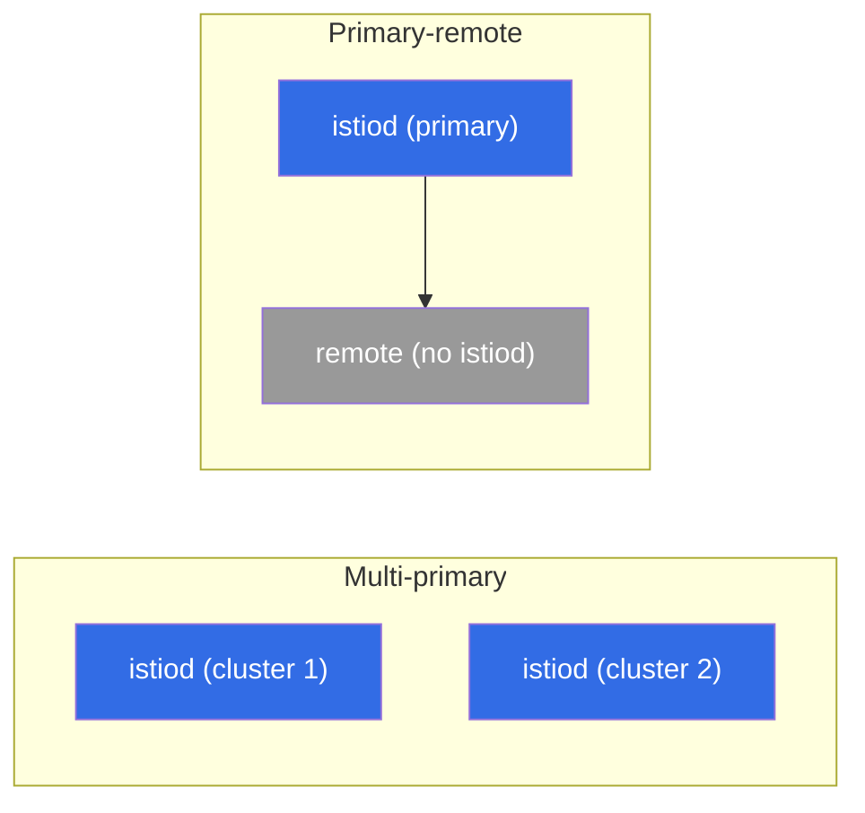

[RU version](ru.md) · [Versión en español](es.md) · [Version française](fr.md) · [Deutsche Version](de.md)

# Chapter 28. Multi-cluster mesh

> **What's next.** So far we have had a single cluster. But in production you often need several:
> for fault tolerance, geography, isolation or capacity. Istio can join several clusters into a
> **single mesh** - services from different clusters see each other and talk over mTLS as if they
> were next to each other. In this chapter we cover how it works and what models there are.

## 28.1. Why multi-cluster

A single cluster is a single point of failure and a limit on scale/geography. Several clusters in
one mesh give:

- **Fault tolerance.** A cluster or zone goes down - traffic moves to another cluster.
- **Geography.** Clusters closer to users in different regions.
- **Isolation.** Separation by teams, environments, security requirements.
- **Capacity.** Getting around a single cluster's limits.

The key idea: services in different clusters must see each other and trust each other, as within a
single mesh. For this three things are needed: shared trust, service discovery between clusters, and
network connectivity.

## 28.2. Shared trust - the foundation

The first and mandatory condition: all clusters must **trust a common root**. mTLS between services
(chapter 13) works only if their certificates are issued from a single root CA. Each cluster has its
own self-signed istiod - there will be no shared trust, and cross-cluster traffic will not
establish.

Therefore multi-cluster is **impossible without a common custom CA** (chapter 16). Hence the advice
from chapter 16: if there is even the slightest chance of multi-cluster, lay down the common CA right
away - otherwise you will have to migrate live clusters onto a common root.

## 28.3. Deployment models: primary-remote and multi-primary

By where the control plane lives, two models are distinguished.

- **Primary-remote.** One cluster (primary) holds istiod, and the others (remote) use it as an
  external control plane. Simpler on resources, but the primary becomes critical: its unavailability
  affects the remote clusters.
- **Multi-primary.** Each cluster has **its own** istiod, and they exchange information about
  services. More reliable (no single point of management), but harder to set up. This is the
  preferred option for a fault-tolerant production.



The model and membership in the common mesh are set at install time - via `global` in the
`IstioOperator`/Helm. The key fields: a single `meshID` for all clusters, a unique cluster name, and
the name of its network:

```yaml
apiVersion: install.istio.io/v1alpha1
kind: IstioOperator
metadata:
  name: istio-cluster1
spec:
  values:
    global:
      meshID: mesh1                # ONE mesh for all clusters
      multiCluster:
        clusterName: cluster1      # this cluster's unique name
      network: network1            # this cluster's network name (see 28.4)
```

In the neighboring cluster the same `meshID`, but `clusterName: cluster2` and, if the network is
different, `network: network2`. Trust rests on the common root CA (28.2) and the same `trustDomain` -
without this cross-cluster mTLS will not establish.

> **Ambient and multi-cluster.** Everything in this chapter is described for sidecar mode.
> Multi-cluster for ambient (chapter 22) is, as of Istio ~1.24, still maturing and has limitations,
> so for a fault-tolerant production multi-cluster sidecars are currently the choice.

## 28.4. One network or several: the east-west gateway

The second dimension is network connectivity between clusters.

- **A single network (single network).** Pods of different clusters can reach each other directly by
  IP (a shared VPC/flat network). Simpler: cross-cluster traffic goes directly.
- **Several networks (multi-network).** Clusters in different networks, the pods do not see each
  other directly. Then cross-cluster traffic goes through an **east-west gateway** - a special
  ingress gateway for **intra-mesh** traffic between clusters (as opposed to the ordinary
  north-south ingress for external users).


The east-west gateway routes the encrypted traffic between clusters by SNI without decrypting it
(the end-to-end mTLS between services is preserved).

In practice, for multi-network the setup is as follows. First you label the cluster's network so
that istiod knows which endpoints are local and which are behind the gateway:

```bash
kubectl label namespace istio-system topology.istio.io/network=network1
```

Then you install the east-west gateway itself (a separate ingress gateway with the router role) and
open port `15443` on it in `AUTO_PASSTHROUGH` mode - it routes by SNI without opening up the mTLS:

```yaml
apiVersion: networking.istio.io/v1
kind: Gateway
metadata:
  name: cross-network-gateway
  namespace: istio-system
spec:
  selector:
    istio: eastwestgateway          # the east-west gateway pods
  servers:
  - port:
      number: 15443
      name: tls
      protocol: TLS
    tls:
      mode: AUTO_PASSTHROUGH        # do not decrypt, route by SNI
    hosts:
    - "*.local"                     # cross-cluster services (*.svc.cluster.local)
```

The east-west gateway itself is exposed via a Service of type LoadBalancer (on EKS - usually an
**internal NLB**, section 28.7). Its address is used by the neighboring cluster's istiod as the entry
point for traffic into this network.

## 28.5. Service discovery between clusters

For one cluster's istiod to know about another's services, it needs access to that cluster's API.
This is configured with a **remote secret** - istiod gets kubeconfig access to the neighboring
clusters:

```bash
istioctl create-remote-secret --name=cluster2 | kubectl apply -f - --context=cluster1
```

After this istiod in cluster 1 reads cluster 2's services and endpoints and adds them to the common
registry. For a service with the same name in both clusters, Istio merges the endpoints - and a
request may go to a pod in either cluster.

**Check your work.** That the cluster link is actually up is seen like this:

```bash
istioctl remote-clusters                     # does istiod see the neighboring clusters (synced?)
# the local service's endpoints now include addresses from the other cluster/network:
istioctl proxy-config endpoints <pod> -n app | grep <service>
# and finally a live test - a few requests, both clusters should respond:
kubectl exec <pod> -n app -- sh -c 'for i in $(seq 10); do curl -s http://<service>/hostname; done'
```

If `remote-clusters` does not show a neighbor, or `endpoints` has only local addresses - the problem
is in the remote secret (API access) or in the network/east-west gateway.

## 28.6. Balancing between clusters

When a service's endpoints are in several clusters, the question arises: where to send the request.
Here **locality-aware balancing** works again (chapter 7):

- in normal mode traffic stays in **its own** cluster/zone (less latency, less inter-zone/inter-region
  traffic - and a smaller cloud bill, chapter 27);
- on failure of the local endpoints a **failover** to another cluster kicks in.

This is exactly the fault tolerance of multi-cluster: locally fast, and on a problem the traffic
moves on its own to where the service is alive. As in chapter 7, `outlierDetection` is needed for
failover.

## 28.7. Multi-cluster on EKS/AWS

On EKS the abstract "network" and "access to a neighbor's API" turn into concrete AWS services. The
key points.

- **One network or several is about the VPC.** If the clusters are in one VPC or in different VPCs
  connected via **VPC peering / Transit Gateway** (a flat routable network with no CIDR overlap),
  the pods see each other directly - this is the **single-network** model, an east-west gateway is
  not needed. If the networks are isolated, you take **multi-network** with an east-west gateway.
- **The east-west gateway behind an internal NLB.** In multi-network the gateway is exposed via an
  **internal NLB** (`aws-load-balancer-scheme: internal`), not to the outside - inter-cluster traffic
  usually goes over the private network (peering/TGW), not through the internet.
- **The common CA in practice.** The root for all clusters is either an offline root with
  intermediates per cluster, or **AWS Private CA (ACM PCA)** via cert-manager + istio-csr (chapter
  16). The main thing is one root for the whole mesh.
- **Access to a neighboring cluster's API (remote secret) - a trap on EKS.** An EKS kubeconfig by
  default uses IAM authentication (`aws eks get-token`), and such a secret is tied to local AWS
  credentials - a neighboring cluster's istiod cannot use them. So for the remote secret one usually
  creates a dedicated ServiceAccount with a token and gives its identity access to the API (via
  `aws-auth`/**EKS access entries**). That is, inter-cluster discovery on EKS requires both network
  access to the API endpoint and a correct IAM/RBAC binding.
- **Cross-region - expensive and slow.** Inter-region traffic is charged more than inter-zone and
  adds latency (chapter 27). Keep interacting services in one region, and use multi-region for
  geo fault tolerance, not for constant cross-region calls. Cross-account schemes (shared subnets via
  **AWS RAM**) add another layer of network and IAM coordination.

## 28.8. Best practices

- **A common CA from the very start.** Without a common root multi-cluster is impossible; lay it down
  at the start (chapter 16), do not migrate later.
- **Multi-primary for fault tolerance.** No single point of management; primary-remote is simpler,
  but the primary becomes critical.
- **Locality-aware + failover.** Keep traffic local for latency and cost, switch between clusters
  only on failure.
- **Watch the inter-cluster/inter-zone traffic.** It is paid and slower than local - design so that
  cross-cluster calls are the exception, not the norm.
- **Uniformity of versions and configuration.** Different Istio versions in the clusters of one mesh
  are a source of subtle bugs; keep them consistent and upgrade in a coordinated way.
- **Observability across the whole mesh.** Metrics and traces must be collected from all clusters
  into a single picture (chapters 17-18), otherwise diagnosing cross-cluster problems becomes hell.
- **Start simple.** A single cluster while it copes. Multi-cluster adds a lot of complexity -
  introduce it for a concrete need (HA, geo, isolation).

## 28.9. Chapter summary

- A multi-cluster mesh joins several clusters: services see each other and talk over mTLS as in one
  mesh.
- Three things are needed: **shared trust** (a common root CA), **service discovery** between
  clusters (a remote secret) and **network connectivity**.
- Models by control plane: **primary-remote** (one istiod for all, simpler, but the primary is
  critical) and **multi-primary** (its own istiod in each, more reliable).
- Membership in the mesh is set at install time: a common `meshID`, a unique `clusterName` and a
  `network` in the `IstioOperator`/Helm; the cluster's network is labeled `topology.istio.io/network`.
- Networking: **a single network** (pods see each other directly) or **several networks** (traffic
  through an **east-west gateway**, port 15443, `AUTO_PASSTHROUGH` by SNI with mTLS preserved).
- Balancing between clusters is **locality-aware** with failover (chapter 7); locally fast and cheap,
  cross-cluster on failure.
- On EKS: single-network via VPC peering/Transit Gateway, multi-network via an east-west gateway
  behind an **internal NLB**; the common CA via ACM PCA; the remote secret requires an SA token +
  IAM/RBAC access to the API (not an IAM kubeconfig); cross-region is expensive and slow.
- Verifying the link: `istioctl remote-clusters`, cross-cluster endpoints in `proxy-config`, a live
  `curl` (both clusters respond).
- Best practices: a common CA in advance, multi-primary for HA, minimal inter-cluster traffic (it is
  paid), uniform versions, end-to-end observability, do not over-complicate without need.

## 28.10. Self-check questions

1. Why is a multi-cluster mesh needed and what problems does it solve?
2. Why is multi-cluster impossible without a common root CA?
3. How do the primary-remote and multi-primary models differ?
4. When is an east-west gateway needed and how does it differ from an ordinary ingress? What are
   `AUTO_PASSTHROUGH` and port 15443?
5. Which fields (`meshID`, `clusterName`, `network`) set a cluster's membership in the common mesh?
6. How is traffic balanced between clusters and what does the cloud cost have to do with it?
7. How are single-network (VPC peering/TGW) and multi-network (east-west behind an internal NLB) set
   up on EKS?
8. Why does a remote secret on EKS not work with an ordinary IAM kubeconfig, and what is done
   instead?
9. How do you check that the clusters have actually joined into one mesh?

## Practice

Practice multi-cluster hands-on: a common CA, multi-primary/multi-network, an east-west gateway,
cross-cluster discovery via remote secrets, and inter-cluster balancing.

🧪 Lab 35: [tasks/ica/labs/35](../../labs/35/README.MD)

---
[Contents](../README.md) · [Chapter 27](../27/en.md) · [Chapter 29](../29/en.md)
