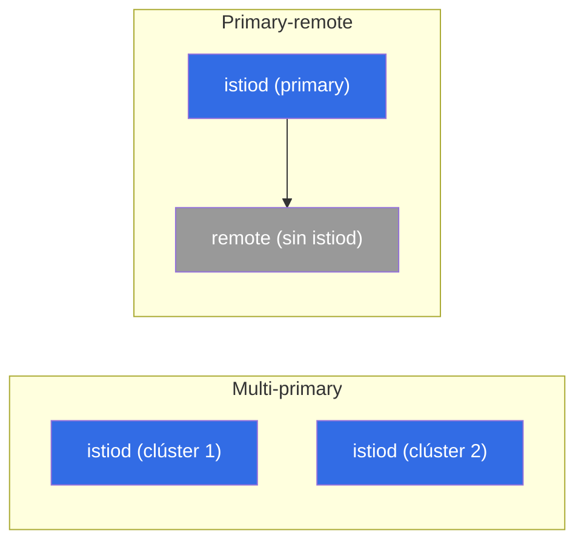

[RU version](ru.md) · [Eng version](en.md) · [Version française](fr.md) · [Deutsche Version](de.md)

# Capítulo 28. Malla multiclúster

> **Qué sigue.** Hasta ahora hemos tenido un único clúster. Pero en producción a menudo necesitas
> varios: por tolerancia a fallos, geografía, aislamiento o capacidad. Istio puede unir varios
> clústeres en una **única malla** - los servicios de distintos clústeres se ven entre sí y hablan
> por mTLS como si estuvieran uno al lado del otro. En este capítulo cubrimos cómo funciona y qué
> modelos hay.

## 28.1. Por qué multiclúster

Un único clúster es un punto único de fallo y un límite a la escala/geografía. Varios clústeres en
una malla dan:

- **Tolerancia a fallos.** Un clúster o zona cae - el tráfico se mueve a otro clúster.
- **Geografía.** Clústeres más cerca de los usuarios en distintas regiones.
- **Aislamiento.** Separación por equipos, entornos, requisitos de seguridad.
- **Capacidad.** Sortear los límites de un único clúster.

La idea clave: los servicios de distintos clústeres deben verse entre sí y confiar el uno en el otro,
como dentro de una única malla. Para esto hacen falta tres cosas: confianza compartida, service
discovery entre clústeres y conectividad de red.

## 28.2. Confianza compartida - la base

La primera y obligatoria condición: todos los clústeres deben **confiar en una raíz común**. El mTLS
entre servicios (capítulo 13) funciona solo si sus certificados se emiten desde una única CA raíz.
Cada clúster tiene su propio istiod autofirmado - no habrá confianza compartida, y el tráfico
entre clústeres no se establecerá.

Por tanto multiclúster es **imposible sin una CA personalizada común** (capítulo 16). De ahí el
consejo del capítulo 16: si hay la más mínima posibilidad de multiclúster, sienta la CA común de
entrada - de lo contrario tendrás que migrar clústeres en vivo a una raíz común.

## 28.3. Modelos de despliegue: primary-remote y multi-primary

Según dónde vive el control plane, se distinguen dos modelos.

- **Primary-remote.** Un clúster (primary) contiene istiod, y los demás (remote) lo usan como un
  control plane externo. Más simple en recursos, pero el primary se vuelve crítico: su
  indisponibilidad afecta a los clústeres remote.
- **Multi-primary.** Cada clúster tiene **su propio** istiod, e intercambian información sobre los
  servicios. Más fiable (sin punto único de gestión), pero más difícil de montar. Esta es la opción
  preferida para una producción tolerante a fallos.



El modelo y la pertenencia a la malla común se establecen en el momento de la instalación - vía
`global` en el `IstioOperator`/Helm. Los campos clave: un único `meshID` para todos los clústeres, un
nombre único de clúster, y el nombre de su red:

```yaml
apiVersion: install.istio.io/v1alpha1
kind: IstioOperator
metadata:
  name: istio-cluster1
spec:
  values:
    global:
      meshID: mesh1                # UNA malla para todos los clústeres
      multiCluster:
        clusterName: cluster1      # el nombre único de este clúster
      network: network1            # el nombre de la red de este clúster (ver 28.4)
```

En el clúster vecino el mismo `meshID`, pero `clusterName: cluster2` y, si la red es distinta,
`network: network2`. La confianza reposa sobre la CA raíz común (28.2) y el mismo `trustDomain` - sin
esto el mTLS entre clústeres no se establecerá.

> **Ambient y multiclúster.** Todo en este capítulo está descrito para el modo sidecar. El
> multiclúster para ambient (capítulo 22), a fecha de Istio ~1.24, todavía está madurando y tiene
> limitaciones, así que para una producción tolerante a fallos los sidecars multiclúster son
> actualmente la elección.

## 28.4. Una red o varias: el east-west gateway

La segunda dimensión es la conectividad de red entre clústeres.

- **Una única red (single network).** Los pods de distintos clústeres pueden alcanzarse directamente
  por IP (una VPC/red plana compartida). Más simple: el tráfico entre clústeres va directamente.
- **Varias redes (multi-network).** Clústeres en distintas redes, los pods no se ven directamente.
  Entonces el tráfico entre clústeres va a través de un **east-west gateway** - un ingress gateway
  especial para tráfico **dentro de la malla** entre clústeres (a diferencia del ingress
  north-south ordinario para usuarios externos).


El east-west gateway enruta el tráfico cifrado entre clústeres por SNI sin descifrarlo (el mTLS de
extremo a extremo entre servicios se preserva).

En la práctica, para multi-network la configuración es la siguiente. Primero etiquetas la red del
clúster para que istiod sepa qué endpoints son locales y cuáles están detrás del gateway:

```bash
kubectl label namespace istio-system topology.istio.io/network=network1
```

Luego instalas el propio east-west gateway (un ingress gateway aparte con el rol de router) y abres
el puerto `15443` en él en modo `AUTO_PASSTHROUGH` - enruta por SNI sin abrir el mTLS:

```yaml
apiVersion: networking.istio.io/v1
kind: Gateway
metadata:
  name: cross-network-gateway
  namespace: istio-system
spec:
  selector:
    istio: eastwestgateway          # los pods del east-west gateway
  servers:
  - port:
      number: 15443
      name: tls
      protocol: TLS
    tls:
      mode: AUTO_PASSTHROUGH        # no descifrar, enrutar por SNI
    hosts:
    - "*.local"                     # servicios entre clústeres (*.svc.cluster.local)
```

El propio east-west gateway se expone vía un Service de tipo LoadBalancer (en EKS - normalmente un
**NLB interno**, sección 28.7). Su dirección la usa el istiod del clúster vecino como el punto de
entrada para el tráfico hacia esta red.

## 28.5. Service discovery entre clústeres

Para que el istiod de un clúster conozca los servicios de otro, necesita acceso a la API de ese
clúster. Esto se configura con un **remote secret** - istiod obtiene acceso kubeconfig a los
clústeres vecinos:

```bash
istioctl create-remote-secret --name=cluster2 | kubectl apply -f - --context=cluster1
```

Tras esto istiod en el clúster 1 lee los servicios y endpoints del clúster 2 y los añade al registro
común. Para un servicio con el mismo nombre en ambos clústeres, Istio fusiona los endpoints - y una
petición puede ir a un pod en cualquiera de los dos clústeres.

**Comprueba tu trabajo.** Que el enlace entre clústeres está realmente arriba se ve así:

```bash
istioctl remote-clusters                     # ¿ve istiod los clústeres vecinos (synced?)
# los endpoints del servicio local ahora incluyen direcciones del otro clúster/red:
istioctl proxy-config endpoints <pod> -n app | grep <service>
# y finalmente una prueba en vivo - unas cuantas peticiones, ambos clústeres deberían responder:
kubectl exec <pod> -n app -- sh -c 'for i in $(seq 10); do curl -s http://<service>/hostname; done'
```

Si `remote-clusters` no muestra un vecino, o `endpoints` tiene solo direcciones locales - el problema
está en el remote secret (acceso a la API) o en la red/east-west gateway.

## 28.6. Balanceo entre clústeres

Cuando los endpoints de un servicio están en varios clústeres, surge la pregunta: a dónde enviar la
petición. Aquí funciona de nuevo el **balanceo consciente de la localidad** (capítulo 7):

- en modo normal el tráfico se queda en **su propio** clúster/zona (menos latencia, menos tráfico
  inter-zona/inter-región - y una factura de nube menor, capítulo 27);
- ante un fallo de los endpoints locales entra en juego un **failover** a otro clúster.

Esto es exactamente la tolerancia a fallos del multiclúster: localmente rápido, y ante un problema el
tráfico se mueve por sí mismo a donde el servicio está vivo. Como en el capítulo 7, hace falta
`outlierDetection` para el failover.

## 28.7. Multiclúster en EKS/AWS

En EKS la "red" abstracta y el "acceso a la API de un vecino" se convierten en servicios concretos de
AWS. Los puntos clave.

- **Una red o varias es sobre la VPC.** Si los clústeres están en una VPC o en distintas VPCs
  conectadas vía **VPC peering / Transit Gateway** (una red plana enrutable sin solapamiento de
  CIDR), los pods se ven directamente - este es el modelo **single-network**, un east-west gateway no
  es necesario. Si las redes están aisladas, tomas **multi-network** con un east-west gateway.
- **El east-west gateway detrás de un NLB interno.** En multi-network el gateway se expone vía un
  **NLB interno** (`aws-load-balancer-scheme: internal`), no hacia el exterior - el tráfico entre
  clústeres normalmente va por la red privada (peering/TGW), no a través de internet.
- **La CA común en la práctica.** La raíz para todos los clústeres es o bien una raíz offline con
  intermedias por clúster, o bien **AWS Private CA (ACM PCA)** vía cert-manager + istio-csr (capítulo
  16). Lo principal es una raíz para toda la malla.
- **Acceso a la API de un clúster vecino (remote secret) - una trampa en EKS.** Un kubeconfig de EKS
  por defecto usa autenticación IAM (`aws eks get-token`), y un secret así está atado a credenciales
  AWS locales - el istiod de un clúster vecino no puede usarlas. Así que para el remote secret
  normalmente se crea un ServiceAccount dedicado con un token y se da a su identidad acceso a la API
  (vía `aws-auth`/**EKS access entries**). Es decir, el discovery entre clústeres en EKS requiere
  tanto acceso de red al endpoint de la API como un binding IAM/RBAC correcto.
- **Cross-region - caro y lento.** El tráfico inter-región se cobra más que el inter-zona y añade
  latencia (capítulo 27). Mantén los servicios que interactúan en una región, y usa multi-región para
  la tolerancia a fallos geográfica, no para llamadas cross-region constantes. Los esquemas
  cross-account (subnets compartidas vía **AWS RAM**) añaden otra capa de coordinación de red e IAM.

## 28.8. Buenas prácticas

- **Una CA común desde el principio del todo.** Sin una raíz común el multiclúster es imposible;
  siéntala al inicio (capítulo 16), no migres después.
- **Multi-primary para la tolerancia a fallos.** Sin punto único de gestión; primary-remote es más
  simple, pero el primary se vuelve crítico.
- **Locality-aware + failover.** Mantén el tráfico local por latencia y coste, cambia entre clústeres
  solo ante un fallo.
- **Vigila el tráfico entre clústeres/inter-zona.** Es de pago y más lento que el local - diseña para
  que las llamadas entre clústeres sean la excepción, no la norma.
- **Uniformidad de versiones y configuración.** Distintas versiones de Istio en los clústeres de una
  malla son fuente de bugs sutiles; mantenlas consistentes y actualiza de forma coordinada.
- **Observabilidad en toda la malla.** Las métricas y trazas deben recogerse de todos los clústeres en
  una única imagen (capítulos 17-18), de lo contrario diagnosticar problemas entre clústeres se
  vuelve un infierno.
- **Empieza simple.** Un único clúster mientras aguante. Multiclúster añade mucha complejidad -
  introdúcelo por una necesidad concreta (HA, geo, aislamiento).

## 28.9. Resumen del capítulo

- Una malla multiclúster une varios clústeres: los servicios se ven entre sí y hablan por mTLS como en
  una sola malla.
- Hacen falta tres cosas: **confianza compartida** (una CA raíz común), **service discovery** entre
  clústeres (un remote secret) y **conectividad de red**.
- Modelos por control plane: **primary-remote** (un istiod para todos, más simple, pero el primary es
  crítico) y **multi-primary** (su propio istiod en cada uno, más fiable).
- La pertenencia a la malla se establece en el momento de la instalación: un `meshID` común, un
  `clusterName` único y una `network` en el `IstioOperator`/Helm; la red del clúster se etiqueta
  `topology.istio.io/network`.
- Red: **una única red** (los pods se ven directamente) o **varias redes** (tráfico a través de un
  **east-west gateway**, puerto 15443, `AUTO_PASSTHROUGH` por SNI con el mTLS preservado).
- El balanceo entre clústeres es **locality-aware** con failover (capítulo 7); localmente rápido y
  barato, entre clústeres ante un fallo.
- En EKS: single-network vía VPC peering/Transit Gateway, multi-network vía un east-west gateway
  detrás de un **NLB interno**; la CA común vía ACM PCA; el remote secret requiere un token de SA +
  acceso IAM/RBAC a la API (no un kubeconfig IAM); cross-region es caro y lento.
- Verificar el enlace: `istioctl remote-clusters`, endpoints entre clústeres en `proxy-config`, un
  `curl` en vivo (ambos clústeres responden).
- Buenas prácticas: una CA común de antemano, multi-primary para HA, tráfico mínimo entre clústeres
  (es de pago), versiones uniformes, observabilidad de extremo a extremo, no compliques de más sin
  necesidad.

## 28.10. Preguntas de autoevaluación

1. ¿Por qué se necesita una malla multiclúster y qué problemas resuelve?
2. ¿Por qué es imposible el multiclúster sin una CA raíz común?
3. ¿En qué se diferencian los modelos primary-remote y multi-primary?
4. ¿Cuándo se necesita un east-west gateway y en qué se diferencia de un ingress ordinario? ¿Qué son
   `AUTO_PASSTHROUGH` y el puerto 15443?
5. ¿Qué campos (`meshID`, `clusterName`, `network`) establecen la pertenencia de un clúster a la
   malla común?
6. ¿Cómo se balancea el tráfico entre clústeres y qué tiene que ver el coste de la nube con ello?
7. ¿Cómo se montan single-network (VPC peering/TGW) y multi-network (east-west detrás de un NLB
   interno) en EKS?
8. ¿Por qué un remote secret en EKS no funciona con un kubeconfig IAM ordinario, y qué se hace en su
   lugar?
9. ¿Cómo compruebas que los clústeres realmente se han unido en una sola malla?

## Práctica

Practica multiclúster de forma práctica: una CA común, multi-primary/multi-network, un east-west
gateway, discovery entre clústeres vía remote secrets, y balanceo entre clústeres.

🧪 Laboratorio 35: [tasks/ica/labs/35](../../labs/35/README_ES.MD)

---
[Índice](../README_ES.md) · [Capítulo 27](../27/es.md) · [Capítulo 29](../29/es.md)
