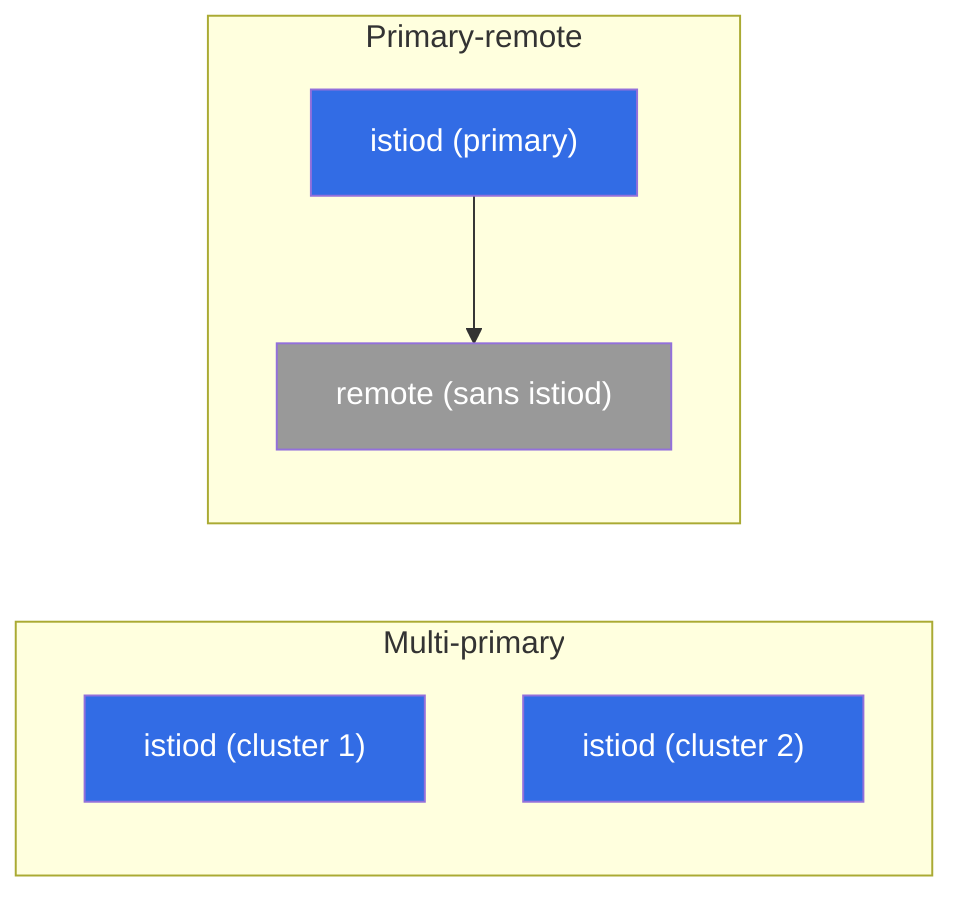

[RU version](ru.md) · [Eng version](en.md) · [Versión en español](es.md) · [Deutsche Version](de.md)

# Chapitre 28. Maillage multi-cluster

> **La suite.** Jusqu'ici, nous avions un seul cluster. Mais en prod, on en a souvent besoin de
> plusieurs : pour la tolérance aux pannes, la géographie, l'isolation ou la capacité. Istio
> sait réunir plusieurs clusters en un **maillage unique** - les services de différents clusters
> se voient les uns les autres et communiquent en mTLS, comme s'ils étaient côte à côte. Dans ce
> chapitre, nous verrons comment cela fonctionne et quels sont les modèles disponibles.

## 28.1. Pourquoi le multi-cluster

Un seul cluster est un point de défaillance unique et une limite en matière de
capacité/géographie. Plusieurs clusters dans un même maillage apportent :

- **Tolérance aux pannes.** Un cluster ou une zone tombe - le trafic part vers un autre cluster.
- **Géographie.** Des clusters plus proches des utilisateurs dans différentes régions.
- **Isolation.** Séparation par équipes, environnements, exigences de sécurité.
- **Capacité.** Contournement des limites d'un seul cluster.

Idée clé : les services de différents clusters doivent se voir et se faire confiance, comme au
sein d'un même maillage. Pour cela, il faut trois choses : un trust commun, la découverte des
services entre clusters et la connectivité réseau.

## 28.2. Le trust commun - le fondement

Première condition, obligatoire : tous les clusters doivent **faire confiance à une racine
commune**. Le mTLS entre services (chapitre 13) ne fonctionne que si leurs certificats sont émis
depuis un même CA racine. Chaque cluster a son propre istiod auto-signé - il n'y aura pas de
confiance commune, et le trafic cross-cluster ne s'établira pas.

C'est pourquoi le multi-cluster est **impossible sans un CA personnalisé commun** (chapitre 16).
D'où le conseil du chapitre 16 : s'il y a la moindre probabilité de multi-cluster, posez un CA
commun dès le départ - sinon il faudra migrer des clusters vivants vers une racine commune.

## 28.3. Modèles de déploiement : primary-remote et multi-primary

Selon l'endroit où vit le control plane, on distingue deux modèles.

- **Primary-remote.** Un cluster (primary) héberge istiod, et les autres (remote) l'utilisent
  comme control plane externe. Plus économe en ressources, mais le primary devient critique : son
  indisponibilité affecte les clusters remote.
- **Multi-primary.** Chaque cluster a **son propre** istiod, et ils échangent des informations
  sur les services. Plus fiable (pas de point de gestion unique), mais plus complexe à
  configurer. C'est la variante préférée pour une prod tolérante aux pannes.



Le modèle et l'appartenance au maillage commun se définissent à l'installation - via `global`
dans l'`IstioOperator`/Helm. Champs clés : un `meshID` unique pour tous les clusters, un nom de
cluster unique et le nom de son réseau :

```yaml
apiVersion: install.istio.io/v1alpha1
kind: IstioOperator
metadata:
  name: istio-cluster1
spec:
  values:
    global:
      meshID: mesh1                # UN seul maillage pour tous les clusters
      multiCluster:
        clusterName: cluster1      # nom unique de ce cluster
      network: network1            # nom du réseau de ce cluster (voir 28.4)
```

Dans le cluster voisin, le même `meshID`, mais `clusterName: cluster2` et, si le réseau est
différent, `network: network2`. La confiance repose sur un CA racine commun (28.2) et un même
`trustDomain` - sans cela, le mTLS cross-cluster ne s'établira pas.

> **Ambient et multi-cluster.** Tout dans ce chapitre est décrit pour le mode sidecar. Le
> multi-cluster pour ambient (chapitre 22) est encore en cours de maturation à l'heure d'Istio
> ~1.24 et présente des limitations, c'est pourquoi, pour un multi-cluster prod tolérant aux
> pannes, on prend actuellement justement les sidecars.

## 28.4. Un seul réseau ou plusieurs : east-west gateway

La deuxième dimension - la connectivité réseau entre clusters.

- **Un seul réseau (single network).** Les pods de différents clusters peuvent s'atteindre
  directement par IP (VPC commun/réseau plat). Plus simple : le trafic cross-cluster passe
  directement.
- **Plusieurs réseaux (multi-network).** Les clusters sont dans des réseaux différents, les pods
  ne se voient pas directement. Le trafic cross-cluster passe alors par une **east-west gateway**
  - un ingress-gateway spécial pour le trafic **interne au maillage** entre clusters (à la
  différence de l'ingress north-south habituel pour les utilisateurs externes).


L'east-west gateway route le trafic chiffré entre clusters par SNI, sans le déchiffrer (le mTLS
de bout en bout entre services est préservé).

En pratique, pour du multi-network, la configuration est la suivante. On marque d'abord le réseau
du cluster, pour qu'istiod sache quels endpoints sont locaux et lesquels sont derrière la gateway :

```bash
kubectl label namespace istio-system topology.istio.io/network=network1
```

Ensuite, on installe l'east-west gateway elle-même (un ingress-gateway distinct avec le rôle
router) et on y ouvre le port `15443` en mode `AUTO_PASSTHROUGH` - il route par SNI, sans ouvrir
le mTLS :

```yaml
apiVersion: networking.istio.io/v1
kind: Gateway
metadata:
  name: cross-network-gateway
  namespace: istio-system
spec:
  selector:
    istio: eastwestgateway          # pods de la gateway east-west
  servers:
  - port:
      number: 15443
      name: tls
      protocol: TLS
    tls:
      mode: AUTO_PASSTHROUGH        # ne pas déchiffrer, router par SNI
    hosts:
    - "*.local"                     # services cross-cluster (*.svc.cluster.local)
```

L'east-west gateway elle-même se publie via un service de type LoadBalancer (sur EKS -
généralement un **NLB interne**, section 28.7). Son adresse est utilisée par l'istiod du cluster
voisin comme point d'entrée pour le trafic vers ce réseau.

## 28.5. Découverte des services entre clusters

Pour que l'istiod d'un cluster connaisse les services d'un autre, il lui faut un accès à l'API de
ce cluster. Cela se configure via un **remote secret** - istiod obtient un accès kubeconfig aux
clusters voisins :

```bash
istioctl create-remote-secret --name=cluster2 | kubectl apply -f - --context=cluster1
```

Après cela, l'istiod du cluster 1 lit les services et endpoints du cluster 2 et les ajoute au
registre commun. Pour un service portant le même nom dans les deux clusters, Istio fusionne les
endpoints - et une requête peut partir vers un pod de n'importe lequel des clusters.

**Vérifie ton travail.** Que la liaison des clusters est bien montée se voit ainsi :

```bash
istioctl remote-clusters                     # istiod voit les clusters voisins (synced?)
# dans les endpoints du service local, des adresses d'un autre cluster/réseau sont apparues :
istioctl proxy-config endpoints <pod> -n app | grep <service>
# et enfin le test réel - plusieurs requêtes, les deux clusters doivent répondre :
kubectl exec <pod> -n app -- sh -c 'for i in $(seq 10); do curl -s http://<service>/hostname; done'
```

Si `remote-clusters` ne montre pas le voisin, ou si dans `endpoints` il n'y a que des adresses
locales - le problème est dans le remote secret (accès à l'API) ou dans le réseau/l'east-west
gateway.

## 28.6. Répartition de charge entre clusters

Quand les endpoints d'un service existent dans plusieurs clusters, se pose la question : où
envoyer la requête. Ici, c'est de nouveau la **répartition de charge locality-aware**
(chapitre 7) qui joue :

- en mode normal, le trafic reste dans **son propre** cluster/zone (moins de latence, moins de
  trafic inter-zone/inter-région - et une facture cloud moindre, chapitre 27) ;
- en cas de défaillance des endpoints locaux, un **failover** se déclenche vers un autre cluster.

C'est là la tolérance aux pannes du multi-cluster : rapide localement, et en cas de problème le
trafic part de lui-même là où le service est vivant. Comme au chapitre 7, le failover nécessite
`outlierDetection`.

## 28.7. Multi-cluster sur EKS/AWS

Sur EKS, les notions abstraites de « réseau » et d'« accès à l'API du voisin » se transforment en
services AWS concrets. Points clés.

- **Un seul réseau ou plusieurs - c'est une affaire de VPC.** Si les clusters sont dans un même
  VPC ou dans des VPC différents reliés via **VPC peering / Transit Gateway** (réseau plat
  routable sans chevauchement de CIDR), les pods se voient directement - c'est le modèle
  **single-network**, l'east-west gateway n'est pas nécessaire. Si les réseaux sont isolés, on
  prend du **multi-network** avec east-west gateway.
- **East-west gateway derrière un NLB interne.** En multi-network, on publie la gateway via un
  **NLB interne** (`aws-load-balancer-scheme: internal`), et non vers l'extérieur - le trafic
  inter-cluster passe généralement par le réseau privé (peering/TGW), et non par internet.
- **CA commun en pratique.** La racine pour tous les clusters est soit une racine offline avec
  des intermédiaires par cluster, soit **AWS Private CA (ACM PCA)** via cert-manager + istio-csr
  (chapitre 16). L'essentiel - une seule racine pour tout le maillage.
- **Accès à l'API du cluster voisin (remote secret) - un piège sur EKS.** Le kubeconfig d'EKS
  utilise par défaut l'authentification IAM (`aws eks get-token`), et un tel secret est lié aux
  credentials AWS locaux - l'istiod du cluster voisin ne pourra pas les utiliser. C'est pourquoi,
  pour le remote secret, on crée généralement un ServiceAccount distinct avec un token et on
  donne à son identity l'accès à l'API (via `aws-auth`/**EKS access entries**). Autrement dit, la
  découverte inter-cluster sur EKS exige à la fois un accès réseau à l'endpoint de l'API et une
  liaison IAM/RBAC correcte.
- **Cross-region - cher et lent.** Le trafic inter-région est facturé plus cher que
  l'inter-zone et ajoute de la latence (chapitre 27). Gardez les services qui interagissent dans
  une même région, et utilisez le multi-région pour la tolérance aux pannes géographique, pas
  pour des appels cross-region permanents. Les schémas cross-account (sous-réseaux partagés via
  **AWS RAM**) ajoutent une couche supplémentaire de coordination réseau et IAM.

## 28.8. Best practices

- **CA commun - dès le début.** Sans racine commune, le multi-cluster est impossible ; posez-le
  au démarrage (chapitre 16), ne migrez pas ensuite.
- **Multi-primary pour la tolérance aux pannes.** Pas de point de gestion unique ; primary-remote
  est plus simple, mais le primary devient critique.
- **Locality-aware + failover.** Gardez le trafic local pour la latence et le coût, ne basculez
  entre clusters qu'en cas de défaillance.
- **Surveillez le trafic inter-cluster/inter-zone.** Il est payant et plus lent que le local -
  concevez de façon à ce que les appels cross-cluster soient l'exception, pas la norme.
- **Uniformité des versions et de la configuration.** Des versions d'Istio différentes dans les
  clusters d'un même maillage sont source de bugs subtils ; gardez-les cohérentes et mettez-les à
  jour de manière coordonnée.
- **Observabilité sur tout le maillage.** Les métriques et les traces doivent être collectées
  depuis tous les clusters en une image unifiée (chapitres 17-18), sinon le diagnostic des
  problèmes cross-cluster devient un enfer.
- **Commencez simple.** Un seul cluster, tant qu'il suffit. Le multi-cluster ajoute beaucoup de
  complexité - introduisez-le pour un besoin concret (HA, géo, isolation).

## 28.9. Résumé du chapitre

- Un maillage multi-cluster réunit plusieurs clusters : les services se voient les uns les autres
  et communiquent en mTLS comme dans un seul maillage.
- Trois choses sont nécessaires : un **trust commun** (CA racine commun), la **découverte des
  services** entre clusters (remote secret) et la **connectivité réseau**.
- Modèles selon le control plane : **primary-remote** (un seul istiod pour tous, plus simple,
  mais le primary est critique) et **multi-primary** (un istiod dans chacun, plus fiable).
- L'appartenance au maillage se définit à l'installation : `meshID` commun, `clusterName` unique
  et `network` dans l'`IstioOperator`/Helm ; le réseau du cluster se marque avec
  `topology.istio.io/network`.
- Réseau : **un seul réseau** (les pods se voient directement) ou **plusieurs réseaux** (le
  trafic passe par une **east-west gateway**, port 15443, `AUTO_PASSTHROUGH` par SNI avec
  préservation du mTLS).
- La répartition de charge entre clusters est **locality-aware** avec failover (chapitre 7) ;
  rapide et peu coûteux localement, cross-cluster en cas de défaillance.
- Sur EKS : single-network via VPC peering/Transit Gateway, multi-network via east-west derrière
  un **NLB interne** ; CA commun via ACM PCA ; le remote secret exige un token de SA + un accès
  IAM/RBAC à l'API (pas un kubeconfig IAM) ; le cross-region est cher et lent.
- Vérification de la liaison : `istioctl remote-clusters`, endpoints cross-cluster dans
  `proxy-config`, `curl` réel (les deux clusters répondent).
- Best practices : CA commun à l'avance, multi-primary pour la HA, minimum de trafic
  inter-cluster (il est payant), versions uniformes, observabilité de bout en bout, ne pas
  complexifier sans nécessité.

## 28.10. Questions d'auto-évaluation

1. Pourquoi a-t-on besoin d'un maillage multi-cluster et quels problèmes résout-il ?
2. Pourquoi le multi-cluster est-il impossible sans un CA racine commun ?
3. En quoi diffèrent les modèles primary-remote et multi-primary ?
4. Quand a-t-on besoin d'une east-west gateway et en quoi diffère-t-elle d'un ingress ordinaire ?
   Qu'est-ce qu'`AUTO_PASSTHROUGH` et le port 15443 ?
5. Par quels champs (`meshID`, `clusterName`, `network`) définit-on l'appartenance d'un cluster
   au maillage commun ?
6. Comment le trafic est-il réparti entre clusters et quel est le rapport avec le coût du cloud ?
7. Comment sont structurés sur EKS le single-network (VPC peering/TGW) et le multi-network
   (east-west derrière un NLB interne) ?
8. Pourquoi le remote secret sur EKS ne fonctionne-t-il pas avec un kubeconfig IAM ordinaire et
   que fait-on à la place ?
9. Comment vérifier que les clusters se sont réellement réunis en un seul maillage ?

## Pratique

Entraînez-vous au multi-cluster en pratique : CA commun, multi-primary/multi-network, east-west
gateway, découverte cross-cluster via des remote secrets et répartition de charge inter-cluster.

🧪 Lab 35 : [tasks/ica/labs/35](../../labs/35/README_FR.MD)

---
[Table des matières](../README_FR.md) · [Chapitre 27](../27/fr.md) · [Chapitre 29](../29/fr.md)
