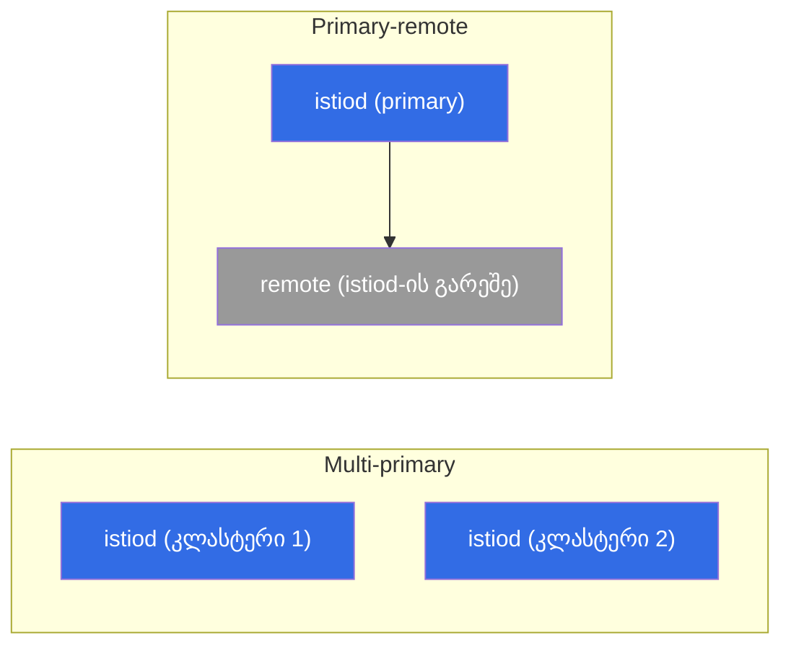

[Русская версия](ru.md) · [Eng version](en.md) · [Versión en español](es.md) · [Version française](fr.md) · [Deutsche Version](de.md) · [繁體中文版](tw.md) · [日本語版](jp.md)

# თავი 28. მულტიკლასტერული mesh

> **რა არის შემდეგ.** აქამდე ერთი კლასტერი გვქონდა. თუმცა production-ში ხშირად რამდენიმეა საჭირო:
> მტყუნებამედეგობისთვის, გეოგრაფიული განაწილებისთვის, იზოლაციისთვის ან სიმძლავრისთვის. Istio-ს შეუძლია
> რამდენიმე კლასტერის **ერთიან mesh-ში** გაერთიანება - სხვადასხვა კლასტერის სერვისები ერთმანეთს ხედავენ და
> mTLS-ით ურთიერთობენ, თითქოს გვერდიგვერდ იყვნენ. ამ თავში განვიხილავთ, როგორ არის ეს მოწყობილი და რა
> მოდელები არსებობს.

## 28.1. რატომ გვჭირდება მულტიკლასტერი

ერთი კლასტერი მარცხის ერთიანი წერტილი და მასშტაბის/გეოგრაფიის ზღვარია. ერთ mesh-ში რამდენიმე
კლასტერი გვაძლევს:

- **მტყუნებამედეგობას.** კლასტერი ან ზონა გაითიშა - ტრაფიკი სხვა კლასტერში გადადის.
- **გეოგრაფიულ განაწილებას.** კლასტერები სხვადასხვა რეგიონში მომხმარებლებთან უფრო ახლოსაა.
- **იზოლაციას.** დაყოფა გუნდების, გარემოებისა და უსაფრთხოების მოთხოვნების მიხედვით.
- **სიმძლავრეს.** ერთი კლასტერის ლიმიტების გვერდის ავლას.

ძირითადი იდეა: სხვადასხვა კლასტერში არსებულმა სერვისებმა ერთმანეთი ისე უნდა დაინახონ და
ერთმანეთს ისე უნდა ენდონ, როგორც ერთი mesh-ის შიგნით. ამისთვის სამი რამაა საჭირო: საერთო trust,
კლასტერებს შორის სერვისების აღმოჩენა და ქსელური კავშირი.

## 28.2. საერთო trust - საფუძველი

პირველი და აუცილებელი პირობა: ყველა კლასტერი **საერთო root-ს უნდა ენდობოდეს**. სერვისებს შორის
mTLS (თავი 13) მხოლოდ მაშინ მუშაობს, როდესაც მათი სერტიფიკატები ერთი root CA-დანაა გაცემული.
თუ თითოეულ კლასტერს საკუთარი self-signed istiod აქვს, საერთო ნდობა არ იქნება და cross-cluster
ტრაფიკის კავშირი ვერ დამყარდება.

ამიტომ მულტიკლასტერი **საერთო custom CA-ს გარეშე შეუძლებელია** (თავი 16). აქედან გამომდინარეობს
მე-16 თავის რჩევაც: თუ მულტიკლასტერის მცირედი ალბათობაც კი არსებობს, საერთო CA თავიდანვე
გაითვალისწინეთ - წინააღმდეგ შემთხვევაში მოქმედი კლასტერების საერთო root-ზე მიგრაცია მოგიწევთ.

## 28.3. განთავსების მოდელები: primary-remote და multi-primary

control plane-ის მდებარეობის მიხედვით ორ მოდელს განასხვავებენ.

- **Primary-remote.** ერთ კლასტერში (primary) მუშაობს istiod, ხოლო დანარჩენები (remote)
  მას გარე control plane-ად იყენებენ. რესურსების მხრივ უფრო მარტივია, მაგრამ primary კრიტიკული
  ხდება: მისი მიუწვდომლობა remote-კლასტერებზე მოქმედებს.
- **Multi-primary.** თითოეულ კლასტერს **საკუთარი** istiod აქვს და ისინი სერვისების შესახებ
  ინფორმაციას ცვლიან. უფრო საიმედოა (მართვის ერთიანი მარცხის წერტილი არ არსებობს), თუმცა
  კონფიგურაცია უფრო რთულია. ეს მტყუნებამედეგ production გარემოში სასურველი ვარიანტია.



მოდელი და საერთო mesh-ისადმი კუთვნილება ინსტალაციისას `IstioOperator`/Helm-ში `global`-ის
მეშვეობით განისაზღვრება. ძირითადი ველებია: ყველა კლასტერისთვის ერთიანი `meshID`, კლასტერის
უნიკალური სახელი და მისი ქსელის სახელი:

```yaml
apiVersion: install.istio.io/v1alpha1
kind: IstioOperator
metadata:
  name: istio-cluster1
spec:
  values:
    global:
      meshID: mesh1                # ერთი mesh ყველა კლასტერზე
      multiCluster:
        clusterName: cluster1      # ამ კლასტერის უნიკალური სახელი
      network: network1            # ამ კლასტერის ქსელის სახელი (იხ. 28.4)
```

მეზობელ კლასტერში იგივე `meshID` გამოიყენება, მაგრამ `clusterName: cluster2` და, თუ ქსელი
განსხვავებულია, `network: network2`. ნდობას საერთო root CA (28.2) და იდენტური `trustDomain`
უზრუნველყოფს - მათ გარეშე cross-cluster mTLS კავშირი ვერ დამყარდება.

> **Ambient და მულტიკლასტერი.** ამ თავში ყველაფერი sidecar-რეჟიმისთვისაა აღწერილი. Ambient-ისთვის
> (თავი 22) მულტიკლასტერი Istio ~1.24-ის დროისთვის ჯერ კიდევ ვითარდება და შეზღუდვები აქვს, ამიტომ
> მტყუნებამედეგ production მულტიკლასტერისთვის ამჟამად სწორედ sidecar-ებს იყენებენ.

## 28.4. ერთი ქსელი თუ რამდენიმე: east-west gateway

მეორე განზომილება კლასტერებს შორის ქსელური კავშირია.

- **ერთი ქსელი (single network).** სხვადასხვა კლასტერის pod-ებს ერთმანეთთან პირდაპირ IP-ით
  დაკავშირება შეუძლიათ (საერთო VPC/ბრტყელი ქსელი). ეს უფრო მარტივია: cross-cluster ტრაფიკი
  პირდაპირ მიემართება.
- **რამდენიმე ქსელი (multi-network).** კლასტერები სხვადასხვა ქსელშია და pod-ები ერთმანეთს
  პირდაპირ ვერ ხედავენ. ამ შემთხვევაში cross-cluster ტრაფიკი **east-west gateway**-ის -
  კლასტერებს შორის **mesh-ის შიდა** ტრაფიკისთვის განკუთვნილი სპეციალური ingress gateway-ის -
  გავლით მიდის (გარე მომხმარებლებისთვის განკუთვნილი ჩვეულებრივი north-south ingress-ისგან განსხვავებით).


East-west gateway კლასტერებს შორის დაშიფრულ ტრაფიკს SNI-ის მიხედვით მარშრუტიზებს ისე,
რომ არ გაშიფროს (სერვისებს შორის end-to-end mTLS ნარჩუნდება).

პრაქტიკაში multi-network-ის კონფიგურაცია ასეთია. ჯერ კლასტერის ქსელს მონიშნავენ, რათა
istiod-მა იცოდეს, რომელი endpoint-ებია ლოკალური და რომელი - gateway-ის მიღმა:

```bash
kubectl label namespace istio-system topology.istio.io/network=network1
```

შემდეგ აყენებენ თავად east-west gateway-ს (ცალკე ingress-gateway router-ის როლით) და
მასზე `15443` პორტს `AUTO_PASSTHROUGH` რეჟიმში ხსნიან - ის mTLS-ის გახსნის გარეშე,
SNI-ის მიხედვით მარშრუტიზებს:

```yaml
apiVersion: networking.istio.io/v1
kind: Gateway
metadata:
  name: cross-network-gateway
  namespace: istio-system
spec:
  selector:
    istio: eastwestgateway          # east-west gateway-ის pod-ები
  servers:
  - port:
      number: 15443
      name: tls
      protocol: TLS
    tls:
      mode: AUTO_PASSTHROUGH        # არ გაშიფვრა, მარშრუტიზაცია SNI-ის მიხედვით
    hosts:
    - "*.local"                     # cross-cluster სერვისები (*.svc.cluster.local)
```

თავად east-west gateway LoadBalancer ტიპის სერვისით ქვეყნდება (EKS-ზე ჩვეულებრივ
**internal NLB**, განყოფილება 28.7). მის მისამართს მეზობელი კლასტერის istiod ამ ქსელში
ტრაფიკის შესვლის წერტილად იყენებს.

## 28.5. კლასტერებს შორის სერვისების აღმოჩენა

იმისთვის, რომ ერთი კლასტერის istiod-მა მეორის სერვისების შესახებ იცოდეს, მას ამ კლასტერის
API-ზე წვდომა სჭირდება. ეს **remote secret**-ით კონფიგურირდება - istiod მეზობელ
კლასტერებზე kubeconfig-წვდომას იღებს:

```bash
istioctl create-remote-secret --name=cluster2 | kubectl apply -f - --context=cluster1
```

ამის შემდეგ პირველ კლასტერში istiod მეორე კლასტერის სერვისებსა და endpoint-ებს კითხულობს
და საერთო რეესტრში ამატებს. ორივე კლასტერში ერთი და იმავე სახელის მქონე სერვისისთვის
Istio endpoint-ებს აერთიანებს - და მოთხოვნა ნებისმიერი კლასტერის pod-ზე შეიძლება წავიდეს.

**შეამოწმეთ თქვენი ნამუშევარი.** კლასტერების კავშირის ნამდვილად ამუშავება ასე ჩანს:

```bash
istioctl remote-clusters                     # istiod ხედავს მეზობელ კლასტერებს (synced?)
# ლოკალური სერვისის ენდპოინტებში გამოჩნდა მისამართები სხვა კლასტერიდან/ქსელიდან:
istioctl proxy-config endpoints <pod> -n app | grep <service>
# და ბოლოს საბრძოლო ტესტი - რამდენიმე მოთხოვნა, პასუხი უნდა გასცეს ორივე კლასტერმა:
kubectl exec <pod> -n app -- sh -c 'for i in $(seq 10); do curl -s http://<service>/hostname; done'
```

თუ `remote-clusters` მეზობელს არ აჩვენებს ან `endpoints`-ში მხოლოდ ლოკალური მისამართებია,
პრობლემა remote secret-ში (API-ზე წვდომაში) ან ქსელში/east-west gateway-შია.

## 28.6. კლასტერებს შორის დატვირთვის დაბალანსება

როდესაც სერვისის endpoint-ები რამდენიმე კლასტერშია, ჩნდება კითხვა: მოთხოვნა სად გაიგზავნოს.
აქ კვლავ **locality-aware დატვირთვის დაბალანსება** მუშაობს (თავი 7):

- ნორმალურ რეჟიმში ტრაფიკი **საკუთარ** კლასტერში/ზონაში რჩება (ნაკლები დაყოვნება, ნაკლები
  ზონათაშორისი/რეგიონთაშორისი ტრაფიკი - და ღრუბლის ნაკლები ხარჯი, თავი 27);
- ლოკალური endpoint-ების მარცხისას სხვა კლასტერში **failover** ამოქმედდება.

სწორედ ეს არის მულტიკლასტერის მტყუნებამედეგობა: ლოკალურად სწრაფია, პრობლემისას კი ტრაფიკი
თავად გადადის იქ, სადაც სერვისი მუშაობს. როგორც მე-7 თავში, failover-ს `outlierDetection`
სჭირდება.

## 28.7. მულტიკლასტერი EKS/AWS-ზე

EKS-ზე აბსტრაქტული „ქსელი“ და „მეზობლის API-ზე წვდომა“ AWS-ის კონკრეტულ სერვისებად იქცევა.
ძირითადი საკითხები:

- **ერთი ქსელი თუ რამდენიმე - ეს VPC-ს ეხება.** თუ კლასტერები ერთ VPC-ში ან სხვადასხვა,
  **VPC peering / Transit Gateway**-ით დაკავშირებულ VPC-ებშია (ბრტყელი მარშრუტიზებადი ქსელი
  CIDR-ების გადაკვეთის გარეშე), pod-ები ერთმანეთს პირდაპირ ხედავენ - ეს **single-network**
  მოდელია და east-west gateway საჭირო არ არის. თუ ქსელები იზოლირებულია, გამოიყენება
  **multi-network** east-west gateway-ით.
- **East-west gateway internal NLB-ის უკან.** Multi-network-ში gateway **შიდა NLB**-ით
  (`aws-load-balancer-scheme: internal`) ქვეყნდება და არა გარეთ - კლასტერებს შორის ტრაფიკი
  ჩვეულებრივ კერძო ქსელით (peering/TGW) მოძრაობს და არა ინტერნეტით.
- **საერთო CA პრაქტიკაში.** ყველა კლასტერის root ან offline root-ია თითოეული კლასტერისთვის
  შუალედური CA-ებით, ან **AWS Private CA (ACM PCA)** cert-manager + istio-csr-ის მეშვეობით
  (თავი 16). მთავარია, მთელ mesh-ს ერთი root ჰქონდეს.
- **მეზობელი კლასტერის API-ზე წვდომა (remote secret) - EKS-ის მახეა.** EKS-ის kubeconfig
  ნაგულისხმევად IAM-ავთენტიკაციას (`aws eks get-token`) იყენებს და ასეთი secret ლოკალურ
  AWS credentials-ზეა დამოკიდებული - მეზობელი კლასტერის istiod მათ ვერ გამოიყენებს. ამიტომ
  remote secret-ისთვის ჩვეულებრივ ქმნიან ცალკე ServiceAccount-ს token-ით და მის identity-ს
  API-ზე წვდომას აძლევენ (`aws-auth`/**EKS access entries**-ის მეშვეობით). ანუ EKS-ზე
  კლასტერებს შორის discovery მოითხოვს როგორც API endpoint-თან ქსელურ წვდომას, ისე სწორ
  IAM/RBAC მიბმას.
- **Cross-region ძვირი და ნელია.** რეგიონთაშორისი ტრაფიკი ზონათაშორისზე ძვირად ფასდება და
  დაყოვნებას ზრდის (თავი 27). ურთიერთქმედი სერვისები ერთ რეგიონში მოათავსეთ, ხოლო multiregion
  გეოგრაფიული მტყუნებამედეგობისთვის გამოიყენეთ და არა მუდმივი cross-region გამოძახებებისთვის.
  Cross-account სქემები (საერთო subnet-ები **AWS RAM**-ის მეშვეობით) ქსელისა და IAM-ის
  შეთანხმების კიდევ ერთ ფენას ამატებს.

## 28.8. საუკეთესო პრაქტიკები

- **საერთო CA - თავიდანვე.** საერთო root-ის გარეშე მულტიკლასტერი შეუძლებელია; ის სტარტზევე
  გაითვალისწინეთ (თავი 16), მოგვიანებით მიგრაციის ნაცვლად.
- **Multi-primary მტყუნებამედეგობისთვის.** მართვის ერთიანი მარცხის წერტილი არ არსებობს;
  primary-remote უფრო მარტივია, მაგრამ primary კრიტიკული ხდება.
- **Locality-aware + failover.** დაყოვნებისა და ხარჯის შესამცირებლად ტრაფიკი ლოკალურად
  დატოვეთ და კლასტერებს შორის მხოლოდ მარცხისას გადართეთ.
- **თვალი ადევნეთ კლასტერთაშორის/ზონათაშორის ტრაფიკს.** ის ფასიანია და ლოკალურზე ნელი -
  დააპროექტეთ ისე, რომ cross-cluster გამოძახებები გამონაკლისი იყოს და არა ნორმა.
- **ვერსიებისა და კონფიგურაციის ერთგვაროვნება.** ერთი mesh-ის კლასტერებში Istio-ს სხვადასხვა
  ვერსია რთულად აღმოსაჩენი bug-ების წყაროა; ისინი შეთანხმებულად შეინარჩუნეთ და კოორდინირებულად
  განაახლეთ.
- **დაკვირვებადობა მთელ mesh-ზე.** მეტრიკები და trace-ები ყველა კლასტერიდან ერთიან სურათში
  უნდა შეგროვდეს (თავები 17–18), წინააღმდეგ შემთხვევაში cross-cluster პრობლემების დიაგნოსტიკა
  ჯოჯოხეთად იქცევა.
- **დაიწყეთ მარტივით.** გამოიყენეთ ერთი კლასტერი, სანამ ის მოთხოვნებს უმკლავდება. მულტიკლასტერი
  ბევრ სირთულეს ამატებს - დანერგეთ კონკრეტული საჭიროებისთვის (HA, გეოგრაფია, იზოლაცია).

## 28.9. თავის შეჯამება

- მულტიკლასტერული mesh რამდენიმე კლასტერს აერთიანებს: სერვისები ერთმანეთს ხედავენ და mTLS-ით
  ისე ურთიერთობენ, როგორც ერთ mesh-ში.
- საჭიროა სამი რამ: **საერთო trust** (საერთო root CA), კლასტერებს შორის **სერვისების აღმოჩენა**
  (remote secret) და **ქსელური კავშირი**.
- control plane-ის მოდელებია: **primary-remote** (ერთი istiod ყველასთვის, უფრო მარტივი, მაგრამ
  primary კრიტიკულია) და **multi-primary** (თითოეულში საკუთარი istiod, უფრო საიმედო).
- mesh-ისადმი კუთვნილება ინსტალაციისას განისაზღვრება: საერთო `meshID`, უნიკალური `clusterName`
  და `network` `IstioOperator`/Helm-ში; კლასტერის ქსელი `topology.istio.io/network`-ით ინიშნება.
- ქსელი: **ერთი ქსელი** (pod-ები ერთმანეთს პირდაპირ ხედავენ) ან **რამდენიმე ქსელი** (ტრაფიკი
  გადის **east-west gateway**-ის, 15443 პორტისა და SNI-ის მიხედვით `AUTO_PASSTHROUGH`-ის
  გავლით, mTLS-ის შენარჩუნებით).
- კლასტერებს შორის დატვირთვის დაბალანსება არის **locality-aware** failover-ით (თავი 7);
  ლოკალურად სწრაფი და იაფია, cross-cluster კი მარცხისას გამოიყენება.
- EKS-ზე: single-network VPC peering/Transit Gateway-ის მეშვეობით, multi-network - **internal
  NLB**-ის უკან განთავსებული east-west-ის მეშვეობით; საერთო CA - ACM PCA-ით; remote secret-ს
  სჭირდება SA token + IAM/RBAC წვდომა API-ზე (არა IAM-kubeconfig); cross-region ძვირი და ნელია.
- კავშირის შემოწმება: `istioctl remote-clusters`, cross-cluster endpoint-ები `proxy-config`-ში,
  რეალური `curl` (ორივე კლასტერი პასუხობს).
- საუკეთესო პრაქტიკები: საერთო CA წინასწარ, multi-primary HA-სთვის, მინიმალური კლასტერთაშორისი
  ტრაფიკი (ის ფასიანია), ერთიანი ვერსიები, end-to-end დაკვირვებადობა და ზედმეტი გართულების თავიდან აცილება.

## 28.10. თვითშემოწმების კითხვები

1. რატომ არის საჭირო მულტიკლასტერული mesh და რა პრობლემებს აგვარებს ის?
2. რატომ არის მულტიკლასტერი საერთო root CA-ს გარეშე შეუძლებელი?
3. რით განსხვავდება primary-remote და multi-primary მოდელები?
4. როდის არის საჭირო east-west gateway და რით განსხვავდება ის ჩვეულებრივი ingress-ისგან?
   რა არის `AUTO_PASSTHROUGH` და პორტი 15443?
5. რომელი ველებით (`meshID`, `clusterName`, `network`) განისაზღვრება კლასტერის საერთო
   mesh-ისადმი კუთვნილება?
6. როგორ ბალანსდება ტრაფიკი კლასტერებს შორის და რა კავშირი აქვს ამას ღრუბლის ხარჯთან?
7. როგორ არის EKS-ზე მოწყობილი single-network (VPC peering/TGW) და multi-network (internal
   NLB-ის უკან east-west)?
8. რატომ არ მუშაობს EKS-ზე remote secret ჩვეულებრივ IAM-kubeconfig-თან და რას იყენებენ მის ნაცვლად?
9. როგორ შევამოწმოთ, რომ კლასტერები ნამდვილად ერთ mesh-ში გაერთიანდა?

## პრაქტიკა

პრაქტიკაში დაამუშავეთ მულტიკლასტერი: საერთო CA, multi-primary/multi-network, east-west
gateway, cross-cluster discovery remote secret-ების მეშვეობით და კლასტერთაშორისი დატვირთვის დაბალანსება.

🧪 ლაბორატორია 35: [tasks/ica/labs/35](../../labs/35/README_GE.MD)

---
[სარჩევი](../README_GE.md) · [თავი 27](../27/ge.md) · [თავი 29](../29/ge.md)
