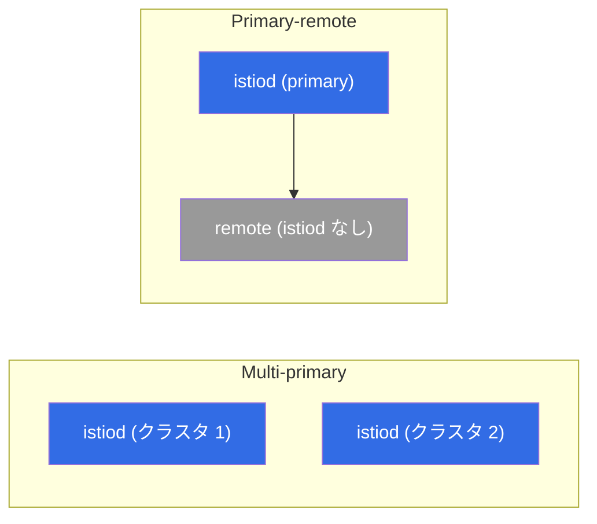

[Русская версия](ru.md) · [Eng version](en.md) · [Versión en español](es.md) · [Version française](fr.md) · [Deutsche Version](de.md) · [ქართული ვერსია](ge.md) · [繁體中文版](tw.md)

# 第28章. マルチクラスタ mesh

> **次へ。** これまでは 1 つのクラスタを扱ってきました。しかし本番では、可用性、地理的な
> 要件、分離、キャパシティのために複数のクラスタが必要になることがよくあります。Istio は
> 複数のクラスタを **単一の mesh** に統合できます。異なるクラスタのサービスが互いを認識し、
> 近くにあるかのように mTLS で通信します。この章では、その仕組みとモデルを見ていき
> ます。

## 28.1. マルチクラスタが必要な理由

1 つのクラスタは単一障害点であり、スケールや地理的範囲にも限界があります。1 つの mesh 内の
複数クラスタには、次の利点があります。

- **可用性。** クラスタまたはゾーンが停止すると、トラフィックは別のクラスタへ移ります。
- **地理的配置。** 異なるリージョンのユーザーに近い場所にクラスタを配置できます。
- **分離。** チーム、環境、セキュリティ要件ごとに分離できます。
- **キャパシティ。** 1 つのクラスタの制限を回避できます。

重要な考え方は、異なるクラスタのサービスが、1 つの mesh 内にいる場合と同様に互いを認識し、
信頼し合うことです。そのためには、共通の trust、クラスタ間のサービス検出、ネットワーク接続性という
3 つが必要です。

## 28.2. 共通の trust - 基盤

最初の、そして必須の条件は、すべてのクラスタが **共通のルートを信頼する** ことです。サービス間の
mTLS（第13章）は、その証明書が同じルート CA から発行されている場合にのみ機能します。各クラスタに
独自の自己署名 istiod がある場合、共通の信頼は成立せず、cross-cluster トラフィックも確立しません。

したがって、マルチクラスタは **共通のカスタム CA なしには不可能** です（第16章）。これが第16章での
助言につながります。マルチクラスタ化の可能性が少しでもあるなら、最初から共通 CA を導入してください。
そうでないと、稼働中のクラスタを共通ルートへ移行する必要が生じます。

## 28.3. デプロイメントモデル: primary-remote と multi-primary

control plane が配置される場所によって、2 つのモデルがあります。

- **Primary-remote。** 1 つのクラスタ（primary）が istiod を保持し、残り（remote）はこれを外部
  control plane として使用します。必要なリソースは少なくて済みますが、primary は重要な存在になります。
  primary が利用不能になると remote クラスタに影響します。
- **Multi-primary。** 各クラスタに **独自の** istiod があり、サービス情報を交換します。より信頼性が高く
  （管理の単一障害点がない）、ただし設定はより複雑です。可用性が求められる本番環境では、こちらが
  推奨される選択肢です。



モデルと共通 mesh への所属は、インストール時に `IstioOperator`/Helm の `global` を通じて設定します。
主なフィールドは、すべてのクラスタで共通の `meshID`、一意のクラスタ名、そのネットワーク名です。

```yaml
apiVersion: install.istio.io/v1alpha1
kind: IstioOperator
metadata:
  name: istio-cluster1
spec:
  values:
    global:
      meshID: mesh1                # すべてのクラスターで一つの mesh
      multiCluster:
        clusterName: cluster1      # このクラスターの一意な名前
      network: network1            # このクラスターのネットワーク名 (28.4 参照)
```

隣接クラスタでは同じ `meshID` を使用しますが、`clusterName: cluster2` にし、ネットワークが異なる場合は
`network: network2` にします。信頼は共通のルート CA（28.2）と同一の `trustDomain` によって支えられます。
これらがなければ cross-cluster mTLS は確立しません。

> **Ambient とマルチクラスタ。** この章の内容はすべてサイドカーモードについてです。Istio ~1.24 時点では、
> ambient（第22章）のマルチクラスタはまだ成熟途上で制約もあります。そのため、可用性が求められる本番の
> マルチクラスタでは、現時点ではサイドカーが選ばれます。

## 28.4. 1 つのネットワークか複数か: east-west gateway

2 つ目の側面は、クラスタ間のネットワーク接続性です。

- **単一ネットワーク（single network）。** 異なるクラスタの Pod が IP 経由で直接到達できます
  （共通 VPC/フラットネットワーク）。より単純で、cross-cluster トラフィックは直接流れます。
- **複数ネットワーク（multi-network）。** クラスタが異なるネットワークにあり、Pod は直接互いを認識
  できません。この場合、cross-cluster トラフィックは **east-west gateway** を通過します。これは、
  外部ユーザー向けの通常の north-south ingress とは異なり、クラスタ間の **mesh 内** トラフィック用の
  特別な ingress ゲートウェイです。


East-west gateway は暗号化されたトラフィックを復号せずに SNI に基づいてクラスタ間でルーティングします
（サービス間のエンドツーエンド mTLS は維持されます）。

実際には、multi-network の設定は次のようになります。まずクラスタのネットワークをラベル付けし、
istiod がどのエンドポイントがローカルで、どれがゲートウェイの先にあるかを認識できるようにします。

```bash
kubectl label namespace istio-system topology.istio.io/network=network1
```

次に、east-west gateway 自体（router の役割を持つ専用 ingress-gateway）をインストールし、`15443` ポートを
`AUTO_PASSTHROUGH` モードで公開します。これは mTLS を復号せずに SNI でルーティングします。

```yaml
apiVersion: networking.istio.io/v1
kind: Gateway
metadata:
  name: cross-network-gateway
  namespace: istio-system
spec:
  selector:
    istio: eastwestgateway          # east-west gateway の Pod
  servers:
  - port:
      number: 15443
      name: tls
      protocol: TLS
    tls:
      mode: AUTO_PASSTHROUGH        # 復号せず、SNI でルーティングする
    hosts:
    - "*.local"                     # クロスクラスターサービス (*.svc.cluster.local)
```

east-west gateway 自体は LoadBalancer タイプの Service を介して公開します（EKS では通常、**internal NLB**、
28.7節）。隣接クラスタの istiod は、そのアドレスをこのネットワークへのトラフィックの入口として使用します。

## 28.5. クラスタ間のサービス検出

あるクラスタの istiod が別クラスタのサービスを認識するには、そのクラスタの API へアクセスできる必要が
あります。これは **remote secret** で設定します。istiod が隣接クラスタへの kubeconfig アクセスを取得します。

```bash
istioctl create-remote-secret --name=cluster2 | kubectl apply -f - --context=cluster1
```

この後、クラスタ 1 の istiod はクラスタ 2 のサービスとエンドポイントを読み込み、共通レジストリに追加します。
両クラスタに同じ名前のサービスがある場合、Istio はエンドポイントを統合します。つまり、リクエストはどちらの
クラスタの Pod にも送られ得ます。

**作業を確認しましょう。** クラスタ間の接続が実際に確立されたかは、次のように確認できます。

```bash
istioctl remote-clusters                     # istiod が隣接クラスターを認識 (synced?)
# ローカルサービスの endpoints に別クラスター/ネットワークのアドレスが現れた:
istioctl proxy-config endpoints <pod> -n app | grep <service>
# そして最後に本番テスト - 数回のリクエスト、両方のクラスターが応答するはず:
kubectl exec <pod> -n app -- sh -c 'for i in $(seq 10); do curl -s http://<service>/hostname; done'
```

`remote-clusters` に隣接クラスタが表示されない、または `endpoints` にローカルアドレスしかない場合、問題は
remote secret（API へのアクセス）またはネットワーク/east-west gateway にあります。

## 28.6. クラスタ間の負荷分散

サービスのエンドポイントが複数クラスタにある場合、リクエストの送信先が問題になります。ここでも
**locality-aware 負荷分散**（第7章）が機能します。

- 通常時は、トラフィックは **自分の** クラスタ/ゾーン内にとどまります（レイテンシが低く、ゾーン間/
  リージョン間トラフィックが減るため、クラウド料金も少なくなります。第27章）。
- ローカルエンドポイントに障害が発生すると、別のクラスタへの **failover** が動作します。

これがマルチクラスタの可用性です。ローカルでは高速に動作し、問題が発生するとトラフィックはサービスが
稼働している場所へ自動的に移ります。第7章と同様に、failover には `outlierDetection` が必要です。

## 28.7. EKS/AWS 上のマルチクラスタ

EKS では、抽象的な「ネットワーク」と「隣接クラスタの API へのアクセス」が具体的な AWS サービスに
置き換わります。主なポイントは次のとおりです。

- **単一ネットワークか複数かは VPC の問題です。** クラスタが同じ VPC 内にある、または異なる VPC が
  **VPC peering / Transit Gateway** で接続されている場合（CIDR の重複がないフラットなルーティング可能
  ネットワーク）、Pod は直接互いを認識します。これが **single-network** モデルであり、east-west gateway は
  不要です。ネットワークが分離されている場合は、east-west gateway を備えた **multi-network** を使用します。
- **internal NLB の背後にある east-west gateway。** multi-network では、ゲートウェイを外部ではなく
  **内部 NLB**（`aws-load-balancer-scheme: internal`）を通じて公開します。クラスタ間トラフィックは通常、
  インターネットではなくプライベートネットワーク（peering/TGW）を通るためです。
- **実際の共通 CA。** すべてのクラスタのルートは、クラスタごとに中間 CA を持つ offline ルート、または
  cert-manager + istio-csr（第16章）を介した **AWS Private CA (ACM PCA)** のいずれかです。重要なのは、
  mesh 全体で 1 つのルートを使うことです。
- **隣接クラスタの API へのアクセス（remote secret）は EKS の落とし穴です。** EKS の kubeconfig は
  デフォルトで IAM 認証（`aws eks get-token`）を使用します。このような Secret はローカルの AWS 認証情報に
  依存するため、隣接クラスタの istiod は利用できません。そのため remote secret 用には通常、トークンを持つ
  専用の ServiceAccount を作成し、その identity に API アクセスを付与します（`aws-auth`/**EKS access entries**
  経由）。つまり、EKS のクラスタ間 discovery には、API エンドポイントへのネットワークアクセスと、正しい
  IAM/RBAC の関連付けの両方が必要です。
- **Cross-region は高価で遅い。** リージョン間トラフィックはゾーン間よりも高く課金され、レイテンシも
  増加します（第27章）。相互に連携するサービスは同じリージョンに配置し、マルチリージョンは恒常的な
  cross-region 呼び出しではなく、地理的な可用性のために使用してください。Cross-account 構成（**AWS RAM**
  による共有サブネット）は、ネットワークと IAM の調整をさらに 1 層増やします。

## 28.8. ベストプラクティス

- **最初から共通 CA を使用する。** 共通ルートなしではマルチクラスタは不可能です。後から移行するのではなく、
  最初に導入してください（第16章）。
- **可用性には multi-primary を使う。** 管理の単一障害点がありません。primary-remote はより単純ですが、
  primary が重要な存在になります。
- **Locality-aware + failover。** レイテンシとコストのためにトラフィックをローカルに保ち、障害時にのみ
  クラスタ間で切り替えます。
- **クラスタ間/ゾーン間トラフィックを監視する。** 料金がかかり、ローカルトラフィックより遅くなります。
  cross-cluster 呼び出しが通常ではなく例外となるよう設計してください。
- **バージョンと設定を統一する。** 1 つの mesh 内のクラスタ間で異なる Istio バージョンを使うと、微妙な
  バグの原因になります。整合性を保ち、協調して更新してください。
- **mesh 全体の可観測性を確保する。** メトリクスとトレースはすべてのクラスタから集め、1 つの全体像に
  する必要があります（第17〜18章）。そうしないと、cross-cluster 問題の診断は困難になります。
- **単純な構成から始める。** 対応できる間は 1 つのクラスタを使います。マルチクラスタは多くの複雑さを
  増やすため、HA、地理的要件、分離といった明確な必要性に応じて導入してください。

## 28.9. この章のまとめ

- マルチクラスタ mesh は複数のクラスタを統合します。サービスは互いを認識し、1 つの mesh 内にいる場合と
  同様に mTLS で通信します。
- 必要なものは 3 つです。**共通の trust**（共通のルート CA）、クラスタ間の **サービス検出**（remote secret）、
  **ネットワーク接続性** です。
- control plane によるモデルには、**primary-remote**（全クラスタに対して 1 つの istiod。単純ですが primary が
  重要）と **multi-primary**（各クラスタに独自の istiod。より信頼性が高い）があります。
- mesh への所属はインストール時に設定します。共通の `meshID`、一意の `clusterName`、`IstioOperator`/Helm の
  `network` を使用します。クラスタのネットワークには `topology.istio.io/network` を付けます。
- ネットワークには、**単一ネットワーク**（Pod が直接互いを認識）または **複数ネットワーク**（トラフィックは
  **east-west gateway** を経由。15443 ポート、SNI による `AUTO_PASSTHROUGH`、mTLS を維持）があります。
- クラスタ間の負荷分散は、failover を伴う **locality-aware** です（第7章）。ローカルでは高速かつ低コストで、
  cross-cluster は障害時に使用されます。
- EKS では、VPC peering/Transit Gateway による single-network、**internal NLB** の背後にある east-west による
  multi-network、ACM PCA による共通 CA を使います。remote secret には SA トークン + API への IAM/RBAC アクセスが
  必要です（IAM-kubeconfig ではありません）。cross-region は高価で遅くなります。
- 接続の確認には、`istioctl remote-clusters`、`proxy-config` 内の cross-cluster エンドポイント、実際の `curl`
  （両クラスタが応答）を使用します。
- ベストプラクティス: 共通 CA を事前に準備する、HA には multi-primary を使う、クラスタ間トラフィックを最小限に
  する（有料）、バージョンを統一する、エンドツーエンドの可観測性を確保する、必要なく複雑にしない。

## 28.10. 理解度チェック

1. マルチクラスタ mesh が必要な理由と、解決する問題は何ですか？
2. 共通のルート CA なしにマルチクラスタが不可能なのはなぜですか？
3. primary-remote と multi-primary のモデルはどのように異なりますか？
4. east-west gateway が必要になるのはいつで、通常の ingress と何が異なりますか？
   `AUTO_PASSTHROUGH` とポート 15443 とは何ですか？
5. クラスタの共通 mesh への所属は、どのフィールド（`meshID`、`clusterName`、`network`）で設定しますか？
6. クラスタ間のトラフィックはどのように負荷分散され、クラウド料金はどう関係しますか？
7. EKS での single-network（VPC peering/TGW）と multi-network（internal NLB の背後の east-west）は、
   どのように構成されますか？
8. EKS の remote secret が通常の IAM-kubeconfig で動作しない理由と、その代わりに何をするかを説明してください。
9. クラスタが実際に 1 つの mesh に統合されたことを、どのように確認しますか？

## 演習

マルチクラスタを実践してください。共通 CA、multi-primary/multi-network、east-west gateway、remote secret による
cross-cluster discovery、クラスタ間の負荷分散を扱います。

🧪 ラボ 35: [tasks/ica/labs/35](../../labs/35/README_JP.MD)

---
[目次](../README_JP.md) · [第27章](../27/jp.md) · [第29章](../29/jp.md)