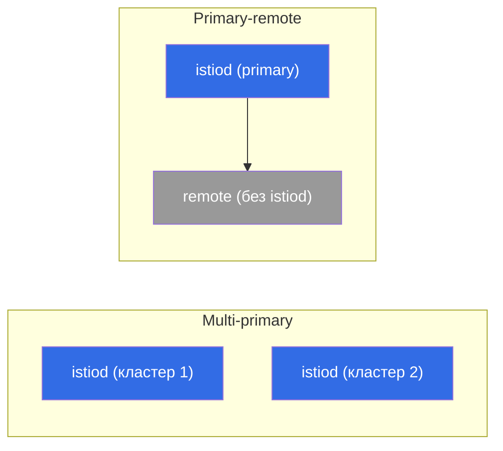

# Глава 28. Мультикластерный mesh

> **Что дальше.** Пока у нас был один кластер. Но в проде часто нужно несколько:
> ради отказоустойчивости, географии, изоляции или ёмкости. Istio умеет объединять
> несколько кластеров в **единый mesh** - сервисы из разных кластеров видят друг друга и
> общаются по mTLS, как будто они рядом. В этой главе разберём, как это устроено и какие
> есть модели.

## 28.1. Зачем мультикластер

Один кластер это единая точка отказа и предел по масштабу/географии. Несколько кластеров
в одном mesh дают:

- **Отказоустойчивость.** Упал кластер или зона - трафик уходит в другой кластер.
- **География.** Кластеры ближе к пользователям в разных регионах.
- **Изоляция.** Разделение по командам, средам, требованиям безопасности.
- **Ёмкость.** Обход лимитов одного кластера.

Ключевая идея: сервисы в разных кластерах должны видеть друг друга и доверять друг другу,
как внутри одного mesh. Для этого нужны три вещи: общий trust, обнаружение сервисов между
кластерами и связность сети.

## 28.2. Общий trust - фундамент

Первое и обязательное условие: все кластеры должны **доверять общему корню**. mTLS между
сервисами (глава 13) работает, только если их сертификаты выписаны из одного корневого
CA. У каждого кластера свой самоподписанный istiod - общего доверия не будет, и
cross-cluster трафик не установится.

Поэтому мультикластер **невозможен без общего кастомного CA** (глава 16). Отсюда и совет
из главы 16: если есть хоть малейшая вероятность мультикластера, закладывайте общий CA
сразу - иначе придётся мигрировать живые кластеры на общий корень.

## 28.3. Модели развёртывания: primary-remote и multi-primary

По тому, где живёт control plane, различают две модели.

- **Primary-remote.** Один кластер (primary) держит istiod, а остальные (remote)
  используют его как внешний control plane. Проще по ресурсам, но primary становится
  критичным: его недоступность влияет на remote-кластеры.
- **Multi-primary.** У каждого кластера **свой** istiod, и они обмениваются информацией о
  сервисах. Надёжнее (нет единой точки управления), но сложнее в настройке. Это
  предпочтительный вариант для отказоустойчивого прода.



## 28.4. Одна сеть или несколько: east-west gateway

Второе измерение - сетевая связность между кластерами.

- **Одна сеть (single network).** Поды разных кластеров могут напрямую достучаться друг
  до друга по IP (общий VPC/плоская сеть). Проще: cross-cluster трафик идёт напрямую.
- **Несколько сетей (multi-network).** Кластеры в разных сетях, поды напрямую не видят
  друг друга. Тогда cross-cluster трафик идёт через **east-west gateway** - специальный
  ingress-шлюз для **внутримешевого** трафика между кластерами (в отличие от обычного
  north-south ingress для внешних пользователей).


East-west gateway маршрутизирует зашифрованный трафик между кластерами по SNI, не
расшифровывая его (сохраняется сквозной mTLS между сервисами).

## 28.5. Обнаружение сервисов между кластерами

Чтобы istiod одного кластера знал о сервисах другого, ему нужен доступ к API этого
кластера. Это настраивается **remote secret** - istiod получает kubeconfig-доступ к
соседним кластерам:

```bash
istioctl create-remote-secret --name=cluster2 | kubectl apply -f - --context=cluster1
```

После этого istiod в кластере 1 читает сервисы и эндпоинты кластера 2 и добавляет их в
общий реестр. Для сервиса с одинаковым именем в обоих кластерах Istio объединяет
эндпоинты - и запрос может уйти на под в любом из кластеров.

## 28.6. Балансировка между кластерами

Когда эндпоинты сервиса есть в нескольких кластерах, встаёт вопрос: куда слать запрос.
Здесь снова работает **locality-aware балансировка** (глава 7):

- в нормальном режиме трафик остаётся в **своём** кластере/зоне (меньше задержка, меньше
  межзонного/межрегионального трафика - и меньше счёт в облаке, глава 27);
- при отказе локальных эндпоинтов срабатывает **failover** в другой кластер.

Это и есть отказоустойчивость мультикластера: локально быстро, а при проблеме трафик сам
уходит туда, где сервис жив. Как и в главе 7, для failover нужен `outlierDetection`.

## 28.7. Best practices

- **Общий CA - с самого начала.** Без общего корня мультикластер невозможен; закладывайте
  его на старте (глава 16), а не мигрируйте потом.
- **Multi-primary для отказоустойчивости.** Нет единой точки управления; primary-remote
  проще, но primary становится критичным.
- **Locality-aware + failover.** Держите трафик локально ради задержки и стоимости,
  переключайтесь между кластерами только при отказе.
- **Следите за межкластерным/межзонным трафиком.** Он платный и медленнее локального -
  проектируйте так, чтобы cross-cluster вызовы были исключением, а не нормой.
- **Единообразие версий и конфигурации.** Разные версии Istio в кластерах одного mesh -
  источник тонких багов; держите их согласованными и обновляйте скоординированно.
- **Наблюдаемость на весь mesh.** Метрики и трейсы должны собираться со всех кластеров в
  единую картину (главы 17-18), иначе диагностика cross-cluster проблем превращается в
  ад.
- **Начинайте с простого.** Один кластер, пока он справляется. Мультикластер добавляет
  много сложности - вводите его под конкретную потребность (HA, гео, изоляция).

## 28.8. Итоги главы

- Мультикластерный mesh объединяет несколько кластеров: сервисы видят друг друга и
  общаются по mTLS как в одном mesh.
- Нужны три вещи: **общий trust** (общий корневой CA), **обнаружение сервисов** между
  кластерами (remote secret) и **сетевая связность**.
- Модели по control plane: **primary-remote** (один istiod на всех, проще, но primary
  критичен) и **multi-primary** (свой istiod в каждом, надёжнее).
- Сеть: **одна сеть** (поды видят друг друга напрямую) или **несколько сетей** (трафик
  через **east-west gateway** по SNI с сохранением mTLS).
- Балансировка между кластерами - **locality-aware** с failover (глава 7); локально
  быстро и дёшево, cross-cluster - при отказе.
- Best practices: общий CA заранее, multi-primary для HA, минимум межкластерного трафика
  (он платный), единые версии, сквозная наблюдаемость, не усложнять без нужды.

## 28.9. Вопросы для самопроверки

1. Зачем нужен мультикластерный mesh и какие проблемы он решает?
2. Почему мультикластер невозможен без общего корневого CA?
3. Чем отличаются модели primary-remote и multi-primary?
4. Когда нужен east-west gateway и чем он отличается от обычного ingress?
5. Как балансируется трафик между кластерами и при чём тут стоимость облака?

## Практика

Отработайте мультикластер на практике: общий CA, multi-primary/multi-network, east-west
gateway, cross-cluster discovery через remote-секреты и межкластерная балансировка.

🧪 Лаба 35: [tasks/ica/labs/35](../../labs/35/README_RU.MD)

---
[Оглавление](../README.md) · [Глава 27](../27/ru.md) · [Глава 29](../29/ru.md)
