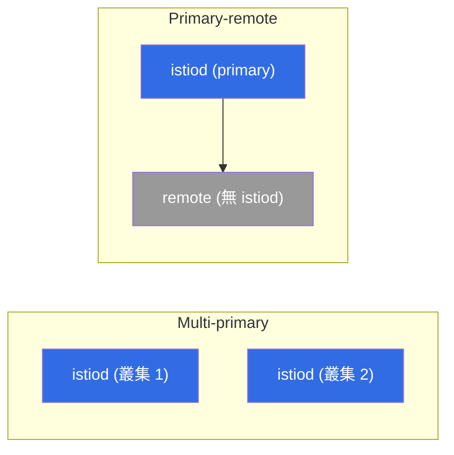

[Русская версия](ru.md) · [Eng version](en.md) · [Versión en español](es.md) · [Version française](fr.md) · [Deutsche Version](de.md) · [ქართული ვერსია](ge.md) · [日本語版](jp.md)

# 第 28 章。多叢集 mesh

> **接下來。** 目前我們只有一個叢集。但在正式環境中，經常需要多個叢集：
> 為了容錯、地理分布、隔離或容量。Istio 能將多個叢集整合成**單一 mesh**--來自不同叢集的服務能彼此看見，並透過 mTLS 通訊，就像它們近在咫尺。本章將探討其運作方式與可用模型。

## 28.1. 為何需要多叢集

單一叢集既是單點故障，也是規模與地理範圍的限制。一個 mesh 中的多個叢集可提供：

- **容錯。** 叢集或可用區故障時，流量會轉往另一個叢集。
- **地理分布。** 叢集更接近不同區域的使用者。
- **隔離。** 可依團隊、環境與安全要求進行劃分。
- **容量。** 繞過單一叢集的限制。

核心概念是：不同叢集中的服務應能彼此看見並相互信任，如同位於同一個 mesh 中。為此需要三項條件：共用信任、跨叢集服務發現，以及網路連通性。

## 28.2. 共用信任：基礎

第一項也是必要條件：所有叢集必須**信任同一個根憑證**。服務之間的 mTLS（第 13 章）只有在其憑證皆由同一個根 CA 簽發時才能運作。每個叢集都有自己的自簽 istiod 時，便不會有共用信任，cross-cluster 流量也無法建立。

因此，沒有共用的自訂 CA，多叢集**不可能實現**（第 16 章）。這也正是第 16 章建議的緣由：只要存在一絲多叢集的可能性，就應立即規劃共用 CA--否則之後必須將運行中的叢集遷移到共用根憑證。

## 28.3. 部署模型：primary-remote 與 multi-primary

依 control plane 所在位置，可區分兩種模型。

- **Primary-remote。** 一個叢集（primary）執行 istiod，其他叢集（remote）將其作為外部 control plane 使用。資源需求較少，但 primary 會變得關鍵：其無法使用會影響 remote 叢集。
- **Multi-primary。** 每個叢集都有**自己的** istiod，且彼此交換服務資訊。它更可靠（沒有單一控制點），但設定更複雜。對需要容錯的正式環境而言，這是較佳選擇。



模型與其歸屬的共用 mesh 在安裝時設定--透過 `IstioOperator`/Helm 的 `global`。關鍵欄位包括：所有叢集共用的 `meshID`、唯一的叢集名稱，以及其網路名稱：

```yaml
apiVersion: install.istio.io/v1alpha1
kind: IstioOperator
metadata:
  name: istio-cluster1
spec:
  values:
    global:
      meshID: mesh1                # 所有 cluster 共用同一個 mesh
      multiCluster:
        clusterName: cluster1      # 此 cluster 的唯一名稱
      network: network1            # 此 cluster 的網路名稱（見 28.4）
```

在相鄰叢集中使用相同的 `meshID`，但設為 `clusterName: cluster2`；若網路不同，則設為 `network: network2`。信任仰賴共用的根 CA（28.2）與相同的 `trustDomain`--否則無法建立 cross-cluster mTLS。

> **Ambient 與多叢集。** 本章的所有內容均針對 sidecar 模式說明。截至 Istio ~1.24，ambient（第 22 章）的多叢集支援仍在成熟中且有所限制，因此目前針對具容錯需求的正式多叢集環境，仍採用 sidecar。

## 28.4. 單一或多個網路：east-west gateway

第二個面向是叢集之間的網路連通性。

- **單一網路（single network）。** 不同叢集的 Pod 可以直接透過 IP 互相連線（共用 VPC／平面網路）。較為簡單：cross-cluster 流量直接傳送。
- **多個網路（multi-network）。** 叢集位於不同網路，Pod 無法直接彼此看見。此時 cross-cluster 流量會通過 **east-west gateway**--專供叢集之間**mesh 內部**流量使用的特殊 ingress gateway（不同於面向外部使用者的一般 north-south ingress）。


East-west gateway 會依 SNI 在叢集之間路由加密流量，而不對其解密（保留服務間的端到端 mTLS）。

實務上，multi-network 的設定如下。首先標記叢集的網路，讓 istiod 知道哪些端點為本地端、哪些位於 gateway 後方：

```bash
kubectl label namespace istio-system topology.istio.io/network=network1
```

接著部署 east-west gateway（具有 router 角色的獨立 ingress-gateway），並在其上以 `AUTO_PASSTHROUGH` 模式開放連接埠 `15443`--它依 SNI 路由而不解開 mTLS：

```yaml
apiVersion: networking.istio.io/v1
kind: Gateway
metadata:
  name: cross-network-gateway
  namespace: istio-system
spec:
  selector:
    istio: eastwestgateway          # east-west gateway 的 pod
  servers:
  - port:
      number: 15443
      name: tls
      protocol: TLS
    tls:
      mode: AUTO_PASSTHROUGH        # 不解密，依 SNI 路由
    hosts:
    - "*.local"                     # 跨 cluster 服務（*.svc.cluster.local）
```

east-west gateway 本身會透過 LoadBalancer 類型的 Service 發布（在 EKS 上通常是 **internal NLB**，第 28.7 節）。相鄰叢集的 istiod 會使用其位址作為流量進入此網路的入口點。

## 28.5. 跨叢集服務發現

為了讓一個叢集的 istiod 知曉另一個叢集的服務，它需要存取該叢集的 API。這透過 **remote secret** 來設定--istiod 取得對相鄰叢集的 kubeconfig 存取權：

```bash
istioctl create-remote-secret --name=cluster2 | kubectl apply -f - --context=cluster1
```

之後，叢集 1 的 istiod 會讀取叢集 2 的服務與端點，並將其加入共用登錄表。對於兩個叢集中同名的服務，Istio 會合併端點--請求便可能傳送到任一叢集中的 Pod。

**檢查你的成果。** 可透過以下方式確認叢集連結是否確實已建立：

```bash
istioctl remote-clusters                     # istiod 看得到鄰近 cluster（synced?）
# 本地服務的 endpoint 中出現了來自另一個 cluster/網路的位址：
istioctl proxy-config endpoints <pod> -n app | grep <service>
# 最後進行實戰測試 - 發送數個請求，兩個 cluster 都應回應：
kubectl exec <pod> -n app -- sh -c 'for i in $(seq 10); do curl -s http://<service>/hostname; done'
```

若 `remote-clusters` 未顯示相鄰叢集，或 `endpoints` 中只有本地位址，問題可能出在 remote secret（API 存取）或網路／east-west gateway。

## 28.6. 跨叢集負載平衡

當一項服務的端點存在於多個叢集時，便會出現一個問題：要將請求傳往何處？這裡同樣採用 **locality-aware 負載平衡**（第 7 章）：

- 在正常模式下，流量會留在**自身**叢集／可用區中（延遲較低、跨可用區／跨區域流量較少--雲端帳單也更低，見第 27 章）；
- 本地端點故障時，會觸發到另一個叢集的 **failover**。

這就是多叢集的容錯：本地快速處理，出現問題時流量會自行轉往服務仍正常運作的位置。如同第 7 章所述，failover 需要 `outlierDetection`。

## 28.7. EKS/AWS 上的多叢集

在 EKS 上，抽象的「網路」與「存取相鄰叢集 API」會轉化為具體的 AWS 服務。關鍵要點如下。

- **單一或多個網路取決於 VPC。** 若叢集位於同一 VPC，或位於透過 **VPC peering / Transit Gateway** 連接的不同 VPC 中（不重疊 CIDR 的平面可路由網路），Pod 可直接彼此看見--這是 **single-network** 模型，不需要 east-west gateway。若網路彼此隔離，則採用帶有 east-west gateway 的 **multi-network**。
- **位於 internal NLB 後方的 east-west gateway。** 在 multi-network 中，gateway 會透過**內部 NLB**（`aws-load-balancer-scheme: internal`）發布，而非暴露至外部--叢集間流量通常經由私有網路（peering/TGW），而不是網際網路。
- **實務上的共用 CA。** 所有叢集的根憑證可以是離線根憑證，並為每個叢集設置中繼憑證；或是透過 cert-manager + istio-csr 使用 **AWS Private CA (ACM PCA)**（第 16 章）。重點是整個 mesh 使用單一根憑證。
- **存取相鄰叢集的 API（remote secret）是 EKS 的陷阱。** EKS 的 kubeconfig 預設使用 IAM 驗證（`aws eks get-token`），此類 secret 依賴本機 AWS 憑證--相鄰叢集的 istiod 無法使用它們。因此，remote secret 通常會建立帶有 token 的獨立 ServiceAccount，並讓其 identity 能存取 API（透過 `aws-auth`/**EKS access entries**）。換言之，EKS 上的跨叢集 discovery 同時需要對 API endpoint 的網路存取，以及正確的 IAM/RBAC 綁定。
- **Cross-region 昂貴且延遲高。** 跨區域流量的計費高於跨可用區流量，且會增加延遲（第 27 章）。應將相互協作的服務維持在同一區域，並將多區域用於地理容錯，而非持續的 cross-region 呼叫。Cross-account 架構（透過 **AWS RAM** 共用子網路）還會增加一層網路與 IAM 協調工作。

## 28.8. 最佳實務

- **從一開始就使用共用 CA。** 沒有共用根憑證便無法實現多叢集；應在一開始就規劃（第 16 章），而非日後再遷移。
- **使用 multi-primary 實現容錯。** 沒有單一控制點；primary-remote 較簡單，但 primary 會變得關鍵。
- **Locality-aware + failover。** 為了延遲與成本讓流量保持本地；僅在故障時於叢集間切換。
- **監控跨叢集／跨可用區流量。** 它需要付費且比本地流量慢--應設計為使 cross-cluster 呼叫成為例外，而非常態。
- **版本與設定一致性。** 同一 mesh 中各叢集採用不同 Istio 版本是微妙錯誤的來源；應保持一致並協調更新。
- **全 mesh 的可觀測性。** 應將所有叢集的指標與追蹤收集至統一視圖（第 17–18 章），否則 cross-cluster 問題的診斷將淪為惡夢。
- **從簡單開始。** 在單一叢集尚能勝任時就使用它。多叢集會增加許多複雜度--僅在有明確需求（HA、地理分布、隔離）時導入。

## 28.9. 本章總結

- 多叢集 mesh 整合多個叢集：服務能彼此看見，並像在同一 mesh 中一樣透過 mTLS 通訊。
- 需要三項條件：**共用信任**（共用根 CA）、叢集間的**服務發現**（remote secret）與**網路連通性**。
- Control plane 模型包括：**primary-remote**（一個 istiod 服務所有叢集，較簡單但 primary 關鍵）與 **multi-primary**（每個叢集各有 istiod，更可靠）。
- Mesh 歸屬在安裝時設定：所有叢集共用 `meshID`，並在 `IstioOperator`/Helm 中設定唯一的 `clusterName` 與 `network`；叢集網路使用 `topology.istio.io/network` 標記。
- 網路：**單一網路**（Pod 可直接彼此看見）或**多個網路**（流量經由 **east-west gateway**，連接埠 15443，以 SNI 的 `AUTO_PASSTHROUGH` 保留 mTLS）。
- 跨叢集負載平衡採用具 failover 的 **locality-aware**（第 7 章）；本地快速且成本低，cross-cluster 僅在故障時使用。
- 在 EKS 上：single-network 透過 VPC peering/Transit Gateway，multi-network 透過位於 **internal NLB** 後方的 east-west；共用 CA 使用 ACM PCA；remote secret 需要 SA token + IAM/RBAC 的 API 存取權（非 IAM-kubeconfig）；cross-region 昂貴且緩慢。
- 檢查連結：`istioctl remote-clusters`、`proxy-config` 中的 cross-cluster 端點，以及實際 `curl`（兩個叢集皆有回應）。
- 最佳實務：預先使用共用 CA、以 multi-primary 實現 HA、最小化跨叢集流量（需付費）、使用一致版本、端到端可觀測性，且不要無故增加複雜度。

## 28.10. 自我檢查問題

1. 為何需要多叢集 mesh？它解決哪些問題？
2. 為何沒有共用根 CA 就無法實現多叢集？
3. primary-remote 與 multi-primary 模型有何不同？
4. 何時需要 east-west gateway？它與一般 ingress 有何差異？`AUTO_PASSTHROUGH` 與連接埠 15443 是什麼？
5. 哪些欄位（`meshID`、`clusterName`、`network`）設定叢集歸屬於共用 mesh？
6. 流量如何在叢集間平衡？這與雲端成本有何關係？
7. 在 EKS 上，single-network（VPC peering/TGW）與 multi-network（位於 internal NLB 後方的 east-west）如何運作？
8. 為何 EKS 上的 remote secret 無法使用一般 IAM-kubeconfig？替代作法是什麼？
9. 如何驗證叢集確實已整合為一個 mesh？

## 實作

實際演練多叢集：共用 CA、multi-primary/multi-network、east-west gateway、透過 remote secret 的 cross-cluster discovery，以及跨叢集負載平衡。

🧪 實驗 35：[tasks/ica/labs/35](../../labs/35/README_TW.MD)

---
[目錄](../README_TW.md) · [第 27 章](../27/tw.md) · [第 29 章](../29/tw.md)