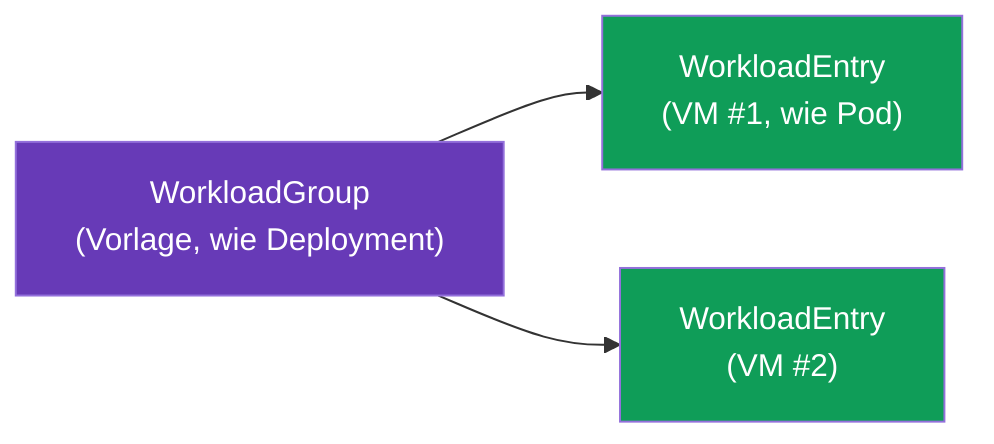
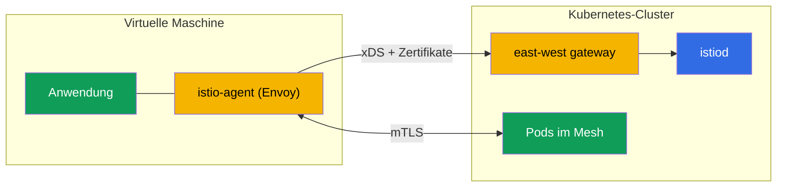

[RU version](ru.md) · [Eng version](en.md) · [Versión en español](es.md) · [Version française](fr.md)

# Kapitel 29. Nicht-Kubernetes-Workloads: VM im Mesh

> **Was kommt als Nächstes.** Istio dreht sich nicht nur um Kubernetes. In der Realität
> lebt ein Teil der Workloads außerhalb des Clusters: Legacy-Anwendungen, Datenbanken,
> Dienste auf virtuellen Maschinen. Istio kann solche VMs ins Mesh einbinden - mit
> demselben mTLS, derselben Diensterkennung und denselben Policies wie Pods. In diesem
> Kapitel schauen wir uns an, wie das funktioniert.

## 29.1. Warum VMs ins Mesh einbinden

Nicht alles lässt sich (oder muss man) nach Kubernetes verlagern. Gründe, eine VM ins Mesh
zu bringen:

- **Legacy-Anwendungen**, die vorerst auf VMs leben und noch nicht für die
  Containerisierung bereit sind.
- **Schrittweise Migration**: Ein Dienst ist bereits teilweise im Cluster, teilweise auf
  einer VM, und beide müssen sicher miteinander kommunizieren.
- **Einheitliche Policy.** Man möchte, dass mTLS, Autorisierung und Observability
  (Kapitel 13, 14, 17) sich auch auf VMs erstrecken, nicht nur auf Pods.

Ziel: die VM soll für das Mesh wie ein gewöhnlicher Workload aussehen - mit eigener
Identity, mTLS und einem Eintrag in der Dienstregistrierung.

## 29.2. Wie es aufgebaut ist: WorkloadGroup und WorkloadEntry

In Kubernetes wird ein Pod durch ein Deployment beschrieben, und eine konkrete Instanz ist
ein Pod. Für VMs führt Istio zwei analoge Konzepte ein:

- **WorkloadGroup** - eine Vorlage für eine Gruppe von VM-Workloads (analog zum
  Deployment): gemeinsame Labels, ServiceAccount, Ports, Bereitschaftsprüfungen.
  Beschreibt, „wie“ die VMs dieser Gruppe sein werden.
- **WorkloadEntry** - die Repräsentation **einer** einzelnen VM-Instanz (analog zum Pod):
  ihre IP, Labels, Identity. Kann automatisch erzeugt werden, wenn sich die VM in einer
  WorkloadGroup registriert, oder manuell.



Dank WorkloadEntry sehen die Pods des Clusters die VM als gewöhnliche Endpunkte eines
Dienstes: man kann einen Kubernetes Service anlegen, der sowohl Pods als auch VMs umfasst,
und den Traffic zwischen ihnen balancieren.

`WorkloadGroup` beschreibt die Gruppe und vor allem die Identity (`serviceAccount`), die
Labels und die Health-Prüfung der Instanzen:

```yaml
apiVersion: networking.istio.io/v1
kind: WorkloadGroup
metadata:
  name: legacy-app
  namespace: vm-apps
spec:
  metadata:
    labels:
      app: legacy-app            # über dieses Label findet der Service Pods und VMs
  template:
    serviceAccount: legacy-app   # SPIFFE-Identity der VM, wie bei Pods
    ports:
      http: 8080
  probe:                         # Health-Check der VM-Instanz
    httpGet:
      path: /healthz
      port: 8080
```

Ein gewöhnlicher `Service` mit demselben Label fasst Pods und VMs zu einem Dienst zusammen -
der Traffic wird transparent zwischen ihnen balanciert:

```yaml
apiVersion: v1
kind: Service
metadata:
  name: legacy-app
  namespace: vm-apps
spec:
  selector:
    app: legacy-app              # dasselbe Label -> Pods und WorkloadEntry (VM)
  ports:
  - {name: http, port: 8080}
```

Wird die Registrierung nicht automatisiert, legt man das `WorkloadEntry` manuell an - mit IP
und Identity der konkreten VM:

```yaml
apiVersion: networking.istio.io/v1
kind: WorkloadEntry
metadata:
  name: legacy-app-vm1
  namespace: vm-apps
spec:
  address: 10.0.12.34            # private IP der VM
  labels:
    app: legacy-app
  serviceAccount: legacy-app
  network: vm-network            # Netz der VM (für Multi-Network, Kapitel 28)
```

## 29.3. istio-agent auf der virtuellen Maschine

Damit die VM Teil des Mesh wird, installiert man darauf den **istio-agent** - ein Paket mit
Envoy und pilot-agent (dieselbe data plane wie im sidecar, nur auf dem Host statt im Pod).
Der Agent:

- verbindet sich mit istiod, erhält die Konfiguration über xDS und Zertifikate (wie ein
  gewöhnlicher sidecar, Kapitel 4);
- fängt den Traffic der Anwendung auf der VM ab und leitet ihn durch Envoy;
- stellt mTLS mit den Diensten im Cluster sicher.



Die Bootstrap-Dateien für die VM generiert `istioctl` selbst aus der `WorkloadGroup` -
manuell schreiben muss man sie nicht:

```bash
# 1. WorkloadGroup erstellen (oder Manifest aus 29.2 anwenden)
istioctl x workload group create \
  --name legacy-app --namespace vm-apps \
  --serviceAccount legacy-app > workloadgroup.yaml
kubectl apply -f workloadgroup.yaml

# 2. Dateisatz für die konkrete VM generieren
istioctl x workload entry configure \
  -f workloadgroup.yaml -o vm-files/ --clusterID cluster1
```

Im Verzeichnis `vm-files/` erscheinen:

- **`cluster.env`** - Cluster-ID, Netz, Abfang-Ports;
- **`mesh.yaml`** - Mesh-Konfiguration für den Agent;
- **`root-cert.pem`** - Vertrauensanker (gemeinsame CA, Kapitel 16);
- **`istio-token`** - ServiceAccount-Token, mit dem der Agent ein Arbeitszertifikat
  anfordert;
- **`hosts`** - Adresse von istiod (über das east-west gateway).

Diese Dateien werden auf die VM kopiert, das Paket `istio-sidecar` wird installiert und der
Agent gestartet (`systemctl start istio`). Danach verbindet sich die VM mit dem Mesh.

> **Ambient und VMs.** Alles Beschriebene bezieht sich auf den sidecar-Ansatz (istio-agent
> auf der VM). Die Einbindung von VMs in ein ambient-Mesh (Kapitel 22) wird nur
> eingeschränkt unterstützt und reift noch; in der Praxis werden VMs derzeit genau über den
> istio-agent eingebunden.

## 29.4. Verbindung zum Cluster und DNS

Zwei technische Aufgaben, die gelöst werden müssen.

- **Zugriff der VM auf istiod.** Die VM liegt meist außerhalb des Cluster-Netzes, daher
  erreicht sie istiod über das **east-west gateway** (dasselbe wie beim Multicluster,
  Kapitel 28): es stellt die Ports für xDS und die Zertifikatsausgabe nach außen bereit.
  Die VM erhält beim Start eine Bootstrap-Konfiguration mit der Adresse dieses Gateways.
- **DNS.** Die VM kennt kube-DNS nicht und kann Namen wie
  `reviews.default.svc.cluster.local` nicht auflösen. Deshalb startet der istio-agent auf
  der VM einen **DNS proxy**: er fängt DNS-Anfragen ab und löst die Namen der
  Cluster-Dienste auf, damit die Anwendung auf der VM sie über die üblichen Namen ansprechen
  kann.

## 29.5. Identity und mTLS für VMs

Die VM erhält dieselbe kryptografische Identity wie Pods - basierend auf dem ServiceAccount
und im SPIFFE-Format (Kapitel 13). Bei der Einrichtung der VM wird ihr ein
ServiceAccount-Token bereitgestellt, mit dem der istio-agent bei istiod ein
Arbeitszertifikat anfordert.

Im Ergebnis funktionieren mTLS und `AuthorizationPolicy` (Kapitel 14) für die VM genauso wie
für Pods: die Regel `principals: [.../sa/<vm-sa>]` unterscheidet die VM anhand ihrer
Identity, der Traffic zwischen VM und Pods wird verschlüsselt. Sicherheitstechnisch wird die
VM zu einem vollwertigen Teilnehmer des Mesh, nicht zu einem „Loch“ im Perimeter.

## 29.6. Lebenszyklus: Registrierung und Entfernung

- **Registrierung.** Beim Start des istio-agent kann sich die VM **automatisch** in der
  `WorkloadGroup` registrieren und ihr eigenes `WorkloadEntry` erzeugen. So erfährt das Mesh
  ohne manuelle Eingriffe von der neuen Instanz - praktisch für das Autoscaling von VMs.
- **Entfernung.** Wird eine VM außer Betrieb genommen, muss ihr `WorkloadEntry` aus dem Mesh
  entfernt werden, sonst bleibt ein „toter“ Endpunkt zurück, auf den weiterhin Traffic
  geleitet wird. Bei automatischer Registrierung erledigt das der Health-Check; bei
  manueller entfernst du das WorkloadEntry explizit.

**Prüfe deine Arbeit.** Dass die VM wirklich ins Mesh gelangt ist, sieht man so:

```bash
# WorkloadEntry für die VM erstellt (Auto-Registrierung) und in der Registrierung sichtbar
kubectl get workloadentry -n vm-apps
# istiod sieht die VM als Proxy im Zustand SYNCED
istioctl proxy-status | grep <vm-name>
# aus dem Pod geht die Anfrage auch an den VM-Endpunkt (es antworten Pod und VM)
kubectl exec <pod> -n app -- curl -s http://legacy-app.vm-apps:8080/
# auf der VM selbst: Anwendung löst Cluster-Namen über den DNS proxy des Agents auf
curl -s http://reviews.default.svc.cluster.local:9080/
```

Ist die VM nicht in `proxy-status` sichtbar - prüfe die Erreichbarkeit des east-west gateway
und die Gültigkeit des `istio-token`; werden Cluster-Namen nicht aufgelöst - den DNS proxy
des Agents.

## 29.7. VMs auf AWS/EC2

Auf AWS ist eine „virtuelle Maschine“ eine EC2-Instanz, und die abstrakten Anforderungen des
Kapitels werden zu konkretem Netz und konkreter Automatisierung.

- **Konnektivität EC2 ↔ EKS ist VPC.** EC2 muss einen Netzwerkpfad zum east-west gateway des
  Clusters haben: entweder im selben VPC oder über **VPC peering / Transit Gateway** (wie in
  Kapitel 28). Üblicherweise wird east-west über einen **internal NLB** veröffentlicht, und
  EC2 erreicht ihn über das private Netz - ohne Ausgang ins Internet.
- **Security groups.** Erlaube von EC2 den Zugriff auf die Ports, die das east-west gateway
  für VMs bereitstellt: xDS und Zertifikatsausgabe von istiod (Port `15012`) und der
  gemultiplexte Gateway-Port `15443`. Ohne das erhält der Agent weder Konfiguration noch
  Zertifikate.
- **Bootstrap-Automatisierung.** Die Dateien aus `istioctl x workload entry configure`
  liefert man nicht von Hand auf die Instanz, sondern über **user-data** beim Start oder
  über **SSM** (Parameter Store / RunCommand). Das ServiceAccount-Token ist zeitlich
  begrenzt - generiere es nah am Startzeitpunkt der Instanz.
- **Auto Scaling Group.** Bei Auto-Registrierung erzeugt eine neue EC2-Instanz beim Start
  selbst ein `WorkloadEntry`. Beim Scale-in verschwindet die Instanz jedoch - hänge einen
  **lifecycle hook** an die ASG (oder verlasse dich auf den Health-Check der WorkloadGroup),
  damit das „tote“ WorkloadEntry entfernt wird und kein Traffic dorthin fließt (siehe 29.6).
- **Gemeinsame CA.** Wie beim Multicluster muss der Vertrauensanker für VMs und Pods
  gemeinsam sein - auf AWS ist das ACM PCA oder ein Offline-Root (Kapitel 16).

## 29.8. Best Practices

- **Gemeinsame CA ist Pflicht.** Wie beim Multicluster (Kapitel 28) erfordert mTLS zwischen
  VM und Pods einen gemeinsamen Vertrauensanker (Kapitel 16).
- **east-west gateway für den Zugriff auf istiod** - der Standardweg; achte auf seine
  Verfügbarkeit, sonst erhalten die VMs weder Konfiguration noch Zertifikate.
- **Automatische Registrierung + korrekte Deregistrierung.** Richte Auto-Registrierung und
  Health-Check ein, damit tote VMs nicht in der Registrierung verbleiben.
- **Zertifikatsrotation funktioniert auch auf VMs** - der istio-agent erneuert sie selbst,
  achte aber auf die Verfügbarkeit von istiod (sonst laufen die Zertifikate ab).
- **Die VM ist ein Schritt, kein Ziel.** Die Einbindung von VMs ins Mesh ist meist Teil
  einer Migration nach Kubernetes. Betrachte sie als Übergangszustand, nicht als dauerhafte
  komplexe Konstruktion, wenn sich der Workload containerisieren lässt.
- **Observability und Troubleshooting.** Die VM ist Teil von Metriken und Traces
  (Kapitel 17-18); für die Diagnose bietet der istio-agent auf der VM dieselben Werkzeuge
  wie der sidecar.

## 29.9. Zusammenfassung des Kapitels

- Istio kann Workloads außerhalb von Kubernetes - virtuelle Maschinen - ins Mesh einbinden,
  mit demselben mTLS, derselben Erkennung und denselben Policies wie bei Pods.
- **WorkloadGroup** ist eine Vorlage für eine VM-Gruppe (analog zum Deployment),
  **WorkloadEntry** ist eine konkrete VM-Instanz (analog zum Pod); Pods sehen VMs als
  gewöhnliche Endpunkte.
- Auf der VM wird der **istio-agent** installiert (Envoy + pilot-agent): er verbindet sich
  mit istiod, erhält Konfiguration und Zertifikate und stellt mTLS sicher. Die
  Bootstrap-Dateien (`cluster.env`, `mesh.yaml`, `root-cert.pem`, `istio-token`, `hosts`)
  generiert `istioctl x workload entry configure`.
- Der Zugriff auf istiod erfolgt über das **east-west gateway**; Cluster-Namen löst der
  **DNS proxy** des Agents auf.
- Die VM erhält eine SPIFFE-Identity über den ServiceAccount, daher funktionieren mTLS und
  AuthorizationPolicy wie für Pods.
- Lebenszyklus: Auto-Registrierung des WorkloadEntry beim Start, korrekte Deregistrierung
  beim Außerbetriebnehmen.
- Auf AWS ist die VM eine EC2-Instanz: Konnektivität zum east-west über
  VPC/peering/TGW und internal NLB, Zugriff über security groups (15012/15443), Bootstrap
  über user-data/SSM, Entfernung des WorkloadEntry über den lifecycle hook der ASG.
- Prüfung: `kubectl get workloadentry`, `istioctl proxy-status`, Cross-`curl` Pod↔VM und
  DNS-Auflösung von Cluster-Namen auf der VM.
- Best Practices: gemeinsame CA, Verfügbarkeit von east-west gateway und istiod,
  Auto-Registrierung mit Health-Check, Betrachtung der VM als Übergangsphase der Migration.

## 29.10. Fragen zur Selbstüberprüfung

1. Warum sollte man VMs ins Mesh einbinden und welche Aufgaben löst das?
2. Was sind WorkloadGroup und WorkloadEntry und womit sind sie in der Kubernetes-Welt
   vergleichbar?
3. Was macht der istio-agent auf der VM?
4. Wie erreicht die VM istiod und wie löst sie Cluster-Namen auf?
5. Wie erhält die VM ihre Identity und funktionieren mTLS und AuthorizationPolicy für sie?
6. Welche Bootstrap-Dateien benötigt der Agent auf der VM und womit werden sie generiert?
7. Wie stellt man auf AWS die Konnektivität von EC2 zum Mesh sicher (Netz, security groups)
   und automatisiert den Bootstrap?
8. Warum ist es wichtig, das WorkloadEntry beim Außerbetriebnehmen der VM korrekt zu
   entfernen, und wie macht man das in einer ASG?
9. Wie prüft man, dass die VM tatsächlich ins Mesh gelangt ist?

## Praxis

Ein eigenes Lab ist **geplant**: eine VM ausrollen, den istio-agent installieren, über das
east-west gateway ins Mesh einbinden (WorkloadGroup/WorkloadEntry), mTLS zwischen VM und Pods
sowie die DNS-Auflösung von Cluster-Diensten prüfen.

🧪 Lab: **TODO (EKS + VM)**.

---
[Inhaltsverzeichnis](../README_DE.md) · [Kapitel 28](../28/de.md) · [Kapitel 30](../30/de.md)
