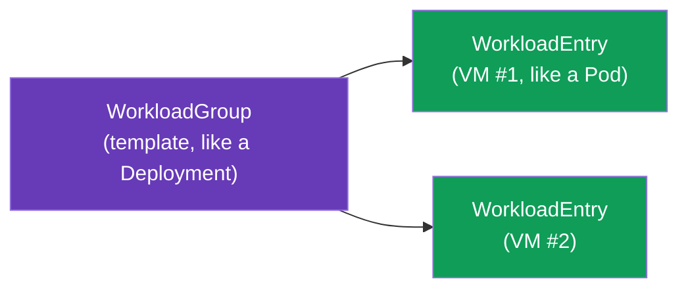
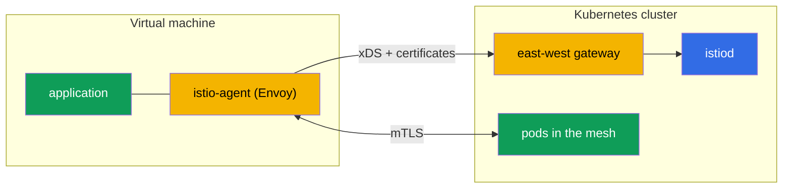

[RU version](ru.md) · [Versión en español](es.md) · [Version française](fr.md) · [Deutsche Version](de.md)

# Chapter 29. Non-Kubernetes workloads: VMs in the mesh

> **What's next.** Istio is not only about Kubernetes. In reality part of the workloads live outside
> the cluster: legacy applications, databases, services on virtual machines. Istio can bring such VMs
> into the mesh - with the same mTLS, service discovery and policies as pods. In this chapter we
> cover how it works.

## 29.1. Why bring VMs into the mesh

Not everything can (or should) be moved into Kubernetes. Reasons to bring a VM into the mesh:

- **Legacy applications** that still live on VMs and are not ready for containerization.
- **A gradual migration**: a service is already partly in the cluster, partly on a VM, and they must
  communicate securely.
- **A single policy.** You want mTLS, authorization and observability (chapters 13, 14, 17) to
  extend to VMs too, not just pods.

The goal: make the VM look to the mesh like an ordinary workload - with its own identity, mTLS and an
entry in the service registry.

## 29.2. How it works: WorkloadGroup and WorkloadEntry

In Kubernetes a pod is described by a Deployment, and a concrete instance is a Pod. For VMs Istio
introduces two analogous concepts:

- **WorkloadGroup** - a template for a group of VM workloads (analogous to a Deployment): common
  labels, a ServiceAccount, ports, readiness probes. It describes "what the VMs of this group will
  be like".
- **WorkloadEntry** - a representation of **a single** VM instance (analogous to a Pod): its IP,
  labels, identity. It can be created automatically when a VM registers in a WorkloadGroup, or
  manually.



Thanks to the WorkloadEntry, the cluster's pods see the VM as ordinary service endpoints: you can
create a Kubernetes Service that includes both pods and VMs, and balance between them.

The `WorkloadGroup` describes the group and, most importantly, the identity (`serviceAccount`), the
labels and the instances' health check:

```yaml
apiVersion: networking.istio.io/v1
kind: WorkloadGroup
metadata:
  name: legacy-app
  namespace: vm-apps
spec:
  metadata:
    labels:
      app: legacy-app            # by this label the Service will find both pods and VMs
  template:
    serviceAccount: legacy-app   # the VM's SPIFFE identity, as for pods
    ports:
      http: 8080
  probe:                         # a health check of a VM instance
    httpGet:
      path: /healthz
      port: 8080
```

An ordinary `Service` with the same label unites the pods and the VMs into one service - traffic is
balanced between them transparently:

```yaml
apiVersion: v1
kind: Service
metadata:
  name: legacy-app
  namespace: vm-apps
spec:
  selector:
    app: legacy-app              # the same label -> both pods and WorkloadEntry (VMs)
  ports:
  - {name: http, port: 8080}
```

If registration is not automated, a `WorkloadEntry` is created by hand - with the IP and identity of
a specific VM:

```yaml
apiVersion: networking.istio.io/v1
kind: WorkloadEntry
metadata:
  name: legacy-app-vm1
  namespace: vm-apps
spec:
  address: 10.0.12.34            # the VM's private IP
  labels:
    app: legacy-app
  serviceAccount: legacy-app
  network: vm-network            # the VM's network (for multi-network, chapter 28)
```

## 29.3. istio-agent on a virtual machine

For a VM to become part of the mesh, **istio-agent** is installed on it - a package with Envoy and
pilot-agent (the same data plane as in a sidecar, only on the host, not in a pod). The agent:

- connects to istiod, gets its configuration over xDS and its certificates (like an ordinary
  sidecar, chapter 4);
- intercepts the application's traffic on the VM and routes it through Envoy;
- provides mTLS with the services in the cluster.



The bootstrap files for the VM are generated by `istioctl` itself from the `WorkloadGroup` - you do
not need to write them by hand:

```bash
# 1. create the WorkloadGroup (or apply the manifest from 29.2)
istioctl x workload group create \
  --name legacy-app --namespace vm-apps \
  --serviceAccount legacy-app > workloadgroup.yaml
kubectl apply -f workloadgroup.yaml

# 2. generate the set of files for a specific VM
istioctl x workload entry configure \
  -f workloadgroup.yaml -o vm-files/ --clusterID cluster1
```

The `vm-files/` directory will contain:

- **`cluster.env`** - the cluster ID, the network, the interception ports;
- **`mesh.yaml`** - the mesh config for the agent;
- **`root-cert.pem`** - the root of trust (the common CA, chapter 16);
- **`istio-token`** - a ServiceAccount token, with which the agent requests a working certificate;
- **`hosts`** - the address of istiod (via the east-west gateway).

These files are copied to the VM, the `istio-sidecar` package is installed and the agent is started
(`systemctl start istio`). After that the VM connects to the mesh.

> **Ambient and VMs.** Everything described is about the sidecar approach (istio-agent on the VM).
> Bringing a VM into an ambient mesh (chapter 22) is supported in a limited way and is still
> maturing; in practice VMs are currently onboarded precisely via istio-agent.

## 29.4. Connectivity with the cluster and DNS

Two technical tasks that need solving.

- **The VM's access to istiod.** A VM is usually outside the cluster network, so it reaches istiod
  through the **east-west gateway** (the same one as for multi-cluster, chapter 28): it exposes the
  xDS and certificate-issuance ports. At boot the VM gets a bootstrap configuration with this
  gateway's address.
- **DNS.** The VM does not know about kube-DNS and cannot resolve names like
  `reviews.default.svc.cluster.local`. So istio-agent on the VM brings up a **DNS proxy**: it
  intercepts DNS queries and resolves the cluster services' names, so that the application on the VM
  can reach them by ordinary names.

## 29.5. Identity and mTLS for a VM

The VM gets the same cryptographic identity as pods - based on a ServiceAccount and in the SPIFFE
format (chapter 13). When setting up the VM it is provisioned with a ServiceAccount token, with which
istio-agent requests a working certificate from istiod.

As a result mTLS and `AuthorizationPolicy` (chapter 14) work for the VM exactly as for pods: a rule
`principals: [.../sa/<vm-sa>]` distinguishes the VM by its identity, traffic between the VM and pods
is encrypted. From a security standpoint the VM becomes a full-fledged mesh participant, not a "hole"
in the perimeter.

## 29.6. Lifecycle: registration and removal

- **Registration.** At istio-agent startup the VM can **automatically** register in the
  `WorkloadGroup`, creating its `WorkloadEntry`. This way the mesh learns about a new instance with
  no manual action - handy for VM autoscaling.
- **Removal.** When a VM is decommissioned, its `WorkloadEntry` needs to be removed from the mesh,
  otherwise a "dead" endpoint remains, onto which traffic will be poured. With automatic registration
  this is handled by the health check; with manual - delete the WorkloadEntry explicitly.

**Check your work.** That the VM has really entered the mesh is seen like this:

```bash
# the WorkloadEntry for the VM was created (auto-registration) and is visible in the registry
kubectl get workloadentry -n vm-apps
# istiod sees the VM as a proxy in the SYNCED state
istioctl proxy-status | grep <vm-name>
# from a pod a request goes to the VM endpoint too (both the pod and the VM respond)
kubectl exec <pod> -n app -- curl -s http://legacy-app.vm-apps:8080/
# on the VM itself: the application resolves cluster names via the agent's DNS proxy
curl -s http://reviews.default.svc.cluster.local:9080/
```

If the VM is not visible in `proxy-status` - look at the east-west gateway's availability and the
validity of the `istio-token`; if cluster names do not resolve - the agent's DNS proxy.

## 29.7. VMs on AWS/EC2

On AWS a "virtual machine" is an EC2 instance, and the chapter's abstract requirements turn into a
concrete network and automation.

- **EC2 ↔ EKS connectivity is about the VPC.** The EC2 must have a network path to the cluster's
  east-west gateway: either in the same VPC, or via **VPC peering / Transit Gateway** (as in chapter
  28). Usually the east-west gateway is exposed via an **internal NLB**, and the EC2 reaches it over
  the private network - without going out to the internet.
- **Security groups.** Allow the EC2 access to the ports the east-west gateway exposes for VMs:
  istiod's xDS and certificate issuance (port `15012`) and the gateway's multiplexed port `15443`.
  Without this the agent will not get its config and certificates.
- **Bootstrap automation.** The files from `istioctl x workload entry configure` are delivered to
  the instance not by hand but via **user-data** at boot or via **SSM** (Parameter Store /
  RunCommand). The ServiceAccount token is time-limited - generate it close to the moment the
  instance boots.
- **Auto Scaling Group.** With auto-registration a new EC2 creates its `WorkloadEntry` itself at
  startup. But on scale-in the instance disappears - attach an ASG **lifecycle hook** (or rely on the
  WorkloadGroup's health check) so that the "dead" WorkloadEntry is removed and traffic is not poured
  onto it (see 29.6).
- **The common CA.** As in multi-cluster, the root of trust for the VMs and pods must be common - on
  AWS this is ACM PCA or an offline root (chapter 16).

## 29.8. Best practices

- **A common CA is mandatory.** As in multi-cluster (chapter 28), mTLS between the VM and pods
  requires a common root of trust (chapter 16).
- **The east-west gateway for access to istiod** is the standard way; guard its availability,
  otherwise the VMs will not get their config and certificates.
- **Automatic registration + correct removal.** Set up auto-registration and a health check so that
  dead VMs do not linger in the registry.
- **Certificate rotation works on VMs too** - istio-agent renews them itself, but watch istiod's
  availability (otherwise the certificates expire).
- **A VM is a step, not a goal.** Bringing a VM into the mesh is usually part of a migration into
  Kubernetes. Keep it as a transitional state, not a permanent complex construction, if the workload
  can be containerized.
- **Observability and troubleshooting.** The VM participates in metrics and traces (chapters 17-18);
  for diagnostics istio-agent on the VM has the same tools as a sidecar.

## 29.9. Chapter summary

- Istio can bring non-Kubernetes workloads - virtual machines - into the mesh with the same mTLS,
  discovery and policies as pods.
- **WorkloadGroup** is a template for a group of VMs (analogous to a Deployment), **WorkloadEntry** -
  a concrete VM instance (analogous to a Pod); pods see VMs as ordinary endpoints.
- **istio-agent** (Envoy + pilot-agent) is installed on the VM: it connects to istiod, gets its
  config and certificates, provides mTLS. The bootstrap files (`cluster.env`, `mesh.yaml`,
  `root-cert.pem`, `istio-token`, `hosts`) are generated by `istioctl x workload entry configure`.
- Access to istiod is via the **east-west gateway**; cluster names are resolved by the agent's **DNS
  proxy**.
- The VM gets a SPIFFE identity by its ServiceAccount, so mTLS and AuthorizationPolicy work as for
  pods.
- Lifecycle: auto-registration of the WorkloadEntry at startup, correct removal on decommission.
- On AWS a VM is an EC2: connectivity to the east-west gateway via VPC/peering/TGW and an internal
  NLB, access by security groups (15012/15443), bootstrap via user-data/SSM, WorkloadEntry removal by
  an ASG lifecycle hook.
- Verification: `kubectl get workloadentry`, `istioctl proxy-status`, cross-`curl` pod↔VM and cluster
  name resolution on the VM.
- Best practices: a common CA, availability of the east-west gateway and istiod, auto-registration
  with a health check, treating the VM as a transitional migration stage.

## 29.10. Self-check questions

1. Why bring VMs into the mesh and what tasks does it solve?
2. What are WorkloadGroup and WorkloadEntry and what are they like in the Kubernetes world?
3. What does istio-agent do on a VM?
4. How does a VM reach istiod and how does it resolve cluster names?
5. How does a VM get its identity and do mTLS and AuthorizationPolicy work for it?
6. Which bootstrap files does the agent on the VM need and what generates them?
7. How, on AWS, do you provide EC2 connectivity to the mesh (network, security groups) and automate
   the bootstrap?
8. Why is it important to remove the WorkloadEntry correctly when decommissioning a VM and how is it
   done in an ASG?
9. How do you check that the VM has really entered the mesh?

## Practice

A separate lab is **planned**: deploy a VM, install istio-agent, connect it to the mesh via an
east-west gateway (WorkloadGroup/WorkloadEntry), verify mTLS between the VM and pods and DNS
resolution of cluster services.

🧪 Lab: **TODO (EKS + VM)**.

---
[Contents](../README.md) · [Chapter 28](../28/en.md) · [Chapter 30](../30/en.md)
