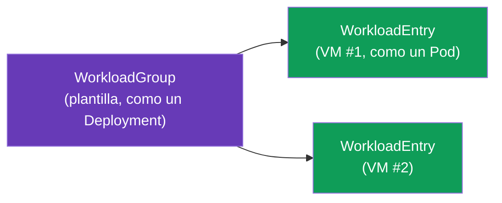
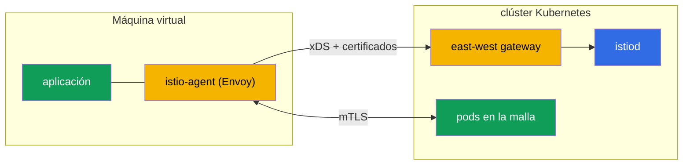

[RU version](ru.md) · [Eng version](en.md)

# Capítulo 29. Cargas de trabajo fuera de Kubernetes: VMs en la malla

> **Qué sigue.** Istio no es solo sobre Kubernetes. En realidad parte de las cargas de trabajo viven
> fuera del clúster: aplicaciones legacy, bases de datos, servicios en máquinas virtuales. Istio
> puede traer esas VMs a la malla - con el mismo mTLS, service discovery y políticas que los pods. En
> este capítulo cubrimos cómo funciona.

## 29.1. Por qué traer VMs a la malla

No todo puede (o debe) moverse a Kubernetes. Razones para traer una VM a la malla:

- **Aplicaciones legacy** que todavía viven en VMs y no están listas para la contenerización.
- **Una migración gradual**: un servicio ya está en parte en el clúster, en parte en una VM, y deben
  comunicarse de forma segura.
- **Una única política.** Quieres que mTLS, autorización y observabilidad (capítulos 13, 14, 17) se
  extiendan también a las VMs, no solo a los pods.

El objetivo: hacer que la VM parezca a la malla una carga de trabajo ordinaria - con su propia
identidad, mTLS y una entrada en el service registry.

## 29.2. Cómo funciona: WorkloadGroup y WorkloadEntry

En Kubernetes un pod se describe con un Deployment, y una instancia concreta es un Pod. Para las VMs
Istio introduce dos conceptos análogos:

- **WorkloadGroup** - una plantilla para un grupo de cargas de trabajo de VM (análoga a un
  Deployment): etiquetas comunes, un ServiceAccount, puertos, readiness probes. Describe "cómo serán
  las VMs de este grupo".
- **WorkloadEntry** - una representación de **una sola** instancia de VM (análoga a un Pod): su IP,
  etiquetas, identidad. Puede crearse automáticamente cuando una VM se registra en un WorkloadGroup, o
  manualmente.



Gracias al WorkloadEntry, los pods del clúster ven la VM como endpoints de servicio ordinarios:
puedes crear un Service de Kubernetes que incluya tanto pods como VMs, y balancear entre ellos.

El `WorkloadGroup` describe el grupo y, lo más importante, la identidad (`serviceAccount`), las
etiquetas y el health check de las instancias:

```yaml
apiVersion: networking.istio.io/v1
kind: WorkloadGroup
metadata:
  name: legacy-app
  namespace: vm-apps
spec:
  metadata:
    labels:
      app: legacy-app            # por esta etiqueta el Service encontrará tanto pods como VMs
  template:
    serviceAccount: legacy-app   # la identidad SPIFFE de la VM, como para los pods
    ports:
      http: 8080
  probe:                         # un health check de una instancia de VM
    httpGet:
      path: /healthz
      port: 8080
```

Un `Service` ordinario con la misma etiqueta une los pods y las VMs en un solo servicio - el tráfico
se balancea entre ellos de forma transparente:

```yaml
apiVersion: v1
kind: Service
metadata:
  name: legacy-app
  namespace: vm-apps
spec:
  selector:
    app: legacy-app              # la misma etiqueta -> tanto pods como WorkloadEntry (VMs)
  ports:
  - {name: http, port: 8080}
```

Si el registro no está automatizado, un `WorkloadEntry` se crea a mano - con la IP y la identidad de
una VM concreta:

```yaml
apiVersion: networking.istio.io/v1
kind: WorkloadEntry
metadata:
  name: legacy-app-vm1
  namespace: vm-apps
spec:
  address: 10.0.12.34            # la IP privada de la VM
  labels:
    app: legacy-app
  serviceAccount: legacy-app
  network: vm-network            # la red de la VM (para multi-network, capítulo 28)
```

## 29.3. istio-agent en una máquina virtual

Para que una VM se convierta en parte de la malla, se instala en ella **istio-agent** - un paquete
con Envoy y pilot-agent (el mismo data plane que en un sidecar, solo que en el host, no en un pod). El
agente:

- se conecta a istiod, obtiene su configuración por xDS y sus certificados (como un sidecar
  ordinario, capítulo 4);
- intercepta el tráfico de la aplicación en la VM y lo enruta a través de Envoy;
- proporciona mTLS con los servicios en el clúster.



Los ficheros de bootstrap para la VM los genera `istioctl` mismo a partir del `WorkloadGroup` - no
necesitas escribirlos a mano:

```bash
# 1. crea el WorkloadGroup (o aplica el manifiesto de 29.2)
istioctl x workload group create \
  --name legacy-app --namespace vm-apps \
  --serviceAccount legacy-app > workloadgroup.yaml
kubectl apply -f workloadgroup.yaml

# 2. genera el conjunto de ficheros para una VM concreta
istioctl x workload entry configure \
  -f workloadgroup.yaml -o vm-files/ --clusterID cluster1
```

El directorio `vm-files/` contendrá:

- **`cluster.env`** - el ID del clúster, la red, los puertos de interceptación;
- **`mesh.yaml`** - la config de la malla para el agente;
- **`root-cert.pem`** - la raíz de confianza (la CA común, capítulo 16);
- **`istio-token`** - un token de ServiceAccount, con el que el agente solicita un certificado de
  trabajo;
- **`hosts`** - la dirección de istiod (vía el east-west gateway).

Estos ficheros se copian a la VM, se instala el paquete `istio-sidecar` y se arranca el agente
(`systemctl start istio`). Tras eso la VM se conecta a la malla.

> **Ambient y VMs.** Todo lo descrito es sobre el enfoque de sidecar (istio-agent en la VM). Traer una
> VM a una malla ambient (capítulo 22) está soportado de forma limitada y todavía está madurando; en
> la práctica las VMs actualmente se incorporan precisamente vía istio-agent.

## 29.4. Conectividad con el clúster y DNS

Dos tareas técnicas que hay que resolver.

- **El acceso de la VM a istiod.** Una VM está normalmente fuera de la red del clúster, así que
  alcanza istiod a través del **east-west gateway** (el mismo que para multiclúster, capítulo 28):
  expone los puertos de xDS y de emisión de certificados. En el arranque la VM obtiene una
  configuración de bootstrap con la dirección de este gateway.
- **DNS.** La VM no sabe de kube-DNS y no puede resolver nombres como
  `reviews.default.svc.cluster.local`. Así que istio-agent en la VM levanta un **DNS proxy**:
  intercepta las consultas DNS y resuelve los nombres de los servicios del clúster, para que la
  aplicación en la VM pueda alcanzarlos por nombres ordinarios.

## 29.5. Identidad y mTLS para una VM

La VM obtiene la misma identidad criptográfica que los pods - basada en un ServiceAccount y en el
formato SPIFFE (capítulo 13). Al configurar la VM se le provisiona un token de ServiceAccount, con el
que istio-agent solicita un certificado de trabajo a istiod.

Como resultado mTLS y `AuthorizationPolicy` (capítulo 14) funcionan para la VM exactamente como para
los pods: una regla `principals: [.../sa/<vm-sa>]` distingue la VM por su identidad, el tráfico entre
la VM y los pods está cifrado. Desde el punto de vista de la seguridad la VM se convierte en un
participante de pleno derecho de la malla, no en un "agujero" en el perímetro.

## 29.6. Ciclo de vida: registro y eliminación

- **Registro.** Al arrancar istio-agent la VM puede **automáticamente** registrarse en el
  `WorkloadGroup`, creando su `WorkloadEntry`. De esta forma la malla se entera de una nueva instancia
  sin acción manual - práctico para el autoescalado de VMs.
- **Eliminación.** Cuando una VM se retira, su `WorkloadEntry` debe eliminarse de la malla, de lo
  contrario queda un endpoint "muerto", sobre el que se verterá tráfico. Con el registro automático
  esto lo maneja el health check; con el manual - borra el WorkloadEntry explícitamente.

**Comprueba tu trabajo.** Que la VM ha entrado realmente en la malla se ve así:

```bash
# el WorkloadEntry para la VM se creó (auto-registro) y es visible en el registro
kubectl get workloadentry -n vm-apps
# istiod ve la VM como un proxy en estado SYNCED
istioctl proxy-status | grep <vm-name>
# desde un pod una petición va también al endpoint de la VM (responden tanto el pod como la VM)
kubectl exec <pod> -n app -- curl -s http://legacy-app.vm-apps:8080/
# en la propia VM: la aplicación resuelve nombres del clúster vía el DNS proxy del agente
curl -s http://reviews.default.svc.cluster.local:9080/
```

Si la VM no es visible en `proxy-status` - mira la disponibilidad del east-west gateway y la validez
del `istio-token`; si los nombres del clúster no se resuelven - el DNS proxy del agente.

## 29.7. VMs en AWS/EC2

En AWS una "máquina virtual" es una instancia EC2, y los requisitos abstractos del capítulo se
convierten en una red y una automatización concretas.

- **La conectividad EC2 ↔ EKS es sobre la VPC.** La EC2 debe tener un camino de red al east-west
  gateway del clúster: o bien en la misma VPC, o bien vía **VPC peering / Transit Gateway** (como en
  el capítulo 28). Normalmente el east-west gateway se expone vía un **NLB interno**, y la EC2 lo
  alcanza por la red privada - sin salir a internet.
- **Security groups.** Permite a la EC2 el acceso a los puertos que el east-west gateway expone para
  las VMs: el xDS de istiod y la emisión de certificados (puerto `15012`) y el puerto multiplexado
  `15443` del gateway. Sin esto el agente no obtendrá su config y sus certificados.
- **Automatización del bootstrap.** Los ficheros de `istioctl x workload entry configure` se entregan
  a la instancia no a mano sino vía **user-data** en el arranque o vía **SSM** (Parameter Store /
  RunCommand). El token de ServiceAccount tiene tiempo limitado - genéralo cerca del momento en que la
  instancia arranca.
- **Auto Scaling Group.** Con el auto-registro una nueva EC2 crea su `WorkloadEntry` por sí misma al
  arrancar. Pero en el scale-in la instancia desaparece - adjunta un **lifecycle hook** del ASG (o
  apóyate en el health check del WorkloadGroup) para que el `WorkloadEntry` "muerto" se elimine y no
  se vierta tráfico sobre él (ver 29.6).
- **La CA común.** Como en multiclúster, la raíz de confianza para las VMs y los pods debe ser común -
  en AWS esto es ACM PCA o una raíz offline (capítulo 16).

## 29.8. Buenas prácticas

- **Una CA común es obligatoria.** Como en multiclúster (capítulo 28), el mTLS entre la VM y los pods
  requiere una raíz de confianza común (capítulo 16).
- **El east-west gateway para el acceso a istiod** es la forma estándar; guarda su disponibilidad, de
  lo contrario las VMs no obtendrán su config y sus certificados.
- **Registro automático + eliminación correcta.** Monta el auto-registro y un health check para que
  las VMs muertas no se queden en el registro.
- **La rotación de certificados también funciona en las VMs** - istio-agent los renueva por sí mismo,
  pero vigila la disponibilidad de istiod (de lo contrario los certificados expiran).
- **Una VM es un paso, no una meta.** Traer una VM a la malla es normalmente parte de una migración a
  Kubernetes. Mantenlo como un estado transitorio, no como una construcción compleja permanente, si la
  carga de trabajo puede contenerizarse.
- **Observabilidad y troubleshooting.** La VM participa en métricas y trazas (capítulos 17-18); para
  el diagnóstico istio-agent en la VM tiene las mismas herramientas que un sidecar.

## 29.9. Resumen del capítulo

- Istio puede traer cargas de trabajo fuera de Kubernetes - máquinas virtuales - a la malla con el
  mismo mTLS, discovery y políticas que los pods.
- **WorkloadGroup** es una plantilla para un grupo de VMs (análoga a un Deployment), **WorkloadEntry**
  - una instancia de VM concreta (análoga a un Pod); los pods ven las VMs como endpoints ordinarios.
- En la VM se instala **istio-agent** (Envoy + pilot-agent): se conecta a istiod, obtiene su config y
  sus certificados, proporciona mTLS. Los ficheros de bootstrap (`cluster.env`, `mesh.yaml`,
  `root-cert.pem`, `istio-token`, `hosts`) los genera `istioctl x workload entry configure`.
- El acceso a istiod es vía el **east-west gateway**; los nombres del clúster los resuelve el **DNS
  proxy** del agente.
- La VM obtiene una identidad SPIFFE por su ServiceAccount, así que mTLS y AuthorizationPolicy
  funcionan como para los pods.
- Ciclo de vida: auto-registro del WorkloadEntry al arrancar, eliminación correcta al retirar.
- En AWS una VM es una EC2: conectividad al east-west gateway vía VPC/peering/TGW y un NLB interno,
  acceso por security groups (15012/15443), bootstrap vía user-data/SSM, eliminación del WorkloadEntry
  por un lifecycle hook del ASG.
- Verificación: `kubectl get workloadentry`, `istioctl proxy-status`, `curl` cruzado pod↔VM y
  resolución de nombres del clúster en la VM.
- Buenas prácticas: una CA común, disponibilidad del east-west gateway e istiod, auto-registro con un
  health check, tratar la VM como una etapa de migración transitoria.

## 29.10. Preguntas de autoevaluación

1. ¿Por qué traer VMs a la malla y qué tareas resuelve?
2. ¿Qué son WorkloadGroup y WorkloadEntry y a qué se parecen en el mundo de Kubernetes?
3. ¿Qué hace istio-agent en una VM?
4. ¿Cómo alcanza una VM a istiod y cómo resuelve los nombres del clúster?
5. ¿Cómo obtiene una VM su identidad y funcionan mTLS y AuthorizationPolicy para ella?
6. ¿Qué ficheros de bootstrap necesita el agente en la VM y qué los genera?
7. ¿Cómo, en AWS, proporcionas conectividad de EC2 a la malla (red, security groups) y automatizas el
   bootstrap?
8. ¿Por qué es importante eliminar el WorkloadEntry correctamente al retirar una VM y cómo se hace en
   un ASG?
9. ¿Cómo compruebas que la VM ha entrado realmente en la malla?

## Práctica

Un laboratorio aparte está **planificado**: despliega una VM, instala istio-agent, conéctala a la
malla vía un east-west gateway (WorkloadGroup/WorkloadEntry), verifica el mTLS entre la VM y los pods
y la resolución DNS de los servicios del clúster.

🧪 Laboratorio: **TODO (EKS + VM)**.

---
[Índice](../README_ES.md) · [Capítulo 28](../28/es.md) · [Capítulo 30](../30/es.md)
