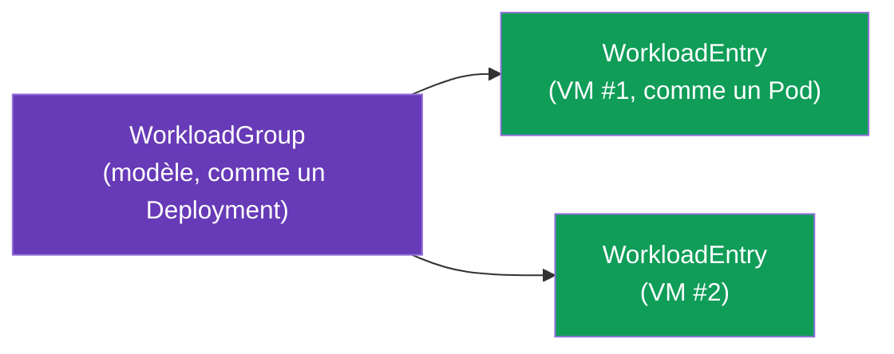
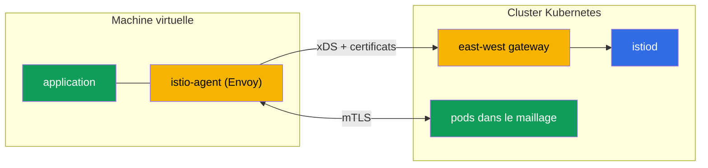

[RU version](ru.md) · [Eng version](en.md) · [Versión en español](es.md) · [Deutsche Version](de.md)

# Chapitre 29. Charges de travail non-Kubernetes : les VM dans le maillage

> **La suite.** Istio, ce n'est pas seulement Kubernetes. En réalité, une partie des charges de
> travail vit hors du cluster : applications legacy, bases de données, services sur machines
> virtuelles. Istio sait intégrer de telles VM dans le maillage - avec le même mTLS, la même
> découverte de services et les mêmes politiques que les pods. Dans ce chapitre, nous verrons
> comment cela fonctionne.

## 29.1. Pourquoi intégrer des VM dans le maillage

On ne peut pas (ou on ne veut pas) tout migrer vers Kubernetes. Raisons d'intégrer une VM au
maillage :

- **Applications legacy**, qui vivent encore sur des VM et ne sont pas prêtes à être
  conteneurisées.
- **Migration progressive** : le service est déjà en partie dans le cluster, en partie sur des VM,
  et ils doivent communiquer en toute sécurité.
- **Politique unifiée.** On veut que le mTLS, l'autorisation et l'observabilité (chapitres 13, 14,
  17) s'étendent aussi aux VM, et pas seulement aux pods.

Objectif : faire en sorte qu'une VM apparaisse au maillage comme une charge de travail ordinaire -
avec sa propre identity, son mTLS et une entrée dans le registre des services.

## 29.2. Comment c'est construit : WorkloadGroup et WorkloadEntry

Dans Kubernetes, un pod est décrit par un Deployment, et une instance concrète est un Pod. Pour les
VM, Istio introduit deux notions analogues :

- **WorkloadGroup** - modèle d'un groupe de charges VM (analogue au Deployment) : labels communs,
  ServiceAccount, ports, vérifications de disponibilité. Il décrit « à quoi ressembleront » les VM
  de ce groupe.
- **WorkloadEntry** - représentation d'**une seule** instance de VM (analogue au Pod) : son IP, ses
  labels, son identity. Il peut être créé automatiquement, lorsque la VM s'enregistre dans le
  WorkloadGroup, ou manuellement.



Grâce au WorkloadEntry, les pods du cluster voient la VM comme des endpoints de service
ordinaires : on peut créer un Service Kubernetes qui inclut à la fois les pods et les VM, et
répartir la charge entre eux.

`WorkloadGroup` décrit le groupe et, surtout, l'identity (`serviceAccount`), les labels et la
health-check des instances :

```yaml
apiVersion: networking.istio.io/v1
kind: WorkloadGroup
metadata:
  name: legacy-app
  namespace: vm-apps
spec:
  metadata:
    labels:
      app: legacy-app            # par ce label, le Service trouvera à la fois les pods et les VM
  template:
    serviceAccount: legacy-app   # identity SPIFFE de la VM, comme pour les pods
    ports:
      http: 8080
  probe:                         # health-check de l'instance VM
    httpGet:
      path: /healthz
      port: 8080
```

Un `Service` ordinaire, par le même label, réunit les pods et les VM en un seul service - le trafic
est réparti entre eux de façon transparente :

```yaml
apiVersion: v1
kind: Service
metadata:
  name: legacy-app
  namespace: vm-apps
spec:
  selector:
    app: legacy-app              # le même label -> et les pods, et les WorkloadEntry (VM)
  ports:
  - {name: http, port: 8080}
```

Si l'enregistrement n'est pas automatisé, on crée le `WorkloadEntry` manuellement - avec l'IP et
l'identity de la VM concrète :

```yaml
apiVersion: networking.istio.io/v1
kind: WorkloadEntry
metadata:
  name: legacy-app-vm1
  namespace: vm-apps
spec:
  address: 10.0.12.34            # IP privée de la machine virtuelle
  labels:
    app: legacy-app
  serviceAccount: legacy-app
  network: vm-network            # réseau de la VM (pour le multi-network, chapitre 28)
```

## 29.3. istio-agent sur la machine virtuelle

Pour qu'une VM devienne partie du maillage, on y installe **istio-agent** - un paquet avec Envoy et
pilot-agent (le même data plane que dans le sidecar, mais sur l'hôte et non dans un pod). L'agent :

- se connecte à istiod, reçoit la configuration via xDS et les certificats (comme un sidecar
  ordinaire, chapitre 4) ;
- intercepte le trafic de l'application sur la VM et le fait transiter par Envoy ;
- assure le mTLS avec les services du cluster.



Les fichiers de bootstrap pour la VM sont générés par `istioctl` lui-même à partir du
`WorkloadGroup` - pas besoin de les écrire à la main :

```bash
# 1. créer le WorkloadGroup (ou appliquer le manifeste de 29.2)
istioctl x workload group create \
  --name legacy-app --namespace vm-apps \
  --serviceAccount legacy-app > workloadgroup.yaml
kubectl apply -f workloadgroup.yaml

# 2. générer l'ensemble des fichiers pour une VM concrète
istioctl x workload entry configure \
  -f workloadgroup.yaml -o vm-files/ --clusterID cluster1
```

Dans le répertoire `vm-files/` apparaîtront :

- **`cluster.env`** - ID du cluster, réseau, ports d'interception ;
- **`mesh.yaml`** - config du maillage pour l'agent ;
- **`root-cert.pem`** - racine de confiance (CA commun, chapitre 16) ;
- **`istio-token`** - token du ServiceAccount, avec lequel l'agent demandera un certificat de
  travail ;
- **`hosts`** - adresse d'istiod (via l'east-west gateway).

Ces fichiers sont copiés sur la VM, on installe le paquet `istio-sidecar` et on lance l'agent
(`systemctl start istio`). Après quoi la VM se connecte au maillage.

> **Ambient et VM.** Tout ce qui est décrit ici concerne l'approche sidecar (istio-agent sur la
> VM). L'intégration d'une VM dans un maillage ambient (chapitre 22) est prise en charge de façon
> limitée et arrive à maturité ; en pratique, on intègre aujourd'hui les VM justement via
> istio-agent.

## 29.4. Liaison avec le cluster et DNS

Deux tâches techniques à résoudre.

- **Accès de la VM à istiod.** La VM est généralement hors du réseau du cluster, elle atteint donc
  istiod via l'**east-west gateway** (le même que pour le multicluster, chapitre 28) : celui-ci
  expose vers l'extérieur les ports xDS et de délivrance des certificats. Au démarrage, la VM reçoit
  une configuration de bootstrap avec l'adresse de cette gateway.
- **DNS.** La VM ne connaît pas kube-DNS et ne peut pas résoudre des noms comme
  `reviews.default.svc.cluster.local`. C'est pourquoi istio-agent sur la VM monte un **DNS proxy** :
  il intercepte les requêtes DNS et résout les noms des services du cluster, pour que l'application
  sur la VM puisse s'y adresser par des noms ordinaires.

## 29.5. Identity et mTLS pour la VM

La VM reçoit la même identity cryptographique que les pods - fondée sur le ServiceAccount et au
format SPIFFE (chapitre 13). Lors de la configuration de la VM, on lui provisionne un token
ServiceAccount, avec lequel istio-agent demande à istiod un certificat de travail.

En conséquence, le mTLS et l'`AuthorizationPolicy` (chapitre 14) fonctionnent pour la VM exactement
comme pour les pods : une règle `principals: [.../sa/<vm-sa>]` distingue la VM par son identity, le
trafic entre la VM et les pods est chiffré. Du point de vue de la sécurité, la VM devient un
participant à part entière du maillage, et non un « trou » dans le périmètre.

## 29.6. Cycle de vie : enregistrement et suppression

- **Enregistrement.** Au démarrage d'istio-agent, la VM peut s'enregistrer **automatiquement** dans
  le `WorkloadGroup`, en créant son propre `WorkloadEntry`. Ainsi le maillage prend connaissance de
  la nouvelle instance sans action manuelle - pratique pour l'autoscaling des VM.
- **Suppression.** Lorsqu'une VM est mise hors service, il faut retirer son `WorkloadEntry` du
  maillage, sinon il restera un endpoint « mort » vers lequel le trafic continuera d'affluer. Avec
  l'enregistrement automatique, c'est géré par la health-check ; avec le manuel - supprimez le
  WorkloadEntry explicitement.

**Vérifie ton travail.** Que la VM soit réellement entrée dans le maillage se voit ainsi :

```bash
# le WorkloadEntry de la VM est créé (auto-enregistrement) et visible dans le registre
kubectl get workloadentry -n vm-apps
# istiod voit la VM comme un proxy à l'état SYNCED
istioctl proxy-status | grep <vm-name>
# depuis un pod, la requête part aussi vers l'endpoint VM (le pod et la VM répondent)
kubectl exec <pod> -n app -- curl -s http://legacy-app.vm-apps:8080/
# sur la VM elle-même : l'application résout les noms du cluster via le DNS proxy de l'agent
curl -s http://reviews.default.svc.cluster.local:9080/
```

Si la VM n'apparaît pas dans `proxy-status` - vérifiez la disponibilité de l'east-west gateway et la
validité de l'`istio-token` ; si les noms du cluster ne se résolvent pas - le DNS proxy de l'agent.

## 29.7. VM sur AWS/EC2

Sur AWS, une « machine virtuelle » est une instance EC2, et les exigences abstraites du chapitre se
transforment en un réseau concret et de l'automatisation.

- **La connectivité EC2 ↔ EKS, c'est le VPC.** L'EC2 doit avoir un chemin réseau jusqu'à l'east-west
  gateway du cluster : soit dans le même VPC, soit via un **VPC peering / Transit Gateway** (comme au
  chapitre 28). Généralement, on publie l'east-west via un **NLB interne**, et l'EC2 y accède par le
  réseau privé - sans sortie vers Internet.
- **Security groups.** Autorisez depuis l'EC2 l'accès aux ports qu'expose l'east-west gateway pour
  les VM : xDS et délivrance des certificats d'istiod (port `15012`) et le port multiplexé de la
  gateway `15443`. Sans cela, l'agent ne recevra ni config ni certificats.
- **Automatisation du bootstrap.** Les fichiers issus d'`istioctl x workload entry configure` sont
  livrés sur l'instance non pas à la main, mais via **user-data** au démarrage ou via **SSM**
  (Parameter Store / RunCommand). Le token ServiceAccount est limité dans le temps - générez-le au
  plus près du moment du démarrage de l'instance.
- **Auto Scaling Group.** Avec l'auto-enregistrement, une nouvelle EC2 crée elle-même un
  `WorkloadEntry` au démarrage. Mais lors d'un scale-in, l'instance disparaît - posez un **lifecycle
  hook** ASG (ou reposez-vous sur la health-check du WorkloadGroup) pour que le WorkloadEntry
  « mort » soit retiré et que le trafic n'y afflue plus (voir 29.6).
- **CA commun.** Comme dans le multicluster, la racine de confiance pour les VM et les pods doit être
  commune - sur AWS, c'est ACM PCA ou une racine offline (chapitre 16).

## 29.8. Best practices

- **Le CA commun est obligatoire.** Comme dans le multicluster (chapitre 28), le mTLS entre VM et
  pods requiert une racine de confiance commune (chapitre 16).
- **L'east-west gateway pour l'accès à istiod** - c'est la méthode standard ; veillez à sa
  disponibilité, sinon les VM ne recevront ni config ni certificats.
- **Enregistrement automatique + retrait correct.** Configurez l'auto-enregistrement et la
  health-check pour que les VM mortes ne restent pas dans le registre.
- **La rotation des certificats fonctionne aussi sur les VM** - istio-agent les renouvelle
  lui-même, mais surveillez la disponibilité d'istiod (sinon les certificats expireront).
- **La VM est une étape, pas un but.** L'intégration d'une VM au maillage fait généralement partie
  d'une migration vers Kubernetes. Considérez-la comme un état transitoire, et non comme une
  construction complexe permanente, si l'on peut conteneuriser la charge de travail.
- **Observabilité et troubleshooting.** La VM participe aux métriques et aux traces (chapitres
  17-18) ; pour le diagnostic, istio-agent sur la VM dispose des mêmes outils que le sidecar.

## 29.9. Résumé du chapitre

- Istio sait intégrer au maillage des charges de travail hors Kubernetes - des machines virtuelles -
  avec le même mTLS, la même découverte et les mêmes politiques que les pods.
- **WorkloadGroup** est un modèle de groupe de VM (analogue au Deployment), **WorkloadEntry** - une
  instance concrète de VM (analogue au Pod) ; les pods voient les VM comme des endpoints ordinaires.
- Sur la VM, on installe **istio-agent** (Envoy + pilot-agent) : il se connecte à istiod, reçoit la
  config et les certificats, assure le mTLS. Les fichiers de bootstrap (`cluster.env`, `mesh.yaml`,
  `root-cert.pem`, `istio-token`, `hosts`) sont générés par `istioctl x workload entry configure`.
- L'accès à istiod se fait via l'**east-west gateway** ; les noms du cluster sont résolus par le
  **DNS proxy** de l'agent.
- La VM reçoit une identity SPIFFE par le ServiceAccount, donc le mTLS et l'AuthorizationPolicy
  fonctionnent comme pour les pods.
- Cycle de vie : auto-enregistrement du WorkloadEntry au démarrage, retrait correct à la mise hors
  service.
- Sur AWS, une VM est une EC2 : connectivité vers l'east-west via VPC/peering/TGW et NLB interne,
  accès par security groups (15012/15443), bootstrap via user-data/SSM, retrait du WorkloadEntry par
  lifecycle hook ASG.
- Vérification : `kubectl get workloadentry`, `istioctl proxy-status`, cross-`curl` pod↔VM et
  résolution DNS des noms du cluster sur la VM.
- Best practices : CA commun, disponibilité de l'east-west gateway et d'istiod, auto-enregistrement
  avec health-check, considérer la VM comme une étape transitoire de la migration.

## 29.10. Questions d'auto-évaluation

1. Pourquoi intégrer des VM au maillage et quels problèmes cela résout-il ?
2. Qu'est-ce que WorkloadGroup et WorkloadEntry et à quoi ressemblent-ils dans le monde Kubernetes ?
3. Que fait istio-agent sur une VM ?
4. Comment la VM atteint-elle istiod et comment résout-elle les noms du cluster ?
5. Comment la VM obtient-elle son identity et le mTLS et l'AuthorizationPolicy fonctionnent-ils pour
   elle ?
6. Quels fichiers de bootstrap l'agent sur la VM nécessite-t-il et avec quoi les génère-t-on ?
7. Comment, sur AWS, assurer la connectivité de l'EC2 avec le maillage (réseau, security groups) et
   automatiser le bootstrap ?
8. Pourquoi est-il important de retirer correctement le WorkloadEntry à la mise hors service d'une VM
   et comment fait-on cela dans une ASG ?
9. Comment vérifier que la VM est réellement entrée dans le maillage ?

## Pratique

Un lab dédié est **prévu** : déployer une VM, installer istio-agent, la connecter au maillage via
l'east-west gateway (WorkloadGroup/WorkloadEntry), vérifier le mTLS entre la VM et les pods et la
résolution DNS des services du cluster.

🧪 Lab : **TODO (EKS + VM)**.

---
[Table des matières](../README_FR.md) · [Chapitre 28](../28/fr.md) · [Chapitre 30](../30/fr.md)
