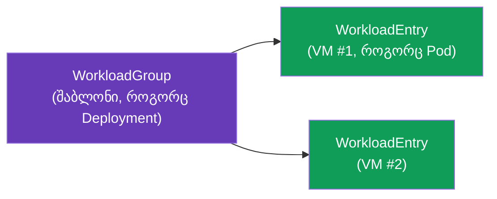
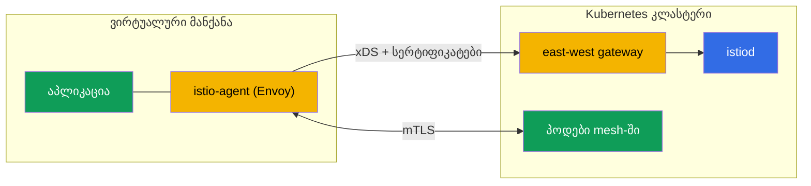

[Русская версия](ru.md) · [Eng version](en.md) · [Versión en español](es.md) · [Version française](fr.md) · [Deutsche Version](de.md) · [繁體中文版](tw.md) · [日本語版](jp.md)

# თავი 29. არა-Kubernetes დატვირთვები: VM mesh-ში

> **რა იქნება შემდეგ.** Istio მხოლოდ Kubernetes-ს არ ეხება. რეალურ გარემოში დატვირთვების ნაწილი
> კლასტერის გარეთ მუშაობს: legacy-აპლიკაციები, მონაცემთა ბაზები, სერვისები ვირტუალურ მანქანებზე.
> Istio-ს შეუძლია ასეთი VM-ების mesh-ში ჩართვა - იმავე mTLS-ით, სერვისების აღმოჩენითა და
> პოლიტიკებით, რომლებიც პოდებისთვის გამოიყენება. ამ თავში განვიხილავთ, როგორ მუშაობს ეს.

## 29.1. რატომ უნდა ჩავრთოთ VM mesh-ში

ყველაფრის Kubernetes-ში გადატანა ყოველთვის ვერ ხერხდება (ან საჭირო არ არის). VM-ის mesh-ში ჩართვის მიზეზებია:

- **Legacy-აპლიკაციები**, რომლებიც ჯერ კიდევ VM-ზე მუშაობენ და კონტეინერიზაციისთვის მზად არ არიან.
- **ეტაპობრივი მიგრაცია**: სერვისის ნაწილი უკვე კლასტერშია, ნაწილი კი VM-ზე, და მათ
  უსაფრთხოდ უნდა იურთიერთონ.
- **ერთიანი პოლიტიკა.** სასურველია, რომ mTLS, ავტორიზაცია და დაკვირვებადობა (თავები 13, 14,
  17) VM-ებზეც გავრცელდეს და არა მხოლოდ პოდებზე.

მიზანია, VM mesh-ისთვის ჩვეულებრივ workload-ად გამოიყურებოდეს - საკუთარი identity-ით,
mTLS-ითა და სერვისების რეესტრში ჩანაწერით.

## 29.2. როგორ არის მოწყობილი: WorkloadGroup და WorkloadEntry

Kubernetes-ში პოდი Deployment-ით აღიწერება, ხოლო კონკრეტული ეგზემპლარი - Pod-ია. VM-ებისთვის
Istio ორ ანალოგიურ ცნებას გვთავაზობს:

- **WorkloadGroup** - VM-დატვირთვების ჯგუფის შაბლონი (Deployment-ის ანალოგი): საერთო ჭდეები,
  ServiceAccount, პორტები, მზადყოფნის შემოწმებები. აღწერს, „როგორი იქნება“ ამ ჯგუფის VM-ები.
- **WorkloadEntry** - VM-ის **ერთი** ეგზემპლარის წარმოდგენა (Pod-ის ანალოგი): მისი IP, ჭდეები,
  identity. შეიძლება ავტომატურად შეიქმნას, როდესაც VM WorkloadGroup-ში რეგისტრირდება, ან
  ხელით.



WorkloadEntry-ის წყალობით კლასტერის პოდები VM-ს სერვისის ჩვეულებრივ endpoint-ებად ხედავენ: შესაძლებელია
Kubernetes Service-ის შექმნა, რომელიც პოდებსაც და VM-ებსაც მოიცავს და მათ შორის დატვირთვას აბალანსებს.

`WorkloadGroup` აღწერს ჯგუფს და, რაც მთავარია, ეგზემპლარების identity-ს (`serviceAccount`), ჭდეებსა და
health-შემოწმებას:

```yaml
apiVersion: networking.istio.io/v1
kind: WorkloadGroup
metadata:
  name: legacy-app
  namespace: vm-apps
spec:
  metadata:
    labels:
      app: legacy-app            # ამ ჭდით Service იპოვის pod-ებსაც და VM-საც
  template:
    serviceAccount: legacy-app   # VM-ის SPIFFE-იდენტობა, pod-ების მსგავსად
    ports:
      http: 8080
  probe:                         # VM ეგზემპლარის health-check
    httpGet:
      path: /healthz
      port: 8080
```

ჩვეულებრივი `Service` იმავე ჭდის მიხედვით პოდებსა და VM-ებს ერთ სერვისში აერთიანებს - ტრაფიკი
მათ შორის გამჭვირვალედ ბალანსდება:

```yaml
apiVersion: v1
kind: Service
metadata:
  name: legacy-app
  namespace: vm-apps
spec:
  selector:
    app: legacy-app              # იგივე label -> pod-ებიც და WorkloadEntry (VM)
  ports:
  - {name: http, port: 8080}
```

თუ რეგისტრაცია ავტომატიზებული არ არის, `WorkloadEntry` ხელით იქმნება - კონკრეტული VM-ის IP-ითა და identity-ით:

```yaml
apiVersion: networking.istio.io/v1
kind: WorkloadEntry
metadata:
  name: legacy-app-vm1
  namespace: vm-apps
spec:
  address: 10.0.12.34            # ვირტუალურის პრივატული IP
  labels:
    app: legacy-app
  serviceAccount: legacy-app
  network: vm-network            # VM-ის ქსელი (multi-network-ისთვის, თავი 28)
```

## 29.3. istio-agent ვირტუალურ მანქანაზე

VM mesh-ის ნაწილი რომ გახდეს, მასზე აყენებენ **istio-agent**-ს - პაკეტს Envoy-ითა და pilot-agent-ით
(იგივე data plane, რაც sidecar-შია, ოღონდ ჰოსტზე და არა პოდში). აგენტი:

- უკავშირდება istiod-ს, xDS-ით იღებს კონფიგურაციასა და სერტიფიკატებს (როგორც ჩვეულებრივი sidecar,
  თავი 4);
- VM-ზე აპლიკაციის ტრაფიკს იჭერს და Envoy-ის გავლით ატარებს;
- კლასტერში არსებულ სერვისებთან mTLS-ს უზრუნველყოფს.



VM-ისთვის bootstrap-ფაილებს თავად `istioctl` აგენერირებს `WorkloadGroup`-იდან - მათი ხელით დაწერა
საჭირო არ არის:

```bash
# 1. WorkloadGroup-ის შექმნა (ან 29.2-იდან მანიფესტის გამოყენება)
istioctl x workload group create \
  --name legacy-app --namespace vm-apps \
  --serviceAccount legacy-app > workloadgroup.yaml
kubectl apply -f workloadgroup.yaml

# 2. კონკრეტული VM-ისთვის ფაილების ნაკრების გენერაცია
istioctl x workload entry configure \
  -f workloadgroup.yaml -o vm-files/ --clusterID cluster1
```

`vm-files/` კატალოგში გამოჩნდება:

- **`cluster.env`** - კლასტერის ID, ქსელი, ტრაფიკის დაჭერის პორტები;
- **`mesh.yaml`** - აგენტისთვის mesh-ის კონფიგურაცია;
- **`root-cert.pem`** - ნდობის ძირეული სერტიფიკატი (საერთო CA, თავი 16);
- **`istio-token`** - ServiceAccount-ის ტოკენი, რომლითაც აგენტი სამუშაო სერტიფიკატს მოითხოვს;
- **`hosts`** - istiod-ის მისამართი (east-west gateway-ის გავლით).

ამ ფაილებს VM-ზე აკოპირებენ, აყენებენ `istio-sidecar` პაკეტს და აგენტს უშვებენ
(`systemctl start istio`). ამის შემდეგ VM mesh-ს უკავშირდება.

> **Ambient და VM.** ყოველივე აღწერილი sidecar-მიდგომას ეხება (istio-agent VM-ზე). VM-ის
> ambient-mesh-ში (თავი 22) ჩართვის მხარდაჭერა შეზღუდულია და ჯერ ვითარდება; პრაქტიკაში VM-ს ამჟამად
> სწორედ istio-agent-ის მეშვეობით რთავენ.

## 29.4. კლასტერთან კავშირი და DNS

გადასაჭრელია ორი ტექნიკური ამოცანა.

- **VM-ის წვდომა istiod-ზე.** VM, როგორც წესი, კლასტერის ქსელის გარეთაა, ამიტომ istiod-ს
  **east-west gateway**-ის გავლით უკავშირდება (იგივე gateway, რაც მულტიკლასტერისთვის გამოიყენება, თავი 28): ის გარეთ
  აქვეყნებს xDS-ისა და სერტიფიკატების გაცემის პორტებს. ჩატვირთვისას VM იღებს bootstrap-კონფიგურაციას
  ამ gateway-ის მისამართით.
- **DNS.** VM-მა kube-DNS-ის შესახებ არაფერი იცის და ვერ resolve-ავს ისეთ სახელებს, როგორიცაა
  `reviews.default.svc.cluster.local`. ამიტომ istio-agent VM-ზე **DNS proxy**-ს უშვებს:
  ის DNS-მოთხოვნებს იჭერს და კლასტერის სერვისების სახელებს resolve-ავს, რათა VM-ზე გაშვებულმა
  აპლიკაციამ მათ ჩვეულებრივი სახელებით მიმართოს.

## 29.5. Identity და mTLS VM-ისთვის

VM იღებს ისეთივე კრიპტოგრაფიულ identity-ს, როგორსაც პოდები - ServiceAccount-ის საფუძველზე და
SPIFFE ფორმატში (თავი 13). VM-ის გამართვისას მას ServiceAccount-ის ტოკენს აწვდიან,
რომლითაც istio-agent istiod-ს სამუშაო სერტიფიკატს სთხოვს.

შედეგად, mTLS და `AuthorizationPolicy` (თავი 14) VM-ისთვის ზუსტად ისევე მუშაობს, როგორც
პოდებისთვის: წესი `principals: [.../sa/<vm-sa>]` VM-ს მისი identity-ის მიხედვით განასხვავებს, ხოლო ტრაფიკი
VM-სა და პოდებს შორის იშიფრება. უსაფრთხოების თვალსაზრისით, VM mesh-ის სრულუფლებიანი
მონაწილე ხდება და არა პერიმეტრის „ხვრელი“.

## 29.6. სასიცოცხლო ციკლი: რეგისტრაცია და წაშლა

- **რეგისტრაცია.** istio-agent-ის გაშვებისას VM შეიძლება **ავტომატურად** დარეგისტრირდეს
  `WorkloadGroup`-ში და საკუთარი `WorkloadEntry` შექმნას. ამგვარად mesh ახალი ეგზემპლარის შესახებ
  ხელით ჩარევის გარეშე იგებს - ეს მოსახერხებელია VM-ების autoscaling-ისთვის.
- **წაშლა.** როდესაც VM ექსპლუატაციიდან გამოდის, მისი `WorkloadEntry` mesh-იდან უნდა წაიშალოს,
  წინააღმდეგ შემთხვევაში დარჩება „მკვდარი“ endpoint, რომლისკენაც ტრაფიკი გაიგზავნება. ავტომატური
  რეგისტრაციისას ამას health-check ამუშავებს; ხელით რეგისტრაციისას კი WorkloadEntry აშკარად წაშალეთ.

**შეამოწმეთ თქვენი ნამუშევარი.** VM-ის mesh-ში რეალურად ჩართვა ასე ჩანს:

```bash
# WorkloadEntry VM-ისთვის შეიქმნა (ავტო-რეგისტრაცია) და ჩანს რეესტრში
kubectl get workloadentry -n vm-apps
# istiod ხედავს VM-ს როგორც proxy-ს SYNCED მდგომარეობაში
istioctl proxy-status | grep <vm-name>
# pod-იდან მოთხოვნა მიდის VM-ენდპოინტზეც (პასუხობს pod-იც და VM-იც)
kubectl exec <pod> -n app -- curl -s http://legacy-app.vm-apps:8080/
# თავად VM-ზე: აპლიკაცია კლასტერულ სახელებს აგენტის DNS proxy-ს მეშვეობით რესოლვავს
curl -s http://reviews.default.svc.cluster.local:9080/
```

თუ VM `proxy-status`-ში არ ჩანს, შეამოწმეთ east-west gateway-ის ხელმისაწვდომობა და
`istio-token`-ის ვალიდურობა; თუ კლასტერის სახელები არ resolve-დება - აგენტის DNS proxy.

## 29.7. VM AWS/EC2-ზე

AWS-ზე „ვირტუალური მანქანა“ EC2-ინსტანსია, ხოლო თავის აბსტრაქტული მოთხოვნები
კონკრეტულ ქსელად და ავტომატიზაციად გარდაიქმნება.

- **EC2 ↔ EKS კავშირი - ეს VPC-ია.** EC2-ს კლასტერის east-west gateway-მდე ქსელური გზა
  უნდა ჰქონდეს: ან იმავე VPC-ში, ან **VPC peering / Transit Gateway**-ის გავლით (როგორც 28-ე თავშია).
  ჩვეულებრივ east-west-ს **internal NLB**-ის მეშვეობით აქვეყნებენ, EC2 კი მას პრივატული ქსელით მიმართავს -
  ინტერნეტში გასვლის გარეშე.
- **Security groups.** EC2-დან დაუშვით წვდომა იმ პორტებზე, რომლებსაც east-west
  gateway VM-ებისთვის აქვეყნებს: istiod-ის xDS-სა და სერტიფიკატების გაცემის პორტზე (`15012`) და gateway-ის
  მულტიპლექსირებულ პორტზე `15443`. ამის გარეშე აგენტი კონფიგურაციასა და სერტიფიკატებს ვერ მიიღებს.
- **Bootstrap-ის ავტომატიზაცია.** `istioctl x workload entry configure`-დან მიღებული ფაილები
  ინსტანსზე ხელით კი არ გადააქვთ, არამედ გაშვებისას **user-data**-ს ან **SSM**-ის (Parameter
  Store / RunCommand) მეშვეობით. ServiceAccount-ის ტოკენს შეზღუდული მოქმედების ვადა აქვს - დააგენერირეთ ის
  ინსტანსის ჩატვირთვის მომენტთან ახლოს.
- **Auto Scaling Group.** ავტომატური რეგისტრაციისას ახალი EC2 გაშვებისას თავად ქმნის `WorkloadEntry`-ს.
  მაგრამ scale-in-ის დროს ინსტანსი ქრება - დაამატეთ ASG-ის **lifecycle hook** (ან
  დაეყრდენით WorkloadGroup-ის health-check-ს), რათა „მკვდარი“ WorkloadEntry წაიშალოს და
  მისკენ ტრაფიკი აღარ გაიგზავნოს (იხ. 29.6).
- **საერთო CA.** როგორც მულტიკლასტერში, VM-ებისა და პოდების ნდობის ძირი საერთო უნდა იყოს -
  AWS-ზე ეს არის ACM PCA ან offline-ძირი (თავი 16).

## 29.8. საუკეთესო პრაქტიკები

- **საერთო CA სავალდებულოა.** როგორც მულტიკლასტერში (თავი 28), VM-სა და პოდებს შორის mTLS
  ნდობის საერთო ძირს მოითხოვს (თავი 16).
- **east-west gateway istiod-ზე წვდომისთვის** - სტანდარტული მეთოდია; იზრუნეთ მის
  ხელმისაწვდომობაზე, წინააღმდეგ შემთხვევაში VM-ები კონფიგურაციასა და სერტიფიკატებს ვერ მიიღებენ.
- **ავტომატური რეგისტრაცია + სწორი მოხსნა.** გამართეთ ავტომატური რეგისტრაცია და
  health-check, რათა მკვდარი VM-ები რეესტრში არ დარჩნენ.
- **სერტიფიკატების როტაცია VM-ზეც მუშაობს** - istio-agent მათ თავად აახლებს, თუმცა აკონტროლეთ
  istiod-ის ხელმისაწვდომობა (წინააღმდეგ შემთხვევაში სერტიფიკატებს ვადა გაუვა).
- **VM ნაბიჯია და არა მიზანი.** VM-ის mesh-ში ჩართვა, როგორც წესი, Kubernetes-ში მიგრაციის ნაწილია.
  თუ დატვირთვის კონტეინერიზაცია შესაძლებელია, ეს გარდამავალ მდგომარეობად განიხილეთ და არა მუდმივ რთულ კონსტრუქციად.
- **დაკვირვებადობა და troubleshooting.** VM მონაწილეობს მეტრიკებსა და trace-ებში (თავები 17-18);
  დიაგნოსტიკისთვის VM-ზე istio-agent-ს იგივე ინსტრუმენტები აქვს, რაც sidecar-ს.

## 29.9. თავის შეჯამება

- Istio-ს შეუძლია mesh-ში Kubernetes-ის გარეთ არსებული დატვირთვების - ვირტუალური მანქანების - ჩართვა იმავე
  mTLS-ით, აღმოჩენის მექანიზმითა და პოლიტიკებით, რომლებიც პოდებისთვის გამოიყენება.
- **WorkloadGroup** VM-ების ჯგუფის შაბლონია (Deployment-ის ანალოგი), **WorkloadEntry** კი -
  VM-ის კონკრეტული ეგზემპლარი (Pod-ის ანალოგი); პოდები VM-ს ჩვეულებრივ endpoint-ებად ხედავენ.
- VM-ზე ყენდება **istio-agent** (Envoy + pilot-agent): ის უკავშირდება istiod-ს, იღებს
  კონფიგურაციასა და სერტიფიკატებს და უზრუნველყოფს mTLS-ს. Bootstrap-ფაილებს (`cluster.env`, `mesh.yaml`,
  `root-cert.pem`, `istio-token`, `hosts`) `istioctl x workload entry configure` აგენერირებს.
- istiod-ზე წვდომა ხდება **east-west gateway**-ის გავლით; კლასტერის სახელებს აგენტის **DNS proxy**
  resolve-ავს.
- VM ServiceAccount-ის მიხედვით SPIFFE-identity-ს იღებს, ამიტომ mTLS და AuthorizationPolicy
  ისევე მუშაობს, როგორც პოდებისთვის.
- სასიცოცხლო ციკლი: WorkloadEntry-ის ავტომატური რეგისტრაცია გაშვებისას და სწორი მოხსნა ექსპლუატაციიდან გამოყვანისას.
- AWS-ზე VM არის EC2: east-west-მდე კავშირი VPC/peering/TGW-ისა და internal NLB-ის გავლით,
  წვდომა security groups-ით (15012/15443), bootstrap user-data/SSM-ით, WorkloadEntry-ის მოხსნა
  ASG-ის lifecycle hook-ით.
- შემოწმება: `kubectl get workloadentry`, `istioctl proxy-status`, cross-`curl` pod↔VM და
  VM-ზე კლასტერის სახელების DNS-resolving.
- საუკეთესო პრაქტიკები: საერთო CA, east-west gateway-ისა და istiod-ის ხელმისაწვდომობა, ავტომატური რეგისტრაცია
  health-check-ით, VM-ისადმი დამოკიდებულება როგორც მიგრაციის გარდამავალი ეტაპისადმი.

## 29.10. თვითშემოწმების კითხვები

1. რატომ უნდა ჩავრთოთ VM mesh-ში და რა ამოცანებს წყვეტს ეს?
2. რა არის WorkloadGroup და WorkloadEntry და რას ჰგვანან ისინი Kubernetes-ის სამყაროში?
3. რას აკეთებს istio-agent VM-ზე?
4. როგორ უკავშირდება VM istiod-ს და როგორ resolve-ავს კლასტერის სახელებს?
5. როგორ იღებს VM identity-ს და მუშაობს თუ არა მისთვის mTLS და AuthorizationPolicy?
6. რომელი bootstrap-ფაილები სჭირდება აგენტს VM-ზე და რით გენერირდება ისინი?
7. როგორ უნდა უზრუნველვყოთ AWS-ზე EC2-ის mesh-თან კავშირი (ქსელი, security groups) და მოვახდინოთ
   bootstrap-ის ავტომატიზაცია?
8. რატომ არის მნიშვნელოვანი VM-ის გამორთვისას WorkloadEntry-ის სწორად მოხსნა და როგორ კეთდება ეს ASG-ში?
9. როგორ შევამოწმოთ, რომ VM ნამდვილად ჩაერთო mesh-ში?

## პრაქტიკა

ცალკე ლაბორატორია **იგეგმება**: VM-ის გაშლა, istio-agent-ის დაყენება, east-west gateway-ის გავლით
mesh-თან დაკავშირება (WorkloadGroup/WorkloadEntry), VM-სა და პოდებს შორის mTLS-ისა და
კლასტერის სერვისების DNS-resolving-ის შემოწმება.

🧪 ლაბორატორია: **TODO (EKS + VM)**.

---
[სარჩევი](../README_GE.md) · [თავი 28](../28/ge.md) · [თავი 30](../30/ge.md)
