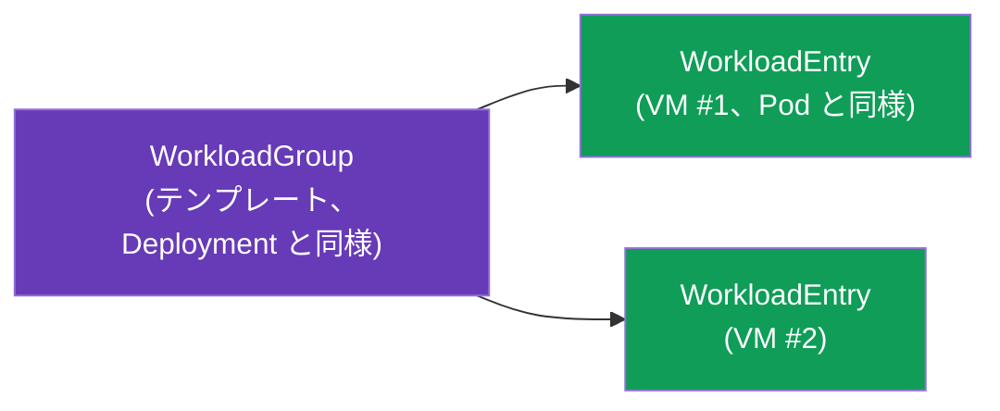
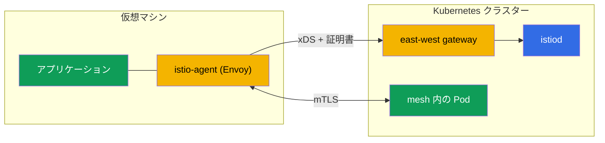

[Русская версия](ru.md) · [Eng version](en.md) · [Versión en español](es.md) · [Version française](fr.md) · [Deutsche Version](de.md) · [ქართული ვერსია](ge.md) · [繁體中文版](tw.md)

# 第29章. Kubernetes以外のワークロード: mesh 内の VM

> **この先に学ぶこと。** Istio は Kubernetes だけのものではありません。実際には、レガシーアプリケーション、データベース、仮想マシン上のサービスなど、一部のワークロードはクラスター外で稼働しています。Istio は、Pod と同じ mTLS、サービス検出、ポリシーを使用して、このような VM を mesh に組み込めます。この章では、その仕組みを説明します。

## 29.1. VM を mesh に組み込む理由

すべてを Kubernetes に移行できる（あるいは移行すべき）わけではありません。VM を mesh に組み込む理由は次のとおりです。

- **レガシーアプリケーション**: まだ VM 上で稼働しており、コンテナ化の準備ができていないもの。
- **段階的な移行**: サービスの一部はすでにクラスター内、一部は VM 上にあり、安全に通信する必要があります。
- **統一されたポリシー。** mTLS、認可、オブザーバビリティ（第 13、14、17 章）を Pod だけでなく VM にも適用したい場合。

目標は、VM を独自の identity、mTLS、サービスレジストリ内のエントリを持つ通常の workload として mesh に認識させることです。

## 29.2. 仕組み: WorkloadGroup と WorkloadEntry

Kubernetes では Pod は Deployment で記述され、個々のインスタンスが Pod です。VM に対して Istio は、これに対応する 2 つの概念を導入します。

- **WorkloadGroup**: VM ワークロード群のテンプレート（Deployment の類似物）。共通のラベル、ServiceAccount、ポート、レディネスチェックを定義します。このグループの VM が「どのようなものになるか」を記述します。
- **WorkloadEntry**: **1 台の** VM インスタンスの表現（Pod の類似物）。IP、ラベル、identity を持ちます。VM が WorkloadGroup に登録されると自動作成することも、手動で作成することもできます。



WorkloadEntry により、クラスターの Pod からは VM が通常のサービスエンドポイントとして見えます。Pod と VM の両方を含む Kubernetes Service を作成し、それらの間で負荷分散できます。

`WorkloadGroup` はグループ、特に identity (`serviceAccount`)、ラベル、インスタンスのヘルスチェックを記述します。

```yaml
apiVersion: networking.istio.io/v1
kind: WorkloadGroup
metadata:
  name: legacy-app
  namespace: vm-apps
spec:
  metadata:
    labels:
      app: legacy-app            # このラベルで Service が Pod と VM の両方を見つける
  template:
    serviceAccount: legacy-app   # VM の SPIFFE identity、Pod と同じ
    ports:
      http: 8080
  probe:                         # VM インスタンスの health-check
    httpGet:
      path: /healthz
      port: 8080
```

同じラベルを持つ通常の `Service` は Pod と VM を 1 つのサービスに統合し、トラフィックはそれらの間で透過的に負荷分散されます。

```yaml
apiVersion: v1
kind: Service
metadata:
  name: legacy-app
  namespace: vm-apps
spec:
  selector:
    app: legacy-app              # 同じ label -> Pod と WorkloadEntry (VM) の両方
  ports:
  - {name: http, port: 8080}
```

登録を自動化しない場合、特定の VM の IP と identity を指定して `WorkloadEntry` を手動で作成します。

```yaml
apiVersion: networking.istio.io/v1
kind: WorkloadEntry
metadata:
  name: legacy-app-vm1
  namespace: vm-apps
spec:
  address: 10.0.12.34            # VM のプライベート IP
  labels:
    app: legacy-app
  serviceAccount: legacy-app
  network: vm-network            # VM のネットワーク (multi-network 用、第28章)
```

## 29.3. 仮想マシン上の istio-agent

VM を mesh の一部にするには、**istio-agent** をインストールします。これは Envoy と pilot-agent を含むパッケージです（sidecar と同じ data plane ですが、Pod 内ではなくホスト上で動作します）。エージェントは次のことを行います。

- istiod に接続し、xDS 経由で設定と証明書を取得します（通常の sidecar と同様、第 4 章）。
- VM 上のアプリケーショントラフィックをインターセプトし、Envoy 経由に送ります。
- クラスター内のサービスとの mTLS を提供します。



VM 用の bootstrap ファイルは `WorkloadGroup` から `istioctl` 自身が生成するため、手動で記述する必要はありません。

```bash
# 1. WorkloadGroup を作成する (または 29.2 のマニフェストを適用する)
istioctl x workload group create \
  --name legacy-app --namespace vm-apps \
  --serviceAccount legacy-app > workloadgroup.yaml
kubectl apply -f workloadgroup.yaml

# 2. 特定の VM 用のファイル一式を生成する
istioctl x workload entry configure \
  -f workloadgroup.yaml -o vm-files/ --clusterID cluster1
```

`vm-files/` ディレクトリには次のファイルが生成されます。

- **`cluster.env`**: クラスター ID、ネットワーク、インターセプトポート。
- **`mesh.yaml`**: エージェント用の mesh 設定。
- **`root-cert.pem`**: 信頼のルート（共通 CA、第 16 章）。
- **`istio-token`**: ServiceAccount トークン。このトークンによりエージェントはワークロード証明書を要求します。
- **`hosts`**: istiod のアドレス（east-west gateway 経由）。

これらのファイルを VM にコピーし、`istio-sidecar` パッケージをインストールして、エージェントを起動します（`systemctl start istio`）。これで VM は mesh に接続します。

> **Ambient と VM。** ここで説明したすべては sidecar アプローチ（VM 上の istio-agent）についてです。VM を ambient-mesh（第 22 章）に組み込むサポートは限定的で、まだ成熟途上です。実際には、現在の VM は istio-agent 経由で組み込みます。

## 29.4. クラスターへの接続と DNS

解決すべき技術的な課題は 2 つあります。

- **VM から istiod へのアクセス。** VM は通常クラスターのネットワーク外にあるため、istiod へは **east-west gateway** を経由して到達します（マルチクラスターで使用するものと同じもの、第 28 章）。この gateway は xDS と証明書発行のポートを外部に公開します。VM は起動時にこの gateway のアドレスを含む bootstrap 設定を取得します。
- **DNS。** VM は kube-DNS を認識していないため、`reviews.default.svc.cluster.local` のような名前を解決できません。そのため VM 上の istio-agent は **DNS proxy** を起動します。これは DNS リクエストをインターセプトしてクラスターサービス名を解決するため、VM 上のアプリケーションは通常の名前でそれらにアクセスできます。

## 29.5. VM の identity と mTLS

VM は Pod と同じ暗号学的 identity を、ServiceAccount に基づく SPIFFE 形式で取得します（第 13 章）。VM のセットアップ時に ServiceAccount トークンがプロビジョニングされ、istio-agent はこれを使用して istiod にワークロード証明書を要求します。

その結果、mTLS と `AuthorizationPolicy`（第 14 章）は VM でも Pod とまったく同様に動作します。`principals: [.../sa/<vm-sa>]` ルールは identity によって VM を区別し、VM と Pod 間のトラフィックは暗号化されます。セキュリティの観点から、VM は境界の「穴」ではなく、mesh の完全な参加者になります。

## 29.6. ライフサイクル: 登録と削除

- **登録。** istio-agent は起動時に、自身の `WorkloadEntry` を作成して `WorkloadGroup` へ**自動的に**登録できます。これにより、mesh は手動操作なしで新しいインスタンスを認識できます。VM のオートスケーリングに便利です。
- **削除。** VM の運用を終了する際は、その `WorkloadEntry` を mesh から削除する必要があります。削除しないと、トラフィックが流れ続ける「死んだ」エンドポイントが残ります。自動登録の場合は health-check で処理され、手動登録の場合は WorkloadEntry を明示的に削除してください。

**動作を確認しましょう。** VM が実際に mesh に参加したことは、次のように確認できます。

```bash
# WorkloadEntry が VM 用に作成され (自動登録)、レジストリに見える
kubectl get workloadentry -n vm-apps
# istiod は VM を SYNCED 状態のプロキシとして認識している
istioctl proxy-status | grep <vm-name>
# Pod からのリクエストは VM の endpoint にも送られる (Pod も VM も応答する)
kubectl exec <pod> -n app -- curl -s http://legacy-app.vm-apps:8080/
# VM 自体では: アプリケーションはエージェントの DNS proxy 経由でクラスター名を解決する
curl -s http://reviews.default.svc.cluster.local:9080/
```

VM が `proxy-status` に表示されない場合は east-west gateway への到達性と `istio-token` の有効性を確認してください。クラスター名が解決されない場合はエージェントの DNS proxy を確認してください。

## 29.7. AWS/EC2 上の VM

AWS では「仮想マシン」は EC2 インスタンスであり、この章の抽象的な要件は具体的なネットワークと自動化の要件になります。

- **EC2 ↔ EKS の接続性は VPC です。** EC2 にはクラスターの east-west gateway へのネットワーク経路が必要です。同じ VPC 内に配置するか、**VPC peering / Transit Gateway** を経由します（第 28 章）。通常、east-west は **internal NLB** で公開し、EC2 はインターネットへ出ずにプライベートネットワーク経由でアクセスします。
- **Security groups。** EC2 から、VM 用に east-west gateway が公開するポートへのアクセスを許可します。istiod の xDS と証明書発行（ポート `15012`）、および多重化された gateway ポート `15443` です。これがないと、エージェントは設定と証明書を取得できません。
- **Bootstrap の自動化。** `istioctl x workload entry configure` のファイルは手動ではなく、起動時の **user-data** または **SSM**（Parameter Store / RunCommand）を通じてインスタンスに配布します。ServiceAccount トークンには有効期限があるため、インスタンス起動時刻に近いタイミングで生成してください。
- **Auto Scaling Group。** 自動登録の場合、新しい EC2 は起動時に自身の `WorkloadEntry` を作成します。しかし scale-in 時にはインスタンスが消えます。**lifecycle hook** ASG を設定するか（または WorkloadGroup の health-check に任せる）、トラフィックが「死んだ」WorkloadEntry に流れないように削除してください（29.6 を参照）。
- **共通 CA。** マルチクラスターと同様、VM と Pod の信頼のルートは共通である必要があります。AWS では ACM PCA またはオフラインルートを使用します（第 16 章）。

## 29.8. ベストプラクティス

- **共通 CA は必須です。** マルチクラスター（第 28 章）と同様、VM と Pod 間の mTLS には共通の信頼のルートが必要です（第 16 章）。
- **istiod へのアクセスには east-west gateway** を使用するのが標準的な方法です。その可用性を確保してください。確保できない場合、VM は設定と証明書を取得できません。
- **自動登録と適切な削除。** 死んだ VM がレジストリに残らないよう、自動登録と health-check を設定してください。
- **証明書ローテーションは VM でも動作します。** istio-agent が自動更新しますが、istiod の可用性を監視してください（そうしないと証明書が期限切れになります）。
- **VM は目的ではなく一段階です。** VM を mesh に組み込むことは、通常 Kubernetes への移行の一部です。ワークロードをコンテナ化できるなら、恒久的に複雑な構成にするのではなく移行状態として扱ってください。
- **オブザーバビリティとトラブルシューティング。** VM はメトリクスとトレースに参加します（第 17～18 章）。診断のために、VM 上の istio-agent には sidecar と同じツールがあります。

## 29.9. この章のまとめ

- Istio は、Kubernetes 外のワークロードである仮想マシンも、Pod と同じ mTLS、検出、ポリシーで mesh に組み込めます。
- **WorkloadGroup** は VM 群のテンプレート（Deployment の類似物）、**WorkloadEntry** は具体的な VM インスタンス（Pod の類似物）です。Pod からは VM が通常のエンドポイントとして見えます。
- VM には **istio-agent**（Envoy + pilot-agent）をインストールします。これは istiod に接続して設定と証明書を取得し、mTLS を提供します。bootstrap ファイル（`cluster.env`、`mesh.yaml`、`root-cert.pem`、`istio-token`、`hosts`）は `istioctl x workload entry configure` が生成します。
- istiod へのアクセスは **east-west gateway** 経由で行い、クラスター名はエージェントの **DNS proxy** が解決します。
- VM は ServiceAccount に基づく SPIFFE-identity を取得するため、mTLS と AuthorizationPolicy は Pod の場合と同様に動作します。
- ライフサイクル: 起動時の WorkloadEntry 自動登録と、運用終了時の適切な削除。
- AWS では VM は EC2 です。VPC/peering/TGW と internal NLB による east-west への接続、security groups（15012/15443）によるアクセス、user-data/SSM による bootstrap、ASG lifecycle hook による WorkloadEntry の削除を行います。
- 確認: `kubectl get workloadentry`、`istioctl proxy-status`、Pod↔VM 間の `curl`、VM 上でのクラスター名 DNS 解決。
- ベストプラクティス: 共通 CA、east-west gateway と istiod の可用性、health-check を伴う自動登録、VM を移行の過渡的段階として扱うこと。

## 29.10. 自己確認の質問

1. VM を mesh に組み込むのはなぜですか。また、どのような課題を解決しますか。
2. WorkloadGroup と WorkloadEntry とは何ですか。Kubernetes の世界では何に似ていますか。
3. VM 上の istio-agent は何をしますか。
4. VM はどのように istiod に到達し、どのようにクラスター名を解決しますか。
5. VM はどのように identity を取得しますか。mTLS と AuthorizationPolicy は VM にも機能しますか。
6. VM 上のエージェントに必要な bootstrap ファイルは何ですか。また、それらは何で生成しますか。
7. AWS では、EC2 と mesh の接続性（ネットワーク、security groups）をどのように確保し、bootstrap を自動化しますか。
8. VM の運用終了時に WorkloadEntry を適切に削除することがなぜ重要ですか。ASG ではどのように行いますか。
9. VM が実際に mesh に参加したことをどのように確認しますか。

## 演習

別のラボを**予定**しています。VM をデプロイして istio-agent をインストールし、east-west gateway 経由で mesh に接続し（WorkloadGroup/WorkloadEntry）、VM と Pod 間の mTLS およびクラスターサービスの DNS 解決を確認します。

🧪 ラボ: **TODO (EKS + VM)**。

---
[目次](../README_JP.md) · [第 28 章](../28/jp.md) · [第 30 章](../30/jp.md)
