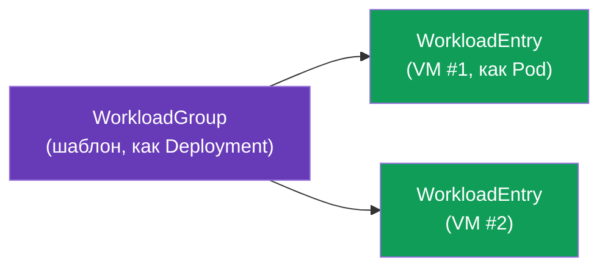
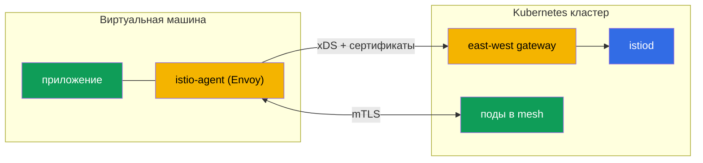

# Глава 29. Не-Kubernetes нагрузки: VM в mesh

> **Что дальше.** Istio - это не только про Kubernetes. В реальности часть нагрузок
> живёт вне кластера: legacy-приложения, базы данных, сервисы на виртуальных машинах.
> Istio умеет включать такие VM в mesh - с тем же mTLS, обнаружением сервисов и
> политиками, что и поды. В этой главе разберём, как это работает.

## 29.1. Зачем включать VM в mesh

Не всё удаётся (или нужно) переносить в Kubernetes. Причины завести VM в mesh:

- **Legacy-приложения**, которые пока живут на VM и не готовы к контейнеризации.
- **Постепенная миграция**: сервис уже частично в кластере, частично на VM, и они должны
  общаться безопасно.
- **Единая политика.** Хочется, чтобы mTLS, авторизация и наблюдаемость (главы 13, 14,
  17) распространялись и на VM, а не только на поды.

Цель: сделать так, чтобы VM выглядела для mesh как обычный workload - со своей identity,
mTLS и записью в реестре сервисов.

## 29.2. Как это устроено: WorkloadGroup и WorkloadEntry

В Kubernetes под описывается Deployment'ом, а конкретный экземпляр - это Pod. Для VM
Istio вводит два аналогичных понятия:

- **WorkloadGroup** - шаблон группы VM-нагрузок (аналог Deployment): общие метки,
  ServiceAccount, порты, проверки готовности. Описывает, «какими будут» VM этой группы.
- **WorkloadEntry** - представление **одного** экземпляра VM (аналог Pod): его IP, метки,
  identity. Может создаваться автоматически, когда VM регистрируется в WorkloadGroup, или
  вручную.

Благодаря WorkloadEntry поды кластера видят VM как обычные эндпоинты сервиса: можно
завести Kubernetes Service, который включает и поды, и VM, и балансировать между ними.

## 29.3. istio-agent на виртуальной машине

Чтобы VM стала частью mesh, на неё ставят **istio-agent** - пакет с Envoy и pilot-agent
(тот же data plane, что в sidecar, только на хосте, а не в поде). Агент:

- подключается к istiod, получает конфигурацию по xDS и сертификаты (как обычный sidecar,
  глава 4);
- перехватывает трафик приложения на VM и заворачивает его через Envoy;
- обеспечивает mTLS с сервисами в кластере.

## 29.4. Связь с кластером и DNS

Две технические задачи, которые надо решить.

- **Доступ VM к istiod.** VM обычно вне кластерной сети, поэтому до istiod она достукивается
  через **east-west gateway** (тот же, что для мультикластера, глава 28): он выставляет
  наружу порты xDS и выдачи сертификатов. VM при загрузке получает bootstrap-конфигурацию
  с адресом этого шлюза.
- **DNS.** VM не знает про kube-DNS и не может резолвить имена вроде
  `reviews.default.svc.cluster.local`. Поэтому istio-agent на VM поднимает **DNS proxy**:
  он перехватывает DNS-запросы и резолвит имена кластерных сервисов, чтобы приложение на
  VM могло обращаться к ним по обычным именам.

## 29.5. Identity и mTLS для VM

VM получает такую же криптографическую identity, как поды - на основе ServiceAccount и в
формате SPIFFE (глава 13). При настройке VM ей провижнят токен ServiceAccount, по
которому istio-agent запрашивает у istiod рабочий сертификат.

В результате mTLS и `AuthorizationPolicy` (глава 14) работают для VM ровно так же, как
для подов: правило `principals: [.../sa/<vm-sa>]` различает VM по её identity, трафик
между VM и подами шифруется. С точки зрения безопасности VM становится полноправным
участником mesh, а не «дыркой» в периметре.

## 29.6. Жизненный цикл: регистрация и удаление

- **Регистрация.** При старте istio-agent VM может **автоматически** зарегистрироваться в
  `WorkloadGroup`, создав свой `WorkloadEntry`. Так mesh узнаёт о новом экземпляре без
  ручных действий - удобно для автоскейлинга VM.
- **Удаление.** Когда VM выводится из эксплуатации, её `WorkloadEntry` нужно убрать из
  mesh, иначе останется «мёртвый» эндпоинт, на который будет литься трафик. При
  автоматической регистрации это отрабатывается по health-check; при ручной - удаляйте
  WorkloadEntry явно.

## 29.7. Best practices

- **Общий CA обязателен.** Как и в мультикластере (глава 28), mTLS между VM и подами
  требует общего корня доверия (глава 16).
- **east-west gateway для доступа к istiod** - стандартный способ; берегите его
  доступность, иначе VM не получат конфиг и сертификаты.
- **Автоматическая регистрация + корректное снятие.** Настройте авто-регистрацию и
  health-check, чтобы мёртвые VM не оставались в реестре.
- **Ротация сертификатов работает и на VM** - istio-agent обновляет их сам, но следите за
  доступностью istiod (иначе сертификаты протухнут).
- **VM это шаг, а не цель.** Включение VM в mesh обычно часть миграции в Kubernetes.
  Держите это как переходное состояние, а не постоянную сложную конструкцию, если можно
  контейнеризировать нагрузку.
- **Наблюдаемость и troubleshooting.** VM участвует в метриках и трейсах (главы 17-18);
  для диагностики у istio-agent на VM есть те же инструменты, что у sidecar.

## 29.8. Итоги главы

- Istio умеет включать в mesh нагрузки вне Kubernetes - виртуальные машины - с тем же
  mTLS, обнаружением и политиками, что у подов.
- **WorkloadGroup** это шаблон группы VM (аналог Deployment), **WorkloadEntry** -
  конкретный экземпляр VM (аналог Pod); поды видят VM как обычные эндпоинты.
- На VM ставится **istio-agent** (Envoy + pilot-agent): подключается к istiod, получает
  конфиг и сертификаты, обеспечивает mTLS.
- Доступ к istiod - через **east-west gateway**; кластерные имена резолвит **DNS proxy**
  агента.
- VM получает SPIFFE-identity по ServiceAccount, поэтому mTLS и AuthorizationPolicy
  работают как для подов.
- Жизненный цикл: авто-регистрация WorkloadEntry при старте, корректное снятие при выводе.
- Best practices: общий CA, доступность east-west gateway и istiod, авто-регистрация с
  health-check, отношение к VM как к переходному этапу миграции.

## 29.9. Вопросы для самопроверки

1. Зачем включать VM в mesh и какие задачи это решает?
2. Что такое WorkloadGroup и WorkloadEntry и на что они похожи в мире Kubernetes?
3. Что делает istio-agent на VM?
4. Как VM достукивается до istiod и как резолвит кластерные имена?
5. Как VM получает identity и работают ли для неё mTLS и AuthorizationPolicy?
6. Почему важно корректно снимать WorkloadEntry при выводе VM?

## Практика

Отдельная лаба **планируется**: развернуть VM, поставить istio-agent, подключить к mesh
через east-west gateway (WorkloadGroup/WorkloadEntry), проверить mTLS между VM и подами и
DNS-резолвинг кластерных сервисов.

🧪 Лаба: **TODO (EKS + VM)**.

---
[Оглавление](../README.md) · [Глава 28](../28/ru.md) · [Глава 30](../30/ru.md)
