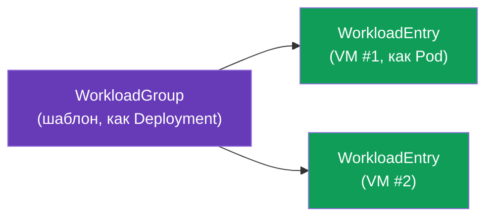
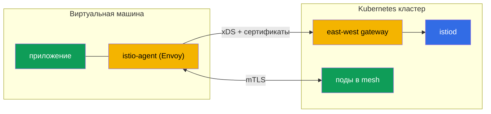

[Eng version](en.md) · [Versión en español](es.md)

# Глава 29. Не-Kubernetes нагрузки: VM в mesh

> **Что дальше.** Istio - это не только про Kubernetes. В реальности часть нагрузок
> живёт вне кластера: legacy-приложения, базы данных, сервисы на виртуальных машинах.
> Istio умеет включать такие VM в mesh - с тем же mTLS, обнаружением сервисов и
> политиками, что и поды. В этой главе разберём, как это работает.

## 29.1. Зачем включать VM в mesh

Не всё удаётся (или нужно) переносить в Kubernetes. Причины завести VM в mesh:

- **Legacy-приложения**, которые пока живут на VM и не готовы к контейнеризации.
- **Постепенная миграция**: сервис уже частично в кластере, частично на VM, и они должны
  общаться безопасно.
- **Единая политика.** Хочется, чтобы mTLS, авторизация и наблюдаемость (главы 13, 14,
  17) распространялись и на VM, а не только на поды.

Цель: сделать так, чтобы VM выглядела для mesh как обычный workload - со своей identity,
mTLS и записью в реестре сервисов.

## 29.2. Как это устроено: WorkloadGroup и WorkloadEntry

В Kubernetes под описывается Deployment'ом, а конкретный экземпляр - это Pod. Для VM
Istio вводит два аналогичных понятия:

- **WorkloadGroup** - шаблон группы VM-нагрузок (аналог Deployment): общие метки,
  ServiceAccount, порты, проверки готовности. Описывает, «какими будут» VM этой группы.
- **WorkloadEntry** - представление **одного** экземпляра VM (аналог Pod): его IP, метки,
  identity. Может создаваться автоматически, когда VM регистрируется в WorkloadGroup, или
  вручную.



Благодаря WorkloadEntry поды кластера видят VM как обычные эндпоинты сервиса: можно
завести Kubernetes Service, который включает и поды, и VM, и балансировать между ними.

`WorkloadGroup` описывает группу и, главное, identity (`serviceAccount`), метки и
health-проверку экземпляров:

```yaml
apiVersion: networking.istio.io/v1
kind: WorkloadGroup
metadata:
  name: legacy-app
  namespace: vm-apps
spec:
  metadata:
    labels:
      app: legacy-app            # по этой метке Service найдёт и поды, и VM
  template:
    serviceAccount: legacy-app   # SPIFFE-identity VM, как у подов
    ports:
      http: 8080
  probe:                         # health-check экземпляра VM
    httpGet:
      path: /healthz
      port: 8080
```

Обычный `Service` по той же метке объединяет поды и VM в один сервис - трафик
балансируется между ними прозрачно:

```yaml
apiVersion: v1
kind: Service
metadata:
  name: legacy-app
  namespace: vm-apps
spec:
  selector:
    app: legacy-app              # тот же label -> и поды, и WorkloadEntry (VM)
  ports:
  - {name: http, port: 8080}
```

Если регистрацию не автоматизируют, `WorkloadEntry` заводят вручную - с IP и identity
конкретной VM:

```yaml
apiVersion: networking.istio.io/v1
kind: WorkloadEntry
metadata:
  name: legacy-app-vm1
  namespace: vm-apps
spec:
  address: 10.0.12.34            # приватный IP виртуалки
  labels:
    app: legacy-app
  serviceAccount: legacy-app
  network: vm-network            # сеть VM (для multi-network, глава 28)
```

## 29.3. istio-agent на виртуальной машине

Чтобы VM стала частью mesh, на неё ставят **istio-agent** - пакет с Envoy и pilot-agent
(тот же data plane, что в sidecar, только на хосте, а не в поде). Агент:

- подключается к istiod, получает конфигурацию по xDS и сертификаты (как обычный sidecar,
  глава 4);
- перехватывает трафик приложения на VM и заворачивает его через Envoy;
- обеспечивает mTLS с сервисами в кластере.



Bootstrap-файлы для VM генерирует сам `istioctl` из `WorkloadGroup` - вручную их писать не
нужно:

```bash
# 1. создать WorkloadGroup (или применить манифест из 29.2)
istioctl x workload group create \
  --name legacy-app --namespace vm-apps \
  --serviceAccount legacy-app > workloadgroup.yaml
kubectl apply -f workloadgroup.yaml

# 2. сгенерировать набор файлов для конкретной VM
istioctl x workload entry configure \
  -f workloadgroup.yaml -o vm-files/ --clusterID cluster1
```

В каталоге `vm-files/` появятся:

- **`cluster.env`** - ID кластера, сеть, порты перехвата;
- **`mesh.yaml`** - конфиг mesh для агента;
- **`root-cert.pem`** - корень доверия (общий CA, глава 16);
- **`istio-token`** - токен ServiceAccount, по нему агент запросит рабочий сертификат;
- **`hosts`** - адрес istiod (через east-west gateway).

Эти файлы копируют на VM, ставят пакет `istio-sidecar` и запускают агент
(`systemctl start istio`). После этого VM подключается к mesh.

> **Ambient и VM.** Всё описанное - про sidecar-подход (istio-agent на VM). Включение VM в
> ambient-mesh (глава 22) поддерживается ограниченно и дозревает; на практике VM сейчас
> заводят именно через istio-agent.

## 29.4. Связь с кластером и DNS

Две технические задачи, которые надо решить.

- **Доступ VM к istiod.** VM обычно вне кластерной сети, поэтому до istiod она достукивается
  через **east-west gateway** (тот же, что для мультикластера, глава 28): он выставляет
  наружу порты xDS и выдачи сертификатов. VM при загрузке получает bootstrap-конфигурацию
  с адресом этого шлюза.
- **DNS.** VM не знает про kube-DNS и не может резолвить имена вроде
  `reviews.default.svc.cluster.local`. Поэтому istio-agent на VM поднимает **DNS proxy**:
  он перехватывает DNS-запросы и резолвит имена кластерных сервисов, чтобы приложение на
  VM могло обращаться к ним по обычным именам.

## 29.5. Identity и mTLS для VM

VM получает такую же криптографическую identity, как поды - на основе ServiceAccount и в
формате SPIFFE (глава 13). При настройке VM ей провижнят токен ServiceAccount, по
которому istio-agent запрашивает у istiod рабочий сертификат.

В результате mTLS и `AuthorizationPolicy` (глава 14) работают для VM ровно так же, как
для подов: правило `principals: [.../sa/<vm-sa>]` различает VM по её identity, трафик
между VM и подами шифруется. С точки зрения безопасности VM становится полноправным
участником mesh, а не «дыркой» в периметре.

## 29.6. Жизненный цикл: регистрация и удаление

- **Регистрация.** При старте istio-agent VM может **автоматически** зарегистрироваться в
  `WorkloadGroup`, создав свой `WorkloadEntry`. Так mesh узнаёт о новом экземпляре без
  ручных действий - удобно для автоскейлинга VM.
- **Удаление.** Когда VM выводится из эксплуатации, её `WorkloadEntry` нужно убрать из
  mesh, иначе останется «мёртвый» эндпоинт, на который будет литься трафик. При
  автоматической регистрации это отрабатывается по health-check; при ручной - удаляйте
  WorkloadEntry явно.

**Проверь свою работу.** Что VM реально вошла в mesh, видно так:

```bash
# WorkloadEntry для VM создан (авто-регистрация) и виден в реестре
kubectl get workloadentry -n vm-apps
# istiod видит VM как прокси в состоянии SYNCED
istioctl proxy-status | grep <vm-name>
# из пода запрос уходит и на VM-эндпоинт (отвечает и под, и VM)
kubectl exec <pod> -n app -- curl -s http://legacy-app.vm-apps:8080/
# на самой VM: приложение резолвит кластерные имена через DNS proxy агента
curl -s http://reviews.default.svc.cluster.local:9080/
```

Если VM не видна в `proxy-status` - смотрите доступность east-west gateway и валидность
`istio-token`; если не резолвятся кластерные имена - DNS proxy агента.

## 29.7. VM на AWS/EC2

На AWS «виртуальная машина» - это EC2-инстанс, и абстрактные требования главы превращаются
в конкретную сеть и автоматизацию.

- **Связность EC2 ↔ EKS - это VPC.** EC2 должен иметь сетевой путь до east-west gateway
  кластера: либо в том же VPC, либо через **VPC peering / Transit Gateway** (как в главе
  28). Обычно east-west публикуют через **internal NLB**, а EC2 ходит к нему по приватной
  сети - без выхода в интернет.
- **Security groups.** Разрешите с EC2 доступ к портам, которые выставляет east-west
  gateway для VM: xDS и выдача сертификатов istiod (порт `15012`) и мультиплексируемый
  порт шлюза `15443`. Без этого агент не получит конфиг и сертификаты.
- **Автоматизация bootstrap.** Файлы из `istioctl x workload entry configure` доставляют
  на инстанс не руками, а через **user-data** при старте или через **SSM** (Parameter
  Store / RunCommand). Токен ServiceAccount ограничен по времени - генерируйте его близко
  к моменту загрузки инстанса.
- **Auto Scaling Group.** При авто-регистрации новый EC2 сам создаёт `WorkloadEntry` на
  старте. Но при scale-in инстанс исчезает - повесьте **lifecycle hook** ASG (или
  полагайтесь на health-check WorkloadGroup), чтобы «мёртвый» WorkloadEntry убирался и
  трафик на него не лился (см. 29.6).
- **Общий CA.** Как и в мультикластере, корень доверия для VM и подов должен быть общим -
  на AWS это ACM PCA или offline-корень (глава 16).

## 29.8. Best practices

- **Общий CA обязателен.** Как и в мультикластере (глава 28), mTLS между VM и подами
  требует общего корня доверия (глава 16).
- **east-west gateway для доступа к istiod** - стандартный способ; берегите его
  доступность, иначе VM не получат конфиг и сертификаты.
- **Автоматическая регистрация + корректное снятие.** Настройте авто-регистрацию и
  health-check, чтобы мёртвые VM не оставались в реестре.
- **Ротация сертификатов работает и на VM** - istio-agent обновляет их сам, но следите за
  доступностью istiod (иначе сертификаты протухнут).
- **VM это шаг, а не цель.** Включение VM в mesh обычно часть миграции в Kubernetes.
  Держите это как переходное состояние, а не постоянную сложную конструкцию, если можно
  контейнеризировать нагрузку.
- **Наблюдаемость и troubleshooting.** VM участвует в метриках и трейсах (главы 17-18);
  для диагностики у istio-agent на VM есть те же инструменты, что у sidecar.

## 29.9. Итоги главы

- Istio умеет включать в mesh нагрузки вне Kubernetes - виртуальные машины - с тем же
  mTLS, обнаружением и политиками, что у подов.
- **WorkloadGroup** это шаблон группы VM (аналог Deployment), **WorkloadEntry** -
  конкретный экземпляр VM (аналог Pod); поды видят VM как обычные эндпоинты.
- На VM ставится **istio-agent** (Envoy + pilot-agent): подключается к istiod, получает
  конфиг и сертификаты, обеспечивает mTLS. Bootstrap-файлы (`cluster.env`, `mesh.yaml`,
  `root-cert.pem`, `istio-token`, `hosts`) генерирует `istioctl x workload entry configure`.
- Доступ к istiod - через **east-west gateway**; кластерные имена резолвит **DNS proxy**
  агента.
- VM получает SPIFFE-identity по ServiceAccount, поэтому mTLS и AuthorizationPolicy
  работают как для подов.
- Жизненный цикл: авто-регистрация WorkloadEntry при старте, корректное снятие при выводе.
- На AWS VM - это EC2: связность до east-west через VPC/peering/TGW и internal NLB,
  доступ по security groups (15012/15443), bootstrap через user-data/SSM, снятие
  WorkloadEntry по lifecycle hook ASG.
- Проверка: `kubectl get workloadentry`, `istioctl proxy-status`, cross-`curl` под↔VM и
  DNS-резолвинг кластерных имён на VM.
- Best practices: общий CA, доступность east-west gateway и istiod, авто-регистрация с
  health-check, отношение к VM как к переходному этапу миграции.

## 29.10. Вопросы для самопроверки

1. Зачем включать VM в mesh и какие задачи это решает?
2. Что такое WorkloadGroup и WorkloadEntry и на что они похожи в мире Kubernetes?
3. Что делает istio-agent на VM?
4. Как VM достукивается до istiod и как резолвит кластерные имена?
5. Как VM получает identity и работают ли для неё mTLS и AuthorizationPolicy?
6. Какие bootstrap-файлы нужны агенту на VM и чем их генерируют?
7. Как на AWS обеспечить связность EC2 с mesh (сеть, security groups) и автоматизировать
   bootstrap?
8. Почему важно корректно снимать WorkloadEntry при выводе VM и как это делают в ASG?
9. Как проверить, что VM действительно вошла в mesh?

## Практика

Отдельная лаба **планируется**: развернуть VM, поставить istio-agent, подключить к mesh
через east-west gateway (WorkloadGroup/WorkloadEntry), проверить mTLS между VM и подами и
DNS-резолвинг кластерных сервисов.

🧪 Лаба: **TODO (EKS + VM)**.

---
[Оглавление](../README.md) · [Глава 28](../28/ru.md) · [Глава 30](../30/ru.md)
