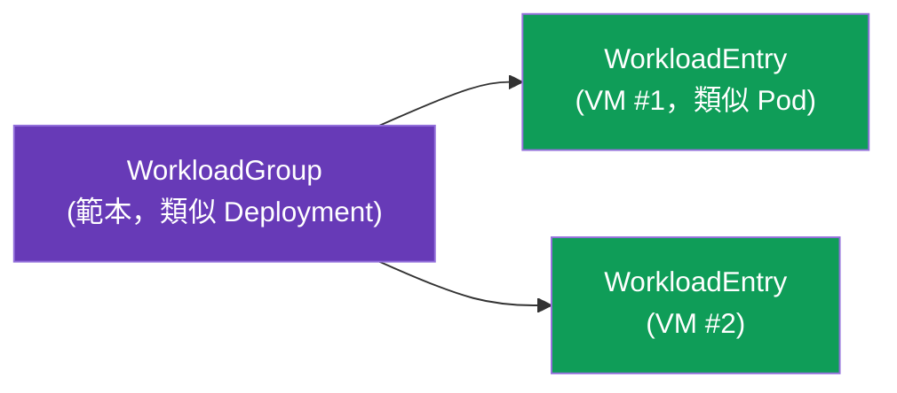
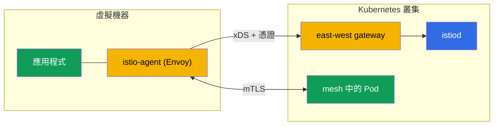

[Русская версия](ru.md) · [Eng version](en.md) · [Versión en español](es.md) · [Version française](fr.md) · [Deutsche Version](de.md) · [ქართული ვერსია](ge.md) · [日本語版](jp.md)

# 第 29 章。非 Kubernetes 工作負載：mesh 中的 VM

> **接下來。** Istio 不僅適用於 Kubernetes。實際上，部分工作負載位於叢集外：legacy 應用程式、資料庫、虛擬機器上的服務。Istio 可將此類 VM 納入 mesh，並提供與 Pod 相同的 mTLS、服務發現與策略。本章將說明其運作方式。

## 29.1. 為何要將 VM 納入 mesh

並非所有工作負載都可以（或需要）遷移至 Kubernetes。將 VM 納入 mesh 的原因如下：

- **Legacy 應用程式**，目前仍運行於 VM，尚未準備好容器化。
- **漸進式遷移**：服務已有一部分在叢集中、一部分在 VM 上，且兩者必須安全通訊。
- **統一策略。** 希望 mTLS、授權與可觀測性（第 13、14、17 章）不僅套用到 Pod，也涵蓋 VM。

目標是讓 VM 對 mesh 而言如同一般的 workload，擁有自己的 identity、mTLS 與服務登錄檔中的記錄。

## 29.2. 運作原理：WorkloadGroup 與 WorkloadEntry

在 Kubernetes 中，Pod 由 Deployment 描述，而具體執行個體則是 Pod。Istio 為 VM 引入兩個對應概念：

- **WorkloadGroup** 是一組 VM 工作負載的範本（類似 Deployment）：共用標籤、ServiceAccount、連接埠、就緒檢查。它描述這一組 VM「將會是什麼樣子」。
- **WorkloadEntry** 是**單一** VM 執行個體的表示（類似 Pod）：其 IP、標籤、identity。可在 VM 註冊至 WorkloadGroup 時自動建立，或手動建立。



透過 WorkloadEntry，叢集中的 Pod 會將 VM 視為一般服務端點：可以建立同時包含 Pod 與 VM 的 Kubernetes Service，並在兩者之間進行負載平衡。

`WorkloadGroup` 描述該群組，尤其是 identity（`serviceAccount`）、標籤與執行個體的 health 檢查：

```yaml
apiVersion: networking.istio.io/v1
kind: WorkloadGroup
metadata:
  name: legacy-app
  namespace: vm-apps
spec:
  metadata:
    labels:
      app: legacy-app            # Service 依此 label 找到 pod 與 VM
  template:
    serviceAccount: legacy-app   # VM 的 SPIFFE identity，與 pod 相同
    ports:
      http: 8080
  probe:                         # VM 執行個體的 health check
    httpGet:
      path: /healthz
      port: 8080
```

使用相同標籤的一般 `Service` 會將 Pod 與 VM 合併為單一服務，流量會在兩者間透明地平衡：

```yaml
apiVersion: v1
kind: Service
metadata:
  name: legacy-app
  namespace: vm-apps
spec:
  selector:
    app: legacy-app              # 相同 label -> pod 與 WorkloadEntry（VM）
  ports:
  - {name: http, port: 8080}
```

若未自動化註冊，便手動建立 `WorkloadEntry`，指定特定 VM 的 IP 與 identity：

```yaml
apiVersion: networking.istio.io/v1
kind: WorkloadEntry
metadata:
  name: legacy-app-vm1
  namespace: vm-apps
spec:
  address: 10.0.12.34            # 虛擬機的私有 IP
  labels:
    app: legacy-app
  serviceAccount: legacy-app
  network: vm-network            # VM 的網路（用於 multi-network，第 28 章）
```

## 29.3. 虛擬機器上的 istio-agent

若要讓 VM 成為 mesh 的一部分，需在其中安裝 **istio-agent**，這是包含 Envoy 與 pilot-agent 的套件（與 sidecar 相同的 data plane，只是運行於主機而非 Pod）。此代理程式：

- 連線至 istiod，透過 xDS 取得設定與憑證（如同一般 sidecar，見第 4 章）；
- 攔截 VM 上應用程式的流量，並將其導向 Envoy；
- 確保與叢集服務間使用 mTLS。



VM 的 bootstrap 檔案由 `istioctl` 根據 `WorkloadGroup` 自動產生，無須手動撰寫：

```bash
# 1. 建立 WorkloadGroup（或套用 29.2 的 manifest）
istioctl x workload group create \
  --name legacy-app --namespace vm-apps \
  --serviceAccount legacy-app > workloadgroup.yaml
kubectl apply -f workloadgroup.yaml

# 2. 為特定 VM 產生一組檔案
istioctl x workload entry configure \
  -f workloadgroup.yaml -o vm-files/ --clusterID cluster1
```

目錄 `vm-files/` 將包含：

- **`cluster.env`**：叢集 ID、網路與流量攔截連接埠；
- **`mesh.yaml`**：代理程式使用的 mesh 設定；
- **`root-cert.pem`**：信任根（共用 CA，見第 16 章）；
- **`istio-token`**：ServiceAccount token，代理程式將據此請求工作憑證；
- **`hosts`**：istiod 位址（經由 east-west gateway）。

將這些檔案複製至 VM、安裝 `istio-sidecar` 套件並啟動代理程式（`systemctl start istio`）。完成後，VM 便會連接至 mesh。

> **Ambient 與 VM。** 上述內容皆適用於 sidecar 方法（VM 上的 istio-agent）。VM 納入 ambient-mesh（第 22 章）的支援仍有限且正在成熟；實務上，目前 VM 是透過 istio-agent 納入。

## 29.4. 與叢集的連線及 DNS

有兩項必須解決的技術問題。

- **VM 對 istiod 的存取。** VM 通常位於叢集網路外，因此會經由 **east-west gateway** 連線至 istiod（與多叢集使用的相同，見第 28 章）：它會對外暴露 xDS 與憑證簽發連接埠。VM 在啟動時取得的 bootstrap 設定中會包含此閘道的位址。
- **DNS。** VM 不知道 kube-DNS，因此無法解析如 `reviews.default.svc.cluster.local` 的名稱。因此 VM 上的 istio-agent 會啟動 **DNS proxy**：它攔截 DNS 查詢並解析叢集服務名稱，讓 VM 上的應用程式可透過一般名稱連線。

## 29.5. VM 的 Identity 與 mTLS

VM 會取得與 Pod 相同、基於 ServiceAccount 的加密 identity，格式為 SPIFFE（第 13 章）。設定 VM 時，會為其佈建 ServiceAccount token，istio-agent 會據此向 istiod 請求工作憑證。

因此，mTLS 與 `AuthorizationPolicy`（第 14 章）在 VM 上的運作方式與 Pod 完全相同：規則 `principals: [.../sa/<vm-sa>]` 可依其 identity 區分 VM，VM 與 Pod 之間的流量會加密。從安全角度來看，VM 成為 mesh 的完整成員，而不是邊界上的「破口」。

## 29.6. 生命週期：註冊與移除

- **註冊。** istio-agent 啟動時，VM 可**自動**註冊至 `WorkloadGroup`，建立自己的 `WorkloadEntry`。如此 mesh 無須手動操作便可得知新執行個體，適合 VM 自動擴展。
- **移除。** 當 VM 停止使用時，必須將其 `WorkloadEntry` 從 mesh 移除，否則會留下仍有流量導入的「死亡」端點。自動註冊時由 health-check 處理；手動註冊時，請明確刪除 WorkloadEntry。

**檢查你的工作。** 可透過以下方式確認 VM 確實已納入 mesh：

```bash
# VM 的 WorkloadEntry 已建立（自動註冊）並可見於登錄表
kubectl get workloadentry -n vm-apps
# istiod 將 VM 視為狀態為 SYNCED 的 proxy
istioctl proxy-status | grep <vm-name>
# 來自 pod 的請求也會前往 VM endpoint（pod 與 VM 都會回應）
kubectl exec <pod> -n app -- curl -s http://legacy-app.vm-apps:8080/
# 在 VM 本身：應用程式透過 agent 的 DNS proxy 解析 cluster 名稱
curl -s http://reviews.default.svc.cluster.local:9080/
```

若在 `proxy-status` 中看不到 VM，請檢查 east-west gateway 的可用性與 `istio-token` 的有效性；若叢集名稱無法解析，請檢查代理程式的 DNS proxy。

## 29.7. AWS/EC2 上的 VM

在 AWS 上，「虛擬機器」即 EC2 執行個體，而本章的抽象需求會轉換為具體的網路與自動化需求。

- **EC2 ↔ EKS 的連通性是 VPC。** EC2 必須具備通往叢集 east-west gateway 的網路路徑：可在同一 VPC 中，或透過 **VPC peering / Transit Gateway**（如第 28 章）。通常 east-west 會透過 **internal NLB** 發佈，EC2 則經由私有網路連線，不須存取網際網路。
- **Security groups。** 允許 EC2 存取 east-west gateway 為 VM 暴露的連接埠：istiod 的 xDS 與憑證簽發（連接埠 `15012`），以及閘道的多工連接埠 `15443`。否則代理程式將無法取得設定與憑證。
- **Bootstrap 自動化。** `istioctl x workload entry configure` 所產生的檔案不應手動傳遞至執行個體，而應於啟動時透過 **user-data** 或 **SSM**（Parameter Store / RunCommand）傳遞。ServiceAccount token 的有效期有限，請在接近執行個體啟動的時間產生。
- **Auto Scaling Group。** 啟用自動註冊後，新的 EC2 會在啟動時自行建立 `WorkloadEntry`。但在 scale-in 時執行個體會消失，請設定 ASG 的 **lifecycle hook**（或仰賴 WorkloadGroup health-check），以移除「死亡」的 WorkloadEntry，避免流量繼續導向它（見 29.6）。
- **共用 CA。** 與多叢集相同，VM 與 Pod 的信任根必須共用；在 AWS 上可使用 ACM PCA 或 offline 根（第 16 章）。

## 29.8. 最佳實務

- **必須使用共用 CA。** 與多叢集（第 28 章）相同，VM 與 Pod 之間的 mTLS 需要共用信任根（第 16 章）。
- **使用 east-west gateway 存取 istiod** 是標準方式；請維持其可用性，否則 VM 將無法取得設定與憑證。
- **自動註冊加上正確移除。** 設定自動註冊與 health-check，避免死亡 VM 留在登錄檔中。
- **憑證輪替也適用於 VM**：istio-agent 會自行更新，但須監控 istiod 的可用性（否則憑證將過期）。
- **VM 是一個步驟，而非目標。** 將 VM 納入 mesh 通常是遷移至 Kubernetes 的一部分。若可將工作負載容器化，應將其視為過渡狀態，而非永久的複雜架構。
- **可觀測性與 troubleshooting。** VM 會參與指標與追蹤（第 17–18 章）；VM 上的 istio-agent 具有與 sidecar 相同的診斷工具。

## 29.9. 本章總結

- Istio 可將 Kubernetes 以外的工作負載，也就是虛擬機器，納入 mesh，並提供與 Pod 相同的 mTLS、服務發現及策略。
- **WorkloadGroup** 是 VM 群組的範本（類似 Deployment），**WorkloadEntry** 是具體 VM 執行個體（類似 Pod）；Pod 會將 VM 視為一般端點。
- VM 上安裝 **istio-agent**（Envoy + pilot-agent）：它連線至 istiod、取得設定與憑證、提供 mTLS。Bootstrap 檔案（`cluster.env`、`mesh.yaml`、`root-cert.pem`、`istio-token`、`hosts`）由 `istioctl x workload entry configure` 產生。
- 對 istiod 的存取經由 **east-west gateway**；叢集名稱由代理程式的 **DNS proxy** 解析。
- VM 根據 ServiceAccount 取得 SPIFFE-identity，因此 mTLS 與 AuthorizationPolicy 的運作方式與 Pod 相同。
- 生命週期：啟動時自動註冊 WorkloadEntry，停止使用時正確移除。
- 在 AWS 上，VM 即 EC2：透過 VPC/peering/TGW 與 internal NLB 連線至 east-west，透過 security groups 開放存取（15012/15443），以 user-data/SSM bootstrap，並以 ASG lifecycle hook 移除 WorkloadEntry。
- 驗證：使用 `kubectl get workloadentry`、`istioctl proxy-status`、Pod↔VM cross-`curl`，以及在 VM 上解析叢集名稱的 DNS。
- 最佳實務：共用 CA、east-west gateway 與 istiod 的可用性、具有 health-check 的自動註冊，以及將 VM 視為遷移的過渡階段。

## 29.10. 自我檢查問題

1. 為何要將 VM 納入 mesh？這解決哪些問題？
2. WorkloadGroup 與 WorkloadEntry 是什麼？它們在 Kubernetes 世界中類似什麼？
3. istio-agent 在 VM 上的作用是什麼？
4. VM 如何連線至 istiod，又如何解析叢集名稱？
5. VM 如何取得 identity？mTLS 與 AuthorizationPolicy 是否適用於它？
6. VM 上的代理程式需要哪些 bootstrap 檔案？如何產生？
7. 在 AWS 上，如何確保 EC2 與 mesh 的連通性（網路、security groups）並自動化 bootstrap？
8. 為何在停用 VM 時正確移除 WorkloadEntry 很重要？ASG 如何處理？
9. 如何確認 VM 確實已納入 mesh？

## 實作

規劃中的獨立實驗：部署 VM、安裝 istio-agent，透過 east-west gateway（WorkloadGroup/WorkloadEntry）連線至 mesh，驗證 VM 與 Pod 之間的 mTLS，以及叢集服務的 DNS 解析。

🧪 實驗：**TODO（EKS + VM）**。

---
[目錄](../README_TW.md) · [第 28 章](../28/tw.md) · [第 30 章](../30/tw.md)
