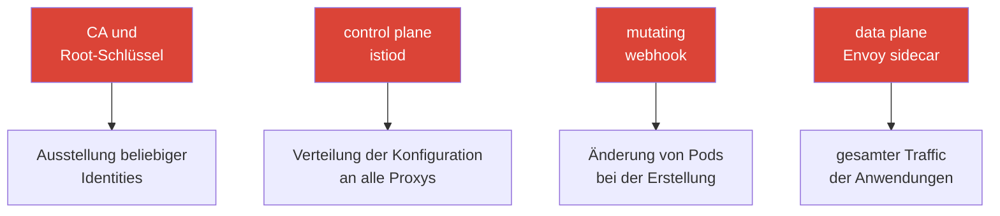

[RU version](ru.md) · [Eng version](en.md) · [Versión en español](es.md) · [Version française](fr.md)

# Kapitel 31. Härtung und Bedrohungsmodell des Mesh

> **Was kommt als Nächstes.** Wir haben die Sicherheit in Teilen behandelt: mTLS
> (Kapitel 13), Autorisierung (14), Zertifikate (16), Egress-Kontrolle (12). Dieses
> abschließende Kapitel fügt alles zu einem Gesamtbild zusammen: wie die Angriffsfläche
> eines Service Mesh aussieht, welche Angriffsvektoren es auf control und data plane gibt und
> wie man sie systematisch schließt - die Härtung von Istio in Produktion.

## 31.1. Angriffsfläche des Mesh

Wichtig zu verstehen: das Mesh fügt nicht nur Schutz hinzu (mTLS, authz), sondern **wird
selbst Teil der Angriffsfläche**. Es kommen neue Komponenten hinzu, deren Kompromittierung
gefährlich ist.



Zentrale Assets, die geschützt werden müssen:

- **CA und Root-Schlüssel** - Kompromittierung = die Möglichkeit, ein Zertifikat mit
  beliebiger Identity auszustellen und sich als beliebiger Dienst auszugeben. Das wertvollste
  Asset.
- **Control plane (istiod)** - steuert die Konfiguration aller Proxys; Kompromittierung = die
  Möglichkeit, den Traffic des gesamten Mesh umzuleiten oder abzufangen.
- **Data plane (Envoy)** - trägt den gesamten Traffic; Kompromittierung eines Pods oder das
  Umgehen des sidecar gibt Zugriff auf die Daten.
- **Admission-Webhook** - verändert Pods bei der Erstellung; ein mächtiger Einflusspunkt.

## 31.2. Angriffsvektoren auf die control plane

- **Kompromittierung des CA-Schlüssels.** Wer den Root-Schlüssel besitzt, besitzt alle
  Identities. Schutz: eine eigene CA mit Offline-/HSM-Root, Intermediates für die Ausstellung,
  Rotation (Kapitel 16).
- **Übermäßige Rechte auf Istio-Ressourcen.** Wer `VirtualService`, `EnvoyFilter` oder
  `AuthorizationPolicy` erstellen kann, kann Traffic umleiten oder beliebige Logik in die data
  plane einschleusen. `EnvoyFilter` ist besonders gefährlich - es ist ein „Schraubenzieher ins
  Innere“ von Envoy (Kapitel 21). Schutz: strenges Kubernetes RBAC auf diese CRDs, Reviews,
  Einschränkung über OPA Gatekeeper (Kapitel 30).
- **Zugriff auf istiod / xDS.** Die xDS-Kanäle sind durch mTLS geschützt, aber der Zugriff auf
  istiod selbst (Pod, Ports, Kubernetes API) muss eingeschränkt sein - sonst lässt sich die
  Verteilung der Konfiguration beeinflussen.
- **Zugriff auf die Kubernetes API = Zugriff auf das Mesh.** Wer Istio-CRDs über die API
  ändern kann, steuert das Mesh. Schutz: das ist übliche Kubernetes-RBAC-Hygiene (die kennst
  du aus CKA).

In der Praxis bedeutet „strenges RBAC auf Istio-CRDs“, den Anwendungsteams eine Rolle **nur
auf sichere** Routing-Ressourcen zu geben und die mächtigen
`EnvoyFilter`/`Sidecar`/`WorkloadEntry` dem Platform-Team zu überlassen:

```yaml
apiVersion: rbac.authorization.k8s.io/v1
kind: Role
metadata:
  name: istio-app-config
  namespace: team-a
rules:
# Anwendungsteams - nur Routing und Policies ihres Namespace
- apiGroups: ["networking.istio.io"]
  resources: ["virtualservices", "destinationrules", "gateways"]
  verbs: ["get", "list", "watch", "create", "update", "patch", "delete"]
- apiGroups: ["security.istio.io"]
  resources: ["authorizationpolicies", "requestauthentications"]
  verbs: ["get", "list", "watch", "create", "update", "patch", "delete"]
# EnvoyFilter, Sidecar, WorkloadEntry sind hier NICHT enthalten -
# sie verwaltet eine separate Rolle des Platform-Teams (über Review/GitOps)
```

RBAC kann nicht „verbieten“ — es arbeitet nach dem Prinzip „erlaubt ist nur das
Aufgeführte“. Deshalb taucht `EnvoyFilter` einfach nicht in der Rolle der Anwendungen auf: da
es nicht in der Liste steht, kann das Team es in seinem Namespace nicht erstellen.

## 31.3. Angriffsvektoren auf die data plane

- **Umgehen des sidecar.** Wenn Traffic Envoy umgeht (Anwendung mit `NET_ADMIN`, direkter
  Zugriff über die Pod-IP, privilegierter Container), werden die Istio-Policies nicht
  angewendet. Schutz: **NetworkPolicy als unabhängige Verteidigungslinie** (Kapitel 14) - sie
  sitzt im Kernel und lässt sich aus dem Pod nicht umgehen; `istio-cni` statt privilegierter
  Init-Container (Kapitel 27); ambient entfernt den sidecar ganz aus dem Pod (Kapitel 22).
- **Ein kompromittierter Workload nutzt seine eigene Identity.** Ein gehackter Dienst agiert
  mit seinem gültigen mTLS-Zertifikat. Schutz: **least privilege in der
  AuthorizationPolicy** (Kapitel 14) - jedem nur das, was er braucht, um den Wirkradius zu
  begrenzen.
- **Datenexfiltration nach außen.** Ein kompromittierter Pod versucht, Daten an eine externe
  Adresse abzuführen. Schutz: Egress-Kontrolle - `REGISTRY_ONLY` und egress gateway
  (Kapitel 12).
- **Offene Admin-Schnittstelle von Envoy.** Der Admin-Port von Envoy (15000) darf von außerhalb
  des Pods nicht erreichbar sein. Schutz: ihn nicht nach außen exponieren.

> **Ambient verändert das Bedrohungsmodell, es „entfernt“ nicht einfach den sidecar.** Ambient
> (Kapitel 22) nimmt Envoy tatsächlich aus dem Anwendungs-Pod (plus zur Isolation), aber der
> L4-Traffic und die Schlüssel werden nun von **ztunnel - einer pro Node** bedient. Er hält
> die mTLS-Schlüssel **aller Pods seiner Node**, daher ist die Kompromittierung von
> Node/ztunnel gefährlicher als die Kompromittierung eines einzelnen sidecar im
> sidecar-Modus (siehe §13.11 und Kapitel 22). Fazit: ambient ist nicht „gratis sicherer“,
> sondern ein anderer Trade-off; schütze Nodes und ztunnel entsprechend.

## 31.4. Härtungs-Checkliste

Fassen wir die Schutzmaßnahmen in einer Liste zusammen - im Grunde eine Zusammenfassung der
Security-Praktiken des gesamten Kurses, aufgebaut als Verteidigung in der Tiefe.

**Identität und Verschlüsselung:**
- [ ] STRICT mTLS für das gesamte Mesh (nach der Migration über PERMISSIVE) - Kapitel 13.
- [ ] Eigene CA, Offline-/HSM-Root, Intermediates für die Ausstellung, Rotation - Kapitel 16.

**Autorisierung (least privilege):**
- [ ] Default-deny `AuthorizationPolicy`, gezielte Freigaben nach Identity/Methode/Pfad -
  Kapitel 14.
- [ ] End-User-Auth (JWT) am Eingang, wo nötig - Kapitel 15.

**Netz (defense in depth):**
- [ ] NetworkPolicy als unabhängige Verteidigungslinie (Umgehen des sidecar) - Kapitel 14.
- [ ] Egress-Kontrolle: `REGISTRY_ONLY` + egress gateway - Kapitel 12.

**Control plane und Rechte:**
- [ ] Strenges RBAC auf Istio-CRDs, besonders `EnvoyFilter`; Review der Änderungen.
- [ ] OPA Gatekeeper: Verbot gefährlicher Konfigurationen (DISABLE mTLS, weit gefasste
  Policies) - Kapitel 30.
- [ ] Zugriff auf istiod und Kubernetes API eingeschränkt.

**Data plane und Nodes:**
- [ ] `istio-cni` statt privilegierter Init-Container - Kapitel 27.
- [ ] Admin-Port von Envoy (15000) nicht nach außen exponiert.
- [ ] ambient in Betracht ziehen, um den sidecar aus den Anwendungs-Pods zu entfernen -
  Kapitel 22.

**Updates und Supply Chain:**
- [ ] Istio wird rechtzeitig aktualisiert (CVE), über Canary/Revisionen - Kapitel 3.
- [ ] Wasm-Module nur aus einer vertrauenswürdigen Registry, mit Versions-Pinning und
  Prüfung - Kapitel 21.

## 31.5. Prüfwerkzeuge: wie man eine Liste der Probleme erhält

In der CKS-Prüfung hast du dich daran gewöhnt, den Cluster mit Scannern (kube-bench, kubesec,
trivy, kube-hunter) durchzugehen und eine fertige Problemliste zu bekommen. Für Istio gibt es
einen ähnlichen Satz an Werkzeugen, die Konfigurationsfehler und Schwachstellen finden.

Ehrliche Einschränkung: ein einheitliches „istio-bench“ auf dem Niveau von kube-bench, das
einen CIS-Bericht über das Mesh liefert, gibt es nicht. In der Praxis nutzt man eine
Kombination:

- **`istioctl analyze`** - der wichtigste statische Analyzer (Kapitel 24). Findet
  Konfigurationsfehler und -warnungen, auch security-relevante: fehlende Injection, kaputte
  Verweise, konfliktierende Policies. Damit fängt man an.

  ```bash
  istioctl analyze -A          # der gesamte Cluster
  ```

- **`istioctl experimental precheck`** - Prüfung des Clusters vor Installation/Upgrade
  (Kompatibilität, potenzielle Probleme).
- **`istioctl proxy-status` / `proxy-config`** - Runtime-Zustand: ist die Konfiguration
  angekommen, was ist wirklich in Envoy (für die Untersuchung, Kapitel 24).
- **Kiali (Tab Validations)** - hebt Konfigurationsprobleme, mTLS-Brüche, zu weit gefasste
  oder nutzlose Policies hervor - eine visuelle „Problemliste“ über das Mesh.
- **OPA Gatekeeper im audit-Modus** - hat man Policies angelegt (Kapitel 30), geht der
  audit-Modus die **bereits existierenden** Ressourcen durch und gibt eine Liste der
  Verstöße aus - genau das ist ein Scan auf Konformität mit deinen Regeln.
- **Universelle k8s-Scanner** (kubescape, trivy misconfig, Checkov) - prüfen die allgemeine
  Härtung des Clusters und berühren teilweise Istio-Ressourcen. Eine vollwertige tiefe
  Istio-Prüfung liefern sie nicht, sind aber als Teil der allgemeinen Hygiene nützlich (und
  es sind dieselben Werkzeuge wie bei CKS).

Praktischer Ansatz: `istioctl analyze` für die Konfiguration, Kiali für das anschauliche
Bild, Gatekeeper audit für die Konformität mit Policies, plus ein allgemeiner k8s-Scanner für
die Härtung von Nodes und Cluster. Zusammen ergeben sie genau jene „Problemliste“, entlang
derer die Behebung läuft.

## 31.6. Automatisierung: Härtung verpflichtend machen

Absprachen genügen nicht - in einem großen Cluster deployt trotzdem irgendwer etwas
Unsicheres. Deshalb werden die zentralen Regeln **automatisiert**:

- **OPA Gatekeeper** (Kapitel 30) als admission-Kontrolle: lässt keine Ressource zu, die die
  Regeln verletzt (keine Injection, `PeerAuthentication: DISABLE`, zu weit gefasste
  `AuthorizationPolicy`, `EnvoyFilter` ohne Freigabe).
- **GitOps und Review** für die gesamte Istio-Konfiguration - Änderungen durchlaufen eine
  Prüfung, statt von Hand angewendet zu werden.
- **Monitoring und Alerts** auf Verdächtiges: Anstiege abgelehnter Autorisierungen (403),
  unerwarteter Egress, Änderungen an kritischen Policies.

Der Sinn: die Security-Best-Practices aus diesem Kurs in **prüfbare und verpflichtende**
Regeln zu überführen, nicht in Wünsche.

## 31.7. Härtung auf EKS/AWS

Auf EKS wird das Bedrohungsmodell des Mesh um cloud-spezifische Verteidigungslinien ergänzt -
sie werden außerhalb von Istio selbst geschlossen.

- **IMDSv2 ist Pflicht.** Ein kompromittierter Pod greift über SSRF oder unkontrollierten
  Egress nach dem Metadaten-Endpunkt `169.254.169.254`, um die Credentials der Node/Rolle zu
  stehlen. Verlange **IMDSv2** (Token + hop limit = 1), damit der Pod die Metadaten der
  Instanz nicht abrufen kann. Das ergänzt die Egress-Kontrolle aus Kapitel 12 und das
  Abfangen der Metadaten aus Kapitel 27.
- **Least privilege in IRSA / Pod Identity.** Enge IAM-Policies für die Controller (LB
  Controller, external-dns, cert-manager) - damit der Hack eines solchen Pods keine weiten
  Rechte in AWS gibt. Hänge den Nodes keine fetten Instance-Rollen an, die alle Pods nutzen.
- **Runtime-Erkennung auf den Nodes.** Amazon **GuardDuty EKS Runtime Monitoring** (und/oder
  ein eigener Runtime-Agent) fängt verdächtige Aktivität auf den Nodes ab - eine unabhängige
  Verteidigungslinie zu den Mesh-Policies: wurde der sidecar umgangen, wird die Anomalie auf
  OS-Ebene bemerkt.
- **Schutz des Vertrauensankers.** Der CA-Schlüssel liegt in **ACM PCA** oder in **KMS/HSM**
  (Kapitel 16), nicht in einem Cluster-Secret; der Zugriff darauf erfolgt über eine enge
  IAM-Policy.
- **Perimeter und Netz.** **AWS WAF** am ALB für L7-Filterung am Eingang (Kapitel 20); die
  security groups von istiod (Ports `15012`/`15017`/`15000`) sind vor Überflüssigem
  verschlossen; Verschlüsselung der Cluster-Secrets über **KMS** (envelope encryption).

## 31.8. Zusammenfassung des Kapitels

- Das Mesh schützt nicht nur, sondern fügt auch eine **Angriffsfläche** hinzu: CA, control
  plane, data plane, admission-Webhook.
- **Control plane**: die Hauptrisiken sind die Kompromittierung des CA-Schlüssels und
  übermäßige Rechte auf Istio-CRDs (besonders `EnvoyFilter`); Schutz - Offline-Root, RBAC,
  OPA Gatekeeper.
- **Data plane**: Risiken sind das Umgehen des sidecar, der Missbrauch der Identity eines
  kompromittierten Pods, Exfiltration; Schutz - NetworkPolicy, least-privilege authz,
  Egress-Kontrolle, istio-cni, ambient. Strenges RBAC auf Istio-CRDs:
  `EnvoyFilter`/`Sidecar` - nur für das Platform-Team (RBAC erlaubt nur das Aufgeführte).
- **Ambient** ist nicht „gratis sicherer“: ztunnel auf der Node hält die Schlüssel aller
  ihrer Pods, daher ändert sich das Bedrohungsmodell (Kompromittierung der Node ist
  gefährlicher).
- Härtung ist **Verteidigung in der Tiefe**: mTLS + Autorisierung + Netz + Egress-Kontrolle +
  Rechteeinschränkung + Updates + Supply Chain.
- Die zentralen Regeln müssen **automatisiert** werden (OPA Gatekeeper, GitOps, Alerts),
  nicht als Absprachen bestehen bleiben.
- Die Problemliste erhält man mit Scannern: `istioctl analyze`, `istioctl x precheck`, Kiali
  validations, OPA Gatekeeper audit und allgemeine k8s-Scanner (kubescape/trivy) - ein
  einheitliches „istio-bench“ gibt es nicht, man nutzt eine Kombination.
- Auf EKS wird das Modell um cloud-Verteidigungslinien ergänzt: IMDSv2, least-privilege
  IRSA/Pod Identity, GuardDuty runtime, CA in ACM PCA/KMS, WAF am Edge, verschlossene security
  groups von istiod.

## 31.9. Fragen zur Selbstüberprüfung

1. Welche neuen zu schützenden Assets kommen mit der Einführung eines Mesh hinzu?
2. Warum ist die Kompromittierung des CA-Schlüssels das gefährlichste Szenario?
3. Warum sind übermäßige Rechte auf `EnvoyFilter` gefährlich und wie schränkt man das ein?
4. Was ist das Umgehen des sidecar und welche Maßnahmen schützen davor?
5. Wie begrenzt least-privilege-Autorisierung den Schaden durch einen kompromittierten Pod?
6. Wie schränkt man die Erstellung von `EnvoyFilter` über RBAC ein, wenn RBAC nicht
   „verbieten“ kann?
7. Warum verändert ambient das Bedrohungsmodell und „entfernt“ nicht einfach den sidecar?
8. Warum sollte man die Härtung automatisieren und mit welchen Werkzeugen?
9. Mit welchen Werkzeugen erhält man eine Problemliste für Istio (analog zu den Scannern aus
   CKS) und warum nutzt man eine Kombination davon?
10. Welche cloud-Verteidigungslinien ergänzen die Härtung des Mesh auf EKS (IMDSv2, IRSA,
    GuardDuty, KMS)?

## Praxis

Übe die Härtung in der Praxis: STRICT mTLS und default-deny, Egress-Kontrolle, Einschränkung
der Rechte auf Istio-CRDs, OPA-Gatekeeper-Policies und Widerstandsfähigkeit gegen das Umgehen
des sidecar (NetworkPolicy).

🧪 Lab 34: [tasks/ica/labs/34](../../labs/34/README_DE.MD)

---
[Inhaltsverzeichnis](../README_DE.md) · [Kapitel 30](../30/de.md) · [Kapitel 32](../32/de.md)
