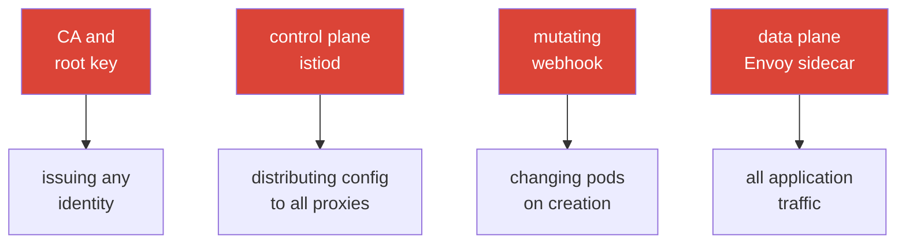

[RU version](ru.md)

# Chapter 31. Hardening and the mesh threat model

> **What's next.** We covered security piece by piece: mTLS (chapter 13), authorization (14),
> certificates (16), egress control (12). This concluding chapter brings it all into a single
> picture: what the attack surface of a service mesh is, what attack vectors there are on the control
> and data plane, and how to close them systematically - hardening Istio in production.

## 31.1. The mesh attack surface

It is important to understand: a mesh not only adds protection (mTLS, authz), but also **becomes part
of the attack surface itself**. New components appear whose compromise is dangerous.



The key assets to protect:

- **The CA and the root key** - a compromise = the ability to issue a certificate with any identity
  and impersonate any service. The most valuable asset.
- **The control plane (istiod)** - manages the configuration of all proxies; a compromise = the
  ability to reroute or intercept the whole mesh's traffic.
- **The data plane (Envoy)** - carries all traffic; a pod compromise or a sidecar bypass gives access
  to the data.
- **The admission webhook** - changes pods on creation; a powerful point of influence.

## 31.2. Attack vectors on the control plane

- **Compromise of the CA key.** Whoever owns the root key owns all identities. Protection: a custom
  CA with an offline/HSM root, intermediates for issuance, rotation (chapter 16).
- **Excessive permissions on Istio resources.** Whoever can create a `VirtualService`, `EnvoyFilter`
  or `AuthorizationPolicy` can reroute traffic or inject arbitrary logic into the data plane.
  `EnvoyFilter` is especially dangerous - it is a "screwdriver into Envoy's guts" (chapter 21).
  Protection: strict Kubernetes RBAC on these CRDs, review, restriction via OPA Gatekeeper (chapter
  30).
- **Access to istiod / xDS.** The xDS channels are protected by mTLS, but access to istiod itself
  (the pod, ports, the Kubernetes API) must be restricted - otherwise one can influence the config
  distribution.
- **Access to the Kubernetes API = access to the mesh.** Whoever can change Istio CRDs through the
  API controls the mesh. Protection: this is ordinary Kubernetes RBAC hygiene (you know it from CKA).

In practice, "strict RBAC on Istio CRDs" means giving application teams a role **only for the safe**
routing resources, and leaving the powerful `EnvoyFilter`/`Sidecar`/`WorkloadEntry` to the platform
team:

```yaml
apiVersion: rbac.authorization.k8s.io/v1
kind: Role
metadata:
  name: istio-app-config
  namespace: team-a
rules:
# application teams - only routing and policies in their namespace
- apiGroups: ["networking.istio.io"]
  resources: ["virtualservices", "destinationrules", "gateways"]
  verbs: ["get", "list", "watch", "create", "update", "patch", "delete"]
- apiGroups: ["security.istio.io"]
  resources: ["authorizationpolicies", "requestauthentications"]
  verbs: ["get", "list", "watch", "create", "update", "patch", "delete"]
# EnvoyFilter, Sidecar, WorkloadEntry are NOT included here -
# they are managed by a separate platform-team role (via review/GitOps)
```

RBAC cannot "forbid" - it works on the "only what is listed is allowed" principle. So `EnvoyFilter`
simply does not fall into the applications' role: since it is not in the list, the team cannot create
it in its own namespace.

## 31.3. Attack vectors on the data plane

- **Sidecar bypass.** If traffic goes around Envoy (an application with `NET_ADMIN`, a direct call to
  a pod's IP, a privileged container), Istio's policies are not applied. Protection: **NetworkPolicy
  as an independent line** (chapter 14) - it is in the kernel, it cannot be bypassed from the pod;
  `istio-cni` instead of privileged init containers (chapter 27); ambient removes the sidecar from
  the pod entirely (chapter 22).
- **A compromised workload uses its own identity.** A hacked service travels with its own valid mTLS
  certificate. Protection: **least privilege in AuthorizationPolicy** (chapter 14) - each gets only
  what it needs, to limit the blast radius.
- **Data exfiltration to the outside.** A compromised pod tries to leak data to an external address.
  Protection: egress control - `REGISTRY_ONLY` and an egress gateway (chapter 12).
- **An open Envoy admin interface.** Envoy's admin port (15000) must not be reachable from outside the
  pod. Protection: do not expose it.

> **Ambient changes the threat model, it does not just "remove the sidecar".** Ambient (chapter 22)
> does remove Envoy from the application pod (a plus for isolation), but the L4 traffic and keys are
> now served by **ztunnel - one per node**. It holds the mTLS keys of **all the pods on its node**, so
> compromising the node/ztunnel is more dangerous than compromising a single sidecar in sidecar mode
> (see §13.11 and chapter 22). Conclusion: ambient is not "safer for free", it is a different
> trade-off; protect the nodes and ztunnel accordingly.

## 31.4. Hardening checklist

Let us gather the defensive measures into one list - essentially a summary of the security practices
of the whole course, arranged as defense in depth.

**Identity and encryption:**
- [ ] STRICT mTLS across the whole mesh (after migrating through PERMISSIVE) - chapter 13.
- [ ] A custom CA, an offline/HSM root, intermediates for issuance, rotation - chapter 16.

**Authorization (least privilege):**
- [ ] A default-deny `AuthorizationPolicy`, targeted allowances by identity/method/path - chapter 14.
- [ ] End-user auth (JWT) at the entry where needed - chapter 15.

**Networking (defense in depth):**
- [ ] NetworkPolicy as an independent line (sidecar bypass) - chapter 14.
- [ ] Egress control: `REGISTRY_ONLY` + an egress gateway - chapter 12.

**Control plane and permissions:**
- [ ] Strict RBAC on Istio CRDs, especially `EnvoyFilter`; review of changes.
- [ ] OPA Gatekeeper: forbidding dangerous configs (DISABLE mTLS, broad policies) - chapter 30.
- [ ] Access to istiod and the Kubernetes API restricted.

**Data plane and nodes:**
- [ ] `istio-cni` instead of privileged init containers - chapter 27.
- [ ] Envoy's admin port (15000) not exposed.
- [ ] Consider ambient to remove the sidecar from application pods - chapter 22.

**Upgrades and supply chain:**
- [ ] Istio upgraded on time (CVEs), via canary/revisions - chapter 3.
- [ ] Wasm modules only from a trusted registry, with version pinning and verification - chapter 21.

## 31.5. Verification tools: how to get a list of problems

On the CKS exam you got used to running scanners over the cluster (kube-bench, kubesec, trivy,
kube-hunter) and getting a ready list of problems. For Istio there is an analogous set of tools that
find configuration errors and weak spots.

An honest caveat: there is no single "istio-bench" at the level of kube-bench that produces a CIS
report for the mesh. In practice a combination is used:

- **`istioctl analyze`** - the main static analyzer (chapter 24). It finds configuration errors and
  warnings, including security-relevant ones: missing injection, broken references, conflicting
  policies. Start with it.

  ```bash
  istioctl analyze -A          # the whole cluster
  ```

- **`istioctl experimental precheck`** - a check of the cluster before an install/upgrade
  (compatibility, potential problems).
- **`istioctl proxy-status` / `proxy-config`** - the runtime state: did the config arrive, what is
  actually in Envoy (for investigation, chapter 24).
- **Kiali (the Validations tab)** - highlights configuration problems, mTLS breaks, overly broad or
  useless policies - a visual "list of problems" for the mesh.
- **OPA Gatekeeper in audit mode** - if you have set up policies (chapter 30), audit mode goes over
  the **already existing** resources and produces a list of violations - this is exactly a scan for
  compliance with your rules.
- **General k8s scanners** (kubescape, trivy misconfig, Checkov) - check the general cluster hardening
  and partly touch Istio resources. They do not give a full deep check of Istio, but are useful as
  part of general hygiene (and they are the same tools as on CKS).

The practical approach: `istioctl analyze` for the configuration, Kiali for a visual picture,
Gatekeeper audit for policy compliance, plus a general k8s scanner for node and cluster hardening.
Together they give that same "list of problems" that the fixing proceeds from.

## 31.6. Automation: making hardening mandatory

Agreements are not enough - in a large cluster someone will deploy something unsafe anyway. So the key
rules are **automated**:

- **OPA Gatekeeper** (chapter 30) as admission control: it will not let a resource that breaks the
  rules be created (no injection, `PeerAuthentication: DISABLE`, an overly broad `AuthorizationPolicy`,
  an `EnvoyFilter` without approval).
- **GitOps and review** for all of Istio's configuration - changes go through a check, they are not
  applied by hand.
- **Monitoring and alerts** on the suspicious: spikes of authorization denials (403), unexpected
  egress, changes in critical policies.

The point: turn the security best practices from this course into **verifiable and mandatory** rules,
not wishes.

## 31.7. Hardening on EKS/AWS

On EKS the mesh threat model is complemented by cloud-specific lines - they are closed outside Istio
itself.

- **IMDSv2 is mandatory.** A compromised pod, via SSRF or uncontrolled egress, reaches for the
  metadata endpoint `169.254.169.254` to steal the node's/role's credentials. Require **IMDSv2** (a
  token + hop limit = 1) so that a pod cannot get the instance metadata. This complements egress
  control from chapter 12 and metadata interception from chapter 27.
- **Least privilege in IRSA / Pod Identity.** Narrow IAM policies for the controllers (LB Controller,
  external-dns, cert-manager) - so that a breach of such a pod does not grant broad AWS permissions.
  Do not attach fat instance roles to the nodes that all pods use.
- **Runtime detection on the nodes.** Amazon **GuardDuty EKS Runtime Monitoring** (and/or your own
  runtime agent) catches suspicious activity on the nodes - an independent line to the mesh policies:
  if the sidecar was bypassed, the anomaly is noticed at the OS level.
- **Protecting the root of trust.** The CA key - in **ACM PCA** or in **KMS/HSM** (chapter 16), not in
  a cluster Secret; access to it - by a narrow IAM policy.
- **The perimeter and the network.** **AWS WAF** on the ALB for L7 filtering at the entry (chapter
  20); istiod's security groups (ports `15012`/`15017`/`15000`) closed from anything unnecessary;
  encryption of the cluster's secrets via **KMS** (envelope encryption).

## 31.8. Chapter summary

- A mesh not only protects, but also adds an **attack surface**: the CA, the control plane, the data
  plane, the admission webhook.
- **Control plane**: the main risks - compromise of the CA key and excessive permissions on Istio
  CRDs (especially `EnvoyFilter`); protection - an offline root, RBAC, OPA Gatekeeper.
- **Data plane**: the risks - sidecar bypass, abuse of a compromised pod's identity, exfiltration;
  protection - NetworkPolicy, least-privilege authz, egress control, istio-cni, ambient. Strict RBAC
  on Istio CRDs: `EnvoyFilter`/`Sidecar` - only for the platform team (RBAC allows only what is
  listed).
- **Ambient** is not "safer for free": ztunnel on the node holds the keys of all its pods, so the
  threat model changes (compromising the node is more dangerous).
- Hardening is **defense in depth**: mTLS + authorization + networking + egress control + permission
  restriction + upgrades + supply chain.
- The key rules need to be **automated** (OPA Gatekeeper, GitOps, alerts), not kept as agreements.
- The list of problems is obtained with scanners: `istioctl analyze`, `istioctl x precheck`, Kiali
  validations, OPA Gatekeeper audit and general k8s scanners (kubescape/trivy) - there is no single
  "istio-bench", a combination is used.
- On EKS the model is complemented by cloud lines: IMDSv2, least-privilege IRSA/Pod Identity,
  GuardDuty runtime, the CA in ACM PCA/KMS, WAF at the edge, closed istiod security groups.

## 31.9. Self-check questions

1. What new assets to protect appear with the introduction of a mesh?
2. Why is compromise of the CA key the most dangerous scenario?
3. What is dangerous about excessive permissions on `EnvoyFilter` and how do you restrict it?
4. What is a sidecar bypass and what measures protect against it?
5. How does least-privilege authorization limit the damage from a compromised pod?
6. How do you restrict the creation of `EnvoyFilter` via RBAC, if RBAC cannot "forbid"?
7. Why does ambient change the threat model rather than just "remove the sidecar"?
8. Why automate hardening and with which tools?
9. With which tools do you get a list of Istio problems (an analog of the CKS scanners) and why is a
   combination of them used?
10. Which cloud lines add to the mesh hardening on EKS (IMDSv2, IRSA, GuardDuty, KMS)?

## Practice

Practice hardening hands-on: STRICT mTLS and default-deny, egress control, restricting permissions on
Istio CRDs, OPA Gatekeeper policies and resistance to sidecar bypass (NetworkPolicy).

🧪 Lab 34: [tasks/ica/labs/34](../../labs/34/README.MD)

---
[Contents](../README.md) · [Chapter 30](../30/en.md) · [Chapter 32](../32/en.md)
