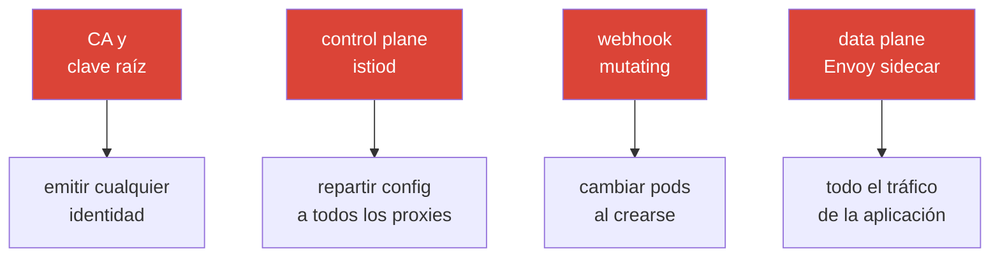

[RU version](ru.md) · [Eng version](en.md)

# Capítulo 31. Hardening y el modelo de amenazas de la malla

> **Qué sigue.** Cubrimos la seguridad pieza a pieza: mTLS (capítulo 13), autorización (14),
> certificados (16), control del egress (12). Este capítulo de cierre lo lleva todo a una única
> imagen: qué es la superficie de ataque de una malla de servicios, qué vectores de ataque hay sobre
> el control plane y el data plane, y cómo cerrarlos de forma sistemática: el hardening de Istio en
> producción.

## 31.1. La superficie de ataque de la malla

Es importante entenderlo: una malla no solo añade protección (mTLS, authz), sino que también **se
convierte en parte de la superficie de ataque en sí**. Aparecen nuevos componentes cuyo compromiso es
peligroso.



Los activos clave que proteger:

- **La CA y la clave raíz**: un compromiso = la capacidad de emitir un certificado con cualquier
  identidad y suplantar cualquier servicio. El activo más valioso.
- **El control plane (istiod)**: gestiona la configuración de todos los proxies; un compromiso = la
  capacidad de reenrutar o interceptar el tráfico de toda la malla.
- **El data plane (Envoy)**: transporta todo el tráfico; el compromiso de un pod o un bypass del
  sidecar da acceso a los datos.
- **El webhook de admisión**: cambia los pods al crearse; un punto de influencia poderoso.

## 31.2. Vectores de ataque sobre el control plane

- **Compromiso de la clave de la CA.** Quien posee la clave raíz posee todas las identidades.
  Protección: una CA personalizada con una raíz offline/HSM, intermedias para la emisión, rotación
  (capítulo 16).
- **Permisos excesivos sobre los recursos de Istio.** Quien pueda crear un `VirtualService`,
  `EnvoyFilter` o `AuthorizationPolicy` puede reenrutar tráfico o inyectar lógica arbitraria en el
  data plane. `EnvoyFilter` es especialmente peligroso: es un "destornillador en las tripas de Envoy"
  (capítulo 21). Protección: RBAC estricto de Kubernetes sobre estos CRDs, revisión, restricción vía
  OPA Gatekeeper (capítulo 30).
- **Acceso a istiod / xDS.** Los canales xDS están protegidos por mTLS, pero el acceso al propio
  istiod (el pod, los puertos, la API de Kubernetes) debe restringirse; de lo contrario se puede
  influir en el reparto de la config.
- **Acceso a la API de Kubernetes = acceso a la malla.** Quien pueda cambiar los CRDs de Istio a
  través de la API controla la malla. Protección: es la higiene ordinaria de RBAC de Kubernetes (la
  conoces del CKA).

En la práctica, "RBAC estricto sobre los CRDs de Istio" significa dar a los equipos de aplicación un
rol **solo para los recursos seguros** de enrutamiento, y dejar los poderosos
`EnvoyFilter`/`Sidecar`/`WorkloadEntry` al equipo de plataforma:

```yaml
apiVersion: rbac.authorization.k8s.io/v1
kind: Role
metadata:
  name: istio-app-config
  namespace: team-a
rules:
# equipos de aplicación - solo enrutamiento y políticas en su namespace
- apiGroups: ["networking.istio.io"]
  resources: ["virtualservices", "destinationrules", "gateways"]
  verbs: ["get", "list", "watch", "create", "update", "patch", "delete"]
- apiGroups: ["security.istio.io"]
  resources: ["authorizationpolicies", "requestauthentications"]
  verbs: ["get", "list", "watch", "create", "update", "patch", "delete"]
# EnvoyFilter, Sidecar, WorkloadEntry NO se incluyen aquí -
# los gestiona un rol aparte del equipo de plataforma (vía review/GitOps)
```

RBAC no puede "prohibir": funciona según el principio de "solo se permite lo que está en la lista".
Así que `EnvoyFilter` simplemente no cae en el rol de las aplicaciones: al no estar en la lista, el
equipo no puede crearlo en su propio namespace.

## 31.3. Vectores de ataque sobre el data plane

- **Bypass del sidecar.** Si el tráfico rodea a Envoy (una aplicación con `NET_ADMIN`, una llamada
  directa a la IP de un pod, un contenedor privilegiado), las políticas de Istio no se aplican.
  Protección: **NetworkPolicy como una línea independiente** (capítulo 14): está en el kernel, no se
  puede evadir desde el pod; `istio-cni` en lugar de init containers privilegiados (capítulo 27);
  ambient quita el sidecar del pod por completo (capítulo 22).
- **Una carga de trabajo comprometida usa su propia identidad.** Un servicio hackeado viaja con su
  propio certificado mTLS válido. Protección: **mínimo privilegio en AuthorizationPolicy** (capítulo
  14): cada uno recibe solo lo que necesita, para limitar el radio de impacto.
- **Exfiltración de datos hacia el exterior.** Un pod comprometido intenta filtrar datos a una
  dirección externa. Protección: control del egress: `REGISTRY_ONLY` y un egress gateway (capítulo
  12).
- **Una interfaz de administración de Envoy abierta.** El puerto de administración de Envoy (15000)
  no debe ser alcanzable desde fuera del pod. Protección: no exponerlo.

> **Ambient cambia el modelo de amenazas, no solo "quita el sidecar".** Ambient (capítulo 22)
> efectivamente quita Envoy del pod de aplicación (un plus para el aislamiento), pero el tráfico L4 y
> las claves las sirve ahora **ztunnel: uno por nodo**. Retiene las claves mTLS de **todos los pods de
> su nodo**, así que comprometer el nodo/ztunnel es más peligroso que comprometer un único sidecar en
> modo sidecar (ver §13.11 y capítulo 22). Conclusión: ambient no es "más seguro gratis", es un
> trade-off diferente; protege los nodos y ztunnel en consecuencia.

## 31.4. Checklist de hardening

Reunamos las medidas defensivas en una sola lista: en esencia un resumen de las prácticas de
seguridad de todo el curso, dispuestas como defensa en profundidad.

**Identidad y cifrado:**
- [ ] mTLS STRICT en toda la malla (tras migrar a través de PERMISSIVE) - capítulo 13.
- [ ] Una CA personalizada, una raíz offline/HSM, intermedias para la emisión, rotación - capítulo
  16.

**Autorización (mínimo privilegio):**
- [ ] Un `AuthorizationPolicy` default-deny, permisos dirigidos por identidad/método/ruta - capítulo
  14.
- [ ] Auth de usuario final (JWT) en la entrada donde haga falta - capítulo 15.

**Red (defensa en profundidad):**
- [ ] NetworkPolicy como una línea independiente (bypass del sidecar) - capítulo 14.
- [ ] Control del egress: `REGISTRY_ONLY` + un egress gateway - capítulo 12.

**Control plane y permisos:**
- [ ] RBAC estricto sobre los CRDs de Istio, especialmente `EnvoyFilter`; revisión de los cambios.
- [ ] OPA Gatekeeper: prohibir configs peligrosas (DISABLE de mTLS, políticas amplias) - capítulo 30.
- [ ] Acceso a istiod y a la API de Kubernetes restringido.

**Data plane y nodos:**
- [ ] `istio-cni` en lugar de init containers privilegiados - capítulo 27.
- [ ] El puerto de administración de Envoy (15000) no expuesto.
- [ ] Considera ambient para quitar el sidecar de los pods de aplicación - capítulo 22.

**Actualizaciones y cadena de suministro:**
- [ ] Istio actualizado a tiempo (CVEs), vía canary/revisiones - capítulo 3.
- [ ] Módulos Wasm solo desde un registro de confianza, con fijación de versión y verificación -
  capítulo 21.

## 31.5. Herramientas de verificación: cómo obtener una lista de problemas

En el examen CKS te acostumbraste a pasar escáneres sobre el clúster (kube-bench, kubesec, trivy,
kube-hunter) y obtener una lista de problemas lista. Para Istio hay un conjunto análogo de
herramientas que encuentran errores de configuración y puntos débiles.

Una advertencia honesta: no existe un único "istio-bench" al nivel de kube-bench que produzca un
informe CIS para la malla. En la práctica se usa una combinación:

- **`istioctl analyze`**: el analizador estático principal (capítulo 24). Encuentra errores de
  configuración y avisos, incluidos los relevantes para la seguridad: inyección ausente, referencias
  rotas, políticas en conflicto. Empieza por él.

  ```bash
  istioctl analyze -A          # todo el clúster
  ```

- **`istioctl experimental precheck`**: una comprobación del clúster antes de una
  instalación/actualización (compatibilidad, problemas potenciales).
- **`istioctl proxy-status` / `proxy-config`**: el estado en runtime: ¿llegó la config?, ¿qué hay
  realmente en Envoy? (para investigación, capítulo 24).
- **Kiali (la pestaña Validations)**: resalta problemas de configuración, roturas de mTLS, políticas
  demasiado amplias o inútiles: una "lista de problemas" visual para la malla.
- **OPA Gatekeeper en modo audit**: si has configurado políticas (capítulo 30), el modo audit recorre
  los recursos **ya existentes** y produce una lista de violaciones: es exactamente un escaneo de
  cumplimiento de tus reglas.
- **Escáneres generales de k8s** (kubescape, trivy misconfig, Checkov): comprueban el hardening
  general del clúster y en parte tocan recursos de Istio. No dan una comprobación profunda completa de
  Istio, pero son útiles como parte de la higiene general (y son las mismas herramientas que en CKS).

El enfoque práctico: `istioctl analyze` para la configuración, Kiali para una imagen visual, el audit
de Gatekeeper para el cumplimiento de políticas, más un escáner general de k8s para el hardening de
nodos y clúster. Juntos dan esa misma "lista de problemas" de la que parte la corrección.

## 31.6. Automatización: hacer el hardening obligatorio

Los acuerdos no bastan: en un clúster grande alguien desplegará algo inseguro de todos modos. Por eso
las reglas clave se **automatizan**:

- **OPA Gatekeeper** (capítulo 30) como control de admisión: no dejará crear un recurso que rompa las
  reglas (sin inyección, `PeerAuthentication: DISABLE`, un `AuthorizationPolicy` demasiado amplio, un
  `EnvoyFilter` sin aprobación).
- **GitOps y revisión** para toda la configuración de Istio: los cambios pasan por una comprobación,
  no se aplican a mano.
- **Monitorización y alertas** sobre lo sospechoso: picos de denegaciones de autorización (403),
  egress inesperado, cambios en políticas críticas.

La idea: convertir las buenas prácticas de seguridad de este curso en reglas **verificables y
obligatorias**, no en deseos.

## 31.7. Hardening en EKS/AWS

En EKS el modelo de amenazas de la malla se complementa con líneas específicas de la nube: se cierran
fuera del propio Istio.

- **IMDSv2 es obligatorio.** Un pod comprometido, vía SSRF o egress no controlado, alcanza el endpoint
  de metadatos `169.254.169.254` para robar las credenciales del nodo/rol. Exige **IMDSv2** (un token
  + hop limit = 1) para que un pod no pueda obtener los metadatos de la instancia. Esto complementa el
  control del egress del capítulo 12 y la interceptación de metadatos del capítulo 27.
- **Mínimo privilegio en IRSA / Pod Identity.** Políticas IAM estrechas para los controladores (LB
  Controller, external-dns, cert-manager), para que una brecha de tal pod no otorgue permisos AWS
  amplios. No adjuntes roles de instancia gordos a los nodos que todos los pods usan.
- **Detección en runtime en los nodos.** Amazon **GuardDuty EKS Runtime Monitoring** (y/o tu propio
  agente de runtime) detecta actividad sospechosa en los nodos: una línea independiente de las
  políticas de la malla: si el sidecar fue evadido, la anomalía se nota a nivel del SO.
- **Proteger la raíz de confianza.** La clave de la CA: en **ACM PCA** o en **KMS/HSM** (capítulo 16),
  no en un Secret del clúster; el acceso a ella: mediante una política IAM estrecha.
- **El perímetro y la red.** **AWS WAF** en el ALB para el filtrado L7 en la entrada (capítulo 20);
  los security groups de istiod (puertos `15012`/`15017`/`15000`) cerrados a todo lo innecesario;
  cifrado de los secrets del clúster vía **KMS** (envelope encryption).

## 31.8. Resumen del capítulo

- Una malla no solo protege, sino que también añade una **superficie de ataque**: la CA, el control
  plane, el data plane, el webhook de admisión.
- **Control plane**: los riesgos principales: compromiso de la clave de la CA y permisos excesivos
  sobre los CRDs de Istio (especialmente `EnvoyFilter`); protección: una raíz offline, RBAC, OPA
  Gatekeeper.
- **Data plane**: los riesgos: bypass del sidecar, abuso de la identidad de un pod comprometido,
  exfiltración; protección: NetworkPolicy, authz de mínimo privilegio, control del egress, istio-cni,
  ambient. RBAC estricto sobre los CRDs de Istio: `EnvoyFilter`/`Sidecar`: solo para el equipo de
  plataforma (RBAC permite solo lo que está en la lista).
- **Ambient** no es "más seguro gratis": ztunnel en el nodo retiene las claves de todos sus pods, así
  que el modelo de amenazas cambia (comprometer el nodo es más peligroso).
- El hardening es **defensa en profundidad**: mTLS + autorización + red + control del egress +
  restricción de permisos + actualizaciones + cadena de suministro.
- Las reglas clave hay que **automatizarlas** (OPA Gatekeeper, GitOps, alertas), no mantenerlas como
  acuerdos.
- La lista de problemas se obtiene con escáneres: `istioctl analyze`, `istioctl x precheck`,
  validaciones de Kiali, el audit de OPA Gatekeeper y escáneres generales de k8s (kubescape/trivy):
  no hay un único "istio-bench", se usa una combinación.
- En EKS el modelo se complementa con líneas de la nube: IMDSv2, IRSA/Pod Identity de mínimo
  privilegio, GuardDuty en runtime, la CA en ACM PCA/KMS, WAF en el borde, security groups de istiod
  cerrados.

## 31.9. Preguntas de autoevaluación

1. ¿Qué nuevos activos que proteger aparecen con la introducción de una malla?
2. ¿Por qué el compromiso de la clave de la CA es el escenario más peligroso?
3. ¿Qué tiene de peligroso los permisos excesivos sobre `EnvoyFilter` y cómo lo restringes?
4. ¿Qué es un bypass del sidecar y qué medidas protegen contra él?
5. ¿Cómo limita la autorización de mínimo privilegio el daño de un pod comprometido?
6. ¿Cómo restringes la creación de `EnvoyFilter` vía RBAC, si RBAC no puede "prohibir"?
7. ¿Por qué ambient cambia el modelo de amenazas en lugar de solo "quitar el sidecar"?
8. ¿Por qué automatizar el hardening y con qué herramientas?
9. ¿Con qué herramientas obtienes una lista de problemas de Istio (un análogo de los escáneres de
   CKS) y por qué se usa una combinación de ellas?
10. ¿Qué líneas de la nube se suman al hardening de la malla en EKS (IMDSv2, IRSA, GuardDuty, KMS)?

## Práctica

Practica el hardening de forma práctica: mTLS STRICT y default-deny, control del egress, restricción
de permisos sobre los CRDs de Istio, políticas de OPA Gatekeeper y resistencia al bypass del sidecar
(NetworkPolicy).

🧪 Laboratorio 34: [tasks/ica/labs/34](../../labs/34/README_ES.MD)

---
[Índice](../README_ES.md) · [Capítulo 30](../30/es.md) · [Capítulo 32](../32/es.md)
