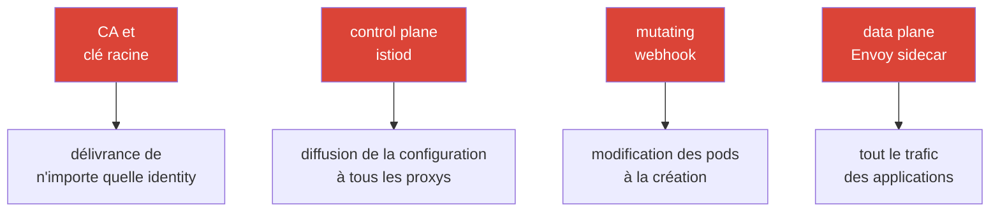

[RU version](ru.md) · [Eng version](en.md) · [Versión en español](es.md) · [Deutsche Version](de.md)

# Chapitre 31. Durcissement et modèle de menaces du maillage

> **La suite.** Nous avons abordé la sécurité par morceaux : mTLS (chapitre 13), autorisation (14),
> certificats (16), contrôle de l'egress (12). Ce chapitre final rassemble le tout en une image
> unique : quelle est la surface d'attaque d'un maillage de services, quels vecteurs d'attaque
> existent contre le control et le data plane, et comment les fermer systématiquement - le
> durcissement d'Istio en production.

## 31.1. Surface d'attaque du maillage

Il est important de comprendre : le maillage n'ajoute pas seulement de la protection (mTLS, authz),
il **devient lui-même une partie de la surface d'attaque**. De nouveaux composants apparaissent, dont
la compromission est dangereuse.



Actifs clés à protéger :

- **CA et clé racine** - compromission = possibilité d'émettre un certificat avec n'importe quelle
  identity et de se faire passer pour n'importe quel service. L'actif le plus précieux.
- **Control plane (istiod)** - gère la configuration de tous les proxys ; compromission =
  possibilité de rediriger ou d'intercepter le trafic de tout le maillage.
- **Data plane (Envoy)** - porte tout le trafic ; compromettre un pod ou contourner le sidecar donne
  accès aux données.
- **Admission webhook** - modifie les pods à la création ; un point d'influence puissant.

## 31.2. Vecteurs d'attaque contre le control plane

- **Compromission de la clé du CA.** Qui possède la clé racine possède toutes les identity.
  Protection : CA personnalisé avec racine offline/HSM, intermédiaires pour la délivrance, rotation
  (chapitre 16).
- **Droits excessifs sur les ressources Istio.** Celui qui peut créer des `VirtualService`,
  `EnvoyFilter` ou `AuthorizationPolicy` peut rediriger le trafic ou insérer une logique arbitraire
  dans le data plane. `EnvoyFilter` est particulièrement dangereux - c'est un « tournevis dans les
  entrailles » d'Envoy (chapitre 21). Protection : RBAC Kubernetes strict sur ces CRD, revue,
  restriction via OPA Gatekeeper (chapitre 30).
- **Accès à istiod / xDS.** Les canaux xDS sont protégés par mTLS, mais l'accès à istiod lui-même
  (pod, ports, API Kubernetes) doit être restreint - sinon on peut influer sur la diffusion de la
  configuration.
- **Accès à l'API Kubernetes = accès au maillage.** Qui peut modifier les CRD Istio via l'API pilote
  le maillage. Protection : c'est l'hygiène habituelle du RBAC Kubernetes (que vous connaissez de la
  CKA).

En pratique, un « RBAC strict sur les CRD Istio » consiste à accorder aux équipes applicatives un
rôle **uniquement sur les** ressources de routage **sûres**, et à laisser les puissants
`EnvoyFilter`/`Sidecar`/`WorkloadEntry` à l'équipe plateforme :

```yaml
apiVersion: rbac.authorization.k8s.io/v1
kind: Role
metadata:
  name: istio-app-config
  namespace: team-a
rules:
# aux équipes applicatives - uniquement le routage et les politiques de leur namespace
- apiGroups: ["networking.istio.io"]
  resources: ["virtualservices", "destinationrules", "gateways"]
  verbs: ["get", "list", "watch", "create", "update", "patch", "delete"]
- apiGroups: ["security.istio.io"]
  resources: ["authorizationpolicies", "requestauthentications"]
  verbs: ["get", "list", "watch", "create", "update", "patch", "delete"]
# EnvoyFilter, Sidecar, WorkloadEntry ne sont PAS inclus ici -
# ils sont gérés par un rôle séparé de l'équipe plateforme (via revue/GitOps)
```

Le RBAC ne sait pas « interdire » — il fonctionne selon le principe « seul l'énuméré est autorisé ».
C'est pourquoi `EnvoyFilter` n'est tout simplement pas repris dans le rôle des applications : dès lors
qu'il n'est pas dans la liste, l'équipe ne pourra pas le créer dans son namespace.

## 31.3. Vecteurs d'attaque contre le data plane

- **Contournement du sidecar.** Si le trafic évite Envoy (application avec `NET_ADMIN`, accès direct
  par IP du pod, conteneur privilégié), les politiques Istio ne s'appliquent pas. Protection :
  **NetworkPolicy comme rempart indépendant** (chapitre 14) - elle est dans le noyau, on ne la
  contourne pas depuis le pod ; `istio-cni` à la place des init-conteneurs privilégiés (chapitre 27) ;
  ambient retire complètement le sidecar du pod (chapitre 22).
- **Une charge de travail compromise utilise sa propre identity.** Un service piraté circule avec son
  propre certificat mTLS valide. Protection : **least privilege dans l'AuthorizationPolicy** (chapitre
  14) - à chacun uniquement ce dont il a besoin, pour limiter le rayon de l'impact.
- **Exfiltration de données vers l'extérieur.** Un pod compromis tente de faire fuir des données vers
  une adresse externe. Protection : contrôle de l'egress - `REGISTRY_ONLY` et egress gateway (chapitre
  12).
- **Interface d'admin d'Envoy ouverte.** Le port d'admin d'Envoy (15000) ne doit pas être accessible
  depuis l'extérieur du pod. Protection : ne pas l'exposer.

> **Ambient change le modèle de menaces, il ne fait pas que « retirer le sidecar ».** Ambient
> (chapitre 22) retire effectivement Envoy du pod applicatif (en plus de l'isolation), mais le trafic
> L4 et les clés sont désormais servis par **ztunnel - un par nœud**. Il détient les clés mTLS de
> **tous les pods de son nœud**, c'est pourquoi la compromission du nœud/de ztunnel est plus
> dangereuse que celle d'un seul sidecar en mode sidecar (voir §13.11 et le chapitre 22). Conclusion :
> ambient n'est pas « gratuitement plus sûr », c'est un autre compromis ; protégez les nœuds et
> ztunnel en conséquence.

## 31.4. Checklist de durcissement

Réunissons les mesures de protection en une seule liste - c'est en substance une synthèse des
pratiques de sécurité de tout le cours, organisée en défense en profondeur.

**Identité et chiffrement :**
- [ ] STRICT mTLS sur tout le maillage (après migration via PERMISSIVE) - chapitre 13.
- [ ] CA personnalisé, racine offline/HSM, intermédiaires pour la délivrance, rotation - chapitre 16.

**Autorisation (least privilege) :**
- [ ] `AuthorizationPolicy` default-deny, autorisations ciblées par identity/méthode/chemin -
  chapitre 14.
- [ ] Authentification de l'utilisateur final (JWT) à l'entrée, là où c'est nécessaire - chapitre 15.

**Réseau (defense in depth) :**
- [ ] NetworkPolicy comme rempart indépendant (contournement du sidecar) - chapitre 14.
- [ ] Contrôle de l'egress : `REGISTRY_ONLY` + egress gateway - chapitre 12.

**Control plane et droits :**
- [ ] RBAC strict sur les CRD Istio, surtout `EnvoyFilter` ; revue des changements.
- [ ] OPA Gatekeeper : interdiction des configurations dangereuses (DISABLE mTLS, politiques larges) -
  chapitre 30.
- [ ] Accès restreint à istiod et à l'API Kubernetes.

**Data plane et nœuds :**
- [ ] `istio-cni` à la place des init-conteneurs privilégiés - chapitre 27.
- [ ] Port d'admin d'Envoy (15000) non exposé vers l'extérieur.
- [ ] Envisager ambient pour retirer le sidecar des pods applicatifs - chapitre 22.

**Mises à jour et supply chain :**
- [ ] Istio mis à jour à temps (CVE), via canary/révisions - chapitre 3.
- [ ] Modules Wasm uniquement depuis un registre de confiance, avec pinning des versions et
  vérification - chapitre 21.

## 31.5. Outils de contrôle : comment obtenir la liste des problèmes

À l'examen CKS, vous avez pris l'habitude de passer le cluster au crible de scanners (kube-bench,
kubesec, trivy, kube-hunter) et d'obtenir une liste toute prête de problèmes. Pour Istio, il existe un
ensemble d'outils analogue, qui trouve les erreurs de configuration et les points faibles.

Une mise en garde honnête : il n'existe pas d'« istio-bench » unique au niveau de kube-bench, qui
produirait un rapport CIS sur le maillage. En pratique, on utilise une combinaison :

- **`istioctl analyze`** - l'analyseur statique principal (chapitre 24). Il trouve les erreurs et
  avertissements de configuration, y compris ceux qui touchent à la sécurité : absence d'injection,
  liens cassés, politiques conflictuelles. C'est par lui qu'on commence.

  ```bash
  istioctl analyze -A          # tout le cluster
  ```

- **`istioctl experimental precheck`** - vérification du cluster avant installation/mise à jour
  (compatibilité, problèmes potentiels).
- **`istioctl proxy-status` / `proxy-config`** - état runtime : la config est-elle arrivée, qu'y
  a-t-il réellement dans Envoy (pour l'investigation, chapitre 24).
- **Kiali (onglet Validations)** - met en évidence les problèmes de configuration, les ruptures de
  mTLS, les politiques trop larges ou inutiles - une « liste de problèmes » visuelle sur le maillage.
- **OPA Gatekeeper en mode audit** - si vous avez mis en place des politiques (chapitre 30), le mode
  audit parcourt les ressources **déjà existantes** et produit une liste de violations - c'est bien un
  scan de conformité à vos règles.
- **Scanners k8s universels** (kubescape, trivy misconfig, Checkov) - vérifient le durcissement
  général du cluster et touchent en partie aux ressources Istio. Ils ne donnent pas une vérification
  Istio approfondie et complète, mais sont utiles au titre de l'hygiène générale (et ce sont les mêmes
  outils qu'à la CKS).

Approche pratique : `istioctl analyze` pour la configuration, Kiali pour une vue d'ensemble, l'audit
Gatekeeper pour la conformité aux politiques, plus un scanner k8s général pour le durcissement des
nœuds et du cluster. Ensemble, ils donnent cette fameuse « liste de problèmes » à partir de laquelle
on procède aux corrections.

## 31.6. Automatisation : rendre le durcissement obligatoire

Les accords ne suffisent pas - dans un grand cluster, quelqu'un finira toujours par déployer quelque
chose de non sûr. C'est pourquoi on **automatise** les règles clés :

- **OPA Gatekeeper** (chapitre 30) comme contrôle d'admission : il empêchera de créer une ressource
  qui viole les règles (pas d'injection, `PeerAuthentication: DISABLE`, `AuthorizationPolicy` trop
  large, `EnvoyFilter` sans approbation).
- **GitOps et revue** pour toute la configuration Istio - les changements passent une vérification, ils
  ne sont pas appliqués à la main.
- **Monitoring et alertes** sur le suspect : flambées de refus d'autorisation (403), egress
  inattendu, changements dans les politiques critiques.

L'idée : transformer les best practices de sécurité de ce cours en règles **vérifiables et
obligatoires**, et non en souhaits.

## 31.7. Durcissement sur EKS/AWS

Sur EKS, le modèle de menaces du maillage se complète de remparts spécifiques au cloud - qu'on ferme
en dehors d'Istio lui-même.

- **IMDSv2 obligatoire.** Un pod compromis, via SSRF ou un egress non contrôlé, cherche à atteindre
  l'endpoint de métadonnées `169.254.169.254` pour voler les credentials du nœud/du rôle. Exigez
  **IMDSv2** (token + hop limit = 1), pour que le pod ne puisse pas récupérer les métadonnées de
  l'instance. Cela complète le contrôle de l'egress du chapitre 12 et l'interception des métadonnées
  du chapitre 27.
- **Least privilege dans IRSA / Pod Identity.** Des politiques IAM étroites pour les contrôleurs (LB
  Controller, external-dns, cert-manager) - pour que le piratage d'un tel pod ne donne pas de larges
  droits dans AWS. N'attachez pas aux nœuds des rôles d'instance gras, utilisés par tous les pods.
- **Détection runtime sur les nœuds.** Amazon **GuardDuty EKS Runtime Monitoring** (et/ou votre propre
  agent runtime) capte l'activité suspecte sur les nœuds - un rempart indépendant des politiques du
  maillage : si le sidecar a été contourné, l'anomalie sera remarquée au niveau de l'OS.
- **Protection de la racine de confiance.** La clé du CA - dans **ACM PCA** ou dans **KMS/HSM**
  (chapitre 16), et non dans un Secret du cluster ; l'accès à celle-ci - par une politique IAM étroite.
- **Périmètre et réseau.** **AWS WAF** sur l'ALB pour le filtrage L7 à l'entrée (chapitre 20) ; les
  security groups d'istiod (ports `15012`/`15017`/`15000`) fermés au superflu ; chiffrement des secrets
  du cluster via **KMS** (envelope encryption).

## 31.8. Résumé du chapitre

- Le maillage ne fait pas que protéger, il ajoute aussi une **surface d'attaque** : CA, control
  plane, data plane, admission webhook.
- **Control plane** : les principaux risques sont la compromission de la clé du CA et les droits
  excessifs sur les CRD Istio (surtout `EnvoyFilter`) ; protection - racine offline, RBAC, OPA
  Gatekeeper.
- **Data plane** : risques - contournement du sidecar, abus de l'identity d'un pod compromis,
  exfiltration ; protection - NetworkPolicy, authz least-privilege, contrôle de l'egress, istio-cni,
  ambient. RBAC strict sur les CRD Istio : `EnvoyFilter`/`Sidecar` - uniquement à l'équipe plateforme
  (le RBAC n'autorise que l'énuméré).
- **Ambient** n'est pas « gratuitement plus sûr » : ztunnel sur le nœud détient les clés de tous ses
  pods, le modèle de menaces change donc (la compromission d'un nœud est plus dangereuse).
- Le durcissement est une **défense en profondeur** : mTLS + autorisation + réseau + contrôle de
  l'egress + restriction des droits + mises à jour + supply chain.
- Les règles clés doivent être **automatisées** (OPA Gatekeeper, GitOps, alertes), et non maintenues
  comme des accords.
- La liste des problèmes s'obtient avec des scanners : `istioctl analyze`, `istioctl x precheck`, les
  validations Kiali, l'audit OPA Gatekeeper et les scanners k8s généraux (kubescape/trivy) - il n'y a
  pas d'« istio-bench » unique, on utilise une combinaison.
- Sur EKS, on complète le modèle par des remparts cloud : IMDSv2, IRSA/Pod Identity least-privilege,
  GuardDuty runtime, CA dans ACM PCA/KMS, WAF en edge, security groups d'istiod fermés.

## 31.9. Questions d'auto-évaluation

1. Quels nouveaux actifs à protéger apparaissent avec l'adoption d'un maillage ?
2. Pourquoi la compromission de la clé du CA est-elle le scénario le plus dangereux ?
3. En quoi les droits excessifs sur `EnvoyFilter` sont-ils dangereux et comment les restreindre ?
4. Qu'est-ce que le contournement du sidecar et quelles mesures en protègent ?
5. Comment l'autorisation least-privilege limite-t-elle les dommages d'un pod compromis ?
6. Comment restreindre la création d'`EnvoyFilter` via le RBAC, si le RBAC ne sait pas « interdire » ?
7. Pourquoi ambient change-t-il le modèle de menaces, et ne fait-il pas que « retirer le sidecar » ?
8. Pourquoi automatiser le durcissement et avec quels outils ?
9. Avec quels outils obtenir la liste des problèmes Istio (analogue aux scanners de la CKS) et
   pourquoi en utilise-t-on une combinaison ?
10. Quels remparts cloud ajoute le durcissement du maillage sur EKS (IMDSv2, IRSA, GuardDuty, KMS) ?

## Pratique

Exercez-vous au durcissement : STRICT mTLS et default-deny, contrôle de l'egress, restriction des
droits sur les CRD Istio, politiques OPA Gatekeeper et résistance au contournement du sidecar
(NetworkPolicy).

🧪 Lab 34 : [tasks/ica/labs/34](../../labs/34/README_FR.MD)

---
[Table des matières](../README_FR.md) · [Chapitre 30](../30/fr.md) · [Chapitre 32](../32/fr.md)
