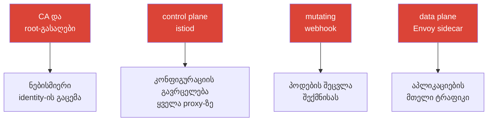

[Русская версия](ru.md) · [Eng version](en.md) · [Versión en español](es.md) · [Version française](fr.md) · [Deutsche Version](de.md) · [繁體中文版](tw.md) · [日本語版](jp.md)

# თავი 31. Mesh-ის ჰარდენინგი და საფრთხეების მოდელი

> **რა იქნება შემდეგ.** უსაფრთხოება ნაწილ-ნაწილ განვიხილეთ: mTLS (თავი 13), ავტორიზაცია
> (14), სერტიფიკატები (16), egress-ის კონტროლი (12). ეს დასკვნითი თავი ყველაფერს ერთიან
> სურათად აერთიანებს: როგორია service mesh-ის შეტევის ზედაპირი, რა შეტევის ვექტორები არსებობს
> control და data plane-ზე და როგორ დავიცვათ ისინი სისტემურად - Istio-ს ჰარდენინგი production-ში.

## 31.1. Mesh-ის შეტევის ზედაპირი

მნიშვნელოვანია გვესმოდეს: mesh არა მხოლოდ ამატებს დაცვას (mTLS, authz), არამედ **თავადაც ხდება
შეტევის ზედაპირის ნაწილი**. ჩნდება ახალი კომპონენტები, რომელთა კომპრომეტირება სახიფათოა.



ძირითადი აქტივები, რომლებიც უნდა დავიცვათ:

- **CA და root-გასაღები** - კომპრომეტირება = ნებისმიერი identity-ით სერტიფიკატის გაცემისა
  და ნებისმიერი სერვისის სახელით მოქმედების შესაძლებლობა. ყველაზე ღირებული აქტივია.
- **Control plane (istiod)** - მართავს ყველა proxy-ის კონფიგურაციას; კომპრომეტირება =
  მთელი mesh-ის ტრაფიკის გადამისამართების ან ჩაჭერის შესაძლებლობა.
- **Data plane (Envoy)** - ატარებს მთელ ტრაფიკს; პოდის კომპრომეტირება ან sidecar-ის გვერდის ავლა
  მონაცემებზე წვდომას იძლევა.
- **Admission webhook** - პოდებს შექმნისას ცვლის; გავლენის მძლავრი წერტილია.

## 31.2. Control plane-ზე შეტევის ვექტორები

- **CA-გასაღების კომპრომეტირება.** ვინც root-გასაღებს ფლობს, ყველა identity-ს ფლობს.
  დაცვა: custom CA offline/HSM root-ით, intermediate-ები გაცემისთვის, როტაცია (თავი 16).
- **Istio-ს რესურსებზე გადაჭარბებული უფლებები.** ვისაც შეუძლია `VirtualService`-ის,
  `EnvoyFilter`-ის ან `AuthorizationPolicy`-ის შექმნა, შეუძლია ტრაფიკის გადამისამართება ან
  data plane-ში ნებისმიერი ლოგიკის ჩასმა. `EnvoyFilter` განსაკუთრებით სახიფათოა - ეს Envoy-ის
  „შიგნეულობაში ჩასაყოფი სახრახნისია“ (თავი 21). დაცვა: მკაცრი Kubernetes RBAC ამ CRD-ებზე,
  review, შეზღუდვა OPA Gatekeeper-ით (თავი 30).
- **წვდომა istiod / xDS-ზე.** xDS არხები დაცულია mTLS-ით, თუმცა თავად istiod-ზე
  (პოდი, პორტები, Kubernetes API) წვდომა შეზღუდული უნდა იყოს - წინააღმდეგ შემთხვევაში
  კონფიგურაციის გავრცელებაზე გავლენის მოხდენა იქნება შესაძლებელი.
- **Kubernetes API-ზე წვდომა = mesh-ზე წვდომა.** ვინც API-ის მეშვეობით Istio-CRD-ების
  შეცვლას შეძლებს, mesh-ს მართავს. დაცვა: ეს Kubernetes RBAC-ის ჩვეულებრივი ჰიგიენაა
  (მას CKA-დან იცნობთ).

პრაქტიკაში „მკაცრი RBAC Istio-CRD-ებზე“ ნიშნავს, რომ აპლიკაციების გუნდებს როლი მიეცეთ
**მხოლოდ უსაფრთხო** მარშრუტიზაციის რესურსებზე, ხოლო მძლავრი
`EnvoyFilter`/`Sidecar`/`WorkloadEntry` platform-გუნდს დარჩეს:

```yaml
apiVersion: rbac.authorization.k8s.io/v1
kind: Role
metadata:
  name: istio-app-config
  namespace: team-a
rules:
# აპლიკაციების გუნდებს - მხოლოდ მარშრუტიზაცია და მათი namespace-ის პოლიტიკები
- apiGroups: ["networking.istio.io"]
  resources: ["virtualservices", "destinationrules", "gateways"]
  verbs: ["get", "list", "watch", "create", "update", "patch", "delete"]
- apiGroups: ["security.istio.io"]
  resources: ["authorizationpolicies", "requestauthentications"]
  verbs: ["get", "list", "watch", "create", "update", "patch", "delete"]
# EnvoyFilter, Sidecar, WorkloadEntry აქ ჩართული არ არის -
# მათ მართავს platform-გუნდის ცალკე როლი (რევიუს/GitOps-ის მეშვეობით)
```

RBAC-ს „აკრძალვა“ არ შეუძლია - ის მუშაობს პრინციპით „ნებადართულია მხოლოდ ჩამოთვლილი“.
ამიტომ `EnvoyFilter` უბრალოდ არ ხვდება აპლიკაციების როლში: რადგან სიაში არ არის,
გუნდი მას საკუთარ namespace-ში ვერ შექმნის.

## 31.3. Data plane-ზე შეტევის ვექტორები

- **Sidecar-ის გვერდის ავლა.** თუ ტრაფიკი Envoy-ს გვერდს აუვლის (`NET_ADMIN`-ის მქონე
  აპლიკაცია, პოდის IP-ზე პირდაპირი მიმართვა, privileged კონტეინერი), Istio-ს პოლიტიკები
  არ გამოიყენება. დაცვა: **NetworkPolicy, როგორც დამოუკიდებელი ზღუდე** (თავი 14) - ის kernel-შია
  და პოდიდან მისი გვერდის ავლა შეუძლებელია; `istio-cni` privileged init-კონტეინერების ნაცვლად
  (თავი 27); ambient საერთოდ აშორებს sidecar-ს პოდიდან (თავი 22).
- **კომპრომეტირებული workload საკუთარ identity-ს იყენებს.** გატეხილი სერვისი საკუთარი
  მოქმედი mTLS-სერტიფიკატით ურთიერთობს. დაცვა: **least privilege AuthorizationPolicy-ში**
  (თავი 14) - თითოეულს მხოლოდ ის მიეცეს, რაც სჭირდება, რათა დაზიანების რადიუსი შეიზღუდოს.
- **მონაცემების გარეთ გატანა.** კომპრომეტირებული პოდი ცდილობს მონაცემები გარე მისამართზე
  გაიტანოს. დაცვა: egress-ის კონტროლი - `REGISTRY_ONLY` და egress gateway (თავი 12).
- **Envoy-ის ღია admin-ინტერფეისი.** Envoy-ის admin-პორტი (15000) პოდის გარედან
  ხელმისაწვდომი არ უნდა იყოს. დაცვა: არ გამოაქვეყნოთ ის გარეთ.

> **Ambient საფრთხეების მოდელს ცვლის და არა უბრალოდ „აშორებს sidecar-ს“.** Ambient (თავი 22)
> მართლაც აშორებს Envoy-ს აპლიკაციის პოდიდან (რაც იზოლაციას აუმჯობესებს), მაგრამ L4-ტრაფიკსა და
> გასაღებებს ახლა ემსახურება **ztunnel - თითო node-ზე ერთი**. ის ინახავს თავისი node-ის
> **ყველა პოდის** mTLS-გასაღებებს, ამიტომ node-ის/ztunnel-ის კომპრომეტირება უფრო სახიფათოა,
> ვიდრე sidecar-რეჟიმში ერთი sidecar-ის კომპრომეტირება (იხ. §13.11 და თავი 22). დასკვნა:
> ambient არ არის „უფასოდ უფრო უსაფრთხო“ - ეს სხვა trade-off-ია; შესაბამისად დაიცავით
> node-ები და ztunnel.

## 31.4. ჰარდენინგის საკონტროლო სია

დაცვის ზომები ერთ სიაში გავაერთიანოთ - არსებითად, ეს მთელი კურსის security-პრაქტიკების
შეჯამებაა, რომელიც defense in depth-ის პრინციპითაა აგებული.

**იდენტობა და დაშიფვრა:**
- [ ] STRICT mTLS მთელ mesh-ზე (PERMISSIVE-ის გავლით მიგრაციის შემდეგ) - თავი 13.
- [ ] Custom CA, offline/HSM root, intermediate-ები გაცემისთვის, როტაცია - თავი 16.

**ავტორიზაცია (least privilege):**
- [ ] Default-deny `AuthorizationPolicy`, ზუსტი ნებართვები identity-ის/მეთოდის/path-ის მიხედვით -
  თავი 14.
- [ ] End-user auth (JWT) შესასვლელში, სადაც საჭიროა - თავი 15.

**ქსელი (defense in depth):**
- [ ] NetworkPolicy, როგორც დამოუკიდებელი ზღუდე (sidecar-ის გვერდის ავლა) - თავი 14.
- [ ] Egress-ის კონტროლი: `REGISTRY_ONLY` + egress gateway - თავი 12.

**Control plane და უფლებები:**
- [ ] მკაცრი RBAC Istio-CRD-ებზე, განსაკუთრებით `EnvoyFilter`-ზე; ცვლილებების review.
- [ ] OPA Gatekeeper: სახიფათო კონფიგურაციების აკრძალვა (DISABLE mTLS, ფართო პოლიტიკები) -
  თავი 30.
- [ ] istiod-სა და Kubernetes API-ზე წვდომა შეზღუდულია.

**Data plane და node-ები:**
- [ ] `istio-cni` privileged init-კონტეინერების ნაცვლად - თავი 27.
- [ ] Envoy-ის admin-პორტი (15000) გარეთ არ არის გამოქვეყნებული.
- [ ] განიხილეთ ambient აპლიკაციების პოდებიდან sidecar-ის მოსაშორებლად - თავი 22.

**განახლებები და supply chain:**
- [ ] Istio დროულად ახლდება (CVE), canary/revision-ების მეშვეობით - თავი 3.
- [ ] Wasm-მოდულები მხოლოდ სანდო registry-დან, ვერსიების pinning-ითა და შემოწმებით - თავი 21.

## 31.5. შემოწმების ინსტრუმენტები: როგორ მივიღოთ პრობლემების სია

CKS გამოცდაზე მიჩვეული ხართ კლასტერის სკანერებით (kube-bench, kubesec, trivy,
kube-hunter) შემოწმებას და პრობლემების მზა სიის მიღებას. Istio-სთვისაც არსებობს
ინსტრუმენტების მსგავსი ნაკრები, რომელიც კონფიგურაციის შეცდომებსა და სუსტ ადგილებს პოულობს.

გულწრფელი შენიშვნა: kube-bench-ის დონის ერთიანი „istio-bench“, რომელიც mesh-ის შესახებ
CIS-ანგარიშს გასცემს, არ არსებობს. პრაქტიკაში იყენებენ შემდეგ კომბინაციას:

- **`istioctl analyze`** - მთავარი სტატიკური ანალიზატორი (თავი 24). პოულობს კონფიგურაციის
  შეცდომებსა და გაფრთხილებებს, მათ შორის security-სთან დაკავშირებულს: ინექციის არარსებობას,
  გაფუჭებულ ბმულებს, კონფლიქტურ პოლიტიკებს. შემოწმებას აქედან იწყებენ.

  ```bash
  istioctl analyze -A          # მთელი კლასტერი
  ```

- **`istioctl experimental precheck`** - კლასტერის შემოწმება ინსტალაციამდე/განახლებამდე
  (თავსებადობა, პოტენციური პრობლემები).
- **`istioctl proxy-status` / `proxy-config`** - runtime-მდგომარეობა: მივიდა თუ არა config,
  რეალურად რა არის Envoy-ში (გამოძიებისთვის, თავი 24).
- **Kiali (ჩანართი Validations)** - გამოკვეთს კონფიგურაციის პრობლემებს, mTLS-ის წყვეტებს,
  ზედმეტად ფართო ან უსარგებლო პოლიტიკებს - mesh-ის პრობლემების ვიზუალური „სია“.
- **OPA Gatekeeper audit-რეჟიმში** - თუ პოლიტიკები შექმენით (თავი 30), audit-რეჟიმი
  **უკვე არსებულ** რესურსებს ამოწმებს და დარღვევების სიას გასცემს - ეს სწორედ თქვენს
  წესებთან შესაბამისობის სკანირებაა.
- **უნივერსალური k8s-სკანერები** (kubescape, trivy misconfig, Checkov) - ამოწმებენ კლასტერის
  ზოგად ჰარდენინგს და ნაწილობრივ Istio-ს რესურსებსაც ეხებიან. Istio-ს სრულფასოვან ღრმა
  შემოწმებას ისინი არ ასრულებენ, თუმცა სასარგებლოა საერთო ჰიგიენის ნაწილად (და ეს იგივე
  ინსტრუმენტებია, რომლებიც CKS-ზე გამოიყენება).

პრაქტიკული მიდგომა: `istioctl analyze` კონფიგურაციისთვის, Kiali თვალსაჩინო სურათისთვის,
Gatekeeper audit პოლიტიკებთან შესაბამისობისთვის და დამატებით საერთო k8s-სკანერი node-ებისა
და კლასტერის ჰარდენინგისთვის. ერთად ისინი იძლევა სწორედ იმ „პრობლემების სიას“, რომლის
მიხედვითაც ხდება გამოსწორება.

## 31.6. ავტომატიზაცია: ჰარდენინგს სავალდებულოს ვხდით

შეთანხმებები საკმარისი არ არის - დიდ კლასტერში ვინმე მაინც დაადეპლოებს რაიმე დაუცველს.
ამიტომ ძირითად წესებს **ავტომატიზებას** უკეთებენ:

- **OPA Gatekeeper** (თავი 30), როგორც admission-კონტროლი: არ დაუშვებს წესების დამრღვევი
  რესურსის შექმნას (არ არის ინექცია, `PeerAuthentication: DISABLE`, ზედმეტად ფართო
  `AuthorizationPolicy`, `EnvoyFilter` approval-ის გარეშე).
- **GitOps და review** Istio-ს მთელი კონფიგურაციისთვის - ცვლილებები მოწმდება და ხელით
  არ გამოიყენება.
- **მონიტორინგი და alert-ები** საეჭვო მოვლენებზე: ავტორიზაციის უარყოფების მკვეთრი ზრდა (403),
  მოულოდნელი egress, კრიტიკული პოლიტიკების ცვლილებები.

არსი ისაა, რომ ამ კურსის security best practices გადაიქცეს **შემოწმებად და სავალდებულო**
წესებად და არა სურვილებად.

## 31.7. ჰარდენინგი EKS/AWS-ზე

EKS-ზე mesh-ის საფრთხეების მოდელს ღრუბლისთვის სპეციფიკური ზღუდეები ემატება - ისინი თავად
Istio-ს გარეთ იკეტება.

- **IMDSv2 სავალდებულოა.** კომპრომეტირებული პოდი SSRF-ის ან უკონტროლო egress-ის მეშვეობით
  მიმართავს metadata-endpoint-ს `169.254.169.254`, რათა node-ის/როლის credentials მოიპაროს.
  მოითხოვეთ **IMDSv2** (token + hop limit = 1), რათა პოდმა instance-ის metadata ვერ მიიღოს.
  ეს ავსებს მე-12 თავის egress-ის კონტროლსა და 27-ე თავის metadata-ის interception-ს.
- **Least privilege IRSA / Pod Identity-ში.** ვიწრო IAM-პოლიტიკები controller-ებისთვის (LB
  Controller, external-dns, cert-manager), რათა ასეთი პოდის გატეხვამ AWS-ში ფართო უფლებები
  არ მისცეს. Node-ებს ნუ მიანიჭებთ ფართო instance-როლებს, რომლებსაც ყველა პოდი იყენებს.
- **Runtime-აღმოჩენა node-ებზე.** Amazon **GuardDuty EKS Runtime Monitoring** (და/ან
  საკუთარი runtime-agent) node-ებზე საეჭვო აქტივობას აფიქსირებს - mesh-ის პოლიტიკებისგან
  დამოუკიდებელი ზღუდეა: თუ sidecar-ს გვერდი აუარეს, ანომალიას OS-ის დონეზე შეამჩნევენ.
- **ნდობის root-ის დაცვა.** CA-გასაღები შეინახეთ **ACM PCA**-ში ან **KMS/HSM**-ში (თავი 16)
  და არა კლასტერის Secret-ში; მასზე წვდომა ვიწრო IAM-პოლიტიკით შეზღუდეთ.
- **პერიმეტრი და ქსელი.** **AWS WAF** ALB-ზე შესასვლელში L7-ფილტრაციისთვის (თავი 20);
  istiod-ის security groups (პორტები `15012`/`15017`/`15000`) ზედმეტი წვდომისგან დახურულია;
  კლასტერის secret-ების დაშიფვრა **KMS**-ის მეშვეობით (envelope encryption).

## 31.8. თავის შეჯამება

- Mesh არა მხოლოდ იცავს, არამედ **შეტევის ზედაპირსაც** ამატებს: CA, control plane, data
  plane, admission webhook.
- **Control plane**: მთავარი რისკებია CA-გასაღების კომპრომეტირება და Istio-CRD-ებზე
  გადაჭარბებული უფლებები (განსაკუთრებით `EnvoyFilter`); დაცვა - offline-root, RBAC,
  OPA Gatekeeper.
- **Data plane**: რისკებია sidecar-ის გვერდის ავლა, კომპრომეტირებული პოდის identity-ის
  ბოროტად გამოყენება, მონაცემების გატანა; დაცვა - NetworkPolicy, least-privilege authz,
  egress-ის კონტროლი, istio-cni, ambient. მკაცრი RBAC Istio-CRD-ებზე:
  `EnvoyFilter`/`Sidecar` - მხოლოდ platform-გუნდს (RBAC მხოლოდ ჩამოთვლილს უშვებს).
- **Ambient** არ არის „უფასოდ უფრო უსაფრთხო“: node-ზე ztunnel მისი ყველა პოდის გასაღებს
  ინახავს, ამიტომ საფრთხეების მოდელი იცვლება (node-ის კომპრომეტირება უფრო სახიფათოა).
- ჰარდენინგი არის **defense in depth**: mTLS + ავტორიზაცია + ქსელი + egress-ის კონტროლი +
  უფლებების შეზღუდვა + განახლებები + supply chain.
- ძირითადი წესები უნდა **ავტომატიზდეს** (OPA Gatekeeper, GitOps, alert-ები) და არ უნდა
  დარჩეს მხოლოდ შეთანხმებებად.
- პრობლემების სიას სკანერებით იღებენ: `istioctl analyze`, `istioctl x precheck`, Kiali
  validations, OPA Gatekeeper audit და საერთო k8s-სკანერები (kubescape/trivy) - ერთიანი
  „istio-bench“ არ არსებობს, ამიტომ კომბინაციას იყენებენ.
- EKS-ზე მოდელს ღრუბლოვანი ზღუდეები ავსებს: IMDSv2, least-privilege IRSA/Pod Identity,
  GuardDuty runtime, CA ACM PCA/KMS-ში, WAF edge-ზე, istiod-ის დახურული security groups.

## 31.9. კითხვები თვითშემოწმებისთვის

1. დაცვის რომელი ახალი აქტივები ჩნდება mesh-ის დანერგვისას?
2. რატომ არის CA-გასაღების კომპრომეტირება ყველაზე სახიფათო სცენარი?
3. რა საფრთხეს ქმნის `EnvoyFilter`-ზე გადაჭარბებული უფლებები და როგორ შეიძლება მათი შეზღუდვა?
4. რა არის sidecar-ის გვერდის ავლა და რომელი ზომები იცავს მისგან?
5. როგორ ზღუდავს least-privilege ავტორიზაცია კომპრომეტირებული პოდით გამოწვეულ ზიანს?
6. როგორ შევზღუდოთ `EnvoyFilter`-ის შექმნა RBAC-ის მეშვეობით, თუ RBAC-ს „აკრძალვა“ არ შეუძლია?
7. რატომ ცვლის ambient საფრთხეების მოდელს და არა უბრალოდ „აშორებს sidecar-ს“?
8. რატომ უნდა ავტომატიზდეს ჰარდენინგი და რომელი ინსტრუმენტებით?
9. რომელი ინსტრუმენტებით მივიღოთ Istio-ს პრობლემების სია (CKS-ის სკანერების ანალოგი) და რატომ
   იყენებენ მათ კომბინაციას?
10. რომელი ღრუბლოვანი ზღუდეები ემატება EKS-ზე mesh-ის ჰარდენინგს (IMDSv2, IRSA, GuardDuty, KMS)?

## პრაქტიკა

პრაქტიკაში დაამუშავეთ ჰარდენინგი: STRICT mTLS და default-deny, egress-ის კონტროლი,
Istio-CRD-ებზე უფლებების შეზღუდვა, OPA Gatekeeper-ის პოლიტიკები და sidecar-ის გვერდის ავლისადმი
მდგრადობა (NetworkPolicy).

🧪 ლაბორატორია 34: [tasks/ica/labs/34](../../labs/34/README_GE.MD)

---
[სარჩევი](../README_GE.md) · [თავი 30](../30/ge.md) · [თავი 32](../32/ge.md)
