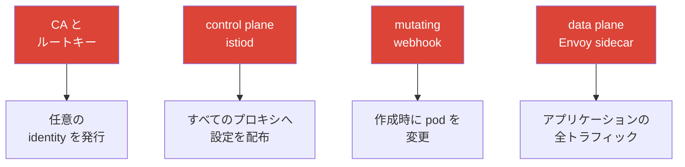

[Русская версия](ru.md) · [Eng version](en.md) · [Versión en español](es.md) · [Version française](fr.md) · [Deutsche Version](de.md) · [ქართული ვერსია](ge.md) · [繁體中文版](tw.md)

# 第31章：mesh のハードニングと脅威モデル

> **次に進む前に。** セキュリティを個別に扱ってきました：mTLS（第13章）、認可
> （第14章）、証明書（第16章）、egress 制御（第12章）。この最終章では、これらすべてを
> 一つの全体像にまとめます。service mesh の攻撃対象領域、control plane と data plane に対する
> 攻撃ベクトル、そして本番環境で Istio を体系的に保護する方法です。

## 31.1. mesh の攻撃対象領域

重要な点は、mesh は防御（mTLS、authz）を追加するだけでなく、**それ自体が攻撃対象領域の
一部になる**ことです。侵害されると危険な新しいコンポーネントが加わります。



保護すべき主要な資産：

- **CA とルートキー**：侵害されると、任意の identity を持つ証明書を発行し、任意の
  サービスになりすますことが可能になります。最も価値の高い資産です。
- **Control plane（istiod）**：すべてのプロキシの設定を管理します。侵害されると、mesh 全体の
  トラフィックをリダイレクトまたは傍受できます。
- **Data plane（Envoy）**：すべてのトラフィックを運びます。pod の侵害または sidecar の迂回により、
  データへアクセスされます。
- **Admission webhook**：作成時に pod を変更します。強力な影響点です。

## 31.2. control plane に対する攻撃ベクトル

- **CA キーの侵害。** ルートキーを所有する者は、すべての identity を支配します。
  防御策：ルートを offline/HSM に置くカスタム CA、発行用の中間 CA、ローテーション（第16章）。
- **Istio リソースへの過剰な権限。** `VirtualService`、`EnvoyFilter`、または
  `AuthorizationPolicy` を作成できる者は、トラフィックをリダイレクトしたり、data plane に
  任意のロジックを挿入したりできます。`EnvoyFilter` は特に危険です。Envoy の内部への
  「ドライバー」のようなものです（第21章）。防御策：これらの CRD に対する厳格な Kubernetes RBAC、
  レビュー、OPA Gatekeeper による制限（第30章）。
- **istiod / xDS へのアクセス。** xDS チャネルは mTLS で保護されていますが、istiod 自体への
  アクセス（pod、ポート、Kubernetes API）は制限すべきです。そうしなければ設定配布に影響を
  与えられます。
- **Kubernetes API へのアクセス = mesh へのアクセス。** API 経由で Istio CRD を変更できる者は、
  mesh を管理できます。防御策：通常の Kubernetes RBAC 衛生です（CKA で学んだ内容です）。

実務における「Istio CRD への厳格な RBAC」とは、アプリケーションチームには **安全なものに限る**
ルーティングリソースのロールを与え、強力な `EnvoyFilter`/`Sidecar`/`WorkloadEntry` は
platform チームに残すことです：

```yaml
apiVersion: rbac.authorization.k8s.io/v1
kind: Role
metadata:
  name: istio-app-config
  namespace: team-a
rules:
# アプリケーションチームには - 自 namespace のルーティングとポリシーのみ
- apiGroups: ["networking.istio.io"]
  resources: ["virtualservices", "destinationrules", "gateways"]
  verbs: ["get", "list", "watch", "create", "update", "patch", "delete"]
- apiGroups: ["security.istio.io"]
  resources: ["authorizationpolicies", "requestauthentications"]
  verbs: ["get", "list", "watch", "create", "update", "patch", "delete"]
# EnvoyFilter、Sidecar、WorkloadEntry はここに含まれない -
# これらは platform チームの別ロールが管理する (レビュー/GitOps 経由)
```

RBAC には「拒否」の機能がありません。動作原則は「列挙されたものだけを許可」です。
そのため `EnvoyFilter` はアプリケーションのロールに含めません。リストにないため、チームは
自分の namespace でこれを作成できません。

## 31.3. data plane に対する攻撃ベクトル

- **sidecar の迂回。** トラフィックが Envoy を通らない場合（`NET_ADMIN` を持つアプリケーション、
  pod IP への直接アクセス、privileged container）、Istio ポリシーは適用されません。
  防御策：**独立した防御境界としての NetworkPolicy**（第14章）。これはカーネル内にあり、pod から
  迂回できません。privileged init container の代わりに `istio-cni`（第27章）、pod から sidecar を
  完全に取り除く ambient（第22章）もあります。
- **侵害された workload が自身の identity を使用する。** 侵害されたサービスは、自身の有効な
  mTLS 証明書を使ってアクセスします。防御策：**AuthorizationPolicy における least privilege**
  （第14章）。影響範囲を抑えるため、各サービスには必要なものだけを許可します。
- **外部へのデータ流出。** 侵害された pod が外部アドレスへデータを流出させようとします。
  防御策：egress 制御、すなわち `REGISTRY_ONLY` と egress gateway（第12章）。
- **公開された Envoy 管理インターフェース。** Envoy の管理ポート（15000）は pod の外部から
  アクセス可能にすべきではありません。防御策：外部に公開しないことです。

> **Ambient は単に「sidecar をなくす」のではなく、脅威モデルを変えます。** Ambient（第22章）は
> 確かに Envoy をアプリケーション pod から取り除きます（分離の向上）。しかし L4 トラフィックとキーは
> 現在 **ztunnel（ノードごとに一つ）**が扱います。ztunnel は**そのノード上のすべての pod**の
> mTLS キーを保持するため、ノード/ztunnel の侵害は、sidecar モードで一つの sidecar が侵害される
> 場合より危険です（§13.11 および第22章を参照）。結論：ambient は「無料でより安全」なのではなく、
> 別のトレードオフです。ノードと ztunnel をそれに応じて保護してください。

## 31.4. ハードニングのチェックリスト

防御措置を一つのリストに集約します。これは本質的に、コース全体の security プラクティスを
多層防御として並べた要約です。

**identity と暗号化：**
- [ ] PERMISSIVE からの移行後、mesh 全体で STRICT mTLS - 第13章。
- [ ] カスタム CA、offline/HSM のルート、発行用中間 CA、ローテーション - 第16章。

**認可（least privilege）：**
- [ ] Default-deny `AuthorizationPolicy`、identity/メソッド/パスごとの限定的な許可 -
  第14章。
- [ ] 必要な入口での end-user auth（JWT） - 第15章。

**ネットワーク（defense in depth）：**
- [ ] 独立した防御境界としての NetworkPolicy（sidecar の迂回） - 第14章。
- [ ] egress 制御：`REGISTRY_ONLY` + egress gateway - 第12章。

**Control plane と権限：**
- [ ] Istio CRD、特に `EnvoyFilter` に対する厳格な RBAC。変更をレビューする。
- [ ] OPA Gatekeeper：危険な設定（DISABLE mTLS、広すぎるポリシー）の禁止 - 第30章。
- [ ] istiod と Kubernetes API へのアクセスを制限する。

**Data plane とノード：**
- [ ] privileged init container の代わりに `istio-cni` - 第27章。
- [ ] Envoy の管理ポート（15000）を外部公開していない。
- [ ] アプリケーション pod から sidecar を除去するため ambient を検討する - 第22章。

**更新と supply chain：**
- [ ] Istio を適時に（CVE に対応して）、canary/リビジョン経由で更新する - 第3章。
- [ ] Wasm モジュールは信頼できるレジストリからのみ使用し、バージョンを pin して検証する - 第21章。

## 31.5. 検証ツール：問題リストを取得する方法

CKS 試験では、クラスターをスキャナー（kube-bench、kubesec、trivy、kube-hunter）で実行して、
すぐに使える問題リストを得ることに慣れています。Istio にも、設定エラーや弱点を検出する
類似のツール群があります。

正直に言うと、mesh の CIS レポートを出力する kube-bench 級の単一の「istio-bench」はありません。
実務では、以下を組み合わせて使用します：

- **`istioctl analyze`**：主要な静的アナライザー（第24章）。インジェクションの欠如、壊れた参照、
  競合するポリシーなど、security に関連するものを含む設定エラーと警告を検出します。まずこれから
  始めます。

  ```bash
  istioctl analyze -A          # クラスター全体
  ```

- **`istioctl experimental precheck`**：インストール/更新前のクラスター検査（互換性、潜在的な問題）。
- **`istioctl proxy-status` / `proxy-config`**：runtime 状態。設定が届いたか、Envoy 内に実際に何が
  あるかを確認します（調査向け、第24章）。
- **Kiali（Validations タブ）**：設定の問題、mTLS の断絶、過度に広いまたは無意味なポリシーを
  強調表示します。mesh の視覚的な「問題リスト」です。
- **audit モードの OPA Gatekeeper**：ポリシーを導入している場合（第30章）、audit モードは**既存の**
  リソースを走査して違反リストを出します。これは自分のルールへの準拠を検査するスキャンです。
- **汎用 k8s スキャナー**（kubescape、trivy misconfig、Checkov）：クラスター全体のハードニングを
  検査し、部分的に Istio リソースも対象にします。Istio の完全で詳細な検査はできませんが、全般的な
  衛生の一部として有用です（CKS で使うのと同じツールでもあります）。

実践的な方法は、設定には `istioctl analyze`、視覚的な全体像には Kiali、ポリシーへの準拠には
Gatekeeper audit、そしてノードとクラスターのハードニングには汎用 k8s スキャナーを使うことです。
これらを組み合わせることで、修正に取り組むためのまさにその「問題リスト」が得られます。

## 31.6. 自動化：ハードニングを必須にする

合意だけでは不十分です。大規模なクラスターでは、誰かが必ず安全でないものをデプロイします。
そのため主要なルールを**自動化**します：

- **admission control としての OPA Gatekeeper**（第30章）：ルールに違反するリソースを作成させません
  （インジェクションなし、`PeerAuthentication: DISABLE`、広すぎる `AuthorizationPolicy`、
  承認なしの `EnvoyFilter`）。
- **すべての Istio 設定に対する GitOps とレビュー**：変更は手作業で適用されず、検査を通過します。
- **疑わしい事象の監視とアラート**：認可拒否（403）の急増、予期しない egress、重要なポリシーの変更。

要点は、このコースの security best practices を希望事項ではなく、**検証可能で必須の**ルールへ
変換することです。

## 31.7. EKS/AWS でのハードニング

EKS では、mesh の脅威モデルにクラウド固有の防御境界が加わります。これらは Istio 自体の外で
対処します。

- **IMDSv2 は必須です。** 侵害された pod は SSRF または制御されていない egress を通じて、
  ノード/ロールの認証情報を盗むためにメタデータエンドポイント `169.254.169.254` にアクセスします。
  pod がインスタンスのメタデータを取得できないよう、**IMDSv2**（トークン + hop limit = 1）を
  要求してください。これは第12章の egress 制御および第27章のメタデータ傍受を補完します。
- **IRSA / Pod Identity における least privilege。** コントローラー（LB Controller、external-dns、
  cert-manager）には狭い IAM ポリシーを与え、その pod が侵害されても AWS で広範な権限を得ないように
  します。すべての pod が使用するような過剰な instance role をノードに付与しないでください。
- **ノード上の runtime 検知。** Amazon **GuardDuty EKS Runtime Monitoring**（および/または独自の
  runtime agent）は、ノード上の疑わしい活動を検出します。mesh ポリシーから独立した防御境界です。
  sidecar が迂回されても、OS レベルで異常を検知します。
- **信頼のルートの保護。** CA キーはクラスターの Secret ではなく、**ACM PCA** または **KMS/HSM**
  （第16章）に置きます。アクセスは狭い IAM ポリシーで制限します。
- **境界とネットワーク。** 入力時の L7 フィルタリングには ALB 上の **AWS WAF**（第20章）を使用します。
  istiod の security groups（ポート `15012`/`15017`/`15000`）を不要なアクセスから閉じ、
  **KMS** によりクラスター Secret を暗号化します（envelope encryption）。

## 31.8. 章のまとめ

- Mesh は保護するだけでなく、**攻撃対象領域**も追加します：CA、control plane、data plane、
  admission webhook。
- **Control plane**：主なリスクは CA キーの侵害と Istio CRD（特に `EnvoyFilter`）への過剰な権限です。
  防御策は offline ルート、RBAC、OPA Gatekeeper です。
- **Data plane**：リスクは sidecar の迂回、侵害された pod の identity の悪用、データ流出です。
  防御策は NetworkPolicy、least-privilege authz、egress 制御、istio-cni、ambient です。Istio CRD に
  対する厳格な RBAC では、`EnvoyFilter`/`Sidecar` は platform チームだけが扱います（RBAC は列挙された
  ものだけを許可します）。
- **Ambient** は「無料でより安全」ではありません。ノード上の ztunnel がそのすべての pod のキーを保持する
  ため、脅威モデルが変わります（ノード侵害はより危険です）。
- ハードニングは**多層防御**です：mTLS + 認可 + ネットワーク + egress 制御 + 権限の制限 + 更新 +
  supply chain。
- 主要なルールは合意事項として維持するのではなく、**自動化**する必要があります（OPA Gatekeeper、
  GitOps、アラート）。
- 問題リストは、`istioctl analyze`、`istioctl x precheck`、Kiali validations、OPA Gatekeeper audit、
  汎用 k8s スキャナー（kubescape/trivy）で取得します。単一の「istio-bench」はないため、組み合わせて
  使用します。
- EKS では、クラウドの防御境界がモデルを補完します：IMDSv2、least-privilege IRSA/Pod Identity、
  GuardDuty runtime、ACM PCA/KMS 内の CA、edge の WAF、閉じた istiod security groups。

## 31.9. 自己確認のための質問

1. mesh の導入により、保護すべきどのような新しい資産が生まれますか？
2. CA キーの侵害が最も危険なシナリオである理由は何ですか？
3. `EnvoyFilter` への過剰な権限はなぜ危険で、どのように制限できますか？
4. sidecar の迂回とは何で、それから保護する対策は何ですか？
5. least-privilege 認可は、侵害された pod による被害をどのように制限しますか？
6. RBAC には「拒否」の機能がない場合、RBAC を介した `EnvoyFilter` の作成をどのように制限しますか？
7. ambient はなぜ単に「sidecar をなくす」のではなく、脅威モデルを変えるのですか？
8. ハードニングを自動化する理由と、使用するツールは何ですか？
9. Istio の問題リスト（CKS のスキャナーの類似物）を得るにはどのツールを使い、なぜ組み合わせて使うのですか？
10. EKS で mesh のハードニングに追加されるクラウドの防御境界は何ですか（IMDSv2、IRSA、GuardDuty、KMS）？

## 演習

実際にハードニングを練習してください：STRICT mTLS と default-deny、egress 制御、Istio CRD の
権限制限、OPA Gatekeeper ポリシー、および sidecar の迂回に対する耐性（NetworkPolicy）。

🧪 ラボ34：[tasks/ica/labs/34](../../labs/34/README_JP.MD)

---
[目次](../README_JP.md) · [第30章](../30/jp.md) · [第32章](../32/jp.md)
