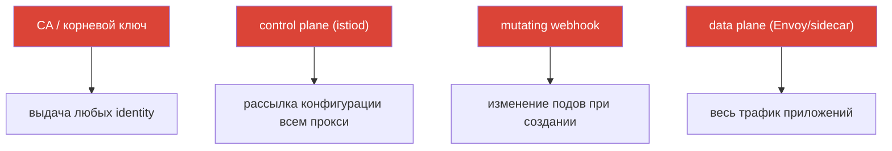

# Глава 31. Харденинг и модель угроз mesh

> **Что дальше.** Мы разбирали безопасность по частям: mTLS (глава 13), авторизацию
> (14), сертификаты (16), контроль egress (12). Эта завершающая глава собирает всё в
> единую картину: какова поверхность атаки service mesh, какие есть векторы атак на
> control и data plane, и как системно закрыть их - харденинг Istio в проде.

## 31.1. Поверхность атаки mesh

Важно понимать: mesh не только добавляет защиту (mTLS, authz), но и **сам становится
частью поверхности атаки**. Появляются новые компоненты, компрометация которых опасна.



Ключевые активы, которые надо защищать:

- **CA и корневой ключ** - компрометация = возможность выпустить сертификат с любой
  identity и выдать себя за любой сервис. Самый ценный актив.
- **Control plane (istiod)** - управляет конфигурацией всех прокси; компрометация =
  возможность перенаправить или перехватить трафик всего mesh.
- **Data plane (Envoy)** - несёт весь трафик; компрометация пода или обход sidecar даёт
  доступ к данным.
- **Admission webhook** - меняет поды при создании; мощная точка влияния.

## 31.2. Векторы атак на control plane

- **Компрометация CA-ключа.** Кто владеет корневым ключом - владеет всеми identity.
  Защита: кастомный CA с корнем offline/HSM, промежуточные для выдачи, ротация (глава 16).
- **Избыточные права на Istio-ресурсы.** Тот, кто может создавать `VirtualService`,
  `EnvoyFilter` или `AuthorizationPolicy`, может перенаправить трафик или вставить
  произвольную логику в data plane. `EnvoyFilter` особенно опасен - это «отвёртка во
  внутренности» Envoy (глава 21). Защита: строгий Kubernetes RBAC на эти CRD, ревью,
  ограничение через OPA Gatekeeper (глава 30).
- **Доступ к istiod / xDS.** Каналы xDS защищены mTLS, но доступ к самому istiod
  (под, порты, Kubernetes API) должен быть ограничен - иначе можно влиять на рассылку
  конфигурации.
- **Доступ к Kubernetes API = доступ к mesh.** Кто может менять Istio-CRD через API,
  управляет mesh. Защита: это обычная гигиена Kubernetes RBAC (вы её знаете по CKA).

## 31.3. Векторы атак на data plane

- **Обход sidecar.** Если трафик минует Envoy (приложение с `NET_ADMIN`, прямое
  обращение по IP пода, привилегированный контейнер), политики Istio не применяются.
  Защита: **NetworkPolicy как независимый рубеж** (глава 14) - она в ядре, её из пода не
  обойти; `istio-cni` вместо привилегированных init-контейнеров (глава 27); ambient
  убирает sidecar из пода вовсе (глава 22).
- **Скомпрометированный workload использует свою identity.** Взломанный сервис ходит со
  своим валидным mTLS-сертификатом. Защита: **least privilege в AuthorizationPolicy**
  (глава 14) - каждому только то, что нужно, чтобы ограничить радиус поражения.
- **Эксфильтрация данных наружу.** Скомпрометированный под пытается слить данные во
  внешний адрес. Защита: контроль egress - `REGISTRY_ONLY` и egress gateway (глава 12).
- **Открытый admin-интерфейс Envoy.** Порт админки Envoy (15000) не должен быть доступен
  извне пода. Защита: не выставлять его наружу.

## 31.4. Чеклист харденинга

Соберём меры защиты в один список - по сути это сводка security-практик всего курса,
выстроенная как защита в глубину.

**Идентичность и шифрование:**
- [ ] STRICT mTLS на весь mesh (после миграции через PERMISSIVE) - глава 13.
- [ ] Кастомный CA, корень offline/HSM, промежуточные для выдачи, ротация - глава 16.

**Авторизация (least privilege):**
- [ ] Default-deny `AuthorizationPolicy`, точечные разрешения по identity/методу/пути -
  глава 14.
- [ ] End-user auth (JWT) на входе, где нужно - глава 15.

**Сеть (defense in depth):**
- [ ] NetworkPolicy как независимый рубеж (обход sidecar) - глава 14.
- [ ] Контроль egress: `REGISTRY_ONLY` + egress gateway - глава 12.

**Control plane и права:**
- [ ] Строгий RBAC на Istio-CRD, особенно `EnvoyFilter`; ревью изменений.
- [ ] OPA Gatekeeper: запрет опасных конфигураций (DISABLE mTLS, широкие политики) -
  глава 30.
- [ ] Ограничен доступ к istiod и Kubernetes API.

**Data plane и ноды:**
- [ ] `istio-cni` вместо привилегированных init-контейнеров - глава 27.
- [ ] Admin-порт Envoy (15000) не выставлен наружу.
- [ ] Рассмотреть ambient, чтобы убрать sidecar из подов приложений - глава 22.

**Обновления и supply chain:**
- [ ] Istio обновляется вовремя (CVE), через canary/ревизии - глава 3.
- [ ] Wasm-модули только из доверенного реестра, с пиннингом версий и проверкой - глава 21.

## 31.5. Инструменты проверки: как получить список проблем

На экзамене CKS вы привыкли прогонять кластер сканерами (kube-bench, kubesec, trivy,
kube-hunter) и получать готовый список проблем. Для Istio есть аналогичный набор
инструментов, которые находят ошибки конфигурации и слабые места.

Честная оговорка: единого «istio-bench» уровня kube-bench, который выдаёт CIS-отчёт по
mesh, нет. На практике используют комбинацию:

- **`istioctl analyze`** - главный статический анализатор (глава 24). Находит ошибки и
  предупреждения конфигурации, в том числе security-релевантные: отсутствие инъекции,
  битые ссылки, конфликтующие политики. С него начинают.

  ```bash
  istioctl analyze -A          # весь кластер
  ```

- **`istioctl experimental precheck`** - проверка кластера перед установкой/обновлением
  (совместимость, потенциальные проблемы).
- **`istioctl proxy-status` / `proxy-config`** - runtime-состояние: доехал ли конфиг,
  что реально в Envoy (для расследования, глава 24).
- **Kiali (вкладка Validations)** - подсвечивает проблемы конфигурации, разрывы mTLS,
  слишком широкие или бесполезные политики - визуальный «список проблем» по mesh.
- **OPA Gatekeeper в режиме audit** - если завели политики (глава 30), audit-режим
  проходит по **уже существующим** ресурсам и выдаёт список нарушений - это и есть скан
  на соответствие вашим правилам.
- **Универсальные сканеры k8s** (kubescape, trivy misconfig, Checkov) - проверяют общий
  харденинг кластера и частично затрагивают Istio-ресурсы. Полноценной глубокой проверки
  Istio они не дают, но полезны как часть общей гигиены (и это те же инструменты, что на
  CKS).

Практический подход: `istioctl analyze` для конфигурации, Kiali для наглядной картины,
Gatekeeper audit для соответствия политикам, плюс общий k8s-сканер для харденинга нод и
кластера. Вместе они дают тот самый «список проблем», по которому идёт исправление.

## 31.6. Автоматизация: делаем харденинг обязательным

Договорённостей недостаточно - в большом кластере кто-нибудь всё равно задеплоит
небезопасное. Поэтому ключевые правила **автоматизируют**:

- **OPA Gatekeeper** (глава 30) как admission-контроль: не даст создать ресурс,
  нарушающий правила (нет инъекции, `PeerAuthentication: DISABLE`, слишком широкая
  `AuthorizationPolicy`, `EnvoyFilter` без апрува).
- **GitOps и ревью** для всей конфигурации Istio - изменения проходят проверку, а не
  применяются руками.
- **Мониторинг и алерты** на подозрительное: всплески отказов авторизации (403),
  неожиданный egress, изменения в критичных политиках.

Смысл: перевести security best practices из этого курса в **проверяемые и обязательные**
правила, а не в пожелания.

## 31.7. Итоги главы

- Mesh не только защищает, но и добавляет **поверхность атаки**: CA, control plane, data
  plane, admission webhook.
- **Control plane**: главные риски - компрометация CA-ключа и избыточные права на
  Istio-CRD (особенно `EnvoyFilter`); защита - offline-корень, RBAC, OPA Gatekeeper.
- **Data plane**: риски - обход sidecar, злоупотребление identity скомпрометированного
  пода, эксфильтрация; защита - NetworkPolicy, least-privilege authz, контроль egress,
  istio-cni, ambient.
- Харденинг это **защита в глубину**: mTLS + авторизация + сеть + контроль egress +
  ограничение прав + обновления + supply chain.
- Ключевые правила нужно **автоматизировать** (OPA Gatekeeper, GitOps, алерты), а не
  держать как договорённости.
- Список проблем получают сканерами: `istioctl analyze`, `istioctl x precheck`, Kiali
  validations, OPA Gatekeeper audit и общие k8s-сканеры (kubescape/trivy) - единого
  «istio-bench» нет, используют комбинацию.

## 31.8. Вопросы для самопроверки

1. Какие новые активы для защиты появляются с внедрением mesh?
2. Почему компрометация CA-ключа - самый опасный сценарий?
3. Чем опасны избыточные права на `EnvoyFilter` и как это ограничить?
4. Что такое обход sidecar и какие меры защищают от него?
5. Как least-privilege авторизация ограничивает ущерб от скомпрометированного пода?
6. Зачем автоматизировать харденинг и какими инструментами?
7. Какими инструментами получить список проблем Istio (аналог сканеров с CKS) и почему
   используют их комбинацию?

## Практика

Отдельная лаба по харденингу **планируется**: включение STRICT mTLS и default-deny,
контроль egress, ограничение прав на Istio-CRD, политики OPA Gatekeeper, проверка
устойчивости к обходу sidecar.

🧪 Лаба: **TODO**.

---
[Оглавление](../README.md) · [Глава 30](../30/ru.md) · [Глава 32](../32/ru.md)
