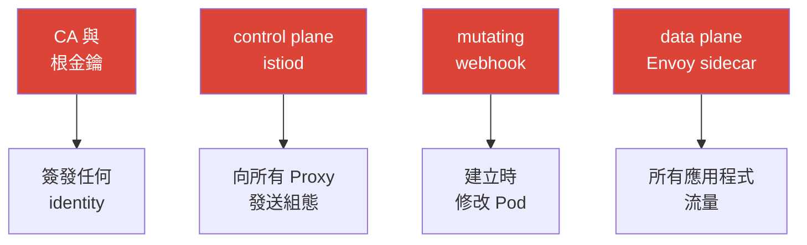

[Русская версия](ru.md) · [Eng version](en.md) · [Versión en español](es.md) · [Version française](fr.md) · [Deutsche Version](de.md) · [ქართული ვერსია](ge.md) · [日本語版](jp.md)

# 第 31 章。mesh 強化與威脅模型

> **接下來。** 我們先前分別討論了安全性：mTLS（第 13 章）、授權
> （14）、憑證（16）、egress 控制（12）。本章作為最終章節，將其整合為
> 一個完整圖像：service mesh 的攻擊面為何、control 與 data plane 有哪些攻擊向量，
> 以及如何系統性地補強--在生產環境中強化 Istio。

## 31.1. mesh 的攻擊面

重要的是要理解：mesh 不只增加防護（mTLS、authz），它**本身也成為
攻擊面的一部分**。因此出現了新的元件，遭到入侵將造成危險。



必須保護的關鍵資產：

- **CA 與根金鑰**--遭到入侵 = 可簽發帶有任何 identity 的憑證，並冒充任何服務。
  這是最有價值的資產。
- **Control plane（istiod）**--管理所有 Proxy 的組態；遭到入侵 =
  可重新導向或攔截整個 mesh 的流量。
- **Data plane（Envoy）**--承載所有流量；Pod 遭入侵或繞過 sidecar，即可
  存取資料。
- **Admission webhook**--建立時修改 Pod；是一個強大的影響點。

## 31.2. control plane 的攻擊向量

- **CA 金鑰遭入侵。** 掌握根金鑰者，就掌握所有 identity。
  防護：使用根憑證位於 offline/HSM 的自訂 CA、供簽發用的中繼憑證，以及輪替（第 16 章）。
- **Istio 資源的過度權限。** 能建立 `VirtualService`、
  `EnvoyFilter` 或 `AuthorizationPolicy` 的人，可以重新導向流量，或在 data plane
  插入任意邏輯。`EnvoyFilter` 特別危險--它是深入 Envoy 內部的「螺絲起子」
  （第 21 章）。防護：對這些 CRD 套用嚴格 Kubernetes RBAC、進行審查，並透過 OPA Gatekeeper
  限制（第 30 章）。
- **存取 istiod / xDS。** xDS 通道受 mTLS 保護，但對 istiod 本身的存取
  （Pod、連接埠、Kubernetes API）必須受限--否則便可影響組態的發送。
- **存取 Kubernetes API = 存取 mesh。** 能透過 API 修改 Istio-CRD 的人，
  就能控制 mesh。防護：這就是一般的 Kubernetes RBAC 衛生（您已在 CKA 學過）。

實務上，「對 Istio-CRD 套用嚴格 RBAC」是指給應用程式團隊的角色**僅限於安全的**
路由資源，而將強大的 `EnvoyFilter`/`Sidecar`/`WorkloadEntry`
留給 platform 團隊：

```yaml
apiVersion: rbac.authorization.k8s.io/v1
kind: Role
metadata:
  name: istio-app-config
  namespace: team-a
rules:
# 應用程式團隊 - 僅限其 namespace 的路由與政策
- apiGroups: ["networking.istio.io"]
  resources: ["virtualservices", "destinationrules", "gateways"]
  verbs: ["get", "list", "watch", "create", "update", "patch", "delete"]
- apiGroups: ["security.istio.io"]
  resources: ["authorizationpolicies", "requestauthentications"]
  verbs: ["get", "list", "watch", "create", "update", "patch", "delete"]
# EnvoyFilter、Sidecar、WorkloadEntry 不包含在此 -
# 由 platform 團隊的獨立角色管理（透過審查/GitOps）
```

RBAC 無法「拒絕」--它遵循「只允許列出的項目」原則。
因此，`EnvoyFilter` 根本不會納入應用程式角色：既然清單中沒有它，
團隊就無法在自己的 namespace 建立它。

## 31.3. data plane 的攻擊向量

- **繞過 sidecar。** 若流量略過 Envoy（具有 `NET_ADMIN` 的應用程式、直接
  呼叫 Pod IP、特權容器），Istio 策略便不會套用。
  防護：**NetworkPolicy 作為獨立防線**（第 14 章）--它位於核心中，無法從 Pod 內繞過；
  使用 `istio-cni` 取代特權 init 容器（第 27 章）；ambient 則完全將 sidecar 自 Pod 移除（第 22 章）。
- **已遭入侵的 workload 使用自己的 identity。** 遭入侵的服務使用其有效的
  mTLS 憑證呼叫其他服務。防護：在 `AuthorizationPolicy` 中採取**最小權限**
  （第 14 章）--只授予每個服務所需權限，以限制影響範圍。
- **資料外洩至外部。** 遭入侵的 Pod 嘗試將資料傳送到外部位址。
  防護：egress 控制--`REGISTRY_ONLY` 與 egress gateway（第 12 章）。
- **開放的 Envoy 管理介面。** Envoy 管理連接埠（15000）不應從 Pod 外部存取。
  防護：不要將其對外暴露。

> **Ambient 改變威脅模型，而不只是「移除 sidecar」。** Ambient（第 22 章）
> 確實將 Envoy 從應用程式 Pod 移除（有助於隔離），但現在 L4 流量與金鑰改由
> **ztunnel--每個節點一個**處理。它持有**該節點所有 Pod**的 mTLS 金鑰，
> 因此節點／ztunnel 遭入侵比 sidecar 模式中單一 sidecar 遭入侵更危險
> （見 §13.11 與第 22 章）。結論是：ambient 並非「免費地更安全」，而是另一種
> 取捨；應相應保護節點與 ztunnel。

## 31.4. 強化檢查清單

讓我們將防護措施整理成一份清單--本質上是整個課程安全實務的摘要，
以縱深防禦的方式編排。

**身分與加密：**
- [ ] 對整個 mesh 採用 STRICT mTLS（經由 PERMISSIVE 遷移後）--第 13 章。
- [ ] 自訂 CA、根憑證位於 offline/HSM、供簽發用的中繼憑證、輪替--第 16 章。

**授權（最小權限）：**
- [ ] 預設拒絕的 `AuthorizationPolicy`，依 identity／方法／路徑精準允許--
  第 14 章。
- [ ] 在需要的入口採用終端使用者 auth（JWT）--第 15 章。

**網路（縱深防禦）：**
- [ ] NetworkPolicy 作為獨立防線（繞過 sidecar）--第 14 章。
- [ ] Egress 控制：`REGISTRY_ONLY` + egress gateway--第 12 章。

**Control plane 與權限：**
- [ ] 對 Istio-CRD 套用嚴格 RBAC，尤其是 `EnvoyFilter`；審查變更。
- [ ] OPA Gatekeeper：禁止危險組態（DISABLE mTLS、過寬策略）--
  第 30 章。
- [ ] 限制對 istiod 與 Kubernetes API 的存取。

**Data plane 與節點：**
- [ ] 使用 `istio-cni` 取代特權 init 容器--第 27 章。
- [ ] Envoy 管理連接埠（15000）未對外暴露。
- [ ] 考慮 ambient，將 sidecar 自應用程式 Pod 移除--第 22 章。

**更新與 supply chain：**
- [ ] 及時更新 Istio（CVE），透過 canary／revision--第 3 章。
- [ ] Wasm 模組僅來自信任的 registry，並有版本釘選與驗證--第 21 章。

## 31.5. 驗證工具：如何取得問題清單

在 CKS 考試中，您習慣透過掃描器（kube-bench、kubesec、trivy、
kube-hunter）掃描叢集並取得現成的問題清單。Istio 也有一組類似工具，
可找出組態錯誤與弱點。

坦白說明：不存在像 kube-bench 一樣，能為 mesh 輸出 CIS 報告的統一「istio-bench」。
實務上使用下列組合：

- **`istioctl analyze`**--主要的靜態分析器（第 24 章）。可找出組態的錯誤與
  警告，包括與安全相關的問題：缺少注入、損壞的參照、衝突的策略。應從它開始。

  ```bash
  istioctl analyze -A          # 整個 cluster
  ```

- **`istioctl experimental precheck`**--安裝／更新前的叢集檢查
  （相容性、潛在問題）。
- **`istioctl proxy-status` / `proxy-config`**--runtime 狀態：組態是否已送達，
  Envoy 實際狀態為何（用於調查，第 24 章）。
- **Kiali（Validations 分頁）**--醒目顯示組態問題、mTLS 中斷、
  過寬或無用的策略--mesh 的視覺化「問題清單」。
- **audit 模式的 OPA Gatekeeper**--若已建立策略（第 30 章），audit 模式會檢查
  **已存在的**資源並輸出違規清單--這就是是否符合您規則的掃描。
- **通用 k8s 掃描器**（kubescape、trivy misconfig、Checkov）--檢查叢集的一般
  強化，並部分涉及 Istio 資源。它們無法提供完整深入的 Istio 檢查，
  但作為整體衛生的一部分仍有用（也是 CKS 使用的同一套工具）。

實務作法：用 `istioctl analyze` 檢查組態，Kiali 提供直觀圖像，
Gatekeeper audit 檢查策略符合性，加上通用 k8s 掃描器強化節點與叢集。
合在一起，它們便提供修正工作所依據的「問題清單」。

## 31.6. 自動化：使強化成為強制要求

光靠約定是不夠的--在大型叢集中，仍會有人部署不安全的內容。
因此，關鍵規則應**自動化**：

- **OPA Gatekeeper**（第 30 章）作為 admission 控制：不允許建立違反規則的資源
  （無注入、`PeerAuthentication: DISABLE`、過寬的
  `AuthorizationPolicy`、未經核准的 `EnvoyFilter`）。
- 對所有 Istio 組態採用 **GitOps 與審查**--變更須經檢查，而非手動套用。
- 對可疑情況進行**監控與告警**：授權拒絕激增（403）、
  非預期的 egress、關鍵策略的變更。

重點是將本課程的 security best practices 轉化為**可驗證且強制執行的**
規則，而非僅是期望。

## 31.7. EKS/AWS 上的強化

在 EKS 上，mesh 的威脅模型由雲端特有的防線補充--它們在 Istio 本身之外處理。

- **必須使用 IMDSv2。** 遭入侵的 Pod 會透過 SSRF 或不受控的 egress
  連往 metadata endpoint `169.254.169.254`，以竊取節點／角色憑證。
  強制使用 **IMDSv2**（token + hop limit = 1），使 Pod 無法取得 instance metadata。
  這補充第 12 章的 egress 控制與第 27 章的 metadata 攔截。
- **IRSA / Pod Identity 中的最小權限。** 對 controller（LB
  Controller、external-dns、cert-manager）採用範圍狹窄的 IAM policy--
  如此該 Pod 遭入侵不會授予廣泛 AWS 權限。不要將所有 Pod 都使用的龐大
  instance role 掛在節點上。
- **節點上的 runtime 偵測。** Amazon **GuardDuty EKS Runtime Monitoring**（及／或
  自行的 runtime agent）可偵測節點上的可疑活動--這是 mesh 策略以外的獨立防線：
  若 sidecar 被繞過，仍會在 OS 層級發現異常。
- **保護信任根。** 將 CA 金鑰置於 **ACM PCA** 或 **KMS/HSM**（第 16 章），
  而非叢集 Secret；透過範圍狹窄的 IAM policy 控制存取。
- **周界與網路。** 在 ALB 上使用 **AWS WAF** 進行入口 L7 過濾（第 20 章）；
  istiod 的 security group（連接埠 `15012`/`15017`/`15000`）應避免額外開放；
  透過 **KMS** 加密叢集 Secret（envelope encryption）。

## 31.8. 本章總結

- Mesh 不只提供防護，也增加了**攻擊面**：CA、control plane、data
  plane、admission webhook。
- **Control plane**：主要風險是 CA 金鑰遭入侵與 Istio-CRD 的過度權限
  （尤其 `EnvoyFilter`）；防護為 offline 根憑證、RBAC、OPA Gatekeeper。
- **Data plane**：風險包括繞過 sidecar、濫用已入侵 Pod 的 identity、資料外洩；
  防護為 NetworkPolicy、最小權限 authz、egress 控制、istio-cni、ambient。
  對 Istio-CRD 套用嚴格 RBAC：`EnvoyFilter`/`Sidecar` 僅限 platform 團隊
  （RBAC 只允許明列項目）。
- **Ambient** 並非「免費地更安全」：節點上的 ztunnel 持有該節點全部 Pod 的金鑰，
  因此威脅模型改變（節點遭入侵更危險）。
- 強化是**縱深防禦**：mTLS + 授權 + 網路 + egress 控制 +
  權限限制 + 更新 + supply chain。
- 關鍵規則必須**自動化**（OPA Gatekeeper、GitOps、告警），而不能僅停留在約定。
- 透過掃描器取得問題清單：`istioctl analyze`、`istioctl x precheck`、Kiali
  validations、OPA Gatekeeper audit 與通用 k8s 掃描器（kubescape/trivy）--
  沒有統一的「istio-bench」，而是採用組合。
- 在 EKS 上，此模型由雲端防線補充：IMDSv2、最小權限 IRSA/Pod Identity、
  GuardDuty runtime、位於 ACM PCA/KMS 的 CA、edge 的 WAF、關閉多餘存取的 istiod security groups。

## 31.9. 自我檢查問題

1. 導入 mesh 後，出現哪些需要保護的新資產？
2. 為何 CA 金鑰遭入侵是最危險的情境？
3. `EnvoyFilter` 的過度權限有何危險，以及如何限制？
4. 什麼是繞過 sidecar，哪些措施可防護？
5. 最小權限授權如何限制已遭入侵 Pod 的損害？
6. 若 RBAC 無法「拒絕」，如何透過 RBAC 限制建立 `EnvoyFilter`？
7. 為何 ambient 改變威脅模型，而不只是「移除 sidecar」？
8. 為何要自動化強化，以及使用哪些工具？
9. 可使用哪些工具取得 Istio 問題清單（CKS 掃描器的對應工具），為何要組合使用？
10. 哪些雲端防線可在 EKS 上補強 mesh（IMDSv2、IRSA、GuardDuty、KMS）？

## 實作

實際演練強化：STRICT mTLS 與預設拒絕、egress 控制、限制 Istio-CRD 權限、
OPA Gatekeeper 策略，以及對繞過 sidecar 的韌性（NetworkPolicy）。

🧪 實驗 34：[tasks/ica/labs/34](../../labs/34/README_TW.MD)

---
[目錄](../README_TW.md) · [第 30 章](../30/tw.md) · [第 32 章](../32/tw.md)
