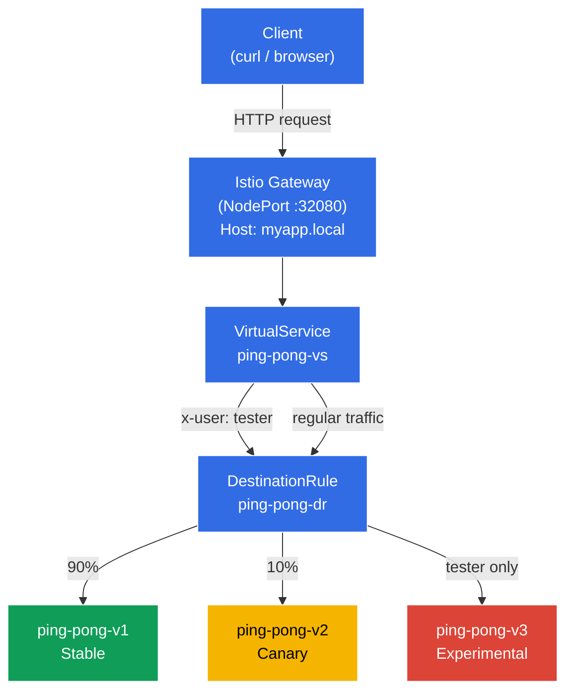

# Dark Launch

The dev team has rolled out a brand-new, experimental version of the application — v3. It's still rough around the edges, and regular users should never see it (they must stay on the stable v1). However, you need to give QA engineers access so they can test it against real production-like traffic. Testers will identify themselves using a special HTTP header: `x-user: tester`.

## Objective

Set up Istio routing rules (`DestinationRule` and `VirtualService`) from scratch so that the Envoy sidecar proxies intercept traffic, inspect HTTP headers, and route requests based on their content.

A Gateway has been created at: http://myapp.local:32080

### How It Works (High-Level Overview)



## Step 1. Enable Sidecar Injection

Label the `default` namespace so that Istio automatically injects the Envoy sidecar proxy into every new pod:

```bash
kubectl label namespace default istio-injection=enabled
```

**What this does:** Istio uses the sidecar pattern. When a namespace carries the `istio-injection=enabled` label, Istio's admission webhook automatically adds an extra container — `istio-proxy` (Envoy) — to every pod created in that namespace. This proxy intercepts all inbound and outbound network traffic for the pod, allowing Istio to manage routing, security, and observability without any changes to your application code.

This is why you'll see `2/2` in the `READY` column — one container for the application itself and one for the Envoy sidecar.

## Step 2. Deploy the Application

Deploy the application in three versions. A shared Kubernetes Service named `ping-pong` is created.

```bash
kubectl apply -f https://raw.githubusercontent.com/ViktorUJ/cks/refs/heads/AG-134/tasks/ica/labs/02/k8s-1/scripts/1.yaml
```

**What gets deployed:**
- **Service `ping-pong`** — a single shared Service with the selector `app: ping-pong`. It covers all three versions of the pods. Istio will use a `DestinationRule` to split traffic between them.
- **Deployment `ping-pong-v1`** — the stable release (label `version: v1`), env var `SERVER_NAME: "Ping-Pong-V1 (Stable)"`.
- **Deployment `ping-pong-v2`** — the canary release (label `version: v2`), `SERVER_NAME: "Ping-Pong-V2 (Canary)"`.
- **Deployment `ping-pong-v3`** — the experimental release (label `version: v3`), `SERVER_NAME: "Ping-Pong-V3 (Experimental)"`.

All three Deployments use the same Docker image `viktoruj/ping_pong:latest` but differ in the `version` label and the `SERVER_NAME` environment variable. The `version` label is the key piece here — it's what the `DestinationRule` uses to group pods into subsets.

Verify that the pods are up and running with the Envoy sidecar:

```bash
kubectl get pods
```

```
NAME                            READY   STATUS    RESTARTS   AGE
ping-pong-v1-77cfd77f88-jk6wq   2/2     Running   0          29m
ping-pong-v2-685bbbd94f-brptj   2/2     Running   0          29m
ping-pong-v3-8448447987-bn6s8   2/2     Running   0          29m
```

**What to look for:** the `READY` column shows `2/2`. This means each pod is running two containers: the application itself and the Envoy sidecar (`istio-proxy`). If you see `1/1`, injection didn't work — make sure the `istio-injection=enabled` label is set on the namespace and that the pods were recreated after labeling.

## Step 3. Create the DestinationRule

```bash
vim dl-destination-rule.yaml
```

```yaml
apiVersion: networking.istio.io/v1
kind: DestinationRule
metadata:
  name: ping-pong-dr
spec:
  host: ping-pong # Points to the shared K8s Service
  subsets:
  - name: v1
    labels:
      version: v1 # Selects pods with the label version=v1
  - name: v2
    labels:
      version: v2
  - name: v3
    labels:
      version: v3
```

```bash
kubectl apply -f dl-destination-rule.yaml
```

**What is a DestinationRule and why do you need it:**

A `DestinationRule` is an Istio resource that defines traffic policies for a specific service (specified in the `host` field). Its main job here is to define **subsets**.

- **`host: ping-pong`** — binds this rule to the Kubernetes Service `ping-pong`. All policies in this `DestinationRule` apply to traffic headed for that service.
- **`subsets`** — logical groups of pods within a single service. Each subset is defined by a set of labels. For example, subset `v1` includes every pod with the label `version: v1`.

Without a `DestinationRule`, Istio has no way to tell pods of the same service apart. The `VirtualService` references these subsets when making routing decisions — for example, "send 90% of traffic to subset v1."

## Step 4. Create the VirtualService with Routing Rules

```bash
vim vs-virtual-service.yaml
```

```yaml
apiVersion: networking.istio.io/v1
kind: VirtualService
metadata:
  name: ping-pong-vs
spec:
  hosts:
  - "ping-pong"       # 1. For in-cluster traffic (mesh)
  - "myapp.local"     # 2. For external traffic (gateway)
  gateways:
  - ping-pong-gateway # Applies to myapp.local
  - mesh              # Applies to ping-pong
  http:
  # RULE #1: Fires ONLY when the x-user: tester header is present
  - match:
    - headers:
        x-user:
          exact: tester
    route:
    - destination:
        host: ping-pong
        subset: v3

  # RULE #2: Default rule for everyone else (Canary 90/10)
  - route:
    - destination:
        host: ping-pong
        subset: v1
      weight: 90
    - destination:
        host: ping-pong
        subset: v2
      weight: 10
```

```bash
kubectl apply -f vs-virtual-service.yaml
```

**Breaking down the VirtualService:**

A `VirtualService` is Istio's core routing resource. It defines exactly how traffic is distributed across subsets.

- **`hosts`** — the list of hostnames these rules apply to:
  - `"ping-pong"` — the Kubernetes Service name. Rules will apply to in-cluster traffic (when one pod calls another via `http://ping-pong:8080`).
  - `"myapp.local"` — the external hostname. Rules will apply to traffic arriving through the Gateway.

- **`gateways`** — specifies where the traffic comes from:
  - `ping-pong-gateway` — traffic from outside the cluster, via the Istio Ingress Gateway.
  - `mesh` — a reserved keyword in Istio that represents all in-cluster (pod-to-pod) traffic. If you omit `mesh`, the rules will only apply to external traffic coming through the Gateway.

- **`http` rules** — evaluated top to bottom; the first match wins:
  - **Rule #1 (Dark Launch):** If the HTTP request contains the header `x-user` with the value `tester`, all traffic goes to subset `v3` (the experimental version). This is the "dark launch" — regular users have no idea v3 exists, while testers can exercise it against real production traffic.
  - **Rule #2 (Canary Deployment):** All other requests (without the `x-user: tester` header) are split: 90% to `v1` (stable) and 10% to `v2` (canary). This lets you gradually validate v2 with a small slice of real traffic.

## Step 5. Create the Gateway for External Access

```bash
vim gateway.yaml
```

```yaml
apiVersion: networking.istio.io/v1
kind: Gateway
metadata:
  name: ping-pong-gateway
spec:
  selector:
    istio: ingressgateway # Tells Istio to apply this config to the Ingress Gateway
  servers:
  - port:
      number: 80
      name: http
      protocol: HTTP
    hosts:
    - "myapp.local" # Accept requests for myapp.local; use hosts: ["*"] to accept all hosts
```

**What is a Gateway:**

A `Gateway` is an Istio resource that configures the Envoy proxy sitting at the edge of the mesh (the Istio Ingress Gateway) to accept inbound traffic from outside the cluster.

- **`selector: istio: ingressgateway`** — tells Istio which Envoy pod should pick up this configuration. The cluster runs an `istio-ingressgateway` pod (in the `istio-system` namespace) — that's the entry point for external traffic. The selector targets it by label.
- **`servers`** — describes which port and protocol to listen on, and which hosts to accept:
  - `port: 80, protocol: HTTP` — accept HTTP traffic.
  - `hosts: ["myapp.local"]` — the Gateway will only handle requests whose `Host` header is `myapp.local`. Requests for other hosts will be rejected. To accept everything, use `hosts: ["*"]`.

In this lab, the Istio Ingress Gateway is configured as a `NodePort` on port `32080`, so external access goes through `http://myapp.local:32080`.

## Step 6. Testing

### Verify the Canary Deployment (Regular Users)

```bash
for i in {1..10}; do curl -s http://myapp.local:32080 | grep 'Server Name:' ; done
```

```
Server Name: Ping-Pong-V1 (Stable)
Server Name: Ping-Pong-V1 (Stable)
Server Name: Ping-Pong-V2 (Canary)  #  10% of traffic goes to v2
Server Name: Ping-Pong-V1 (Stable)
Server Name: Ping-Pong-V1 (Stable)
Server Name: Ping-Pong-V1 (Stable)
Server Name: Ping-Pong-V1 (Stable)
Server Name: Ping-Pong-V2 (Canary)
Server Name: Ping-Pong-V1 (Stable)
Server Name: Ping-Pong-V1 (Stable)
```

**What we see:** Without any special headers, Rule #2 from the VirtualService kicks in. Roughly 90% of requests land on v1 (Stable) and 10% on v2 (Canary). Version v3 never shows up — it's completely hidden from regular users.

### Verify the Dark Launch (Testers)

Now add the `x-user: tester` header and confirm that every request hits v3:

```bash
curl -s -H "x-user: tester" http://myapp.local:32080/ | grep 'Server Name:'
```

```
Server Name: Ping-Pong-V3 (Experimental)
```

**What we see:** With the `x-user: tester` header, Rule #1 fires — 100% of traffic goes to v3 (Experimental). This is the Dark Launch in action: testers work with the experimental version on a live cluster while regular users have no idea it even exists.
