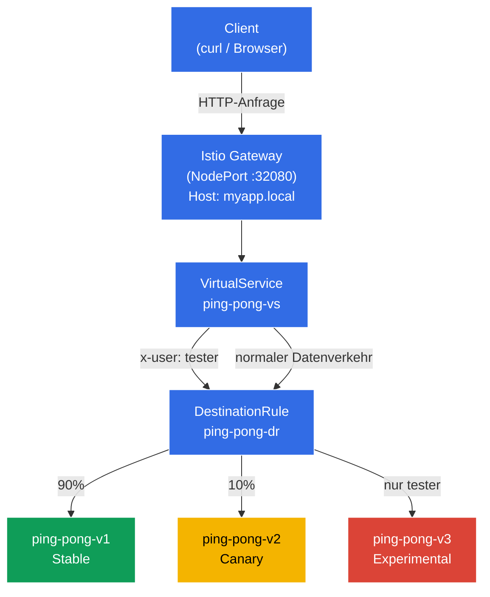

[RU version](README_RU.MD) · [Eng version](README.MD) · [Versión en español](README_ES.MD) · [Version française](README_FR.MD)
# Dark Launch (Schattenstart)

Die Entwickler haben eine völlig neue, experimentelle Version der Anwendung ausgerollt - v3. Sie ist noch unausgereift, und normale Benutzer dürfen sie auf keinen Fall zu sehen bekommen (sie sollen auf der stabilen v1 bleiben). Sie müssen jedoch QA-Ingenieure dorthin lassen, damit sie die Logik auf einem echten "produktiven" Cluster überprüfen können. Die Tester werden mithilfe eines speziellen HTTP-Headers identifiziert: `x-user: tester`.

## Ziel

Von Grund auf Istio-Regeln (`DestinationRule` und `VirtualService`) so konfigurieren, dass der Envoy-Proxy den Datenverkehr abfängt, die HTTP-Header liest und das Routing anhand ihres Inhalts durchführt.

Erstelltes Gateway: http://myapp.local:32080

### Wie es funktioniert (Gesamtschema)



## Infrastruktur

Die Umgebung wird in AWS (`eu-central-1`) über Terragrunt bereitgestellt und besteht aus:

| Komponente  | Beschreibung                                      |
|------------|---------------------------------------------------|
| `vpc`      | VPC `10.10.0.0/16` mit öffentlichen Subnetzen          |
| `ssh-keys` | SSH-Schlüssel für den Zugriff auf die Nodes                      |
| `k8s-1`    | Kubernetes `1.35.2` (kubeadm) mit installiertem Istio |
| `worker`   | Arbeitsmaschine mit `kubectl` und Zugriff auf den Cluster   |

Instanzen: `t3.medium` (master) Ubuntu `22.04`

## Deployment

```bash
TASK=02 make run_ica_task
```

## Schritt 1. Aktivierung der Sidecar-Injektion

Wir fügen dem Namespace `default` ein Label hinzu, um die automatische Injektion des Sidecar-Proxys Envoy zu ermöglichen:

```bash
kubectl label namespace default istio-injection=enabled
```

**Was das bewirkt:** Istio arbeitet nach dem Prinzip des Sidecar-Patterns. Wenn am Namespace das Label `istio-injection=enabled` gesetzt ist, fügt Istio automatisch jedem neuen Pod einen zusätzlichen Container hinzu - `istio-proxy` (Envoy). Dieser Proxy fängt den gesamten ein- und ausgehenden Netzwerkverkehr des Pods ab, wodurch Istio Routing, Sicherheit und Observability ohne Änderung des Anwendungscodes verwalten kann.

Genau deshalb sehen wir in der Spalte `READY` den Wert `2/2` - einen Container mit der Anwendung und einen mit dem Envoy-Proxy.

## Schritt 2. Installation der Anwendung

Wir installieren die Anwendung in 3 Versionen. Es wird ein gemeinsamer Kubernetes Service mit dem Namen `ping-pong` erstellt.

```bash
kubectl apply -f https://raw.githubusercontent.com/ViktorUJ/cks/refs/heads/master/tasks/ica/labs/02/k8s-1/scripts/1.yaml
```

**Was bereitgestellt wird:**
- **Service `ping-pong`** - ein gemeinsamer Service mit dem Selektor `app: ping-pong`. Er vereint alle drei Pod-Versionen. Istio verwendet die `DestinationRule`, um den Datenverkehr zwischen ihnen aufzuteilen.
- **Deployment `ping-pong-v1`** - stabile Version (Label `version: v1`), Umgebungsvariable `SERVER_NAME: "Ping-Pong-V1 (Stable)"`.
- **Deployment `ping-pong-v2`** - Canary-Version (Label `version: v2`), `SERVER_NAME: "Ping-Pong-V2 (Canary)"`.
- **Deployment `ping-pong-v3`** - experimentelle Version (Label `version: v3`), `SERVER_NAME: "Ping-Pong-V3 (Experimental)"`.

Alle drei Deployments verwenden dasselbe Docker-Image `viktoruj/ping_pong:latest`, unterscheiden sich aber durch das Label `version` und die Umgebungsvariable `SERVER_NAME`. Das Label `version` ist das Schlüsselelement: Genau danach gruppiert die `DestinationRule` die Pods in Subsets.

Wir überprüfen, dass die Pods mit dem Envoy-Proxy gestartet sind:

```bash
kubectl get pods
```

```
NAME                            READY   STATUS    RESTARTS   AGE
ping-pong-v1-77cfd77f88-jk6wq   2/2     Running   0          29m
ping-pong-v2-685bbbd94f-brptj   2/2     Running   0          29m
ping-pong-v3-8448447987-bn6s8   2/2     Running   0          29m
```

**Worauf zu achten ist:** Die Spalte `READY` zeigt `2/2`. Das bedeutet, dass in jedem Pod 2 Container laufen: die Anwendung selbst und der Sidecar-Proxy Envoy (`istio-proxy`). Wenn Sie `1/1` sehen, hat die Injektion nicht funktioniert - überprüfen Sie, ob das Label `istio-injection=enabled` am Namespace gesetzt ist und die Pods danach neu erstellt wurden.

## Schritt 3. Erstellung der DestinationRule

```bash
vim dl-destination-rule.yaml
```

```yaml
apiVersion: networking.istio.io/v1
kind: DestinationRule
metadata:
  name: ping-pong-dr
spec:
  host: ping-pong # Verweist auf den gemeinsamen K8s Service
  subsets:
  - name: v1
    labels:
      version: v1 # Sucht Pods mit dem Label version=v1
  - name: v2
    labels:
      version: v2
  - name: v3
    labels:
      version: v3
```

```bash
kubectl apply -f dl-destination-rule.yaml
```

**Was eine DestinationRule ist und wozu sie dient:**

Die `DestinationRule` ist eine Istio-Ressource, die Richtlinien für den auf einen bestimmten Service (im Feld `host`) gerichteten Datenverkehr beschreibt. Ihre Hauptaufgabe hier ist die Definition von **Subsets** (Teilmengen).

- **`host: ping-pong`** - Bindung an den Kubernetes Service `ping-pong`. Alle Regeln dieser `DestinationRule` gelten für den Datenverkehr, der an diesen Service geht.
- **`subsets`** - logische Gruppen von Pods innerhalb eines Service. Jedes Subset wird durch einen Satz von Labels definiert. Das Subset `v1` umfasst beispielsweise alle Pods mit dem Label `version: v1`.

Ohne `DestinationRule` weiß Istio nicht, wie die Pods eines Service in Gruppen aufgeteilt werden sollen. Der `VirtualService` verweist beim Routing auf diese Subsets - zum Beispiel "sende 90% des Datenverkehrs an das Subset v1".

## Schritt 4. Erstellung eines VirtualService mit Routing-Regeln

```bash
vim vs-virtual-service.yaml
```

```yaml
apiVersion: networking.istio.io/v1
kind: VirtualService
metadata:
  name: ping-pong-vs
spec:
  hosts:
  - "ping-pong"       # 1. Für internen Cluster-Datenverkehr (mesh)
  - "myapp.local"     # 2. Für externen Datenverkehr (gateway)
  gateways:
  - ping-pong-gateway # Funktioniert für myapp.local
  - mesh              # Funktioniert für ping-pong
  http:
  # REGEL Nr. 1: Wird NUR ausgelöst, wenn der Header x-user: tester vorhanden ist
  - match:
    - headers:
        x-user:
          exact: tester
    route:
    - destination:
        host: ping-pong
        subset: v3

  # REGEL Nr. 2: Standardregel für alle anderen (Canary 90/10)
  - route:
    - destination:
        host: ping-pong
        subset: v1
      weight: 90
    - destination:
        host: ping-pong
        subset: v2
      weight: 10
```

```bash
kubectl apply -f vs-virtual-service.yaml
```

**Analyse des VirtualService im Detail:**

Der `VirtualService` ist die zentrale Routing-Ressource in Istio. Er legt fest, wie genau der Datenverkehr zwischen den Subsets verteilt wird.

- **`hosts`** - Liste der Hosts, für die die Regeln gelten:
  - `"ping-pong"` - der Name des Kubernetes Service. Die Regeln gelten für den internen Cluster-Datenverkehr (wenn ein Pod einen anderen über `http://ping-pong:8080` erreicht).
  - `"myapp.local"` - externer Host. Die Regeln gelten für den Datenverkehr, der über das Gateway hereinkommt.

- **`gateways`** - legt fest, woher der Datenverkehr kommt:
  - `ping-pong-gateway` - Datenverkehr von außerhalb des Clusters, über das Istio Ingress Gateway.
  - `mesh` - ein spezielles reserviertes Wort in Istio. Es bezeichnet den gesamten internen Cluster-Datenverkehr (Pod-zu-Pod). Wenn `mesh` nicht angegeben wird, gelten die Regeln nur für externen Datenverkehr über das Gateway.

- **`http`-Regeln** - werden von oben nach unten abgearbeitet, die erste passende greift:
  - **Regel Nr. 1 (Dark Launch):** Wenn die HTTP-Anfrage den Header `x-user` mit dem Wert `tester` enthält, geht der gesamte Datenverkehr an das Subset `v3` (experimentelle Version). Genau das ist der "Schattenstart" - normale Benutzer wissen nichts von v3, während die Tester sie auf dem produktiven Cluster überprüfen können.
  - **Regel Nr. 2 (Canary / Canary-Deployment):** Alle übrigen Anfragen (ohne den Header `x-user: tester`) werden aufgeteilt: 90% an `v1` (stabil) und 10% an `v2` (Canary). Das erlaubt es, v2 schrittweise an einem kleinen Anteil des echten Datenverkehrs zu überprüfen.

## Schritt 5. Erstellung eines Gateways für den Zugriff von außen

```bash
vim gateway.yaml
```

```yaml
apiVersion: networking.istio.io/v1
kind: Gateway
metadata:
  name: ping-pong-gateway
spec:
  selector:
    istio: ingressgateway # Weist an, diese Einstellungen auf unser Ingress-Gateway anzuwenden
  servers:
  - port:
      number: 80
      name: http
      protocol: HTTP
    hosts:
    - "myapp.local" # Nimmt Anfragen an myapp.local an; für alle Hosts: hosts: ["*"]
```

**Was ein Gateway ist:**

Das `Gateway` ist eine Istio-Ressource, die den Envoy-Proxy am Rand des Mesh-Netzwerks (Istio Ingress Gateway) für die Annahme von eingehendem Datenverkehr von außerhalb des Clusters konfiguriert.

- **`selector: istio: ingressgateway`** - gibt an, auf welchen Envoy-Pod diese Konfiguration angewendet wird. Im Cluster läuft der Pod `istio-ingressgateway` (im Namespace `istio-system`) - genau das ist der Eintrittspunkt für externen Datenverkehr. Der Selektor wählt ihn anhand des Labels aus.
- **`servers`** - beschreibt, auf welchem Port und Protokoll gelauscht wird und für welche Hosts Anfragen angenommen werden:
  - `port: 80, protocol: HTTP` - wir nehmen HTTP-Datenverkehr an.
  - `hosts: ["myapp.local"]` - das Gateway verarbeitet nur Anfragen mit dem Header `Host: myapp.local`. Anfragen an andere Hosts werden abgelehnt. Wenn alle angenommen werden sollen - verwenden Sie `hosts: ["*"]`.

In unserer Übung ist das Istio Ingress Gateway als `NodePort` auf Port `32080` konfiguriert, daher erfolgt der Zugriff von außen über `http://myapp.local:32080`.

## Schritt 6. Testen

### Überprüfung des Canary-Deployments (normale Benutzer)

```bash
for i in {1..10}; do curl -s http://myapp.local:32080 | grep 'Server Name:' ; done
```

```
Server Name: Ping-Pong-V1 (Stable)
Server Name: Ping-Pong-V1 (Stable)
Server Name: Ping-Pong-V2 (Canary)  #  10% des Datenverkehrs geht an v2
Server Name: Ping-Pong-V1 (Stable)
Server Name: Ping-Pong-V1 (Stable)
Server Name: Ping-Pong-V1 (Stable)
Server Name: Ping-Pong-V1 (Stable)
Server Name: Ping-Pong-V2 (Canary)
Server Name: Ping-Pong-V1 (Stable)
Server Name: Ping-Pong-V1 (Stable)
```

**Was wir sehen:** Ohne spezielle Header greift Regel Nr. 2 aus dem VirtualService. Etwa 90% der Anfragen landen bei v1 (Stable) und 10% bei v2 (Canary). Die Version v3 erscheint kein einziges Mal - sie ist vollständig vor normalen Benutzern verborgen.

### Überprüfung des Schattenstarts (Tester)

Jetzt fügen wir den Header `x-user: tester` hinzu und überprüfen, dass wir immer bei v3 landen:

```bash
curl -s -H "x-user: tester" http://myapp.local:32080/ | grep 'Server Name:'
```

```
Server Name: Ping-Pong-V3 (Experimental)
```

**Was wir sehen:** Mit dem Header `x-user: tester` greift Regel Nr. 1 - 100% des Datenverkehrs geht an v3 (Experimental). Genau das ist Dark Launch: Die Tester arbeiten mit der experimentellen Version auf dem produktiven Cluster, während normale Benutzer nichts von ihrer Existenz ahnen.
