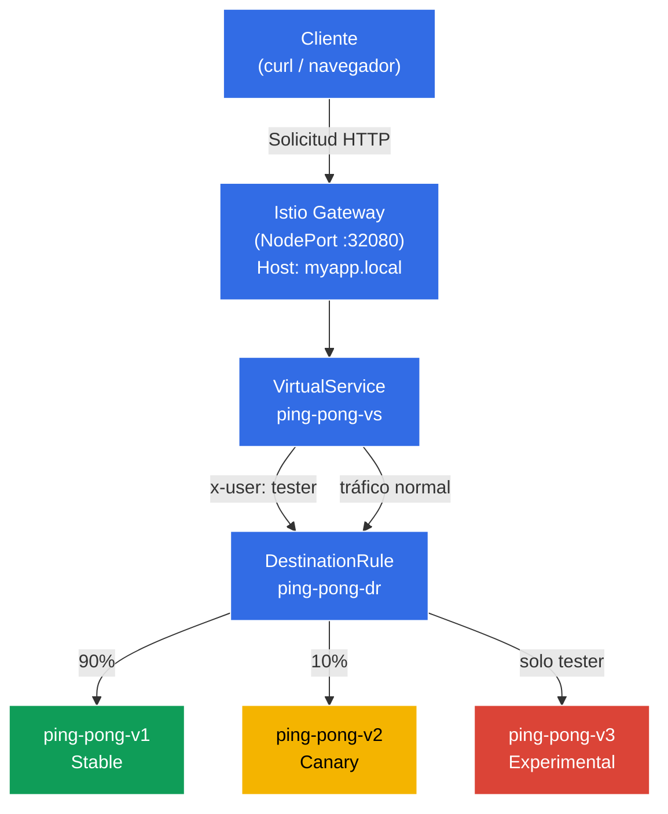

[RU version](README_RU.MD) · [Eng version](README.MD) · [Version française](README_FR.MD) · [Deutsche Version](README_DE.MD)
# Dark Launch (Lanzamiento oculto)

Los desarrolladores han lanzado una versión totalmente nueva y experimental de la aplicación: v3. Aún está inmadura y los usuarios normales bajo ningún concepto deben verla (deben permanecer en la v1 estable). Sin embargo, necesitas dar acceso a los ingenieros de QA para que verifiquen la lógica de funcionamiento en un clúster real de "producción". Los testers se identificarán mediante una cabecera HTTP especial: `x-user: tester`.

## Objetivo

Configurar desde cero las reglas de Istio (`DestinationRule` y `VirtualService`) de manera que el proxy Envoy intercepte el tráfico, lea las cabeceras HTTP y realice el enrutamiento en función de su contenido.

Gateway creado: http://myapp.local:32080

### Cómo funciona (esquema general)



## Infraestructura

El entorno se despliega en AWS (`eu-central-1`) mediante Terragrunt y consta de:

| Componente  | Descripción                                       |
|------------|---------------------------------------------------|
| `vpc`      | VPC `10.10.0.0/16` con subredes públicas          |
| `ssh-keys` | Claves SSH para el acceso a los nodos             |
| `k8s-1`    | Kubernetes `1.35.2` (kubeadm) con Istio instalado |
| `worker`   | Máquina de trabajo con `kubectl` y acceso al clúster |

Instancias: `t3.medium` (master) Ubuntu `22.04`

## Despliegue

```bash
TASK=02 make run_ica_task
```

## Paso 1. Activación de la inyección de sidecar

Añadimos una label al namespace `default` para la inyección automática del sidecar proxy Envoy:

```bash
kubectl label namespace default istio-injection=enabled
```

**Qué hace esto:** Istio funciona según el patrón sidecar. Cuando el namespace tiene la label `istio-injection=enabled`, Istio añade automáticamente a cada nuevo pod un contenedor adicional: `istio-proxy` (Envoy). Este proxy intercepta todo el tráfico de red entrante y saliente del pod, lo que permite a Istio gestionar el enrutamiento, la seguridad y la observabilidad sin modificar el código de la aplicación.

Precisamente por eso, en la columna `READY` veremos `2/2`: un contenedor con la aplicación y otro con el proxy Envoy.

## Paso 2. Instalación de la aplicación

Instalamos la aplicación en 3 versiones. Se crea un Service común de Kubernetes con el nombre `ping-pong`.

```bash
kubectl apply -f https://raw.githubusercontent.com/ViktorUJ/cks/refs/heads/master/tasks/ica/labs/02/k8s-1/scripts/1.yaml
```

**Qué se despliega:**
- **Service `ping-pong`** - un único servicio común con el selector `app: ping-pong`. Agrupa los pods de las tres versiones. Istio usará el `DestinationRule` para dividir el tráfico entre ellas.
- **Deployment `ping-pong-v1`** - versión estable (label `version: v1`), variable de entorno `SERVER_NAME: "Ping-Pong-V1 (Stable)"`.
- **Deployment `ping-pong-v2`** - versión canary (label `version: v2`), `SERVER_NAME: "Ping-Pong-V2 (Canary)"`.
- **Deployment `ping-pong-v3`** - versión experimental (label `version: v3`), `SERVER_NAME: "Ping-Pong-V3 (Experimental)"`.

Los tres Deployment usan la misma imagen Docker `viktoruj/ping_pong:latest`, pero se diferencian en la label `version` y en la variable de entorno `SERVER_NAME`. La label `version` es el elemento clave: es precisamente por ella que el `DestinationRule` agrupará los pods en subsets.

Verificamos que los pods se hayan levantado con el proxy Envoy:

```bash
kubectl get pods
```

```
NAME                            READY   STATUS    RESTARTS   AGE
ping-pong-v1-77cfd77f88-jk6wq   2/2     Running   0          29m
ping-pong-v2-685bbbd94f-brptj   2/2     Running   0          29m
ping-pong-v3-8448447987-bn6s8   2/2     Running   0          29m
```

**A qué prestar atención:** la columna `READY` muestra `2/2`. Esto significa que en cada pod funcionan 2 contenedores: la propia aplicación y el sidecar proxy Envoy (`istio-proxy`). Si ves `1/1`, significa que la inyección no funcionó: comprueba que la label `istio-injection=enabled` esté establecida en el namespace y que los pods se hayan recreado después de ello.

## Paso 3. Creación del DestinationRule

```bash
vim dl-destination-rule.yaml
```

```yaml
apiVersion: networking.istio.io/v1
kind: DestinationRule
metadata:
  name: ping-pong-dr
spec:
  host: ping-pong # Apuntamos al Service común de K8s
  subsets:
  - name: v1
    labels:
      version: v1 # Busca pods con la label version=v1
  - name: v2
    labels:
      version: v2
  - name: v3
    labels:
      version: v3
```

```bash
kubectl apply -f dl-destination-rule.yaml
```

**Qué es un DestinationRule y para qué sirve:**

El `DestinationRule` es un recurso de Istio que describe las políticas para el tráfico dirigido a un servicio concreto (en el campo `host`). Su tarea principal aquí es definir los **subsets** (subconjuntos).

- **`host: ping-pong`** - vinculación con el Service `ping-pong` de Kubernetes. Todas las reglas de este `DestinationRule` se aplicarán al tráfico que va hacia ese servicio.
- **`subsets`** - grupos lógicos de pods dentro de un mismo servicio. Cada subset se define por un conjunto de labels. Por ejemplo, el subset `v1` incluye todos los pods con la label `version: v1`.

Sin el `DestinationRule`, Istio no sabe cómo dividir en grupos los pods de un mismo servicio. El `VirtualService` hace referencia a estos subsets al enrutar, por ejemplo, "envía el 90% del tráfico al subset v1".

## Paso 4. Creación del VirtualService con reglas de enrutamiento

```bash
vim vs-virtual-service.yaml
```

```yaml
apiVersion: networking.istio.io/v1
kind: VirtualService
metadata:
  name: ping-pong-vs
spec:
  hosts:
  - "ping-pong"       # 1. Para el tráfico interno del clúster (mesh)
  - "myapp.local"     # 2. Para el tráfico externo (gateway)
  gateways:
  - ping-pong-gateway # Funciona para myapp.local
  - mesh              # Funciona para ping-pong
  http:
  # REGLA №1: Se activa SOLO si existe la cabecera x-user: tester
  - match:
    - headers:
        x-user:
          exact: tester
    route:
    - destination:
        host: ping-pong
        subset: v3

  # REGLA №2: Regla por defecto para todos los demás (Canary 90/10)
  - route:
    - destination:
        host: ping-pong
        subset: v1
      weight: 90
    - destination:
        host: ping-pong
        subset: v2
      weight: 10
```

```bash
kubectl apply -f vs-virtual-service.yaml
```

**Análisis del VirtualService por partes:**

El `VirtualService` es el recurso central de enrutamiento en Istio. Define cómo exactamente se distribuirá el tráfico entre los subsets.

- **`hosts`** - lista de hosts a los que se aplican las reglas:
  - `"ping-pong"` - nombre del Service de Kubernetes. Las reglas se aplicarán al tráfico interno del clúster (cuando un pod se comunica con otro a través de `http://ping-pong:8080`).
  - `"myapp.local"` - host externo. Las reglas se aplicarán al tráfico que llega a través del Gateway.

- **`gateways`** - define de dónde llega el tráfico:
  - `ping-pong-gateway` - tráfico desde fuera del clúster, a través del Istio Ingress Gateway.
  - `mesh` - palabra reservada especial en Istio. Designa todo el tráfico interno del clúster (pod-to-pod). Si no se indica `mesh`, las reglas solo funcionarán para el tráfico externo a través del Gateway.

- **Reglas `http`** - se procesan de arriba abajo, se activa la primera que coincida:
  - **Regla №1 (Dark Launch):** Si en la solicitud HTTP existe la cabecera `x-user` con el valor `tester`, todo el tráfico va al subset `v3` (versión experimental). Esto es precisamente el "lanzamiento oculto": los usuarios normales no conocen la v3, pero los testers pueden probarla en el clúster de producción.
  - **Regla №2 (Canary / Despliegue canary):** El resto de las solicitudes (sin la cabecera `x-user: tester`) se distribuyen: 90% a `v1` (estable) y 10% a `v2` (canary). Esto permite verificar gradualmente la v2 en una pequeña porción de tráfico real.

## Paso 5. Creación del Gateway para el acceso externo

```bash
vim gateway.yaml
```

```yaml
apiVersion: networking.istio.io/v1
kind: Gateway
metadata:
  name: ping-pong-gateway
spec:
  selector:
    istio: ingressgateway # Indicamos aplicar esta configuración a nuestro Ingress Gateway
  servers:
  - port:
      number: 80
      name: http
      protocol: HTTP
    hosts:
    - "myapp.local" # Aceptamos solicitudes a myapp.local; si se necesita para todos los hosts, entonces hosts: ["*"]
```

**Qué es un Gateway:**

El `Gateway` es un recurso de Istio que configura el proxy Envoy en el borde de la malla (Istio Ingress Gateway) para recibir tráfico entrante desde fuera del clúster.

- **`selector: istio: ingressgateway`** - indica a qué pod de Envoy aplicar esta configuración. En el clúster funciona el pod `istio-ingressgateway` (en el namespace `istio-system`): ese es el punto de entrada para el tráfico externo. El selector lo elige por su label.
- **`servers`** - describe en qué puerto y protocolo escuchar, y para qué hosts aceptar solicitudes:
  - `port: 80, protocol: HTTP` - aceptamos tráfico HTTP.
  - `hosts: ["myapp.local"]` - el Gateway solo procesará las solicitudes con la cabecera `Host: myapp.local`. Las solicitudes a otros hosts serán rechazadas. Si necesitas aceptar todos, usa `hosts: ["*"]`.

En nuestro laboratorio, el Istio Ingress Gateway está configurado como `NodePort` en el puerto `32080`, por lo que el acceso externo se realiza a través de `http://myapp.local:32080`.

## Paso 6. Pruebas

### Comprobación del despliegue canary (usuarios normales)

```bash
for i in {1..10}; do curl -s http://myapp.local:32080 | grep 'Server Name:' ; done
```

```
Server Name: Ping-Pong-V1 (Stable)
Server Name: Ping-Pong-V1 (Stable)
Server Name: Ping-Pong-V2 (Canary)  #  el 10% del tráfico va a v2
Server Name: Ping-Pong-V1 (Stable)
Server Name: Ping-Pong-V1 (Stable)
Server Name: Ping-Pong-V1 (Stable)
Server Name: Ping-Pong-V1 (Stable)
Server Name: Ping-Pong-V2 (Canary)
Server Name: Ping-Pong-V1 (Stable)
Server Name: Ping-Pong-V1 (Stable)
```

**Qué vemos:** Sin cabeceras especiales se activa la Regla №2 del VirtualService. Aproximadamente el 90% de las solicitudes llegan a v1 (Stable) y el 10% a v2 (Canary). La versión v3 no aparece ni una sola vez: está completamente oculta para los usuarios normales.

### Comprobación del lanzamiento oculto (testers)

Ahora añadimos la cabecera `x-user: tester` y comprobamos que siempre llegamos a v3:

```bash
curl -s -H "x-user: tester" http://myapp.local:32080/ | grep 'Server Name:'
```

```
Server Name: Ping-Pong-V3 (Experimental)
```

**Qué vemos:** Con la cabecera `x-user: tester` se activa la Regla №1: el 100% del tráfico va a v3 (Experimental). Esto es precisamente el Dark Launch: los testers trabajan con la versión experimental en el clúster de producción, mientras que los usuarios normales ni siquiera sospechan de su existencia.
