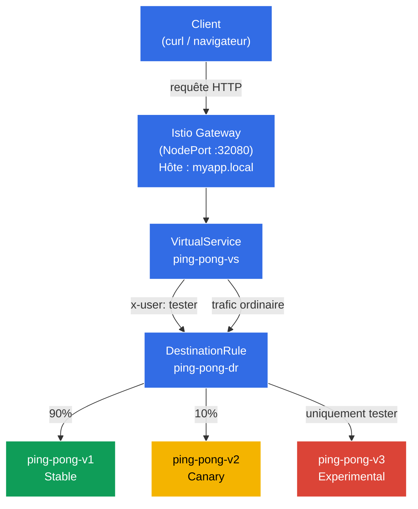

[RU version](README_RU.MD) · [Eng version](README.MD) · [Versión en español](README_ES.MD) · [Deutsche Version](README_DE.MD)
# Dark Launch (Lancement fantôme)

Les développeurs ont déployé une version totalement nouvelle et expérimentale de l'application - v3. Elle est encore instable, et les utilisateurs ordinaires ne doivent en aucun cas la voir (ils doivent rester sur la v1 stable). Cependant, vous devez y donner accès aux ingénieurs QA afin qu'ils vérifient la logique de fonctionnement sur un véritable cluster « de production ». Les testeurs seront identifiés à l'aide d'un en-tête HTTP spécial : `x-user: tester`.

## Objectif

Configurer à partir de zéro les règles Istio (`DestinationRule` et `VirtualService`) de manière à ce que le proxy Envoy intercepte le trafic, lise les en-têtes HTTP et effectue le routage en fonction de leur contenu.

Gateway créé : http://myapp.local:32080

### Comment ça marche (schéma général)



## Infrastructure

L'environnement est déployé dans AWS (`eu-central-1`) via Terragrunt et se compose de :

| Composant  | Description                                          |
|------------|---------------------------------------------------|
| `vpc`      | VPC `10.10.0.0/16` avec des sous-réseaux publics          |
| `ssh-keys` | Clés SSH pour l'accès aux nœuds                      |
| `k8s-1`    | Kubernetes `1.35.2` (kubeadm) avec Istio installé |
| `worker`   | Machine de travail avec `kubectl` et accès au cluster   |

Instances : `t3.medium` (master) Ubuntu `22.04`

## Déploiement

```bash
TASK=02 make run_ica_task
```

## Étape 1. Activation de l'injection de sidecar

On ajoute un label sur le namespace `default` pour l'injection automatique du sidecar proxy Envoy :

```bash
kubectl label namespace default istio-injection=enabled
```

**Ce que cela fait :** Istio fonctionne selon le principe du pattern sidecar. Lorsque le namespace porte le label `istio-injection=enabled`, Istio ajoute automatiquement à chaque nouveau pod un conteneur supplémentaire - `istio-proxy` (Envoy). Ce proxy intercepte tout le trafic réseau entrant et sortant du pod, ce qui permet à Istio de gérer le routage, la sécurité et l'observabilité sans modifier le code de l'application.

C'est justement pour cela que dans la colonne `READY` nous verrons `2/2` - un conteneur avec l'application et un avec le proxy Envoy.

## Étape 2. Installation de l'application

On installe l'application en 3 versions. Un Service Kubernetes commun nommé `ping-pong` est créé.

```bash
kubectl apply -f https://raw.githubusercontent.com/ViktorUJ/cks/refs/heads/master/tasks/ica/labs/02/k8s-1/scripts/1.yaml
```

**Ce qui est déployé :**
- **Service `ping-pong`** - un service commun unique avec le sélecteur `app: ping-pong`. Il regroupe les trois versions de pods. Istio utilisera le `DestinationRule` pour répartir le trafic entre elles.
- **Deployment `ping-pong-v1`** - version stable (label `version: v1`), variable d'environnement `SERVER_NAME: "Ping-Pong-V1 (Stable)"`.
- **Deployment `ping-pong-v2`** - version canary (label `version: v2`), `SERVER_NAME: "Ping-Pong-V2 (Canary)"`.
- **Deployment `ping-pong-v3`** - version expérimentale (label `version: v3`), `SERVER_NAME: "Ping-Pong-V3 (Experimental)"`.

Les trois Deployment utilisent la même image Docker `viktoruj/ping_pong:latest`, mais diffèrent par le label `version` et la variable d'environnement `SERVER_NAME`. Le label `version` est l'élément clé : c'est sur lui que le `DestinationRule` regroupera les pods en subsets.

On vérifie que les pods sont démarrés avec le proxy Envoy :

```bash
kubectl get pods
```

```
NAME                            READY   STATUS    RESTARTS   AGE
ping-pong-v1-77cfd77f88-jk6wq   2/2     Running   0          29m
ping-pong-v2-685bbbd94f-brptj   2/2     Running   0          29m
ping-pong-v3-8448447987-bn6s8   2/2     Running   0          29m
```

**À noter :** la colonne `READY` affiche `2/2`. Cela signifie que dans chaque pod tournent 2 conteneurs : l'application elle-même et le sidecar proxy Envoy (`istio-proxy`). Si vous voyez `1/1`, c'est que l'injection n'a pas fonctionné - vérifiez que le label `istio-injection=enabled` est bien positionné sur le namespace et que les pods ont été recréés après.

## Étape 3. Création du DestinationRule

```bash
vim dl-destination-rule.yaml
```

```yaml
apiVersion: networking.istio.io/v1
kind: DestinationRule
metadata:
  name: ping-pong-dr
spec:
  host: ping-pong # Pointe vers le Service K8s commun
  subsets:
  - name: v1
    labels:
      version: v1 # Cherche les pods avec le label version=v1
  - name: v2
    labels:
      version: v2
  - name: v3
    labels:
      version: v3
```

```bash
kubectl apply -f dl-destination-rule.yaml
```

**Qu'est-ce qu'un DestinationRule et à quoi sert-il :**

`DestinationRule` est une ressource Istio qui décrit les politiques pour le trafic dirigé vers un service précis (dans le champ `host`). Sa tâche principale ici est de définir des **subsets** (sous-ensembles).

- **`host: ping-pong`** - liaison au Service Kubernetes `ping-pong`. Toutes les règles de ce `DestinationRule` s'appliqueront au trafic allant vers ce service.
- **`subsets`** - groupes logiques de pods au sein d'un même service. Chaque subset est défini par un ensemble de labels. Par exemple, le subset `v1` inclut tous les pods avec le label `version: v1`.

Sans `DestinationRule`, Istio ne sait pas comment répartir les pods d'un même service en groupes. Le `VirtualService` fait référence à ces subsets lors du routage - par exemple, « envoie 90% du trafic vers le subset v1 ».

## Étape 4. Création du VirtualService avec des règles de routage

```bash
vim vs-virtual-service.yaml
```

```yaml
apiVersion: networking.istio.io/v1
kind: VirtualService
metadata:
  name: ping-pong-vs
spec:
  hosts:
  - "ping-pong"       # 1. Pour le trafic intra-cluster (mesh)
  - "myapp.local"     # 2. Pour le trafic externe (gateway)
  gateways:
  - ping-pong-gateway # Fonctionne pour myapp.local
  - mesh              # Fonctionne pour ping-pong
  http:
  # RÈGLE N°1 : Ne se déclenche QUE si l'en-tête x-user: tester est présent
  - match:
    - headers:
        x-user:
          exact: tester
    route:
    - destination:
        host: ping-pong
        subset: v3

  # RÈGLE N°2 : Règle par défaut pour tous les autres (Canary 90/10)
  - route:
    - destination:
        host: ping-pong
        subset: v1
      weight: 90
    - destination:
        host: ping-pong
        subset: v2
      weight: 10
```

```bash
kubectl apply -f vs-virtual-service.yaml
```

**Analyse du VirtualService par parties :**

`VirtualService` est la ressource de routage centrale dans Istio. Il définit comment exactement le trafic sera réparti entre les subsets.

- **`hosts`** - liste des hôtes pour lesquels les règles s'appliquent :
  - `"ping-pong"` - nom du Service Kubernetes. Les règles s'appliqueront au trafic intra-cluster (lorsqu'un pod s'adresse à un autre via `http://ping-pong:8080`).
  - `"myapp.local"` - hôte externe. Les règles s'appliqueront au trafic arrivant par le Gateway.

- **`gateways`** - définit d'où provient le trafic :
  - `ping-pong-gateway` - trafic venant de l'extérieur du cluster, via l'Istio Ingress Gateway.
  - `mesh` - mot réservé spécial dans Istio. Désigne tout le trafic intra-cluster (pod-to-pod). Si `mesh` n'est pas indiqué, les règles ne fonctionneront que pour le trafic externe via le Gateway.

- **Règles `http`** - traitées de haut en bas, la première qui correspond se déclenche :
  - **Règle N°1 (Dark Launch) :** Si la requête HTTP contient l'en-tête `x-user` avec la valeur `tester` - tout le trafic part vers le subset `v3` (version expérimentale). C'est justement le « lancement fantôme » - les utilisateurs ordinaires ne connaissent pas la v3, tandis que les testeurs peuvent la vérifier sur le cluster de production.
  - **Règle N°2 (Canary / déploiement canary) :** Toutes les autres requêtes (sans l'en-tête `x-user: tester`) sont réparties : 90% vers `v1` (stable) et 10% vers `v2` (canary). Cela permet de vérifier progressivement la v2 sur une petite part du trafic réel.

## Étape 5. Création du Gateway pour l'accès depuis l'extérieur

```bash
vim gateway.yaml
```

```yaml
apiVersion: networking.istio.io/v1
kind: Gateway
metadata:
  name: ping-pong-gateway
spec:
  selector:
    istio: ingressgateway # On demande d'appliquer ces réglages à notre Ingress Gateway
  servers:
  - port:
      number: 80
      name: http
      protocol: HTTP
    hosts:
    - "myapp.local" # On accepte les requêtes sur myapp.local ; si besoin sur tous les hôtes, alors hosts: ["*"]
```

**Qu'est-ce qu'un Gateway :**

`Gateway` est une ressource Istio qui configure le proxy Envoy à la frontière du maillage (Istio Ingress Gateway) pour recevoir le trafic entrant depuis l'extérieur du cluster.

- **`selector: istio: ingressgateway`** - indique à quel pod Envoy appliquer cette configuration. Dans le cluster tourne le pod `istio-ingressgateway` (dans le namespace `istio-system`) - c'est justement le point d'entrée pour le trafic externe. Le selector le choisit par son label.
- **`servers`** - décrit sur quel port et protocole écouter, et pour quels hôtes accepter les requêtes :
  - `port: 80, protocol: HTTP` - on accepte le trafic HTTP.
  - `hosts: ["myapp.local"]` - le Gateway ne traitera que les requêtes avec l'en-tête `Host: myapp.local`. Les requêtes vers d'autres hôtes seront rejetées. Si vous devez tout accepter - utilisez `hosts: ["*"]`.

Dans notre travail pratique, l'Istio Ingress Gateway est configuré en `NodePort` sur le port `32080`, c'est pourquoi l'accès depuis l'extérieur se fait via `http://myapp.local:32080`.

## Étape 6. Tests

### Vérification du déploiement canary (utilisateurs ordinaires)

```bash
for i in {1..10}; do curl -s http://myapp.local:32080 | grep 'Server Name:' ; done
```

```
Server Name: Ping-Pong-V1 (Stable)
Server Name: Ping-Pong-V1 (Stable)
Server Name: Ping-Pong-V2 (Canary)  #  10% du trafic va vers v2
Server Name: Ping-Pong-V1 (Stable)
Server Name: Ping-Pong-V1 (Stable)
Server Name: Ping-Pong-V1 (Stable)
Server Name: Ping-Pong-V1 (Stable)
Server Name: Ping-Pong-V2 (Canary)
Server Name: Ping-Pong-V1 (Stable)
Server Name: Ping-Pong-V1 (Stable)
```

**Ce que l'on voit :** Sans en-têtes particuliers, c'est la Règle N°2 du VirtualService qui se déclenche. Environ 90% des requêtes tombent sur v1 (Stable) et 10% sur v2 (Canary). La version v3 n'apparaît jamais - elle est totalement cachée aux utilisateurs ordinaires.

### Vérification du lancement fantôme (testeurs)

Ajoutons maintenant l'en-tête `x-user: tester` et vérifions que nous tombons toujours sur v3 :

```bash
curl -s -H "x-user: tester" http://myapp.local:32080/ | grep 'Server Name:'
```

```
Server Name: Ping-Pong-V3 (Experimental)
```

**Ce que l'on voit :** Avec l'en-tête `x-user: tester`, c'est la Règle N°1 qui se déclenche - 100% du trafic part vers v3 (Experimental). C'est cela le Dark Launch : les testeurs travaillent avec la version expérimentale sur le cluster de production, tandis que les utilisateurs ordinaires ne soupçonnent même pas son existence.
