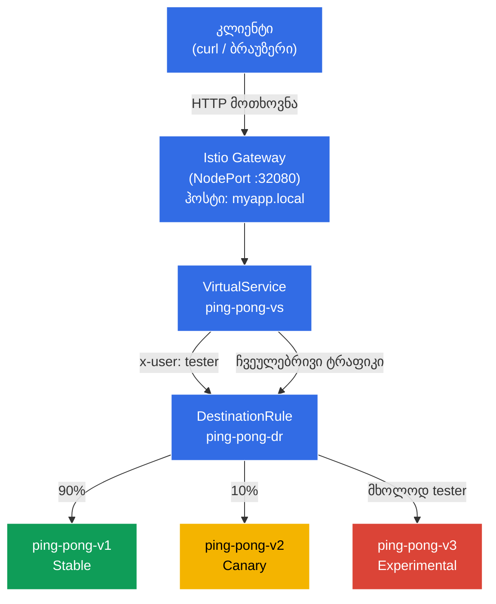

[Русская версия](README_RU.MD) · [Eng version](README.MD) · [Versión en español](README_ES.MD) · [Version française](README_FR.MD) · [Deutsche Version](README_DE.MD) · [繁體中文版](README_TW.MD) · [日本語版](README_JP.MD)
# Dark Launch (ფარული გაშვება)

> [საცნობარო გადაწყვეტა](worker/files/solutions/1_GE.MD)

დეველოპერებმა აპლიკაციის სრულიად ახალი, ექსპერიმენტული ვერსია - v3 - გამოუშვეს. ის ჯერ კიდევ დაუმუშავებელია და ჩვეულებრივმა მომხმარებლებმა არავითარ შემთხვევაში არ უნდა ნახონ (ისინი სტაბილურ v1-ზე უნდა დარჩნენ). თუმცა, საჭიროა QA ინჟინრებისთვის მასზე წვდომის მიცემა, რათა მათ რეალურ „საბრძოლო“ კლასტერში მუშაობის ლოგიკა შეამოწმონ. ტესტერები სპეციალური HTTP სათაურის საშუალებით ამოიცნობიან: `x-user: tester`.

## მიზანი

Istio-ს წესების (`DestinationRule` და `VirtualService`) ნულიდან ისე კონფიგურირება, რომ Envoy პროქსიმ ტრაფიკი ჩაიჭიროს, HTTP სათაურები წაიკითხოს და მათი შიგთავსის საფუძველზე მარშრუტიზაცია შეასრულოს.

შექმნილია Gateway: http://myapp.local:32080

### როგორ მუშაობს (ზოგადი სქემა)



## ინფრასტრუქტურა

გარემო AWS-ში (`eu-central-1`) Terragrunt-ის მეშვეობით იშლება და შედგება შემდეგი კომპონენტებისგან:

| კომპონენტი | აღწერა                                              |
|------------|-----------------------------------------------------|
| `vpc`      | VPC `10.10.0.0/16` საჯარო ქვექსელებით               |
| `ssh-keys` | SSH გასაღებები ნოდებზე წვდომისთვის                   |
| `k8s-1`    | Kubernetes `1.35.2` (kubeadm) დაყენებული Istio-თი   |
| `worker`   | სამუშაო მანქანა `kubectl`-ითა და კლასტერზე წვდომით   |

ინსტანსები: `t3.medium` (master) Ubuntu `22.04`

## გაშლა

```bash
TASK=02 make run_ica_task
```

## ნაბიჯი 1. sidecar ინექციის ჩართვა

Envoy sidecar პროქსის ავტომატური ინექციისთვის `default` namespace-ს ვამატებთ label-ს:

```bash
kubectl label namespace default istio-injection=enabled
```

**რას აკეთებს ეს:** Istio sidecar პატერნით მუშაობს. როდესაც namespace-ზე დაყენებულია label `istio-injection=enabled`, Istio ყოველ ახალ პოდს ავტომატურად უმატებს დამატებით კონტეინერს - `istio-proxy`-ს (Envoy). ეს პროქსი პოდის მთელ შემომავალ და გამავალ ქსელურ ტრაფიკს იჭერს, რაც Istio-ს საშუალებას აძლევს, აპლიკაციის კოდის შეცვლის გარეშე მართოს მარშრუტიზაცია, უსაფრთხოება და დაკვირვებადობა.

სწორედ ამიტომ `READY` სვეტში ვიხილავთ `2/2`-ს - ერთი კონტეინერი აპლიკაციით და ერთი Envoy პროქსით.

## ნაბიჯი 2. აპლიკაციის დაყენება

აპლიკაციას 3 ვერსიად ვაყენებთ. შექმნილია საერთო Kubernetes Service სახელწოდებით `ping-pong`.

```bash
kubectl apply -f https://raw.githubusercontent.com/ViktorUJ/cks/refs/heads/master/tasks/ica/labs/02/k8s-1/scripts/1.yaml
```

**რა იშლება:**
- **Service `ping-pong`** - ერთი საერთო სერვისი სელექტორით `app: ping-pong`. ის პოდების სამივე ვერსიას აერთიანებს. Istio მათ შორის ტრაფიკის გასანაწილებლად `DestinationRule`-ს გამოიყენებს.
- **Deployment `ping-pong-v1`** - სტაბილური ვერსია (label `version: v1`), გარემოს ცვლადი `SERVER_NAME: "Ping-Pong-V1 (Stable)"`.
- **Deployment `ping-pong-v2`** - კანარული ვერსია (label `version: v2`), `SERVER_NAME: "Ping-Pong-V2 (Canary)"`.
- **Deployment `ping-pong-v3`** - ექსპერიმენტული ვერსია (label `version: v3`), `SERVER_NAME: "Ping-Pong-V3 (Experimental)"`.

სამივე Deployment ერთსა და იმავე Docker image-ს - `viktoruj/ping_pong:latest` - იყენებს, თუმცა განსხვავდება label-ით `version` და გარემოს ცვლადით `SERVER_NAME`. Label `version` საკვანძო ელემენტია: სწორედ მისი მიხედვით დააჯგუფებს `DestinationRule` პოდებს subsets-ად.

ვამოწმებთ, რომ პოდები Envoy პროქსით გაეშვა:

```bash
kubectl get pods
```

```
NAME                            READY   STATUS    RESTARTS   AGE
ping-pong-v1-77cfd77f88-jk6wq   2/2     Running   0          29m
ping-pong-v2-685bbbd94f-brptj   2/2     Running   0          29m
ping-pong-v3-8448447987-bn6s8   2/2     Running   0          29m
```

**რას უნდა მიაქციოთ ყურადღება:** `READY` სვეტი აჩვენებს `2/2`-ს. ეს ნიშნავს, რომ თითოეულ პოდში 2 კონტეინერი მუშაობს: თავად აპლიკაცია და Envoy sidecar პროქსი (`istio-proxy`). თუ ხედავთ `1/1`-ს, ინექცია არ შესრულებულა - შეამოწმეთ, რომ label `istio-injection=enabled` namespace-ზეა დაყენებული და ამის შემდეგ პოდები თავიდან შეიქმნა.

## ნაბიჯი 3. DestinationRule-ის შექმნა

```bash
vim dl-destination-rule.yaml
```

```yaml
apiVersion: networking.istio.io/v1
kind: DestinationRule
metadata:
  name: ping-pong-dr
spec:
  host: ping-pong # მიუთითებს საერთო K8s Service-ზე
  subsets:
  - name: v1
    labels:
      version: v1 # ეძებს პოდებს ლეიბლით version=v1
  - name: v2
    labels:
      version: v2
  - name: v3
    labels:
      version: v3
```

```bash
kubectl apply -f dl-destination-rule.yaml
```

**რა არის DestinationRule და რისთვის არის საჭირო:**

`DestinationRule` არის Istio-ს რესურსი, რომელიც კონკრეტული სერვისისკენ (`host` ველში) მიმართულ ტრაფიკის პოლიტიკებს აღწერს. მისი მთავარი ამოცანა აქ **subsets**-ის (ქვეჯგუფების) განსაზღვრაა.

- **`host: ping-pong`** - Kubernetes Service `ping-pong`-თან მიბმა. ამ `DestinationRule`-ის ყველა წესი ამ სერვისისკენ მიმავალ ტრაფიკზე გავრცელდება.
- **`subsets`** - პოდების ლოგიკური ჯგუფები ერთი სერვისის ფარგლებში. თითოეული subset label-ების ნაკრებით განისაზღვრება. მაგალითად, subset `v1` მოიცავს ყველა პოდს label-ით `version: v1`.

`DestinationRule`-ის გარეშე Istio-მ არ იცის, როგორ დაყოს ერთი სერვისის პოდები ჯგუფებად. მარშრუტიზაციისას `VirtualService` ამ subsets-ს მიმართავს - მაგალითად, „ტრაფიკის 90% subset v1-ზე გაგზავნე“.

## ნაბიჯი 4. VirtualService-ის შექმნა მარშრუტიზაციის წესებით

```bash
vim vs-virtual-service.yaml
```

```yaml
apiVersion: networking.istio.io/v1
kind: VirtualService
metadata:
  name: ping-pong-vs
spec:
  hosts:
  - "ping-pong"       # 1. კლასტერშიდა ტრაფიკისთვის (mesh)
  - "myapp.local"     # 2. გარე ტრაფიკისთვის (gateway)
  gateways:
  - ping-pong-gateway # მუშაობს myapp.local-ისთვის
  - mesh              # მუშაობს ping-pong-ისთვის
  http:
  # წესი №1: ამოქმედდება მხოლოდ თუ არსებობს სათაური x-user: tester
  - match:
    - headers:
        x-user:
          exact: tester
    route:
    - destination:
        host: ping-pong
        subset: v3

  # წესი №2: ნაგულისხმევი წესი ყველა დანარჩენისთვის (კანარული 90/10)
  - route:
    - destination:
        host: ping-pong
        subset: v1
      weight: 90
    - destination:
        host: ping-pong
        subset: v2
      weight: 10
```

```bash
kubectl apply -f vs-virtual-service.yaml
```

**VirtualService-ის ნაწილებად განხილვა:**

`VirtualService` Istio-ში მარშრუტიზაციის ცენტრალური რესურსია. ის განსაზღვრავს, კონკრეტულად როგორ განაწილდება ტრაფიკი subsets-ს შორის.

- **`hosts`** - ჰოსტების სია, რომლებზეც წესები ვრცელდება:
  - `"ping-pong"` - Kubernetes Service-ის სახელი. წესები შიდაკლასტერულ ტრაფიკზე გავრცელდება (როდესაც ერთი პოდი მეორეს `http://ping-pong:8080`-ის საშუალებით უკავშირდება).
  - `"myapp.local"` - გარე ჰოსტი. წესები Gateway-ის გავლით შემოსულ ტრაფიკზე გავრცელდება.

- **`gateways`** - განსაზღვრავს, საიდან მოდის ტრაფიკი:
  - `ping-pong-gateway` - ტრაფიკი კლასტერის გარედან, Istio Ingress Gateway-ის გავლით.
  - `mesh` - სპეციალური რეზერვირებული სიტყვა Istio-ში. ნიშნავს მთელ შიდაკლასტერულ ტრაფიკს (pod-to-pod). თუ `mesh` მითითებული არ არის, წესები მხოლოდ Gateway-ის გავლით შემოსულ გარე ტრაფიკზე იმუშავებს.

- **`http` წესები** - მუშავდება ზემოდან ქვემოთ და სრულდება პირველი შესაბამისი წესი:
  - **წესი №1 (Dark Launch):** თუ HTTP მოთხოვნაში არის სათაური `x-user` მნიშვნელობით `tester`, მთელი ტრაფიკი subset `v3`-ზე (ექსპერიმენტულ ვერსიაზე) გადადის. სწორედ ეს არის „ფარული გაშვება“ - ჩვეულებრივმა მომხმარებლებმა v3-ის შესახებ არ იციან, ხოლო ტესტერებს მისი საბრძოლო კლასტერში შემოწმება შეუძლიათ.
  - **წესი №2 (Canary / კანარული დეპლოი):** ყველა დანარჩენი მოთხოვნა (`x-user: tester` სათაურის გარეშე) ასე ნაწილდება: 90% `v1`-ზე (სტაბილური) და 10% `v2`-ზე (კანარული). ეს საშუალებას გვაძლევს, v2 რეალური ტრაფიკის მცირე წილზე თანდათან შევამოწმოთ.

## ნაბიჯი 5. გარედან წვდომისთვის Gateway-ის შექმნა

```bash
vim gateway.yaml
```

```yaml
apiVersion: networking.istio.io/v1
kind: Gateway
metadata:
  name: ping-pong-gateway
spec:
  selector:
    istio: ingressgateway # ვეუბნებით, რომ ეს პარამეტრები ჩვენს Ingress-შლუზზე გამოიყენოს
  servers:
  - port:
      number: 80
      name: http
      protocol: HTTP
    hosts:
    - "myapp.local" # ვიღებთ მოთხოვნებს myapp.local-ზე, თუ ყველა ჰოსტისთვისაა საჭირო, მაშინ hosts: ["*"]
```

**რა არის Gateway:**

`Gateway` არის Istio-ს რესურსი, რომელიც mesh ქსელის საზღვარზე Envoy პროქსის (Istio Ingress Gateway) კლასტერის გარედან შემომავალი ტრაფიკის მისაღებად აკონფიგურირებს.

- **`selector: istio: ingressgateway`** - მიუთითებს, Envoy-ის რომელ პოდზე უნდა გავრცელდეს ეს კონფიგურაცია. კლასტერში მუშაობს პოდი `istio-ingressgateway` (namespace-ში `istio-system`) - სწორედ ეს არის გარე ტრაფიკის შესასვლელი წერტილი. Selector მას label-ის მიხედვით ირჩევს.
- **`servers`** - აღწერს, რომელ პორტსა და პროტოკოლზე უნდა მოხდეს მოსმენა და რომელი ჰოსტებისთვის უნდა მიიღოს მოთხოვნები:
  - `port: 80, protocol: HTTP` - ვიღებთ HTTP ტრაფიკს.
  - `hosts: ["myapp.local"]` - Gateway დაამუშავებს მხოლოდ მოთხოვნებს სათაურით `Host: myapp.local`. სხვა ჰოსტებზე გაგზავნილი მოთხოვნები უარყოფილი იქნება. თუ ყველა ჰოსტის მიღებაა საჭირო, გამოიყენეთ `hosts: ["*"]`.

ამ ლაბორატორიულ სამუშაოში Istio Ingress Gateway კონფიგურირებულია როგორც `NodePort` პორტზე `32080`, ამიტომ გარედან წვდომა ხორციელდება მისამართით `http://myapp.local:32080`.

## ნაბიჯი 6. ტესტირება

### კანარული დეპლოის შემოწმება (ჩვეულებრივი მომხმარებლები)

```bash
for i in {1..10}; do curl -s http://myapp.local:32080 | grep 'Server Name:' ; done
```

```
Server Name: Ping-Pong-V1 (Stable)
Server Name: Ping-Pong-V1 (Stable)
Server Name: Ping-Pong-V2 (Canary)  #  ტრაფიკის 10% მიდის v2-ზე
Server Name: Ping-Pong-V1 (Stable)
Server Name: Ping-Pong-V1 (Stable)
Server Name: Ping-Pong-V1 (Stable)
Server Name: Ping-Pong-V1 (Stable)
Server Name: Ping-Pong-V2 (Canary)
Server Name: Ping-Pong-V1 (Stable)
Server Name: Ping-Pong-V1 (Stable)
```

**რას ვხედავთ:** სპეციალური სათაურების გარეშე VirtualService-ის წესი №2 სრულდება. მოთხოვნების დაახლოებით 90% ხვდება v1-ზე (Stable), ხოლო 10% - v2-ზე (Canary). ვერსია v3 არც ერთხელ არ ჩნდება - ის სრულიად დამალულია ჩვეულებრივი მომხმარებლებისგან.

### ფარული გაშვების შემოწმება (ტესტერები)

ახლა დავამატოთ სათაური `x-user: tester` და შევამოწმოთ, რომ ყოველთვის v3-ზე ვხვდებით:

```bash
curl -s -H "x-user: tester" http://myapp.local:32080/ | grep 'Server Name:'
```

```
Server Name: Ping-Pong-V3 (Experimental)
```

**რას ვხედავთ:** სათაურით `x-user: tester` წესი №1 სრულდება - ტრაფიკის 100% v3-ზე (Experimental) გადადის. სწორედ ეს არის Dark Launch: ტესტერები ექსპერიმენტულ ვერსიასთან საბრძოლო კლასტერში მუშაობენ, ჩვეულებრივ მომხმარებლებს კი მისი არსებობის შესახებ წარმოდგენაც არ აქვთ.
